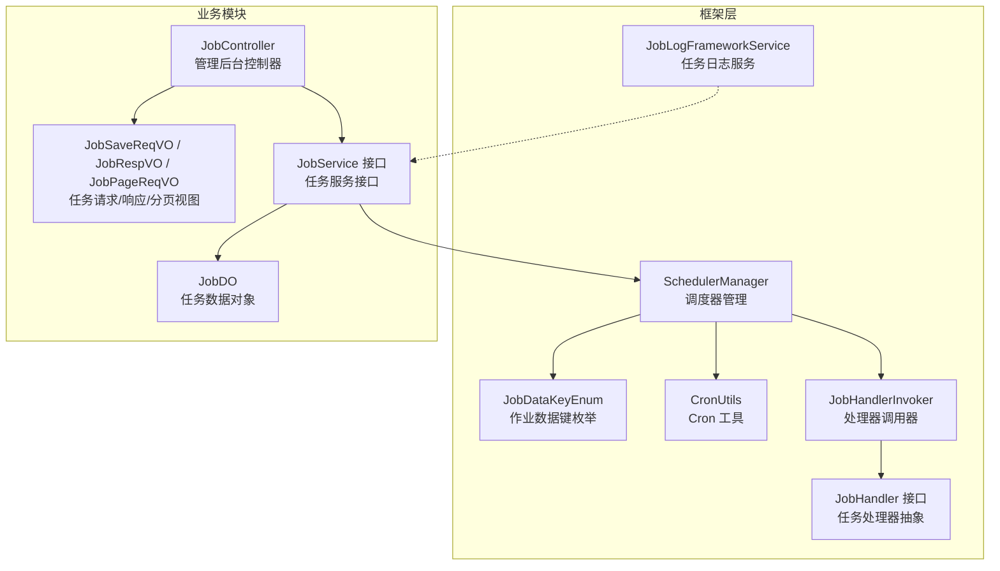
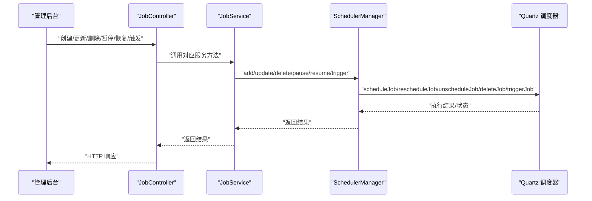
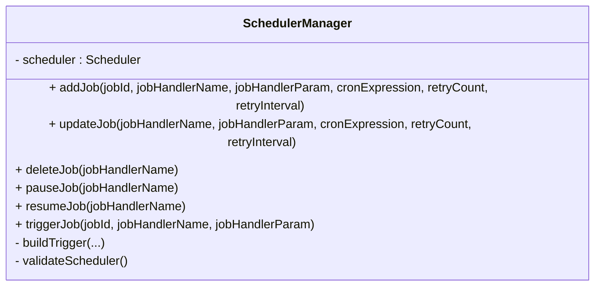
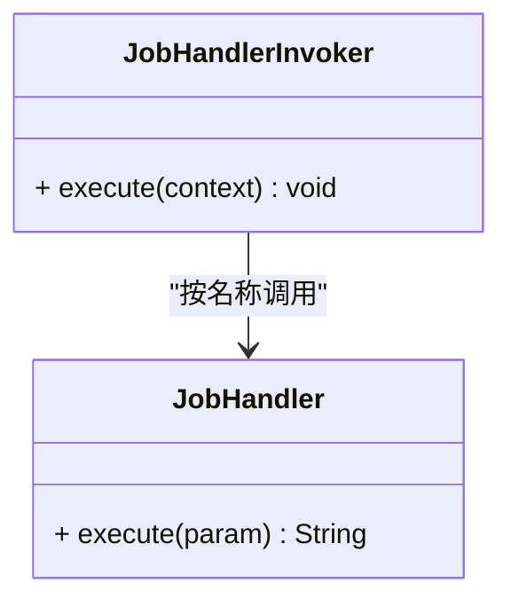
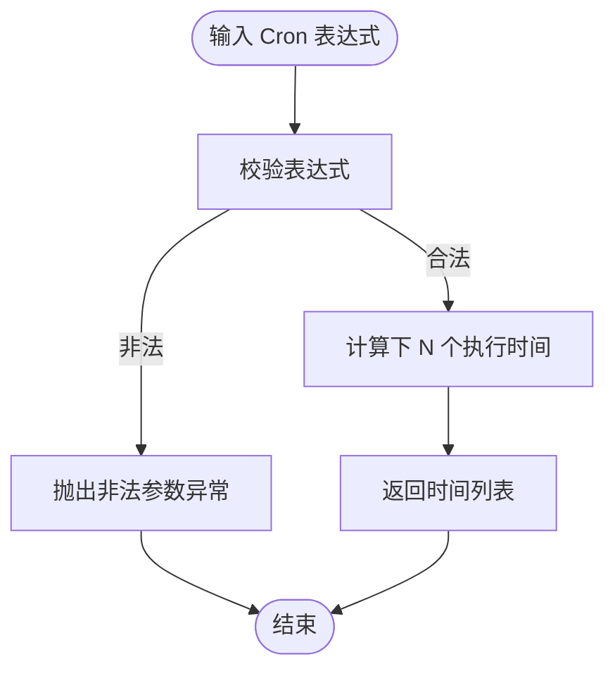
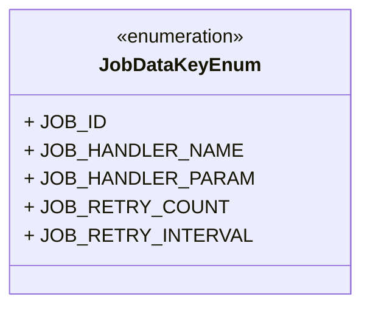
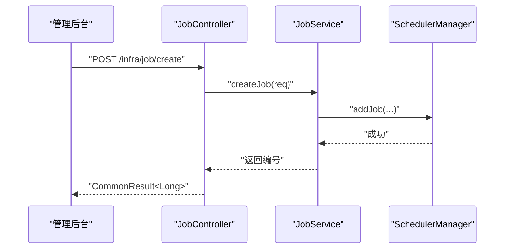
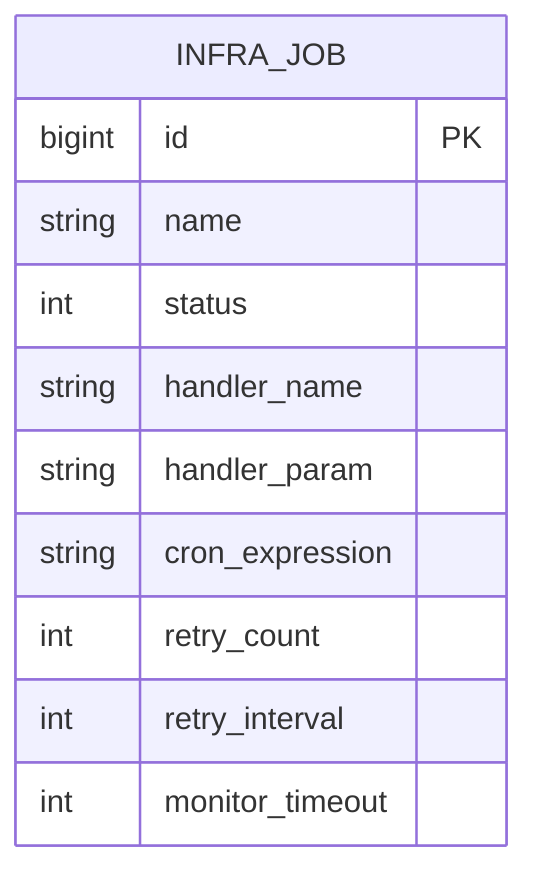
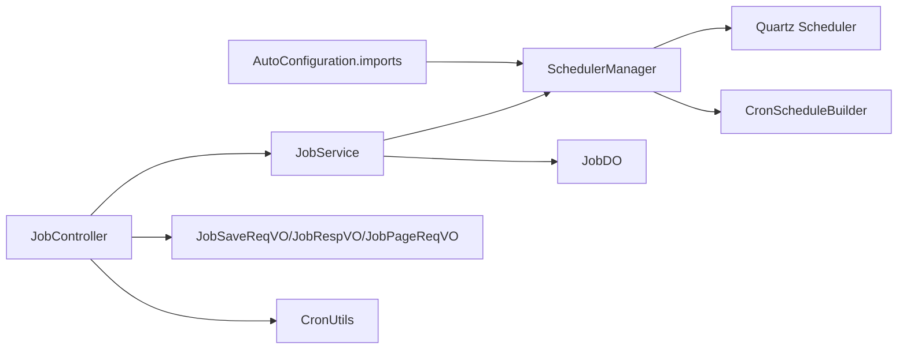

# 定时任务管理

<cite>
**本文引用的文件**
- [org.springframework.boot.autoconfigure.AutoConfiguration.imports](file://backend/qiji-framework/qiji-spring-boot-starter-job/src/main/resources/META-INF/spring/org.springframework.boot.autoconfigure.AutoConfiguration.imports)
- [JobDataKeyEnum.java](file://backend/qiji-framework/qiji-spring-boot-starter-job/src/main/java/com/qiji/cps/framework/quartz/core/enums/JobDataKeyEnum.java)
- [JobHandler.java](file://backend/qiji-framework/qiji-spring-boot-starter-job/src/main/java/com/qiji/cps/framework/quartz/core/handler/JobHandler.java)
- [JobHandlerInvoker.java](file://backend/qiji-framework/qiji-spring-boot-starter-job/src/main/java/com/qiji/cps/framework/quartz/core/handler/JobHandlerInvoker.java)
- [JobLogFrameworkService.java](file://backend/qiji-framework/qiji-spring-boot-starter-job/src/main/java/com/qiji/cps/framework/quartz/core/service/JobLogFrameworkService.java)
- [SchedulerManager.java](file://backend/qiji-framework/qiji-spring-boot-starter-job/src/main/java/com/qiji/cps/framework/quartz/core/scheduler/SchedulerManager.java)
- [CronUtils.java](file://backend/qiji-framework/qiji-spring-boot-starter-job/src/main/java/com/qiji/cps/framework/quartz/core/util/CronUtils.java)
- [JobController.java](file://backend/qiji-module-infra/src/main/java/com/qiji/cps/module/infra/controller/admin/job/JobController.java)
- [JobService.java](file://backend/qiji-module-infra/src/main/java/com/qiji/cps/module/infra/service/job/JobService.java)
- [JobDO.java](file://backend/qiji-module-infra/src/main/java/com/qiji/cps/module/infra/dal/dataobject/job/JobDO.java)
- [JobPageReqVO.java](file://backend/qiji-module-infra/src/main/java/com/qiji/cps/module/infra/controller/admin/job/vo/job/JobPageReqVO.java)
- [JobRespVO.java](file://backend/qiji-module-infra/src/main/java/com/qiji/cps/module/infra/controller/admin/job/vo/job/JobRespVO.java)
- [JobSaveReqVO.java](file://backend/qiji-module-infra/src/main/java/com/qiji/cps/module/infra/controller/admin/job/vo/job/JobSaveReqVO.java)
- [JobLogPageReqVO.java](file://backend/qiji-module-infra/src/main/java/com/qiji/cps/module/infra/controller/admin/job/vo/log/JobLogPageReqVO.java)
- [quartz.sql](file://backend/sql/mysql/quartz.sql)
</cite>

## 目录
1. [简介](#简介)
2. [项目结构](#项目结构)
3. [核心组件](#核心组件)
4. [架构总览](#架构总览)
5. [详细组件分析](#详细组件分析)
6. [依赖分析](#依赖分析)
7. [性能考虑](#性能考虑)
8. [故障排查指南](#故障排查指南)
9. [结论](#结论)
10. [附录](#附录)

## 简介
本技术文档围绕定时任务管理模块展开，系统基于 Quartz 实现，提供统一的任务调度器配置、触发器设置与任务持久化能力。文档覆盖任务生命周期管理（创建、修改、暂停、删除）、执行监控（历史记录、失败重试、并发控制）、任务类型支持（Cron 表达式等）、持久化策略（数据库存储、集群部署与故障转移）、以及性能优化、资源管理与安全管控等实践细节。

## 项目结构
定时任务管理由“框架层”和“业务模块”两部分组成：
- 框架层（qiji-spring-boot-starter-job）：封装 Quartz 集成、任务处理器抽象、调度器管理、Cron 工具、日志服务等。
- 业务模块（qiji-module-infra）：提供管理后台的定时任务控制器、服务接口、数据对象与 VO。

图表来源
- [SchedulerManager.java:1-151](file://backend/qiji-framework/qiji-spring-boot-starter-job/src/main/java/com/qiji/cps/framework/quartz/core/scheduler/SchedulerManager.java#L1-L151)
- [JobHandler.java:1-20](file://backend/qiji-framework/qiji-spring-boot-starter-job/src/main/java/com/qiji/cps/framework/quartz/core/handler/JobHandler.java#L1-L20)
- [JobHandlerInvoker.java](file://backend/qiji-framework/qiji-spring-boot-starter-job/src/main/java/com/qiji/cps/framework/quartz/core/handler/JobHandlerInvoker.java)
- [CronUtils.java:1-61](file://backend/qiji-framework/qiji-spring-boot-starter-job/src/main/java/com/qiji/cps/framework/quartz/core/util/CronUtils.java#L1-L61)
- [JobDataKeyEnum.java:1-15](file://backend/qiji-framework/qiji-spring-boot-starter-job/src/main/java/com/qiji/cps/framework/quartz/core/enums/JobDataKeyEnum.java#L1-L15)
- [JobLogFrameworkService.java](file://backend/qiji-framework/qiji-spring-boot-starter-job/src/main/java/com/qiji/cps/framework/quartz/core/service/JobLogFrameworkService.java)
- [JobController.java:1-159](file://backend/qiji-module-infra/src/main/java/com/qiji/cps/module/infra/controller/admin/job/JobController.java#L1-L159)
- [JobService.java:1-87](file://backend/qiji-module-infra/src/main/java/com/qiji/cps/module/infra/service/job/JobService.java#L1-L87)
- [JobDO.java:1-77](file://backend/qiji-module-infra/src/main/java/com/qiji/cps/module/infra/dal/dataobject/job/JobDO.java#L1-L77)
- [JobSaveReqVO.java](file://backend/qiji-module-infra/src/main/java/com/qiji/cps/module/infra/controller/admin/job/vo/job/JobSaveReqVO.java)
- [JobRespVO.java](file://backend/qiji-module-infra/src/main/java/com/qiji/cps/module/infra/controller/admin/job/vo/job/JobRespVO.java)
- [JobPageReqVO.java](file://backend/qiji-module-infra/src/main/java/com/qiji/cps/module/infra/controller/admin/job/vo/job/JobPageReqVO.java)

章节来源
- [org.springframework.boot.autoconfigure.AutoConfiguration.imports:1-2](file://backend/qiji-framework/qiji-spring-boot-starter-job/src/main/resources/META-INF/spring/org.springframework.boot.autoconfigure.AutoConfiguration.imports#L1-L2)
- [JobController.java:1-159](file://backend/qiji-module-infra/src/main/java/com/qiji/cps/module/infra/controller/admin/job/JobController.java#L1-L159)
- [JobService.java:1-87](file://backend/qiji-module-infra/src/main/java/com/qiji/cps/module/infra/service/job/JobService.java#L1-L87)
- [JobDO.java:1-77](file://backend/qiji-module-infra/src/main/java/com/qiji/cps/module/infra/dal/dataobject/job/JobDO.java#L1-L77)

## 核心组件
- 任务处理器接口：定义统一的执行入口，便于扩展不同类型的定时任务。
- 调度器管理器：封装 Quartz 的调度操作，包括添加、更新、删除、暂停、恢复、立即触发等。
- Cron 工具：提供 Cron 表达式校验与下 N 次执行时间计算。
- 作业数据键枚举：标准化传递给 Quartz 的 JobDataMap 键值。
- 日志服务：提供任务执行日志的框架级支持。
- 控制器与服务：对外暴露 REST 接口，完成任务的增删改查、状态变更、手动触发、同步与导出等功能。
- 数据对象：持久化任务元数据（名称、状态、处理器名、参数、Cron 表达式、重试策略、监控超时等）。

章节来源
- [JobHandler.java:1-20](file://backend/qiji-framework/qiji-spring-boot-starter-job/src/main/java/com/qiji/cps/framework/quartz/core/handler/JobHandler.java#L1-L20)
- [SchedulerManager.java:1-151](file://backend/qiji-framework/qiji-spring-boot-starter-job/src/main/java/com/qiji/cps/framework/quartz/core/scheduler/SchedulerManager.java#L1-L151)
- [CronUtils.java:1-61](file://backend/qiji-framework/qiji-spring-boot-starter-job/src/main/java/com/qiji/cps/framework/quartz/core/util/CronUtils.java#L1-L61)
- [JobDataKeyEnum.java:1-15](file://backend/qiji-framework/qiji-spring-boot-starter-job/src/main/java/com/qiji/cps/framework/quartz/core/enums/JobDataKeyEnum.java#L1-L15)
- [JobLogFrameworkService.java](file://backend/qiji-framework/qiji-spring-boot-starter-job/src/main/java/com/qiji/cps/framework/quartz/core/service/JobLogFrameworkService.java)
- [JobController.java:1-159](file://backend/qiji-module-infra/src/main/java/com/qiji/cps/module/infra/controller/admin/job/JobController.java#L1-L159)
- [JobService.java:1-87](file://backend/qiji-module-infra/src/main/java/com/qiji/cps/module/infra/service/job/JobService.java#L1-L87)
- [JobDO.java:1-77](file://backend/qiji-module-infra/src/main/java/com/qiji/cps/module/infra/dal/dataobject/job/JobDO.java#L1-L77)

## 架构总览
系统采用“控制器 → 服务 → 调度器管理器 → Quartz”的分层架构。业务模块通过服务接口与调度器管理器交互，后者负责与 Quartz 进行具体的调度操作。任务元数据持久化在数据库中，供管理后台展示与运维。

图表来源
- [JobController.java:44-109](file://backend/qiji-module-infra/src/main/java/com/qiji/cps/module/infra/controller/admin/job/JobController.java#L44-L109)
- [JobService.java:17-86](file://backend/qiji-module-infra/src/main/java/com/qiji/cps/module/infra/service/job/JobService.java#L17-L86)
- [SchedulerManager.java:21-151](file://backend/qiji-framework/qiji-spring-boot-starter-job/src/main/java/com/qiji/cps/framework/quartz/core/scheduler/SchedulerManager.java#L21-L151)

## 详细组件分析

### 组件一：调度器管理器（SchedulerManager）
职责与行为
- 添加任务：构建 JobDetail 与 Trigger，写入 Quartz。
- 更新任务：根据新的 Cron 表达式与重试参数重新 reschedule。
- 删除任务：先暂停触发器，再取消调度并删除作业。
- 暂停/恢复任务：对 Job 与 Trigger 分别进行暂停/恢复。
- 立即触发：构造一次性 JobDataMap 并触发指定作业。
- 触发器构建：使用 CronScheduleBuilder 生成触发器，并将处理器参数、重试次数、重试间隔写入 JobDataMap。

图表来源
- [SchedulerManager.java:21-151](file://backend/qiji-framework/qiji-spring-boot-starter-job/src/main/java/com/qiji/cps/framework/quartz/core/scheduler/SchedulerManager.java#L21-L151)

章节来源
- [SchedulerManager.java:29-151](file://backend/qiji-framework/qiji-spring-boot-starter-job/src/main/java/com/qiji/cps/framework/quartz/core/scheduler/SchedulerManager.java#L29-L151)

### 组件二：任务处理器与调用器
职责与行为
- JobHandler：定义统一的 execute 方法，具体任务实现需实现该接口。
- JobHandlerInvoker：Quartz 在触发时实际调用的类，负责从 JobDataMap 读取处理器名与参数，委托给对应的 Spring Bean 执行。

图表来源
- [JobHandler.java:8-19](file://backend/qiji-framework/qiji-spring-boot-starter-job/src/main/java/com/qiji/cps/framework/quartz/core/handler/JobHandler.java#L8-L19)
- [JobHandlerInvoker.java](file://backend/qiji-framework/qiji-spring-boot-starter-job/src/main/java/com/qiji/cps/framework/quartz/core/handler/JobHandlerInvoker.java)

章节来源
- [JobHandler.java:1-20](file://backend/qiji-framework/qiji-spring-boot-starter-job/src/main/java/com/qiji/cps/framework/quartz/core/handler/JobHandler.java#L1-L20)
- [JobHandlerInvoker.java](file://backend/qiji-framework/qiji-spring-boot-starter-job/src/main/java/com/qiji/cps/framework/quartz/core/handler/JobHandlerInvoker.java)

### 组件三：Cron 工具（CronUtils）
职责与行为
- 校验 Cron 表达式合法性。
- 计算下 N 个有效执行时间，用于前端预览与排班辅助。

图表来源
- [CronUtils.java:25-58](file://backend/qiji-framework/qiji-spring-boot-starter-job/src/main/java/com/qiji/cps/framework/quartz/core/util/CronUtils.java#L25-L58)

章节来源
- [CronUtils.java:1-61](file://backend/qiji-framework/qiji-spring-boot-starter-job/src/main/java/com/qiji/cps/framework/quartz/core/util/CronUtils.java#L1-L61)

### 组件四：作业数据键枚举（JobDataKeyEnum）
职责与行为
- 统一 Quartz JobDataMap 的键名，确保调度器与处理器之间的数据传递一致。

图表来源
- [JobDataKeyEnum.java:6-14](file://backend/qiji-framework/qiji-spring-boot-starter-job/src/main/java/com/qiji/cps/framework/quartz/core/enums/JobDataKeyEnum.java#L6-L14)

章节来源
- [JobDataKeyEnum.java:1-15](file://backend/qiji-framework/qiji-spring-boot-starter-job/src/main/java/com/qiji/cps/framework/quartz/core/enums/JobDataKeyEnum.java#L1-L15)

### 组件五：任务日志服务（JobLogFrameworkService）
职责与行为
- 提供任务执行日志的框架级能力，便于后续接入持久化与监控告警。

章节来源
- [JobLogFrameworkService.java](file://backend/qiji-framework/qiji-spring-boot-starter-job/src/main/java/com/qiji/cps/framework/quartz/core/service/JobLogFrameworkService.java)

### 组件六：控制器与服务（JobController / JobService）
职责与行为
- 控制器：提供 REST 接口，包括创建、更新、状态变更、删除、批量删除、手动触发、同步、分页查询、导出、计算下 N 次执行时间等。
- 服务：定义任务管理的业务契约，与调度器管理器协作完成 Quartz 操作。

图表来源
- [JobController.java:44-50](file://backend/qiji-module-infra/src/main/java/com/qiji/cps/module/infra/controller/admin/job/JobController.java#L44-L50)
- [JobService.java:25-25](file://backend/qiji-module-infra/src/main/java/com/qiji/cps/module/infra/service/job/JobService.java#L25-L25)
- [SchedulerManager.java:40-53](file://backend/qiji-framework/qiji-spring-boot-starter-job/src/main/java/com/qiji/cps/framework/quartz/core/scheduler/SchedulerManager.java#L40-L53)

章节来源
- [JobController.java:1-159](file://backend/qiji-module-infra/src/main/java/com/qiji/cps/module/infra/controller/admin/job/JobController.java#L1-L159)
- [JobService.java:1-87](file://backend/qiji-module-infra/src/main/java/com/qiji/cps/module/infra/service/job/JobService.java#L1-L87)

### 组件七：数据模型（JobDO）
职责与行为
- 持久化任务元数据，包含任务名称、状态、处理器名与参数、Cron 表达式、重试次数与间隔、监控超时等字段。

图表来源
- [JobDO.java:25-76](file://backend/qiji-module-infra/src/main/java/com/qiji/cps/module/infra/dal/dataobject/job/JobDO.java#L25-L76)

章节来源
- [JobDO.java:1-77](file://backend/qiji-module-infra/src/main/java/com/qiji/cps/module/infra/dal/dataobject/job/JobDO.java#L1-L77)

### 组件八：任务类型支持与生命周期
- 任务类型：以 Cron 表达式为主，通过 CronScheduleBuilder 配置触发策略。
- 生命周期：创建（addJob）、修改（updateJob）、暂停（pauseJob）、恢复（resumeJob）、删除（deleteJob）、立即触发（triggerJob）。
- 并发控制：通过 Quartz 的并发策略与线程池配置实现（在框架层统一管理）。

章节来源
- [SchedulerManager.java:40-130](file://backend/qiji-framework/qiji-spring-boot-starter-job/src/main/java/com/qiji/cps/framework/quartz/core/scheduler/SchedulerManager.java#L40-L130)
- [CronUtils.java:36-58](file://backend/qiji-framework/qiji-spring-boot-starter-job/src/main/java/com/qiji/cps/framework/quartz/core/util/CronUtils.java#L36-L58)

### 组件九：执行监控与失败重试
- 失败重试：通过 JobDataMap 传递重试次数与间隔，在处理器或调用器中实现重试逻辑。
- 监控超时：JobDO 中的 monitorTimeout 字段用于告警执行时间过长，非强制取消。
- 日志记录：通过 JobLogFrameworkService 提供日志框架能力，便于接入持久化与可视化。

章节来源
- [JobDataKeyEnum.java:11-12](file://backend/qiji-framework/qiji-spring-boot-starter-job/src/main/java/com/qiji/cps/framework/quartz/core/enums/JobDataKeyEnum.java#L11-L12)
- [JobDO.java:67-74](file://backend/qiji-module-infra/src/main/java/com/qiji/cps/module/infra/dal/dataobject/job/JobDO.java#L67-L74)
- [JobLogFrameworkService.java](file://backend/qiji-framework/qiji-spring-boot-starter-job/src/main/java/com/qiji/cps/framework/quartz/core/service/JobLogFrameworkService.java)

### 组件十：持久化策略与数据库设计
- 数据库表：infra_job 存储任务元数据。
- Quartz 存储：quartz.sql 定义 Quartz 内置表结构，用于 Quartz 的持久化与集群部署。
- 集群与故障转移：通过 Quartz JDBC JobStore 与集群配置实现，保证多节点一致性与故障转移。

章节来源
- [JobDO.java:16-17](file://backend/qiji-module-infra/src/main/java/com/qiji/cps/module/infra/dal/dataobject/job/JobDO.java#L16-L17)
- [quartz.sql](file://backend/sql/mysql/quartz.sql)

## 依赖分析
- 自动装配：Spring Boot 通过 AutoConfiguration.imports 自动引入 Quartz 相关自动配置。
- 控制器依赖服务接口与 VO，服务接口依赖调度器管理器与数据对象。
- 调度器管理器依赖 Quartz Scheduler 与 CronScheduleBuilder。
- Cron 工具依赖 Quartz CronExpression 与日期工具。

图表来源
- [org.springframework.boot.autoconfigure.AutoConfiguration.imports:1-2](file://backend/qiji-framework/qiji-spring-boot-starter-job/src/main/resources/META-INF/spring/org.springframework.boot.autoconfigure.AutoConfiguration.imports#L1-L2)
- [JobController.java:1-159](file://backend/qiji-module-infra/src/main/java/com/qiji/cps/module/infra/controller/admin/job/JobController.java#L1-L159)
- [JobService.java:1-87](file://backend/qiji-module-infra/src/main/java/com/qiji/cps/module/infra/service/job/JobService.java#L1-L87)
- [SchedulerManager.java:1-151](file://backend/qiji-framework/qiji-spring-boot-starter-job/src/main/java/com/qiji/cps/framework/quartz/core/scheduler/SchedulerManager.java#L1-L151)
- [CronUtils.java:1-61](file://backend/qiji-framework/qiji-spring-boot-starter-job/src/main/java/com/qiji/cps/framework/quartz/core/util/CronUtils.java#L1-L61)
- [JobDO.java:1-77](file://backend/qiji-module-infra/src/main/java/com/qiji/cps/module/infra/dal/dataobject/job/JobDO.java#L1-L77)

章节来源
- [org.springframework.boot.autoconfigure.AutoConfiguration.imports:1-2](file://backend/qiji-framework/qiji-spring-boot-starter-job/src/main/resources/META-INF/spring/org.springframework.boot.autoconfigure.AutoConfiguration.imports#L1-L2)
- [JobController.java:1-159](file://backend/qiji-module-infra/src/main/java/com/qiji/cps/module/infra/controller/admin/job/JobController.java#L1-L159)
- [JobService.java:1-87](file://backend/qiji-module-infra/src/main/java/com/qiji/cps/module/infra/service/job/JobService.java#L1-L87)
- [SchedulerManager.java:1-151](file://backend/qiji-framework/qiji-spring-boot-starter-job/src/main/java/com/qiji/cps/framework/quartz/core/scheduler/SchedulerManager.java#L1-L151)
- [CronUtils.java:1-61](file://backend/qiji-framework/qiji-spring-boot-starter-job/src/main/java/com/qiji/cps/framework/quartz/core/util/CronUtils.java#L1-L61)
- [JobDO.java:1-77](file://backend/qiji-module-infra/src/main/java/com/qiji/cps/module/infra/dal/dataobject/job/JobDO.java#L1-L77)

## 性能考虑
- 触发器批量化：批量创建/更新任务时，尽量合并为一次事务提交，减少 Quartz 交互次数。
- Cron 表达式优化：避免过于复杂的表达式，减少计算开销；利用 CronUtils 预算下 N 次执行时间，提升排班效率。
- 并发与线程池：合理配置 Quartz 线程池大小与并发策略，避免任务堆积导致的抖动。
- 监控与告警：结合 monitorTimeout 与日志服务，及时发现执行异常与超时任务。
- 数据库压力：任务状态变更与日志写入建议异步化，降低数据库写入峰值。

## 故障排查指南
常见问题与处理
- Cron 表达式无效：使用 CronUtils 校验表达式，修正后重新创建/更新任务。
- 任务未触发：检查任务状态、触发器是否被暂停、Quartz 调度器是否正常运行。
- 重试无效：确认 JobDataMap 中重试次数与间隔已正确传入，处理器实现是否遵循重试逻辑。
- 手动触发失败：确认处理器名称与参数正确，且处理器 Bean 已注册。
- 同步不一致：调用同步接口，强制将本地任务信息与 Quartz 对齐。

章节来源
- [CronUtils.java:25-27](file://backend/qiji-framework/qiji-spring-boot-starter-job/src/main/java/com/qiji/cps/framework/quartz/core/util/CronUtils.java#L25-L27)
- [SchedulerManager.java:143-148](file://backend/qiji-framework/qiji-spring-boot-starter-job/src/main/java/com/qiji/cps/framework/quartz/core/scheduler/SchedulerManager.java#L143-L148)
- [JobController.java:103-109](file://backend/qiji-module-infra/src/main/java/com/qiji/cps/module/infra/controller/admin/job/JobController.java#L103-L109)

## 结论
本定时任务管理模块以 Quartz 为核心，结合统一的处理器抽象、调度器管理器与完善的持久化设计，提供了稳定、可扩展的任务调度能力。通过 Cron 表达式、重试与监控机制，能够满足复杂场景下的任务编排需求。配合数据库与 Quartz JDBC JobStore，可实现集群部署与故障转移，保障生产环境的高可用。

## 附录
- Cron 表达式校验与下 N 次执行时间计算工具位于 CronUtils。
- 任务元数据持久化表为 infra_job，Quartz 内置表结构参考 quartz.sql。
- 管理后台提供 REST 接口，支持任务的全生命周期管理与运维操作。

章节来源
- [CronUtils.java:1-61](file://backend/qiji-framework/qiji-spring-boot-starter-job/src/main/java/com/qiji/cps/framework/quartz/core/util/CronUtils.java#L1-L61)
- [JobDO.java:16-17](file://backend/qiji-module-infra/src/main/java/com/qiji/cps/module/infra/dal/dataobject/job/JobDO.java#L16-L17)
- [quartz.sql](file://backend/sql/mysql/quartz.sql)
- [JobController.java:1-159](file://backend/qiji-module-infra/src/main/java/com/qiji/cps/module/infra/controller/admin/job/JobController.java#L1-L159)