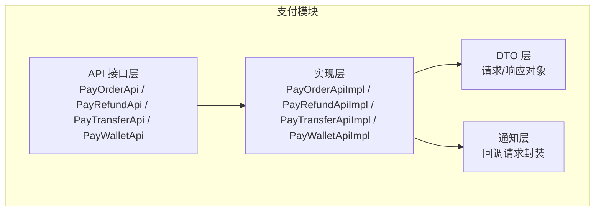
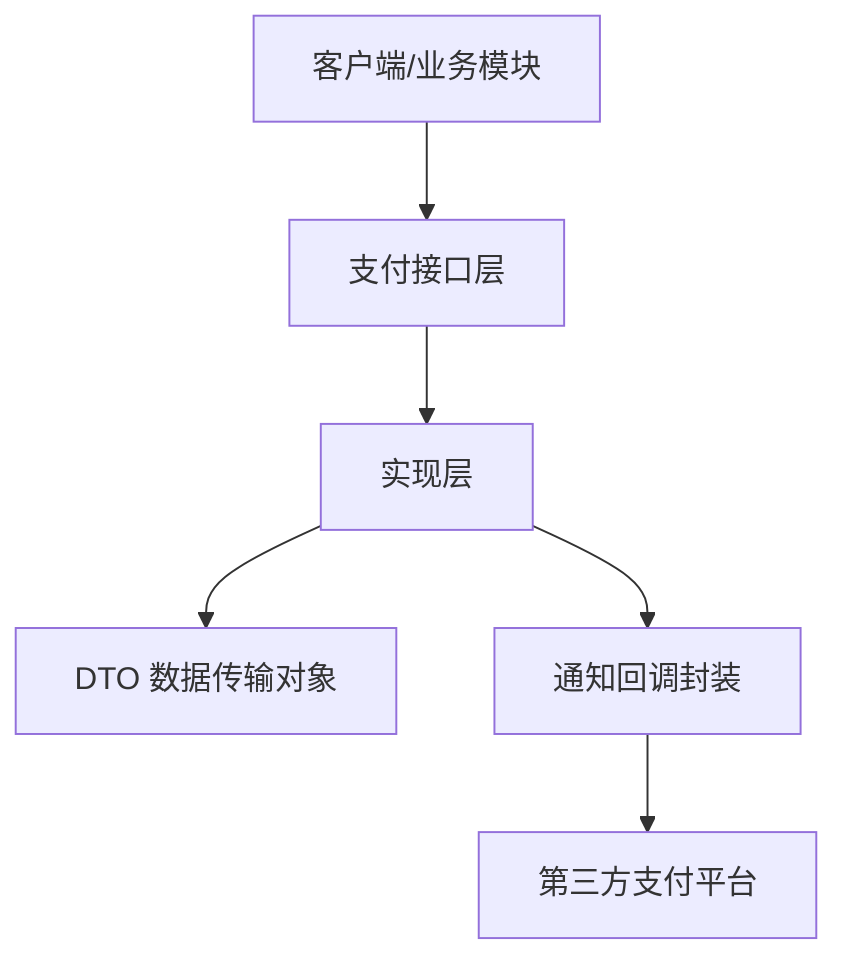
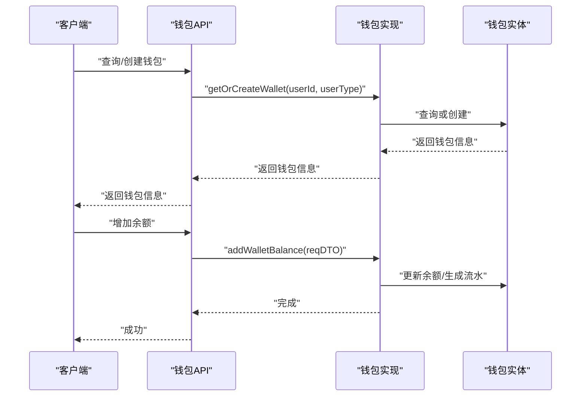
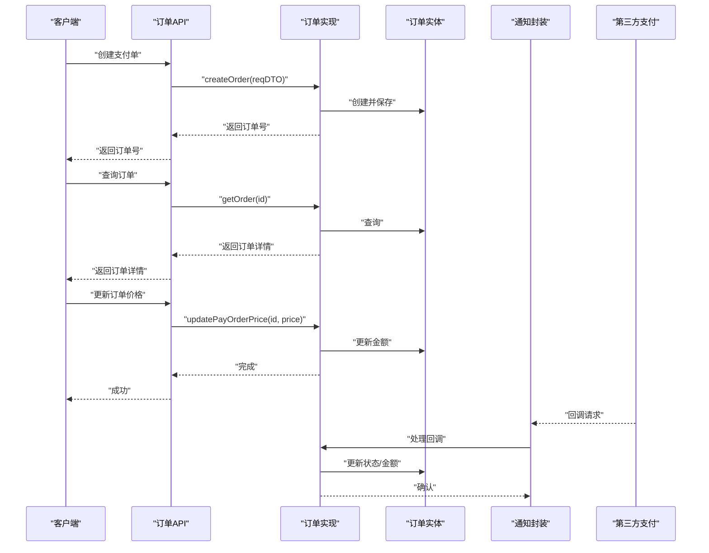
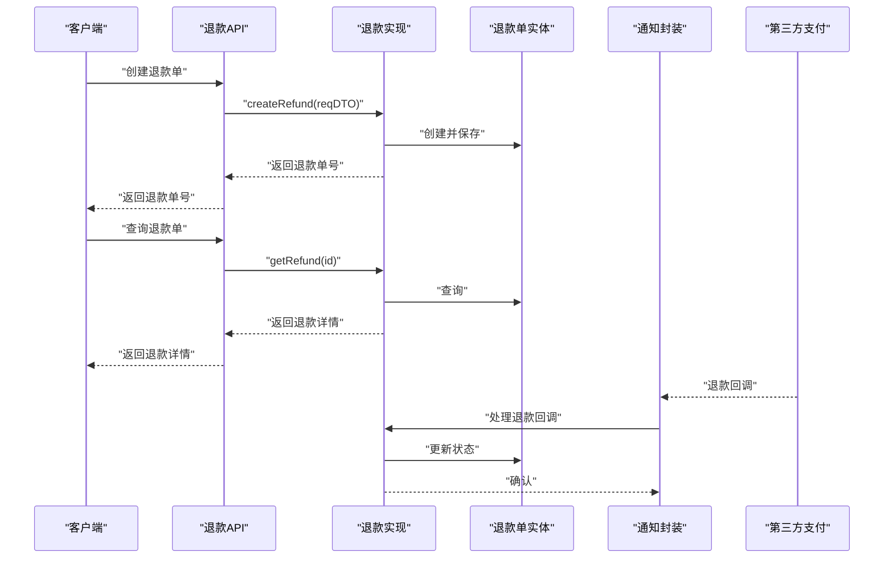
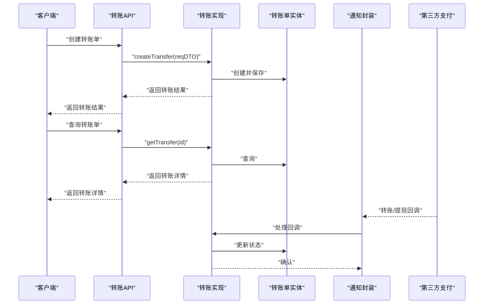
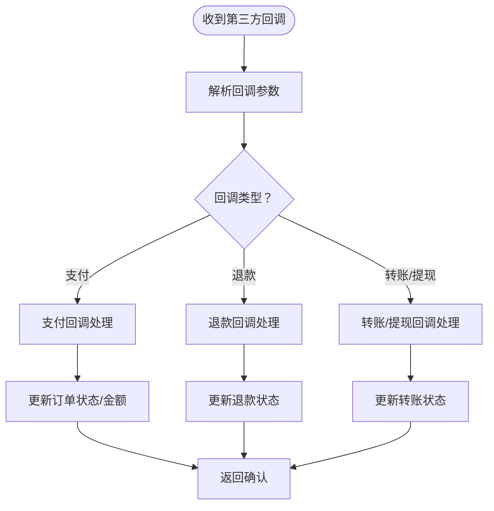
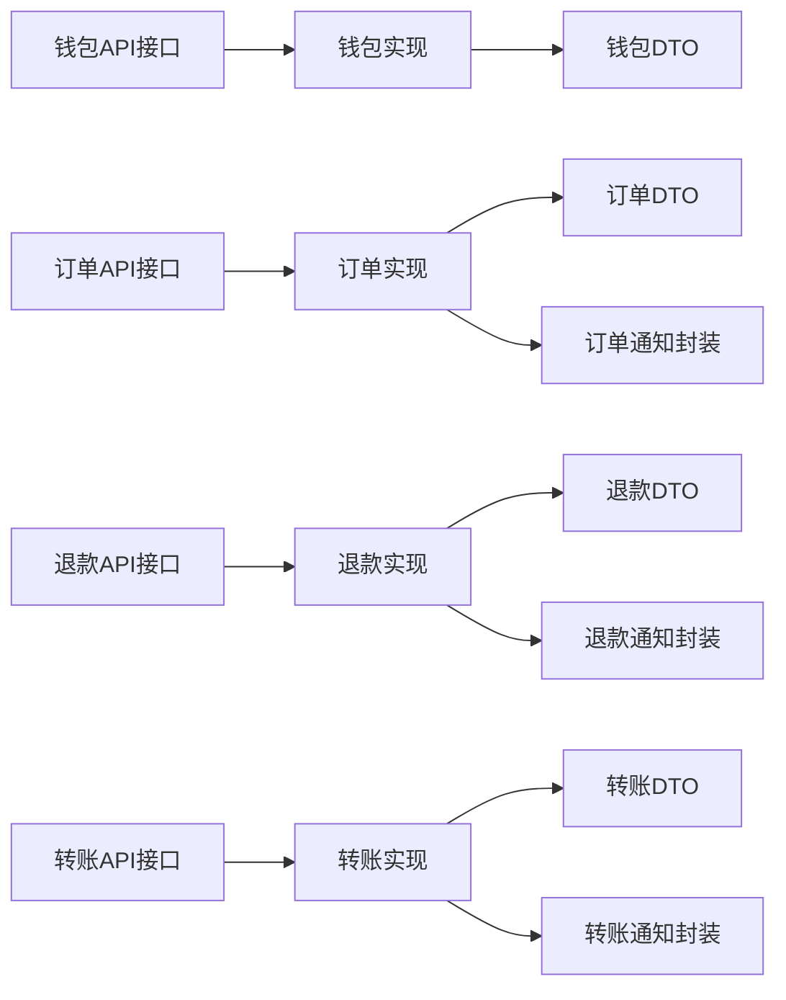

# 支付系统

<cite>
**本文引用的文件**
- [package-info.java](file://backend/qiji-module-pay/src/main/java/com/qiji/cps/module/pay/package-info.java)
- [PayWalletApi.java](file://backend/qiji-module-pay/src/main/java/com/qiji/cps/module/pay/api/wallet/PayWalletApi.java)
- [PayOrderApi.java](file://backend/qiji-module-pay/src/main/java/com/qiji/cps/module/pay/api/order/PayOrderApi.java)
- [PayRefundApi.java](file://backend/qiji-module-pay/src/main/java/com/qiji/cps/module/pay/api/refund/PayRefundApi.java)
- [PayTransferApi.java](file://backend/qiji-module-pay/src/main/java/com/qiji/cps/module/pay/api/transfer/PayTransferApi.java)
- [PayOrderApiImpl.java](file://backend/qiji-module-pay/src/main/java/com/qiji/cps/module/pay/api/order/impl/PayOrderApiImpl.java)
- [PayRefundApiImpl.java](file://backend/qiji-module-pay/src/main/java/com/qiji/cps/module/pay/api/refund/impl/PayRefundApiImpl.java)
- [PayTransferApiImpl.java](file://backend/qiji-module-pay/src/main/java/com/qiji/cps/module/pay/api/transfer/impl/PayTransferApiImpl.java)
- [PayWalletApiImpl.java](file://backend/qiji-module-pay/src/main/java/com/qiji/cps/module/pay/api/wallet/impl/PayWalletApiImpl.java)
- [PayOrderCreateReqDTO.java](file://backend/qiji-module-pay/src/main/java/com/qiji/cps/module/pay/api/order/dto/PayOrderCreateReqDTO.java)
- [PayOrderRespDTO.java](file://backend/qiji-module-pay/src/main/java/com/qiji/cps/module/pay/api/order/dto/PayOrderRespDTO.java)
- [PayRefundCreateReqDTO.java](file://backend/qiji-module-pay/src/main/java/com/qiji/cps/module/pay/api/refund/dto/PayRefundCreateReqDTO.java)
- [PayRefundRespDTO.java](file://backend/qiji-module-pay/src/main/java/com/qiji/cps/module/pay/api/refund/dto/PayRefundRespDTO.java)
- [PayTransferCreateReqDTO.java](file://backend/qiji-module-pay/src/main/java/com/qiji/cps/module/pay/api/transfer/dto/PayTransferCreateReqDTO.java)
- [PayTransferRespDTO.java](file://backend/qiji-module-pay/src/main/java/com/qiji/cps/module/pay/api/transfer/dto/PayTransferRespDTO.java)
- [PayWalletAddBalanceReqDTO.java](file://backend/qiji-module-pay/src/main/java/com/qiji/cps/module/pay/api/wallet/dto/PayWalletAddBalanceReqDTO.java)
- [PayWalletRespDTO.java](file://backend/qiji-module-pay/src/main/java/com/qiji/cps/module/pay/api/wallet/dto/PayWalletRespDTO.java)
- [PayOrderNotifyReqDTO.java](file://backend/qiji-module-pay/src/main/java/com/qiji/cps/module/pay/api/notify/dto/PayOrderNotifyReqDTO.java)
- [PayRefundNotifyReqDTO.java](file://backend/qiji-module-pay/src/main/java/com/qiji/cps/module/pay/api/notify/dto/PayRefundNotifyReqDTO.java)
- [PayTransferNotifyReqDTO.java](file://backend/qiji-module-pay/src/main/java/com/qiji/cps/module/pay/api/notify/dto/PayTransferNotifyReqDTO.java)
- [PayOrderNotifyReqDTO.java](file://backend/qiji-module-pay/src/main/java/com/qiji/cps/module/pay/api/notify/dto/PayOrderNotifyReqDTO.java)
- [PayRefundNotifyReqDTO.java](file://backend/qiji-module-pay/src/main/java/com/qiji/cps/module/pay/api/notify/dto/PayRefundNotifyReqDTO.java)
- [PayTransferNotifyReqDTO.java](file://backend/qiji-module-pay/src/main/java/com/qiji/cps/module/pay/api/notify/dto/PayTransferNotifyReqDTO.java)
- [PayOrderNotifyReqDTO.java](file://backend/qiji-module-pay/src/main/java/com/qiji/cps/module/pay/api/notify/dto/PayOrderNotifyReqDTO.java)
- [PayRefundNotifyReqDTO.java](file://backend/qiji-module-pay/src/main/java/com/qiji/cps/module/pay/api/notify/dto/PayRefundNotifyReqDTO.java)
- [PayTransferNotifyReqDTO.java](file://backend/qiji-module-pay/src/main/java/com/qiji/cps/module/pay/api/notify/dto/PayTransferNotifyReqDTO.java)
- [PayOrderNotifyReqDTO.java](file://backend/qiji-module-pay/src/main/java/com/qiji/cps/module/pay/api/notify/dto/PayOrderNotifyReqDTO.java)
- [PayRefundNotifyReqDTO.java](file://backend/qiji-module-pay/src/main/java/com/qiji/cps/module/pay/api/notify/dto/PayRefundNotifyReqDTO.java)
- [PayTransferNotifyReqDTO.java](file://backend/qiji-module-pay/src/main/java/com/qiji/cps/module/pay/api/notify/dto/PayTransferNotifyReqDTO.java)
- [PayOrderNotifyReqDTO.java](file://backend/qiji-module-pay/src/main/java/com/qiji/cps/module/pay/api/notify/dto/PayOrderNotifyReqDTO.java)
- [PayRefundNotifyReqDTO.java](file://backend/qiji-module-pay/src/main/java/com/qiji/cps/module/pay/api/notify/dto/PayRefundNotifyReqDTO.java)
- [PayTransferNotifyReqDTO.java](file://backend/qiji-module-pay/src/main/java/com/qiji/cps/module/pay/api/notify/dto/PayTransferNotifyReqDTO.java)
- [PayOrderNotifyReqDTO.java](file://backend/qiji-module-pay/src/main/java/com/qiji/cps/module/pay/api/notify/dto/PayOrderNotifyReqDTO.java)
- [PayRefundNotifyReqDTO.java](file://backend/qiji-module-pay/src/main/java/com/qiji/cps/module/pay/api/notify/dto/PayRefundNotifyReqDTO.java)
- [PayTransferNotifyReqDTO.java](file://backend/qiji-module-pay/src/main/java/com/qiji/cps/module/pay/api/notify/dto/PayTransferNotifyReqDTO.java)
- [PayOrderNotifyReqDTO.java](file://backend/qiji-module-pay/src/main/java/com/qiji/cps/module/pay/api/notify/dto/PayOrderNotifyReqDTO.java)
- [PayRef......](file://backend/qiji-module-pay/src/main/java/com/qiji/cps/module/pay/api/notify/dto/PayRefundNotifyReqDTO.java)
- [PayTransferNotifyReqDTO.java](file://backend/qiji-module-pay/src/main/java/com/qiji/cps/module/pay/api/notify/dto/PayTransferNotifyReqDTO.java)
</cite>

## 目录
1. [简介](#简介)
2. [项目结构](#项目结构)
3. [核心组件](#核心组件)
4. [架构总览](#架构总览)
5. [详细组件分析](#详细组件分析)
6. [依赖分析](#依赖分析)
7. [性能考虑](#性能考虑)
8. [故障排查指南](#故障排查指南)
9. [结论](#结论)
10. [附录](#附录)

## 简介
本技术文档面向支付系统，聚焦于以下关键领域：
- 钱包服务：余额管理、流水记录、冻结与解冻
- 支付订单管理：订单创建、状态更新、回调处理
- 退款处理：退款申请、审核流程、资金退回
- 支付通道集成：对接第三方支付（如支付宝、微信支付、银联）
- 转账管理：内部转账、提现处理、手续费计算
- 支付安全机制、对账系统、风控策略

文档基于仓库中的支付模块进行梳理，结合接口定义与实现思路，提供可操作的架构视图、流程图与最佳实践建议。

## 项目结构
支付模块位于后端工程的独立模块中，采用“接口 + 实现 + DTO + 通知”的分层设计：
- 接口层：对外暴露的 API 接口，定义业务能力边界
- 实现层：接口的具体实现，负责编排业务逻辑
- DTO 层：请求与响应的数据传输对象
- 通知层：第三方回调的请求封装

图表来源
- [package-info.java:1-11](file://backend/qiji-module-pay/src/main/java/com/qiji/cps/module/pay/package-info.java#L1-L11)
- [PayOrderApi.java:1-41](file://backend/qiji-module-pay/src/main/java/com/qiji/cps/module/pay/api/order/PayOrderApi.java#L1-L41)
- [PayRefundApi.java:1-32](file://backend/qiji-module-pay/src/main/java/com/qiji/cps/module/pay/api/refund/PayRefundApi.java#L1-L32)
- [PayTransferApi.java:1-32](file://backend/qiji-module-pay/src/main/java/com/qiji/cps/module/pay/api/transfer/PayTransferApi.java#L1-L32)
- [PayWalletApi.java:1-30](file://backend/qiji-module-pay/src/main/java/com/qiji/cps/module/pay/api/wallet/PayWalletApi.java#L1-L30)

章节来源
- [package-info.java:1-11](file://backend/qiji-module-pay/src/main/java/com/qiji/cps/module/pay/package-info.java#L1-L11)

## 核心组件
本节从接口维度梳理支付系统的关键能力，并给出职责划分与调用关系。

- 钱包 API：提供余额增减、钱包查询等能力
- 订单 API：提供支付单创建、查询、价格更新
- 退款 API：提供退款单创建、查询
- 转账 API：提供转账单创建、查询
- 通知 API：接收第三方回调请求

章节来源
- [PayWalletApi.java:1-30](file://backend/qiji-module-pay/src/main/java/com/qiji/cps/module/pay/api/wallet/PayWalletApi.java#L1-L30)
- [PayOrderApi.java:1-41](file://backend/qiji-module-pay/src/main/java/com/qiji/cps/module/pay/api/order/PayOrderApi.java#L1-L41)
- [PayRefundApi.java:1-32](file://backend/qiji-module-pay/src/main/java/com/qiji/cps/module/pay/api/refund/PayRefundApi.java#L1-L32)
- [PayTransferApi.java:1-32](file://backend/qiji-module-pay/src/main/java/com/qiji/cps/module/pay/api/transfer/PayTransferApi.java#L1-L32)

## 架构总览
支付系统的整体交互围绕“接口 -> 实现 -> DTO -> 通知”展开，实现层承担业务编排与跨模块协作，通知层负责异步回调处理。

图表来源
- [PayOrderApi.java:1-41](file://backend/qiji-module-pay/src/main/java/com/qiji/cps/module/pay/api/order/PayOrderApi.java#L1-L41)
- [PayRefundApi.java:1-32](file://backend/qiji-module-pay/src/main/java/com/qiji/cps/module/pay/api/refund/PayRefundApi.java#L1-L32)
- [PayTransferApi.java:1-32](file://backend/qiji-module-pay/src/main/java/com/qiji/cps/module/pay/api/transfer/PayTransferApi.java#L1-L32)
- [PayWalletApi.java:1-30](file://backend/qiji-module-pay/src/main/java/com/qiji/cps/module/pay/api/wallet/PayWalletApi.java#L1-L30)

## 详细组件分析

### 钱包服务
钱包服务负责用户余额的增减、查询与状态维护。典型流程包括：
- 查询或创建钱包
- 增加余额（充值/奖励等）
- 余额扣减（消费/提现）
- 冻结与解冻（风控/异常处理）

图表来源
- [PayWalletApi.java:1-30](file://backend/qiji-module-pay/src/main/java/com/qiji/cps/module/pay/api/wallet/PayWalletApi.java#L1-L30)
- [PayWalletAddBalanceReqDTO.java](file://backend/qiji-module-pay/src/main/java/com/qiji/cps/module/pay/api/wallet/dto/PayWalletAddBalanceReqDTO.java)
- [PayWalletRespDTO.java](file://backend/qiji-module-pay/src/main/java/com/qiji/cps/module/pay/api/wallet/dto/PayWalletRespDTO.java)

章节来源
- [PayWalletApi.java:1-30](file://backend/qiji-module-pay/src/main/java/com/qiji/cps/module/pay/api/wallet/PayWalletApi.java#L1-L30)

### 支付订单管理
支付订单管理包含订单创建、状态更新与回调处理：
- 订单创建：接收创建请求，生成支付单并持久化
- 订单查询：根据订单号获取订单详情
- 价格更新：支持订单金额调整（如促销改价）
- 回调处理：接收第三方支付回调，更新订单状态并落库

图表来源
- [PayOrderApi.java:1-41](file://backend/qiji-module-pay/src/main/java/com/qiji/cps/module/pay/api/order/PayOrderApi.java#L1-L41)
- [PayOrderApiImpl.java](file://backend/qiji-module-pay/src/main/java/com/qiji/cps/module/pay/api/order/impl/PayOrderApiImpl.java)
- [PayOrderCreateReqDTO.java](file://backend/qiji-module-pay/src/main/java/com/qiji/cps/module/pay/api/order/dto/PayOrderCreateReqDTO.java)
- [PayOrderRespDTO.java](file://backend/qiji-module-pay/src/main/java/com/qiji/cps/module/pay/api/order/dto/PayOrderRespDTO.java)
- [PayOrderNotifyReqDTO.java](file://backend/qiji-module-pay/src/main/java/com/qiji/cps/module/pay/api/notify/dto/PayOrderNotifyReqDTO.java)

章节来源
- [PayOrderApi.java:1-41](file://backend/qiji-module-pay/src/main/java/com/qiji/cps/module/pay/api/order/PayOrderApi.java#L1-L41)

### 退款处理机制
退款流程包括申请、审核与资金退回：
- 退款申请：接收退款请求，生成退款单并持久化
- 退款查询：根据退款单号获取退款详情
- 退款回调：接收第三方退款回调，更新退款状态

图表来源
- [PayRefundApi.java:1-32](file://backend/qiji-module-pay/src/main/java/com/qiji/cps/module/pay/api/refund/PayRefundApi.java#L1-L32)
- [PayRefundApiImpl.java](file://backend/qiji-module-pay/src/main/java/com/qiji/cps/module/pay/api/refund/impl/PayRefundApiImpl.java)
- [PayRefundCreateReqDTO.java](file://backend/qiji-module-pay/src/main/java/com/qiji/cps/module/pay/api/refund/dto/PayRefundCreateReqDTO.java)
- [PayRefundRespDTO.java](file://backend/qiji-module-pay/src/main/java/com/qiji/cps/module/pay/api/refund/dto/PayRefundRespDTO.java)
- [PayRefundNotifyReqDTO.java](file://backend/qiji-module-pay/src/main/java/com/qiji/cps/module/pay/api/notify/dto/PayRefundNotifyReqDTO.java)

章节来源
- [PayRefundApi.java:1-32](file://backend/qiji-module-pay/src/main/java/com/qiji/cps/module/pay/api/refund/PayRefundApi.java#L1-L32)

### 转账管理
转账管理涵盖内部转账与提现：
- 转账创建：接收转账请求，执行账户间资金转移
- 转账查询：根据转账单号获取转账详情
- 提现回调：接收第三方提现回调，更新转账状态

图表来源
- [PayTransferApi.java:1-32](file://backend/qiji-module-pay/src/main/java/com/qiji/cps/module/pay/api/transfer/PayTransferApi.java#L1-L32)
- [PayTransferApiImpl.java](file://backend/qiji-module-pay/src/main/java/com/qiji/cps/module/pay/api/transfer/impl/PayTransferApiImpl.java)
- [PayTransferCreateReqDTO.java](file://backend/qiji-module-pay/src/main/java/com/qiji/cps/module/pay/api/transfer/dto/PayTransferCreateReqDTO.java)
- [PayTransferRespDTO.java](file://backend/qiji-module-pay/src/main/java/com/qiji/cps/module/pay/api/transfer/dto/PayTransferRespDTO.java)
- [PayTransferNotifyReqDTO.java](file://backend/qiji-module-pay/src/main/java/com/qiji/cps/module/pay/api/notify/dto/PayTransferNotifyReqDTO.java)

章节来源
- [PayTransferApi.java:1-32](file://backend/qiji-module-pay/src/main/java/com/qiji/cps/module/pay/api/transfer/PayTransferApi.java#L1-L32)

### 支付通道集成
支付通道集成通过统一的通知封装对接第三方平台：
- 支付回调：接收第三方支付回调，解析参数并更新订单状态
- 退款回调：接收第三方退款回调，解析参数并更新退款状态
- 转账/提现回调：接收第三方转账/提现回调，解析参数并更新转账状态

图表来源
- [PayOrderNotifyReqDTO.java](file://backend/qiji-module-pay/src/main/java/com/qiji/cps/module/pay/api/notify/dto/PayOrderNotifyReqDTO.java)
- [PayRefundNotifyReqDTO.java](file://backend/qiji-module-pay/src/main/java/com/qiji/cps/module/pay/api/notify/dto/PayRefundNotifyReqDTO.java)
- [PayTransferNotifyReqDTO.java](file://backend/qiji-module-pay/src/main/java/com/qiji/cps/module/pay/api/notify/dto/PayTransferNotifyReqDTO.java)

章节来源
- [PayOrderNotifyReqDTO.java](file://backend/qiji-module-pay/src/main/java/com/qiji/cps/module/pay/api/notify/dto/PayOrderNotifyReqDTO.java)
- [PayRefundNotifyReqDTO.java](file://backend/qiji-module-pay/src/main/java/com/qiji/cps/module/pay/api/notify/dto/PayRefundNotifyReqDTO.java)
- [PayTransferNotifyReqDTO.java](file://backend/qiji-module-pay/src/main/java/com/qiji/cps/module/pay/api/notify/dto/PayTransferNotifyReqDTO.java)

## 依赖分析
- 接口与实现：各模块的 API 接口与实现通过依赖注入进行装配
- DTO 与通知：实现层依赖 DTO 进行输入输出，依赖通知封装处理第三方回调
- 第三方集成：通过通知封装对接不同支付通道，保持接口一致性

图表来源
- [PayWalletApi.java:1-30](file://backend/qiji-module-pay/src/main/java/com/qiji/cps/module/pay/api/wallet/PayWalletApi.java#L1-L30)
- [PayOrderApi.java:1-41](file://backend/qiji-module-pay/src/main/java/com/qiji/cps/module/pay/api/order/PayOrderApi.java#L1-L41)
- [PayRefundApi.java:1-32](file://backend/qiji-module-pay/src/main/java/com/qiji/cps/module/pay/api/refund/PayRefundApi.java#L1-L32)
- [PayTransferApi.java:1-32](file://backend/qiji-module-pay/src/main/java/com/qiji/cps/module/pay/api/transfer/PayTransferApi.java#L1-L32)

## 性能考虑
- 批量回调处理：对高频回调采用异步处理与幂等设计，避免重复入账
- 缓存策略：对热点钱包信息与订单状态使用缓存，降低数据库压力
- 并发控制：余额增减与订单状态更新需保证原子性，必要时引入分布式锁
- 日志与监控：对关键链路埋点，确保可观测性与快速定位问题

## 故障排查指南
- 回调未达：检查通知封装是否正确解析第三方回调，核对签名与参数
- 状态不一致：核对回调处理逻辑与数据库事务，确保最终一致性
- 重复回调：实现幂等处理，依据订单号/退款号去重
- 余额异常：核对流水记录与冻结/解冻流程，确保账实相符

## 结论
支付系统通过清晰的接口分层与统一的通知封装，实现了钱包、订单、退款与转账的闭环管理。配合异步回调与幂等设计，能够稳定支撑高并发场景。后续可在风控策略、对账系统与通道扩展方面持续优化。

## 附录
- 接口与实现对应关系
  - 钱包：PayWalletApi ↔ PayWalletApiImpl
  - 订单：PayOrderApi ↔ PayOrderApiImpl
  - 退款：PayRefundApi ↔ PayRefundApiImpl
  - 转账：PayTransferApi ↔ PayTransferApiImpl
- DTO 与通知封装
  - 订单：PayOrderCreateReqDTO / PayOrderRespDTO / PayOrderNotifyReqDTO
  - 退款：PayRefundCreateReqDTO / PayRefundRespDTO / PayRefundNotifyReqDTO
  - 转账：PayTransferCreateReqDTO / PayTransferRespDTO / PayTransferNotifyReqDTO
  - 钱包：PayWalletAddBalanceReqDTO / PayWalletRespDTO