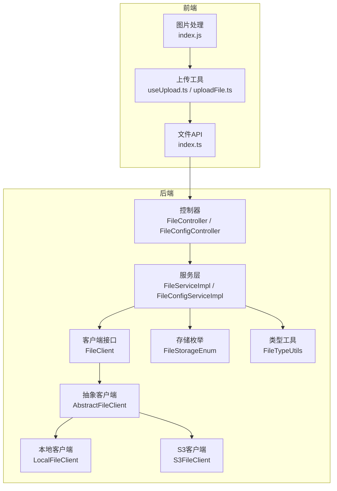
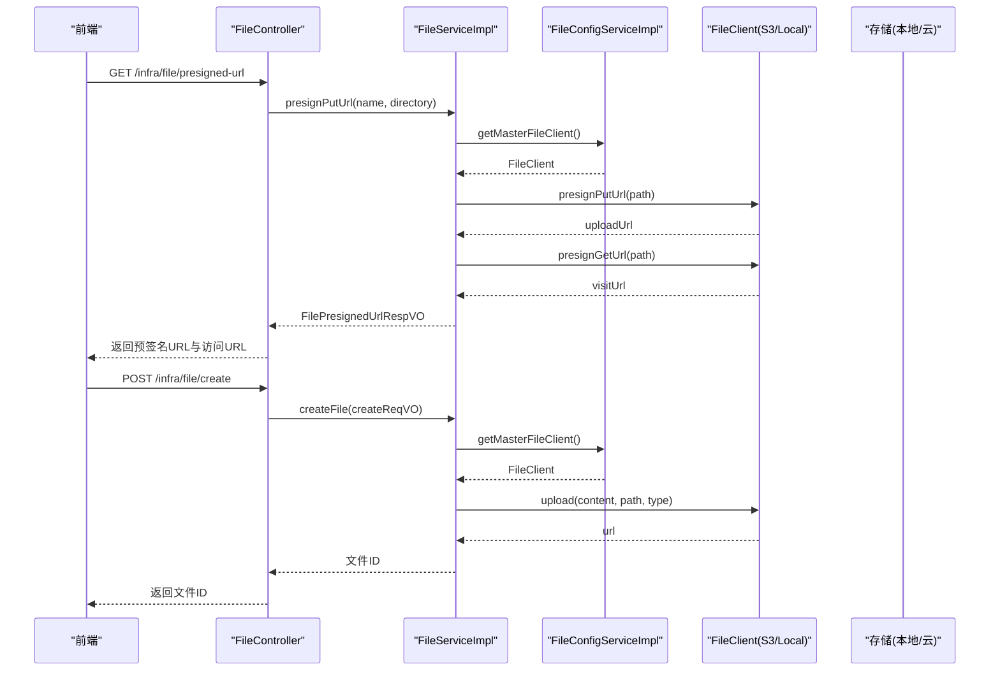
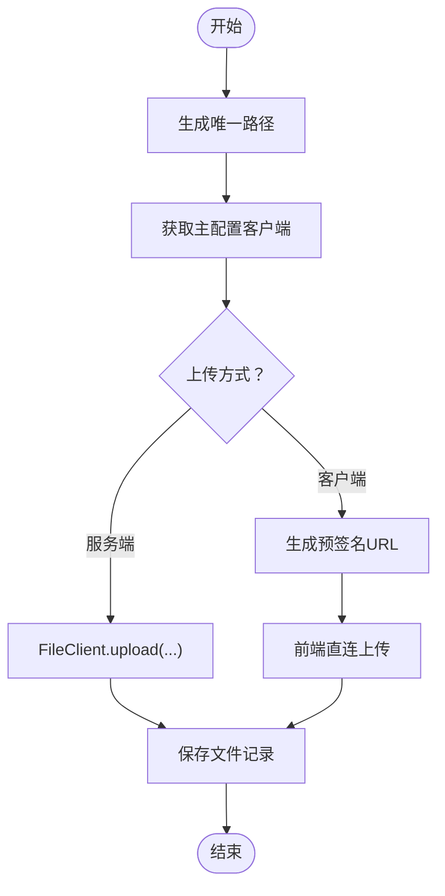
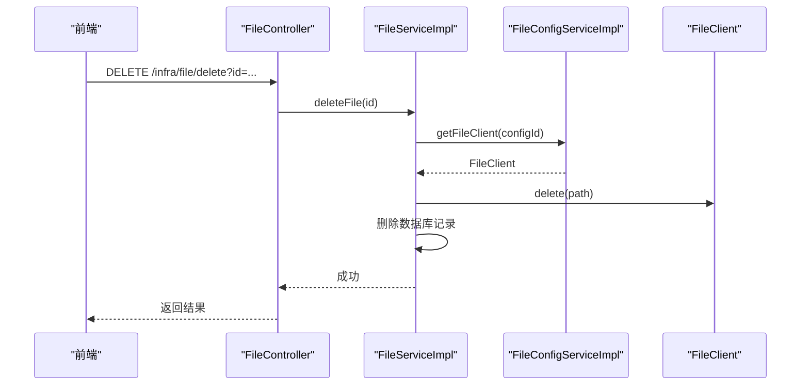
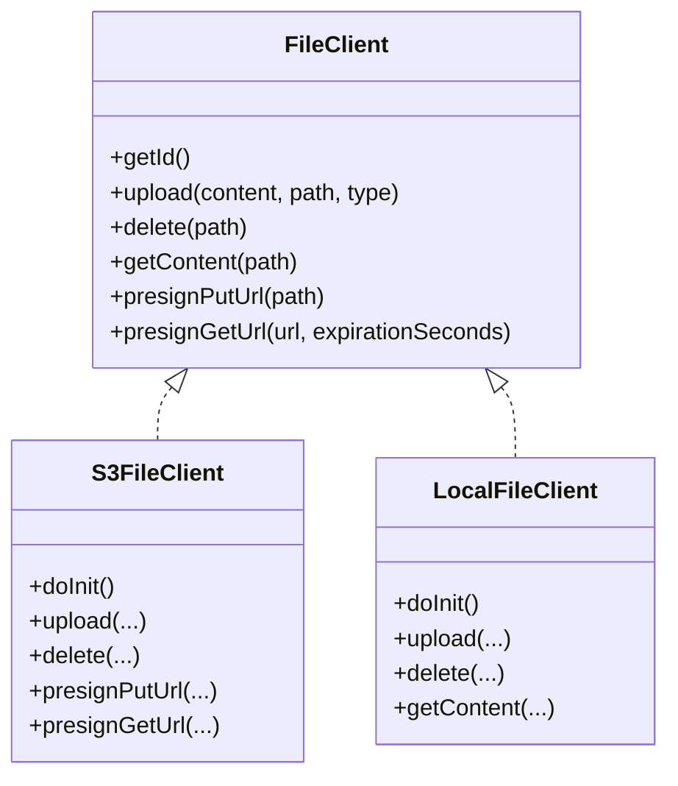
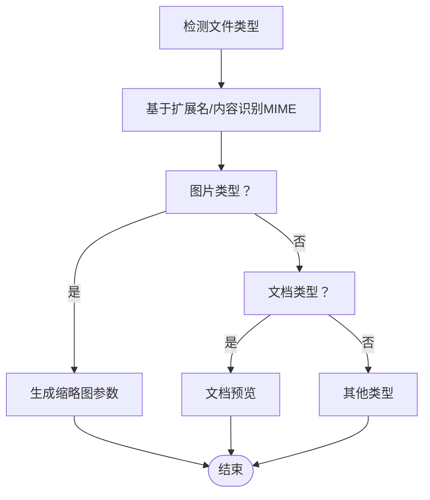
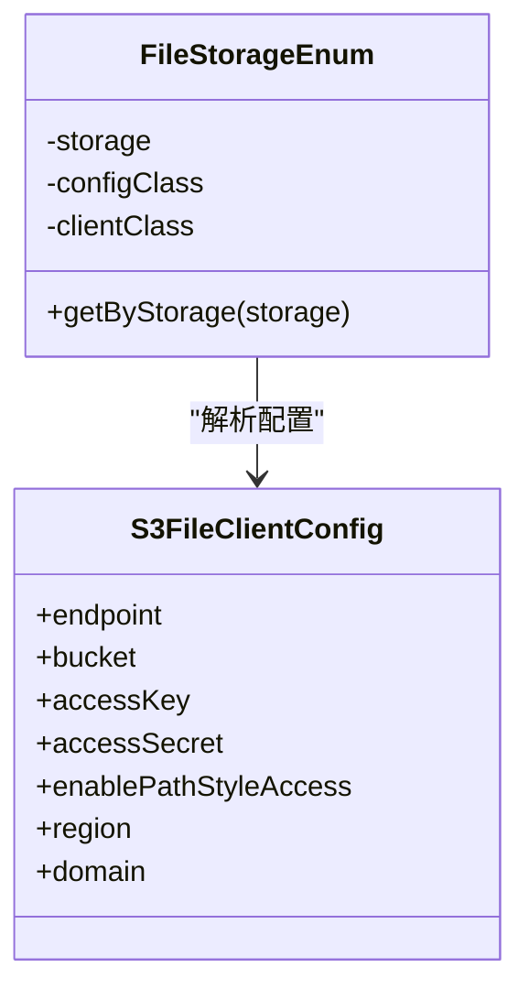
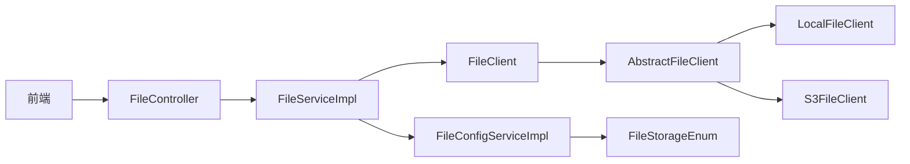

# 文件存储服务

<cite>
**本文引用的文件**
- [FileServiceImpl.java](file://backend/qiji-module-infra/src/main/java/com/qiji/cps/module/infra/service/file/FileServiceImpl.java)
- [FileConfigServiceImpl.java](file://backend/qiji-module-infra/src/main/java/com/qiji/cps/module/infra/service/file/FileConfigServiceImpl.java)
- [FileController.java](file://backend/qiji-module-infra/src/main/java/com/qiji/cps/module/infra/controller/admin/file/FileController.java)
- [FileConfigController.java](file://backend/qiji-module-infra/src/main/java/com/qiji/cps/module/infra/controller/admin/file/FileConfigController.java)
- [FileClient.java](file://backend/qiji-module-infra/src/main/java/com/qiji/cps/module/infra/framework/file/core/client/FileClient.java)
- [AbstractFileClient.java](file://backend/qiji-module-infra/src/main/java/com/qiji/cps/module/infra/framework/file/core/client/AbstractFileClient.java)
- [LocalFileClient.java](file://backend/qiji-module-infra/src/main/java/com/qiji/cps/module/infra/framework/file/core/client/local/LocalFileClient.java)
- [S3FileClient.java](file://backend/qiji-module-infra/src/main/java/com/qiji/cps/module/infra/framework/file/core/client/s3/S3FileClient.java)
- [S3FileClientConfig.java](file://backend/qiji-module-infra/src/main/java/com/qiji/cps/module/infra/framework/file/core/client/s3/S3FileClientConfig.java)
- [FileStorageEnum.java](file://backend/qiji-module-infra/src/main/java/com/qiji/cps/module/infra/framework/file/core/enums/FileStorageEnum.java)
- [FileTypeUtils.java](file://backend/qiji-module-infra/src/main/java/com/qiji/cps/module/infra/framework/file/core/utils/FileTypeUtils.java)
- [FilePresignedUrlRespVO.java](file://backend/qiji-module-infra/src/main/java/com/qiji/cps/module/infra/controller/admin/file/vo/file/FilePresignedUrlRespVO.java)
- [FileConfigSaveReqVO.java](file://backend/qiji-module-infra/src/main/java/com/qiji/cps/module/infra/controller/admin/file/vo/config/FileConfigSaveReqVO.java)
- [FileConfigRespVO.java](file://backend/qiji-module-infra/src/main/java/com/qiji/cps/module/infra/controller/admin/file/vo/config/FileConfigRespVO.java)
- [index.ts（前端文件API）](file://frontend/admin-uniapp/src/api/infra/file/index.ts)
- [index.ts（前端文件配置API）](file://frontend/admin-vue3/src/api/infra/fileConfig/index.ts)
- [useUpload.ts（前端上传工具）](file://frontend/admin-vue3/src/components/UploadFile/src/useUpload.ts)
- [uploadFile.ts（前端上传工具）](file://frontend/admin-uniapp/src/utils/uploadFile.ts)
- [index.js（图片处理）](file://frontend/mall-uniapp/sheep/url/index.js)
- [index.ts（文件类型检测）](file://frontend/admin-vue3/src/utils/index.ts)
- [S3FileClientTest.java](file://backend/qiji-module-infra/src/test/java/com/qiji/cps/module/infra/framework/file/core/s3/S3FileClientTest.java)
- [FileServiceImplTest.java](file://backend/qiji-module-infra/src/test/java/com/qiji/cps/module/infra/service/file/FileServiceImplTest.java)
- [FileConfigServiceImplTest.java](file://backend/qiji-module-infra/src/test/java/com/qiji/cps/module/infra/service/file/FileConfigServiceImplTest.java)
</cite>

## 目录
1. [简介](#简介)
2. [项目结构](#项目结构)
3. [核心组件](#核心组件)
4. [架构总览](#架构总览)
5. [详细组件分析](#详细组件分析)
6. [依赖关系分析](#依赖关系分析)
7. [性能考量](#性能考量)
8. [故障排查指南](#故障排查指南)
9. [结论](#结论)
10. [附录](#附录)

## 简介
本文件存储服务提供统一的文件上传、管理与访问能力，支持多种存储后端（本地、S3兼容云存储），并提供预签名URL、文件类型识别、批量操作、权限控制与URL签名等能力。后端采用抽象客户端设计，便于扩展新的存储实现；前端提供通用上传与文件管理界面。

## 项目结构
文件存储服务主要分布在后端模块与前端页面中：
- 后端
  - 控制器层：文件与文件配置的REST接口
  - 业务服务层：文件上传、删除、预签名URL生成、文件类型识别
  - 存储客户端层：抽象客户端与具体实现（本地、S3兼容）
  - 配置与枚举：存储类型枚举、客户端配置模型
- 前端
  - 文件API封装与调用
  - 上传组件与工具函数
  - 图片处理与文档类型支持

图表来源
- [FileController.java:59-86](file://backend/qiji-module-infra/src/main/java/com/qiji/cps/module/infra/controller/admin/file/FileController.java#L59-L86)
- [FileConfigController.java:1-33](file://backend/qiji-module-infra/src/main/java/com/qiji/cps/module/infra/controller/admin/file/FileConfigController.java#L1-L33)
- [FileServiceImpl.java:29-206](file://backend/qiji-module-infra/src/main/java/com/qiji/cps/module/infra/service/file/FileServiceImpl.java#L29-L206)
- [FileConfigServiceImpl.java:37-207](file://backend/qiji-module-infra/src/main/java/com/qiji/cps/module/infra/service/file/FileConfigServiceImpl.java#L37-L207)
- [FileClient.java:8-66](file://backend/qiji-module-infra/src/main/java/com/qiji/cps/module/infra/framework/file/core/client/FileClient.java#L8-L66)
- [AbstractFileClient.java:11-78](file://backend/qiji-module-infra/src/main/java/com/qiji/cps/module/infra/framework/file/core/client/AbstractFileClient.java#L11-L78)
- [LocalFileClient.java:1-57](file://backend/qiji-module-infra/src/main/java/com/qiji/cps/module/infra/framework/file/core/client/local/LocalFileClient.java#L1-L57)
- [S3FileClient.java:26-58](file://backend/qiji-module-infra/src/main/java/com/qiji/cps/module/infra/framework/file/core/client/s3/S3FileClient.java#L26-L58)
- [FileStorageEnum.java:24-55](file://backend/qiji-module-infra/src/main/java/com/qiji/cps/module/infra/framework/file/core/enums/FileStorageEnum.java#L24-L55)
- [FileTypeUtils.java:1-46](file://backend/qiji-module-infra/src/main/java/com/qiji/cps/module/infra/framework/file/core/utils/FileTypeUtils.java#L1-L46)
- [index.ts（前端文件API）:1-56](file://frontend/admin-uniapp/src/api/infra/file/index.ts#L1-L56)
- [useUpload.ts（前端上传工具）:63-102](file://frontend/admin-vue3/src/components/UploadFile/src/useUpload.ts#L63-L102)
- [uploadFile.ts（前端上传工具）:1-48](file://frontend/admin-uniapp/src/utils/uploadFile.ts#L1-L48)
- [index.js（图片处理）:55-98](file://frontend/mall-uniapp/sheep/url/index.js#L55-L98)

章节来源
- [FileController.java:59-86](file://backend/qiji-module-infra/src/main/java/com/qiji/cps/module/infra/controller/admin/file/FileController.java#L59-L86)
- [FileConfigController.java:1-33](file://backend/qiji-module-infra/src/main/java/com/qiji/cps/module/infra/controller/admin/file/FileConfigController.java#L1-L33)

## 核心组件
- 文件服务实现（FileServiceImpl）
  - 提供文件上传、删除、批量删除、预签名URL生成、文件内容获取等功能
  - 路径生成策略：可选日期前缀、时间戳后缀，确保唯一性
  - 文件类型识别：基于内容或扩展名推断MIME类型
- 文件配置服务（FileConfigServiceImpl）
  - 统一管理存储配置，支持主配置切换、缓存与异步刷新
  - 将配置解析为对应客户端配置对象并校验
- 客户端接口与实现
  - FileClient 抽象上传、删除、读取与预签名能力
  - LocalFileClient 本地文件系统存储
  - S3FileClient S3协议兼容云存储（阿里云OSS、腾讯云COS等）
- 前端API与上传工具
  - 提供预签名URL获取、文件记录创建、批量删除等接口
  - 支持两种上传模式：服务端上传与客户端直连S3上传

章节来源
- [FileServiceImpl.java:29-206](file://backend/qiji-module-infra/src/main/java/com/qiji/cps/module/infra/service/file/FileServiceImpl.java#L29-L206)
- [FileConfigServiceImpl.java:37-207](file://backend/qiji-module-infra/src/main/java/com/qiji/cps/module/infra/service/file/FileConfigServiceImpl.java#L37-L207)
- [FileClient.java:8-66](file://backend/qiji-module-infra/src/main/java/com/qiji/cps/module/infra/framework/file/core/client/FileClient.java#L8-L66)
- [LocalFileClient.java:1-57](file://backend/qiji-module-infra/src/main/java/com/qiji/cps/module/infra/framework/file/core/client/local/LocalFileClient.java#L1-L57)
- [S3FileClient.java:26-58](file://backend/qiji-module-infra/src/main/java/com/qiji/cps/module/infra/framework/file/core/client/s3/S3FileClient.java#L26-L58)
- [index.ts（前端文件API）:1-56](file://frontend/admin-uniapp/src/api/infra/file/index.ts#L1-L56)
- [useUpload.ts（前端上传工具）:63-102](file://frontend/admin-vue3/src/components/UploadFile/src/useUpload.ts#L63-L102)
- [uploadFile.ts（前端上传工具）:1-48](file://frontend/admin-uniapp/src/utils/uploadFile.ts#L1-L48)

## 架构总览
文件存储服务采用“控制器-服务-客户端”的分层架构，通过抽象客户端屏蔽不同存储后端差异，支持本地与S3兼容云存储。前端通过预签名URL实现客户端直连上传，降低后端压力。

图表来源
- [FileController.java:59-86](file://backend/qiji-module-infra/src/main/java/com/qiji/cps/module/infra/controller/admin/file/FileController.java#L59-L86)
- [FileServiceImpl.java:127-145](file://backend/qiji-module-infra/src/main/java/com/qiji/cps/module/infra/service/file/FileServiceImpl.java#L127-L145)
- [FileConfigServiceImpl.java:197-205](file://backend/qiji-module-infra/src/main/java/com/qiji/cps/module/infra/service/file/FileConfigServiceImpl.java#L197-L205)
- [S3FileClient.java:26-58](file://backend/qiji-module-infra/src/main/java/com/qiji/cps/module/infra/framework/file/core/client/s3/S3FileClient.java#L26-L58)
- [LocalFileClient.java:1-57](file://backend/qiji-module-infra/src/main/java/com/qiji/cps/module/infra/framework/file/core/client/local/LocalFileClient.java#L1-L57)

## 详细组件分析

### 文件上传机制
- 服务端上传流程
  - 生成唯一路径（可选日期前缀、时间戳后缀）
  - 选择主配置对应的FileClient执行上传
  - 将文件元信息持久化至数据库
- 客户端直连上传流程
  - 后端返回预签名上传URL与访问URL
  - 前端直接向云存储上传，成功后调用后端创建文件记录

图表来源
- [FileServiceImpl.java:62-93](file://backend/qiji-module-infra/src/main/java/com/qiji/cps/module/infra/service/file/FileServiceImpl.java#L62-L93)
- [FileServiceImpl.java:127-139](file://backend/qiji-module-infra/src/main/java/com/qiji/cps/module/infra/service/file/FileServiceImpl.java#L127-L139)
- [index.ts（前端文件API）:37-44](file://frontend/admin-uniapp/src/api/infra/file/index.ts#L37-L44)

章节来源
- [FileServiceImpl.java:62-93](file://backend/qiji-module-infra/src/main/java/com/qiji/cps/module/infra/service/file/FileServiceImpl.java#L62-L93)
- [FileServiceImpl.java:127-139](file://backend/qiji-module-infra/src/main/java/com/qiji/cps/module/infra/service/file/FileServiceImpl.java#L127-L139)
- [index.ts（前端文件API）:37-44](file://frontend/admin-uniapp/src/api/infra/file/index.ts#L37-L44)

### 文件管理功能
- 文件列表与分页
  - 通过FileMapper进行分页查询
- 文件删除
  - 单个删除：先从存储删除，再删除数据库记录
  - 批量删除：遍历文件列表，逐个删除并清理数据库
- 文件访问
  - 对于本地/数据库存储，通过FileController统一转发读取
  - 对于S3存储，可通过预签名URL或云存储域名直接访问

图表来源
- [FileController.java:83-86](file://backend/qiji-module-infra/src/main/java/com/qiji/cps/module/infra/controller/admin/file/FileController.java#L83-L86)
- [FileServiceImpl.java:160-172](file://backend/qiji-module-infra/src/main/java/com/qiji/cps/module/infra/service/file/FileServiceImpl.java#L160-L172)
- [FileServiceImpl.java:174-189](file://backend/qiji-module-infra/src/main/java/com/qiji/cps/module/infra/service/file/FileServiceImpl.java#L174-L189)

章节来源
- [FileServiceImpl.java:160-189](file://backend/qiji-module-infra/src/main/java/com/qiji/cps/module/infra/service/file/FileServiceImpl.java#L160-L189)
- [FileController.java:83-86](file://backend/qiji-module-infra/src/main/java/com/qiji/cps/module/infra/controller/admin/file/FileController.java#L83-L86)

### 文件访问控制与URL签名
- 预签名上传URL
  - 由FileClient生成，有效期可配置
- 预签名访问URL
  - 用于临时授权访问，支持设置过期时间
- 权限验证
  - 控制器方法使用权限注解进行访问控制

图表来源
- [FileClient.java:8-66](file://backend/qiji-module-infra/src/main/java/com/qiji/cps/module/infra/framework/file/core/client/FileClient.java#L8-L66)
- [S3FileClient.java:26-58](file://backend/qiji-module-infra/src/main/java/com/qiji/cps/module/infra/framework/file/core/client/s3/S3FileClient.java#L26-L58)
- [LocalFileClient.java:1-57](file://backend/qiji-module-infra/src/main/java/com/qiji/cps/module/infra/framework/file/core/client/local/LocalFileClient.java#L1-L57)

章节来源
- [FileServiceImpl.java:127-145](file://backend/qiji-module-infra/src/main/java/com/qiji/cps/module/infra/service/file/FileServiceImpl.java#L127-L145)
- [FilePresignedUrlRespVO.java:1-28](file://backend/qiji-module-infra/src/main/java/com/qiji/cps/module/infra/controller/admin/file/vo/file/FilePresignedUrlRespVO.java#L1-L28)

### 文件类型处理与文档预览
- 文件类型识别
  - 基于内容或扩展名推断MIME类型
- 文档与图片支持
  - 前端根据扩展名与MIME类型判断图片、PDF、Office文档等
- 图片处理
  - 前端根据配置生成缩略图、裁剪、质量压缩等处理参数

图表来源
- [FileTypeUtils.java:1-46](file://backend/qiji-module-infra/src/main/java/com/qiji/cps/module/infra/framework/file/core/utils/FileTypeUtils.java#L1-L46)
- [index.ts（文件类型检测）:140-214](file://frontend/admin-vue3/src/utils/index.ts#L140-L214)
- [index.js（图片处理）:55-98](file://frontend/mall-uniapp/sheep/url/index.js#L55-L98)

章节来源
- [FileTypeUtils.java:1-46](file://backend/qiji-module-infra/src/main/java/com/qiji/cps/module/infra/framework/file/core/utils/FileTypeUtils.java#L1-L46)
- [index.ts（文件类型检测）:140-214](file://frontend/admin-vue3/src/utils/index.ts#L140-L214)
- [index.js（图片处理）:55-98](file://frontend/mall-uniapp/sheep/url/index.js#L55-L98)

### 存储策略与扩展
- 存储类型枚举
  - 支持DB、LOCAL、FTP、SFTP、S3等存储类型
- 客户端工厂与缓存
  - 通过LoadingCache缓存客户端实例，支持异步刷新
- S3客户端特性
  - 支持预签名上传与访问、路径风格访问、区域解析等

图表来源
- [FileStorageEnum.java:24-55](file://backend/qiji-module-infra/src/main/java/com/qiji/cps/module/infra/framework/file/core/enums/FileStorageEnum.java#L24-L55)
- [S3FileClientConfig.java:1-34](file://backend/qiji-module-infra/src/main/java/com/qiji/cps/module/infra/framework/file/core/client/s3/S3FileClientConfig.java#L1-L34)

章节来源
- [FileStorageEnum.java:24-55](file://backend/qiji-module-infra/src/main/java/com/qiji/cps/module/infra/framework/file/core/enums/FileStorageEnum.java#L24-L55)
- [S3FileClientConfig.java:1-34](file://backend/qiji-module-infra/src/main/java/com/qiji/cps/module/infra/framework/file/core/client/s3/S3FileClientConfig.java#L1-L34)

### 分片上传、断点续传与存储空间管理
- 当前实现
  - 服务端与S3客户端均未实现分片上传与断点续传
  - 本地存储与S3存储均以完整文件上传为主
- 建议
  - S3客户端可利用其多部分上传能力实现分片与断点续传
  - 本地存储可结合临时文件与进度记录实现断点续传

章节来源
- [S3FileClient.java:26-58](file://backend/qiji-module-infra/src/main/java/com/qiji/cps/module/infra/framework/file/core/client/s3/S3FileClient.java#L26-L58)
- [LocalFileClient.java:1-57](file://backend/qiji-module-infra/src/main/java/com/qiji/cps/module/infra/framework/file/core/client/local/LocalFileClient.java#L1-L57)

### 安全机制、缓存策略与CDN配置
- 安全机制
  - 预签名URL限制访问时间与权限
  - 控制器方法使用权限注解进行访问控制
- 缓存策略
  - FileConfigServiceImpl使用LoadingCache缓存客户端实例，支持异步刷新
- CDN配置
  - S3客户端支持自定义域名与路径风格访问，便于对接CDN

章节来源
- [FileConfigServiceImpl.java:47-66](file://backend/qiji-module-infra/src/main/java/com/qiji/cps/module/infra/service/file/FileConfigServiceImpl.java#L47-L66)
- [S3FileClient.java:44-58](file://backend/qiji-module-infra/src/main/java/com/qiji/cps/module/infra/framework/file/core/client/s3/S3FileClient.java#L44-L58)

## 依赖关系分析
- 控制器依赖服务层，服务层依赖配置服务与客户端接口
- 客户端接口由抽象类实现，具体实现包括本地与S3客户端
- 前端通过API封装调用后端接口

图表来源
- [FileController.java:59-86](file://backend/qiji-module-infra/src/main/java/com/qiji/cps/module/infra/controller/admin/file/FileController.java#L59-L86)
- [FileServiceImpl.java:29-206](file://backend/qiji-module-infra/src/main/java/com/qiji/cps/module/infra/service/file/FileServiceImpl.java#L29-L206)
- [FileConfigServiceImpl.java:37-207](file://backend/qiji-module-infra/src/main/java/com/qiji/cps/module/infra/service/file/FileConfigServiceImpl.java#L37-L207)
- [FileClient.java:8-66](file://backend/qiji-module-infra/src/main/java/com/qiji/cps/module/infra/framework/file/core/client/FileClient.java#L8-L66)
- [AbstractFileClient.java:11-78](file://backend/qiji-module-infra/src/main/java/com/qiji/cps/module/infra/framework/file/core/client/AbstractFileClient.java#L11-L78)
- [LocalFileClient.java:1-57](file://backend/qiji-module-infra/src/main/java/com/qiji/cps/module/infra/framework/file/core/client/local/LocalFileClient.java#L1-L57)
- [S3FileClient.java:26-58](file://backend/qiji-module-infra/src/main/java/com/qiji/cps/module/infra/framework/file/core/client/s3/S3FileClient.java#L26-L58)
- [FileStorageEnum.java:24-55](file://backend/qiji-module-infra/src/main/java/com/qiji/cps/module/infra/framework/file/core/enums/FileStorageEnum.java#L24-L55)

## 性能考量
- 上传性能
  - 客户端直连S3上传可显著降低后端带宽与CPU占用
  - 本地存储适合小规模或内网部署
- 缓存优化
  - 客户端实例缓存减少重复初始化成本
- 并发与可靠性
  - S3客户端支持路径风格访问与区域解析，提升跨区域访问稳定性

## 故障排查指南
- 预签名URL不可用
  - 检查S3客户端配置（endpoint、bucket、密钥、区域）
  - 确认域名与路径风格访问配置
- 文件删除失败
  - 核对文件是否存在与路径是否正确
  - 检查存储客户端权限与网络连通性
- 文件类型识别异常
  - 确认文件扩展名与内容是否匹配
  - 检查MIME类型检测依赖是否可用

章节来源
- [S3FileClientTest.java:35-67](file://backend/qiji-module-infra/src/test/java/com/qiji/cps/module/infra/framework/file/core/s3/S3FileClientTest.java#L35-L67)
- [FileServiceImplTest.java:146-163](file://backend/qiji-module-infra/src/test/java/com/qiji/cps/module/infra/service/file/FileServiceImplTest.java#L146-L163)
- [FileConfigServiceImplTest.java:207-221](file://backend/qiji-module-infra/src/test/java/com/qiji/cps/module/infra/service/file/FileConfigServiceImplTest.java#L207-L221)

## 结论
本文件存储服务通过抽象客户端设计实现了对多种存储后端的统一接入，结合预签名URL与权限控制，满足了生产环境对安全性与性能的需求。未来可在S3侧增强分片上传与断点续传能力，并完善本地存储的并发与可靠性保障。

## 附录
- 常用接口
  - 获取预签名URL：GET /infra/file/presigned-url
  - 创建文件记录：POST /infra/file/create
  - 删除文件：DELETE /infra/file/delete
  - 文件配置管理：/infra/file-config/*
- 前端上传模式
  - 服务端上传（默认）
  - 客户端直连S3上传（仅S3）

章节来源
- [FileController.java:59-86](file://backend/qiji-module-infra/src/main/java/com/qiji/cps/module/infra/controller/admin/file/FileController.java#L59-L86)
- [FileConfigController.java:1-33](file://backend/qiji-module-infra/src/main/java/com/qiji/cps/module/infra/controller/admin/file/FileConfigController.java#L1-L33)
- [index.ts（前端文件API）:37-44](file://frontend/admin-uniapp/src/api/infra/file/index.ts#L37-L44)
- [useUpload.ts（前端上传工具）:63-102](file://frontend/admin-vue3/src/components/UploadFile/src/useUpload.ts#L63-L102)
- [uploadFile.ts（前端上传工具）:1-48](file://frontend/admin-uniapp/src/utils/uploadFile.ts#L1-L48)