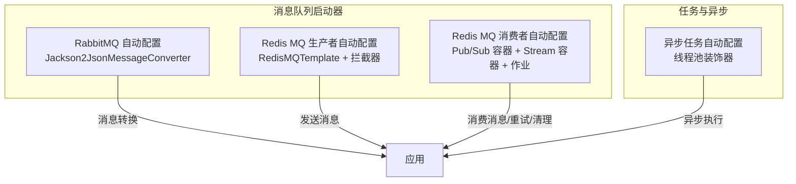
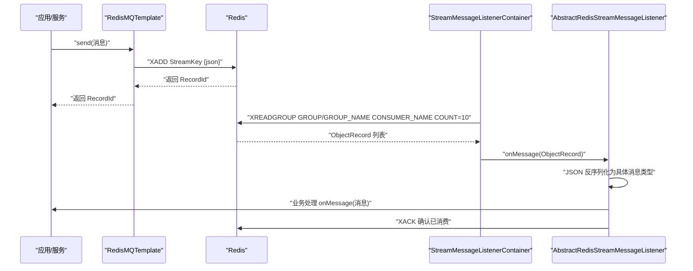
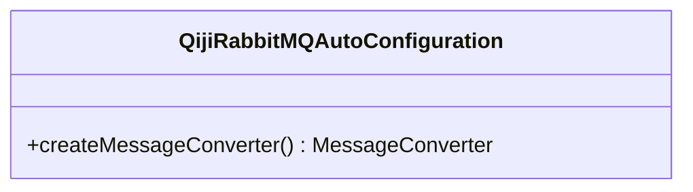
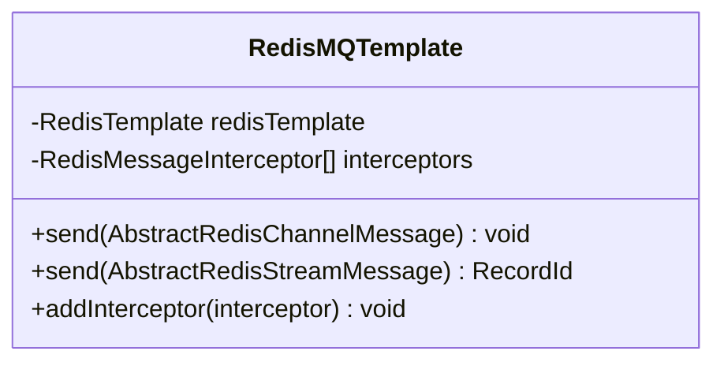
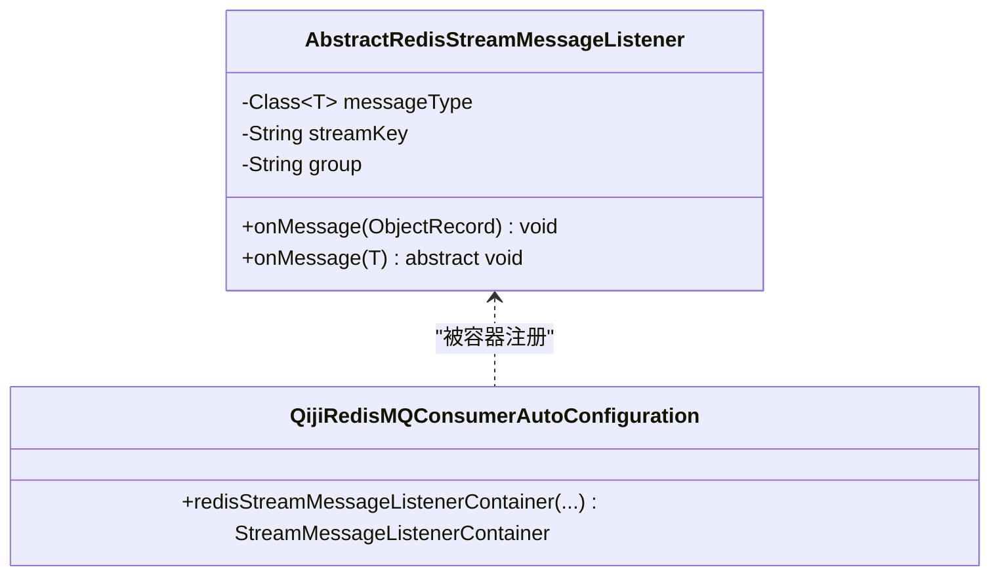
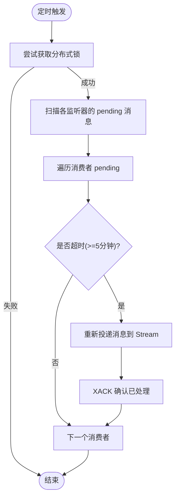
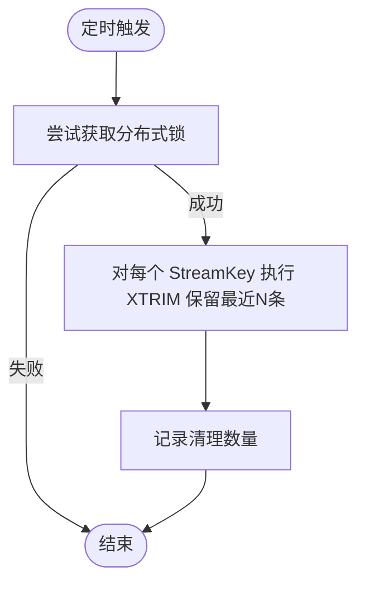
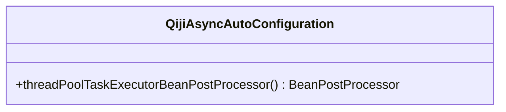
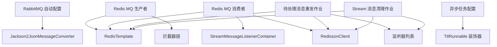

# 消息队列集成

<cite>
**本文引用的文件**
- [QijiRabbitMQAutoConfiguration.java](file://backend/qiji-framework/qiji-spring-boot-starter-mq/src/main/java/com/qiji/cps/framework/mq/rabbitmq/config/QijiRabbitMQAutoConfiguration.java)
- [QijiRedisMQConsumerAutoConfiguration.java](file://backend/qiji-framework/qiji-spring-boot-starter-mq/src/main/java/com/qiji/cps/framework/mq/redis/config/QijiRedisMQConsumerAutoConfiguration.java)
- [QijiRedisMQProducerAutoConfiguration.java](file://backend/qiji-framework/qiji-spring-boot-starter-mq/src/main/java/com/qiji/cps/framework/mq/redis/config/QijiRedisMQProducerAutoConfiguration.java)
- [RedisMQTemplate.java](file://backend/qiji-framework/qiji-spring-boot-starter-mq/src/main/java/com/qiji/cps/framework/mq/redis/core/RedisMQTemplate.java)
- [AbstractRedisStreamMessageListener.java](file://backend/qiji-framework/qiji-spring-boot-starter-mq/src/main/java/com/qiji/cps/framework/mq/redis/core/stream/AbstractRedisStreamMessageListener.java)
- [RedisPendingMessageResendJob.java](file://backend/qiji-framework/qiji-spring-boot-starter-mq/src/main/java/com/qiji/cps/framework/mq/redis/core/job/RedisPendingMessageResendJob.java)
- [RedisStreamMessageCleanupJob.java](file://backend/qiji-framework/qiji-spring-boot-starter-mq/src/main/java/com/qiji/cps/framework/mq/redis/core/job/RedisStreamMessageCleanupJob.java)
- [QijiAsyncAutoConfiguration.java](file://backend/qiji-framework/qiji-spring-boot-starter-job/src/main/java/com/qiji/cps/framework/quartz/config/QijiAsyncAutoConfiguration.java)
</cite>

## 目录
1. [引言](#引言)
2. [项目结构](#项目结构)
3. [核心组件](#核心组件)
4. [架构总览](#架构总览)
5. [详细组件分析](#详细组件分析)
6. [依赖分析](#依赖分析)
7. [性能考量](#性能考量)
8. [故障排查指南](#故障排查指南)
9. [结论](#结论)
10. [附录](#附录)

## 引言
本文件面向消息队列集成场景，系统性梳理 RabbitMQ 与 Redis Stream 的实现与最佳实践，覆盖消息生产者、消费者、交换机/路由配置、消费者组与消息确认、异步任务执行、可靠性保障（持久化、重试、死信）、监控与管理（消息追踪、消费延迟、队列状态），以及序列化/反序列化与错误处理建议。文档以仓库中现有实现为依据，辅以架构图与流程图帮助理解。

## 项目结构
消息队列能力主要由两个模块提供：
- 消息队列启动器：负责自动装配 RabbitMQ 的消息转换器与 Redis MQ 的生产者/消费者容器、作业与拦截器。
- 任务调度与异步：提供基于线程池的异步执行与上下文传递支持。

**图表来源**
- [QijiRabbitMQAutoConfiguration.java:15-28](file://backend/qiji-framework/qiji-spring-boot-starter-mq/src/main/java/com/qiji/cps/framework/mq/rabbitmq/config/QijiRabbitMQAutoConfiguration.java#L15-L28)
- [QijiRedisMQProducerAutoConfiguration.java:19-29](file://backend/qiji-framework/qiji-spring-boot-starter-mq/src/main/java/com/qiji/cps/framework/mq/redis/config/QijiRedisMQProducerAutoConfiguration.java#L19-L29)
- [QijiRedisMQConsumerAutoConfiguration.java:41-135](file://backend/qiji-framework/qiji-spring-boot-starter-mq/src/main/java/com/qiji/cps/framework/mq/redis/config/QijiRedisMQConsumerAutoConfiguration.java#L41-L135)
- [QijiAsyncAutoConfiguration.java:15-45](file://backend/qiji-framework/qiji-spring-boot-starter-job/src/main/java/com/qiji/cps/framework/quartz/config/QijiAsyncAutoConfiguration.java#L15-L45)

**章节来源**
- [QijiRabbitMQAutoConfiguration.java:15-28](file://backend/qiji-framework/qiji-spring-boot-starter-mq/src/main/java/com/qiji/cps/framework/mq/rabbitmq/config/QijiRabbitMQAutoConfiguration.java#L15-L28)
- [QijiRedisMQProducerAutoConfiguration.java:19-29](file://backend/qiji-framework/qiji-spring-boot-starter-mq/src/main/java/com/qiji/cps/framework/mq/redis/config/QijiRedisMQProducerAutoConfiguration.java#L19-L29)
- [QijiRedisMQConsumerAutoConfiguration.java:41-135](file://backend/qiji-framework/qiji-spring-boot-starter-mq/src/main/java/com/qiji/cps/framework/mq/redis/config/QijiRedisMQConsumerAutoConfiguration.java#L41-L135)
- [QijiAsyncAutoConfiguration.java:15-45](file://backend/qiji-framework/qiji-spring-boot-starter-job/src/main/java/com/qiji/cps/framework/quartz/config/QijiAsyncAutoConfiguration.java#L15-L45)

## 核心组件
- RabbitMQ 自动配置：提供 Jackson2JsonMessageConverter，确保消息以 JSON 形式序列化/反序列化，便于跨语言与可观测性。
- Redis MQ 生产者模板：封装 RedisTemplate，支持 Pub/Sub 与 Stream 两种模式的消息发送，并内置拦截器链路，便于扩展埋点与横切逻辑。
- Redis MQ 消费者容器：自动装配 Redis Pub/Sub 监听器容器与 Redis Stream 集群消费容器，按消费者组消费并手动确认。
- Redis MQ 作业：包含“待处理消息重发”与“Stream 消息清理”两个定时任务，分别处理崩溃后的未消费消息与内存占用控制。
- 异步任务自动配置：启用 @EnableAsync，提供线程池装饰器以支持多级调用的上下文传递。

**章节来源**
- [QijiRabbitMQAutoConfiguration.java:20-26](file://backend/qiji-framework/qiji-spring-boot-starter-mq/src/main/java/com/qiji/cps/framework/mq/rabbitmq/config/QijiRabbitMQAutoConfiguration.java#L20-L26)
- [RedisMQTemplate.java:33-64](file://backend/qiji-framework/qiji-spring-boot-starter-mq/src/main/java/com/qiji/cps/framework/mq/redis/core/RedisMQTemplate.java#L33-L64)
- [QijiRedisMQConsumerAutoConfiguration.java:47-135](file://backend/qiji-framework/qiji-spring-boot-starter-mq/src/main/java/com/qiji/cps/framework/mq/redis/config/QijiRedisMQConsumerAutoConfiguration.java#L47-L135)
- [RedisPendingMessageResendJob.java:43-56](file://backend/qiji-framework/qiji-spring-boot-starter-mq/src/main/java/com/qiji/cps/framework/mq/redis/core/job/RedisPendingMessageResendJob.java#L43-L56)
- [RedisStreamMessageCleanupJob.java:40-53](file://backend/qiji-framework/qiji-spring-boot-starter-mq/src/main/java/com/qiji/cps/framework/mq/redis/core/job/RedisStreamMessageCleanupJob.java#L40-L53)
- [QijiAsyncAutoConfiguration.java:16-43](file://backend/qiji-framework/qiji-spring-boot-starter-job/src/main/java/com/qiji/cps/framework/quartz/config/QijiAsyncAutoConfiguration.java#L16-L43)

## 架构总览
下图展示消息从生产到消费的关键路径，以及 Redis Stream 的消费者组与确认机制。

**图表来源**
- [RedisMQTemplate.java:54-64](file://backend/qiji-framework/qiji-spring-boot-starter-mq/src/main/java/com/qiji/cps/framework/mq/redis/core/RedisMQTemplate.java#L54-L64)
- [QijiRedisMQConsumerAutoConfiguration.java:92-135](file://backend/qiji-framework/qiji-spring-boot-starter-mq/src/main/java/com/qiji/cps/framework/mq/redis/config/QijiRedisMQConsumerAutoConfiguration.java#L92-L135)
- [AbstractRedisStreamMessageListener.java:62-80](file://backend/qiji-framework/qiji-spring-boot-starter-mq/src/main/java/com/qiji/cps/framework/mq/redis/core/stream/AbstractRedisStreamMessageListener.java#L62-L80)

## 详细组件分析

### RabbitMQ 集成
- 消息转换器：通过 Jackson2JsonMessageConverter 统一消息序列化策略，确保消息体为 JSON，便于调试与跨系统互通。
- 适用场景：对可靠性与路由有强需求的场景，可结合交换机/路由键实现复杂拓扑。

**图表来源**
- [QijiRabbitMQAutoConfiguration.java:23-26](file://backend/qiji-framework/qiji-spring-boot-starter-mq/src/main/java/com/qiji/cps/framework/mq/rabbitmq/config/QijiRabbitMQAutoConfiguration.java#L23-L26)

**章节来源**
- [QijiRabbitMQAutoConfiguration.java:15-28](file://backend/qiji-framework/qiji-spring-boot-starter-mq/src/main/java/com/qiji/cps/framework/mq/rabbitmq/config/QijiRabbitMQAutoConfiguration.java#L15-L28)

### Redis MQ 生产者
- 发送方式：
  - Pub/Sub：适用于广播/通知类消息，使用频道发布。
  - Stream：适用于可靠队列，使用流键与消费者组，支持确认与重试。
- 拦截器链：发送前后依次调用拦截器，便于埋点、审计与限流。

**图表来源**
- [RedisMQTemplate.java:22-88](file://backend/qiji-framework/qiji-spring-boot-starter-mq/src/main/java/com/qiji/cps/framework/mq/redis/core/RedisMQTemplate.java#L22-L88)

**章节来源**
- [RedisMQTemplate.java:33-64](file://backend/qiji-framework/qiji-spring-boot-starter-mq/src/main/java/com/qiji/cps/framework/mq/redis/core/RedisMQTemplate.java#L33-L64)

### Redis MQ 消费者（Stream）
- 消费容器：自动创建 StreamMessageListenerContainer，按消费者组消费，关闭自动确认，改为手动确认。
- 消费者组：默认使用应用名作为组名，每个监听器绑定一个流键与消费者组。
- 反序列化与拦截器：消费前/后依次调用拦截器，便于埋点与审计。

**图表来源**
- [AbstractRedisStreamMessageListener.java:25-120](file://backend/qiji-framework/qiji-spring-boot-starter-mq/src/main/java/com/qiji/cps/framework/mq/redis/core/stream/AbstractRedisStreamMessageListener.java#L25-L120)
- [QijiRedisMQConsumerAutoConfiguration.java:92-135](file://backend/qiji-framework/qiji-spring-boot-starter-mq/src/main/java/com/qiji/cps/framework/mq/redis/config/QijiRedisMQConsumerAutoConfiguration.java#L92-L135)

**章节来源**
- [QijiRedisMQConsumerAutoConfiguration.java:92-135](file://backend/qiji-framework/qiji-spring-boot-starter-mq/src/main/java/com/qiji/cps/framework/mq/redis/config/QijiRedisMQConsumerAutoConfiguration.java#L92-L135)
- [AbstractRedisStreamMessageListener.java:62-80](file://backend/qiji-framework/qiji-spring-boot-starter-mq/src/main/java/com/qiji/cps/framework/mq/redis/core/stream/AbstractRedisStreamMessageListener.java#L62-L80)

### Redis MQ 作业：待处理消息重发
- 触发周期：每小时扫描一次，每分钟检查一次 pending 队列，35 秒执行，避免整点并发。
- 重发条件：消费者 pending 消息超过阈值（默认 5 分钟未确认）则重新投递。
- 并发控制：使用 Redisson 分布式锁，避免重复执行。

**图表来源**
- [RedisPendingMessageResendJob.java:43-98](file://backend/qiji-framework/qiji-spring-boot-starter-mq/src/main/java/com/qiji/cps/framework/mq/redis/core/job/RedisPendingMessageResendJob.java#L43-L98)

**章节来源**
- [RedisPendingMessageResendJob.java:26-56](file://backend/qiji-framework/qiji-spring-boot-starter-mq/src/main/java/com/qiji/cps/framework/mq/redis/core/job/RedisPendingMessageResendJob.java#L26-L56)
- [RedisPendingMessageResendJob.java:63-98](file://backend/qiji-framework/qiji-spring-boot-starter-mq/src/main/java/com/qiji/cps/framework/mq/redis/core/job/RedisPendingMessageResendJob.java#L63-L98)

### Redis MQ 作业：Stream 消息清理
- 触发周期：每小时执行一次。
- 清理策略：使用 XTRIM 仅保留最近 N 条消息（默认 10000），防止内存膨胀。
- 并发控制：使用 Redisson 分布式锁，避免重复执行。

**图表来源**
- [RedisStreamMessageCleanupJob.java:40-71](file://backend/qiji-framework/qiji-spring-boot-starter-mq/src/main/java/com/qiji/cps/framework/mq/redis/core/job/RedisStreamMessageCleanupJob.java#L40-L71)

**章节来源**
- [RedisStreamMessageCleanupJob.java:26-53](file://backend/qiji-framework/qiji-spring-boot-starter-mq/src/main/java/com/qiji/cps/framework/mq/redis/core/job/RedisStreamMessageCleanupJob.java#L26-L53)
- [RedisStreamMessageCleanupJob.java:58-71](file://backend/qiji-framework/qiji-spring-boot-starter-mq/src/main/java/com/qiji/cps/framework/mq/redis/core/job/RedisStreamMessageCleanupJob.java#L58-L71)

### 异步任务执行（@Async）
- 启用方式：通过 @EnableAsync 开启异步执行。
- 线程池装饰器：对 ThreadPoolTaskExecutor 与 SimpleAsyncTaskExecutor 注入 TtlRunnable 装饰器，保证多级异步调用的上下文传递。
- 使用建议：将耗时或非阻塞任务放入异步线程池，避免阻塞主线程。

**图表来源**
- [QijiAsyncAutoConfiguration.java:19-43](file://backend/qiji-framework/qiji-spring-boot-starter-job/src/main/java/com/qiji/cps/framework/quartz/config/QijiAsyncAutoConfiguration.java#L19-L43)

**章节来源**
- [QijiAsyncAutoConfiguration.java:16-43](file://backend/qiji-framework/qiji-spring-boot-starter-job/src/main/java/com/qiji/cps/framework/quartz/config/QijiAsyncAutoConfiguration.java#L16-L43)

## 依赖分析
- RabbitMQ：依赖 Jackson2JsonMessageConverter，确保消息体为 JSON。
- Redis MQ：
  - 生产者：依赖 RedisTemplate 与拦截器链。
  - 消费者：依赖 StreamMessageListenerContainer、RedissonClient、RedisTemplate。
  - 作业：依赖 RedissonClient、RedisTemplate、监听器列表。
- 异步：依赖 Spring @EnableAsync 与线程池装饰器。

**图表来源**
- [QijiRabbitMQAutoConfiguration.java:23-26](file://backend/qiji-framework/qiji-spring-boot-starter-mq/src/main/java/com/qiji/cps/framework/mq/rabbitmq/config/QijiRabbitMQAutoConfiguration.java#L23-L26)
- [QijiRedisMQProducerAutoConfiguration.java:23-29](file://backend/qiji-framework/qiji-spring-boot-starter-mq/src/main/java/com/qiji/cps/framework/mq/redis/config/QijiRedisMQProducerAutoConfiguration.java#L23-L29)
- [QijiRedisMQConsumerAutoConfiguration.java:92-135](file://backend/qiji-framework/qiji-spring-boot-starter-mq/src/main/java/com/qiji/cps/framework/mq/redis/config/QijiRedisMQConsumerAutoConfiguration.java#L92-L135)
- [RedisPendingMessageResendJob.java:36-38](file://backend/qiji-framework/qiji-spring-boot-starter-mq/src/main/java/com/qiji/cps/framework/mq/redis/core/job/RedisPendingMessageResendJob.java#L36-L38)
- [RedisStreamMessageCleanupJob.java:33-35](file://backend/qiji-framework/qiji-spring-boot-starter-mq/src/main/java/com/qiji/cps/framework/mq/redis/core/job/RedisStreamMessageCleanupJob.java#L33-L35)
- [QijiAsyncAutoConfiguration.java:27-37](file://backend/qiji-framework/qiji-spring-boot-starter-job/src/main/java/com/qiji/cps/framework/quartz/config/QijiAsyncAutoConfiguration.java#L27-L37)

**章节来源**
- [QijiRabbitMQAutoConfiguration.java:15-28](file://backend/qiji-framework/qiji-spring-boot-starter-mq/src/main/java/com/qiji/cps/framework/mq/rabbitmq/config/QijiRabbitMQAutoConfiguration.java#L15-L28)
- [QijiRedisMQProducerAutoConfiguration.java:19-29](file://backend/qiji-framework/qiji-spring-boot-starter-mq/src/main/java/com/qiji/cps/framework/mq/redis/config/QijiRedisMQProducerAutoConfiguration.java#L19-L29)
- [QijiRedisMQConsumerAutoConfiguration.java:41-135](file://backend/qiji-framework/qiji-spring-boot-starter-mq/src/main/java/com/qiji/cps/framework/mq/redis/config/QijiRedisMQConsumerAutoConfiguration.java#L41-L135)
- [QijiAsyncAutoConfiguration.java:16-43](file://backend/qiji-framework/qiji-spring-boot-starter-job/src/main/java/com/qiji/cps/framework/quartz/config/QijiAsyncAutoConfiguration.java#L16-L43)

## 性能考量
- Redis Stream 消费批大小：容器选项中设置批量拉取条数，建议根据业务吞吐与处理耗时调整，避免过大导致延迟增加，过小导致频繁往返。
- 消费者组与并发：同一消费者组内多实例水平扩展时，注意消费者名称唯一性（IP+进程号），避免冲突。
- 定时任务节流：重发与清理任务已采用分布式锁与固定周期，建议结合业务峰值合理调整阈值与保留条数。
- 序列化成本：JSON 序列化/反序列化开销可控，但需避免消息体过大；必要时可压缩或拆分消息。
- 线程池：异步任务线程池大小应结合 CPU 核数与 IO 密集度配置，避免过度并发导致上下文切换开销增大。

## 故障排查指南
- Redis 版本校验：消费者容器在启动时会校验 Redis 版本不低于 5.0.0，若低于要求会抛出异常，请升级 Redis。
- 消费异常与确认：监听器中消费完成后需手动确认；如出现异常，建议记录异常日志并评估是否重试或进入死信。
- 待处理消息重发：若发现消息长时间未消费，检查重发作业是否正常运行，确认分布式锁可用与 pending 队列存在超时消息。
- Stream 清理：若内存持续增长，检查清理作业是否执行，确认保留条数配置是否合理。
- Pub/Sub 广播：若广播消息未到达订阅者，检查监听器容器是否正确注册对应频道。

**章节来源**
- [QijiRedisMQConsumerAutoConfiguration.java:150-160](file://backend/qiji-framework/qiji-spring-boot-starter-mq/src/main/java/com/qiji/cps/framework/mq/redis/config/QijiRedisMQConsumerAutoConfiguration.java#L150-L160)
- [RedisPendingMessageResendJob.java:50-55](file://backend/qiji-framework/qiji-spring-boot-starter-mq/src/main/java/com/qiji/cps/framework/mq/redis/core/job/RedisPendingMessageResendJob.java#L50-L55)
- [RedisStreamMessageCleanupJob.java:47-52](file://backend/qiji-framework/qiji-spring-boot-starter-mq/src/main/java/com/qiji/cps/framework/mq/redis/core/job/RedisStreamMessageCleanupJob.java#L47-L52)

## 结论
该实现以自动配置为核心，提供了 RabbitMQ 的 JSON 序列化与 Redis MQ 的生产/消费/重试/清理能力，配合异步任务与线程池装饰器，形成一套可扩展、可观测、可运维的消息队列方案。建议在生产环境结合业务特性进一步完善重试策略、死信队列、监控告警与容量规划。

## 附录
- 最佳实践摘要
  - 序列化：统一使用 JSON，字段命名清晰，避免大对象。
  - 可靠性：Stream 模式下务必手动确认；对关键流程引入幂等与去重。
  - 重试与死信：结合 pending 超时与 XACK 机制设计重试与死信处理。
  - 监控：关注 pending 数量、消费延迟、清理命中率与异常日志。
  - 异步：合理划分同步/异步边界，避免阻塞线程池。