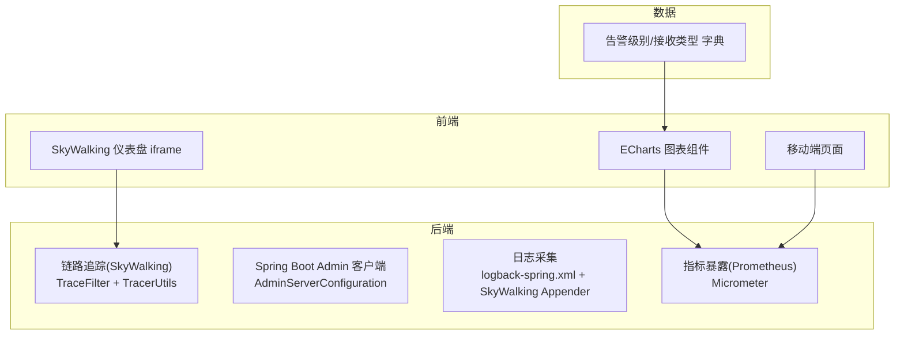
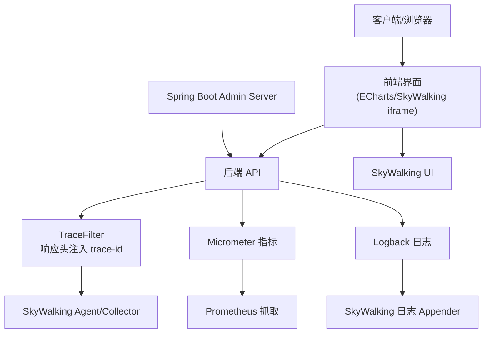
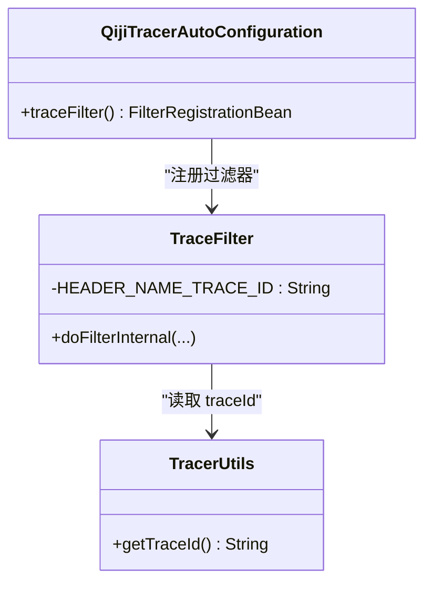
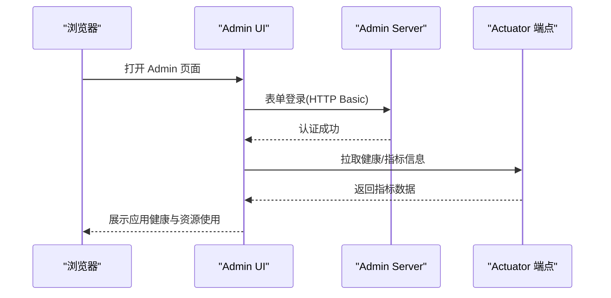
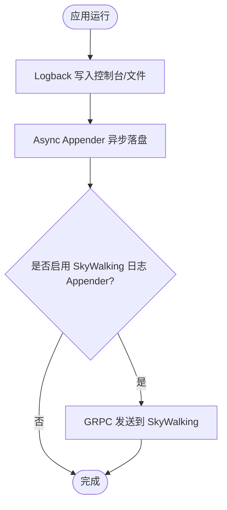
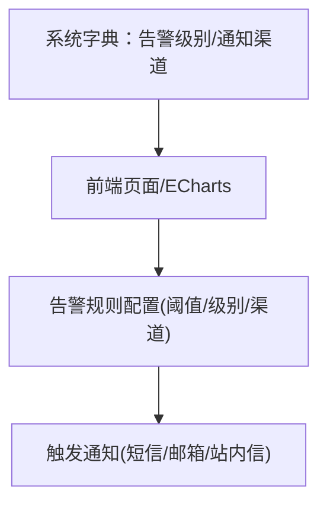
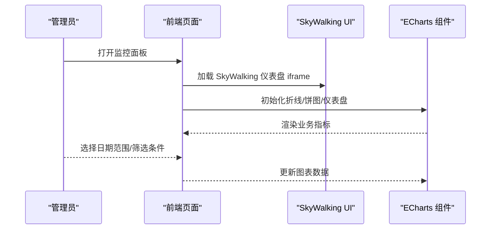
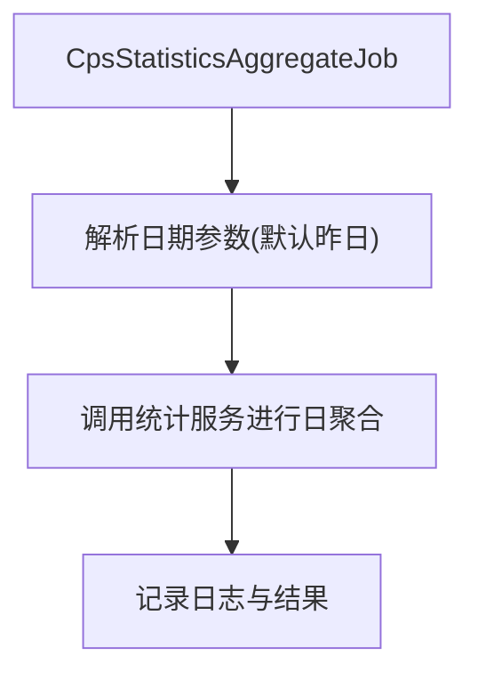
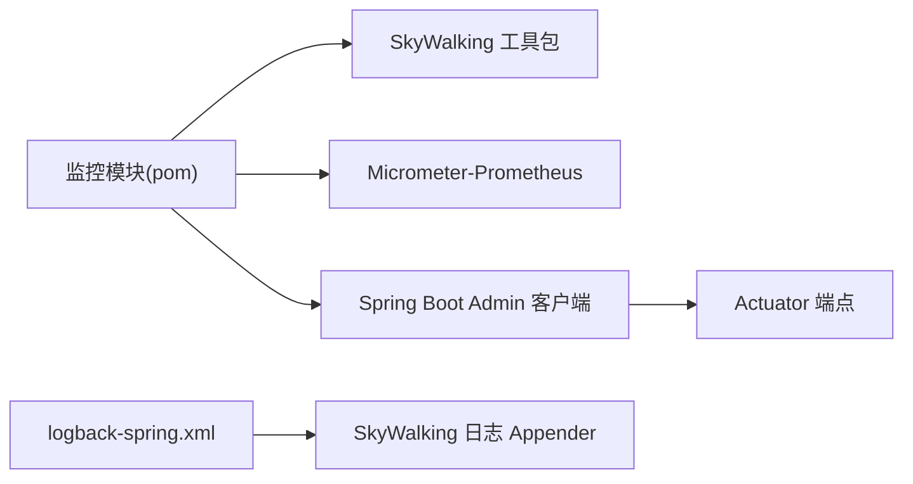

# 监控告警系统

<cite>
**本文引用的文件**   
- [QijiTracerAutoConfiguration.java](file://backend/qiji-framework/qiji-spring-boot-starter-monitor/src/main/java/com/qiji/cps/framework/tracer/config/QijiTracerAutoConfiguration.java)
- [TraceFilter.java](file://backend/qiji-framework/qiji-spring-boot-starter-monitor/src/main/java/com/qiji/cps/framework/monitor/core/filter/TraceFilter.java)
- [TracerProperties.java](file://backend/qiji-framework/qiji-spring-boot-starter-monitor/src/main/java/com/qiji/cps/framework/tracer/config/TracerProperties.java)
- [TracerUtils.java](file://backend/qiji-framework/qiji-common/src/main/java/com/qiji/cps/framework/common/util/monitor/TracerUtils.java)
- [pom.xml（监控模块）](file://backend/qiji-framework/qiji-spring-boot-starter-monitor/pom.xml)
- [logback-spring.xml（服务端）](file://backend/qiji-server/src/main/resources/logback-spring.xml)
- [AdminServerConfiguration.java](file://backend/qiji-module-infra/src/main/java/com/qiji/cps/module/infra/framework/monitor/config/AdminServerConfiguration.java)
- [skywalking/index.vue](file://frontend/admin-vue3/src/views/infra/skywalking/index.vue)
- [ruoyi-vue-pro.sql（字典：告警级别/接收类型）](file://backend/sql/mysql/ruoyi-vue-pro.sql)
- [DeviceCountCard.vue](file://frontend/admin-vue3/src/views/iot/home/components/DeviceCountCard.vue)
- [DeviceStateCountCard.vue](file://frontend/admin-vue3/src/views/iot/home/components/DeviceStateCountCard.vue)
- [echarts-data.ts](file://frontend/admin-vue3/src/views/Home/echarts-data.ts)
- [CpsStatisticsAggregateJob.java](file://backend/qiji-module-cps/qiji-module-cps-biz/src/main/java/com/qiji/cps/module/cps/job/CpsStatisticsAggregateJob.java)
</cite>

## 目录
1. [简介](#简介)
2. [项目结构](#项目结构)
3. [核心组件](#核心组件)
4. [架构总览](#架构总览)
5. [详细组件分析](#详细组件分析)
6. [依赖分析](#依赖分析)
7. [性能考虑](#性能考虑)
8. [故障排查指南](#故障排查指南)
9. [结论](#结论)
10. [附录](#附录)

## 简介
本技术文档面向监控告警系统，围绕链路追踪集成（SkyWalking）、系统监控（应用健康、资源使用、业务指标）、日志收集分析（聚合、搜索过滤、实时分析）、告警规则配置（阈值、级别、通知渠道）、监控仪表板（图表展示、自定义报表、移动端监控）等方面进行深入说明，并提供性能优化建议、故障排查方法与最佳实践。

## 项目结构
监控告警系统由“后端监控能力”“前端可视化与接入”“数据库字典支撑”三部分组成：
- 后端监控能力：链路追踪（SkyWalking 集成）、Spring Boot Admin 客户端、Micrometer+Prometheus、日志采集（Logback+SkyWalking Appender）
- 前端可视化与接入：SkyWalking 仪表盘 iframe、ECharts 图表组件、移动端页面
- 数据库字典：告警级别与接收类型

**图示来源**
- [QijiTracerAutoConfiguration.java:17-53](file://backend/qiji-framework/qiji-spring-boot-starter-monitor/src/main/java/com/qiji/cps/framework/tracer/config/QijiTracerAutoConfiguration.java#L17-L53)
- [AdminServerConfiguration.java:29-107](file://backend/qiji-module-infra/src/main/java/com/qiji/cps/module/infra/framework/monitor/config/AdminServerConfiguration.java#L29-L107)
- [logback-spring.xml（服务端）:37-54](file://backend/qiji-server/src/main/resources/logback-spring.xml#L37-L54)
- [skywalking/index.vue:1-27](file://frontend/admin-vue3/src/views/infra/skywalking/index.vue#L1-L27)

**章节来源**
- [pom.xml（监控模块）:18-76](file://backend/qiji-framework/qiji-spring-boot-starter-monitor/pom.xml#L18-L76)
- [logback-spring.xml（服务端）:1-56](file://backend/qiji-server/src/main/resources/logback-spring.xml#L1-L56)
- [skywalking/index.vue:1-27](file://frontend/admin-vue3/src/views/infra/skywalking/index.vue#L1-L27)

## 核心组件
- 链路追踪集成
  - 自动装配：在满足 SkyWalking 依赖存在时启用，注册 TraceFilter 并设置 trace-id 响应头
  - 工具类：提供获取 SkyWalking TraceId 的静态方法
- 系统监控
  - Spring Boot Admin：服务端启用与安全配置；客户端通过 starter 注册
  - 指标暴露：Micrometer + Prometheus
- 日志收集分析
  - Logback 配置：控制台、异步文件、可选 SkyWalking GRPC Appender
- 告警规则配置
  - 基于系统字典：告警级别（INFO/WARN/ERROR 等）、通知渠道（短信/邮箱/站内信）
- 仪表板
  - SkyWalking 仪表盘 iframe
  - ECharts 图表组件（折线、饼图、仪表盘等）
  - 移动端页面

**章节来源**
- [QijiTracerAutoConfiguration.java:17-53](file://backend/qiji-framework/qiji-spring-boot-starter-monitor/src/main/java/com/qiji/cps/framework/tracer/config/QijiTracerAutoConfiguration.java#L17-L53)
- [TraceFilter.java:17-33](file://backend/qiji-framework/qiji-spring-boot-starter-monitor/src/main/java/com/qiji/cps/framework/monitor/core/filter/TraceFilter.java#L17-L33)
- [TracerUtils.java:12-30](file://backend/qiji-framework/qiji-common/src/main/java/com/qiji/cps/framework/common/util/monitor/TracerUtils.java#L12-L30)
- [AdminServerConfiguration.java:29-107](file://backend/qiji-module-infra/src/main/java/com/qiji/cps/module/infra/framework/monitor/config/AdminServerConfiguration.java#L29-L107)
- [logback-spring.xml（服务端）:37-54](file://backend/qiji-server/src/main/resources/logback-spring.xml#L37-L54)
- [ruoyi-vue-pro.sql（字典：告警级别/接收类型）:1066-1069](file://backend/sql/mysql/ruoyi-vue-pro.sql#L1066-L1069)

## 架构总览
系统采用“后端埋点 + SkyWalking + Admin + Prometheus + 前端可视化”的架构，实现链路追踪、应用健康、资源使用、业务指标与日志的统一监控。

**图示来源**
- [QijiTracerAutoConfiguration.java:45-51](file://backend/qiji-framework/qiji-spring-boot-starter-monitor/src/main/java/com/qiji/cps/framework/tracer/config/QijiTracerAutoConfiguration.java#L45-L51)
- [TraceFilter.java:24-30](file://backend/qiji-framework/qiji-spring-boot-starter-monitor/src/main/java/com/qiji/cps/framework/monitor/core/filter/TraceFilter.java#L24-L30)
- [logback-spring.xml（服务端）:37-54](file://backend/qiji-server/src/main/resources/logback-spring.xml#L37-L54)
- [AdminServerConfiguration.java:30-105](file://backend/qiji-module-infra/src/main/java/com/qiji/cps/module/infra/framework/monitor/config/AdminServerConfiguration.java#L30-L105)

## 详细组件分析

### 链路追踪集成（SkyWalking）
- 自动装配与条件启用
  - 当存在 SkyWalking OpenTracing/SkywalkingTracer 与 Servlet Filter 类时启用
  - 默认开启，可通过配置开关控制
- TraceFilter
  - 在响应头中注入 trace-id，便于跨服务关联
- TracerUtils
  - 提供 SkyWalking TraceContext.traceId 的便捷调用
- 依赖与版本
  - 引入 apm-toolkit-trace、apm-toolkit-logback-1.x、apm-toolkit-opentracing、opentracing-api/util/noop
  - 与 Micrometer Prometheus 依赖共存

**图示来源**
- [QijiTracerAutoConfiguration.java:17-53](file://backend/qiji-framework/qiji-spring-boot-starter-monitor/src/main/java/com/qiji/cps/framework/tracer/config/QijiTracerAutoConfiguration.java#L17-L53)
- [TraceFilter.java:17-33](file://backend/qiji-framework/qiji-spring-boot-starter-monitor/src/main/java/com/qiji/cps/framework/monitor/core/filter/TraceFilter.java#L17-L33)
- [TracerUtils.java:12-30](file://backend/qiji-framework/qiji-common/src/main/java/com/qiji/cps/framework/common/util/monitor/TracerUtils.java#L12-L30)

**章节来源**
- [QijiTracerAutoConfiguration.java:17-53](file://backend/qiji-framework/qiji-spring-boot-starter-monitor/src/main/java/com/qiji/cps/framework/tracer/config/QijiTracerAutoConfiguration.java#L17-L53)
- [TraceFilter.java:17-33](file://backend/qiji-framework/qiji-spring-boot-starter-monitor/src/main/java/com/qiji/cps/framework/monitor/core/filter/TraceFilter.java#L17-L33)
- [TracerUtils.java:12-30](file://backend/qiji-framework/qiji-common/src/main/java/com/qiji/cps/framework/common/util/monitor/TracerUtils.java#L12-L30)
- [pom.xml（监控模块）:43-70](file://backend/qiji-framework/qiji-spring-boot-starter-monitor/pom.xml#L43-L70)

### 系统监控（应用健康、资源使用、业务指标）
- Spring Boot Admin
  - 启用 Admin Server，独立安全链路，HTTP Basic 用于客户端注册
  - 与现有 Token 认证互不影响
- 指标暴露（Prometheus）
  - 引入 micrometer-registry-prometheus，后端按常规暴露指标
  - 前端通过 ECharts 展示业务指标（如 CPS 统计看板）

**图示来源**
- [AdminServerConfiguration.java:61-105](file://backend/qiji-module-infra/src/main/java/com/qiji/cps/module/infra/framework/monitor/config/AdminServerConfiguration.java#L61-L105)

**章节来源**
- [AdminServerConfiguration.java:29-107](file://backend/qiji-module-infra/src/main/java/com/qiji/cps/module/infra/framework/monitor/config/AdminServerConfiguration.java#L29-L107)
- [pom.xml（监控模块）:65-70](file://backend/qiji-framework/qiji-spring-boot-starter-monitor/pom.xml#L65-L70)

### 日志收集分析（聚合、搜索过滤、实时分析）
- Logback 配置
  - 控制台与异步文件 Appender，支持按大小与时间滚动
  - 可选 SkyWalking GRPC 日志 Appender，实现日志中心
- SkyWalking 仪表盘
  - 前端通过 iframe 加载 SkyWalking UI，支持日志聚合、搜索与实时分析

**图示来源**
- [logback-spring.xml（服务端）:31-54](file://backend/qiji-server/src/main/resources/logback-spring.xml#L31-L54)
- [skywalking/index.vue:13-26](file://frontend/admin-vue3/src/views/infra/skywalking/index.vue#L13-L26)

**章节来源**
- [logback-spring.xml（服务端）:1-56](file://backend/qiji-server/src/main/resources/logback-spring.xml#L1-L56)
- [skywalking/index.vue:1-27](file://frontend/admin-vue3/src/views/infra/skywalking/index.vue#L1-L27)

### 告警规则配置（阈值、告警级别、通知渠道）
- 告警级别与通知渠道
  - 通过系统字典维护告警级别（INFO/WARN/ERROR）与接收类型（短信/邮箱/站内信）
- 前端展示
  - ECharts 图表组件用于展示业务指标趋势，结合字典实现分级展示与筛选

**图示来源**
- [ruoyi-vue-pro.sql（字典：告警级别/接收类型）:1066-1069](file://backend/sql/mysql/ruoyi-vue-pro.sql#L1066-L1069)
- [DeviceCountCard.vue:37-89](file://frontend/admin-vue3/src/views/iot/home/components/DeviceCountCard.vue#L37-L89)
- [DeviceStateCountCard.vue:78-129](file://frontend/admin-vue3/src/views/iot/home/components/DeviceStateCountCard.vue#L78-L129)

**章节来源**
- [ruoyi-vue-pro.sql（字典：告警级别/接收类型）:1066-1069](file://backend/sql/mysql/ruoyi-vue-pro.sql#L1066-L1069)
- [DeviceCountCard.vue:37-89](file://frontend/admin-vue3/src/views/iot/home/components/DeviceCountCard.vue#L37-L89)
- [DeviceStateCountCard.vue:78-129](file://frontend/admin-vue3/src/views/iot/home/components/DeviceStateCountCard.vue#L78-L129)

### 监控仪表板（图表展示、自定义报表、移动端监控）
- SkyWalking 仪表盘
  - 前端以 iframe 方式加载 SkyWalking UI，支持链路拓扑、服务指标、日志中心
- ECharts 图表
  - 折线、饼图、仪表盘等组件封装，用于业务指标可视化
- 移动端监控
  - 移动端页面适配图表与筛选，支持日期范围选择与分页加载

**图示来源**
- [skywalking/index.vue:1-27](file://frontend/admin-vue3/src/views/infra/skywalking/index.vue#L1-L27)
- [echarts-data.ts:60-113](file://frontend/admin-vue3/src/views/Home/echarts-data.ts#L60-L113)

**章节来源**
- [skywalking/index.vue:1-27](file://frontend/admin-vue3/src/views/infra/skywalking/index.vue#L1-L27)
- [echarts-data.ts:60-113](file://frontend/admin-vue3/src/views/Home/echarts-data.ts#L60-L113)

### 业务指标统计（定时聚合与报表）
- 定时任务
  - 通过 Quartz 定时作业对业务指标进行每日聚合，便于报表与看板展示
- 数据来源
  - 聚合逻辑读取当日统计数据并写入汇总表，供前端查询

**图示来源**
- [CpsStatisticsAggregateJob.java:37-63](file://backend/qiji-module-cps/qiji-module-cps-biz/src/main/java/com/qiji/cps/module/cps/job/CpsStatisticsAggregateJob.java#L37-L63)

**章节来源**
- [CpsStatisticsAggregateJob.java:37-63](file://backend/qiji-module-cps/qiji-module-cps-biz/src/main/java/com/qiji/cps/module/cps/job/CpsStatisticsAggregateJob.java#L37-L63)

## 依赖分析
- 监控模块依赖
  - SkyWalking 工具包（trace、logback、opentracing）
  - Micrometer Prometheus
  - Spring Boot Admin 客户端
- 日志与监控耦合
  - Logback 与 SkyWalking Appender 可选集成，实现日志中心
- 前后端交互
  - 前端 SkyWalking iframe 与后端 Admin UI 通过独立安全链路访问

**图示来源**
- [pom.xml（监控模块）:43-76](file://backend/qiji-framework/qiji-spring-boot-starter-monitor/pom.xml#L43-L76)
- [logback-spring.xml（服务端）:37-54](file://backend/qiji-server/src/main/resources/logback-spring.xml#L37-L54)

**章节来源**
- [pom.xml（监控模块）:18-76](file://backend/qiji-framework/qiji-spring-boot-starter-monitor/pom.xml#L18-L76)
- [logback-spring.xml（服务端）:1-56](file://backend/qiji-server/src/main/resources/logback-spring.xml#L1-L56)

## 性能考虑
- 日志性能
  - 使用 Async Appender 提升写入吞吐，避免阻塞主业务线程
  - 按大小与时间滚动，控制磁盘占用与 IO 压力
- 指标暴露
  - Micrometer 指标按需暴露，避免过多标签导致内存与序列化开销
- 链路追踪
  - trace-id 注入轻量，注意避免在高频接口中过度打点
- 前端渲染
  - ECharts 图表按需更新，避免频繁重绘；移动端页面使用分页与懒加载

[本节为通用性能建议，无需特定文件引用]

## 故障排查指南
- SkyWalking 无法看到日志
  - 检查 logback-spring.xml 中 SkyWalking 日志 Appender 是否启用
  - 确认 SkyWalking Agent/Collector 正常运行
- trace-id 未出现在响应头
  - 检查 QijiTracerAutoConfiguration 是否生效
  - 确认 TraceFilter 是否被注册并执行
- Admin UI 登录失败
  - 核对 Admin Server 安全配置与 HTTP Basic 用户名密码
  - 确认 Actuator 端点可访问
- 告警规则不生效
  - 检查系统字典项是否存在且值正确
  - 确认前端筛选与阈值配置一致

**章节来源**
- [logback-spring.xml（服务端）:37-54](file://backend/qiji-server/src/main/resources/logback-spring.xml#L37-L54)
- [QijiTracerAutoConfiguration.java:17-53](file://backend/qiji-framework/qiji-spring-boot-starter-monitor/src/main/java/com/qiji/cps/framework/tracer/config/QijiTracerAutoConfiguration.java#L17-L53)
- [AdminServerConfiguration.java:29-107](file://backend/qiji-module-infra/src/main/java/com/qiji/cps/module/infra/framework/monitor/config/AdminServerConfiguration.java#L29-L107)
- [ruoyi-vue-pro.sql（字典：告警级别/接收类型）:1066-1069](file://backend/sql/mysql/ruoyi-vue-pro.sql#L1066-L1069)

## 结论
本监控告警系统通过 SkyWalking 实现链路追踪，借助 Spring Boot Admin 与 Micrometer+Prometheus 实现应用健康与指标监控，配合 Logback 与 SkyWalking 日志 Appender 实现日志中心。前端通过 SkyWalking 仪表盘与 ECharts 图表实现可视化与移动端适配。系统具备良好的扩展性与可运维性，建议在生产环境按需启用日志 Appender、合理配置指标维度与阈值，并持续优化日志滚动与图表渲染性能。

[本节为总结性内容，无需特定文件引用]

## 附录
- 最佳实践
  - 为关键接口打点，避免过度打点
  - 使用字典集中管理告警级别与通知渠道
  - 对高频日志使用异步落盘，控制滚动策略
  - 前端图表按需刷新，避免全量重绘
- 常见问题
  - SkyWalking UI 无法访问：确认 iframe 地址与网络连通
  - 指标缺失：确认 Micrometer 依赖与暴露端点
  - 告警未触发：核对阈值、级别与接收渠道配置

[本节为通用建议，无需特定文件引用]