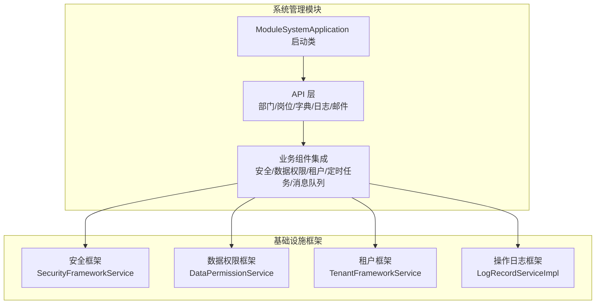
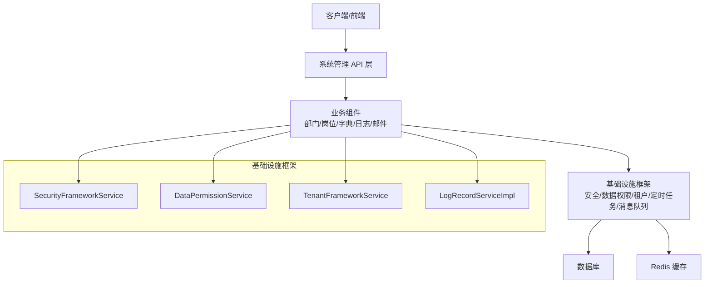
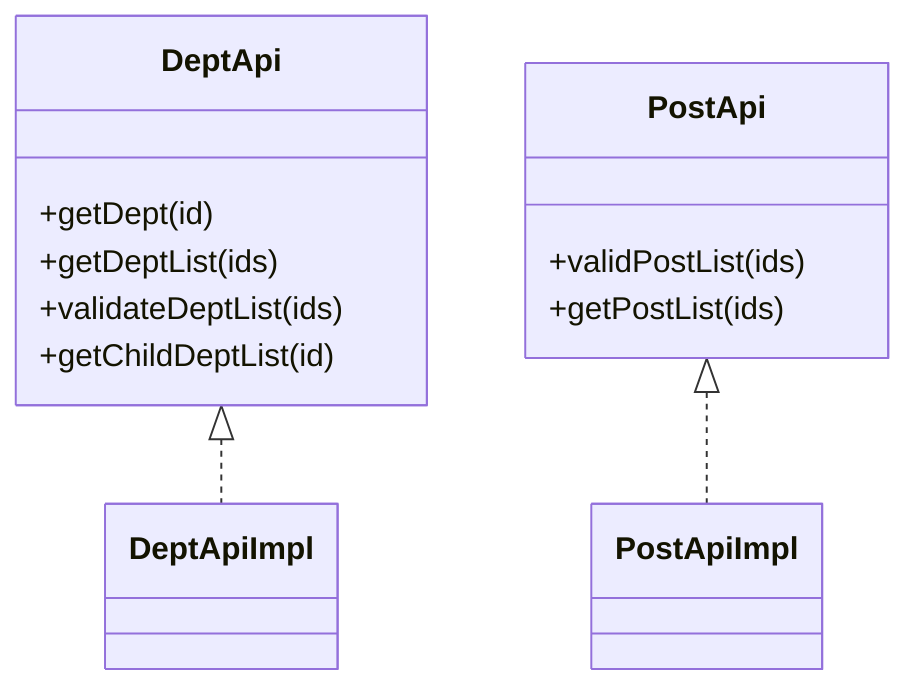
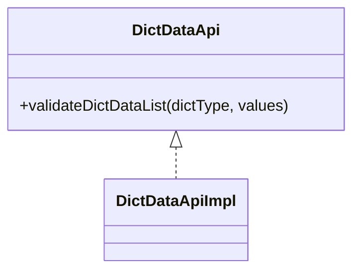
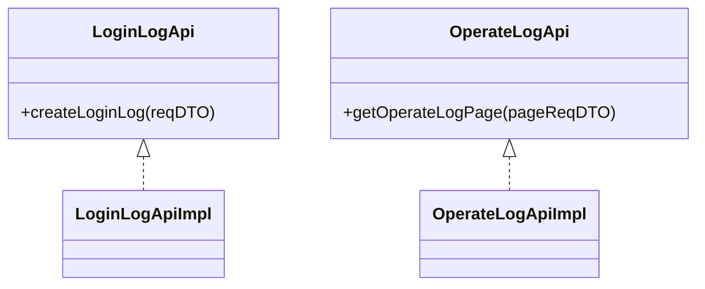
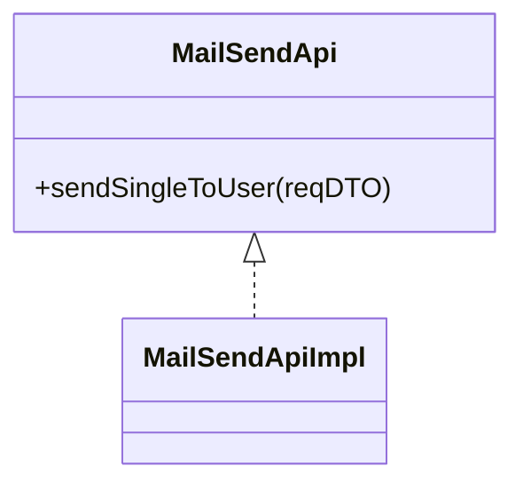
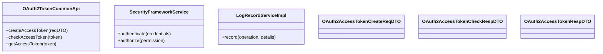
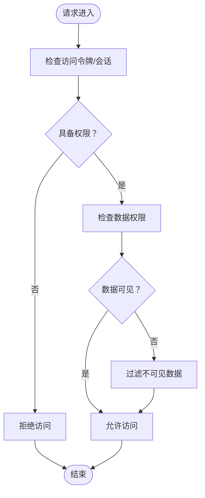
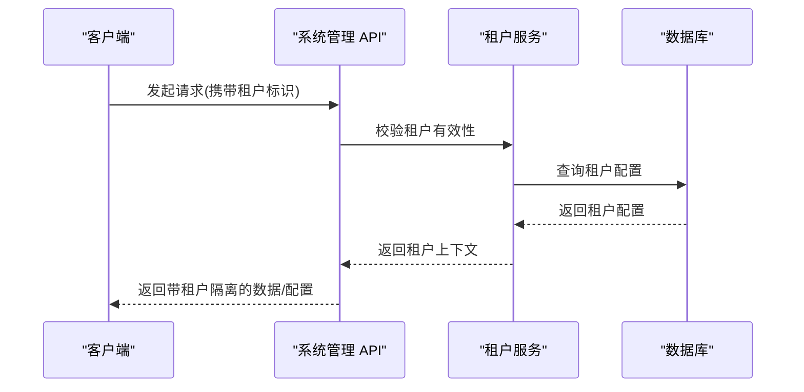
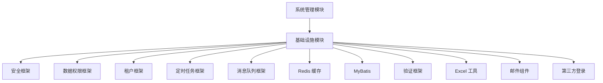

# 系统管理模块

<cite>
**本文档引用的文件**
- [ModuleSystemApplication.java](file://backend/qiji-module-system/src/main/java/com/qiji/cps/ModuleSystemApplication.java)
- [pom.xml](file://backend/qiji-module-system/pom.xml)
- [DeptApi.java](file://backend/qiji-module-system/src/main/java/com/qiji/cps/module/system/api/dept/DeptApi.java)
- [DeptApiImpl.java](file://backend/qiji-module-system/src/main/java/com/qiji/cps/module/system/api/dept/DeptApiImpl.java)
- [PostApi.java](file://backend/qiji-module-system/src/main/java/com/qiji/cps/module/system/api/dept/PostApi.java)
- [PostApiImpl.java](file://backend/qiji-module-system/src/main/java/com/qiji/cps/module/system/api/dept/PostApiImpl.java)
- [DictDataApi.java](file://backend/qiji-module-system/src/main/java/com/qiji/cps/module/system/api/dict/DictDataApi.java)
- [DictDataApiImpl.java](file://backend/qiji-module-system/src/main/java/com/qiji/cps/module/system/api/dict/DictDataApiImpl.java)
- [LoginLogApi.java](file://backend/qiji-module-system/src/main/java/com/qiji/cps/module/system/api/logger/LoginLogApi.java)
- [LoginLogApiImpl.java](file://backend/qiji-module-system/src/main/java/com/qiji/cps/module/system/api/logger/LoginLogApiImpl.java)
- [OperateLogApi.java](file://backend/qiji-module-system/src/main/java/com/qiji/cps/module/system/api/logger/OperateLogApi.java)
- [OperateLogApiImpl.java](file://backend/qiji-module-system/src/main/java/com/qiji/cps/module/system/api/logger/OperateLogApiImpl.java)
- [MailSendApi.java](file://backend/qiji-module-system/src/main/java/com/qiji/cps/module/system/api/mail/MailSendApi.java)
- [MailSendApiImpl.java](file://backend/qiji-module-system/src/main/java/com/qiji/cps/module/system/api/mail/MailSendApiImpl.java)
- [TenantFrameworkService.java](file://backend/qiji-framework/qiji-spring-boot-starter-biz-tenant/src/main/java/com/qiji/cps/framework/tenant/core/service/TenantFrameworkService.java)
- [TenantFrameworkServiceImpl.java](file://backend/qiji-framework/qiji-spring-boot-starter-biz-tenant/src/main/java/com/qiji/cps/framework/tenant/core/service/TenantFrameworkServiceImpl.java)
- [SecurityFrameworkService.java](file://backend/qiji-framework/qiji-spring-boot-starter-security/src/main/java/com/qiji/cps/framework/security/core/service/SecurityFrameworkService.java)
- [SecurityFrameworkServiceImpl.java](file://backend/qiji-framework/qiji-spring-boot-starter-security/src/main/java/com/qiji/cps/framework/security/core/service/SecurityFrameworkServiceImpl.java)
- [LogRecordServiceImpl.java](file://backend/qiji-framework/qiji-spring-boot-starter-security/src/main/java/com/qiji/cps/framework/operatelog/core/service/LogRecordServiceImpl.java)
- [DataPermissionService.java](file://backend/qiji-framework/qiji-spring-boot-starter-biz-data-permission/src/main/java/com/qiji/cps/framework/datapermission/core/service/DataPermissionService.java)
- [DataPermissionServiceImpl.java](file://backend/qiji-framework/qiji-spring-boot-starter-biz-data-permission/src/main/java/com/qiji/cps/framework/datapermission/core/service/DataPermissionServiceImpl.java)
- [OAuth2TokenCommonApi.java](file://backend/qiji-framework/qiji-common/src/main/java/com/qiji/cps/framework/common/biz/system/oauth2/OAuth2TokenCommonApi.java)
- [OAuth2AccessTokenCheckRespDTO.java](file://backend/qiji-framework/qiji-common/src/main/java/com/qiji/cps/framework/common/biz/system/oauth2/dto/OAuth2AccessTokenCheckRespDTO.java)
- [OAuth2AccessTokenCreateReqDTO.java](file://backend/qiji-framework/qiji-common/src/main/java/com/qiji/cps/framework/common/biz/system/oauth2/dto/OAuth2AccessTokenCreateReqDTO.java)
- [OAuth2AccessTokenRespDTO.java](file://backend/qiji-framework/qiji-common/src/main/java/com/qiji/cps/framework/common/biz/system/oauth2/dto/OAuth2AccessTokenRespDTO.java)
- [OperateLogCommonApi.java](file://backend/qiji-framework/qiji-common/src/main/java/com/qiji/cps/framework/common/biz/system/logger/OperateLogCommonApi.java)
- [OperateLogCreateReqDTO.java](file://backend/qiji-framework/qiji-common/src/main/java/com/qiji/cps/framework/common/biz/system/logger/dto/OperateLogCreateReqDTO.java)
- [DictDataCommonApi.java](file://backend/qiji-framework/qiji-common/src/main/java/com/qiji/cps/framework/common/biz/system/dict/DictDataCommonApi.java)
- [DictDataRespDTO.java](file://backend/qiji-framework/qiji-common/src/main/java/com/qiji/cps/framework/common/biz/system/dict/dto/DictDataRespDTO.java)
- [package-info.java](file://backend/qiji-framework/qiji-common/src/main/java/com/qiji/cps/framework/common/biz/system/package-info.java)
</cite>

## 目录
1. [简介](#简介)
2. [项目结构](#项目结构)
3. [核心组件](#核心组件)
4. [架构总览](#架构总览)
5. [详细组件分析](#详细组件分析)
6. [依赖分析](#依赖分析)
7. [性能考虑](#性能考虑)
8. [故障排除指南](#故障排除指南)
9. [结论](#结论)
10. [附录](#附录)

## 简介
本技术文档面向系统管理模块，围绕用户管理、部门管理、菜单管理、角色权限管理、字典管理等核心功能进行深入解析，并详细说明用户认证授权机制（登录日志、操作日志、安全配置）、权限控制体系（基于角色的权限控制 RBAC、菜单权限、数据权限）、系统配置管理（参数配置、系统设置、租户管理）。同时提供 API 接口定义、配置示例与使用方法，帮助开发者快速理解并扩展系统管理能力。

## 项目结构
系统管理模块位于后端工程的独立模块中，采用多模块聚合架构，通过 Maven 管理依赖，整合基础设施与业务组件，形成统一的系统管理能力。

**图表来源**
- [ModuleSystemApplication.java:1-15](file://backend/qiji-module-system/src/main/java/com/qiji/cps/ModuleSystemApplication.java#L1-L15)
- [pom.xml:20-122](file://backend/qiji-module-system/pom.xml#L20-L122)

**章节来源**
- [ModuleSystemApplication.java:1-15](file://backend/qiji-module-system/src/main/java/com/qiji/cps/ModuleSystemApplication.java#L1-L15)
- [pom.xml:1-125](file://backend/qiji-module-system/pom.xml#L1-L125)

## 核心组件
系统管理模块由以下核心组件构成：
- 用户与组织单元：部门、岗位、用户关联
- 权限与安全：基于角色的权限控制（RBAC）、登录/操作日志、安全配置
- 数据与字典：字典数据管理与校验
- 租户与多租户：租户隔离与配置
- 配置与系统设置：参数配置、系统设置、定时任务、消息队列

这些组件通过 API 接口对外提供能力，并由基础设施框架提供安全、权限、租户等横切能力。

**章节来源**
- [DeptApi.java:1-62](file://backend/qiji-module-system/src/main/java/com/qiji/cps/module/system/api/dept/DeptApi.java#L1-L62)
- [PostApi.java:1-40](file://backend/qiji-module-system/src/main/java/com/qiji/cps/module/system/api/dept/PostApi.java#L1-L40)
- [DictDataApi.java:1-25](file://backend/qiji-module-system/src/main/java/com/qiji/cps/module/system/api/dict/DictDataApi.java#L1-L25)
- [LoginLogApi.java:1-22](file://backend/qiji-module-system/src/main/java/com/qiji/cps/module/system/api/logger/LoginLogApi.java#L1-L22)
- [OperateLogApi.java:1-24](file://backend/qiji-module-system/src/main/java/com/qiji/cps/module/system/api/logger/OperateLogApi.java#L1-L24)
- [MailSendApi.java](file://backend/qiji-module-system/src/main/java/com/qiji/cps/module/system/api/mail/MailSendApi.java)

## 架构总览
系统管理模块采用分层架构，API 层负责对外暴露能力，业务组件通过基础设施框架提供安全、权限、租户等横切能力，数据库与缓存通过 MyBatis 与 Redis 进行持久化与缓存。

**图表来源**
- [pom.xml:20-122](file://backend/qiji-module-system/pom.xml#L20-L122)
- [SecurityFrameworkService.java](file://backend/qiji-framework/qiji-spring-boot-starter-security/src/main/java/com/qiji/cps/framework/security/core/service/SecurityFrameworkService.java)
- [DataPermissionService.java](file://backend/qiji-framework/qiji-spring-boot-starter-biz-data-permission/src/main/java/com/qiji/cps/framework/datapermission/core/service/DataPermissionService.java)
- [TenantFrameworkService.java](file://backend/qiji-framework/qiji-spring-boot-starter-biz-tenant/src/main/java/com/qiji/cps/framework/tenant/core/service/TenantFrameworkService.java)

## 详细组件分析

### 用户与组织单元管理
- 部门管理：提供部门查询、批量校验、父子关系查询等能力，支持按 ID 列表获取部门详情与映射。
- 岗位管理：提供岗位批量校验、列表查询、ID 映射等能力，便于与用户建立关联。

**图表来源**
- [DeptApi.java:15-61](file://backend/qiji-module-system/src/main/java/com/qiji/cps/module/system/api/dept/DeptApi.java#L15-L61)
- [PostApi.java:17-39](file://backend/qiji-module-system/src/main/java/com/qiji/cps/module/system/api/dept/PostApi.java#L17-L39)
- [DeptApiImpl.java](file://backend/qiji-module-system/src/main/java/com/qiji/cps/module/system/api/dept/DeptApiImpl.java)
- [PostApiImpl.java](file://backend/qiji-module-system/src/main/java/com/qiji/cps/module/system/api/dept/PostApiImpl.java)

**章节来源**
- [DeptApi.java:1-62](file://backend/qiji-module-system/src/main/java/com/qiji/cps/module/system/api/dept/DeptApi.java#L1-L62)
- [PostApi.java:1-40](file://backend/qiji-module-system/src/main/java/com/qiji/cps/module/system/api/dept/PostApi.java#L1-L40)

### 字典管理
- 字典数据 API 提供字典类型与值的校验能力，确保业务使用字典数据的有效性与可用性。

**图表来源**
- [DictDataApi.java:12-24](file://backend/qiji-module-system/src/main/java/com/qiji/cps/module/system/api/dict/DictDataApi.java#L12-L24)
- [DictDataApiImpl.java](file://backend/qiji-module-system/src/main/java/com/qiji/cps/module/system/api/dict/DictDataApiImpl.java)

**章节来源**
- [DictDataApi.java:1-25](file://backend/qiji-module-system/src/main/java/com/qiji/cps/module/system/api/dict/DictDataApi.java#L1-L25)

### 日志管理
- 登录日志：提供创建登录日志的能力，记录登录行为与相关信息。
- 操作日志：提供操作日志分页查询能力，支持按模块与数据筛选。

**图表来源**
- [LoginLogApi.java:12-21](file://backend/qiji-module-system/src/main/java/com/qiji/cps/module/system/api/logger/LoginLogApi.java#L12-L21)
- [OperateLogApi.java:13-23](file://backend/qiji-module-system/src/main/java/com/qiji/cps/module/system/api/logger/OperateLogApi.java#L13-L23)
- [LoginLogApiImpl.java](file://backend/qiji-module-system/src/main/java/com/qiji/cps/module/system/api/logger/LoginLogApiImpl.java)
- [OperateLogApiImpl.java](file://backend/qiji-module-system/src/main/java/com/qiji/cps/module/system/api/logger/OperateLogApiImpl.java)

**章节来源**
- [LoginLogApi.java:1-22](file://backend/qiji-module-system/src/main/java/com/qiji/cps/module/system/api/logger/LoginLogApi.java#L1-L22)
- [OperateLogApi.java:1-24](file://backend/qiji-module-system/src/main/java/com/qiji/cps/module/system/api/logger/OperateLogApi.java#L1-L24)

### 邮件管理
- 邮件发送 API 提供向单个用户发送邮件的能力，便于系统通知与业务提醒。

**图表来源**
- [MailSendApi.java](file://backend/qiji-module-system/src/main/java/com/qiji/cps/module/system/api/mail/MailSendApi.java)
- [MailSendApiImpl.java](file://backend/qiji-module-system/src/main/java/com/qiji/cps/module/system/api/mail/MailSendApiImpl.java)

**章节来源**
- [MailSendApi.java](file://backend/qiji-module-system/src/main/java/com/qiji/cps/module/system/api/mail/MailSendApi.java)

### 认证与授权机制
- OAuth2 Token：提供访问令牌的创建、校验与响应模型，支撑系统外部或内部的认证流程。
- 安全框架：提供统一的安全能力封装，包括权限校验、会话管理等。
- 操作日志记录：提供操作日志的统一记录与查询能力。

**图表来源**
- [OAuth2TokenCommonApi.java:1-200](file://backend/qiji-framework/qiji-common/src/main/java/com/qiji/cps/framework/common/biz/system/oauth2/OAuth2TokenCommonApi.java#L1-L200)
- [OAuth2AccessTokenCreateReqDTO.java](file://backend/qiji-framework/qiji-common/src/main/java/com/qiji/cps/framework/common/biz/system/oauth2/dto/OAuth2AccessTokenCreateReqDTO.java)
- [OAuth2AccessTokenCheckRespDTO.java](file://backend/qiji-framework/qiji-common/src/main/java/com/qiji/cps/framework/common/biz/system/oauth2/dto/OAuth2AccessTokenCheckRespDTO.java)
- [OAuth2AccessTokenRespDTO.java](file://backend/qiji-framework/qiji-common/src/main/java/com/qiji/cps/framework/common/biz/system/oauth2/dto/OAuth2AccessTokenRespDTO.java)
- [SecurityFrameworkService.java](file://backend/qiji-framework/qiji-spring-boot-starter-security/src/main/java/com/qiji/cps/framework/security/core/service/SecurityFrameworkService.java)
- [LogRecordServiceImpl.java](file://backend/qiji-framework/qiji-spring-boot-starter-security/src/main/java/com/qiji/cps/framework/operatelog/core/service/LogRecordServiceImpl.java)

**章节来源**
- [OAuth2TokenCommonApi.java:1-200](file://backend/qiji-framework/qiji-common/src/main/java/com/qiji/cps/framework/common/biz/system/oauth2/OAuth2TokenCommonApi.java#L1-L200)
- [SecurityFrameworkService.java](file://backend/qiji-framework/qiji-spring-boot-starter-security/src/main/java/com/qiji/cps/framework/security/core/service/SecurityFrameworkService.java)
- [LogRecordServiceImpl.java](file://backend/qiji-framework/qiji-spring-boot-starter-security/src/main/java/com/qiji/cps/framework/operatelog/core/service/LogRecordServiceImpl.java)

### 权限控制体系
- 基于角色的权限控制（RBAC）：通过角色与权限的映射实现细粒度的资源访问控制。
- 菜单权限：菜单与路由权限的绑定，确保前端仅展示可访问的菜单项。
- 数据权限：根据用户所属部门、岗位或租户维度，限制数据可见范围。

**图表来源**
- [SecurityFrameworkService.java](file://backend/qiji-framework/qiji-spring-boot-starter-security/src/main/java/com/qiji/cps/framework/security/core/service/SecurityFrameworkService.java)
- [DataPermissionService.java](file://backend/qiji-framework/qiji-spring-boot-starter-biz-data-permission/src/main/java/com/qiji/cps/framework/datapermission/core/service/DataPermissionService.java)

**章节来源**
- [SecurityFrameworkService.java](file://backend/qiji-framework/qiji-spring-boot-starter-security/src/main/java/com/qiji/cps/framework/security/core/service/SecurityFrameworkService.java)
- [DataPermissionService.java](file://backend/qiji-framework/qiji-spring-boot-starter-biz-data-permission/src/main/java/com/qiji/cps/framework/datapermission/core/service/DataPermissionService.java)

### 租户管理
- 租户隔离：通过租户维度实现多租户隔离，保障数据与配置的独立性。
- 租户配置：支持租户级参数配置与系统设置。

**图表来源**
- [TenantFrameworkService.java](file://backend/qiji-framework/qiji-spring-boot-starter-biz-tenant/src/main/java/com/qiji/cps/framework/tenant/core/service/TenantFrameworkService.java)
- [TenantFrameworkServiceImpl.java](file://backend/qiji-framework/qiji-spring-boot-starter-biz-tenant/src/main/java/com/qiji/cps/framework/tenant/core/service/TenantFrameworkServiceImpl.java)

**章节来源**
- [TenantFrameworkService.java](file://backend/qiji-framework/qiji-spring-boot-starter-biz-tenant/src/main/java/com/qiji/cps/framework/tenant/core/service/TenantFrameworkService.java)
- [TenantFrameworkServiceImpl.java](file://backend/qiji-framework/qiji-spring-boot-starter-biz-tenant/src/main/java/com/qiji/cps/framework/tenant/core/service/TenantFrameworkServiceImpl.java)

### 系统配置管理
- 参数配置：提供系统参数的增删改查与生效机制。
- 系统设置：支持全局系统设置的维护与下发。
- 配置示例与使用方法：通过 API 文档与 DTO 结构说明配置项与调用方式。

**章节来源**
- [pom.xml:20-122](file://backend/qiji-module-system/pom.xml#L20-L122)

## 依赖分析
系统管理模块通过 Maven 依赖整合各类基础设施与业务组件，形成统一的系统管理能力。

**图表来源**
- [pom.xml:20-122](file://backend/qiji-module-system/pom.xml#L20-L122)

**章节来源**
- [pom.xml:1-125](file://backend/qiji-module-system/pom.xml#L1-L125)

## 性能考虑
- 批量查询优化：部门与岗位 API 支持批量查询与映射转换，减少多次网络往返。
- 缓存策略：结合 Redis 缓存热点数据（如字典、租户配置），降低数据库压力。
- 分页查询：操作日志与相关列表查询采用分页机制，避免一次性加载大量数据。
- 数据权限过滤：在查询阶段即进行数据权限过滤，减少前端处理负担。

## 故障排除指南
- 登录失败：检查登录日志与安全框架的认证流程，确认访问令牌与会话状态。
- 权限不足：核对角色与权限映射，确认数据权限过滤规则是否正确应用。
- 租户配置异常：检查租户服务的配置加载与上下文注入，确保租户标识正确传递。
- 操作日志缺失：确认操作日志记录服务是否启用，以及日志模板与字段是否完整。

**章节来源**
- [LoginLogApi.java:1-22](file://backend/qiji-module-system/src/main/java/com/qiji/cps/module/system/api/logger/LoginLogApi.java#L1-L22)
- [OperateLogApi.java:1-24](file://backend/qiji-module-system/src/main/java/com/qiji/cps/module/system/api/logger/OperateLogApi.java#L1-L24)
- [SecurityFrameworkService.java](file://backend/qiji-framework/qiji-spring-boot-starter-security/src/main/java/com/qiji/cps/framework/security/core/service/SecurityFrameworkService.java)
- [TenantFrameworkService.java](file://backend/qiji-framework/qiji-spring-boot-starter-biz-tenant/src/main/java/com/qiji/cps/framework/tenant/core/service/TenantFrameworkService.java)

## 结论
系统管理模块通过清晰的分层设计与完善的基础设施集成，提供了用户组织管理、字典管理、日志管理、认证授权、权限控制与租户管理等核心能力。依托 RBAC、菜单权限与数据权限的组合，能够满足复杂场景下的权限控制需求；结合登录日志与操作日志，实现完整的审计与追踪能力。

## 附录

### API 接口定义与使用方法
- 部门管理
  - 获取部门详情：[DeptApi.getDept](file://backend/qiji-module-system/src/main/java/com/qiji/cps/module/system/api/dept/DeptApi.java#L23)
  - 批量获取部门：[DeptApi.getDeptList](file://backend/qiji-module-system/src/main/java/com/qiji/cps/module/system/api/dept/DeptApi.java#L31)
  - 校验部门有效性：[DeptApi.validateDeptList](file://backend/qiji-module-system/src/main/java/com/qiji/cps/module/system/api/dept/DeptApi.java#L40)
  - 获取子部门列表：[DeptApi.getChildDeptList](file://backend/qiji-module-system/src/main/java/com/qiji/cps/module/system/api/dept/DeptApi.java#L59)
- 岗位管理
  - 校验岗位有效性：[PostApi.validPostList](file://backend/qiji-module-system/src/main/java/com/qiji/cps/module/system/api/dept/PostApi.java#L26)
  - 批量获取岗位：[PostApi.getPostList](file://backend/qiji-module-system/src/main/java/com/qiji/cps/module/system/api/dept/PostApi.java#L28)
- 字典管理
  - 校验字典数据有效性：[DictDataApi.validateDictDataList](file://backend/qiji-module-system/src/main/java/com/qiji/cps/module/system/api/dict/DictDataApi.java#L22)
- 日志管理
  - 创建登录日志：[LoginLogApi.createLoginLog](file://backend/qiji-module-system/src/main/java/com/qiji/cps/module/system/api/logger/LoginLogApi.java#L19)
  - 获取操作日志分页：[OperateLogApi.getOperateLogPage](file://backend/qiji-module-system/src/main/java/com/qiji/cps/module/system/api/logger/OperateLogApi.java#L21)
- 邮件管理
  - 发送单个用户邮件：[MailSendApi.sendSingleToUser](file://backend/qiji-module-system/src/main/java/com/qiji/cps/module/system/api/mail/MailSendApi.java)

**章节来源**
- [DeptApi.java:1-62](file://backend/qiji-module-system/src/main/java/com/qiji/cps/module/system/api/dept/DeptApi.java#L1-L62)
- [PostApi.java:1-40](file://backend/qiji-module-system/src/main/java/com/qiji/cps/module/system/api/dept/PostApi.java#L1-L40)
- [DictDataApi.java:1-25](file://backend/qiji-module-system/src/main/java/com/qiji/cps/module/system/api/dict/DictDataApi.java#L1-L25)
- [LoginLogApi.java:1-22](file://backend/qiji-module-system/src/main/java/com/qiji/cps/module/system/api/logger/LoginLogApi.java#L1-L22)
- [OperateLogApi.java:1-24](file://backend/qiji-module-system/src/main/java/com/qiji/cps/module/system/api/logger/OperateLogApi.java#L1-L24)
- [MailSendApi.java](file://backend/qiji-module-system/src/main/java/com/qiji/cps/module/system/api/mail/MailSendApi.java)

### 配置示例与使用方法
- OAuth2 访问令牌
  - 创建令牌请求模型：[OAuth2AccessTokenCreateReqDTO](file://backend/qiji-framework/qiji-common/src/main/java/com/qiji/cps/framework/common/biz/system/oauth2/dto/OAuth2AccessTokenCreateReqDTO.java)
  - 校验令牌响应模型：[OAuth2AccessTokenCheckRespDTO](file://backend/qiji-framework/qiji-common/src/main/java/com/qiji/cps/framework/common/biz/system/oauth2/dto/OAuth2AccessTokenCheckRespDTO.java)
  - 令牌响应模型：[OAuth2AccessTokenRespDTO](file://backend/qiji-framework/qiji-common/src/main/java/com/qiji/cps/framework/common/biz/system/oauth2/dto/OAuth2AccessTokenRespDTO.java)
- 操作日志
  - 创建日志请求模型：[OperateLogCreateReqDTO](file://backend/qiji-framework/qiji-common/src/main/java/com/qiji/cps/framework/common/biz/system/logger/dto/OperateLogCreateReqDTO.java)
- 字典数据
  - 字典数据响应模型：[DictDataRespDTO](file://backend/qiji-framework/qiji-common/src/main/java/com/qiji/cps/framework/common/biz/system/dict/dto/DictDataRespDTO.java)

**章节来源**
- [OAuth2TokenCommonApi.java:1-200](file://backend/qiji-framework/qiji-common/src/main/java/com/qiji/cps/framework/common/biz/system/oauth2/OAuth2TokenCommonApi.java#L1-L200)
- [OperateLogCommonApi.java](file://backend/qiji-framework/qiji-common/src/main/java/com/qiji/cps/framework/common/biz/system/logger/OperateLogCommonApi.java)
- [DictDataCommonApi.java](file://backend/qiji-framework/qiji-common/src/main/java/com/qiji/cps/framework/common/biz/system/dict/DictDataCommonApi.java)
- [package-info.java:1-10](file://backend/qiji-framework/qiji-common/src/main/java/com/qiji/cps/framework/common/biz/system/package-info.java#L1-L10)