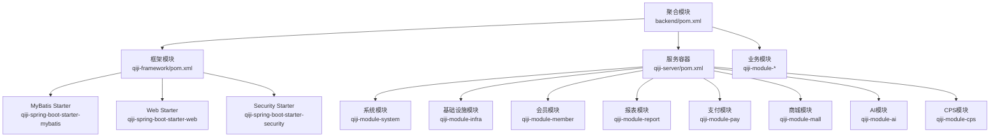
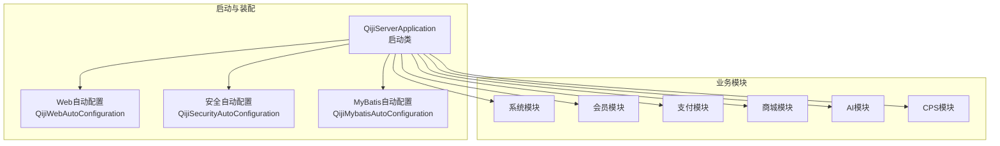
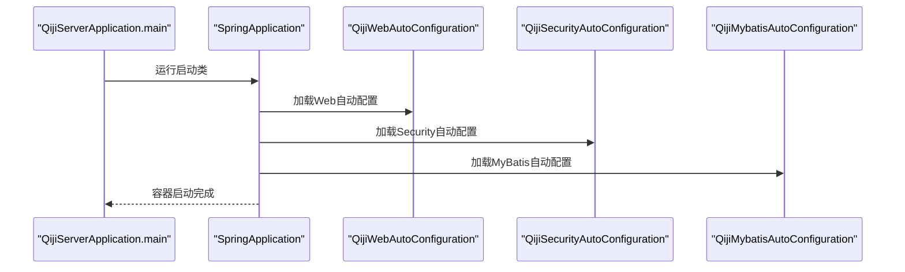
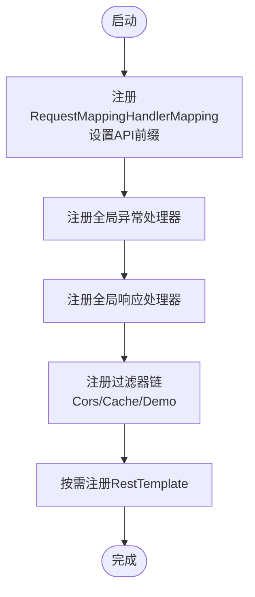
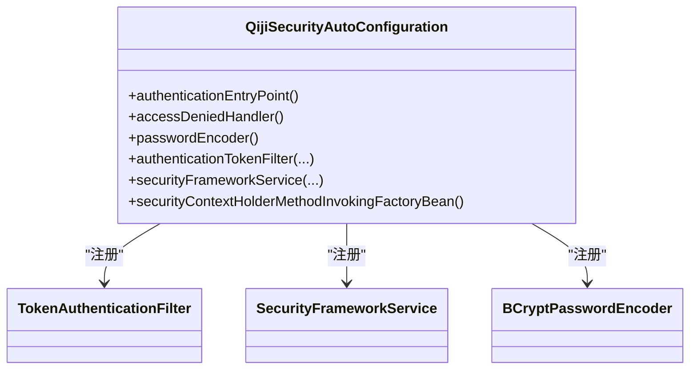
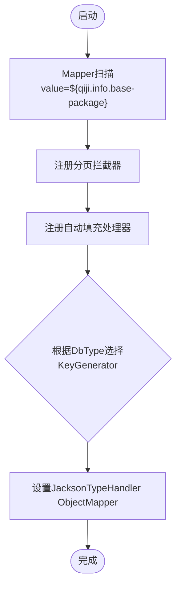
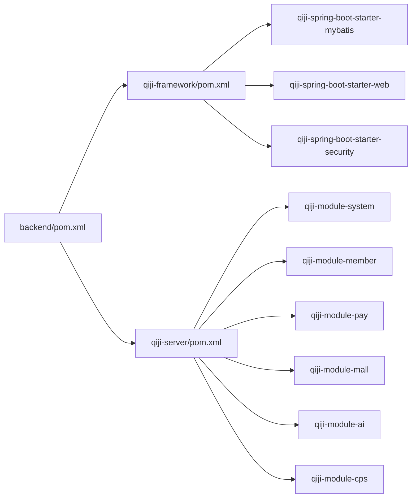

# 核心架构设计

<cite>
**本文引用的文件**
- [backend/pom.xml](file://backend/pom.xml)
- [backend/qiji-framework/pom.xml](file://backend/qiji-framework/pom.xml)
- [backend/qiji-server/pom.xml](file://backend/qiji-server/pom.xml)
- [backend/qiji-server/src/main/java/com/qiji/cps/server/QijiServerApplication.java](file://backend/qiji-server/src/main/java/com/qiji/cps/server/QijiServerApplication.java)
- [backend/qiji-framework/qiji-spring-boot-starter-mybatis/src/main/java/com/qiji/cps/framework/mybatis/config/QijiMybatisAutoConfiguration.java](file://backend/qiji-framework/qiji-spring-boot-starter-mybatis/src/main/java/com/qiji/cps/framework/mybatis/config/QijiMybatisAutoConfiguration.java)
- [backend/qiji-framework/qiji-spring-boot-starter-web/src/main/java/com/qiji/cps/framework/web/config/QijiWebAutoConfiguration.java](file://backend/qiji-framework/qiji-spring-boot-starter-web/src/main/java/com/qiji/cps/framework/web/config/QijiWebAutoConfiguration.java)
- [backend/qiji-framework/qiji-spring-boot-starter-security/src/main/java/com/qiji/cps/framework/security/config/QijiSecurityAutoConfiguration.java](file://backend/qiji-framework/qiji-spring-boot-starter-security/src/main/java/com/qiji/cps/framework/security/config/QijiSecurityAutoConfiguration.java)
- [backend/qiji-framework/qiji-common/src/main/java/com/qiji/cps/framework/common/util/collection/CollectionUtils.java](file://backend/qiji-framework/qiji-common/src/main/java/com/qiji/cps/framework/common/util/collection/CollectionUtils.java)
- [backend/qiji-module-system/src/main/java/com/qiji/cps/ModuleSystemApplication.java](file://backend/qiji-module-system/src/main/java/com/qiji/cps/ModuleSystemApplication.java)
</cite>

## 目录
1. [引言](#引言)
2. [项目结构](#项目结构)
3. [核心组件](#核心组件)
4. [架构总览](#架构总览)
5. [详细组件分析](#详细组件分析)
6. [依赖分析](#依赖分析)
7. [性能考虑](#性能考虑)
8. [故障排查指南](#故障排查指南)
9. [结论](#结论)

## 引言
本文件面向AgenticCPS后端核心架构，系统性阐述其模块化架构、Maven多模块依赖关系、Spring Boot自动配置机制与启动流程，以及分层架构在表现层、业务层、数据访问层的职责划分。同时，结合实际源码路径，解释设计模式的应用（如策略模式在平台适配器中的使用、工厂模式在客户端管理中的应用），并提供可直接定位到源码位置的参考路径，帮助读者快速理解与实践。

## 项目结构
AgenticCPS后端采用Maven多模块聚合工程，顶层聚合模块负责统一版本与插件管理，qiji-framework定义通用技术组件与自动配置，qiji-server作为服务容器按需装配各业务模块，业务模块按功能域拆分，形成清晰的层次化结构。

**图表来源**
- [backend/pom.xml:10-25](file://backend/pom.xml#L10-L25)
- [backend/qiji-framework/pom.xml:12-31](file://backend/qiji-framework/pom.xml#L12-L31)
- [backend/qiji-server/pom.xml:23-114](file://backend/qiji-server/pom.xml#L23-L114)

**章节来源**
- [backend/pom.xml:1-176](file://backend/pom.xml#L1-L176)
- [backend/qiji-framework/pom.xml:1-47](file://backend/qiji-framework/pom.xml#L1-L47)
- [backend/qiji-server/pom.xml:1-137](file://backend/qiji-server/pom.xml#L1-L137)

## 核心组件
- 聚合与版本管理：顶层pom集中声明Java版本、Spring Boot版本、插件版本与仓库镜像，统一管理revision，确保各模块版本一致。
- 框架组件：qiji-framework通过多个starter模块提供MyBatis、Redis、Web、Security、定时任务、消息队列、监控、Excel、数据权限、租户等能力，均以AutoConfiguration形式对外暴露。
- 服务容器：qiji-server按需引入业务模块依赖，打包为可执行jar，作为REST服务入口。
- 业务模块：按领域拆分，如系统、会员、支付、商城、AI、CPS等，模块内部遵循表现层、业务层、数据访问层的分层设计。
- 通用工具：qiji-common提供集合、枚举、响应体等通用工具与常量，支撑上层模块复用。

**章节来源**
- [backend/pom.xml:31-57](file://backend/pom.xml#L31-L57)
- [backend/qiji-framework/pom.xml:33-46](file://backend/qiji-framework/pom.xml#L33-L46)
- [backend/qiji-server/pom.xml:15-21](file://backend/qiji-server/pom.xml#L15-L21)
- [backend/qiji-framework/qiji-common/src/main/java/com/qiji/cps/framework/common/util/collection/CollectionUtils.java:1-352](file://backend/qiji-framework/qiji-common/src/main/java/com/qiji/cps/framework/common/util/collection/CollectionUtils.java#L1-L352)

## 架构总览
AgenticCPS后端采用“聚合工程 + 框架组件 + 服务容器 + 业务模块”的分层架构。启动流程由qiji-server驱动，通过Spring Boot自动装配加载各starter组件，再按需装配业务模块。分层架构在模块内部体现为：
- 表现层：控制器（Controller）接收HTTP请求，进行参数校验与路由转发。
- 业务层：服务（Service）编排领域逻辑，协调数据访问与第三方集成。
- 数据访问层：Mapper/DAO封装数据库操作，配合MyBatis Plus实现CRUD与分页。

**图表来源**
- [backend/qiji-server/src/main/java/com/qiji/cps/server/QijiServerApplication.java:15-16](file://backend/qiji-server/src/main/java/com/qiji/cps/server/QijiServerApplication.java#L15-L16)
- [backend/qiji-framework/qiji-spring-boot-starter-web/src/main/java/com/qiji/cps/framework/web/config/QijiWebAutoConfiguration.java:35-37](file://backend/qiji-framework/qiji-spring-boot-starter-web/src/main/java/com/qiji/cps/framework/web/config/QijiWebAutoConfiguration.java#L35-L37)
- [backend/qiji-framework/qiji-spring-boot-starter-security/src/main/java/com/qiji/cps/framework/security/config/QijiSecurityAutoConfiguration.java:32-35](file://backend/qiji-framework/qiji-spring-boot-starter-security/src/main/java/com/qiji/cps/framework/security/config/QijiSecurityAutoConfiguration.java#L32-L35)
- [backend/qiji-framework/qiji-spring-boot-starter-mybatis/src/main/java/com/qiji/cps/framework/mybatis/config/QijiMybatisAutoConfiguration.java:34-37](file://backend/qiji-framework/qiji-spring-boot-starter-mybatis/src/main/java/com/qiji/cps/framework/mybatis/config/QijiMybatisAutoConfiguration.java#L34-L37)

## 详细组件分析

### 启动入口与自动装配机制
- 启动类：QijiServerApplication通过SpringBootApplication注解启用自动装配，并通过scanBasePackages扫描server与module包，确保模块化组件被正确发现。
- 自动配置：Web、Security、MyBatis等starter通过@AutoConfiguration提供自动装配，覆盖请求映射前缀、全局异常处理、跨域、认证授权、分页拦截器、自动填充等能力。
- 模块独立：ModuleSystemApplication展示了模块级独立启动方式，便于开发调试与单元测试。

**图表来源**
- [backend/qiji-server/src/main/java/com/qiji/cps/server/QijiServerApplication.java:19-24](file://backend/qiji-server/src/main/java/com/qiji/cps/server/QijiServerApplication.java#L19-L24)
- [backend/qiji-framework/qiji-spring-boot-starter-web/src/main/java/com/qiji/cps/framework/web/config/QijiWebAutoConfiguration.java:46-81](file://backend/qiji-framework/qiji-spring-boot-starter-web/src/main/java/com/qiji/cps/framework/web/config/QijiWebAutoConfiguration.java#L46-L81)
- [backend/qiji-framework/qiji-spring-boot-starter-security/src/main/java/com/qiji/cps/framework/security/config/QijiSecurityAutoConfiguration.java:32-35](file://backend/qiji-framework/qiji-spring-boot-starter-security/src/main/java/com/qiji/cps/framework/security/config/QijiSecurityAutoConfiguration.java#L32-L35)
- [backend/qiji-framework/qiji-spring-boot-starter-mybatis/src/main/java/com/qiji/cps/framework/mybatis/config/QijiMybatisAutoConfiguration.java:34-37](file://backend/qiji-framework/qiji-spring-boot-starter-mybatis/src/main/java/com/qiji/cps/framework/mybatis/config/QijiMybatisAutoConfiguration.java#L34-L37)

**章节来源**
- [backend/qiji-server/src/main/java/com/qiji/cps/server/QijiServerApplication.java:1-35](file://backend/qiji-server/src/main/java/com/qiji/cps/server/QijiServerApplication.java#L1-L35)
- [backend/qiji-module-system/src/main/java/com/qiji/cps/ModuleSystemApplication.java:1-15](file://backend/qiji-module-system/src/main/java/com/qiji/cps/ModuleSystemApplication.java#L1-L15)

### Web层自动配置与全局处理
- 请求映射前缀：通过WebMvcRegistrations为不同API前缀（管理端、移动端）动态设置路径前缀，实现多端隔离。
- 全局异常处理：注册GlobalExceptionHandler统一捕获异常并格式化输出。
- 全局响应包装：注册GlobalResponseBodyHandler对响应体进行统一封装。
- 过滤器链：注册CorsFilter、CacheRequestBodyFilter、DemoFilter等，控制跨域、请求体重读与演示模式。
- RestTemplate：基于RestTemplateBuilder提供可选的RestTemplate实例。

**图表来源**
- [backend/qiji-framework/qiji-spring-boot-starter-web/src/main/java/com/qiji/cps/framework/web/config/QijiWebAutoConfiguration.java:46-153](file://backend/qiji-framework/qiji-spring-boot-starter-web/src/main/java/com/qiji/cps/framework/web/config/QijiWebAutoConfiguration.java#L46-L153)

**章节来源**
- [backend/qiji-framework/qiji-spring-boot-starter-web/src/main/java/com/qiji/cps/framework/web/config/QijiWebAutoConfiguration.java:1-156](file://backend/qiji-framework/qiji-spring-boot-starter-web/src/main/java/com/qiji/cps/framework/web/config/QijiWebAutoConfiguration.java#L1-L156)

### 安全与认证自动配置
- 认证入口与权限不足处理器：分别注册AuthenticationEntryPoint与AccessDeniedHandler，统一处理未认证与权限不足场景。
- 密码加密：采用BCryptPasswordEncoder，长度可配置。
- Token认证过滤器：注册TokenAuthenticationFilter，结合全局异常处理与OAuth2接口实现鉴权。
- 安全上下文策略：通过MethodInvokingFactoryBean设置TransmittableThreadLocalSecurityContextHolderStrategy，支持线程上下文传递。

**图表来源**
- [backend/qiji-framework/qiji-spring-boot-starter-security/src/main/java/com/qiji/cps/framework/security/config/QijiSecurityAutoConfiguration.java:32-94](file://backend/qiji-framework/qiji-spring-boot-starter-security/src/main/java/com/qiji/cps/framework/security/config/QijiSecurityAutoConfiguration.java#L32-L94)

**章节来源**
- [backend/qiji-framework/qiji-spring-boot-starter-security/src/main/java/com/qiji/cps/framework/security/config/QijiSecurityAutoConfiguration.java:1-95](file://backend/qiji-framework/qiji-spring-boot-starter-security/src/main/java/com/qiji/cps/framework/security/config/QijiSecurityAutoConfiguration.java#L1-L95)

### MyBatis自动配置与分页策略
- Mapper扫描：基于${qiji.info.base-package}扫描Mapper接口，支持懒加载配置。
- 分页拦截：注册MybatisPlusInterceptor并添加PaginationInnerInterceptor，实现分页能力。
- 自动填充：注册DefaultDBFieldHandler，统一处理创建时间、更新时间等字段。
- 键生成策略：根据数据库类型动态选择IKeyGenerator实现，支持PostgreSQL、Oracle、Kingbase、DM等。
- JSON类型处理器：设置JacksonTypeHandler的ObjectMapper，避免全局污染。

**图表来源**
- [backend/qiji-framework/qiji-spring-boot-starter-mybatis/src/main/java/com/qiji/cps/framework/mybatis/config/QijiMybatisAutoConfiguration.java:34-93](file://backend/qiji-framework/qiji-spring-boot-starter-mybatis/src/main/java/com/qiji/cps/framework/mybatis/config/QijiMybatisAutoConfiguration.java#L34-L93)

**章节来源**
- [backend/qiji-framework/qiji-spring-boot-starter-mybatis/src/main/java/com/qiji/cps/framework/mybatis/config/QijiMybatisAutoConfiguration.java:1-96](file://backend/qiji-framework/qiji-spring-boot-starter-mybatis/src/main/java/com/qiji/cps/framework/mybatis/config/QijiMybatisAutoConfiguration.java#L1-L96)

### 设计模式应用示例

#### 策略模式：平台适配器
- 在模块内部，可通过接口+多种实现的方式实现平台适配器（例如不同支付渠道、不同消息队列实现）。通过配置或SPI机制选择具体实现，达到“对扩展开放、对修改封闭”。

#### 工厂模式：客户端管理
- 在SDK或客户端管理场景中，可使用工厂模式根据配置动态创建不同类型的客户端实例（如不同平台的API客户端），并通过统一接口进行调用，降低耦合度。

说明：上述为概念性设计模式应用说明，具体实现细节以模块内实际代码为准。

## 依赖分析
- 聚合模块backend/pom.xml定义了统一的Java版本、Spring Boot版本、插件版本与仓库镜像，通过dependencyManagement集中管理依赖版本。
- qiji-framework/pom.xml定义了框架组件的聚合，包含MyBatis、Redis、Web、Security、WebSocket、监控、保护、定时任务、消息队列、Excel、测试、业务组件等。
- qiji-server/pom.xml作为服务容器，按需引入业务模块依赖，并通过spring-boot-maven-plugin打包为可执行jar。

**图表来源**
- [backend/pom.xml:31-57](file://backend/pom.xml#L31-L57)
- [backend/qiji-framework/pom.xml:12-31](file://backend/qiji-framework/pom.xml#L12-L31)
- [backend/qiji-server/pom.xml:23-114](file://backend/qiji-server/pom.xml#L23-L114)

**章节来源**
- [backend/pom.xml:1-176](file://backend/pom.xml#L1-L176)
- [backend/qiji-framework/pom.xml:1-47](file://backend/qiji-framework/pom.xml#L1-L47)
- [backend/qiji-server/pom.xml:1-137](file://backend/qiji-server/pom.xml#L1-L137)

## 性能考虑
- MyBatis解析缓存：JsqlParserGlobal设置本地缓存加速动态SQL解析，提升复杂XML动态SQL的租户支持性能。
- 分页拦截：PaginationInnerInterceptor提供高效分页能力，建议在大数据量查询中优先使用。
- 过滤器顺序：WebFilterOrderEnum确保跨域等过滤器的执行顺序，避免配置不生效导致的性能与兼容性问题。
- 构建参数：maven-compiler-plugin启用-parameters参数，有助于Spring Boot 3.x参数名称发现，减少反射开销。

**章节来源**
- [backend/qiji-framework/qiji-spring-boot-starter-mybatis/src/main/java/com/qiji/cps/framework/mybatis/config/QijiMybatisAutoConfiguration.java:39-44](file://backend/qiji-framework/qiji-spring-boot-starter-mybatis/src/main/java/com/qiji/cps/framework/mybatis/config/QijiMybatisAutoConfiguration.java#L39-L44)
- [backend/qiji-framework/qiji-spring-boot-starter-web/src/main/java/com/qiji/cps/framework/web/config/QijiWebAutoConfiguration.java:107-119](file://backend/qiji-framework/qiji-spring-boot-starter-web/src/main/java/com/qiji/cps/framework/web/config/QijiWebAutoConfiguration.java#L107-L119)
- [backend/pom.xml:102-104](file://backend/pom.xml#L102-L104)

## 故障排查指南
- 启动问题：若遇到启动异常，可参考启动类中的注释链接进行排查，确认扫描包路径与模块依赖是否正确。
- 跨域问题：检查QijiWebAutoConfiguration中CorsFilter的注册顺序与配置，确保与WebFilterOrderEnum一致。
- 认证失败：确认QijiSecurityAutoConfiguration中AuthenticationEntryPoint与TokenAuthenticationFilter的注册与配置，核对SecurityProperties参数。
- 数据库键生成：当使用自定义ID策略时，确认数据库类型与IKeyGenerator映射关系，避免IllegalArgumentException。

**章节来源**
- [backend/qiji-server/src/main/java/com/qiji/cps/server/QijiServerApplication.java:15-32](file://backend/qiji-server/src/main/java/com/qiji/cps/server/QijiServerApplication.java#L15-L32)
- [backend/qiji-framework/qiji-spring-boot-starter-web/src/main/java/com/qiji/cps/framework/web/config/QijiWebAutoConfiguration.java:107-136](file://backend/qiji-framework/qiji-spring-boot-starter-web/src/main/java/com/qiji/cps/framework/web/config/QijiWebAutoConfiguration.java#L107-L136)
- [backend/qiji-framework/qiji-spring-boot-starter-security/src/main/java/com/qiji/cps/framework/security/config/QijiSecurityAutoConfiguration.java:43-74](file://backend/qiji-framework/qiji-spring-boot-starter-security/src/main/java/com/qiji/cps/framework/security/config/QijiSecurityAutoConfiguration.java#L43-L74)
- [backend/qiji-framework/qiji-spring-boot-starter-mybatis/src/main/java/com/qiji/cps/framework/mybatis/config/QijiMybatisAutoConfiguration.java:62-82](file://backend/qiji-framework/qiji-spring-boot-starter-mybatis/src/main/java/com/qiji/cps/framework/mybatis/config/QijiMybatisAutoConfiguration.java#L62-L82)

## 结论
AgenticCPS后端通过Maven多模块聚合、框架组件化与Spring Boot自动装配，实现了高内聚、低耦合的模块化架构。qiji-server作为服务容器，按需装配业务模块；qiji-framework提供横切能力（Web、Security、MyBatis、定时任务、消息队列、监控等）；业务模块遵循分层架构，职责清晰。结合策略与工厂等设计模式，系统具备良好的扩展性与可维护性。建议在实际开发中严格遵循模块边界与自动配置约定，确保启动与运行稳定。