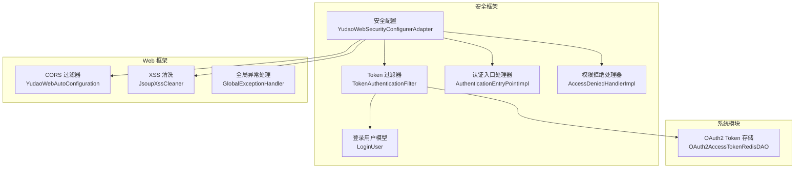
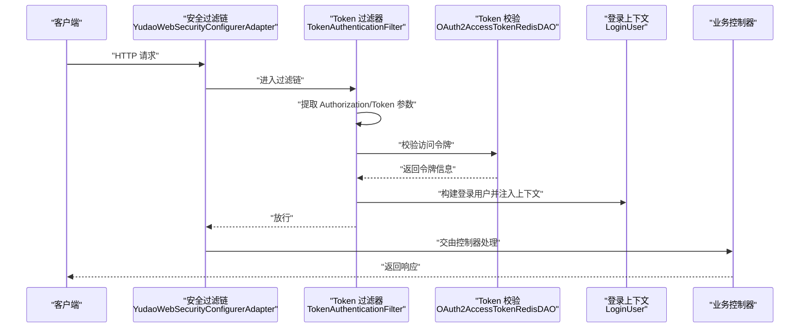
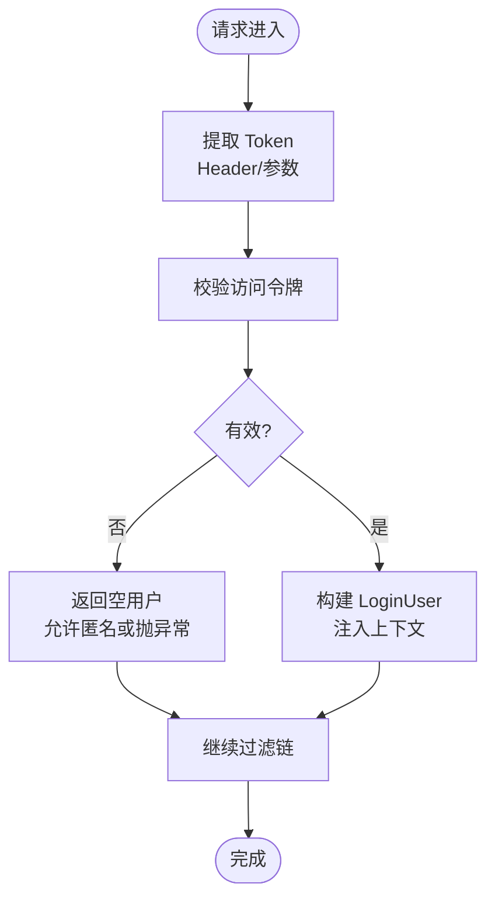
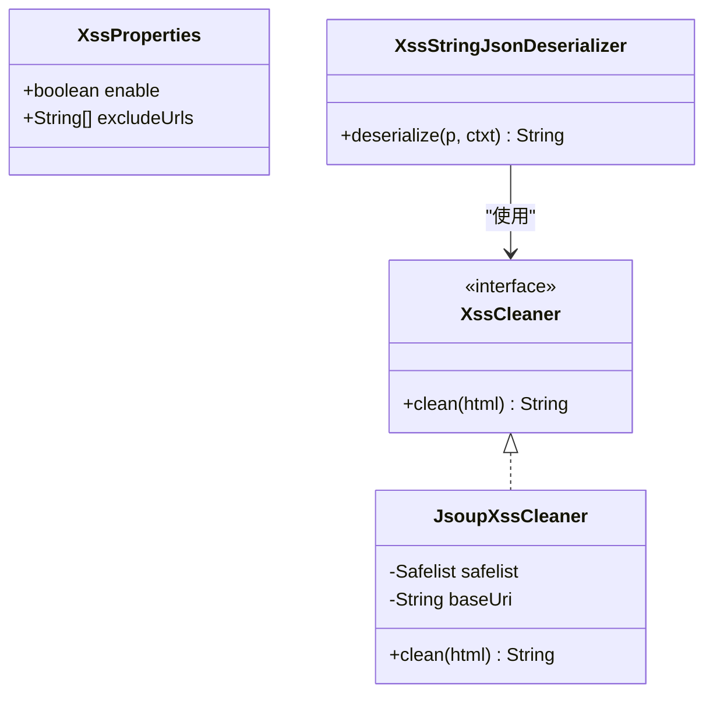
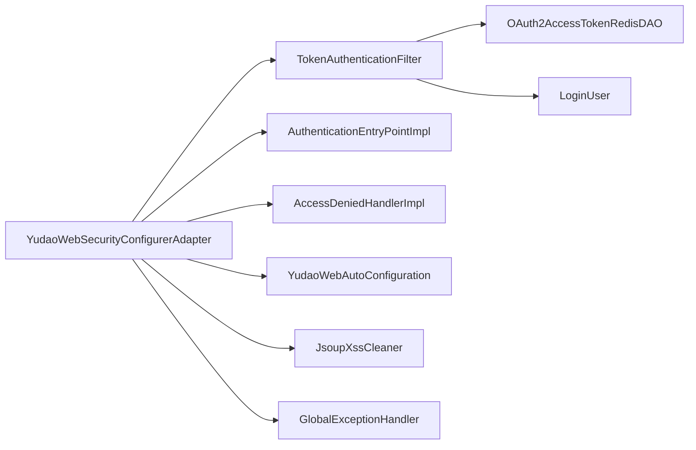

# API 安全策略

<cite>
**本文引用的文件**
- [YudaoWebSecurityConfigurerAdapter.java](file://backend/yudao-framework/yudao-spring-boot-starter-security/src/main/java/cn/iocoder/yudao/framework/security/config/YudaoWebSecurityConfigurerAdapter.java)
- [SecurityProperties.java](file://backend/yudao-framework/yudao-spring-boot-starter-security/src/main/java/cn/iocoder/yudao/framework/security/config/SecurityProperties.java)
- [TokenAuthenticationFilter.java](file://backend/yudao-framework/yudao-spring-boot-starter-security/src/main/java/cn/iocoder/yudao/framework/security/core/filter/TokenAuthenticationFilter.java)
- [LoginUser.java](file://backend/yudao-framework/yudao-spring-boot-starter-security/src/main/java/cn/iocoder/yudao/framework/security/core/LoginUser.java)
- [YudaoSecurityAutoConfiguration.java](file://backend/yudao-framework/yudao-spring-boot-starter-security/src/main/java/cn/iocoder/yudao/framework/security/config/YudaoSecurityAutoConfiguration.java)
- [AuthenticationEntryPointImpl.java](file://backend/yudao-framework/yudao-spring-boot-starter-security/src/main/java/cn/iocoder/yudao/framework/security/core/handler/AuthenticationEntryPointImpl.java)
- [AccessDeniedHandlerImpl.java](file://backend/yudao-framework/yudao-spring-boot-starter-security/src/main/java/cn/iocoder/yudao/framework/security/core/handler/AccessDeniedHandlerImpl.java)
- [YudaoWebAutoConfiguration.java](file://backend/yudao-framework/yudao-spring-boot-starter-web/src/main/java/cn/iocoder/yudao/framework/web/config/YudaoWebAutoConfiguration.java)
- [XssProperties.java](file://backend/yudao-framework/yudao-spring-boot-starter-web/src/main/java/cn/iocoder/yudao/framework/xss/config/XssProperties.java)
- [JsoupXssCleaner.java](file://backend/yudao-framework/yudao-spring-boot-starter-web/src/main/java/cn/iocoder/yudao/framework/xss/core/clean/JsoupXssCleaner.java)
- [XssStringJsonDeserializer.java](file://backend/yudao-framework/yudao-spring-boot-starter-web/src/main/java/cn/iocoder/yudao/framework/xss/core/json/XssStringJsonDeserializer.java)
- [EncryptTypeHandler.java](file://backend/yudao-framework/yudao-spring-boot-starter-mybatis/src/main/java/cn/iocoder/yudao/framework/mybatis/core/type/EncryptTypeHandler.java)
- [OAuth2AccessTokenRedisDAO.java](file://backend/yudao-module-system/src/main/java/cn/iocoder/yudao/module/system/dal/redis/oauth2/OAuth2AccessTokenRedisDAO.java)
- [AdminUserServiceImpl.java](file://backend/yudao-module-system/src/main/java/cn/iocoder/yudao/module/system/service/user/AdminUserServiceImpl.java)
- [GlobalExceptionHandler.java](file://backend/yudao-framework/yudao-spring-boot-starter-web/src/main/java/cn/iocoder/yudao/framework/web/core/handler/GlobalExceptionHandler.java)
- [AdminServerConfiguration.java](file://backend/yudao-module-infra/src/main/java/cn/iocoder/yudao/module/infra/framework/monitor/config/AdminServerConfiguration.java)
- [ruoyi-vue-pro.sql](file://backend/sql/mysql/ruoyi-vue-pro.sql)
</cite>

## 目录
1. [简介](#简介)
2. [项目结构](#项目结构)
3. [核心组件](#核心组件)
4. [架构总览](#架构总览)
5. [详细组件分析](#详细组件分析)
6. [依赖分析](#依赖分析)
7. [性能考量](#性能考量)
8. [故障排查指南](#故障排查指南)
9. [结论](#结论)
10. [附录](#附录)

## 简介
本文件面向后端 API 安全策略，围绕基于 JWT 的认证与 Token 管理、接口安全配置与访问控制、安全拦截器实现、CSRF 保护、XSS 防护、SQL 注入防范、密码加密存储、会话与 Token 刷新、跨域与安全头、安全审计与日志、异常监控以及安全扫描与应急响应等方面进行系统化梳理与落地说明。目标是帮助开发者与运维人员快速理解并实施统一、可演进的安全基线。

## 项目结构
后端采用模块化分层设计，安全能力主要由安全框架模块提供，业务模块按需集成。关键安全相关模块包括：
- 安全框架：提供 Spring Security 配置、Token 过滤器、认证/授权入口与处理器、安全属性等
- Web 框架：提供 CORS、XSS 过滤、全局异常处理等通用 Web 安全能力
- MyBatis 框架：提供字段级加密 TypeHandler
- 系统模块：提供 OAuth2 Token 存储与刷新能力
- 基础设施模块：提供 Admin UI 的 CSRF 配置与安全头

**图表来源**
- [YudaoWebSecurityConfigurerAdapter.java:110-153](file://backend/yudao-framework/yudao-spring-boot-starter-security/src/main/java/cn/iocoder/yudao/framework/security/config/YudaoWebSecurityConfigurerAdapter.java#L110-L153)
- [TokenAuthenticationFilter.java:40-93](file://backend/yudao-framework/yudao-spring-boot-starter-security/src/main/java/cn/iocoder/yudao/framework/security/core/filter/TokenAuthenticationFilter.java#L40-L93)
- [LoginUser.java:18-75](file://backend/yudao-framework/yudao-spring-boot-starter-security/src/main/java/cn/iocoder/yudao/framework/security/core/LoginUser.java#L18-L75)
- [AuthenticationEntryPointImpl.java:26-35](file://backend/yudao-framework/yudao-spring-boot-starter-security/src/main/java/cn/iocoder/yudao/framework/security/core/handler/AuthenticationEntryPointImpl.java#L26-L35)
- [AccessDeniedHandlerImpl.java:18-28](file://backend/yudao-framework/yudao-spring-boot-starter-security/src/main/java/cn/iocoder/yudao/framework/security/core/handler/AccessDeniedHandlerImpl.java#L18-L28)
- [YudaoWebAutoConfiguration.java:112-119](file://backend/yudao-framework/yudao-spring-boot-starter-web/src/main/java/cn/iocoder/yudao/framework/web/config/YudaoWebAutoConfiguration.java#L112-L119)
- [JsoupXssCleaner.java:10-63](file://backend/yudao-framework/yudao-spring-boot-starter-web/src/main/java/cn/iocoder/yudao/framework/xss/core/clean/JsoupXssCleaner.java#L10-L63)
- [GlobalExceptionHandler.java:275-280](file://backend/yudao-framework/yudao-spring-boot-starter-web/src/main/java/cn/iocoder/yudao/framework/web/core/handler/GlobalExceptionHandler.java#L275-L280)
- [OAuth2AccessTokenRedisDAO.java:24-37](file://backend/yudao-module-system/src/main/java/cn/iocoder/yudao/module/system/dal/redis/oauth2/OAuth2AccessTokenRedisDAO.java#L24-L37)

**章节来源**
- [YudaoWebSecurityConfigurerAdapter.java:109-153](file://backend/yudao-framework/yudao-spring-boot-starter-security/src/main/java/cn/iocoder/yudao/framework/security/config/YudaoWebSecurityConfigurerAdapter.java#L109-L153)
- [YudaoWebAutoConfiguration.java:112-119](file://backend/yudao-framework/yudao-spring-boot-starter-web/src/main/java/cn/iocoder/yudao/framework/web/config/YudaoWebAutoConfiguration.java#L112-L119)

## 核心组件
- 基于注解的免登录 URL 收集与放行
- Token 认证过滤器与登录用户上下文注入
- 全局异常与鉴权异常处理
- CORS 与安全头配置
- XSS 过滤与白名单
- 字段级 AES 加密
- OAuth2 Token 存储与刷新
- 密码加密存储与匹配

**章节来源**
- [YudaoWebSecurityConfigurerAdapter.java:125-148](file://backend/yudao-framework/yudao-spring-boot-starter-security/src/main/java/cn/iocoder/yudao/framework/security/config/YudaoWebSecurityConfigurerAdapter.java#L125-L148)
- [TokenAuthenticationFilter.java:40-93](file://backend/yudao-framework/yudao-spring-boot-starter-security/src/main/java/cn/iocoder/yudao/framework/security/core/filter/TokenAuthenticationFilter.java#L40-L93)
- [GlobalExceptionHandler.java:275-280](file://backend/yudao-framework/yudao-spring-boot-starter-web/src/main/java/cn/iocoder/yudao/framework/web/core/handler/GlobalExceptionHandler.java#L275-L280)
- [YudaoWebAutoConfiguration.java:112-119](file://backend/yudao-framework/yudao-spring-boot-starter-web/src/main/java/cn/iocoder/yudao/framework/web/config/YudaoWebAutoConfiguration.java#L112-L119)
- [JsoupXssCleaner.java:36-56](file://backend/yudao-framework/yudao-spring-boot-starter-web/src/main/java/cn/iocoder/yudao/framework/xss/core/clean/JsoupXssCleaner.java#L36-L56)
- [EncryptTypeHandler.java:21-75](file://backend/yudao-framework/yudao-spring-boot-starter-mybatis/src/main/java/cn/iocoder/yudao/framework/mybatis/core/type/EncryptTypeHandler.java#L21-L75)
- [OAuth2AccessTokenRedisDAO.java:24-37](file://backend/yudao-module-system/src/main/java/cn/iocoder/yudao/module/system/dal/redis/oauth2/OAuth2AccessTokenRedisDAO.java#L24-L37)
- [AdminUserServiceImpl.java:548-550](file://backend/yudao-module-system/src/main/java/cn/iocoder/yudao/module/system/service/user/AdminUserServiceImpl.java#L548-L550)

## 架构总览
整体安全架构围绕“无状态 Token + Spring Security + Web 安全增强”展开，核心流程如下：

**图表来源**
- [YudaoWebSecurityConfigurerAdapter.java:110-153](file://backend/yudao-framework/yudao-spring-boot-starter-security/src/main/java/cn/iocoder/yudao/framework/security/config/YudaoWebSecurityConfigurerAdapter.java#L110-L153)
- [TokenAuthenticationFilter.java:40-93](file://backend/yudao-framework/yudao-spring-boot-starter-security/src/main/java/cn/iocoder/yudao/framework/security/core/filter/TokenAuthenticationFilter.java#L40-L93)
- [OAuth2AccessTokenRedisDAO.java:30-37](file://backend/yudao-module-system/src/main/java/cn/iocoder/yudao/module/system/dal/redis/oauth2/OAuth2AccessTokenRedisDAO.java#L30-L37)
- [LoginUser.java:18-75](file://backend/yudao-framework/yudao-spring-boot-starter-security/src/main/java/cn/iocoder/yudao/framework/security/core/LoginUser.java#L18-L75)

## 详细组件分析

### 基于 JWT 的认证机制与 Token 管理
- 认证入口与放行规则
  - 全局免登录静态资源与注解放行 URL
  - 项目自定义授权规则
  - 异步与兜底认证要求
- Token 提取与校验
  - 支持 Header 与查询参数两种方式
  - 调用 OAuth2 Token 校验接口获取用户信息
  - 用户类型匹配与租户隔离
- 登录用户上下文
  - 将 LoginUser 写入安全上下文，便于后续权限判断与审计
- 异常处理
  - 未认证返回统一 401
  - 权限不足返回统一 403

**图表来源**
- [TokenAuthenticationFilter.java:40-93](file://backend/yudao-framework/yudao-spring-boot-starter-security/src/main/java/cn/iocoder/yudao/framework/security/core/filter/TokenAuthenticationFilter.java#L40-L93)
- [LoginUser.java:18-75](file://backend/yudao-framework/yudao-spring-boot-starter-security/src/main/java/cn/iocoder/yudao/framework/security/core/LoginUser.java#L18-L75)

**章节来源**
- [YudaoWebSecurityConfigurerAdapter.java:125-148](file://backend/yudao-framework/yudao-spring-boot-starter-security/src/main/java/cn/iocoder/yudao/framework/security/config/YudaoWebSecurityConfigurerAdapter.java#L125-L148)
- [TokenAuthenticationFilter.java:40-93](file://backend/yudao-framework/yudao-spring-boot-starter-security/src/main/java/cn/iocoder/yudao/framework/security/core/filter/TokenAuthenticationFilter.java#L40-L93)
- [AuthenticationEntryPointImpl.java:26-35](file://backend/yudao-framework/yudao-spring-boot-starter-security/src/main/java/cn/iocoder/yudao/framework/security/core/handler/AuthenticationEntryPointImpl.java#L26-L35)
- [AccessDeniedHandlerImpl.java:18-28](file://backend/yudao-framework/yudao-spring-boot-starter-security/src/main/java/cn/iocoder/yudao/framework/security/core/handler/AccessDeniedHandlerImpl.java#L18-L28)

### API 接口安全配置与访问控制
- 全局放行策略
  - 静态资源匿名访问
  - 注解级 @PermitAll 自动收集并放行
  - 配置项 yudao.security.permit-all-urls 放行
- 项目级自定义规则
  - 通过 AuthorizeRequestsCustomizer 扩展
- 异步与兜底规则
  - WebFlux 异步请求放行
  - 其余请求必须认证

**章节来源**
- [YudaoWebSecurityConfigurerAdapter.java:128-148](file://backend/yudao-framework/yudao-spring-boot-starter-security/src/main/java/cn/iocoder/yudao/framework/security/config/YudaoWebSecurityConfigurerAdapter.java#L128-L148)

### CSRF 保护机制
- 无状态 Token 场景禁用 CSRF
- Admin UI 场景启用 CSRF 并配置忽略端点

**章节来源**
- [YudaoWebSecurityConfigurerAdapter.java:115-116](file://backend/yudao-framework/yudao-spring-boot-starter-security/src/main/java/cn/iocoder/yudao/framework/security/config/YudaoWebSecurityConfigurerAdapter.java#L115-L116)
- [AdminServerConfiguration.java:96-103](file://backend/yudao-module-infra/src/main/java/cn/iocoder/yudao/module/infra/framework/monitor/config/AdminServerConfiguration.java#L96-L103)

### XSS 防护策略
- 启用与排除配置
  - yudao.xss.enable 控制开关
  - yudao.xss.excludeUrls 排除特定 URL
- JSON 字符串清洗
  - 在反序列化阶段对字符串进行白名单清洗
- HTML 白名单
  - 基于 Jsoup Safelist，保留必要属性与协议

**图表来源**
- [XssProperties.java:15-29](file://backend/yudao-framework/yudao-spring-boot-starter-web/src/main/java/cn/iocoder/yudao/framework/xss/config/XssProperties.java#L15-L29)
- [JsoupXssCleaner.java:10-63](file://backend/yudao-framework/yudao-spring-boot-starter-web/src/main/java/cn/iocoder/yudao/framework/xss/core/clean/JsoupXssCleaner.java#L10-L63)
- [XssStringJsonDeserializer.java:40-82](file://backend/yudao-framework/yudao-spring-boot-starter-web/src/main/java/cn/iocoder/yudao/framework/xss/core/json/XssStringJsonDeserializer.java#L40-L82)

**章节来源**
- [XssProperties.java:15-29](file://backend/yudao-framework/yudao-spring-boot-starter-web/src/main/java/cn/iocoder/yudao/framework/xss/config/XssProperties.java#L15-L29)
- [JsoupXssCleaner.java:36-56](file://backend/yudao-framework/yudao-spring-boot-starter-web/src/main/java/cn/iocoder/yudao/framework/xss/core/clean/JsoupXssCleaner.java#L36-L56)
- [XssStringJsonDeserializer.java:40-82](file://backend/yudao-framework/yudao-spring-boot-starter-web/src/main/java/cn/iocoder/yudao/framework/xss/core/json/XssStringJsonDeserializer.java#L40-L82)

### SQL 注入防范措施
- MyBatis Plus 防攻击拦截器（可选启用）
  - 阻止无条件 update/delete
- 字段级 AES 加密
  - 敏感字段在入库前加密，出库后解密
- 参数校验与异常处理
  - 全局异常捕获统一返回

**章节来源**
- [YudaoWebAutoConfiguration.java:112-119](file://backend/yudao-framework/yudao-spring-boot-starter-web/src/main/java/cn/iocoder/yudao/framework/web/config/YudaoWebAutoConfiguration.java#L112-L119)
- [EncryptTypeHandler.java:21-75](file://backend/yudao-framework/yudao-spring-boot-starter-mybatis/src/main/java/cn/iocoder/yudao/framework/mybatis/core/type/EncryptTypeHandler.java#L21-L75)
- [GlobalExceptionHandler.java:275-280](file://backend/yudao-framework/yudao-spring-boot-starter-web/src/main/java/cn/iocoder/yudao/framework/web/core/handler/GlobalExceptionHandler.java#L275-L280)

### 密码加密存储算法
- BCrypt 密码编码器
- 密码匹配与加密存储
- 登录时比对与安全存储

**章节来源**
- [YudaoSecurityAutoConfiguration.java:56-57](file://backend/yudao-framework/yudao-spring-boot-starter-security/src/main/java/cn/iocoder/yudao/framework/security/config/YudaoSecurityAutoConfiguration.java#L56-L57)
- [AdminUserServiceImpl.java:538-550](file://backend/yudao-module-system/src/main/java/cn/iocoder/yudao/module/system/service/user/AdminUserServiceImpl.java#L538-L550)

### 会话安全管理与 Token 刷新
- 无状态会话
  - 禁用 Session，基于 Token
- Token 刷新
  - 通过 OAuth2 Refresh Token 机制刷新访问令牌
  - 过期校验与异常处理

**章节来源**
- [YudaoWebSecurityConfigurerAdapter.java:117-118](file://backend/yudao-framework/yudao-spring-boot-starter-security/src/main/java/cn/iocoder/yudao/framework/security/config/YudaoWebSecurityConfigurerAdapter.java#L117-L118)
- [OAuth2AccessTokenRedisDAO.java:24-37](file://backend/yudao-module-system/src/main/java/cn/iocoder/yudao/module/system/dal/redis/oauth2/OAuth2AccessTokenRedisDAO.java#L24-L37)

### 跨域安全配置与安全头
- CORS
  - 全局注册 CorsFilter，允许任意来源、头与方法
- 安全头
  - 禁用 frameOptions，避免点击劫持
  - Admin UI 配置 CSRF Cookie 与忽略端点

**章节来源**
- [YudaoWebAutoConfiguration.java:112-119](file://backend/yudao-framework/yudao-spring-boot-starter-web/src/main/java/cn/iocoder/yudao/framework/web/config/YudaoWebAutoConfiguration.java#L112-L119)
- [YudaoWebSecurityConfigurerAdapter.java:118-119](file://backend/yudao-framework/yudao-spring-boot-starter-security/src/main/java/cn/iocoder/yudao/framework/security/config/YudaoWebSecurityConfigurerAdapter.java#L118-L119)
- [AdminServerConfiguration.java:96-103](file://backend/yudao-module-infra/src/main/java/cn/iocoder/yudao/module/infra/framework/monitor/config/AdminServerConfiguration.java#L96-L103)

### API 安全审计、访问日志与异常监控
- 登录日志与访问日志表结构
  - 包含 trace_id、user_id、user_type、application_name、request_method、request_url 等字段
- 全局异常处理
  - 统一返回码与日志输出
  - 权限不足异常记录

**章节来源**
- [GlobalExceptionHandler.java:275-280](file://backend/yudao-framework/yudao-spring-boot-starter-web/src/main/java/cn/iocoder/yudao/framework/web/core/handler/GlobalExceptionHandler.java#L275-L280)
- [ruoyi-vue-pro.sql:68-122](file://backend/sql/mysql/ruoyi-vue-pro.sql#L68-L122)

## 依赖分析
- 组件耦合
  - 安全过滤链依赖 Token 过滤器与异常处理器
  - Token 过滤器依赖 OAuth2 Token 校验与登录用户模型
  - Web 安全组件（CORS、XSS）独立于认证链但共同参与请求处理
- 外部依赖
  - Spring Security、MyBatis、Redis、Jsoup

**图表来源**
- [YudaoWebSecurityConfigurerAdapter.java:110-153](file://backend/yudao-framework/yudao-spring-boot-starter-security/src/main/java/cn/iocoder/yudao/framework/security/config/YudaoWebSecurityConfigurerAdapter.java#L110-L153)
- [TokenAuthenticationFilter.java:40-93](file://backend/yudao-framework/yudao-spring-boot-starter-security/src/main/java/cn/iocoder/yudao/framework/security/core/filter/TokenAuthenticationFilter.java#L40-L93)
- [OAuth2AccessTokenRedisDAO.java:24-37](file://backend/yudao-module-system/src/main/java/cn/iocoder/yudao/module/system/dal/redis/oauth2/OAuth2AccessTokenRedisDAO.java#L24-L37)
- [LoginUser.java:18-75](file://backend/yudao-framework/yudao-spring-boot-starter-security/src/main/java/cn/iocoder/yudao/framework/security/core/LoginUser.java#L18-L75)
- [AuthenticationEntryPointImpl.java:26-35](file://backend/yudao-framework/yudao-spring-boot-starter-security/src/main/java/cn/iocoder/yudao/framework/security/core/handler/AuthenticationEntryPointImpl.java#L26-L35)
- [AccessDeniedHandlerImpl.java:18-28](file://backend/yudao-framework/yudao-spring-boot-starter-security/src/main/java/cn/iocoder/yudao/framework/security/core/handler/AccessDeniedHandlerImpl.java#L18-L28)
- [YudaoWebAutoConfiguration.java:112-119](file://backend/yudao-framework/yudao-spring-boot-starter-web/src/main/java/cn/iocoder/yudao/framework/web/config/YudaoWebAutoConfiguration.java#L112-L119)
- [JsoupXssCleaner.java:10-63](file://backend/yudao-framework/yudao-spring-boot-starter-web/src/main/java/cn/iocoder/yudao/framework/xss/core/clean/JsoupXssCleaner.java#L10-L63)
- [GlobalExceptionHandler.java:275-280](file://backend/yudao-framework/yudao-spring-boot-starter-web/src/main/java/cn/iocoder/yudao/framework/web/core/handler/GlobalExceptionHandler.java#L275-L280)

## 性能考量
- Token 校验与 Redis 交互
  - 建议合理设置 Token TTL 与缓存命中率
- XSS 清洗
  - JSON 反序列化阶段进行清洗，避免重复处理
- 异常处理
  - 统一异常处理减少分支判断与日志开销

[本节为通用建议，无需具体文件引用]

## 故障排查指南
- 401 未认证
  - 检查请求是否携带正确的 Authorization/Token 参数
  - 确认 Token 未过期且用户类型匹配
- 403 权限不足
  - 检查用户权限与业务授权规则
- CORS 失败
  - 确认前端域名与请求头是否在允许范围内
- XSS 过滤异常
  - 检查 yudao.xss.excludeUrls 与白名单配置
- 密码校验失败
  - 确认使用 BCrypt 匹配逻辑

**章节来源**
- [AuthenticationEntryPointImpl.java:26-35](file://backend/yudao-framework/yudao-spring-boot-starter-security/src/main/java/cn/iocoder/yudao/framework/security/core/handler/AuthenticationEntryPointImpl.java#L26-L35)
- [AccessDeniedHandlerImpl.java:18-28](file://backend/yudao-framework/yudao-spring-boot-starter-security/src/main/java/cn/iocoder/yudao/framework/security/core/handler/AccessDeniedHandlerImpl.java#L18-L28)
- [YudaoWebAutoConfiguration.java:112-119](file://backend/yudao-framework/yudao-spring-boot-starter-web/src/main/java/cn/iocoder/yudao/framework/web/config/YudaoWebAutoConfiguration.java#L112-L119)
- [XssProperties.java:15-29](file://backend/yudao-framework/yudao-spring-boot-starter-web/src/main/java/cn/iocoder/yudao/framework/xss/config/XssProperties.java#L15-L29)
- [GlobalExceptionHandler.java:275-280](file://backend/yudao-framework/yudao-spring-boot-starter-web/src/main/java/cn/iocoder/yudao/framework/web/core/handler/GlobalExceptionHandler.java#L275-L280)

## 结论
本项目通过“无状态 Token + Spring Security + Web 安全增强”的组合，构建了统一、可扩展的 API 安全基线。在确保易用性的同时，覆盖了认证、授权、CSRF、XSS、SQL 注入、密码加密、跨域与安全头、审计与日志等关键领域。建议在生产环境严格配置安全属性、启用必要的防护与监控，并定期进行安全扫描与演练。

[本节为总结，无需具体文件引用]

## 附录

### 安全配置清单
- 安全属性
  - yudao.security.token-header
  - yudao.security.token-parameter
  - yudao.security.mock-enable
  - yudao.security.mock-secret
  - yudao.security.permit-all-urls
  - yudao.security.password-encoder-length
- XSS 属性
  - yudao.xss.enable
  - yudao.xss.exclude-urls
- CORS
  - 全局允许任意来源、头与方法

**章节来源**
- [SecurityProperties.java:12-51](file://backend/yudao-framework/yudao-spring-boot-starter-security/src/main/java/cn/iocoder/yudao/framework/security/config/SecurityProperties.java#L12-L51)
- [XssProperties.java:15-29](file://backend/yudao-framework/yudao-spring-boot-starter-web/src/main/java/cn/iocoder/yudao/framework/xss/config/XssProperties.java#L15-L29)
- [YudaoWebAutoConfiguration.java:112-119](file://backend/yudao-framework/yudao-spring-boot-starter-web/src/main/java/cn/iocoder/yudao/framework/web/config/YudaoWebAutoConfiguration.java#L112-L119)