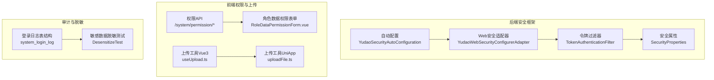
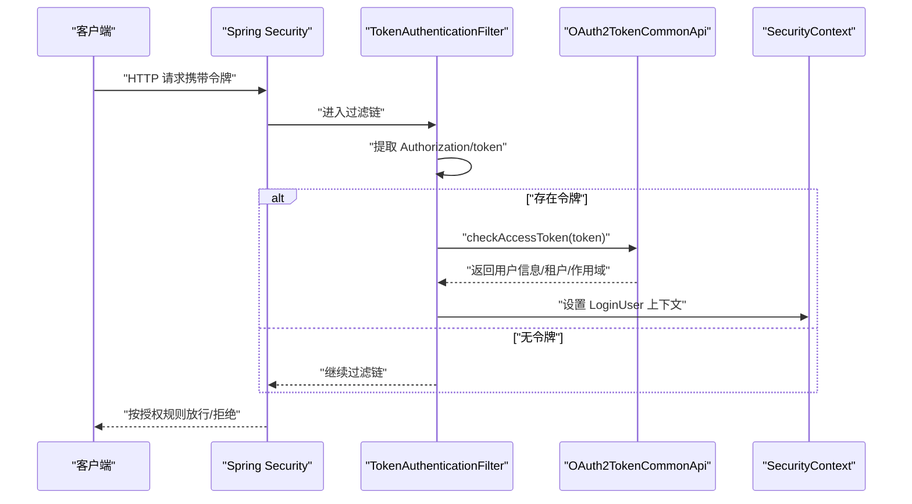
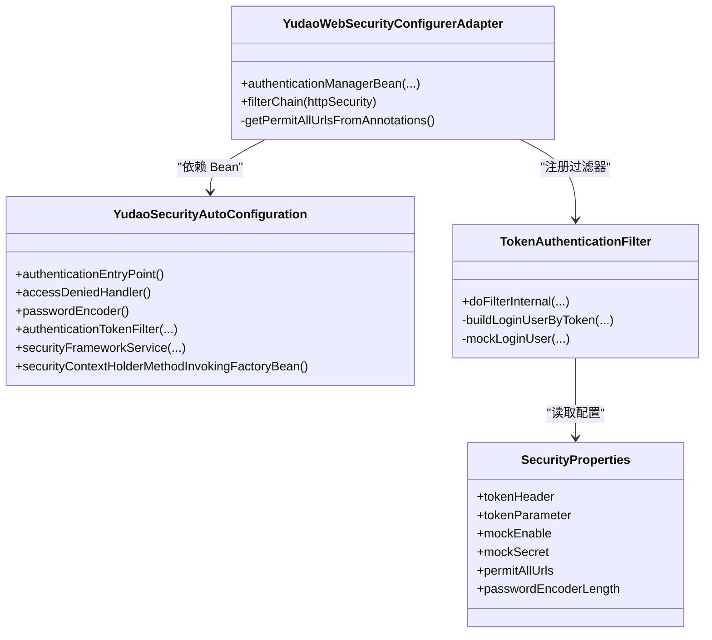
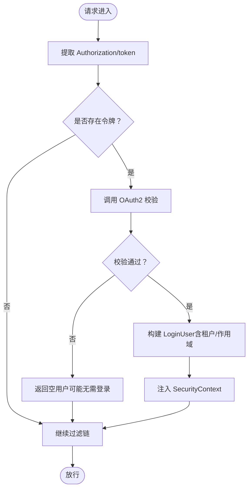
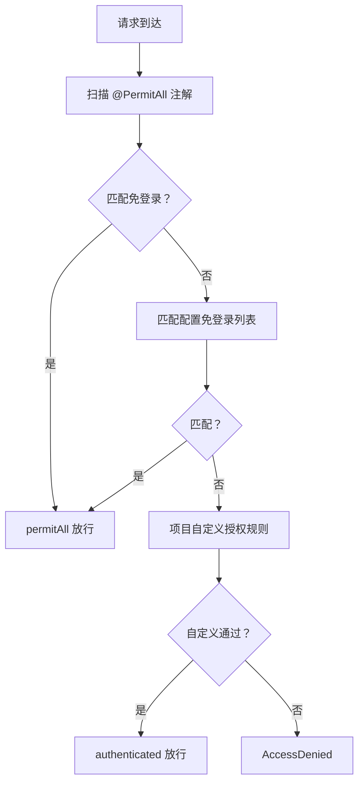
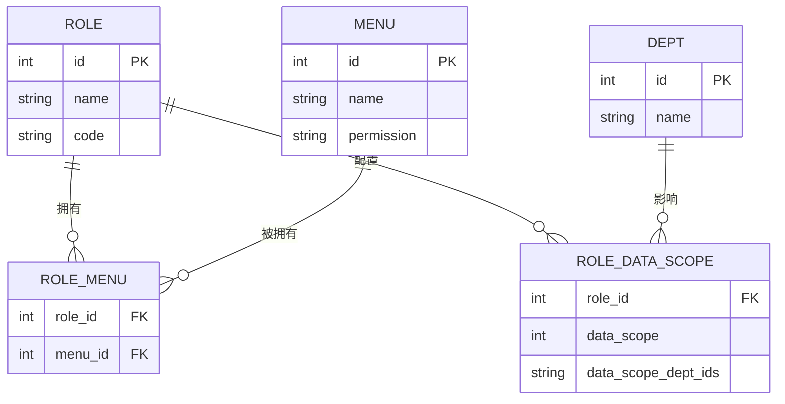
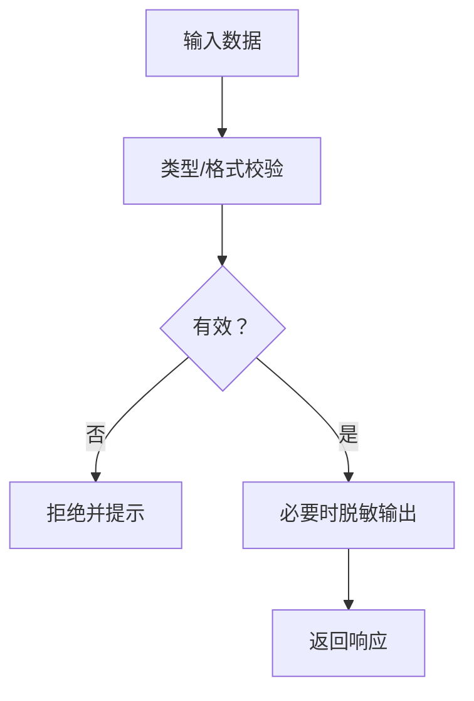
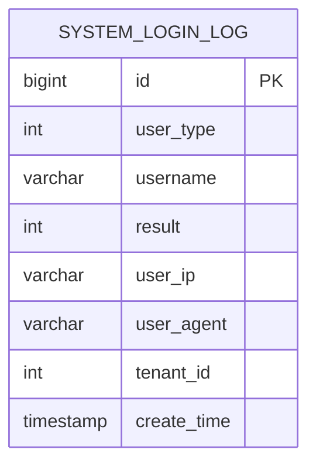
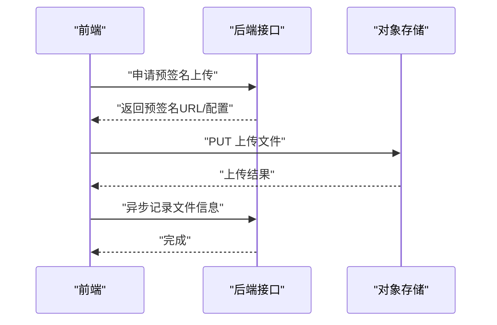
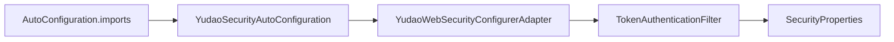

# 安全与权限

<cite>
**本文引用的文件**
- [YudaoSecurityAutoConfiguration.java](file://backend/yudao-framework/yudao-spring-boot-starter-security/src/main/java/cn/iocoder/yudao/framework/security/config/YudaoSecurityAutoConfiguration.java)
- [YudaoWebSecurityConfigurerAdapter.java](file://backend/yudao-framework/yudao-spring-boot-starter-security/src/main/java/cn/iocoder/yudao/framework/security/config/YudaoWebSecurityConfigurerAdapter.java)
- [TokenAuthenticationFilter.java](file://backend/yudao-framework/yudao-spring-boot-starter-security/src/main/java/cn/iocoder/yudao/framework/security/core/filter/TokenAuthenticationFilter.java)
- [SecurityProperties.java](file://backend/yudao-framework/yudao-spring-boot-starter-security/src/main/java/cn/iocoder/yudao/framework/security/config/SecurityProperties.java)
- [org.springframework.boot.autoconfigure.AutoConfiguration.imports](file://backend/yudao-framework/yudao-spring-boot-starter-security/src/main/resources/META-INF/spring/org.springframework.boot.autoconfigure.AutoConfiguration.imports)
- [index.ts](file://frontend/admin-vue3/src/api/system/permission/index.ts)
- [RoleDataPermissionForm.vue](file://frontend/admin-vue3/src/views/system/role/RoleDataPermissionForm.vue)
- [useUpload.ts](file://frontend/admin-vue3/src/components/UploadFile/src/useUpload.ts)
- [uploadFile.ts](file://frontend/admin-uniapp/src/utils/uploadFile.ts)
- [index.vue](file://frontend/admin-uniapp/src/pages-core/user/feedback/index.vue)
- [ruoyi-vue-pro.sql（SQLServer）](file://backend/sql/sqlserver/ruoyi-vue-pro.sql)
- [ruoyi-vue-pro.sql（PostgreSQL）](file://backend/sql/postgresql/ruoyi-vue-pro.sql)
- [ruoyi-vue-pro.sql（Kingbase）](file://backend/sql/kingbase/ruoyi-vue-pro.sql)
- [ruoyi-vue-pro.sql（DM）](file://backend/sql/dm/ruoyi-vue-pro-dm8.sql)
- [DesensitizeTest.java](file://backend/yudao-framework/yudao-spring-boot-starter-web/src/test/java/cn/iocoder/yudao/framework/desensitize/core/DesensitizeTest.java)
- [validate.js](file://frontend/mall-uniapp/uni_modules/uni-forms/components/uni-forms/validate.js)
</cite>

## 目录
1. [简介](#简介)
2. [项目结构](#项目结构)
3. [核心组件](#核心组件)
4. [架构总览](#架构总览)
5. [组件详解](#组件详解)
6. [依赖关系分析](#依赖关系分析)
7. [性能考量](#性能考量)
8. [故障排查指南](#故障排查指南)
9. [结论](#结论)
10. [附录](#附录)

## 简介
本文件面向“安全与权限”主题，系统梳理后端基于 Spring Security 的安全架构、前端路由守卫与文件上传安全、权限控制策略、数据脱敏与审计日志等关键能力。重点覆盖：
- Spring Security 集成与自动配置
- JWT/OAuth2 令牌校验与上下文注入
- 基于注解与 URL 的访问控制策略
- 角色-菜单-数据范围权限模型
- 敏感数据脱敏与前端输入校验
- 审计日志与合规要点
- API 接口安全、前端路由守卫、文件上传安全、数据库安全防护

## 项目结构
围绕安全与权限，后端与前端的关键位置如下：
- 后端安全框架与自动装配位于 yudao-spring-boot-starter-security 模块
- 前端权限 API 与角色数据权限表单位于 admin-vue3
- 前端文件上传工具位于 admin-uniapp 与 admin-vue3
- 审计日志表结构分布在各数据库方言 SQL 中
- 敏感数据脱敏测试位于 yudao-spring-boot-starter-web 模块

图示来源
- [YudaoSecurityAutoConfiguration.java:32-95](file://backend/yudao-framework/yudao-spring-boot-starter-security/src/main/java/cn/iocoder/yudao/framework/security/config/YudaoSecurityAutoConfiguration.java#L32-L95)
- [YudaoWebSecurityConfigurerAdapter.java:46-222](file://backend/yudao-framework/yudao-spring-boot-starter-security/src/main/java/cn/iocoder/yudao/framework/security/config/YudaoWebSecurityConfigurerAdapter.java#L46-L222)
- [TokenAuthenticationFilter.java:31-120](file://backend/yudao-framework/yudao-spring-boot-starter-security/src/main/java/cn/iocoder/yudao/framework/security/core/filter/TokenAuthenticationFilter.java#L31-L120)
- [SecurityProperties.java:12-51](file://backend/yudao-framework/yudao-spring-boot-starter-security/src/main/java/cn/iocoder/yudao/framework/security/config/SecurityProperties.java#L12-L51)
- [index.ts:1-42](file://frontend/admin-vue3/src/api/system/permission/index.ts#L1-L42)
- [RoleDataPermissionForm.vue:72-110](file://frontend/admin-vue3/src/views/system/role/RoleDataPermissionForm.vue#L72-L110)
- [useUpload.ts:34-75](file://frontend/admin-vue3/src/components/UploadFile/src/useUpload.ts#L34-L75)
- [uploadFile.ts:1-48](file://frontend/admin-uniapp/src/utils/uploadFile.ts#L1-L48)
- [ruoyi-vue-pro.sql（SQLServer）:3671-3729](file://backend/sql/sqlserver/ruoyi-vue-pro.sql#L3671-L3729)
- [DesensitizeTest.java:32-61](file://backend/yudao-framework/yudao-spring-boot-starter-web/src/test/java/cn/iocoder/yudao/framework/desensitize/core/DesensitizeTest.java#L32-L61)

章节来源
- [YudaoSecurityAutoConfiguration.java:32-95](file://backend/yudao-framework/yudao-spring-boot-starter-security/src/main/java/cn/iocoder/yudao/framework/security/config/YudaoSecurityAutoConfiguration.java#L32-L95)
- [YudaoWebSecurityConfigurerAdapter.java:46-222](file://backend/yudao-framework/yudao-spring-boot-starter-security/src/main/java/cn/iocoder/yudao/framework/security/config/YudaoWebSecurityConfigurerAdapter.java#L46-L222)
- [TokenAuthenticationFilter.java:31-120](file://backend/yudao-framework/yudao-spring-boot-starter-security/src/main/java/cn/iocoder/yudao/framework/security/core/filter/TokenAuthenticationFilter.java#L31-L120)
- [SecurityProperties.java:12-51](file://backend/yudao-framework/yudao-spring-boot-starter-security/src/main/java/cn/iocoder/yudao/framework/security/config/SecurityProperties.java#L12-L51)
- [index.ts:1-42](file://frontend/admin-vue3/src/api/system/permission/index.ts#L1-L42)
- [RoleDataPermissionForm.vue:72-110](file://frontend/admin-vue3/src/views/system/role/RoleDataPermissionForm.vue#L72-L110)
- [useUpload.ts:34-75](file://frontend/admin-vue3/src/components/UploadFile/src/useUpload.ts#L34-L75)
- [uploadFile.ts:1-48](file://frontend/admin-uniapp/src/utils/uploadFile.ts#L1-L48)
- [ruoyi-vue-pro.sql（SQLServer）:3671-3729](file://backend/sql/sqlserver/ruoyi-vue-pro.sql#L3671-L3729)
- [DesensitizeTest.java:32-61](file://backend/yudao-framework/yudao-spring-boot-starter-web/src/test/java/cn/iocoder/yudao/framework/desensitize/core/DesensitizeTest.java#L32-L61)

## 核心组件
- 自动配置与 Bean 注入
  - 认证入口点、权限不足处理器、BCrypt 密码编码器、Token 认证过滤器、安全上下文策略注册
- Web 安全适配器
  - CORS/CSRF/Session 策略、异常处理、URL 权限映射、@PermitAll 注解扫描、全局与项目自定义授权规则
- 令牌过滤器
  - 从请求头/参数提取令牌、调用 OAuth2 令牌检查、构建登录用户上下文、模拟登录支持
- 安全属性
  - 令牌头/参数名、免登录 URL 列表、mock 模式开关与密钥、密码编码复杂度

章节来源
- [YudaoSecurityAutoConfiguration.java:32-95](file://backend/yudao-framework/yudao-spring-boot-starter-security/src/main/java/cn/iocoder/yudao/framework/security/config/YudaoSecurityAutoConfiguration.java#L32-L95)
- [YudaoWebSecurityConfigurerAdapter.java:92-153](file://backend/yudao-framework/yudao-spring-boot-starter-security/src/main/java/cn/iocoder/yudao/framework/security/config/YudaoWebSecurityConfigurerAdapter.java#L92-L153)
- [TokenAuthenticationFilter.java:40-93](file://backend/yudao-framework/yudao-spring-boot-starter-security/src/main/java/cn/iocoder/yudao/framework/security/core/filter/TokenAuthenticationFilter.java#L40-L93)
- [SecurityProperties.java:12-51](file://backend/yudao-framework/yudao-spring-boot-starter-security/src/main/java/cn/iocoder/yudao/framework/security/config/SecurityProperties.java#L12-L51)

## 架构总览
后端通过自动配置装配 Spring Security，Web 适配器统一管理 URL 授权策略，令牌过滤器在每次请求中校验令牌并注入登录用户上下文。前端通过权限 API 与角色数据权限表单进行权限分配，文件上传通过后端预签名或直连 S3 的方式保障安全。

图示来源
- [YudaoWebSecurityConfigurerAdapter.java:110-153](file://backend/yudao-framework/yudao-spring-boot-starter-security/src/main/java/cn/iocoder/yudao/framework/security/config/YudaoWebSecurityConfigurerAdapter.java#L110-L153)
- [TokenAuthenticationFilter.java:40-93](file://backend/yudao-framework/yudao-spring-boot-starter-security/src/main/java/cn/iocoder/yudao/framework/security/core/filter/TokenAuthenticationFilter.java#L40-L93)

## 组件详解

### Spring Security 集成与自动配置
- 自动装配顺序优先于 Spring Security 默认配置，确保扩展生效
- 注册认证入口点、权限不足处理器、BCrypt 编码器、Token 过滤器、安全上下文策略
- 通过导入清单自动发现配置类

图示来源
- [YudaoSecurityAutoConfiguration.java:32-95](file://backend/yudao-framework/yudao-spring-boot-starter-security/src/main/java/cn/iocoder/yudao/framework/security/config/YudaoSecurityAutoConfiguration.java#L32-L95)
- [YudaoWebSecurityConfigurerAdapter.java:46-222](file://backend/yudao-framework/yudao-spring-boot-starter-security/src/main/java/cn/iocoder/yudao/framework/security/config/YudaoWebSecurityConfigurerAdapter.java#L46-L222)
- [TokenAuthenticationFilter.java:31-120](file://backend/yudao-framework/yudao-spring-boot-starter-security/src/main/java/cn/iocoder/yudao/framework/security/core/filter/TokenAuthenticationFilter.java#L31-L120)
- [SecurityProperties.java:12-51](file://backend/yudao-framework/yudao-spring-boot-starter-security/src/main/java/cn/iocoder/yudao/framework/security/config/SecurityProperties.java#L12-L51)

章节来源
- [YudaoSecurityAutoConfiguration.java:32-95](file://backend/yudao-framework/yudao-spring-boot-starter-security/src/main/java/cn/iocoder/yudao/framework/security/config/YudaoSecurityAutoConfiguration.java#L32-L95)
- [YudaoWebSecurityConfigurerAdapter.java:92-153](file://backend/yudao-framework/yudao-spring-boot-starter-security/src/main/java/cn/iocoder/yudao/framework/security/config/YudaoWebSecurityConfigurerAdapter.java#L92-L153)
- [org.springframework.boot.autoconfigure.AutoConfiguration.imports:1-3](file://backend/yudao-framework/yudao-spring-boot-starter-security/src/main/resources/META-INF/spring/org.springframework.boot.autoconfigure.AutoConfiguration.imports#L1-L3)

### JWT/OAuth2 令牌管理与上下文注入
- 令牌提取：支持请求头与查询参数
- 令牌校验：调用 OAuth2 令牌检查接口，返回用户类型、租户、作用域等
- 上下文注入：将 LoginUser 写入 SecurityContext，供后续授权与业务使用
- 模拟登录：开发调试可用，生产需关闭

图示来源
- [TokenAuthenticationFilter.java:40-93](file://backend/yudao-framework/yudao-spring-boot-starter-security/src/main/java/cn/iocoder/yudao/framework/security/core/filter/TokenAuthenticationFilter.java#L40-L93)

章节来源
- [TokenAuthenticationFilter.java:40-93](file://backend/yudao-framework/yudao-spring-boot-starter-security/src/main/java/cn/iocoder/yudao/framework/security/core/filter/TokenAuthenticationFilter.java#L40-L93)

### 访问控制策略（URL 与注解）
- 全局免登录：静态资源、@PermitAll 注解扫描、配置项 yudao.security.permit-all-urls
- 项目自定义：AuthorizeRequestsCustomizer 扩展点
- 通用规则：异步请求放行、其余请求必须认证
- 方法级安全：启用 @Secured，结合权限标识进行细粒度控制

图示来源
- [YudaoWebSecurityConfigurerAdapter.java:125-148](file://backend/yudao-framework/yudao-spring-boot-starter-security/src/main/java/cn/iocoder/yudao/framework/security/config/YudaoWebSecurityConfigurerAdapter.java#L125-L148)
- [YudaoWebSecurityConfigurerAdapter.java:159-219](file://backend/yudao-framework/yudao-spring-boot-starter-security/src/main/java/cn/iocoder/yudao/framework/security/config/YudaoWebSecurityConfigurerAdapter.java#L159-L219)

章节来源
- [YudaoWebSecurityConfigurerAdapter.java:125-148](file://backend/yudao-framework/yudao-spring-boot-starter-security/src/main/java/cn/iocoder/yudao/framework/security/config/YudaoWebSecurityConfigurerAdapter.java#L125-L148)
- [YudaoWebSecurityConfigurerAdapter.java:159-219](file://backend/yudao-framework/yudao-spring-boot-starter-security/src/main/java/cn/iocoder/yudao/framework/security/config/YudaoWebSecurityConfigurerAdapter.java#L159-L219)

### 权限控制策略（角色-菜单-数据范围）
- 前端权限 API：角色菜单权限、角色数据范围、用户角色赋权
- 角色数据权限表单：部门树选择、数据范围策略（全部/本部门/指定部门）
- 后端菜单权限与数据权限标识：系统菜单包含对应 permission 字段

图示来源
- [index.ts:1-42](file://frontend/admin-vue3/src/api/system/permission/index.ts#L1-L42)
- [RoleDataPermissionForm.vue:72-110](file://frontend/admin-vue3/src/views/system/role/RoleDataPermissionForm.vue#L72-L110)
- [ruoyi-vue-pro.sql（SQLServer）:4589-4595](file://backend/sql/sqlserver/ruoyi-vue-pro.sql#L4589-L4595)

章节来源
- [index.ts:1-42](file://frontend/admin-vue3/src/api/system/permission/index.ts#L1-L42)
- [RoleDataPermissionForm.vue:72-110](file://frontend/admin-vue3/src/views/system/role/RoleDataPermissionForm.vue#L72-L110)
- [ruoyi-vue-pro.sql（SQLServer）:4589-4595](file://backend/sql/sqlserver/ruoyi-vue-pro.sql#L4589-L4595)

### 敏感数据保护机制
- 前端输入校验：字段类型与格式校验（邮箱、URL、时间戳等），减少异常输入风险
- 后端脱敏：提供脱敏工具与测试，对敏感字段进行掩码输出，避免日志与接口泄露
- 传输安全：建议配合 HTTPS 与最小权限暴露策略

图示来源
- [validate.js:41-105](file://frontend/mall-uniapp/uni_modules/uni-forms/components/uni-forms/validate.js#L41-L105)
- [DesensitizeTest.java:32-61](file://backend/yudao-framework/yudao-spring-boot-starter-web/src/test/java/cn/iocoder/yudao/framework/desensitize/core/DesensitizeTest.java#L32-L61)

章节来源
- [validate.js:41-105](file://frontend/mall-uniapp/uni_modules/uni-forms/components/uni-forms/validate.js#L41-L105)
- [DesensitizeTest.java:32-61](file://backend/yudao-framework/yudao-spring-boot-starter-web/src/test/java/cn/iocoder/yudao/framework/desensitize/core/DesensitizeTest.java#L32-L61)

### 审计日志记录
- 登录日志表结构：包含用户编号、用户类型、账号、IP、UA、结果、租户 ID 等字段
- 建议：在登录、操作、异常等关键场景记录审计日志，便于追踪与合规

图示来源
- [ruoyi-vue-pro.sql（SQLServer）:3671-3729](file://backend/sql/sqlserver/ruoyi-vue-pro.sql#L3671-L3729)
- [ruoyi-vue-pro.sql（PostgreSQL）:1539-1567](file://backend/sql/postgresql/ruoyi-vue-pro.sql#L1539-L1567)
- [ruoyi-vue-pro.sql（Kingbase）:1528-1555](file://backend/sql/kingbase/ruoyi-vue-pro.sql#L1528-L1555)
- [ruoyi-vue-pro.sql（DM）:1403-1426](file://backend/sql/dm/ruoyi-vue-pro-dm8.sql#L1403-L1426)

章节来源
- [ruoyi-vue-pro.sql（SQLServer）:3671-3729](file://backend/sql/sqlserver/ruoyi-vue-pro.sql#L3671-L3729)
- [ruoyi-vue-pro.sql（PostgreSQL）:1539-1567](file://backend/sql/postgresql/ruoyi-vue-pro.sql#L1539-L1567)
- [ruoyi-vue-pro.sql（Kingbase）:1528-1555](file://backend/sql/kingbase/ruoyi-vue-pro.sql#L1528-L1555)
- [ruoyi-vue-pro.sql（DM）:1403-1426](file://backend/sql/dm/ruoyi-vue-pro-dm8.sql#L1403-L1426)

### API 接口安全
- 令牌传递：统一从 Authorization 头或 token 参数读取
- 免登录策略：通过注解与配置项集中管理
- 异常处理：认证失败与权限不足统一由入口点与处理器处理

章节来源
- [SecurityProperties.java:12-51](file://backend/yudao-framework/yudao-spring-boot-starter-security/src/main/java/cn/iocoder/yudao/framework/security/config/SecurityProperties.java#L12-L51)
- [YudaoWebSecurityConfigurerAdapter.java:125-148](file://backend/yudao-framework/yudao-spring-boot-starter-security/src/main/java/cn/iocoder/yudao/framework/security/config/YudaoWebSecurityConfigurerAdapter.java#L125-L148)

### 前端路由守卫
- 建议在前端路由层结合用户权限与菜单权限进行守卫，未授权页面跳转至登录或 403
- 与后端 @PermitAll 与权限标识协同，避免无效请求

（本节为概念性说明，不直接分析具体文件）

### 文件上传安全
- 后端预签名上传：通过预签名 URL 与后端记录，避免直接暴露存储凭据
- 前端直连 S3：仅在受控环境下启用，需严格限制允许的存储桶与策略
- 文件类型与大小校验：前端与后端共同约束，防止恶意文件

图示来源
- [useUpload.ts:34-75](file://frontend/admin-vue3/src/components/UploadFile/src/useUpload.ts#L34-L75)
- [uploadFile.ts:1-48](file://frontend/admin-uniapp/src/utils/uploadFile.ts#L1-L48)
- [index.vue:93-116](file://frontend/admin-uniapp/src/pages-core/user/feedback/index.vue#L93-L116)

章节来源
- [useUpload.ts:34-75](file://frontend/admin-vue3/src/components/UploadFile/src/useUpload.ts#L34-L75)
- [uploadFile.ts:1-48](file://frontend/admin-uniapp/src/utils/uploadFile.ts#L1-L48)
- [index.vue:93-116](file://frontend/admin-uniapp/src/pages-core/user/feedback/index.vue#L93-L116)

### 数据库安全防护
- 最小权限原则：应用连接数据库使用受限账号
- 参数化查询与 ORM：避免 SQL 注入
- 审计日志落库：记录关键操作与登录行为
- 数据脱敏：敏感字段在日志与接口中脱敏显示

章节来源
- [DesensitizeTest.java:32-61](file://backend/yudao-framework/yudao-spring-boot-starter-web/src/test/java/cn/iocoder/yudao/framework/desensitize/core/DesensitizeTest.java#L32-L61)
- [ruoyi-vue-pro.sql（SQLServer）:3671-3729](file://backend/sql/sqlserver/ruoyi-vue-pro.sql#L3671-L3729)

## 依赖关系分析
- 自动配置类通过导入清单被 Spring Boot 发现并加载
- Web 适配器依赖自动配置提供的 Bean（认证入口点、权限处理器、Token 过滤器）
- 令牌过滤器依赖安全属性与全局异常处理器、OAuth2 令牌检查 API

图示来源
- [org.springframework.boot.autoconfigure.AutoConfiguration.imports:1-3](file://backend/yudao-framework/yudao-spring-boot-starter-security/src/main/resources/META-INF/spring/org.springframework.boot.autoconfigure.AutoConfiguration.imports#L1-L3)
- [YudaoSecurityAutoConfiguration.java:32-95](file://backend/yudao-framework/yudao-spring-boot-starter-security/src/main/java/cn/iocoder/yudao/framework/security/config/YudaoSecurityAutoConfiguration.java#L32-L95)
- [YudaoWebSecurityConfigurerAdapter.java:46-222](file://backend/yudao-framework/yudao-spring-boot-starter-security/src/main/java/cn/iocoder/yudao/framework/security/config/YudaoWebSecurityConfigurerAdapter.java#L46-L222)
- [TokenAuthenticationFilter.java:31-120](file://backend/yudao-framework/yudao-spring-boot-starter-security/src/main/java/cn/iocoder/yudao/framework/security/core/filter/TokenAuthenticationFilter.java#L31-L120)
- [SecurityProperties.java:12-51](file://backend/yudao-framework/yudao-spring-boot-starter-security/src/main/java/cn/iocoder/yudao/framework/security/config/SecurityProperties.java#L12-L51)

章节来源
- [org.springframework.boot.autoconfigure.AutoConfiguration.imports:1-3](file://backend/yudao-framework/yudao-spring-boot-starter-security/src/main/resources/META-INF/spring/org.springframework.boot.autoconfigure.AutoConfiguration.imports#L1-L3)
- [YudaoSecurityAutoConfiguration.java:32-95](file://backend/yudao-framework/yudao-spring-boot-starter-security/src/main/java/cn/iocoder/yudao/framework/security/config/YudaoSecurityAutoConfiguration.java#L32-L95)
- [YudaoWebSecurityConfigurerAdapter.java:46-222](file://backend/yudao-framework/yudao-spring-boot-starter-security/src/main/java/cn/iocoder/yudao/framework/security/config/YudaoWebSecurityConfigurerAdapter.java#L46-L222)
- [TokenAuthenticationFilter.java:31-120](file://backend/yudao-framework/yudao-spring-boot-starter-security/src/main/java/cn/iocoder/yudao/framework/security/core/filter/TokenAuthenticationFilter.java#L31-L120)
- [SecurityProperties.java:12-51](file://backend/yudao-framework/yudao-spring-boot-starter-security/src/main/java/cn/iocoder/yudao/framework/security/config/SecurityProperties.java#L12-L51)

## 性能考量
- 令牌校验：OAuth2 校验应尽量本地化或缓存，降低远程调用开销
- 过滤器链：仅在必要路径执行 Token 校验，避免重复计算
- 密码编码复杂度：合理设置 BCrypt 复杂度，平衡安全与性能
- 前端上传：大文件分片与断点续传，减少网络抖动影响

（本节为通用指导，不直接分析具体文件）

## 故障排查指南
- 403/401 常见原因
  - 令牌缺失或过期
  - 用户类型不匹配（WebSocket 等特殊路径）
  - 未授予所需权限标识
- 排查步骤
  - 检查请求头 Authorization/token 参数
  - 核对 yudao.security.mockEnable 与 mockSecret 配置
  - 确认 @PermitAll 注解与 permit-all-urls 配置
  - 查看登录日志与操作日志定位异常

章节来源
- [TokenAuthenticationFilter.java:71-93](file://backend/yudao-framework/yudao-spring-boot-starter-security/src/main/java/cn/iocoder/yudao/framework/security/core/filter/TokenAuthenticationFilter.java#L71-L93)
- [SecurityProperties.java:12-51](file://backend/yudao-framework/yudao-spring-boot-starter-security/src/main/java/cn/iocoder/yudao/framework/security/config/SecurityProperties.java#L12-L51)
- [YudaoWebSecurityConfigurerAdapter.java:125-148](file://backend/yudao-framework/yudao-spring-boot-starter-security/src/main/java/cn/iocoder/yudao/framework/security/config/YudaoWebSecurityConfigurerAdapter.java#L125-L148)

## 结论
本系统通过 Spring Security 的自动配置与 Web 适配器，实现了基于令牌的无状态认证与细粒度授权；配合前端权限 API 与角色数据权限模型，形成前后端协同的安全体系。建议在生产环境中：
- 关闭 mock 模式
- 强化 HTTPS 与最小暴露面
- 完善审计日志与告警
- 严格控制文件上传与输入校验
- 持续评估与优化性能与安全平衡

（本节为总结性内容，不直接分析具体文件）

## 附录
- 安全配置清单
  - yudao.security.token-header
  - yudao.security.token-parameter
  - yudao.security.mock-enable
  - yudao.security.mock-secret
  - yudao.security.permit-all-urls
  - yudao.security.password-encoder-length
- 前端上传模式
  - VITE_UPLOAD_TYPE：server/client
  - 后端直连 S3 时需严格限制策略与桶权限

章节来源
- [SecurityProperties.java:12-51](file://backend/yudao-framework/yudao-spring-boot-starter-security/src/main/java/cn/iocoder/yudao/framework/security/config/SecurityProperties.java#L12-L51)
- [uploadFile.ts:1-48](file://frontend/admin-uniapp/src/utils/uploadFile.ts#L1-L48)