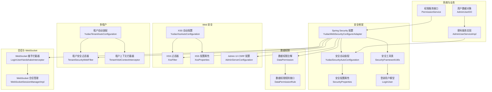
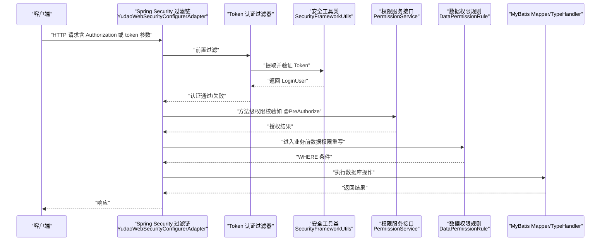
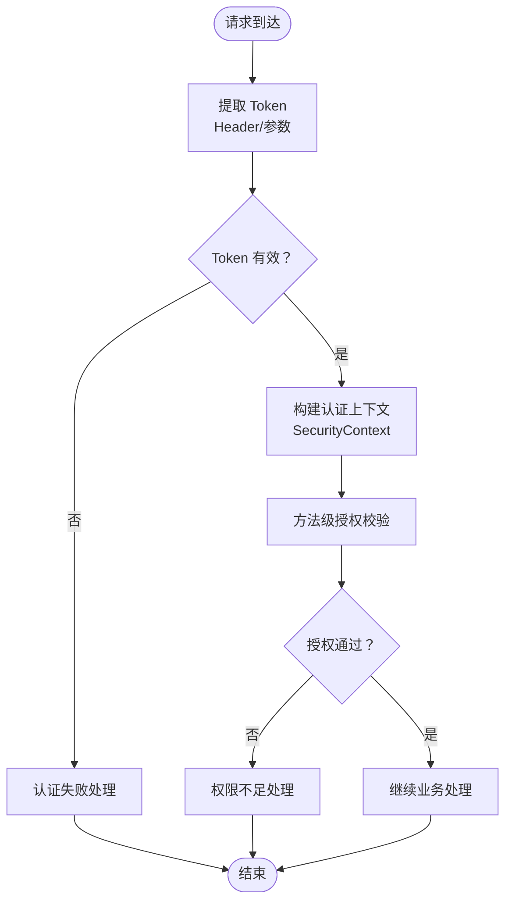
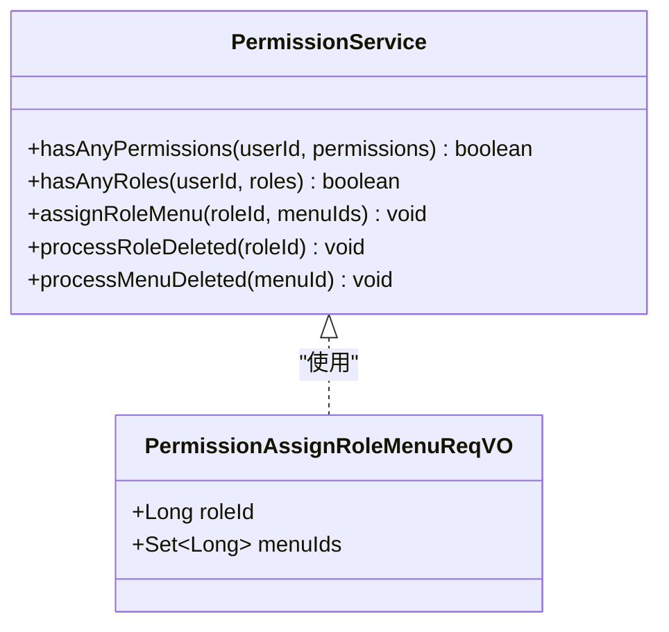
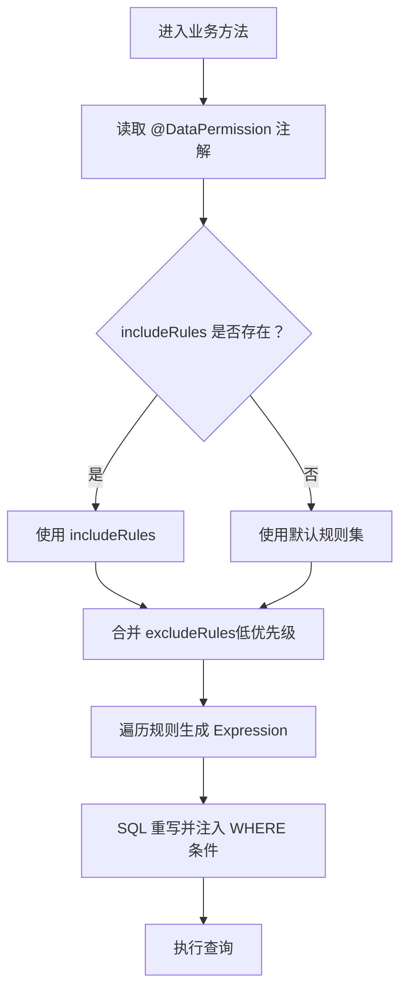
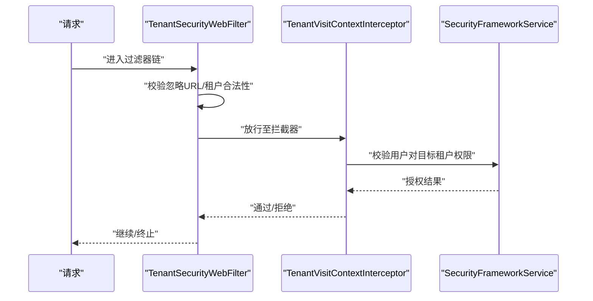
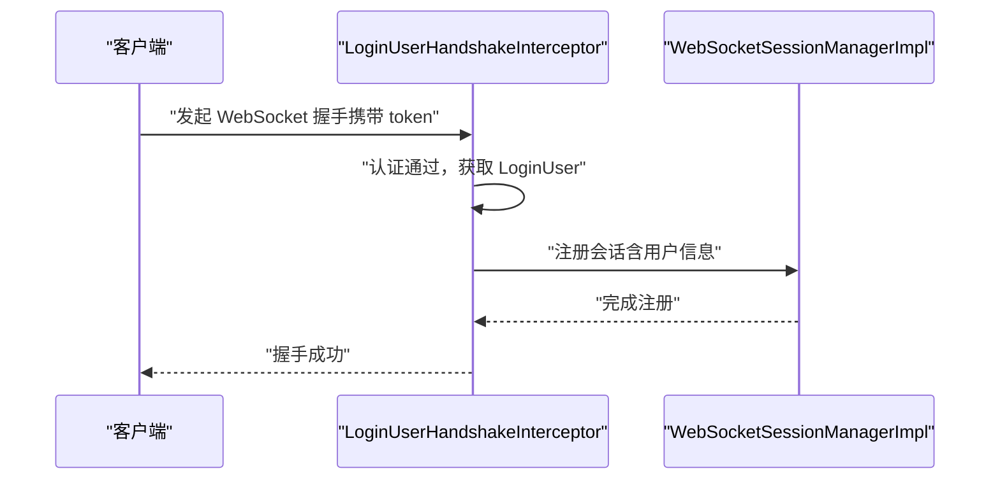
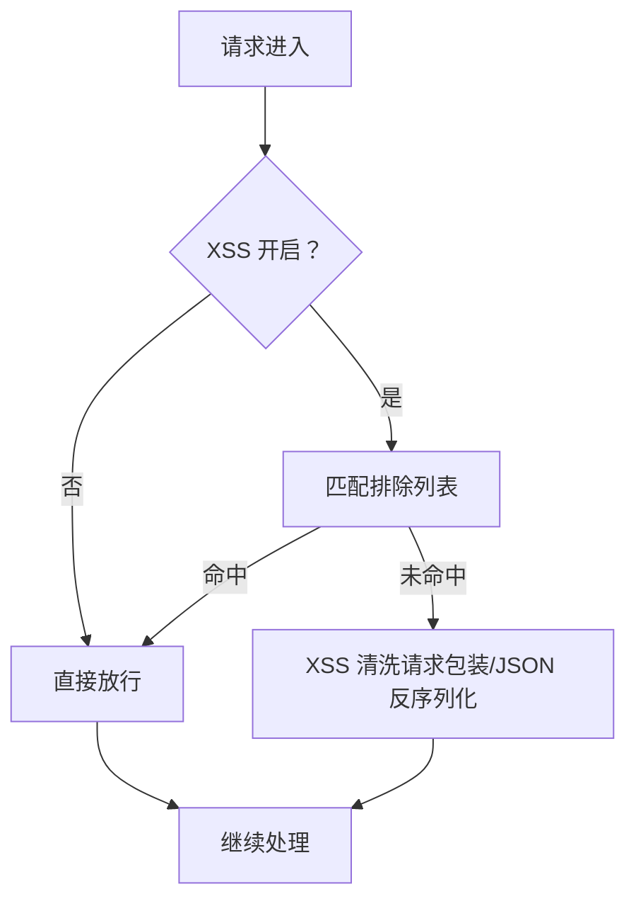
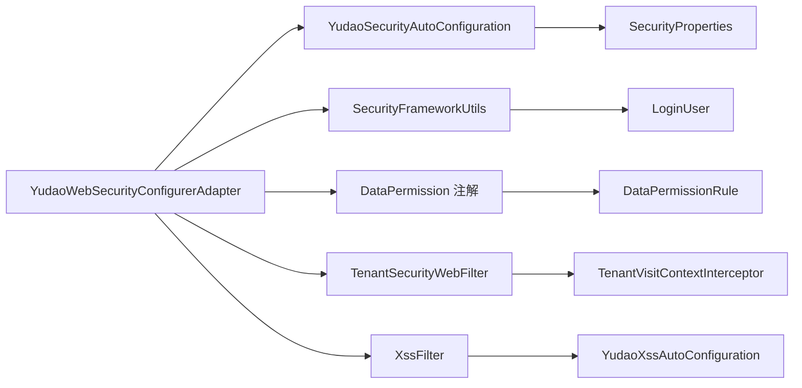

# 安全与权限

<cite>
**本文引用的文件**
- [YudaoWebSecurityConfigurerAdapter.java](file://backend/yudao-framework/yudao-spring-boot-starter-security/src/main/java/cn/iocoder/yudao/framework/security/config/YudaoWebSecurityConfigurerAdapter.java)
- [YudaoSecurityAutoConfiguration.java](file://backend/yudao-framework/yudao-spring-boot-starter-security/src/main/java/cn/iocoder/yudao/framework/security/config/YudaoSecurityAutoConfiguration.java)
- [SecurityProperties.java](file://backend/yudao-framework/yudao-spring-boot-starter-security/src/main/java/cn/iocoder/yudao/framework/security/config/SecurityProperties.java)
- [SecurityFrameworkUtils.java](file://backend/yudao-framework/yudao-spring-boot-starter-security/src/main/java/cn/iocoder/yudao/framework/security/core/util/SecurityFrameworkUtils.java)
- [LoginUser.java](file://backend/yudao-framework/yudao-spring-boot-starter-security/src/main/java/cn/iocoder/yudao/framework/security/core/LoginUser.java)
- [XssFilter.java](file://backend/yudao-framework/yudao-spring-boot-starter-web/src/main/java/cn/iocoder/yudao/framework/xss/core/filter/XssFilter.java)
- [XssProperties.java](file://backend/yudao-framework/yudao-spring-boot-starter-web/src/main/java/cn/iocoder/yudao/framework/xss/config/XssProperties.java)
- [YudaoXssAutoConfiguration.java](file://backend/yudao-framework/yudao-spring-boot-starter-web/src/main/java/cn/iocoder/yudao/framework/xss/config/YudaoXssAutoConfiguration.java)
- [DataPermission.java](file://backend/yudao-framework/yudao-spring-boot-starter-biz-data-permission/src/main/java/cn/iocoder/yudao/framework/datapermission/core/annotation/DataPermission.java)
- [DataPermissionRule.java](file://backend/yudao-framework/yudao-spring-boot-starter-biz-data-permission/src/main/java/cn/iocoder/yudao/framework/datapermission/core/rule/DataPermissionRule.java)
- [EncryptTypeHandler.java](file://backend/yudao-framework/yudao-spring-boot-starter-mybatis/src/main/java/cn/iocoder/yudao/framework/mybatis/core/type/EncryptTypeHandler.java)
- [TenantSecurityWebFilter.java](file://backend/yudao-framework/yudao-spring-boot-starter-biz-tenant/src/main/java/cn/iocoder/yudao/framework/tenant/core/security/TenantSecurityWebFilter.java)
- [YudaoTenantAutoConfiguration.java](file://backend/yudao-framework/yudao-spring-boot-starter-biz-tenant/src/main/java/cn/iocoder/yudao/framework/tenant/config/YudaoTenantAutoConfiguration.java)
- [TenantVisitContextInterceptor.java](file://backend/yudao-framework/yudao-spring-boot-starter-biz-tenant/src/main/java/cn/iocoder/yudao/framework/tenant/core/web/TenantVisitContextInterceptor.java)
- [AdminServerConfiguration.java](file://backend/yudao-module-infra/src/main/java/cn/iocoder/yudao/module/infra/framework/monitor/config/AdminServerConfiguration.java)
- [LoginUserHandshakeInterceptor.java](file://backend/yudao-framework/yudao-spring-boot-starter-websocket/src/main/java/cn/iocoder/yudao/framework/websocket/core/security/LoginUserHandshakeInterceptor.java)
- [WebSocketSessionManagerImpl.java](file://backend/yudao-framework/yudao-spring-boot-starter-websocket/src/main/java/cn/iocoder/yudao/framework/websocket/core/session/WebSocketSessionManagerImpl.java)
- [AdminUserServiceImpl.java](file://backend/yudao-module-system/src/main/java/cn/iocoder/yudao/module/system/service/user/AdminUserServiceImpl.java)
- [AdminUserDO.java](file://backend/yudao-module-system/src/main/java/cn/iocoder/yudao/module/system/dal/dataobject/user/AdminUserDO.java)
- [PermissionService.java](file://backend/yudao-module-system/src/main/java/cn/iocoder/yudao/module/system/service/permission/PermissionService.java)
- [PermissionAssignRoleMenuReqVO.java](file://backend/yudao-module-system/src/main/java/cn/iocoder/yudao/module/system/controller/admin/permission/vo/permission/PermissionAssignRoleMenuReqVO.java)
</cite>

## 目录
1. [简介](#简介)
2. [项目结构](#项目结构)
3. [核心组件](#核心组件)
4. [架构总览](#架构总览)
5. [详细组件分析](#详细组件分析)
6. [依赖分析](#依赖分析)
7. [性能考量](#性能考量)
8. [故障排查指南](#故障排查指南)
9. [结论](#结论)
10. [附录](#附录)

## 简介
本文件面向安全与权限主题，系统化梳理基于 Spring Security 的权限控制体系，覆盖角色权限管理、菜单权限控制、数据权限过滤机制、API 安全策略、认证与授权、用户会话管理、密码加密存储、防暴力破解、CSRF/XSS/SQL 注入防护、敏感数据处理与隐私合规、以及安全配置最佳实践、漏洞扫描与安全审计方法、安全事件响应与应急流程。

## 项目结构
围绕安全与权限的关键模块分布于以下子工程：
- 安全框架与自动装配：yudao-spring-boot-starter-security
- Web 安全增强（XSS、CSRF 等）：yudao-spring-boot-starter-web
- 数据权限：yudao-spring-boot-starter-biz-data-permission
- 多租户安全：yudao-spring-boot-starter-biz-tenant
- MyBatis 加解密：yudao-spring-boot-starter-mybatis
- WebSocket 安全：yudao-spring-boot-starter-websocket
- 系统模块（权限、用户、菜单）：yudao-module-system
- 监控与 Admin UI 安全：yudao-module-infra

**图表来源**
- [YudaoWebSecurityConfigurerAdapter.java:110-153](file://backend/yudao-framework/yudao-spring-boot-starter-security/src/main/java/cn/iocoder/yudao/framework/security/config/YudaoWebSecurityConfigurerAdapter.java#L110-L153)
- [YudaoSecurityAutoConfiguration.java:32-85](file://backend/yudao-framework/yudao-spring-boot-starter-security/src/main/java/cn/iocoder/yudao/framework/security/config/YudaoSecurityAutoConfiguration.java#L32-L85)
- [SecurityProperties.java:12-51](file://backend/yudao-framework/yudao-spring-boot-starter-security/src/main/java/cn/iocoder/yudao/framework/security/config/SecurityProperties.java#L12-L51)
- [SecurityFrameworkUtils.java:24-161](file://backend/yudao-framework/yudao-spring-boot-starter-security/src/main/java/cn/iocoder/yudao/framework/security/core/util/SecurityFrameworkUtils.java#L24-L161)
- [LoginUser.java:18-76](file://backend/yudao-framework/yudao-spring-boot-starter-security/src/main/java/cn/iocoder/yudao/framework/security/core/LoginUser.java#L18-L76)
- [XssFilter.java:20-53](file://backend/yudao-framework/yudao-spring-boot-starter-web/src/main/java/cn/iocoder/yudao/framework/xss/core/filter/XssFilter.java#L20-L53)
- [YudaoXssAutoConfiguration.java:21-56](file://backend/yudao-framework/yudao-spring-boot-starter-web/src/main/java/cn/iocoder/yudao/framework/xss/config/YudaoXssAutoConfiguration.java#L21-L56)
- [XssProperties.java:15-29](file://backend/yudao-framework/yudao-spring-boot-starter-web/src/main/java/cn/iocoder/yudao/framework/xss/config/XssProperties.java#L15-L29)
- [DataPermission.java:13-36](file://backend/yudao-framework/yudao-spring-boot-starter-biz-data-permission/src/main/java/cn/iocoder/yudao/framework/datapermission/core/annotation/DataPermission.java#L13-L36)
- [DataPermissionRule.java:15-37](file://backend/yudao-framework/yudao-spring-boot-starter-biz-data-permission/src/main/java/cn/iocoder/yudao/framework/datapermission/core/rule/DataPermissionRule.java#L15-L37)
- [TenantSecurityWebFilter.java:34-58](file://backend/yudao-framework/yudao-spring-boot-starter-biz-tenant/src/main/java/cn/iocoder/yudao/framework/tenant/core/security/TenantSecurityWebFilter.java#L34-L58)
- [YudaoTenantAutoConfiguration.java:96-119](file://backend/yudao-framework/yudao-spring-boot-starter-biz-tenant/src/main/java/cn/iocoder/yudao/framework/tenant/config/YudaoTenantAutoConfiguration.java#L96-L119)
- [TenantVisitContextInterceptor.java:21-30](file://backend/yudao-framework/yudao-spring-boot-starter-biz-tenant/src/main/java/cn/iocoder/yudao/framework/tenant/core/web/TenantVisitContextInterceptor.java#L21-L30)
- [LoginUserHandshakeInterceptor.java:24-29](file://backend/yudao-framework/yudao-spring-boot-starter-websocket/src/main/java/cn/iocoder/yudao/framework/websocket/core/security/LoginUserHandshakeInterceptor.java#L24-L29)
- [WebSocketSessionManagerImpl.java:22-42](file://backend/yudao-framework/yudao-spring-boot-starter-websocket/src/main/java/cn/iocoder/yudao/framework/websocket/core/session/WebSocketSessionManagerImpl.java#L22-L42)
- [PermissionService.java:17-54](file://backend/yudao-module-system/src/main/java/cn/iocoder/yudao/module/system/service/permission/PermissionService.java#L17-L54)
- [AdminUserServiceImpl.java:538-552](file://backend/yudao-module-system/src/main/java/cn/iocoder/yudao/module/system/service/user/AdminUserServiceImpl.java#L538-L552)
- [AdminUserDO.java:29-42](file://backend/yudao-module-system/src/main/java/cn/iocoder/yudao/module/system/dal/dataobject/user/AdminUserDO.java#L29-L42)
- [AdminServerConfiguration.java:80-107](file://backend/yudao-module-infra/src/main/java/cn/iocoder/yudao/module/infra/framework/monitor/config/AdminServerConfiguration.java#L80-L107)

**章节来源**
- [YudaoWebSecurityConfigurerAdapter.java:110-153](file://backend/yudao-framework/yudao-spring-boot-starter-security/src/main/java/cn/iocoder/yudao/framework/security/config/YudaoWebSecurityConfigurerAdapter.java#L110-L153)
- [YudaoSecurityAutoConfiguration.java:32-85](file://backend/yudao-framework/yudao-spring-boot-starter-security/src/main/java/cn/iocoder/yudao/framework/security/config/YudaoSecurityAutoConfiguration.java#L32-L85)

## 核心组件
- 安全配置与过滤链
  - 基于无状态 Token 的认证，禁用 CSRF 与 Session，统一异常处理。
  - 动态收集 @PermitAll 注解的 URL，支持多 HTTP 方法匹配。
  - 全局免认证静态资源与配置项白名单，兜底规则要求认证。
- 安全工具与上下文
  - 从请求提取 Bearer Token，获取当前登录用户与上下文信息。
  - 支持跨租户访问时的权限校验跳过逻辑。
- 密码与加解密
  - BCrypt 密码编码器，用户密码加密存储。
  - MyBatis 字段级 AES 加解密 TypeHandler。
- 数据权限
  - 基于注解的启用/排除规则，SQL 重写生成 WHERE 条件。
- 多租户安全
  - 请求级安全过滤，校验租户合法性与访问权限。
  - WebMvc 拦截器与上下文设置，结合权限服务校验访问。
- WebSocket 安全
  - 握手阶段注入登录用户至会话，配合会话管理器维护连接。
- Web 安全增强
  - XSS 过滤器与 Jackson 序列化器，按配置开关与排除列表控制。
  - Admin UI CSRF 配置，忽略特定端点。

**章节来源**
- [YudaoWebSecurityConfigurerAdapter.java:110-222](file://backend/yudao-framework/yudao-spring-boot-starter-security/src/main/java/cn/iocoder/yudao/framework/security/config/YudaoWebSecurityConfigurerAdapter.java#L110-L222)
- [SecurityFrameworkUtils.java:24-161](file://backend/yudao-framework/yudao-spring-boot-starter-security/src/main/java/cn/iocoder/yudao/framework/security/core/util/SecurityFrameworkUtils.java#L24-L161)
- [AdminUserServiceImpl.java:538-552](file://backend/yudao-module-system/src/main/java/cn/iocoder/yudao/module/system/service/user/AdminUserServiceImpl.java#L538-L552)
- [EncryptTypeHandler.java:21-75](file://backend/yudao-framework/yudao-spring-boot-starter-mybatis/src/main/java/cn/iocoder/yudao/framework/mybatis/core/type/EncryptTypeHandler.java#L21-L75)
- [DataPermission.java:13-36](file://backend/yudao-framework/yudao-spring-boot-starter-biz-data-permission/src/main/java/cn/iocoder/yudao/framework/datapermission/core/annotation/DataPermission.java#L13-L36)
- [DataPermissionRule.java:15-37](file://backend/yudao-framework/yudao-spring-boot-starter-biz-data-permission/src/main/java/cn/iocoder/yudao/framework/datapermission/core/rule/DataPermissionRule.java#L15-L37)
- [TenantSecurityWebFilter.java:34-58](file://backend/yudao-framework/yudao-spring-boot-starter-biz-tenant/src/main/java/cn/iocoder/yudao/framework/tenant/core/security/TenantSecurityWebFilter.java#L34-L58)
- [YudaoTenantAutoConfiguration.java:96-119](file://backend/yudao-framework/yudao-spring-boot-starter-biz-tenant/src/main/java/cn/iocoder/yudao/framework/tenant/config/YudaoTenantAutoConfiguration.java#L96-L119)
- [TenantVisitContextInterceptor.java:21-30](file://backend/yudao-framework/yudao-spring-boot-starter-biz-tenant/src/main/java/cn/iocoder/yudao/framework/tenant/core/web/TenantVisitContextInterceptor.java#L21-L30)
- [LoginUserHandshakeInterceptor.java:24-29](file://backend/yudao-framework/yudao-spring-boot-starter-websocket/src/main/java/cn/iocoder/yudao/framework/websocket/core/security/LoginUserHandshakeInterceptor.java#L24-L29)
- [WebSocketSessionManagerImpl.java:22-42](file://backend/yudao-framework/yudao-spring-boot-starter-websocket/src/main/java/cn/iocoder/yudao/framework/websocket/core/session/WebSocketSessionManagerImpl.java#L22-L42)
- [XssFilter.java:20-53](file://backend/yudao-framework/yudao-spring-boot-starter-web/src/main/java/cn/iocoder/yudao/framework/xss/core/filter/XssFilter.java#L20-L53)
- [YudaoXssAutoConfiguration.java:21-56](file://backend/yudao-framework/yudao-spring-boot-starter-web/src/main/java/cn/iocoder/yudao/framework/xss/config/YudaoXssAutoConfiguration.java#L21-L56)
- [AdminServerConfiguration.java:80-107](file://backend/yudao-module-infra/src/main/java/cn/iocoder/yudao/module/infra/framework/monitor/config/AdminServerConfiguration.java#L80-L107)

## 架构总览
整体安全架构由“配置层—过滤链—上下文—服务层—数据层”构成，贯穿请求生命周期的认证、授权、数据隔离与会话管理。

**图表来源**
- [YudaoWebSecurityConfigurerAdapter.java:110-153](file://backend/yudao-framework/yudao-spring-boot-starter-security/src/main/java/cn/iocoder/yudao/framework/security/config/YudaoWebSecurityConfigurerAdapter.java#L110-L153)
- [SecurityFrameworkUtils.java:41-81](file://backend/yudao-framework/yudao-spring-boot-starter-security/src/main/java/cn/iocoder/yudao/framework/security/core/util/SecurityFrameworkUtils.java#L41-L81)
- [DataPermissionRule.java:15-37](file://backend/yudao-framework/yudao-spring-boot-starter-biz-data-permission/src/main/java/cn/iocoder/yudao/framework/datapermission/core/rule/DataPermissionRule.java#L15-L37)
- [PermissionService.java:17-54](file://backend/yudao-module-system/src/main/java/cn/iocoder/yudao/module/system/service/permission/PermissionService.java#L17-L54)

## 详细组件分析

### 认证与授权（基于 Token 的无状态机制）
- 配置要点
  - 禁用 CSRF 与 Session，使用 STATELESS 策略。
  - 统一异常处理：认证失败与权限不足分别交由自定义处理器。
  - 动态免登白名单：扫描 @PermitAll 注解与配置项 yudao.security.permit-all-urls。
  - 兜底规则：异步请求放行，其余请求必须认证。
- Token 提取与上下文
  - 支持 Header 与查询参数两种携带方式，自动去除 Bearer 前缀。
  - 将 LoginUser 写入 SecurityContext 与请求上下文，便于日志与后续处理。
- 密码与加解密
  - 用户密码采用 BCrypt 存储，服务层提供匹配与编码方法。
  - 敏感字段通过 MyBatis TypeHandler 进行 AES 加解密。

**图表来源**
- [YudaoWebSecurityConfigurerAdapter.java:110-153](file://backend/yudao-framework/yudao-spring-boot-starter-security/src/main/java/cn/iocoder/yudao/framework/security/config/YudaoWebSecurityConfigurerAdapter.java#L110-L153)
- [SecurityFrameworkUtils.java:41-81](file://backend/yudao-framework/yudao-spring-boot-starter-security/src/main/java/cn/iocoder/yudao/framework/security/core/util/SecurityFrameworkUtils.java#L41-L81)
- [AdminUserServiceImpl.java:538-552](file://backend/yudao-module-system/src/main/java/cn/iocoder/yudao/module/system/service/user/AdminUserServiceImpl.java#L538-L552)

**章节来源**
- [YudaoWebSecurityConfigurerAdapter.java:110-153](file://backend/yudao-framework/yudao-spring-boot-starter-security/src/main/java/cn/iocoder/yudao/framework/security/config/YudaoWebSecurityConfigurerAdapter.java#L110-L153)
- [SecurityFrameworkUtils.java:24-161](file://backend/yudao-framework/yudao-spring-boot-starter-security/src/main/java/cn/iocoder/yudao/framework/security/core/util/SecurityFrameworkUtils.java#L24-L161)
- [SecurityProperties.java:12-51](file://backend/yudao-framework/yudao-spring-boot-starter-security/src/main/java/cn/iocoder/yudao/framework/security/config/SecurityProperties.java#L12-L51)
- [AdminUserServiceImpl.java:538-552](file://backend/yudao-module-system/src/main/java/cn/iocoder/yudao/module/system/service/user/AdminUserServiceImpl.java#L538-L552)
- [EncryptTypeHandler.java:21-75](file://backend/yudao-framework/yudao-spring-boot-starter-mybatis/src/main/java/cn/iocoder/yudao/framework/mybatis/core/type/EncryptTypeHandler.java#L21-L75)

### 角色权限管理与菜单权限控制
- 角色-权限/角色-菜单
  - 权限服务接口提供 hasAnyPermissions、hasAnyRoles 与赋权/清理等能力。
  - 菜单赋权请求 VO 定义了角色与菜单集合。
- 控制器与注解
  - 系统模块控制器广泛使用 @PreAuthorize 等方法级安全注解，确保细粒度授权。
- 数据权限联动
  - 在业务方法上通过 @DataPermission 控制数据权限规则集，实现“可见即能查”。

**图表来源**
- [PermissionService.java:17-54](file://backend/yudao-module-system/src/main/java/cn/iocoder/yudao/module/system/service/permission/PermissionService.java#L17-L54)
- [PermissionAssignRoleMenuReqVO.java:12-21](file://backend/yudao-module-system/src/main/java/cn/iocoder/yudao/module/system/controller/admin/permission/vo/permission/PermissionAssignRoleMenuReqVO.java#L12-L21)

**章节来源**
- [PermissionService.java:17-54](file://backend/yudao-module-system/src/main/java/cn/iocoder/yudao/module/system/service/permission/PermissionService.java#L17-L54)
- [PermissionAssignRoleMenuReqVO.java:12-21](file://backend/yudao-module-system/src/main/java/cn/iocoder/yudao/module/system/controller/admin/permission/vo/permission/PermissionAssignRoleMenuReqVO.java#L12-L21)

### 数据权限过滤机制
- 注解驱动
  - @DataPermission 支持 includeRules/excludeRules 与 enable 控制，优先级明确。
- 规则接口
  - DataPermissionRule 定义 getTableNames 与 getExpression，基于 SQL 重写生成 WHERE 条件。
- 工作流
  - Mapper 层在执行 SQL 前，根据注解与规则动态拼接过滤条件，实现“所见即所得”的数据边界。

**图表来源**
- [DataPermission.java:13-36](file://backend/yudao-framework/yudao-spring-boot-starter-biz-data-permission/src/main/java/cn/iocoder/yudao/framework/datapermission/core/annotation/DataPermission.java#L13-L36)
- [DataPermissionRule.java:15-37](file://backend/yudao-framework/yudao-spring-boot-starter-biz-data-permission/src/main/java/cn/iocoder/yudao/framework/datapermission/core/rule/DataPermissionRule.java#L15-L37)

**章节来源**
- [DataPermission.java:13-36](file://backend/yudao-framework/yudao-spring-boot-starter-biz-data-permission/src/main/java/cn/iocoder/yudao/framework/datapermission/core/annotation/DataPermission.java#L13-L36)
- [DataPermissionRule.java:15-37](file://backend/yudao-framework/yudao-spring-boot-starter-biz-data-permission/src/main/java/cn/iocoder/yudao/framework/datapermission/core/rule/DataPermissionRule.java#L15-L37)

### 多租户安全与访问控制
- 过滤器
  - TenantSecurityWebFilter 校验未携带租户时的忽略 URL、校验租户状态与访问权限。
- 拦截器
  - TenantVisitContextInterceptor 在请求前校验用户对目标租户的访问权限，结合权限服务判断。
- 自动装配
  - 注册拦截器与过滤器，排除租户忽略 URL，确保安全与可用性平衡。

**图表来源**
- [TenantSecurityWebFilter.java:34-58](file://backend/yudao-framework/yudao-spring-boot-starter-biz-tenant/src/main/java/cn/iocoder/yudao/framework/tenant/core/security/TenantSecurityWebFilter.java#L34-L58)
- [TenantVisitContextInterceptor.java:21-30](file://backend/yudao-framework/yudao-spring-boot-starter-biz-tenant/src/main/java/cn/iocoder/yudao/framework/tenant/core/web/TenantVisitContextInterceptor.java#L21-L30)
- [YudaoTenantAutoConfiguration.java:96-119](file://backend/yudao-framework/yudao-spring-boot-starter-biz-tenant/src/main/java/cn/iocoder/yudao/framework/tenant/config/YudaoTenantAutoConfiguration.java#L96-L119)

**章节来源**
- [TenantSecurityWebFilter.java:34-58](file://backend/yudao-framework/yudao-spring-boot-starter-biz-tenant/src/main/java/cn/iocoder/yudao/framework/tenant/core/security/TenantSecurityWebFilter.java#L34-L58)
- [TenantVisitContextInterceptor.java:21-30](file://backend/yudao-framework/yudao-spring-boot-starter-biz-tenant/src/main/java/cn/iocoder/yudao/framework/tenant/core/web/TenantVisitContextInterceptor.java#L21-L30)
- [YudaoTenantAutoConfiguration.java:96-119](file://backend/yudao-framework/yudao-spring-boot-starter-biz-tenant/src/main/java/cn/iocoder/yudao/framework/tenant/config/YudaoTenantAutoConfiguration.java#L96-L119)

### WebSocket 会话安全
- 握手阶段
  - LoginUserHandshakeInterceptor 将已认证的 LoginUser 注入 WebSocketSession，保障会话上下文一致。
- 会话管理
  - WebSocketSessionManagerImpl 维护按用户类型与用户 ID 的会话索引，支持定向推送与权限控制。

**图表来源**
- [LoginUserHandshakeInterceptor.java:24-29](file://backend/yudao-framework/yudao-spring-boot-starter-websocket/src/main/java/cn/iocoder/yudao/framework/websocket/core/security/LoginUserHandshakeInterceptor.java#L24-L29)
- [WebSocketSessionManagerImpl.java:22-42](file://backend/yudao-framework/yudao-spring-boot-starter-websocket/src/main/java/cn/iocoder/yudao/framework/websocket/core/session/WebSocketSessionManagerImpl.java#L22-L42)

**章节来源**
- [LoginUserHandshakeInterceptor.java:24-29](file://backend/yudao-framework/yudao-spring-boot-starter-websocket/src/main/java/cn/iocoder/yudao/framework/websocket/core/security/LoginUserHandshakeInterceptor.java#L24-L29)
- [WebSocketSessionManagerImpl.java:22-42](file://backend/yudao-framework/yudao-spring-boot-starter-websocket/src/main/java/cn/iocoder/yudao/framework/websocket/core/session/WebSocketSessionManagerImpl.java#L22-L42)

### Web 安全增强（XSS、CSRF）
- XSS
  - XssFilter 对请求体与 JSON 参数进行清洗，支持按路径排除与开关控制。
  - Jackson 序列化器在反序列化时进行字符串 XSS 清洗，避免二次污染。
- CSRF
  - Admin UI 使用 CookieCsrfTokenRepository 并忽略特定端点（如实例注册与 actuator），其他场景禁用 CSRF 以适配 Token 机制。

**图表来源**
- [XssFilter.java:20-53](file://backend/yudao-framework/yudao-spring-boot-starter-web/src/main/java/cn/iocoder/yudao/framework/xss/core/filter/XssFilter.java#L20-L53)
- [YudaoXssAutoConfiguration.java:21-56](file://backend/yudao-framework/yudao-spring-boot-starter-web/src/main/java/cn/iocoder/yudao/framework/xss/config/YudaoXssAutoConfiguration.java#L21-L56)
- [XssProperties.java:15-29](file://backend/yudao-framework/yudao-spring-boot-starter-web/src/main/java/cn/iocoder/yudao/framework/xss/config/XssProperties.java#L15-L29)
- [AdminServerConfiguration.java:96-103](file://backend/yudao-module-infra/src/main/java/cn/iocoder/yudao/module/infra/framework/monitor/config/AdminServerConfiguration.java#L96-L103)

**章节来源**
- [XssFilter.java:20-53](file://backend/yudao-framework/yudao-spring-boot-starter-web/src/main/java/cn/iocoder/yudao/framework/xss/core/filter/XssFilter.java#L20-L53)
- [YudaoXssAutoConfiguration.java:21-56](file://backend/yudao-framework/yudao-spring-boot-starter-web/src/main/java/cn/iocoder/yudao/framework/xss/config/YudaoXssAutoConfiguration.java#L21-L56)
- [XssProperties.java:15-29](file://backend/yudao-framework/yudao-spring-boot-starter-web/src/main/java/cn/iocoder/yudao/framework/xss/config/XssProperties.java#L15-L29)
- [AdminServerConfiguration.java:96-103](file://backend/yudao-module-infra/src/main/java/cn/iocoder/yudao/module/infra/framework/monitor/config/AdminServerConfiguration.java#L96-L103)

### API 安全策略、认证方式与授权机制
- 认证方式
  - 基于 Token 的无状态认证，支持 Header 与查询参数两种携带方式。
  - 登录流程未接入 Spring Security 默认登录扩展，降低复杂度与学习成本。
- 授权机制
  - URL 级：免登白名单 + 兜底认证。
  - 方法级：@PreAuthorize 等注解实现细粒度授权。
  - 数据级：@DataPermission + DataPermissionRule 生成 WHERE 条件。
- 会话管理
  - 无 Session，STATELESS 策略；WebSocket 通过握手注入 LoginUser。

**章节来源**
- [YudaoWebSecurityConfigurerAdapter.java:110-153](file://backend/yudao-framework/yudao-spring-boot-starter-security/src/main/java/cn/iocoder/yudao/framework/security/config/YudaoWebSecurityConfigurerAdapter.java#L110-L153)
- [SecurityFrameworkUtils.java:41-81](file://backend/yudao-framework/yudao-spring-boot-starter-security/src/main/java/cn/iocoder/yudao/framework/security/core/util/SecurityFrameworkUtils.java#L41-L81)
- [PermissionService.java:17-54](file://backend/yudao-module-system/src/main/java/cn/iocoder/yudao/module/system/service/permission/PermissionService.java#L17-L54)
- [DataPermission.java:13-36](file://backend/yudao-framework/yudao-spring-boot-starter-biz-data-permission/src/main/java/cn/iocoder/yudao/framework/datapermission/core/annotation/DataPermission.java#L13-L36)

### 用户会话管理、密码加密存储与防暴力破解
- 会话管理
  - 无 Session，STATELESS；WebSocket 握手注入 LoginUser。
- 密码加密存储
  - BCrypt 编码器，服务层提供 matches/encode 方法。
- 防暴力破解
  - 未在现有代码中发现专门的速率限制或账户锁定实现；建议引入限流与账户锁定策略（见“性能考量/安全加固建议”）。

**章节来源**
- [YudaoWebSecurityConfigurerAdapter.java:110-153](file://backend/yudao-framework/yudao-spring-boot-starter-security/src/main/java/cn/iocoder/yudao/framework/security/config/YudaoWebSecurityConfigurerAdapter.java#L110-L153)
- [AdminUserServiceImpl.java:538-552](file://backend/yudao-module-system/src/main/java/cn/iocoder/yudao/module/system/service/user/AdminUserServiceImpl.java#L538-L552)
- [AdminUserDO.java:29-42](file://backend/yudao-module-system/src/main/java/cn/iocoder/yudao/module/system/dal/dataobject/user/AdminUserDO.java#L29-L42)

### CSRF 保护、XSS 防护与 SQL 注入防范
- CSRF
  - Token 机制 + 禁用 CSRF；Admin UI 使用 CookieCsrfTokenRepository 并忽略特定端点。
- XSS
  - 请求包装与 JSON 反序列化双通道清洗，支持排除列表与开关。
- SQL 注入
  - 数据权限通过 SQL 重写注入 WHERE 条件，避免原生拼接；建议配合参数化查询与 ORM 最佳实践。

**章节来源**
- [AdminServerConfiguration.java:96-103](file://backend/yudao-module-infra/src/main/java/cn/iocoder/yudao/module/infra/framework/monitor/config/AdminServerConfiguration.java#L96-L103)
- [XssFilter.java:20-53](file://backend/yudao-framework/yudao-spring-boot-starter-web/src/main/java/cn/iocoder/yudao/framework/xss/core/filter/XssFilter.java#L20-L53)
- [YudaoXssAutoConfiguration.java:21-56](file://backend/yudao-framework/yudao-spring-boot-starter-web/src/main/java/cn/iocoder/yudao/framework/xss/config/YudaoXssAutoConfiguration.java#L21-L56)
- [DataPermissionRule.java:15-37](file://backend/yudao-framework/yudao-spring-boot-starter-biz-data-permission/src/main/java/cn/iocoder/yudao/framework/datapermission/core/rule/DataPermissionRule.java#L15-L37)

### 敏感数据处理、隐私保护与合规性
- 敏感字段加解密
  - MyBatis TypeHandler 基于 AES 对字段进行加密存储与解密读取。
- 隐私保护
  - XSS 过滤与最小化数据暴露；数据权限确保仅可见授权范围内的数据。
- 合规性
  - 密码采用 BCrypt；建议结合访问日志与审计（见“性能考量/安全审计建议”）。

**章节来源**
- [EncryptTypeHandler.java:21-75](file://backend/yudao-framework/yudao-spring-boot-starter-mybatis/src/main/java/cn/iocoder/yudao/framework/mybatis/core/type/EncryptTypeHandler.java#L21-L75)
- [XssFilter.java:20-53](file://backend/yudao-framework/yudao-spring-boot-starter-web/src/main/java/cn/iocoder/yudao/framework/xss/core/filter/XssFilter.java#L20-L53)

### 安全配置最佳实践、漏洞扫描与安全审计
- 最佳实践
  - 明确免登白名单；严格使用方法级注解；开启数据权限；租户访问校验。
  - 建议：引入限流与账户锁定、定期轮换密钥、最小权限原则。
- 漏洞扫描
  - 建议使用 SAST（如 SpotBugs/Checkmarx）与 DAST（如 OWASP ZAP）结合。
- 安全审计
  - 记录登录、授权、数据访问日志；定期审查权限分配与异常访问。

[本节为通用指导，不直接分析具体文件]

## 依赖分析
- 组件耦合
  - Security 配置依赖自动装配与属性；工具类依赖上下文与 Web 工具。
  - 数据权限与权限服务形成“注解—规则—服务”的闭环。
  - 多租户过滤器与拦截器协同，结合权限服务进行访问校验。
- 外部依赖
  - Spring Security、MyBatis Plus、Jackson、Hutool 等。

**图表来源**
- [YudaoWebSecurityConfigurerAdapter.java:110-153](file://backend/yudao-framework/yudao-spring-boot-starter-security/src/main/java/cn/iocoder/yudao/framework/security/config/YudaoWebSecurityConfigurerAdapter.java#L110-L153)
- [YudaoSecurityAutoConfiguration.java:32-85](file://backend/yudao-framework/yudao-spring-boot-starter-security/src/main/java/cn/iocoder/yudao/framework/security/config/YudaoSecurityAutoConfiguration.java#L32-L85)
- [SecurityProperties.java:12-51](file://backend/yudao-framework/yudao-spring-boot-starter-security/src/main/java/cn/iocoder/yudao/framework/security/config/SecurityProperties.java#L12-L51)
- [SecurityFrameworkUtils.java:24-161](file://backend/yudao-framework/yudao-spring-boot-starter-security/src/main/java/cn/iocoder/yudao/framework/security/core/util/SecurityFrameworkUtils.java#L24-L161)
- [LoginUser.java:18-76](file://backend/yudao-framework/yudao-spring-boot-starter-security/src/main/java/cn/iocoder/yudao/framework/security/core/LoginUser.java#L18-L76)
- [DataPermission.java:13-36](file://backend/yudao-framework/yudao-spring-boot-starter-biz-data-permission/src/main/java/cn/iocoder/yudao/framework/datapermission/core/annotation/DataPermission.java#L13-L36)
- [DataPermissionRule.java:15-37](file://backend/yudao-framework/yudao-spring-boot-starter-biz-data-permission/src/main/java/cn/iocoder/yudao/framework/datapermission/core/rule/DataPermissionRule.java#L15-L37)
- [TenantSecurityWebFilter.java:34-58](file://backend/yudao-framework/yudao-spring-boot-starter-biz-tenant/src/main/java/cn/iocoder/yudao/framework/tenant/core/security/TenantSecurityWebFilter.java#L34-L58)
- [TenantVisitContextInterceptor.java:21-30](file://backend/yudao-framework/yudao-spring-boot-starter-biz-tenant/src/main/java/cn/iocoder/yudao/framework/tenant/core/web/TenantVisitContextInterceptor.java#L21-L30)
- [XssFilter.java:20-53](file://backend/yudao-framework/yudao-spring-boot-starter-web/src/main/java/cn/iocoder/yudao/framework/xss/core/filter/XssFilter.java#L20-L53)
- [YudaoXssAutoConfiguration.java:21-56](file://backend/yudao-framework/yudao-spring-boot-starter-web/src/main/java/cn/iocoder/yudao/framework/xss/config/YudaoXssAutoConfiguration.java#L21-L56)

**章节来源**
- [YudaoWebSecurityConfigurerAdapter.java:110-153](file://backend/yudao-framework/yudao-spring-boot-starter-security/src/main/java/cn/iocoder/yudao/framework/security/config/YudaoWebSecurityConfigurerAdapter.java#L110-L153)
- [YudaoSecurityAutoConfiguration.java:32-85](file://backend/yudao-framework/yudao-spring-boot-starter-security/src/main/java/cn/iocoder/yudao/framework/security/config/YudaoSecurityAutoConfiguration.java#L32-L85)

## 性能考量
- 认证与授权
  - 无 Session 降低内存占用；Token 解析与权限校验应尽量轻量。
- 数据权限
  - 规则数量与 SQL 重写复杂度需控制；建议缓存常用规则表达式。
- 多租户
  - 过滤器与拦截器链路较短，注意排除 URL 的正则匹配效率。
- XSS
  - 清洗策略与排除列表应平衡安全与性能。
- 安全加固建议
  - 引入限流（如基于令牌桶）、账户锁定（失败阈值）、密钥轮换与审计日志。

[本节为通用指导，不直接分析具体文件]

## 故障排查指南
- 认证失败
  - 检查 Token 是否正确携带（Header/参数），确认 Bearer 前缀处理。
  - 核对免登白名单与注解配置是否冲突。
- 权限不足
  - 确认方法级注解与角色/权限是否匹配；检查数据权限规则是否生效。
- 数据越权
  - 核查数据权限注解与规则；确认租户上下文是否正确设置。
- XSS 失效
  - 检查开关与排除列表；确认请求包装与 JSON 反序列化链路。
- CSRF 异常
  - Admin UI 忽略端点配置；Token 机制下通常禁用 CSRF。

**章节来源**
- [YudaoWebSecurityConfigurerAdapter.java:110-153](file://backend/yudao-framework/yudao-spring-boot-starter-security/src/main/java/cn/iocoder/yudao/framework/security/config/YudaoWebSecurityConfigurerAdapter.java#L110-L153)
- [SecurityFrameworkUtils.java:41-81](file://backend/yudao-framework/yudao-spring-boot-starter-security/src/main/java/cn/iocoder/yudao/framework/security/core/util/SecurityFrameworkUtils.java#L41-L81)
- [XssFilter.java:20-53](file://backend/yudao-framework/yudao-spring-boot-starter-web/src/main/java/cn/iocoder/yudao/framework/xss/core/filter/XssFilter.java#L20-L53)
- [AdminServerConfiguration.java:96-103](file://backend/yudao-module-infra/src/main/java/cn/iocoder/yudao/module/infra/framework/monitor/config/AdminServerConfiguration.java#L96-L103)

## 结论
本项目采用“无状态 Token + 多层安全防护”的整体方案：URL 白名单与兜底认证、方法级注解授权、数据权限 SQL 注入、多租户访问校验、XSS 清洗与 CSRF 策略，辅以 BCrypt 密码与字段级加解密，形成从网络层到数据层的纵深防御。建议在现有基础上补充限流与账户锁定、完善审计与合规流程，持续提升安全韧性。

[本节为总结性内容，不直接分析具体文件]

## 附录
- 配置项参考
  - yudao.security.token-header、token-parameter、permit-all-urls、passwordEncoderLength
  - yudao.xss.enable、excludeUrls
- 常用接口
  - SecurityFrameworkUtils：获取 Token、当前用户、设置上下文
  - PermissionService：权限/角色判断与赋权
  - DataPermission：数据权限注解
  - TenantSecurityWebFilter/TenantVisitContextInterceptor：租户访问校验
  - XssFilter/YudaoXssAutoConfiguration：XSS 过滤

**章节来源**
- [SecurityProperties.java:12-51](file://backend/yudao-framework/yudao-spring-boot-starter-security/src/main/java/cn/iocoder/yudao/framework/security/config/SecurityProperties.java#L12-L51)
- [XssProperties.java:15-29](file://backend/yudao-framework/yudao-spring-boot-starter-web/src/main/java/cn/iocoder/yudao/framework/xss/config/XssProperties.java#L15-L29)
- [SecurityFrameworkUtils.java:24-161](file://backend/yudao-framework/yudao-spring-boot-starter-security/src/main/java/cn/iocoder/yudao/framework/security/core/util/SecurityFrameworkUtils.java#L24-L161)
- [PermissionService.java:17-54](file://backend/yudao-module-system/src/main/java/cn/iocoder/yudao/module/system/service/permission/PermissionService.java#L17-L54)
- [DataPermission.java:13-36](file://backend/yudao-framework/yudao-spring-boot-starter-biz-data-permission/src/main/java/cn/iocoder/yudao/framework/datapermission/core/annotation/DataPermission.java#L13-L36)
- [TenantSecurityWebFilter.java:34-58](file://backend/yudao-framework/yudao-spring-boot-starter-biz-tenant/src/main/java/cn/iocoder/yudao/framework/tenant/core/security/TenantSecurityWebFilter.java#L34-L58)
- [YudaoXssAutoConfiguration.java:21-56](file://backend/yudao-framework/yudao-spring-boot-starter-web/src/main/java/cn/iocoder/yudao/framework/xss/config/YudaoXssAutoConfiguration.java#L21-L56)