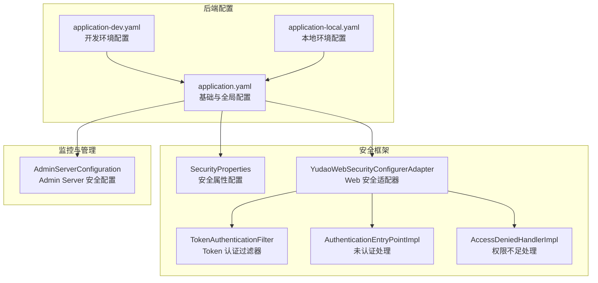
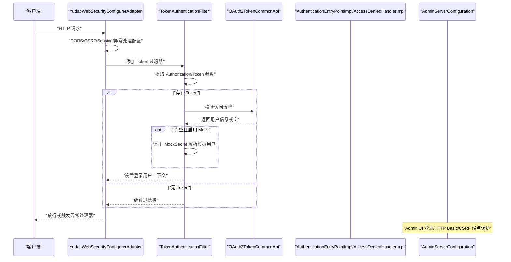
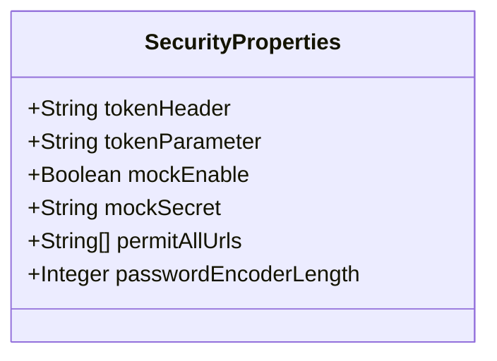
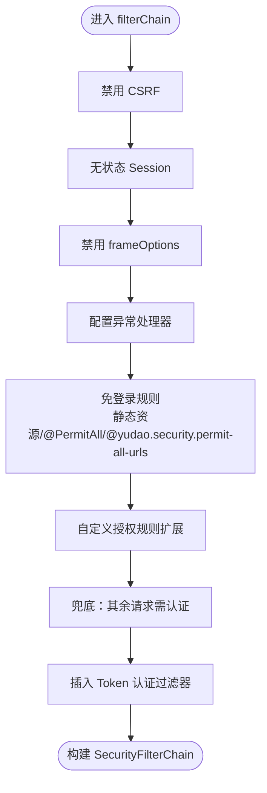
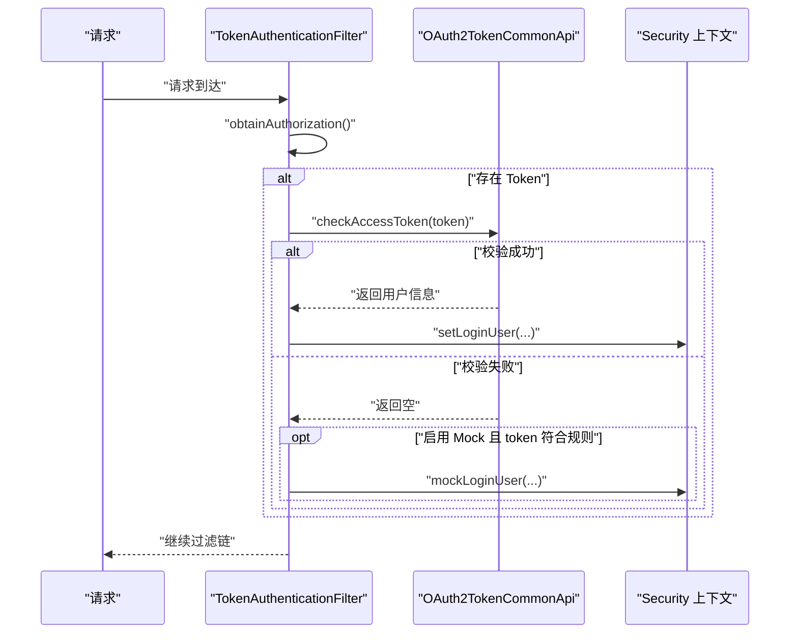
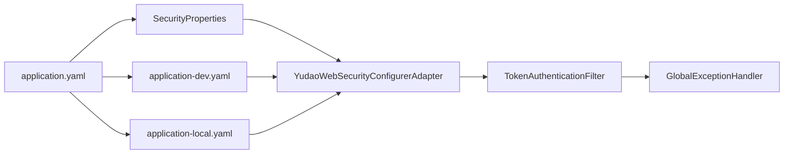

# 安全配置管理

<cite>
**本文引用的文件**
- [application.yaml](file://backend/yudao-server/src/main/resources/application.yaml)
- [application-dev.yaml](file://backend/yudao-server/src/main/resources/application-dev.yaml)
- [application-local.yaml](file://backend/yudao-server/src/main/resources/application-local.yaml)
- [SecurityProperties.java](file://backend/yudao-framework/yudao-spring-boot-starter-security/src/main/java/cn/iocoder/yudao/framework/security/config/SecurityProperties.java)
- [YudaoWebSecurityConfigurerAdapter.java](file://backend/yudao-framework/yudao-spring-boot-starter-security/src/main/java/cn/iocoder/yudao/framework/security/config/YudaoWebSecurityConfigurerAdapter.java)
- [TokenAuthenticationFilter.java](file://backend/yudao-framework/yudao-spring-boot-starter-security/src/main/java/cn/iocoder/yudao/framework/security/core/filter/TokenAuthenticationFilter.java)
- [AuthenticationEntryPointImpl.java](file://backend/yudao-framework/yudao-spring-boot-starter-security/src/main/java/cn/iocoder/yudao/framework/security/core/handler/AuthenticationEntryPointImpl.java)
- [AccessDeniedHandlerImpl.java](file://backend/yudao-framework/yudao-spring-boot-starter-security/src/main/java/cn/iocoder/yudao/framework/security/core/handler/AccessDeniedHandlerImpl.java)
- [AdminServerConfiguration.java](file://backend/yudao-module-infra/src/main/java/cn/iocoder/yudao/module/infra/framework/monitor/config/AdminServerConfiguration.java)
- [GlobalExceptionHandler.java](file://backend/yudao-framework/yudao-spring-boot-starter-web/src/main/java/cn/iocoder/yudao/framework/web/core/handler/GlobalExceptionHandler.java)
</cite>

## 目录
1. [简介](#简介)
2. [项目结构](#项目结构)
3. [核心组件](#核心组件)
4. [架构总览](#架构总览)
5. [详细组件分析](#详细组件分析)
6. [依赖分析](#依赖分析)
7. [性能考量](#性能考量)
8. [故障排查指南](#故障排查指南)
9. [结论](#结论)
10. [附录](#附录)

## 简介
本文件系统性阐述本项目的安全配置管理，涵盖安全属性配置、认证配置、授权配置、加载顺序与优先级、环境变量覆盖机制、不同环境下的安全策略差异、热更新与验证、版本兼容与迁移、最佳实践与常见错误、自动化部署与合规检查等。目标是帮助开发者与运维人员在不同环境中正确、安全、稳定地配置与维护系统安全。

## 项目结构
本项目采用前后端分离与模块化设计，安全配置主要集中在后端 Spring Boot 配置与安全框架模块中：
- 后端配置文件位于 yudao-server 的 resources 目录，按 profile 划分 application.yaml、application-dev.yaml、application-local.yaml。
- 安全框架位于 yudao-spring-boot-starter-security 模块，包含安全属性、Web 安全适配器、Token 认证过滤器以及异常处理。
- 监控与管理端（Admin Server）的安全配置位于 infra 模块的 AdminServerConfiguration。

**图表来源**
- [application.yaml:1-362](file://backend/yudao-server/src/main/resources/application.yaml#L1-L362)
- [application-dev.yaml:1-213](file://backend/yudao-server/src/main/resources/application-dev.yaml#L1-L213)
- [application-local.yaml:1-294](file://backend/yudao-server/src/main/resources/application-local.yaml#L1-L294)
- [SecurityProperties.java:1-52](file://backend/yudao-framework/yudao-spring-boot-starter-security/src/main/java/cn/iocoder/yudao/framework/security/config/SecurityProperties.java#L1-L52)
- [YudaoWebSecurityConfigurerAdapter.java:1-222](file://backend/yudao-framework/yudao-spring-boot-starter-security/src/main/java/cn/iocoder/yudao/framework/security/config/YudaoWebSecurityConfigurerAdapter.java#L1-L222)
- [TokenAuthenticationFilter.java:1-120](file://backend/yudao-framework/yudao-spring-boot-starter-security/src/main/java/cn/iocoder/yudao/framework/security/core/filter/TokenAuthenticationFilter.java#L1-L120)
- [AuthenticationEntryPointImpl.java:1-35](file://backend/yudao-framework/yudao-spring-boot-starter-security/src/main/java/cn/iocoder/yudao/framework/security/core/handler/AuthenticationEntryPointImpl.java#L1-L35)
- [AccessDeniedHandlerImpl.java:1-28](file://backend/yudao-framework/yudao-spring-boot-starter-security/src/main/java/cn/iocoder/yudao/framework/security/core/handler/AccessDeniedHandlerImpl.java#L1-L28)
- [AdminServerConfiguration.java:80-107](file://backend/yudao-module-infra/src/main/java/cn/iocoder/yudao/module/infra/framework/monitor/config/AdminServerConfiguration.java#L80-L107)

**章节来源**
- [application.yaml:1-362](file://backend/yudao-server/src/main/resources/application.yaml#L1-L362)
- [application-dev.yaml:1-213](file://backend/yudao-server/src/main/resources/application-dev.yaml#L1-L213)
- [application-local.yaml:1-294](file://backend/yudao-server/src/main/resources/application-local.yaml#L1-L294)

## 核心组件
- 安全属性配置（SecurityProperties）：集中定义 Token 请求头/参数、Mock 模式开关与密钥、免登录 URL 列表、PasswordEncoder 复杂度等。
- Web 安全适配器（YudaoWebSecurityConfigurerAdapter）：统一配置 CORS、CSRF、Session 策略、异常处理、全局与注解驱动的免登录 URL、自定义授权规则、以及 Token 认证过滤器。
- Token 认证过滤器（TokenAuthenticationFilter）：从请求中提取 Token，校验有效性，构建登录用户上下文，支持 Mock 登录模式。
- 异常处理：AuthenticationEntryPointImpl 与 AccessDeniedHandlerImpl 统一返回未认证与权限不足的错误响应。
- 监控与管理端安全（AdminServerConfiguration）：Admin UI 登录、HTTP Basic、CSRF 与端点保护。

**章节来源**
- [SecurityProperties.java:1-52](file://backend/yudao-framework/yudao-spring-boot-starter-security/src/main/java/cn/iocoder/yudao/framework/security/config/SecurityProperties.java#L1-L52)
- [YudaoWebSecurityConfigurerAdapter.java:1-222](file://backend/yudao-framework/yudao-spring-boot-starter-security/src/main/java/cn/iocoder/yudao/framework/security/config/YudaoWebSecurityConfigurerAdapter.java#L1-L222)
- [TokenAuthenticationFilter.java:1-120](file://backend/yudao-framework/yudao-spring-boot-starter-security/src/main/java/cn/iocoder/yudao/framework/security/core/filter/TokenAuthenticationFilter.java#L1-L120)
- [AuthenticationEntryPointImpl.java:1-35](file://backend/yudao-framework/yudao-spring-boot-starter-security/src/main/java/cn/iocoder/yudao/framework/security/core/handler/AuthenticationEntryPointImpl.java#L1-L35)
- [AccessDeniedHandlerImpl.java:1-28](file://backend/yudao-framework/yudao-spring-boot-starter-security/src/main/java/cn/iocoder/yudao/framework/security/core/handler/AccessDeniedHandlerImpl.java#L1-L28)
- [AdminServerConfiguration.java:80-107](file://backend/yudao-module-infra/src/main/java/cn/iocoder/yudao/module/infra/framework/monitor/config/AdminServerConfiguration.java#L80-L107)

## 架构总览
下图展示安全配置在请求生命周期中的作用链路，从 Web 安全适配器到 Token 过滤器，再到异常处理与监控端点保护。

**图表来源**
- [YudaoWebSecurityConfigurerAdapter.java:110-153](file://backend/yudao-framework/yudao-spring-boot-starter-security/src/main/java/cn/iocoder/yudao/framework/security/config/YudaoWebSecurityConfigurerAdapter.java#L110-L153)
- [TokenAuthenticationFilter.java:42-69](file://backend/yudao-framework/yudao-spring-boot-starter-security/src/main/java/cn/iocoder/yudao/framework/security/core/filter/TokenAuthenticationFilter.java#L42-L69)
- [AuthenticationEntryPointImpl.java:28-35](file://backend/yudao-framework/yudao-spring-boot-starter-security/src/main/java/cn/iocoder/yudao/framework/security/core/handler/AuthenticationEntryPointImpl.java#L28-L35)
- [AccessDeniedHandlerImpl.java:20-28](file://backend/yudao-framework/yudao-spring-boot-starter-security/src/main/java/cn/iocoder/yudao/framework/security/core/handler/AccessDeniedHandlerImpl.java#L20-L28)
- [AdminServerConfiguration.java:80-107](file://backend/yudao-module-infra/src/main/java/cn/iocoder/yudao/module/infra/framework/monitor/config/AdminServerConfiguration.java#L80-L107)

## 详细组件分析

### 安全属性配置（SecurityProperties）
- Token 请求头与参数：定义从请求头与查询参数中提取访问令牌的键名，支持 WebSocket 等场景通过参数传递。
- Mock 模式：开发调试阶段可启用模拟登录，需配置密钥以确保安全性。
- 免登录 URL 列表：集中配置无需认证即可访问的接口路径。
- PasswordEncoder 复杂度：定义密码编码器的复杂度等级，影响性能与安全性平衡。

**图表来源**
- [SecurityProperties.java:12-51](file://backend/yudao-framework/yudao-spring-boot-starter-security/src/main/java/cn/iocoder/yudao/framework/security/config/SecurityProperties.java#L12-L51)

**章节来源**
- [SecurityProperties.java:1-52](file://backend/yudao-framework/yudao-spring-boot-starter-security/src/main/java/cn/iocoder/yudao/framework/security/config/SecurityProperties.java#L1-L52)

### Web 安全适配器（YudaoWebSecurityConfigurerAdapter）
- 全局策略：禁用 CSRF、无状态 Session、跨域支持、异常处理（未认证/权限不足）。
- 免登录规则：静态资源匿名访问；扫描 @PermitAll 注解的接口；合并 yudao.security.permit-all-urls 配置；异步请求免认证。
- 授权规则：支持自定义 AuthorizeRequestsCustomizer 扩展；最终兜底规则为“除上述外均需认证”。
- 过滤器链：在 UsernamePasswordAuthenticationFilter 之前插入 TokenAuthenticationFilter。

**图表来源**
- [YudaoWebSecurityConfigurerAdapter.java:110-153](file://backend/yudao-framework/yudao-spring-boot-starter-security/src/main/java/cn/iocoder/yudao/framework/security/config/YudaoWebSecurityConfigurerAdapter.java#L110-L153)

**章节来源**
- [YudaoWebSecurityConfigurerAdapter.java:1-222](file://backend/yudao-framework/yudao-spring-boot-starter-security/src/main/java/cn/iocoder/yudao/framework/security/config/YudaoWebSecurityConfigurerAdapter.java#L1-L222)

### Token 认证过滤器（TokenAuthenticationFilter）
- 提取 Token：优先从请求头 Authorization 获取，其次从 token 参数获取。
- 校验与构建用户：调用 OAuth2TokenCommonApi 校验令牌，成功则构建 LoginUser 并写入上下文；失败时根据是否为无需登录接口决定放行或异常。
- Mock 登录：当 security.mock-enable 为真且 token 以 security.mock-secret 开头时，解析用户编号并模拟登录，仅用于开发调试。

**图表来源**
- [TokenAuthenticationFilter.java:42-93](file://backend/yudao-framework/yudao-spring-boot-starter-security/src/main/java/cn/iocoder/yudao/framework/security/core/filter/TokenAuthenticationFilter.java#L42-L93)

**章节来源**
- [TokenAuthenticationFilter.java:1-120](file://backend/yudao-framework/yudao-spring-boot-starter-security/src/main/java/cn/iocoder/yudao/framework/security/core/filter/TokenAuthenticationFilter.java#L1-L120)

### 异常处理（AuthenticationEntryPointImpl / AccessDeniedHandlerImpl）
- 未认证处理：对需要认证但未登录的请求返回统一错误码与 JSON 响应，前端据此跳转登录页。
- 权限不足处理：对已登录但无权限的请求返回统一错误码与 JSON 响应。

**章节来源**
- [AuthenticationEntryPointImpl.java:1-35](file://backend/yudao-framework/yudao-spring-boot-starter-security/src/main/java/cn/iocoder/yudao/framework/security/core/handler/AuthenticationEntryPointImpl.java#L1-L35)
- [AccessDeniedHandlerImpl.java:1-28](file://backend/yudao-framework/yudao-spring-boot-starter-security/src/main/java/cn/iocoder/yudao/framework/security/core/handler/AccessDeniedHandlerImpl.java#L1-L28)

### 监控与管理端安全（AdminServerConfiguration）
- Admin UI 登录：配置登录页面与成功处理器，允许免认证访问。
- HTTP Basic：用于 Admin Client 注册场景。
- CSRF：对特定端点（如实例注册与 actuator）忽略 CSRF。
- 端点保护：Actuator 端点开放范围由 management.endpoints.web.exposure.include 控制。

**章节来源**
- [AdminServerConfiguration.java:80-107](file://backend/yudao-module-infra/src/main/java/cn/iocoder/yudao/module/infra/framework/monitor/config/AdminServerConfiguration.java#L80-L107)

## 依赖分析
- 配置文件依赖：application.yaml 为主配置，application-dev.yaml 与 application-local.yaml 通过 Spring Profile 覆盖主配置中的环境相关项（如端口、数据库、消息队列、监控、微信配置等）。
- 安全模块依赖：SecurityProperties 与 YudaoWebSecurityConfigurerAdapter 为安全配置的核心，TokenAuthenticationFilter 依赖 OAuth2TokenCommonApi 与 WebFrameworkUtils。
- 异常处理依赖：GlobalExceptionHandler 作为全局异常处理入口，被 TokenAuthenticationFilter 在异常时调用以输出统一错误响应。

**图表来源**
- [application.yaml:1-362](file://backend/yudao-server/src/main/resources/application.yaml#L1-L362)
- [application-dev.yaml:1-213](file://backend/yudao-server/src/main/resources/application-dev.yaml#L1-L213)
- [application-local.yaml:1-294](file://backend/yudao-server/src/main/resources/application-local.yaml#L1-L294)
- [SecurityProperties.java:1-52](file://backend/yudao-framework/yudao-spring-boot-starter-security/src/main/java/cn/iocoder/yudao/framework/security/config/SecurityProperties.java#L1-L52)
- [YudaoWebSecurityConfigurerAdapter.java:1-222](file://backend/yudao-framework/yudao-spring-boot-starter-security/src/main/java/cn/iocoder/yudao/framework/security/config/YudaoWebSecurityConfigurerAdapter.java#L1-L222)
- [TokenAuthenticationFilter.java:1-120](file://backend/yudao-framework/yudao-spring-boot-starter-security/src/main/java/cn/iocoder/yudao/framework/security/core/filter/TokenAuthenticationFilter.java#L1-L120)
- [GlobalExceptionHandler.java:1-25](file://backend/yudao-framework/yudao-spring-boot-starter-web/src/main/java/cn/iocoder/yudao/framework/web/core/handler/GlobalExceptionHandler.java#L1-L25)

**章节来源**
- [application.yaml:1-362](file://backend/yudao-server/src/main/resources/application.yaml#L1-L362)
- [application-dev.yaml:1-213](file://backend/yudao-server/src/main/resources/application-dev.yaml#L1-L213)
- [application-local.yaml:1-294](file://backend/yudao-server/src/main/resources/application-local.yaml#L1-L294)

## 性能考量
- 无状态 Session：禁用 Session 降低服务器状态存储开销，提升横向扩展能力。
- 密码编码复杂度：passwordEncoderLength 影响认证性能与安全性，需在开发与生产环境权衡配置。
- Mock 模式：仅在开发环境启用，避免在生产环境引入不必要的安全风险与性能损耗。
- 过滤器链：TokenAuthenticationFilter 仅在存在 Token 或启用 Mock 时进行额外处理，正常路径保持轻量。

[本节为通用指导，无需具体文件分析]

## 故障排查指南
- 未认证/权限不足
  - 现象：返回统一错误码与 JSON 响应。
  - 排查：确认请求是否命中免登录规则；检查 yudao.security.permit-all-urls 与 @PermitAll 注解；核对用户类型与租户上下文。
- Token 校验失败
  - 现象：Mock 模式下若 token 不符合规则将被拒绝；OAuth2 校验失败时返回空，按无需登录接口放行。
  - 排查：确认 tokenHeader/tokenParameter 配置；核对 security.mock-enable 与 security.mock-secret；检查 OAuth2TokenCommonApi 返回。
- Admin 端点访问异常
  - 现象：Admin UI 登录或 actuator 端点访问受限。
  - 排查：确认 AdminServerConfiguration 的 formLogin、httpBasic、CSRF 配置；检查 management.endpoints.web.exposure.include。

**章节来源**
- [AuthenticationEntryPointImpl.java:28-35](file://backend/yudao-framework/yudao-spring-boot-starter-security/src/main/java/cn/iocoder/yudao/framework/security/core/handler/AuthenticationEntryPointImpl.java#L28-L35)
- [AccessDeniedHandlerImpl.java:20-28](file://backend/yudao-framework/yudao-spring-boot-starter-security/src/main/java/cn/iocoder/yudao/framework/security/core/handler/AccessDeniedHandlerImpl.java#L20-L28)
- [TokenAuthenticationFilter.java:71-93](file://backend/yudao-framework/yudao-spring-boot-starter-security/src/main/java/cn/iocoder/yudao/framework/security/core/filter/TokenAuthenticationFilter.java#L71-L93)
- [AdminServerConfiguration.java:80-107](file://backend/yudao-module-infra/src/main/java/cn/iocoder/yudao/module/infra/framework/monitor/config/AdminServerConfiguration.java#L80-L107)

## 结论
本项目通过集中化的安全属性配置、可扩展的 Web 安全适配器与轻量的 Token 认证过滤器，实现了灵活、可维护、可扩展的安全体系。结合不同环境的配置文件与严格的异常处理机制，能够在开发、测试与生产环境中提供一致的安全保障。建议在生产环境严格关闭 Mock 模式，合理设置免登录列表与权限规则，并定期审查与审计安全配置。

[本节为总结，无需具体文件分析]

## 附录

### 安全配置加载顺序与优先级
- 配置文件加载顺序（从低优先级到高优先级）：
  1) application.yaml（主配置）
  2) application-{profile}.yaml（按激活的 profile 覆盖）
  3) 本地/环境变量覆盖（如 server.port、数据库连接、管理端口等）
- 优先级规则：
  - 同一层级后加载的配置覆盖先前的同名键值。
  - 环境变量与命令行参数进一步覆盖配置文件。
- 环境变量覆盖示例（来源于配置文件中的占位符与端口设置）：
  - server.port、spring.datasource.*、spring.redis.*、management.endpoints.web.exposure.include 等。

**章节来源**
- [application.yaml:1-362](file://backend/yudao-server/src/main/resources/application.yaml#L1-L362)
- [application-dev.yaml:1-213](file://backend/yudao-server/src/main/resources/application-dev.yaml#L1-L213)
- [application-local.yaml:1-294](file://backend/yudao-server/src/main/resources/application-local.yaml#L1-L294)

### 不同环境下的安全策略差异
- 开发环境（application-dev.yaml）
  - 开启 Druid 监控与慢 SQL 记录，便于开发调试。
  - Quartz 使用 JDBC 存储，支持集群配置。
  - Actuator 端点开放范围扩大，便于监控。
  - 微信公众号/小程序配置指向测试号，便于联调。
- 本地环境（application-local.yaml）
  - 默认禁用 Quartz 自动配置，减少本地启动负载。
  - 关闭验证码，提高开发效率。
  - Admin 端点开放范围与日志级别按需调整。
- 生产环境（建议遵循）
  - 关闭 Mock 模式与调试端点。
  - 严格限制 Actuator 端点暴露范围。
  - 启用 HTTPS、强密码策略与最小权限原则。

**章节来源**
- [application-dev.yaml:1-213](file://backend/yudao-server/src/main/resources/application-dev.yaml#L1-L213)
- [application-local.yaml:1-294](file://backend/yudao-server/src/main/resources/application-local.yaml#L1-L294)

### 安全配置验证与错误处理
- 配置验证：SecurityProperties 使用注解约束必填字段，启动时进行参数校验。
- 运行时验证：TokenAuthenticationFilter 在异常时委托 GlobalExceptionHandler 输出统一错误响应。
- 异常处理：AuthenticationEntryPointImpl 与 AccessDeniedHandlerImpl 统一返回错误码，前端据此处理登录与权限提示。

**章节来源**
- [SecurityProperties.java:12-51](file://backend/yudao-framework/yudao-spring-boot-starter-security/src/main/java/cn/iocoder/yudao/framework/security/config/SecurityProperties.java#L12-L51)
- [TokenAuthenticationFilter.java:60-64](file://backend/yudao-framework/yudao-spring-boot-starter-security/src/main/java/cn/iocoder/yudao/framework/security/core/filter/TokenAuthenticationFilter.java#L60-L64)
- [GlobalExceptionHandler.java:1-25](file://backend/yudao-framework/yudao-spring-boot-starter-web/src/main/java/cn/iocoder/yudao/framework/web/core/handler/GlobalExceptionHandler.java#L1-L25)

### 热更新机制与版本兼容
- 热更新：Spring Boot 通过配置文件与环境变量动态生效；安全策略（如免登录 URL、Mock 模式）可在不重启服务的情况下通过配置变更生效。
- 版本兼容：SecurityProperties 的字段变更需向后兼容，新增字段建议提供默认值；升级时建议先在测试环境验证，再灰度发布。

[本节为通用指导，无需具体文件分析]

### 最佳实践清单
- 严格区分环境配置，生产环境关闭 Mock 与调试端点。
- 最小权限原则：仅在必要时将接口标记为免登录。
- 强密码策略：合理设置 passwordEncoderLength。
- 定期审计：审查 yudao.security.permit-all-urls 与 Actuator 暴露范围。
- 安全加固：启用 HTTPS、限制来源、定期轮换密钥与令牌。

[本节为通用指导，无需具体文件分析]

### 自动化部署与合规检查
- 自动化部署：通过 CI/CD 在构建阶段注入环境变量与配置文件，确保生产环境配置正确。
- 合规检查：定期扫描配置文件中的敏感信息（如密钥、密码），使用静态分析工具检查安全配置合理性。

[本节为通用指导，无需具体文件分析]