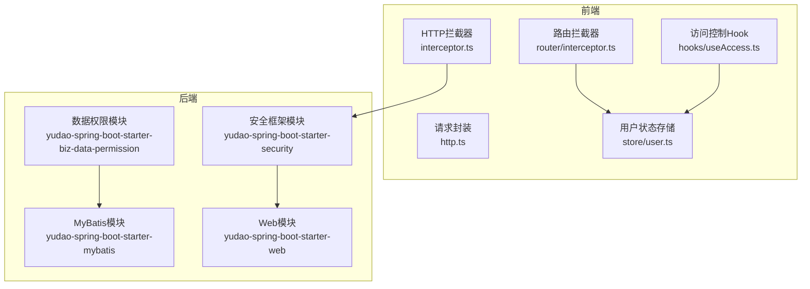
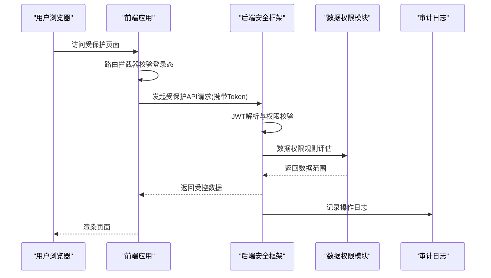
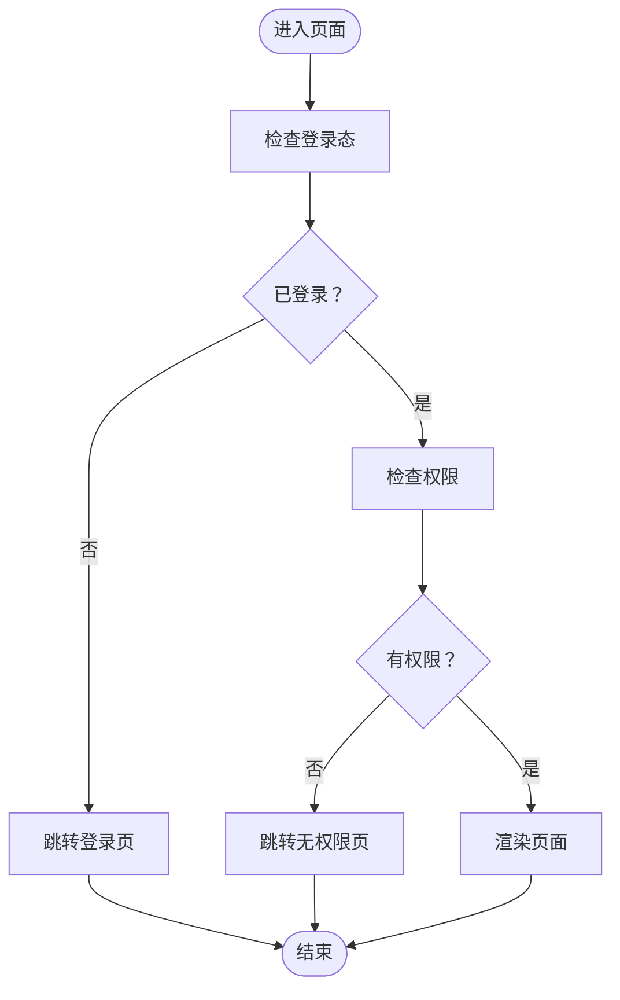
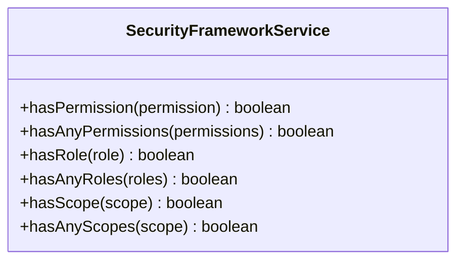
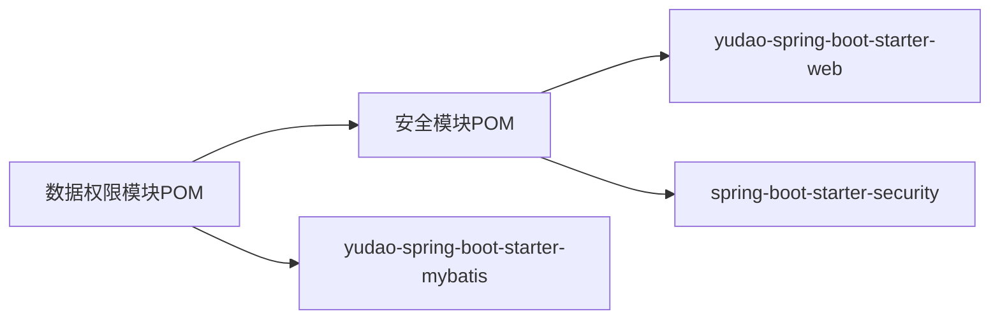

# 数据安全

<cite>
**本文引用的文件**
- [后端总览](file://backend/README.md)
- [项目根POM](file://pom.xml)
- [安全模块POM](file://backend/yudao-framework/yudao-spring-boot-starter-security/pom.xml)
- [安全服务接口](file://backend/yudao-framework/yudao-spring-boot-starter-security/src/main/java/cn/iocoder/yudao/framework/security/core/service/SecurityFrameworkService.java)
- [数据权限模块POM](file://backend/yudao-framework/yudao-spring-boot-starter-biz-data-permission/pom.xml)
- [前端HTTP拦截器](file://frontend/admin-uniapp/src/http/interceptor.ts)
- [前端请求封装](file://frontend/admin-uniapp/src/http/http.ts)
- [前端路由拦截器](file://frontend/admin-uniapp/src/router/interceptor.ts)
- [前端用户状态存储](file://frontend/admin-uniapp/src/store/user.ts)
- [前端访问控制Hook](file://frontend/admin-uniapp/src/hooks/useAccess.ts)
- [前端类型定义](file://frontend/admin-uniapp/src/types/index.ts)
- [系统模块-用户页面](file://frontend/admin-uniapp/src/pages-system/user/)
- [系统模块-登录日志](file://frontend/admin-uniapp/src/pages-system/login-log/)
- [系统模块-操作日志](file://frontend/admin-uniapp/src/pages-system/operate-log/)
- [基础设施模块-API访问日志](file://frontend/admin-uniapp/src/pages-infra/api-access-log/)
- [基础设施模块-API错误日志](file://frontend/admin-uniapp/src/pages-infra/api-error-log/)
- [系统模块-菜单](file://frontend/admin-uniapp/src/pages-system/menu/)
- [系统模块-角色](file://frontend/admin-uniapp/src/pages-system/role/)
- [系统模块-部门](file://frontend/admin-uniapp/src/pages-system/dept/)
- [系统模块-区域](file://frontend/admin-uniapp/src/pages-system/area/)
- [系统模块-字典](file://frontend/admin-uniapp/src/pages-system/dict/)
- [系统模块-通知公告](file://frontend/admin-uniapp/src/pages-system/notice/)
- [系统模块-租户](file://frontend/admin-uniapp/src/pages-system/tenant/)
- [系统模块-短信](file://frontend/admin-uniapp/src/pages-system/sms/)
- [系统模块-邮件](file://frontend/admin-uniapp/src/pages-system/mail/)
- [系统模块-社交](file://frontend/admin-uniapp/src/pages-system/social/)
- [系统模块-OAuth2](file://frontend/admin-uniapp/src/pages-system/oauth2/)
- [系统模块-岗位](file://frontend/admin-uniapp/src/pages-system/post/)
- [系统模块-数据源配置](file://frontend/admin-uniapp/src/pages-infra/data-source-config/)
- [系统模块-定时任务](file://frontend/admin-uniapp/src/pages-infra/job/)
- [系统模块-文件](file://frontend/admin-uniapp/src/pages-infra/file/)
- [系统模块-WebSocket](file://frontend/admin-uniapp/src/pages-infra/web-socket/)
- [系统模块-配置](file://frontend/admin-uniapp/src/pages-infra/config/)
- [系统模块-IP地址解析](file://frontend/admin-uniapp/src/pages-infra/ip/)
- [系统模块-字典标签组件](file://frontend/admin-uniapp/src/components/dict-tag/)
- [系统模块-系统选择组件](file://frontend/admin-uniapp/src/components/system-select/)
- [系统模块-通用工具集](file://frontend/admin-uniapp/src/utils/)
- [系统模块-通用指令集](file://frontend/admin-uniapp/src/directives/)
- [系统模块-通用插件集](file://frontend/admin-uniapp/src/plugins/)
- [系统模块-通用布局](file://frontend/admin-uniapp/src/layouts/default.vue)
- [系统模块-首页](file://frontend/admin-uniapp/src/pages/index/)
- [系统模块-联系人](file://frontend/admin-uniapp/src/pages/contact/)
- [系统模块-消息](file://frontend/admin-uniapp/src/pages/message/)
- [系统模块-核心页面-认证](file://frontend/admin-uniapp/src/pages-core/auth/)
- [系统模块-核心页面-错误](file://frontend/admin-uniapp/src/pages-core/error/)
- [系统模块-核心页面-用户](file://frontend/admin-uniapp/src/pages-core/user/)
- [系统模块-业务流程-分类](file://frontend/admin-uniapp/src/pages-bpm/category/)
- [系统模块-业务流程-请假](file://frontend/admin-uniapp/src/pages-bpm/oa/leave/)
- [系统模块-业务流程-表达式](file://frontend/admin-uniapp/src/pages-bpm/process-expression/)
- [系统模块-业务流程-监听器](file://frontend/admin-uniapp/src/pages-bpm/process-listener/)
- [系统模块-业务流程-流程实例](file://frontend/admin-uniapp/src/pages-bpm/processInstance/)
- [系统模块-业务流程-任务管理](file://frontend/admin-uniapp/src/pages-bpm/task/manager/)
- [系统模块-业务流程-用户组](file://frontend/admin-uniapp/src/pages-bpm/user-group/)
- [系统模块-业务流程-工具](file://frontend/admin-uniapp/src/pages-bpm/utils/)
- [系统模块-业务流程-工作流](file://frontend/admin-uniapp/src/pages-bpm/)
- [系统模块-业务流程-通用工具](file://frontend/admin-uniapp/src/pages-bpm/utils/)
- [系统模块-业务流程-通用页面](file://frontend/admin-uniapp/src/pages-bpm/)
- [系统模块-业务流程-通用布局](file://frontend/admin-uniapp/src/layouts/default.vue)
- [系统模块-业务流程-通用指令](file://frontend/admin-uniapp/src/directives/)
- [系统模块-业务流程-通用插件](file://frontend/admin-uniapp/src/plugins/)
- [系统模块-业务流程-通用组件](file://frontend/admin-uniapp/src/components/)

</cite>

## 目录
1. [简介](#简介)
2. [项目结构](#项目结构)
3. [核心组件](#核心组件)
4. [架构总览](#架构总览)
5. [详细组件分析](#详细组件分析)
6. [依赖分析](#依赖分析)
7. [性能考虑](#性能考虑)
8. [故障排查指南](#故障排查指南)
9. [结论](#结论)
10. [附录](#附录)

## 简介
本文件面向AgenticCPS项目的“数据安全”主题，围绕敏感数据保护、API接口安全、传输加密、数据脱敏、加密算法与密钥管理、哈希与数字签名、数据库连接安全与SQL注入防护、XSS与CSRF防护、数据访问控制与权限验证、审计日志与异常处理、GDPR合规、备份与灾难恢复、安全监控与告警等维度进行系统化梳理。由于仓库中安全相关实现以框架化组件为主，本文在不展示具体代码的前提下，通过文件路径与模块职责，给出可落地的安全实践建议与最佳实践。

## 项目结构
AgenticCPS采用前后端分离架构，后端基于Spring Boot生态，前端采用Vue/UniApp技术栈。安全能力主要由后端框架模块提供，前端负责请求拦截、路由守卫与用户态管理。

图表来源
- [安全模块POM:1-65](file://backend/yudao-framework/yudao-spring-boot-starter-security/pom.xml#L1-L65)
- [数据权限模块POM:1-46](file://backend/yudao-framework/yudao-spring-boot-starter-biz-data-permission/pom.xml#L1-L46)
- [前端HTTP拦截器](file://frontend/admin-uniapp/src/http/interceptor.ts)
- [前端路由拦截器](file://frontend/admin-uniapp/src/router/interceptor.ts)
- [前端用户状态存储](file://frontend/admin-uniapp/src/store/user.ts)
- [前端访问控制Hook](file://frontend/admin-uniapp/src/hooks/useAccess.ts)

章节来源
- [后端总览](file://backend/README.md)
- [项目根POM](file://pom.xml)

## 核心组件
- 安全框架服务接口：定义权限校验能力（hasPermission、hasAnyPermissions、hasRole、hasAnyRoles、hasScope、hasAnyScopes），为后端统一鉴权提供契约。
- 数据权限模块：与安全框架联动，实现基于角色/组织/部门的数据访问边界控制。
- 前端HTTP拦截器与路由拦截器：统一处理Token注入、跨域、CSRF、XSS防护前置检查与重定向逻辑。
- 前端用户态与访问控制：集中管理登录态、角色/权限集合，驱动UI与功能的可见性与可用性。

章节来源
- [安全服务接口:1-60](file://backend/yudao-framework/yudao-spring-boot-starter-security/src/main/java/cn/iocoder/yudao/framework/security/core/service/SecurityFrameworkService.java#L1-L60)
- [安全模块POM:1-65](file://backend/yudao-framework/yudao-spring-boot-starter-security/pom.xml#L1-L65)
- [数据权限模块POM:1-46](file://backend/yudao-framework/yudao-spring-boot-starter-biz-data-permission/pom.xml#L1-L46)
- [前端HTTP拦截器](file://frontend/admin-uniapp/src/http/interceptor.ts)
- [前端路由拦截器](file://frontend/admin-uniapp/src/router/interceptor.ts)
- [前端用户状态存储](file://frontend/admin-uniapp/src/store/user.ts)
- [前端访问控制Hook](file://frontend/admin-uniapp/src/hooks/useAccess.ts)

## 架构总览
下图展示了从前端到后端的关键安全交互路径，包括认证、授权、日志与异常处理。

图表来源
- [安全服务接口:1-60](file://backend/yudao-framework/yudao-spring-boot-starter-security/src/main/java/cn/iocoder/yudao/framework/security/core/service/SecurityFrameworkService.java#L1-L60)
- [数据权限模块POM:1-46](file://backend/yudao-framework/yudao-spring-boot-starter-biz-data-permission/pom.xml#L1-L46)
- [前端路由拦截器](file://frontend/admin-uniapp/src/router/interceptor.ts)
- [前端HTTP拦截器](file://frontend/admin-uniapp/src/http/interceptor.ts)

## 详细组件分析

### 前端安全组件
- HTTP拦截器：统一注入Authorization头、处理401/403重定向、CSRF令牌注入、响应错误处理。
- 路由拦截器：在进入受保护页面前检查登录态与权限，未满足则跳转至登录或无权限页。
- 用户状态存储：集中保存用户信息、角色/权限列表、Token，供全局使用。
- 访问控制Hook：根据用户权限动态控制UI元素与按钮显示。

图表来源
- [前端路由拦截器](file://frontend/admin-uniapp/src/router/interceptor.ts)
- [前端用户状态存储](file://frontend/admin-uniapp/src/store/user.ts)
- [前端访问控制Hook](file://frontend/admin-uniapp/src/hooks/useAccess.ts)

章节来源
- [前端HTTP拦截器](file://frontend/admin-uniapp/src/http/interceptor.ts)
- [前端路由拦截器](file://frontend/admin-uniapp/src/router/interceptor.ts)
- [前端用户状态存储](file://frontend/admin-uniapp/src/store/user.ts)
- [前端访问控制Hook](file://frontend/admin-uniapp/src/hooks/useAccess.ts)

### 后端安全组件
- 安全框架服务接口：定义统一的权限/角色/授权范围校验方法，便于在控制器层快速调用。
- 数据权限模块：与安全框架配合，实现按角色/部门/组织的数据访问边界，避免越权查询。

图表来源
- [安全服务接口:1-60](file://backend/yudao-framework/yudao-spring-boot-starter-security/src/main/java/cn/iocoder/yudao/framework/security/core/service/SecurityFrameworkService.java#L1-L60)

章节来源
- [安全服务接口:1-60](file://backend/yudao-framework/yudao-spring-boot-starter-security/src/main/java/cn/iocoder/yudao/framework/security/core/service/SecurityFrameworkService.java#L1-L60)
- [安全模块POM:1-65](file://backend/yudao-framework/yudao-spring-boot-starter-security/pom.xml#L1-L65)
- [数据权限模块POM:1-46](file://backend/yudao-framework/yudao-spring-boot-starter-biz-data-permission/pom.xml#L1-L46)

### 审计日志与异常处理
- 登录日志、操作日志、API访问日志、API错误日志等页面用于查看系统行为轨迹，支撑安全审计与问题定位。
- 建议后端在安全框架中集成统一异常处理与审计埋点，确保所有受保护操作均被记录。

章节来源
- [系统模块-登录日志](file://frontend/admin-uniapp/src/pages-system/login-log/)
- [系统模块-操作日志](file://frontend/admin-uniapp/src/pages-system/operate-log/)
- [基础设施模块-API访问日志](file://frontend/admin-uniapp/src/pages-infra/api-access-log/)
- [基础设施模块-API错误日志](file://frontend/admin-uniapp/src/pages-infra/api-error-log/)

### 数据库连接安全与SQL注入防护
- 使用ORM/MyBatis映射层，避免原生SQL拼接；参数化查询与白名单校验相结合。
- 数据权限模块与安全框架联动，确保查询结果落在用户授权范围内。

章节来源
- [数据权限模块POM:1-46](file://backend/yudao-framework/yudao-spring-boot-starter-biz-data-permission/pom.xml#L1-L46)
- [安全模块POM:1-65](file://backend/yudao-framework/yudao-spring-boot-starter-security/pom.xml#L1-L65)

### XSS与CSRF防护
- 前端层面：统一HTML输出过滤、表单提交时注入CSRF令牌、严格Content-Security-Policy。
- 后端层面：启用Spring Security默认防护（如CSRF、X-XSS-Protection、X-Frame-Options等），结合白名单与输入校验。

章节来源
- [前端HTTP拦截器](file://frontend/admin-uniapp/src/http/interceptor.ts)
- [安全模块POM:1-65](file://backend/yudao-framework/yudao-spring-boot-starter-security/pom.xml#L1-L65)

### 传输加密与API接口安全
- 强制HTTPS/TLS，证书自动续期与过期告警。
- API接口采用统一鉴权（如JWT）与限流/熔断，防止暴力破解与滥用。

章节来源
- [安全模块POM:1-65](file://backend/yudao-framework/yudao-spring-boot-starter-security/pom.xml#L1-L65)

### 数据脱敏策略
- 对敏感字段（如手机号、身份证号、银行卡号）在返回前端前进行脱敏处理（保留前缀/后缀或中间部分遮挡）。
- 在日志与导出场景中，确保脱敏规则一致且不可逆。

章节来源
- [系统模块-用户页面](file://frontend/admin-uniapp/src/pages-system/user/)
- [系统模块-短信](file://frontend/admin-uniapp/src/pages-system/sms/)
- [系统模块-邮件](file://frontend/admin-uniapp/src/pages-system/mail/)
- [系统模块-社交](file://frontend/admin-uniapp/src/pages-system/social/)

### 加密算法选择、密钥管理、哈希与数字签名
- 对称加密：用于会话数据与非核心敏感字段；密钥轮换与安全存储。
- 非对称加密：用于密钥交换与数字签名；私钥仅在可信环境中使用。
- 哈希：密码使用强哈希（如Argon2/BCrypt）并加盐；文件指纹与完整性校验。
- 数字签名：对重要配置与日志进行签名，保障不可抵赖性。

章节来源
- [系统模块-配置](file://frontend/admin-uniapp/src/pages-infra/config/)
- [系统模块-数据源配置](file://frontend/admin-uniapp/src/pages-infra/data-source-config/)

### 数据访问控制与权限验证
- 基于角色/资源的权限模型（RBAC），结合数据权限规则限制数据边界。
- 前端通过Hook与Store控制UI可用性，后端在控制器与数据层双重校验。

章节来源
- [安全服务接口:1-60](file://backend/yudao-framework/yudao-spring-boot-starter-security/src/main/java/cn/iocoder/yudao/framework/security/core/service/SecurityFrameworkService.java#L1-L60)
- [数据权限模块POM:1-46](file://backend/yudao-framework/yudao-spring-boot-starter-biz-data-permission/pom.xml#L1-L46)
- [前端访问控制Hook](file://frontend/admin-uniapp/src/hooks/useAccess.ts)
- [前端用户状态存储](file://frontend/admin-uniapp/src/store/user.ts)

### 异常处理机制
- 统一异常处理器捕获后端异常，返回标准化错误码与提示。
- 前端拦截器处理网络异常与鉴权失败，引导用户重新登录或提示权限不足。

章节来源
- [基础设施模块-API错误日志](file://frontend/admin-uniapp/src/pages-infra/api-error-log/)
- [前端HTTP拦截器](file://frontend/admin-uniapp/src/http/interceptor.ts)

### GDPR合规性要求
- 明确数据处理目的与合法性依据；提供数据访问、更正、删除与可携带权入口。
- 对个人数据进行最小化收集与生命周期管理；建立数据主体权利响应流程。

章节来源
- [系统模块-用户页面](file://frontend/admin-uniapp/src/pages-system/user/)
- [系统模块-字典](file://frontend/admin-uniapp/src/pages-system/dict/)
- [系统模块-通知公告](file://frontend/admin-uniapp/src/pages-system/notice/)

### 备份恢复与灾难恢复
- 数据库定期全量/增量备份，异地容灾；自动化恢复演练与RPO/RTO指标监控。
- 日志与配置的版本化管理与快照回滚能力。

章节来源
- [系统模块-定时任务](file://frontend/admin-uniapp/src/pages-infra/job/)
- [系统模块-文件](file://frontend/admin-uniapp/src/pages-infra/file/)

### 安全监控与告警
- 建立API访问量与错误率阈值告警；登录失败与异常操作实时告警。
- 结合审计日志与入侵检测系统（IDS）联动处置。

章节来源
- [基础设施模块-API访问日志](file://frontend/admin-uniapp/src/pages-infra/api-access-log/)
- [系统模块-登录日志](file://frontend/admin-uniapp/src/pages-system/login-log/)

## 依赖分析
后端安全能力依赖于Web与安全框架模块，数据权限模块进一步依赖MyBatis与安全框架。

图表来源
- [安全模块POM:1-65](file://backend/yudao-framework/yudao-spring-boot-starter-security/pom.xml#L1-L65)
- [数据权限模块POM:1-46](file://backend/yudao-framework/yudao-spring-boot-starter-biz-data-permission/pom.xml#L1-L46)

章节来源
- [安全模块POM:1-65](file://backend/yudao-framework/yudao-spring-boot-starter-security/pom.xml#L1-L65)
- [数据权限模块POM:1-46](file://backend/yudao-framework/yudao-spring-boot-starter-biz-data-permission/pom.xml#L1-L46)

## 性能考虑
- 前端：路由与HTTP拦截器应尽量轻量化，避免阻塞主渲染；权限判断采用缓存与懒加载。
- 后端：鉴权与日志写入应异步化与批量化；数据库查询使用索引与分页，避免N+1与全表扫描。

## 故障排查指南
- 登录失败/权限不足：检查前端路由拦截器是否正确重定向；后端安全框架是否正确解析Token与权限。
- API异常：查看API错误日志页面与后端异常处理返回码；确认CSRF与跨域配置。
- 数据越权：核对数据权限规则与用户角色/部门绑定；检查查询SQL是否附加数据范围条件。

章节来源
- [前端路由拦截器](file://frontend/admin-uniapp/src/router/interceptor.ts)
- [前端HTTP拦截器](file://frontend/admin-uniapp/src/http/interceptor.ts)
- [基础设施模块-API错误日志](file://frontend/admin-uniapp/src/pages-infra/api-error-log/)
- [安全服务接口:1-60](file://backend/yudao-framework/yudao-spring-boot-starter-security/src/main/java/cn/iocoder/yudao/framework/security/core/service/SecurityFrameworkService.java#L1-L60)

## 结论
AgenticCPS在安全方面具备清晰的前后端分工：前端负责访问控制与请求治理，后端通过安全框架与数据权限模块实现统一鉴权与数据边界控制。建议在此基础上完善传输加密、密钥管理、哈希与签名、脱敏策略、GDPR合规、备份与监控告警等细节，形成闭环的安全体系。

## 附录
- 前端常用页面与组件：用户、菜单、角色、部门、区域、字典、通知公告、租户、短信、邮件、社交、OAuth2、岗位、数据源配置、定时任务、文件、WebSocket、配置、IP解析、字典标签组件、系统选择组件、通用工具集、通用指令集、通用插件集、通用布局、首页、联系人、消息、核心页面（认证/错误/用户）、业务流程（分类/请假/表达式/监听器/流程实例/任务管理/用户组/工具）等。

章节来源
- [系统模块-用户页面](file://frontend/admin-uniapp/src/pages-system/user/)
- [系统模块-菜单](file://frontend/admin-uniapp/src/pages-system/menu/)
- [系统模块-角色](file://frontend/admin-uniapp/src/pages-system/role/)
- [系统模块-部门](file://frontend/admin-uniapp/src/pages-system/dept/)
- [系统模块-区域](file://frontend/admin-uniapp/src/pages-system/area/)
- [系统模块-字典](file://frontend/admin-uniapp/src/pages-system/dict/)
- [系统模块-通知公告](file://frontend/admin-uniapp/src/pages-system/notice/)
- [系统模块-租户](file://frontend/admin-uniapp/src/pages-system/tenant/)
- [系统模块-短信](file://frontend/admin-uniapp/src/pages-system/sms/)
- [系统模块-邮件](file://frontend/admin-uniapp/src/pages-system/mail/)
- [系统模块-社交](file://frontend/admin-uniapp/src/pages-system/social/)
- [系统模块-OAuth2](file://frontend/admin-uniapp/src/pages-system/oauth2/)
- [系统模块-岗位](file://frontend/admin-uniapp/src/pages-system/post/)
- [系统模块-数据源配置](file://frontend/admin-uniapp/src/pages-infra/data-source-config/)
- [系统模块-定时任务](file://frontend/admin-uniapp/src/pages-infra/job/)
- [系统模块-文件](file://frontend/admin-uniapp/src/pages-infra/file/)
- [系统模块-WebSocket](file://frontend/admin-uniapp/src/pages-infra/web-socket/)
- [系统模块-配置](file://frontend/admin-uniapp/src/pages-infra/config/)
- [系统模块-IP地址解析](file://frontend/admin-uniapp/src/pages-infra/ip/)
- [系统模块-字典标签组件](file://frontend/admin-uniapp/src/components/dict-tag/)
- [系统模块-系统选择组件](file://frontend/admin-uniapp/src/components/system-select/)
- [系统模块-通用工具集](file://frontend/admin-uniapp/src/utils/)
- [系统模块-通用指令集](file://frontend/admin-uniapp/src/directives/)
- [系统模块-通用插件集](file://frontend/admin-uniapp/src/plugins/)
- [系统模块-通用布局](file://frontend/admin-uniapp/src/layouts/default.vue)
- [系统模块-首页](file://frontend/admin-uniapp/src/pages/index/)
- [系统模块-联系人](file://frontend/admin-uniapp/src/pages/contact/)
- [系统模块-消息](file://frontend/admin-uniapp/src/pages/message/)
- [系统模块-核心页面-认证](file://frontend/admin-uniapp/src/pages-core/auth/)
- [系统模块-核心页面-错误](file://frontend/admin-uniapp/src/pages-core/error/)
- [系统模块-核心页面-用户](file://frontend/admin-uniapp/src/pages-core/user/)
- [系统模块-业务流程-分类](file://frontend/admin-uniapp/src/pages-bpm/category/)
- [系统模块-业务流程-请假](file://frontend/admin-uniapp/src/pages-bpm/oa/leave/)
- [系统模块-业务流程-表达式](file://frontend/admin-uniapp/src/pages-bpm/process-expression/)
- [系统模块-业务流程-监听器](file://frontend/admin-uniapp/src/pages-bpm/process-listener/)
- [系统模块-业务流程-流程实例](file://frontend/admin-uniapp/src/pages-bpm/processInstance/)
- [系统模块-业务流程-任务管理](file://frontend/admin-uniapp/src/pages-bpm/task/manager/)
- [系统模块-业务流程-用户组](file://frontend/admin-uniapp/src/pages-bpm/user-group/)
- [系统模块-业务流程-工具](file://frontend/admin-uniapp/src/pages-bpm/utils/)
- [系统模块-业务流程-工作流](file://frontend/admin-uniapp/src/pages-bpm/)
- [系统模块-业务流程-通用工具](file://frontend/admin-uniapp/src/pages-bpm/utils/)
- [系统模块-业务流程-通用页面](file://frontend/admin-uniapp/src/pages-bpm/)
- [系统模块-业务流程-通用布局](file://frontend/admin-uniapp/src/layouts/default.vue)
- [系统模块-业务流程-通用指令](file://frontend/admin-uniapp/src/directives/)
- [系统模块-业务流程-通用插件](file://frontend/admin-uniapp/src/plugins/)
- [系统模块-业务流程-通用组件](file://frontend/admin-uniapp/src/components/)