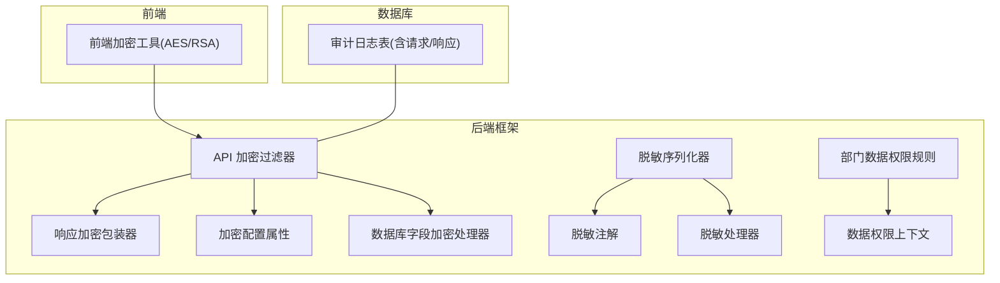
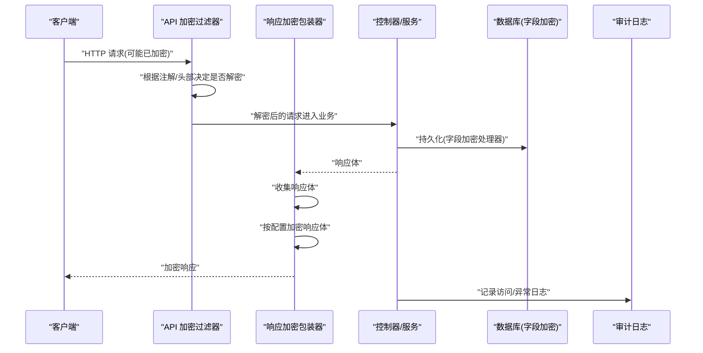
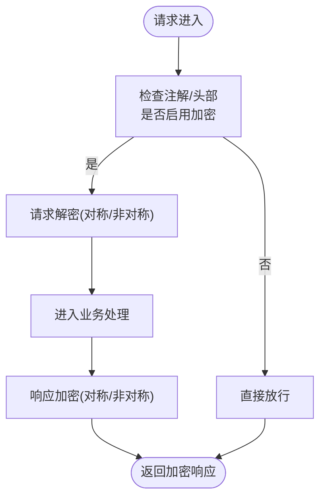
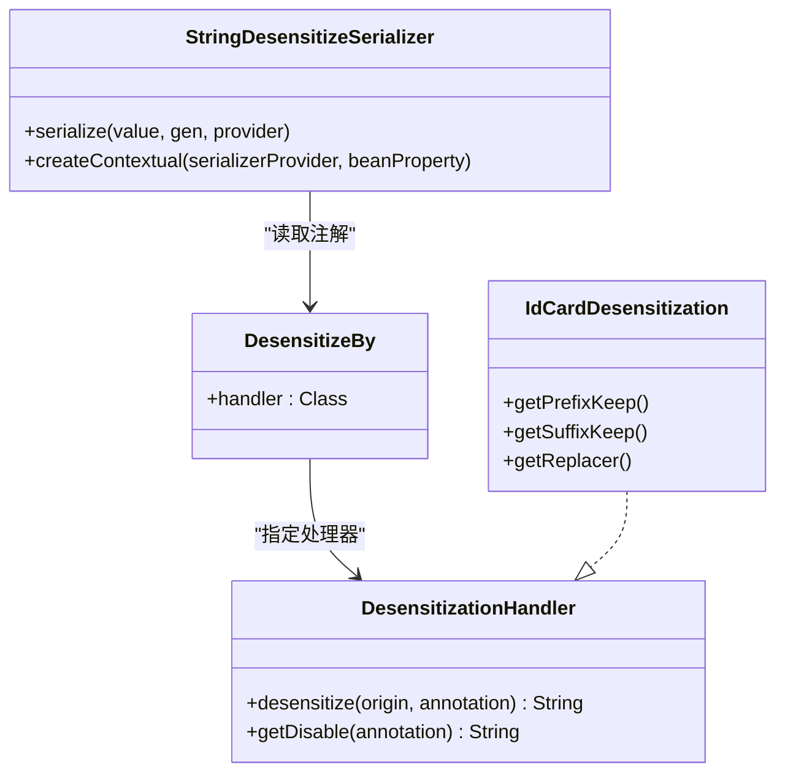
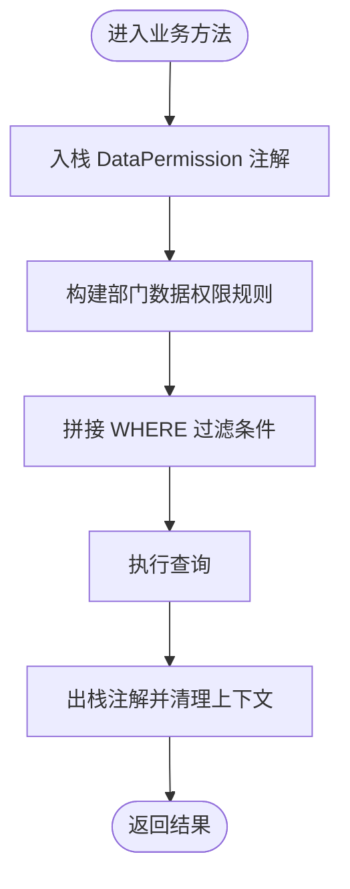
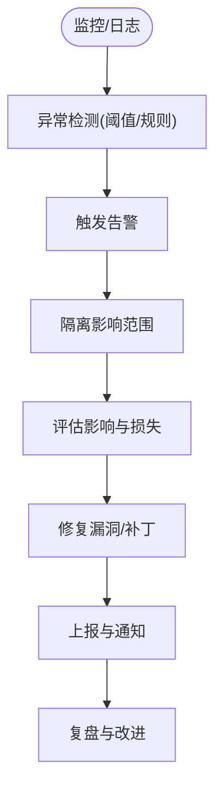
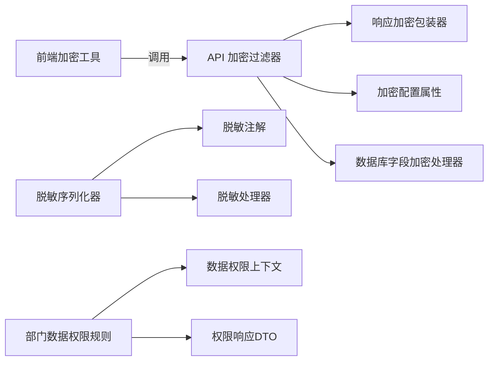

# 数据安全保护

<cite>
**本文引用的文件**
- [EncryptTypeHandler.java](file://backend/yudao-framework/yudao-spring-boot-starter-mybatis/src/main/java/cn/iocoder/yudao/framework/mybatis/core/type/EncryptTypeHandler.java)
- [ApiEncryptFilter.java](file://backend/yudao-framework/yudao-spring-boot-starter-web/src/main/java/cn/iocoder/yudao/framework/encrypt/core/filter/ApiEncryptFilter.java)
- [ApiEncryptResponseWrapper.java](file://backend/yudao-framework/yudao-spring-boot-starter-web/src/main/java/cn/iocoder/yudao/framework/encrypt/core/filter/ApiEncryptResponseWrapper.java)
- [ApiEncryptProperties.java](file://backend/yudao-framework/yudao-spring-boot-starter-web/src/main/java/cn/iocoder/yudao/framework/encrypt/config/ApiEncryptProperties.java)
- [StringDesensitizeSerializer.java](file://backend/yudao-framework/yudao-spring-boot-starter-web/src/main/java/cn/iocoder/yudao/framework/desensitize/core/base/serializer/StringDesensitizeSerializer.java)
- [DesensitizeBy.java](file://backend/yudao-framework/yudao-spring-boot-starter-web/src/main/java/cn/iocoder/yudao/framework/desensitize/core/base/annotation/DesensitizeBy.java)
- [DesensitizationHandler.java](file://backend/yudao-framework/yudao-spring-boot-starter-web/src/main/java/cn/iocoder/yudao/framework/desensitize/core/base/handler/DesensitizationHandler.java)
- [IdCardDesensitization.java](file://backend/yudao-framework/yudao-spring-boot-starter-web/src/main/java/cn/iocoder/yudao/framework/desensitize/core/slider/handler/IdCardDesensitization.java)
- [DeptDataPermissionRule.java](file://backend/yudao-framework/yudao-spring-boot-starter-biz-data-permission/src/main/java/cn/iocoder/yudao/framework/datapermission/core/rule/dept/DeptDataPermissionRule.java)
- [DataPermissionContextHolder.java](file://backend/yudao-framework/yudao-spring-boot-starter-biz-data-permission/src/main/java/cn/iocoder/yudao/framework/datapermission/core/aop/DataPermissionContextHolder.java)
- [DeptDataPermissionRespDTO.java](file://backend/yudao-framework/yudao-common/src/main/java/cn/iocoder/yudao/framework/common/biz/system/permission/dto/DeptDataPermissionRespDTO.java)
- [PermissionAssignRoleDataScopeReqVO.java](file://backend/yudao-module-system/src/main/java/cn/iocoder/yudao/module/system/controller/admin/permission/vo/permission/PermissionAssignRoleDataScopeReqVO.java)
- [AlipayPayClientConfig.java](file://backend/yudao-module-pay/src/main/java/cn/iocoder/yudao/module/pay/framework/pay/core/client/impl/alipay/AlipayPayClientConfig.java)
- [encrypt.ts(AES/RSA)](file://frontend/admin-uniapp/src/utils/encrypt.ts)
- [encrypt.ts(AES/RSA)](file://frontend/admin-vue3/src/utils/encrypt.ts)
- [ruoyi-vue-pro.sql(SQL Server 审计日志表结构)](file://backend/sql/sqlserver/ruoyi-vue-pro.sql)
- [CPS系统PRD文档.md](file://docs/CPS系统PRD文档.md)
</cite>

## 目录
1. [引言](#引言)
2. [项目结构](#项目结构)
3. [核心组件](#核心组件)
4. [架构总览](#架构总览)
5. [详细组件分析](#详细组件分析)
6. [依赖分析](#依赖分析)
7. [性能考虑](#性能考虑)
8. [故障排查指南](#故障排查指南)
9. [结论](#结论)
10. [附录](#附录)

## 引言
本文件面向数据安全保护，系统性阐述本项目的敏感数据加密存储与传输保护、字段级脱敏策略、数据访问控制（部门/角色/自定义范围）、数据备份加密、数据传输安全、数据销毁策略、隐私数据处理与GDPR合规要点、数据生命周期管理、安全审计与异常检测、数据泄露应急响应流程，以及加密算法选择、密钥管理与安全存储最佳实践。文档以仓库现有实现为依据，结合概念性流程图帮助读者快速理解与落地。

## 项目结构
围绕数据安全的关键模块分布如下：
- 后端框架层
  - 加密与解密：Web 加密过滤器、响应包装器、配置属性
  - 字段脱敏：Jackson 序列化器、注解与处理器
  - 数据权限：部门数据权限规则、上下文持有者、DTO/VO
  - 数据库字段加密：MyBatis 类型处理器
- 前端层
  - AES/RSA 工具函数（加密/解密）
- 数据库与审计
  - 审计日志表结构（SQL Server）
- 业务模块
  - 支付模块的接口内容加密配置
- 文档与规范
  - PRD 中的数据安全条目

**图表来源**
- [ApiEncryptFilter.java:44-162](file://backend/yudao-framework/yudao-spring-boot-starter-web/src/main/java/cn/iocoder/yudao/framework/encrypt/core/filter/ApiEncryptFilter.java#L44-L162)
- [ApiEncryptResponseWrapper.java:1-67](file://backend/yudao-framework/yudao-spring-boot-starter-web/src/main/java/cn/iocoder/yudao/framework/encrypt/core/filter/ApiEncryptResponseWrapper.java#L1-L67)
- [ApiEncryptProperties.java:1-70](file://backend/yudao-framework/yudao-spring-boot-starter-web/src/main/java/cn/iocoder/yudao/framework/encrypt/config/ApiEncryptProperties.java#L1-L70)
- [StringDesensitizeSerializer.java:1-68](file://backend/yudao-framework/yudao-spring-boot-starter-web/src/main/java/cn/iocoder/yudao/framework/desensitize/core/base/serializer/StringDesensitizeSerializer.java#L1-L68)
- [DesensitizeBy.java:1-32](file://backend/yudao-framework/yudao-spring-boot-starter-web/src/main/java/cn/iocoder/yudao/framework/desensitize/core/base/annotation/DesensitizeBy.java#L1-L32)
- [DesensitizationHandler.java:1-40](file://backend/yudao-framework/yudao-spring-boot-starter-web/src/main/java/cn/iocoder/yudao/framework/desensitize/core/base/handler/DesensitizationHandler.java#L1-L40)
- [EncryptTypeHandler.java:40-75](file://backend/yudao-framework/yudao-spring-boot-starter-mybatis/src/main/java/cn/iocoder/yudao/framework/mybatis/core/type/EncryptTypeHandler.java#L40-L75)
- [DeptDataPermissionRule.java:44-82](file://backend/yudao-framework/yudao-spring-boot-starter-biz-data-permission/src/main/java/cn/iocoder/yudao/framework/datapermission/core/rule/dept/DeptDataPermissionRule.java#L44-L82)
- [DataPermissionContextHolder.java:1-73](file://backend/yudao-framework/yudao-spring-boot-starter-biz-data-permission/src/main/java/cn/iocoder/yudao/framework/datapermission/core/aop/DataPermissionContextHolder.java#L1-L73)
- [ruoyi-vue-pro.sql:68-416](file://backend/sql/sqlserver/ruoyi-vue-pro.sql#L68-L416)

**章节来源**
- [ApiEncryptFilter.java:44-162](file://backend/yudao-framework/yudao-spring-boot-starter-web/src/main/java/cn/iocoder/yudao/framework/encrypt/core/filter/ApiEncryptFilter.java#L44-L162)
- [ApiEncryptResponseWrapper.java:1-67](file://backend/yudao-framework/yudao-spring-boot-starter-web/src/main/java/cn/iocoder/yudao/framework/encrypt/core/filter/ApiEncryptResponseWrapper.java#L1-L67)
- [ApiEncryptProperties.java:1-70](file://backend/yudao-framework/yudao-spring-boot-starter-web/src/main/java/cn/iocoder/yudao/framework/encrypt/config/ApiEncryptProperties.java#L1-L70)
- [StringDesensitizeSerializer.java:1-68](file://backend/yudao-framework/yudao-spring-boot-starter-web/src/main/java/cn/iocoder/yudao/framework/desensitize/core/base/serializer/StringDesensitizeSerializer.java#L1-L68)
- [DesensitizeBy.java:1-32](file://backend/yudao-framework/yudao-spring-boot-starter-web/src/main/java/cn/iocoder/yudao/framework/desensitize/core/base/annotation/DesensitizeBy.java#L1-L32)
- [DesensitizationHandler.java:1-40](file://backend/yudao-framework/yudao-spring-boot-starter-web/src/main/java/cn/iocoder/yudao/framework/desensitize/core/base/handler/DesensitizationHandler.java#L1-L40)
- [EncryptTypeHandler.java:40-75](file://backend/yudao-framework/yudao-spring-boot-starter-mybatis/src/main/java/cn/iocoder/yudao/framework/mybatis/core/type/EncryptTypeHandler.java#L40-L75)
- [DeptDataPermissionRule.java:44-82](file://backend/yudao-framework/yudao-spring-boot-starter-biz-data-permission/src/main/java/cn/iocoder/yudao/framework/datapermission/core/rule/dept/DeptDataPermissionRule.java#L44-L82)
- [DataPermissionContextHolder.java:1-73](file://backend/yudao-framework/yudao-spring-boot-starter-biz-data-permission/src/main/java/cn/iocoder/yudao/framework/datapermission/core/aop/DataPermissionContextHolder.java#L1-L73)
- [ruoyi-vue-pro.sql:68-416](file://backend/sql/sqlserver/ruoyi-vue-pro.sql#L68-L416)

## 核心组件
- 加密与解密
  - Web 层：API 加密过滤器负责请求解密与响应加密；响应包装器延迟收集并加密响应体；配置属性集中管理算法与密钥。
  - 前端层：提供 AES/RSA 工具函数，确保前后端一致的加解密行为。
  - 数据库层：MyBatis 类型处理器对特定字段进行透明加解密。
- 字段脱敏
  - 基于 Jackson 的序列化器与注解体系，按字段粒度进行脱敏输出。
- 数据权限
  - 基于部门的数据权限规则与上下文持有者，支撑“仅可见自己/部门/自定义范围”的访问控制。
- 审计与日志
  - 审计日志表结构覆盖请求/响应、异常等关键字段，便于安全审计与取证。

**章节来源**
- [ApiEncryptFilter.java:44-162](file://backend/yudao-framework/yudao-spring-boot-starter-web/src/main/java/cn/iocoder/yudao/framework/encrypt/core/filter/ApiEncryptFilter.java#L44-L162)
- [ApiEncryptResponseWrapper.java:1-67](file://backend/yudao-framework/yudao-spring-boot-starter-web/src/main/java/cn/iocoder/yudao/framework/encrypt/core/filter/ApiEncryptResponseWrapper.java#L1-L67)
- [ApiEncryptProperties.java:1-70](file://backend/yudao-framework/yudao-spring-boot-starter-web/src/main/java/cn/iocoder/yudao/framework/encrypt/config/ApiEncryptProperties.java#L1-L70)
- [encrypt.ts(AES/RSA):37-88](file://frontend/admin-uniapp/src/utils/encrypt.ts#L37-L88)
- [encrypt.ts(AES/RSA):37-88](file://frontend/admin-vue3/src/utils/encrypt.ts#L37-L88)
- [EncryptTypeHandler.java:40-75](file://backend/yudao-framework/yudao-spring-boot-starter-mybatis/src/main/java/cn/iocoder/yudao/framework/mybatis/core/type/EncryptTypeHandler.java#L40-L75)
- [StringDesensitizeSerializer.java:1-68](file://backend/yudao-framework/yudao-spring-boot-starter-web/src/main/java/cn/iocoder/yudao/framework/desensitize/core/base/serializer/StringDesensitizeSerializer.java#L1-L68)
- [DesensitizeBy.java:1-32](file://backend/yudao-framework/yudao-spring-boot-starter-web/src/main/java/cn/iocoder/yudao/framework/desensitize/core/base/annotation/DesensitizeBy.java#L1-L32)
- [DesensitizationHandler.java:1-40](file://backend/yudao-framework/yudao-spring-boot-starter-web/src/main/java/cn/iocoder/yudao/framework/desensitize/core/base/handler/DesensitizationHandler.java#L1-L40)
- [DeptDataPermissionRule.java:44-82](file://backend/yudao-framework/yudao-spring-boot-starter-biz-data-permission/src/main/java/cn/iocoder/yudao/framework/datapermission/core/rule/dept/DeptDataPermissionRule.java#L44-L82)
- [DataPermissionContextHolder.java:1-73](file://backend/yudao-framework/yudao-spring-boot-starter-biz-data-permission/src/main/java/cn/iocoder/yudao/framework/datapermission/core/aop/DataPermissionContextHolder.java#L1-L73)
- [ruoyi-vue-pro.sql:68-416](file://backend/sql/sqlserver/ruoyi-vue-pro.sql#L68-L416)

## 架构总览
下图展示了从请求进入、解密、业务处理、响应加密到持久化的整体流程，以及脱敏与数据权限在其中的位置。

**图表来源**
- [ApiEncryptFilter.java:82-125](file://backend/yudao-framework/yudao-spring-boot-starter-web/src/main/java/cn/iocoder/yudao/framework/encrypt/core/filter/ApiEncryptFilter.java#L82-L125)
- [ApiEncryptResponseWrapper.java:35-55](file://backend/yudao-framework/yudao-spring-boot-starter-web/src/main/java/cn/iocoder/yudao/framework/encrypt/core/filter/ApiEncryptResponseWrapper.java#L35-L55)
- [EncryptTypeHandler.java:40-75](file://backend/yudao-framework/yudao-spring-boot-starter-mybatis/src/main/java/cn/iocoder/yudao/framework/mybatis/core/type/EncryptTypeHandler.java#L40-L75)
- [ruoyi-vue-pro.sql:68-416](file://backend/sql/sqlserver/ruoyi-vue-pro.sql#L68-L416)

## 详细组件分析

### 加密与解密（传输与存储）
- 传输加密
  - API 加密过滤器根据注解与请求头判断是否启用请求解密与响应加密；支持对称（AES）与非对称（RSA）两种模式；响应加密采用包装器延迟收集与一次性输出，避免重复读取问题。
  - 加密配置集中于属性对象，包含开关、头部名、算法与密钥（请求/响应分别对应不同含义）。
  - 前端提供 AES/RSA 工具函数，确保与后端一致的加解密行为。
- 存储加密
  - MyBatis 类型处理器对数据库字段进行透明加解密，使用统一的密钥配置项，避免业务代码侵入。

**图表来源**
- [ApiEncryptFilter.java:82-125](file://backend/yudao-framework/yudao-spring-boot-starter-web/src/main/java/cn/iocoder/yudao/framework/encrypt/core/filter/ApiEncryptFilter.java#L82-L125)
- [ApiEncryptProperties.java:19-70](file://backend/yudao-framework/yudao-spring-boot-starter-web/src/main/java/cn/iocoder/yudao/framework/encrypt/config/ApiEncryptProperties.java#L19-L70)
- [ApiEncryptResponseWrapper.java:35-55](file://backend/yudao-framework/yudao-spring-boot-starter-web/src/main/java/cn/iocoder/yudao/framework/encrypt/core/filter/ApiEncryptResponseWrapper.java#L35-L55)
- [EncryptTypeHandler.java:40-75](file://backend/yudao-framework/yudao-spring-boot-starter-mybatis/src/main/java/cn/iocoder/yudao/framework/mybatis/core/type/EncryptTypeHandler.java#L40-L75)
- [encrypt.ts(AES/RSA):37-88](file://frontend/admin-uniapp/src/utils/encrypt.ts#L37-L88)
- [encrypt.ts(AES/RSA):37-88](file://frontend/admin-vue3/src/utils/encrypt.ts#L37-L88)

**章节来源**
- [ApiEncryptFilter.java:44-162](file://backend/yudao-framework/yudao-spring-boot-starter-web/src/main/java/cn/iocoder/yudao/framework/encrypt/core/filter/ApiEncryptFilter.java#L44-L162)
- [ApiEncryptResponseWrapper.java:1-67](file://backend/yudao-framework/yudao-spring-boot-starter-web/src/main/java/cn/iocoder/yudao/framework/encrypt/core/filter/ApiEncryptResponseWrapper.java#L1-L67)
- [ApiEncryptProperties.java:1-70](file://backend/yudao-framework/yudao-spring-boot-starter-web/src/main/java/cn/iocoder/yudao/framework/encrypt/config/ApiEncryptProperties.java#L1-L70)
- [EncryptTypeHandler.java:40-75](file://backend/yudao-framework/yudao-spring-boot-starter-mybatis/src/main/java/cn/iocoder/yudao/framework/mybatis/core/type/EncryptTypeHandler.java#L40-L75)
- [encrypt.ts(AES/RSA):37-88](file://frontend/admin-uniapp/src/utils/encrypt.ts#L37-L88)
- [encrypt.ts(AES/RSA):37-88](file://frontend/admin-vue3/src/utils/encrypt.ts#L37-L88)

### 字段脱敏策略（字段级保护）
- 脱敏机制
  - 基于 Jackson 的序列化器与注解体系，对声明脱敏注解的字段进行脱敏输出；支持禁用表达式，灵活控制脱敏开关。
  - 提供多种内置处理器（如密码、身份证等），可通过注解参数控制保留长度与替换字符。
- 实施建议
  - 在对外输出（API 响应）时统一启用脱敏；对内部日志与审计可保留原始值以便追溯。

**图表来源**
- [StringDesensitizeSerializer.java:1-68](file://backend/yudao-framework/yudao-spring-boot-starter-web/src/main/java/cn/iocoder/yudao/framework/desensitize/core/base/serializer/StringDesensitizeSerializer.java#L1-L68)
- [DesensitizeBy.java:1-32](file://backend/yudao-framework/yudao-spring-boot-starter-web/src/main/java/cn/iocoder/yudao/framework/desensitize/core/base/annotation/DesensitizeBy.java#L1-L32)
- [DesensitizationHandler.java:1-40](file://backend/yudao-framework/yudao-spring-boot-starter-web/src/main/java/cn/iocoder/yudao/framework/desensitize/core/base/handler/DesensitizationHandler.java#L1-L40)
- [IdCardDesensitization.java:1-27](file://backend/yudao-framework/yudao-spring-boot-starter-web/src/main/java/cn/iocoder/yudao/framework/desensitize/core/slider/handler/IdCardDesensitization.java#L1-L27)

**章节来源**
- [StringDesensitizeSerializer.java:1-68](file://backend/yudao-framework/yudao-spring-boot-starter-web/src/main/java/cn/iocoder/yudao/framework/desensitize/core/base/serializer/StringDesensitizeSerializer.java#L1-L68)
- [DesensitizeBy.java:1-32](file://backend/yudao-framework/yudao-spring-boot-starter-web/src/main/java/cn/iocoder/yudao/framework/desensitize/core/base/annotation/DesensitizeBy.java#L1-L32)
- [DesensitizationHandler.java:1-40](file://backend/yudao-framework/yudao-spring-boot-starter-web/src/main/java/cn/iocoder/yudao/framework/desensitize/core/base/handler/DesensitizationHandler.java#L1-L40)
- [IdCardDesensitization.java:1-27](file://backend/yudao-framework/yudao-spring-boot-starter-web/src/main/java/cn/iocoder/yudao/framework/desensitize/core/slider/handler/IdCardDesensitization.java#L1-L27)

### 数据访问控制（部门/角色/自定义范围）
- 规则与上下文
  - 部门数据权限规则支持基于 dept_id 与 user_id 的组合过滤；通过上下文持有者管理注解栈，支持嵌套调用。
  - 响应 DTO 描述“是否可查看全部/仅自己/部门集合”，用于前端与后端权限判定。
  - 角色数据范围赋权通过 VO 控制，支持 ALL、DEPT_CUSTOM 等范围类型。
- 实施建议
  - 在 MyBatis Mapper 层注入数据权限规则，确保查询自动带上过滤条件；对写操作进行额外校验，防止越权修改。

**图表来源**
- [DataPermissionContextHolder.java:14-73](file://backend/yudao-framework/yudao-spring-boot-starter-biz-data-permission/src/main/java/cn/iocoder/yudao/framework/datapermission/core/aop/DataPermissionContextHolder.java#L14-L73)
- [DeptDataPermissionRule.java:44-82](file://backend/yudao-framework/yudao-spring-boot-starter-biz-data-permission/src/main/java/cn/iocoder/yudao/framework/datapermission/core/rule/dept/DeptDataPermissionRule.java#L44-L82)
- [DeptDataPermissionRespDTO.java:1-35](file://backend/yudao-framework/yudao-common/src/main/java/cn/iocoder/yudao/framework/common/biz/system/permission/dto/DeptDataPermissionRespDTO.java#L1-L35)
- [PermissionAssignRoleDataScopeReqVO.java:1-28](file://backend/yudao-module-system/src/main/java/cn/iocoder/yudao/module/system/controller/admin/permission/vo/permission/PermissionAssignRoleDataScopeReqVO.java#L1-L28)

**章节来源**
- [DataPermissionContextHolder.java:1-73](file://backend/yudao-framework/yudao-spring-boot-starter-biz-data-permission/src/main/java/cn/iocoder/yudao/framework/datapermission/core/aop/DataPermissionContextHolder.java#L1-L73)
- [DeptDataPermissionRule.java:44-82](file://backend/yudao-framework/yudao-spring-boot-starter-biz-data-permission/src/main/java/cn/iocoder/yudao/framework/datapermission/core/rule/dept/DeptDataPermissionRule.java#L44-L82)
- [DeptDataPermissionRespDTO.java:1-35](file://backend/yudao-framework/yudao-common/src/main/java/cn/iocoder/yudao/framework/common/biz/system/permission/dto/DeptDataPermissionRespDTO.java#L1-L35)
- [PermissionAssignRoleDataScopeReqVO.java:1-28](file://backend/yudao-module-system/src/main/java/cn/iocoder/yudao/module/system/controller/admin/permission/vo/permission/PermissionAssignRoleDataScopeReqVO.java#L1-L28)

### 数据备份加密、传输安全与数据销毁
- 备份加密
  - 建议对备份文件采用强对称加密（如 AES-256-GCM）并妥善保管密钥；定期轮换密钥，限制访问权限。
- 传输安全
  - 强制 HTTPS/TLS；对敏感接口启用传输加密（参考现有 API 加密组件）；对第三方接口（如支付）启用接口内容加密（参考支付模块配置项）。
- 数据销毁
  - 对不再使用的数据执行安全擦除（多次覆写）或物理销毁；审计日志中保留销毁记录以便追溯。

**章节来源**
- [AlipayPayClientConfig.java:109-128](file://backend/yudao-module-pay/src/main/java/cn/iocoder/yudao/module/pay/framework/pay/core/client/impl/alipay/AlipayPayClientConfig.java#L109-L128)
- [CPS系统PRD文档.md:982-988](file://docs/CPS系统PRD文档.md#L982-L988)

### 隐私数据处理规范与GDPR合规
- 原则
  - 最小化收集：仅收集为实现功能所必需的最少数据；明确数据用途与保存期限。
  - 用户同意：在收集前获得明确授权；提供撤回同意的便捷途径。
  - 数据主体权利：保障访问、更正、删除、限制处理、可携带权等。
- 技术措施
  - 字段级脱敏与访问控制；加密存储与传输；审计日志完整记录数据访问与变更。
- 数据生命周期
  - 明确采集、使用、存储、共享、匿名化、销毁各阶段的安全要求与责任人。

**章节来源**
- [StringDesensitizeSerializer.java:1-68](file://backend/yudao-framework/yudao-spring-boot-starter-web/src/main/java/cn/iocoder/yudao/framework/desensitize/core/base/serializer/StringDesensitizeSerializer.java#L1-L68)
- [DeptDataPermissionRule.java:44-82](file://backend/yudao-framework/yudao-spring-boot-starter-biz-data-permission/src/main/java/cn/iocoder/yudao/framework/datapermission/core/rule/dept/DeptDataPermissionRule.java#L44-L82)
- [ruoyi-vue-pro.sql:68-416](file://backend/sql/sqlserver/ruoyi-vue-pro.sql#L68-L416)

### 数据安全审计、异常检测与应急响应
- 审计日志
  - 审计表结构包含请求/响应、异常、用户信息、UA/IP 等字段，便于事后审计与取证。
- 异常检测
  - 结合访问量、错误率、异常堆栈等指标建立告警；对异常登录、批量导出、高风险操作进行重点监控。
- 应急响应
  - 快速定位受影响数据范围；冻结相关账户与密钥；回滚可疑操作；修复漏洞并发布补丁；向监管与受影响方通报。

**图表来源**
- [ruoyi-vue-pro.sql:68-416](file://backend/sql/sqlserver/ruoyi-vue-pro.sql#L68-L416)

**章节来源**
- [ruoyi-vue-pro.sql:68-416](file://backend/sql/sqlserver/ruoyi-vue-pro.sql#L68-L416)

### 加密算法选择、密钥管理与安全存储最佳实践
- 算法选择
  - 传输：优先 TLS；对 API 可选 AES（对称）或 RSA（非对称）；接口内容加密可参考支付模块配置。
  - 存储：AES-256-GCM；避免使用弱算法与固定 IV。
- 密钥管理
  - 使用硬件安全模块（HSM）或密钥管理服务（KMS）；密钥轮换周期不超过一年；严格最小权限与访问审计。
- 安全存储
  - 将密钥与数据分离；对密钥进行加密存储；限制明文密钥驻留内存的时间；使用只读配置与环境变量注入。

**章节来源**
- [ApiEncryptProperties.java:35-68](file://backend/yudao-framework/yudao-spring-boot-starter-web/src/main/java/cn/iocoder/yudao/framework/encrypt/config/ApiEncryptProperties.java#L35-L68)
- [AlipayPayClientConfig.java:109-128](file://backend/yudao-module-pay/src/main/java/cn/iocoder/yudao/module/pay/framework/pay/core/client/impl/alipay/AlipayPayClientConfig.java#L109-L128)
- [EncryptTypeHandler.java:64-73](file://backend/yudao-framework/yudao-spring-boot-starter-mybatis/src/main/java/cn/iocoder/yudao/framework/mybatis/core/type/EncryptTypeHandler.java#L64-L73)

## 依赖分析
- 组件耦合
  - API 加密过滤器依赖 Web 配置、注解解析、异常处理器与对称/非对称加密器；响应包装器依赖配置与加密器。
  - 脱敏序列化器依赖注解与处理器；处理器通过注解参数驱动脱敏策略。
  - 数据权限规则依赖上下文持有者与权限 API；响应 DTO 作为权限判定的载体。
- 外部依赖
  - 前端加密工具依赖加密库；后端加密依赖通用加密工具包；数据库字段加密依赖 MyBatis 类型处理器。

**图表来源**
- [ApiEncryptFilter.java:44-162](file://backend/yudao-framework/yudao-spring-boot-starter-web/src/main/java/cn/iocoder/yudao/framework/encrypt/core/filter/ApiEncryptFilter.java#L44-L162)
- [ApiEncryptResponseWrapper.java:1-67](file://backend/yudao-framework/yudao-spring-boot-starter-web/src/main/java/cn/iocoder/yudao/framework/encrypt/core/filter/ApiEncryptResponseWrapper.java#L1-L67)
- [ApiEncryptProperties.java:1-70](file://backend/yudao-framework/yudao-spring-boot-starter-web/src/main/java/cn/iocoder/yudao/framework/encrypt/config/ApiEncryptProperties.java#L1-L70)
- [StringDesensitizeSerializer.java:1-68](file://backend/yudao-framework/yudao-spring-boot-starter-web/src/main/java/cn/iocoder/yudao/framework/desensitize/core/base/serializer/StringDesensitizeSerializer.java#L1-L68)
- [DesensitizeBy.java:1-32](file://backend/yudao-framework/yudao-spring-boot-starter-web/src/main/java/cn/iocoder/yudao/framework/desensitize/core/base/annotation/DesensitizeBy.java#L1-L32)
- [DesensitizationHandler.java:1-40](file://backend/yudao-framework/yudao-spring-boot-starter-web/src/main/java/cn/iocoder/yudao/framework/desensitize/core/base/handler/DesensitizationHandler.java#L1-L40)
- [EncryptTypeHandler.java:40-75](file://backend/yudao-framework/yudao-spring-boot-starter-mybatis/src/main/java/cn/iocoder/yudao/framework/mybatis/core/type/EncryptTypeHandler.java#L40-L75)
- [DeptDataPermissionRule.java:44-82](file://backend/yudao-framework/yudao-spring-boot-starter-biz-data-permission/src/main/java/cn/iocoder/yudao/framework/datapermission/core/rule/dept/DeptDataPermissionRule.java#L44-L82)
- [DataPermissionContextHolder.java:1-73](file://backend/yudao-framework/yudao-spring-boot-starter-biz-data-permission/src/main/java/cn/iocoder/yudao/framework/datapermission/core/aop/DataPermissionContextHolder.java#L1-L73)
- [DeptDataPermissionRespDTO.java:1-35](file://backend/yudao-framework/yudao-common/src/main/java/cn/iocoder/yudao/framework/common/biz/system/permission/dto/DeptDataPermissionRespDTO.java#L1-L35)

**章节来源**
- [ApiEncryptFilter.java:44-162](file://backend/yudao-framework/yudao-spring-boot-starter-web/src/main/java/cn/iocoder/yudao/framework/encrypt/core/filter/ApiEncryptFilter.java#L44-L162)
- [ApiEncryptResponseWrapper.java:1-67](file://backend/yudao-framework/yudao-spring-boot-starter-web/src/main/java/cn/iocoder/yudao/framework/encrypt/core/filter/ApiEncryptResponseWrapper.java#L1-L67)
- [ApiEncryptProperties.java:1-70](file://backend/yudao-framework/yudao-spring-boot-starter-web/src/main/java/cn/iocoder/yudao/framework/encrypt/config/ApiEncryptProperties.java#L1-L70)
- [StringDesensitizeSerializer.java:1-68](file://backend/yudao-framework/yudao-spring-boot-starter-web/src/main/java/cn/iocoder/yudao/framework/desensitize/core/base/serializer/StringDesensitizeSerializer.java#L1-L68)
- [DesensitizeBy.java:1-32](file://backend/yudao-framework/yudao-spring-boot-starter-web/src/main/java/cn/iocoder/yudao/framework/desensitize/core/base/annotation/DesensitizeBy.java#L1-L32)
- [DesensitizationHandler.java:1-40](file://backend/yudao-framework/yudao-spring-boot-starter-web/src/main/java/cn/iocoder/yudao/framework/desensitize/core/base/handler/DesensitizationHandler.java#L1-L40)
- [EncryptTypeHandler.java:40-75](file://backend/yudao-framework/yudao-spring-boot-starter-mybatis/src/main/java/cn/iocoder/yudao/framework/mybatis/core/type/EncryptTypeHandler.java#L40-L75)
- [DeptDataPermissionRule.java:44-82](file://backend/yudao-framework/yudao-spring-boot-starter-biz-data-permission/src/main/java/cn/iocoder/yudao/framework/datapermission/core/rule/dept/DeptDataPermissionRule.java#L44-L82)
- [DataPermissionContextHolder.java:1-73](file://backend/yudao-framework/yudao-spring-boot-starter-biz-data-permission/src/main/java/cn/iocoder/yudao/framework/datapermission/core/aop/DataPermissionContextHolder.java#L1-L73)
- [DeptDataPermissionRespDTO.java:1-35](file://backend/yudao-framework/yudao-common/src/main/java/cn/iocoder/yudao/framework/common/biz/system/permission/dto/DeptDataPermissionRespDTO.java#L1-L35)

## 性能考虑
- 加密开销
  - 对称加密（AES）通常优于非对称加密（RSA）；在高频接口中优先使用对称加密；合理设置密钥长度与填充模式。
- 响应加密
  - 包装器延迟收集响应体，避免重复读取；确保在必要时再进行加密，减少不必要的 CPU 消耗。
- 脱敏与权限
  - 脱敏仅在输出层执行；权限规则在查询层注入，尽量减少额外的 JOIN 与子查询。

[本节为通用指导，无需具体文件分析]

## 故障排查指南
- 传输加密问题
  - 确认请求头与注解配置一致；检查算法与密钥是否匹配；查看异常处理器返回的错误信息。
- 存储加密问题
  - 检查字段加密处理器的密钥配置项是否存在且有效；确认数据库字段类型与编码。
- 脱敏问题
  - 确认字段是否声明了正确的脱敏注解；检查禁用表达式是否误判；验证处理器参数（保留长度、替换字符）。
- 权限问题
  - 检查上下文持有者是否正确入栈/出栈；确认权限响应 DTO 的范围类型与部门集合是否符合预期。

**章节来源**
- [ApiEncryptFilter.java:82-125](file://backend/yudao-framework/yudao-spring-boot-starter-web/src/main/java/cn/iocoder/yudao/framework/encrypt/core/filter/ApiEncryptFilter.java#L82-L125)
- [ApiEncryptResponseWrapper.java:35-55](file://backend/yudao-framework/yudao-spring-boot-starter-web/src/main/java/cn/iocoder/yudao/framework/encrypt/core/filter/ApiEncryptResponseWrapper.java#L35-L55)
- [EncryptTypeHandler.java:40-75](file://backend/yudao-framework/yudao-spring-boot-starter-mybatis/src/main/java/cn/iocoder/yudao/framework/mybatis/core/type/EncryptTypeHandler.java#L40-L75)
- [StringDesensitizeSerializer.java:1-68](file://backend/yudao-framework/yudao-spring-boot-starter-web/src/main/java/cn/iocoder/yudao/framework/desensitize/core/base/serializer/StringDesensitizeSerializer.java#L1-L68)
- [DataPermissionContextHolder.java:1-73](file://backend/yudao-framework/yudao-spring-boot-starter-biz-data-permission/src/main/java/cn/iocoder/yudao/framework/datapermission/core/aop/DataPermissionContextHolder.java#L1-L73)

## 结论
本项目在传输加密、存储加密、字段脱敏与数据权限方面具备较为完善的实现基础。建议在生产环境中进一步强化密钥管理、完善审计与异常检测、落实GDPR等合规要求，并持续优化性能与可运维性。

[本节为总结，无需具体文件分析]

## 附录
- 相关文档与PRD条目
  - PRD 中明确了“密钥 AES-256 加密存储”“会员数据隔离”“敏感操作审计日志”“提现金额二次校验”等数据安全要点。

**章节来源**
- [CPS系统PRD文档.md:982-988](file://docs/CPS系统PRD文档.md#L982-L988)