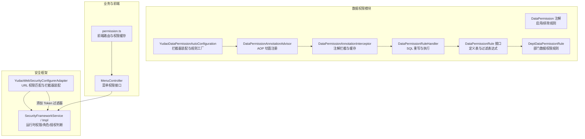
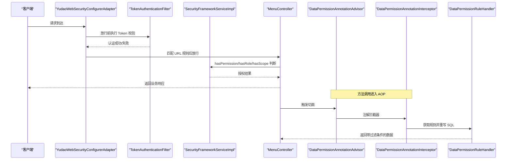
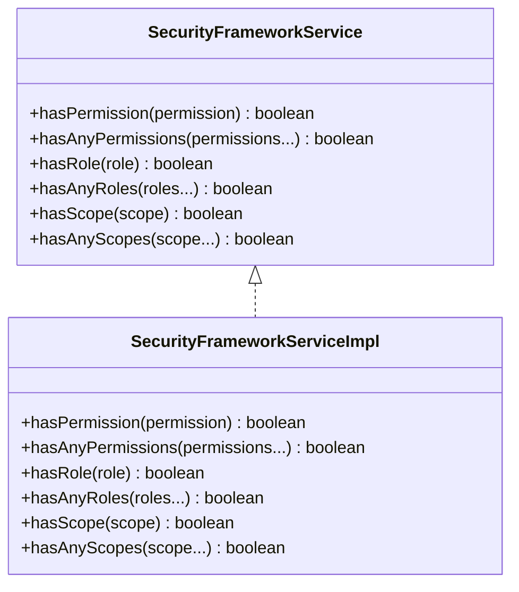
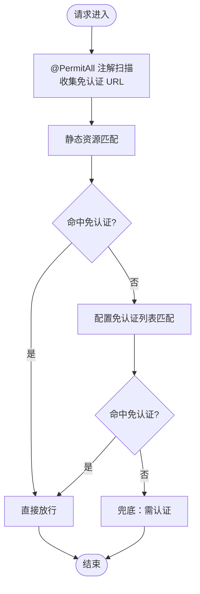
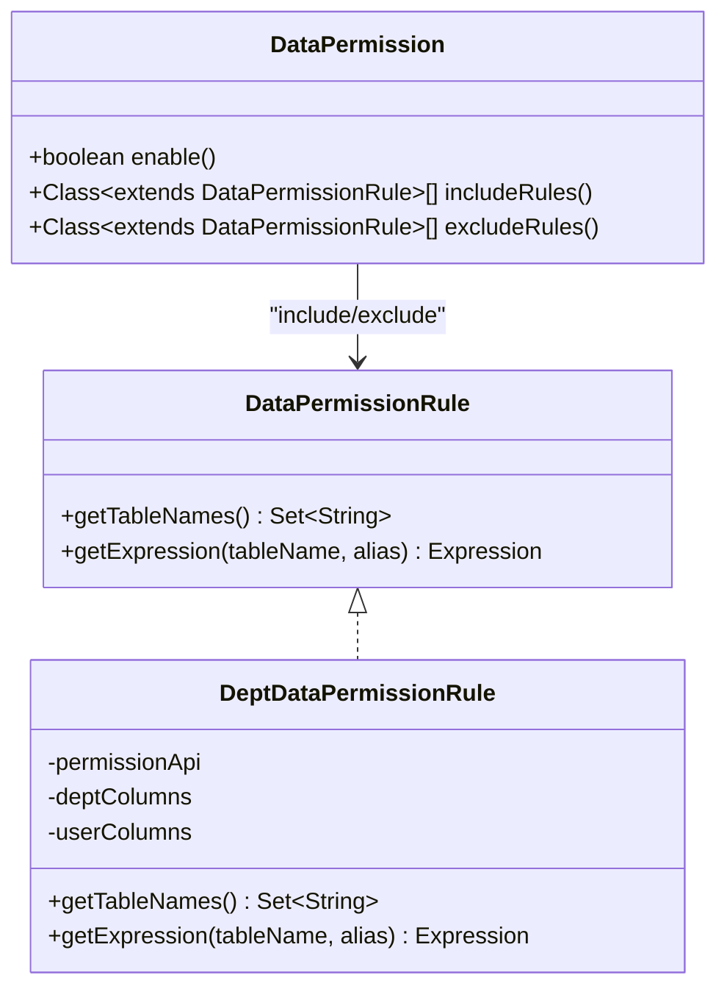
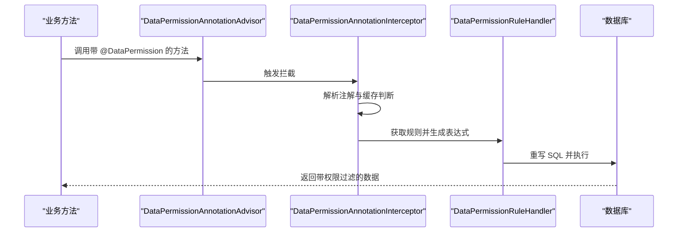
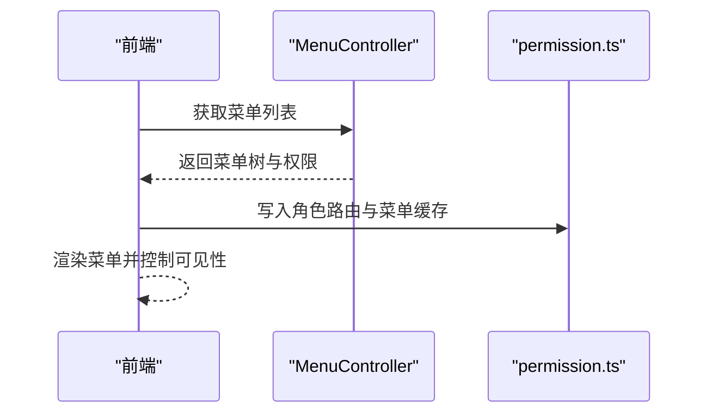
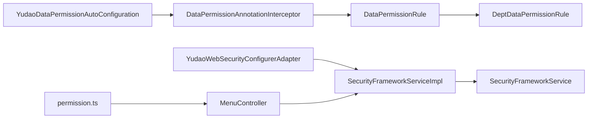

# 权限控制机制

<cite>
**本文引用的文件**
- [SecurityFrameworkService.java](file://backend/yudao-framework/yudao-spring-boot-starter-security/src/main/java/cn/iocoder/yudao/framework/security/core/service/SecurityFrameworkService.java)
- [SecurityFrameworkServiceImpl.java](file://backend/yudao-framework/yudao-spring-boot-starter-security/src/main/java/cn/iocoder/yudao/framework/security/core/service/SecurityFrameworkServiceImpl.java)
- [YudaoWebSecurityConfigurerAdapter.java](file://backend/yudao-framework/yudao-spring-boot-starter-security/src/main/java/cn/iocoder/yudao/framework/security/config/YudaoWebSecurityConfigurerAdapter.java)
- [DataPermission.java](file://backend/yudao-framework/yudao-spring-boot-starter-biz-data-permission/src/main/java/cn/iocoder/yudao/framework/datapermission/core/annotation/DataPermission.java)
- [DataPermissionRule.java](file://backend/yudao-framework/yudao-spring-boot-starter-biz-data-permission/src/main/java/cn/iocoder/yudao/framework/datapermission/core/rule/DataPermissionRule.java)
- [DeptDataPermissionRule.java](file://backend/yudao-framework/yudao-spring-boot-starter-biz-data-permission/src/main/java/cn/iocoder/yudao/framework/datapermission/core/rule/dept/DeptDataPermissionRule.java)
- [DeptDataPermissionRespDTO.java](file://backend/yudao-framework/yudao-common/src/main/java/cn/iocoder/yudao/framework/common/biz/system/permission/dto/DeptDataPermissionRespDTO.java)
- [YudaoDataPermissionAutoConfiguration.java](file://backend/yudao-framework/yudao-spring-boot-starter-biz-data-permission/src/main/java/cn/iocoder/yudao/framework/datapermission/config/YudaoDataPermissionAutoConfiguration.java)
- [DataPermissionAnnotationAdvisor.java](file://backend/yudao-framework/yudao-spring-boot-starter-biz-data-permission/src/main/java/cn/iocoder/yudao/framework/datapermission/core/aop/DataPermissionAnnotationAdvisor.java)
- [DataPermissionAnnotationInterceptor.java](file://backend/yudao-framework/yudao-spring-boot-starter-biz-data-permission/src/main/java/cn/iocoder/yudao/framework/datapermission/core/aop/DataPermissionAnnotationInterceptor.java)
- [DataPermissionRuleHandler.java](file://backend/yudao-framework/yudao-spring-boot-starter-biz-data-permission/src/main/java/cn/iocoder/yudao/framework/datapermission/core/db/DataPermissionRuleHandler.java)
- [MenuController.java](file://backend/yudao-module-system/src/main/java/cn/iocoder/yudao/module/system/controller/admin/permission/MenuController.java)
- [permission.ts](file://frontend/admin-vue3/src/store/modules/permission.ts)
</cite>

## 目录
1. [引言](#引言)
2. [项目结构](#项目结构)
3. [核心组件](#核心组件)
4. [架构总览](#架构总览)
5. [详细组件分析](#详细组件分析)
6. [依赖分析](#依赖分析)
7. [性能考量](#性能考量)
8. [故障排查指南](#故障排查指南)
9. [结论](#结论)
10. [附录](#附录)

## 引言
本文件系统性梳理并文档化基于 Spring Security 的权限控制机制，覆盖角色权限管理、菜单权限控制、URL 权限匹配规则、动态权限配置、权限注解使用、权限拦截器工作原理、权限验证流程与异常处理、数据权限过滤（部门与自定义规则）、权限缓存机制、最佳实践、性能优化与常见问题。文档以“从后端到前端”的视角，结合代码级图示与路径引用，帮助读者快速理解并扩展权限体系。

## 项目结构
权限相关能力由“安全框架”和“数据权限模块”两大子系统构成：
- 安全框架（Spring Security）：负责认证、授权、URL 匹配、拦截器链、异常处理等。
- 数据权限模块：负责基于注解与规则的数据行级过滤，支持部门维度与自定义规则。

图表来源
- [YudaoWebSecurityConfigurerAdapter.java:110-153](file://backend/yudao-framework/yudao-spring-boot-starter-security/src/main/java/cn/iocoder/yudao/framework/security/config/YudaoWebSecurityConfigurerAdapter.java#L110-L153)
- [SecurityFrameworkService.java:8-59](file://backend/yudao-framework/yudao-spring-boot-starter-security/src/main/java/cn/iocoder/yudao/framework/security/core/service/SecurityFrameworkService.java#L8-L59)
- [SecurityFrameworkServiceImpl.java](file://backend/yudao-framework/yudao-spring-boot-starter-security/src/main/java/cn/iocoder/yudao/framework/security/core/service/SecurityFrameworkServiceImpl.java)
- [DataPermission.java:16-35](file://backend/yudao-framework/yudao-spring-boot-starter-biz-data-permission/src/main/java/cn/iocoder/yudao/framework/datapermission/core/annotation/DataPermission.java#L16-L35)
- [DataPermissionRule.java:15-36](file://backend/yudao-framework/yudao-spring-boot-starter-biz-data-permission/src/main/java/cn/iocoder/yudao/framework/datapermission/core/rule/DataPermissionRule.java#L15-L36)
- [DeptDataPermissionRule.java:52-82](file://backend/yudao-framework/yudao-spring-boot-starter-biz-data-permission/src/main/java/cn/iocoder/yudao/framework/datapermission/core/rule/dept/DeptDataPermissionRule.java#L52-L82)
- [YudaoDataPermissionAutoConfiguration.java:31-46](file://backend/yudao-framework/yudao-spring-boot-starter-biz-data-permission/src/main/java/cn/iocoder/yudao/framework/datapermission/config/YudaoDataPermissionAutoConfiguration.java#L31-L46)
- [DataPermissionAnnotationAdvisor.java](file://backend/yudao-framework/yudao-spring-boot-starter-biz-data-permission/src/main/java/cn/iocoder/yudao/framework/datapermission/core/aop/DataPermissionAnnotationAdvisor.java)
- [DataPermissionAnnotationInterceptor.java](file://backend/yudao-framework/yudao-spring-boot-starter-biz-data-permission/src/main/java/cn/iocoder/yudao/framework/datapermission/core/aop/DataPermissionAnnotationInterceptor.java)
- [DataPermissionRuleHandler.java](file://backend/yudao-framework/yudao-spring-boot-starter-biz-data-permission/src/main/java/cn/iocoder/yudao/framework/datapermission/core/db/DataPermissionRuleHandler.java)
- [MenuController.java:17-30](file://backend/yudao-module-system/src/main/java/cn/iocoder/yudao/module/system/controller/admin/permission/MenuController.java#L17-L30)
- [permission.ts:34-41](file://frontend/admin-vue3/src/store/modules/permission.ts#L34-L41)

章节来源
- [YudaoWebSecurityConfigurerAdapter.java:110-153](file://backend/yudao-framework/yudao-spring-boot-starter-security/src/main/java/cn/iocoder/yudao/framework/security/config/YudaoWebSecurityConfigurerAdapter.java#L110-L153)
- [YudaoDataPermissionAutoConfiguration.java:31-46](file://backend/yudao-framework/yudao-spring-boot-starter-biz-data-permission/src/main/java/cn/iocoder/yudao/framework/datapermission/config/YudaoDataPermissionAutoConfiguration.java#L31-L46)

## 核心组件
- 安全框架服务接口与实现：提供运行时权限/角色/授权判断能力，供业务层与控制器使用。
- Spring Security 配置适配器：集中定义 URL 权限匹配规则、免认证白名单、拦截器链与异常处理。
- 数据权限注解与规则：通过注解启用/排除规则，通过规则接口定义表名与过滤表达式，支持部门与自定义规则。
- 数据权限 AOP 与 SQL 重写：基于注解拦截与缓存，结合规则工厂与处理器对 SQL 进行重写。
- 菜单权限控制器：提供菜单相关接口，配合前端路由与权限缓存实现菜单级权限控制。
- 前端权限存储：前端通过缓存角色路由与菜单，实现菜单渲染与导航控制。

章节来源
- [SecurityFrameworkService.java:8-59](file://backend/yudao-framework/yudao-spring-boot-starter-security/src/main/java/cn/iocoder/yudao/framework/security/core/service/SecurityFrameworkService.java#L8-L59)
- [SecurityFrameworkServiceImpl.java](file://backend/yudao-framework/yudao-spring-boot-starter-security/src/main/java/cn/iocoder/yudao/framework/security/core/service/SecurityFrameworkServiceImpl.java)
- [YudaoWebSecurityConfigurerAdapter.java:110-153](file://backend/yudao-framework/yudao-spring-boot-starter-security/src/main/java/cn/iocoder/yudao/framework/security/config/YudaoWebSecurityConfigurerAdapter.java#L110-L153)
- [DataPermission.java:16-35](file://backend/yudao-framework/yudao-spring-boot-starter-biz-data-permission/src/main/java/cn/iocoder/yudao/framework/datapermission/core/annotation/DataPermission.java#L16-L35)
- [DataPermissionRule.java:15-36](file://backend/yudao-framework/yudao-spring-boot-starter-biz-data-permission/src/main/java/cn/iocoder/yudao/framework/datapermission/core/rule/DataPermissionRule.java#L15-L36)
- [DeptDataPermissionRule.java:52-82](file://backend/yudao-framework/yudao-spring-boot-starter-biz-data-permission/src/main/java/cn/iocoder/yudao/framework/datapermission/core/rule/dept/DeptDataPermissionRule.java#L52-L82)
- [YudaoDataPermissionAutoConfiguration.java:31-46](file://backend/yudao-framework/yudao-spring-boot-starter-biz-data-permission/src/main/java/cn/iocoder/yudao/framework/datapermission/config/YudaoDataPermissionAutoConfiguration.java#L31-L46)
- [DataPermissionAnnotationAdvisor.java](file://backend/yudao-framework/yudao-spring-boot-starter-biz-data-permission/src/main/java/cn/iocoder/yudao/framework/datapermission/core/aop/DataPermissionAnnotationAdvisor.java)
- [DataPermissionAnnotationInterceptor.java](file://backend/yudao-framework/yudao-spring-boot-starter-biz-data-permission/src/main/java/cn/iocoder/yudao/framework/datapermission/core/aop/DataPermissionAnnotationInterceptor.java)
- [DataPermissionRuleHandler.java](file://backend/yudao-framework/yudao-spring-boot-starter-biz-data-permission/src/main/java/cn/iocoder/yudao/framework/datapermission/core/db/DataPermissionRuleHandler.java)
- [MenuController.java:17-30](file://backend/yudao-module-system/src/main/java/cn/iocoder/yudao/module/system/controller/admin/permission/MenuController.java#L17-L30)
- [permission.ts:34-41](file://frontend/admin-vue3/src/store/modules/permission.ts#L34-L41)

## 架构总览
整体权限架构分为三层：
- 认证与 URL 授权层：基于 Spring Security 的 URL 匹配与拦截器链，结合免认证白名单与自定义授权规则。
- 运行时权限判断层：通过 SecurityFrameworkService 提供 hasPermission/hasRole/hasScope 等判断，支撑方法级注解与业务逻辑。
- 数据权限过滤层：通过 DataPermission 注解与规则接口，对 SQL 进行 WHERE 条件重写，实现行级数据权限控制。

图表来源
- [YudaoWebSecurityConfigurerAdapter.java:110-153](file://backend/yudao-framework/yudao-spring-boot-starter-security/src/main/java/cn/iocoder/yudao/framework/security/config/YudaoWebSecurityConfigurerAdapter.java#L110-L153)
- [SecurityFrameworkServiceImpl.java](file://backend/yudao-framework/yudao-spring-boot-starter-security/src/main/java/cn/iocoder/yudao/framework/security/core/service/SecurityFrameworkServiceImpl.java)
- [MenuController.java:17-30](file://backend/yudao-module-system/src/main/java/cn/iocoder/yudao/module/system/controller/admin/permission/MenuController.java#L17-L30)
- [DataPermissionAnnotationAdvisor.java](file://backend/yudao-framework/yudao-spring-boot-starter-biz-data-permission/src/main/java/cn/iocoder/yudao/framework/datapermission/core/aop/DataPermissionAnnotationAdvisor.java)
- [DataPermissionAnnotationInterceptor.java](file://backend/yudao-framework/yudao-spring-boot-starter-biz-data-permission/src/main/java/cn/iocoder/yudao/framework/datapermission/core/aop/DataPermissionAnnotationInterceptor.java)
- [DataPermissionRuleHandler.java](file://backend/yudao-framework/yudao-spring-boot-starter-biz-data-permission/src/main/java/cn/iocoder/yudao/framework/datapermission/core/db/DataPermissionRuleHandler.java)

## 详细组件分析

### 安全框架服务与实现
- 接口职责：提供 hasPermission、hasAnyPermissions、hasRole、hasAnyRoles、hasScope、hasAnyScopes 等运行时判断方法，用于业务层与控制器进行细粒度权限校验。
- 实现要点：结合当前登录用户上下文，解析用户的角色、权限集合与授权范围，返回布尔判断结果；支持“任一满足即通过”。

图表来源
- [SecurityFrameworkService.java:8-59](file://backend/yudao-framework/yudao-spring-boot-starter-security/src/main/java/cn/iocoder/yudao/framework/security/core/service/SecurityFrameworkService.java#L8-L59)
- [SecurityFrameworkServiceImpl.java](file://backend/yudao-framework/yudao-spring-boot-starter-security/src/main/java/cn/iocoder/yudao/framework/security/core/service/SecurityFrameworkServiceImpl.java)

章节来源
- [SecurityFrameworkService.java:8-59](file://backend/yudao-framework/yudao-spring-boot-starter-security/src/main/java/cn/iocoder/yudao/framework/security/core/service/SecurityFrameworkService.java#L8-L59)
- [SecurityFrameworkServiceImpl.java](file://backend/yudao-framework/yudao-spring-boot-starter-security/src/main/java/cn/iocoder/yudao/framework/security/core/service/SecurityFrameworkServiceImpl.java)

### Spring Security 配置与 URL 权限匹配
- URL 匹配规则：
  - 静态资源免认证。
  - 通过扫描 @PermitAll 注解自动收集免认证 URL，并按请求方法分类。
  - 读取配置中的免认证 URL 列表。
  - 默认所有请求需认证。
- 拦截器链：在用户名密码过滤器之前插入 Token 认证过滤器，完成 JWT/Token 校验。
- 异常处理：统一配置认证失败与权限不足处理器。

图表来源
- [YudaoWebSecurityConfigurerAdapter.java:125-148](file://backend/yudao-framework/yudao-spring-boot-starter-security/src/main/java/cn/iocoder/yudao/framework/security/config/YudaoWebSecurityConfigurerAdapter.java#L125-L148)
- [YudaoWebSecurityConfigurerAdapter.java:159-219](file://backend/yudao-framework/yudao-spring-boot-starter-security/src/main/java/cn/iocoder/yudao/framework/security/config/YudaoWebSecurityConfigurerAdapter.java#L159-L219)

章节来源
- [YudaoWebSecurityConfigurerAdapter.java:110-153](file://backend/yudao-framework/yudao-spring-boot-starter-security/src/main/java/cn/iocoder/yudao/framework/security/config/YudaoWebSecurityConfigurerAdapter.java#L110-L153)
- [YudaoWebSecurityConfigurerAdapter.java:159-219](file://backend/yudao-framework/yudao-spring-boot-starter-security/src/main/java/cn/iocoder/yudao/framework/security/config/YudaoWebSecurityConfigurerAdapter.java#L159-L219)

### 权限注解与方法级校验
- 控制器层：使用 @PreAuthorize 等注解进行方法级权限校验，结合 SecurityFrameworkService 的运行时判断。
- 业务层：可通过 SecurityFrameworkService.hasPermission/hasRole 等方法进行细粒度校验。

章节来源
- [MenuController.java:17-30](file://backend/yudao-module-system/src/main/java/cn/iocoder/yudao/module/system/controller/admin/permission/MenuController.java#L17-L30)
- [SecurityFrameworkService.java:8-59](file://backend/yudao-framework/yudao-spring-boot-starter-security/src/main/java/cn/iocoder/yudao/framework/security/core/service/SecurityFrameworkService.java#L8-L59)

### 数据权限注解与规则
- 注解 DataPermission：
  - enable：是否启用数据权限，默认开启。
  - includeRules/excludeRules：优先级高于排除规则，用于精确指定生效规则。
- 规则接口 DataPermissionRule：
  - getTableNames：声明规则作用的表名集合。
  - getExpression：根据表名与别名生成 WHERE/OR 过滤表达式。
- 部门规则 DeptDataPermissionRule：
  - 基于 dept_id 与 user_id 字段组合过滤，支持自定义表字段映射。
  - 维护 LoginUser 上下文缓存键，避免重复计算。

图表来源
- [DataPermission.java:16-35](file://backend/yudao-framework/yudao-spring-boot-starter-biz-data-permission/src/main/java/cn/iocoder/yudao/framework/datapermission/core/annotation/DataPermission.java#L16-L35)
- [DataPermissionRule.java:15-36](file://backend/yudao-framework/yudao-spring-boot-starter-biz-data-permission/src/main/java/cn/iocoder/yudao/framework/datapermission/core/rule/DataPermissionRule.java#L15-L36)
- [DeptDataPermissionRule.java:52-82](file://backend/yudao-framework/yudao-spring-boot-starter-biz-data-permission/src/main/java/cn/iocoder/yudao/framework/datapermission/core/rule/dept/DeptDataPermissionRule.java#L52-L82)

章节来源
- [DataPermission.java:16-35](file://backend/yudao-framework/yudao-spring-boot-starter-biz-data-permission/src/main/java/cn/iocoder/yudao/framework/datapermission/core/annotation/DataPermission.java#L16-L35)
- [DataPermissionRule.java:15-36](file://backend/yudao-framework/yudao-spring-boot-starter-biz-data-permission/src/main/java/cn/iocoder/yudao/framework/datapermission/core/rule/DataPermissionRule.java#L15-L36)
- [DeptDataPermissionRule.java:52-82](file://backend/yudao-framework/yudao-spring-boot-starter-biz-data-permission/src/main/java/cn/iocoder/yudao/framework/datapermission/core/rule/dept/DeptDataPermissionRule.java#L52-L82)

### 数据权限拦截器与 SQL 重写
- AOP 切面与拦截器：
  - DataPermissionAnnotationAdvisor：注册切面，识别目标方法上的 DataPermission 注解。
  - DataPermissionAnnotationInterceptor：拦截方法调用，构建规则缓存，决定是否启用数据权限。
- 规则处理器：
  - DataPermissionRuleHandler：整合规则工厂，对 SQL 进行重写，生成 WHERE/OR 条件。
  - YudaoDataPermissionAutoConfiguration：将拦截器加入 MyBatis Plus 拦截器链首位，确保在分页插件之前执行。

图表来源
- [YudaoDataPermissionAutoConfiguration.java:31-46](file://backend/yudao-framework/yudao-spring-boot-starter-biz-data-permission/src/main/java/cn/iocoder/yudao/framework/datapermission/config/YudaoDataPermissionAutoConfiguration.java#L31-L46)
- [DataPermissionAnnotationAdvisor.java](file://backend/yudao-framework/yudao-spring-boot-starter-biz-data-permission/src/main/java/cn/iocoder/yudao/framework/datapermission/core/aop/DataPermissionAnnotationAdvisor.java)
- [DataPermissionAnnotationInterceptor.java](file://backend/yudao-framework/yudao-spring-boot-starter-biz-data-permission/src/main/java/cn/iocoder/yudao/framework/datapermission/core/aop/DataPermissionAnnotationInterceptor.java)
- [DataPermissionRuleHandler.java](file://backend/yudao-framework/yudao-spring-boot-starter-biz-data-permission/src/main/java/cn/iocoder/yudao/framework/datapermission/core/db/DataPermissionRuleHandler.java)

章节来源
- [YudaoDataPermissionAutoConfiguration.java:31-46](file://backend/yudao-framework/yudao-spring-boot-starter-biz-data-permission/src/main/java/cn/iocoder/yudao/framework/datapermission/config/YudaoDataPermissionAutoConfiguration.java#L31-L46)
- [DataPermissionAnnotationAdvisor.java](file://backend/yudao-framework/yudao-spring-boot-starter-biz-data-permission/src/main/java/cn/iocoder/yudao/framework/datapermission/core/aop/DataPermissionAnnotationAdvisor.java)
- [DataPermissionAnnotationInterceptor.java](file://backend/yudao-framework/yudao-spring-boot-starter-biz-data-permission/src/main/java/cn/iocoder/yudao/framework/datapermission/core/aop/DataPermissionAnnotationInterceptor.java)
- [DataPermissionRuleHandler.java](file://backend/yudao-framework/yudao-spring-boot-starter-biz-data-permission/src/main/java/cn/iocoder/yudao/framework/datapermission/core/db/DataPermissionRuleHandler.java)

### 菜单权限控制与前端集成
- 后端菜单接口：MenuController 使用 @PreAuthorize 等注解保护菜单相关接口，返回菜单树与权限信息。
- 前端权限存储：permission.ts 通过缓存角色路由与菜单，实现菜单渲染与导航控制；登录时拉取用户菜单并写入缓存。

图表来源
- [MenuController.java:17-30](file://backend/yudao-module-system/src/main/java/cn/iocoder/yudao/module/system/controller/admin/permission/MenuController.java#L17-L30)
- [permission.ts:34-41](file://frontend/admin-vue3/src/store/modules/permission.ts#L34-L41)

章节来源
- [MenuController.java:17-30](file://backend/yudao-module-system/src/main/java/cn/iocoder/yudao/module/system/controller/admin/permission/MenuController.java#L17-L30)
- [permission.ts:34-41](file://frontend/admin-vue3/src/store/modules/permission.ts#L34-L41)

### 角色继承关系与权限分配策略
- 角色与权限：SecurityFrameworkService 的 hasRole/hasAnyRoles 与 hasPermission/hasAnyPermissions 支持角色与权限双维度判断。
- 分配策略：建议采用“角色承载权限集合”的模式，通过角色继承简化权限矩阵；在业务层通过 SecurityFrameworkService 动态判断，避免硬编码。

章节来源
- [SecurityFrameworkService.java:8-59](file://backend/yudao-framework/yudao-spring-boot-starter-security/src/main/java/cn/iocoder/yudao/framework/security/core/service/SecurityFrameworkService.java#L8-L59)

### 权限缓存机制
- 数据权限注解拦截器内部维护注解级别的缓存，避免重复解析注解与规则。
- 部门数据权限规则在规则实例内维护上下文缓存键，减少重复计算。

章节来源
- [DataPermissionAnnotationInterceptor.java](file://backend/yudao-framework/yudao-spring-boot-starter-biz-data-permission/src/main/java/cn/iocoder/yudao/framework/datapermission/core/aop/DataPermissionAnnotationInterceptor.java)
- [DeptDataPermissionRule.java:52-82](file://backend/yudao-framework/yudao-spring-boot-starter-biz-data-permission/src/main/java/cn/iocoder/yudao/framework/datapermission/core/rule/dept/DeptDataPermissionRule.java#L52-L82)

### 异常处理与权限验证流程
- 认证失败：AuthenticationEntryPoint 统一处理。
- 权限不足：AccessDeniedHandler 统一处理。
- 验证流程：URL 匹配 → Token 校验 → 方法级注解校验 → 数据权限过滤 → 返回结果。

章节来源
- [YudaoWebSecurityConfigurerAdapter.java:121-122](file://backend/yudao-framework/yudao-spring-boot-starter-security/src/main/java/cn/iocoder/yudao/framework/security/config/YudaoWebSecurityConfigurerAdapter.java#L121-L122)

## 依赖分析
- 组件耦合：
  - SecurityFrameworkService 与 SecurityFrameworkServiceImpl：低耦合，便于替换实现。
  - 数据权限模块与 MyBatis Plus：通过 AutoConfiguration 将拦截器插入拦截器链首位，强依赖顺序。
  - 规则接口与具体规则：通过 include/excludeRules 精准控制，降低耦合。
- 外部依赖：
  - Spring Security：URL 匹配、方法级注解、异常处理。
  - MyBatis Plus：SQL 拦截与重写。
  - 前端 Pinia：权限状态缓存与菜单渲染。

图表来源
- [SecurityFrameworkServiceImpl.java](file://backend/yudao-framework/yudao-spring-boot-starter-security/src/main/java/cn/iocoder/yudao/framework/security/core/service/SecurityFrameworkServiceImpl.java)
- [YudaoWebSecurityConfigurerAdapter.java:110-153](file://backend/yudao-framework/yudao-spring-boot-starter-security/src/main/java/cn/iocoder/yudao/framework/security/config/YudaoWebSecurityConfigurerAdapter.java#L110-L153)
- [YudaoDataPermissionAutoConfiguration.java:31-46](file://backend/yudao-framework/yudao-spring-boot-starter-biz-data-permission/src/main/java/cn/iocoder/yudao/framework/datapermission/config/YudaoDataPermissionAutoConfiguration.java#L31-L46)
- [DataPermissionRule.java:15-36](file://backend/yudao-framework/yudao-spring-boot-starter-biz-data-permission/src/main/java/cn/iocoder/yudao/framework/datapermission/core/rule/DataPermissionRule.java#L15-L36)
- [DeptDataPermissionRule.java:52-82](file://backend/yudao-framework/yudao-spring-boot-starter-biz-data-permission/src/main/java/cn/iocoder/yudao/framework/datapermission/core/rule/dept/DeptDataPermissionRule.java#L52-L82)
- [MenuController.java:17-30](file://backend/yudao-module-system/src/main/java/cn/iocoder/yudao/module/system/controller/admin/permission/MenuController.java#L17-L30)
- [permission.ts:34-41](file://frontend/admin-vue3/src/store/modules/permission.ts#L34-L41)

## 性能考量
- URL 匹配与免认证扫描：仅在启动时扫描 @PermitAll 注解，运行时通过内存集合匹配，开销极低。
- 数据权限缓存：注解与规则缓存减少重复解析；建议合理设计 include/excludeRules，避免过多规则组合。
- SQL 重写位置：拦截器置于首位，确保在分页插件前执行，避免不必要的分页开销。
- 前端菜单缓存：前端通过缓存角色路由与菜单，减少重复请求与渲染成本。

## 故障排查指南
- URL 未生效免认证：
  - 检查是否正确标注 @PermitAll 或配置免认证列表。
  - 确认请求方法与路径是否匹配。
- 权限注解无效：
  - 确保方法级或类级存在 @DataPermission 注解。
  - 检查 includeRules/excludeRules 是否正确配置。
- 数据权限过滤异常：
  - 核对规则实现的表名集合与实际表名一致。
  - 检查 SQL 表别名与规则表达式是否匹配。
- 前端菜单不显示：
  - 检查登录后是否正确写入角色路由与菜单缓存。
  - 确认后端菜单接口返回的权限与前端缓存一致。

章节来源
- [YudaoWebSecurityConfigurerAdapter.java:159-219](file://backend/yudao-framework/yudao-spring-boot-starter-security/src/main/java/cn/iocoder/yudao/framework/security/config/YudaoWebSecurityConfigurerAdapter.java#L159-L219)
- [DataPermission.java:16-35](file://backend/yudao-framework/yudao-spring-boot-starter-biz-data-permission/src/main/java/cn/iocoder/yudao/framework/datapermission/core/annotation/DataPermission.java#L16-L35)
- [DataPermissionRule.java:15-36](file://backend/yudao-framework/yudao-spring-boot-starter-biz-data-permission/src/main/java/cn/iocoder/yudao/framework/datapermission/core/rule/DataPermissionRule.java#L15-L36)
- [permission.ts:34-41](file://frontend/admin-vue3/src/store/modules/permission.ts#L34-L41)

## 结论
本权限体系以 Spring Security 为基础，结合运行时权限判断与数据权限注解/规则，实现了从 URL 层到方法层再到数据层的多维权限控制。通过合理的规则设计与缓存策略，既能满足灵活的权限需求，又能保持良好的性能表现。前端通过缓存与菜单控制进一步完善了用户体验与安全性。

## 附录
- 最佳实践
  - URL 权限：尽量使用 @PermitAll 明确免认证接口，避免通配符滥用。
  - 方法级权限：优先使用 @PreAuthorize 等注解，结合 SecurityFrameworkService 进行细粒度判断。
  - 数据权限：明确 includeRules/excludeRules，避免过度组合；为热点规则建立缓存。
  - 规则扩展：实现 DataPermissionRule 接口，按表维度定义过滤表达式。
- 扩展点
  - 自定义权限处理器：实现 DataPermissionRule 并在规则工厂中注册。
  - 自定义 URL 授权：实现 AuthorizeRequestsCustomizer 并注入容器，参与 URL 匹配。
- 常见问题
  - 规则未生效：检查规则表名与实体映射、SQL 别名。
  - 权限绕过：确认拦截器顺序与注解使用正确。
  - 前端菜单异常：核对后端返回权限与前端缓存一致性。