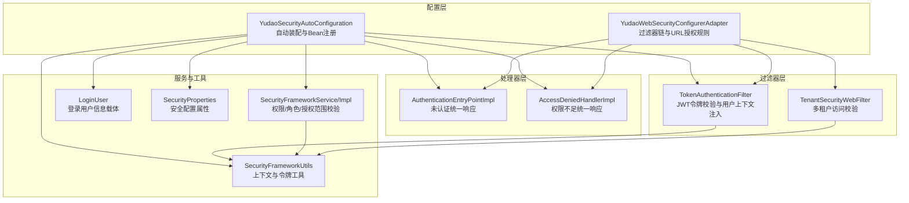
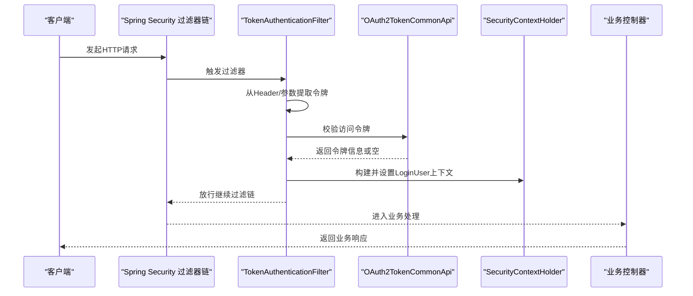
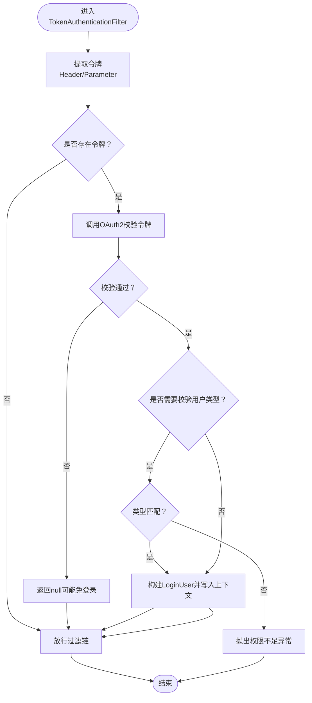
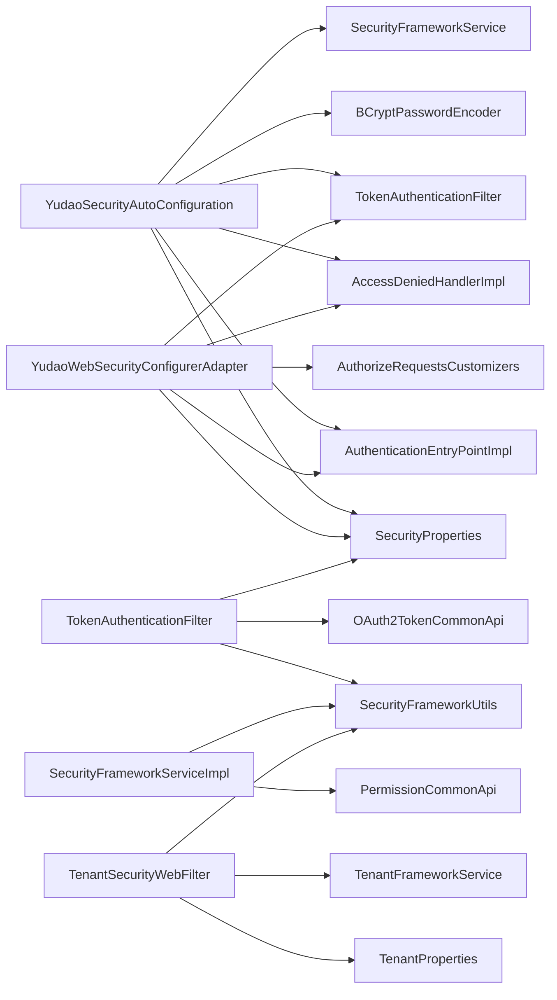

# 系统安全

<cite>
**本文引用的文件**
- [YudaoSecurityAutoConfiguration.java](file://backend/yudao-framework/yudao-spring-boot-starter-security/src/main/java/cn/iocoder/yudao/framework/security/config/YudaoSecurityAutoConfiguration.java)
- [YudaoWebSecurityConfigurerAdapter.java](file://backend/yudao-framework/yudao-spring-boot-starter-security/src/main/java/cn/iocoder/yudao/framework/security/config/YudaoWebSecurityConfigurerAdapter.java)
- [TokenAuthenticationFilter.java](file://backend/yudao-framework/yudao-spring-boot-starter-security/src/main/java/cn/iocoder/yudao/framework/security/core/filter/TokenAuthenticationFilter.java)
- [AuthenticationEntryPointImpl.java](file://backend/yudao-framework/yudao-spring-boot-starter-security/src/main/java/cn/iocoder/yudao/framework/security/core/handler/AuthenticationEntryPointImpl.java)
- [AccessDeniedHandlerImpl.java](file://backend/yudao-framework/yudao-spring-boot-starter-security/src/main/java/cn/iocoder/yudao/framework/security/core/handler/AccessDeniedHandlerImpl.java)
- [SecurityProperties.java](file://backend/yudao-framework/yudao-spring-boot-starter-security/src/main/java/cn/iocoder/yudao/framework/security/config/SecurityProperties.java)
- [LoginUser.java](file://backend/yudao-framework/yudao-spring-boot-starter-security/src/main/java/cn/iocoder/yudao/framework/security/core/LoginUser.java)
- [SecurityFrameworkUtils.java](file://backend/yudao-framework/yudao-spring-boot-starter-security/src/main/java/cn/iocoder/yudao/framework/security/core/util/SecurityFrameworkUtils.java)
- [SecurityFrameworkService.java](file://backend/yudao-framework/yudao-spring-boot-starter-security/src/main/java/cn/iocoder/yudao/framework/security/core/service/SecurityFrameworkService.java)
- [SecurityFrameworkServiceImpl.java](file://backend/yudao-framework/yudao-spring-boot-starter-security/src/main/java/cn/iocoder/yudao/framework/security/core/service/SecurityFrameworkServiceImpl.java)
- [TenantSecurityWebFilter.java](file://backend/yudao-framework/yudao-spring-boot-starter-biz-tenant/src/main/java/cn/iocoder/yudao/framework/tenant/core/security/TenantSecurityWebFilter.java)
- [org.springframework.boot.autoconfigure.AutoConfiguration.imports](file://backend/yudao-framework/yudao-spring-boot-starter-security/src/main/resources/META-INF/spring/org.springframework.boot.autoconfigure.AutoConfiguration.imports)
</cite>

## 目录
1. [简介](#简介)
2. [项目结构](#项目结构)
3. [核心组件](#核心组件)
4. [架构总览](#架构总览)
5. [详细组件分析](#详细组件分析)
6. [依赖关系分析](#依赖关系分析)
7. [性能考量](#性能考量)
8. [故障排查指南](#故障排查指南)
9. [结论](#结论)
10. [附录](#附录)

## 简介
本文件面向系统安全模块，聚焦于 Spring Security 集成实现、用户认证机制、权限控制策略、JWT 令牌管理、访问控制列表、安全配置类、拦截器实现、过滤器链、会话管理、登录登出流程、密码加密策略、验证码机制与防暴力破解措施、安全配置示例、自定义安全处理器、跨域安全配置、CSRF 保护机制、安全最佳实践、常见安全漏洞防护与安全审计日志记录。文档在保证技术深度的同时，力求对非专业读者亦具备可读性。

## 项目结构
安全模块位于后端 yudao-framework 子工程中，核心由以下层次构成：
- 配置层：自动装配与 Web 安全配置适配器，负责加载安全属性、注册处理器与过滤器、构建过滤器链。
- 过滤器层：基于 JWT 的 Token 认证过滤器，负责从请求中提取令牌、校验并解析用户身份，将用户信息写入 Spring Security 上下文。
- 处理器层：认证入口处理器与权限不足处理器，统一输出标准化错误响应。
- 服务层：安全框架服务接口与实现，封装权限、角色、授权范围的校验逻辑，并与通用权限 API 对接。
- 工具层：安全工具类，提供令牌提取、上下文读取、用户信息读取、跨租户权限跳过判断等能力。
- 租户安全过滤器：在多租户场景下，校验用户对目标租户的访问权限、租户合法性与忽略规则。

图表来源
- [YudaoSecurityAutoConfiguration.java:32-94](file://backend/yudao-framework/yudao-spring-boot-starter-security/src/main/java/cn/iocoder/yudao/framework/security/config/YudaoSecurityAutoConfiguration.java#L32-L94)
- [YudaoWebSecurityConfigurerAdapter.java:46-153](file://backend/yudao-framework/yudao-spring-boot-starter-security/src/main/java/cn/iocoder/yudao/framework/security/config/YudaoWebSecurityConfigurerAdapter.java#L46-L153)
- [TokenAuthenticationFilter.java:31-120](file://backend/yudao-framework/yudao-spring-boot-starter-security/src/main/java/cn/iocoder/yudao/framework/security/core/filter/TokenAuthenticationFilter.java#L31-L120)
- [AuthenticationEntryPointImpl.java:24-36](file://backend/yudao-framework/yudao-spring-boot-starter-security/src/main/java/cn/iocoder/yudao/framework/security/core/handler/AuthenticationEntryPointImpl.java#L24-L36)
- [AccessDeniedHandlerImpl.java:27-42](file://backend/yudao-framework/yudao-spring-boot-starter-security/src/main/java/cn/iocoder/yudao/framework/security/core/handler/AccessDeniedHandlerImpl.java#L27-L42)
- [SecurityFrameworkService.java:8-60](file://backend/yudao-framework/yudao-spring-boot-starter-security/src/main/java/cn/iocoder/yudao/framework/security/core/service/SecurityFrameworkService.java#L8-L60)
- [SecurityFrameworkServiceImpl.java:19-85](file://backend/yudao-framework/yudao-spring-boot-starter-security/src/main/java/cn/iocoder/yudao/framework/security/core/service/SecurityFrameworkServiceImpl.java#L19-L85)
- [SecurityFrameworkUtils.java:24-161](file://backend/yudao-framework/yudao-spring-boot-starter-security/src/main/java/cn/iocoder/yudao/framework/security/core/util/SecurityFrameworkUtils.java#L24-L161)
- [LoginUser.java:18-76](file://backend/yudao-framework/yudao-spring-boot-starter-security/src/main/java/cn/iocoder/yudao/framework/security/core/LoginUser.java#L18-L76)
- [SecurityProperties.java:14-52](file://backend/yudao-framework/yudao-spring-boot-starter-security/src/main/java/cn/iocoder/yudao/framework/security/config/SecurityProperties.java#L14-L52)
- [TenantSecurityWebFilter.java:34-135](file://backend/yudao-framework/yudao-spring-boot-starter-biz-tenant/src/main/java/cn/iocoder/yudao/framework/tenant/core/security/TenantSecurityWebFilter.java#L34-L135)

章节来源
- [YudaoSecurityAutoConfiguration.java:1-95](file://backend/yudao-framework/yudao-spring-boot-starter-security/src/main/java/cn/iocoder/yudao/framework/security/config/YudaoSecurityAutoConfiguration.java#L1-L95)
- [YudaoWebSecurityConfigurerAdapter.java:1-222](file://backend/yudao-framework/yudao-spring-boot-starter-security/src/main/java/cn/iocoder/yudao/framework/security/config/YudaoWebSecurityConfigurerAdapter.java#L1-L222)
- [org.springframework.boot.autoconfigure.AutoConfiguration.imports:1-3](file://backend/yudao-framework/yudao-spring-boot-starter-security/src/main/resources/META-INF/spring/org.springframework.boot.autoconfigure.AutoConfiguration.imports#L1-L3)

## 核心组件
- 自动装配与 Bean 注册：负责注册认证入口处理器、权限不足处理器、BCrypt 密码编码器、Token 认证过滤器、安全框架服务、安全上下文策略等。
- Web 安全配置适配器：定义过滤器链、跨域与 CSRF 策略、会话策略、异常处理、URL 授权规则（含注解扫描与全局免登录配置）、添加 Token 过滤器。
- Token 认证过滤器：从请求头或参数提取令牌，调用通用 OAuth2 令牌校验 API，构建 LoginUser 并写入 Spring Security 上下文；支持开发模式下的模拟登录。
- 统一认证与权限处理器：未认证返回 401，权限不足返回 403，统一 JSON 响应。
- 安全框架服务与工具：封装权限/角色/授权范围校验；提供令牌提取、上下文读取、用户信息读取、跨租户权限跳过判断。
- 多租户安全过滤器：校验用户对目标租户的访问权限、租户合法性与忽略规则，防止越权与非法访问。

章节来源
- [YudaoSecurityAutoConfiguration.java:32-94](file://backend/yudao-framework/yudao-spring-boot-starter-security/src/main/java/cn/iocoder/yudao/framework/security/config/YudaoSecurityAutoConfiguration.java#L32-L94)
- [YudaoWebSecurityConfigurerAdapter.java:46-153](file://backend/yudao-framework/yudao-spring-boot-starter-security/src/main/java/cn/iocoder/yudao/framework/security/config/YudaoWebSecurityConfigurerAdapter.java#L46-L153)
- [TokenAuthenticationFilter.java:31-120](file://backend/yudao-framework/yudao-spring-boot-starter-security/src/main/java/cn/iocoder/yudao/framework/security/core/filter/TokenAuthenticationFilter.java#L31-L120)
- [AuthenticationEntryPointImpl.java:24-36](file://backend/yudao-framework/yudao-spring-boot-starter-security/src/main/java/cn/iocoder/yudao/framework/security/core/handler/AuthenticationEntryPointImpl.java#L24-L36)
- [AccessDeniedHandlerImpl.java:27-42](file://backend/yudao-framework/yudao-spring-boot-starter-security/src/main/java/cn/iocoder/yudao/framework/security/core/handler/AccessDeniedHandlerImpl.java#L27-L42)
- [SecurityFrameworkService.java:8-60](file://backend/yudao-framework/yudao-spring-boot-starter-security/src/main/java/cn/iocoder/yudao/framework/security/core/service/SecurityFrameworkService.java#L8-L60)
- [SecurityFrameworkServiceImpl.java:19-85](file://backend/yudao-framework/yudao-spring-boot-starter-security/src/main/java/cn/iocoder/yudao/framework/security/core/service/SecurityFrameworkServiceImpl.java#L19-L85)
- [SecurityFrameworkUtils.java:24-161](file://backend/yudao-framework/yudao-spring-boot-starter-security/src/main/java/cn/iocoder/yudao/framework/security/core/util/SecurityFrameworkUtils.java#L24-L161)
- [LoginUser.java:18-76](file://backend/yudao-framework/yudao-spring-boot-starter-security/src/main/java/cn/iocoder/yudao/framework/security/core/LoginUser.java#L18-L76)
- [SecurityProperties.java:14-52](file://backend/yudao-framework/yudao-spring-boot-starter-security/src/main/java/cn/iocoder/yudao/framework/security/config/SecurityProperties.java#L14-L52)
- [TenantSecurityWebFilter.java:34-135](file://backend/yudao-framework/yudao-spring-boot-starter-biz-tenant/src/main/java/cn/iocoder/yudao/framework/tenant/core/security/TenantSecurityWebFilter.java#L34-L135)

## 架构总览
系统采用“无状态 + 过滤器链”的安全架构：
- 基于 JWT 的令牌机制，禁用 Session，使用 STATELESS 会话策略。
- 通过 TokenAuthenticationFilter 在用户名密码过滤器之前执行，完成令牌校验与用户上下文注入。
- URL 授权规则分三层：静态资源与注解免登录、项目自定义规则、兜底必须认证。
- 异常处理统一交由认证入口与权限不足处理器输出标准 JSON。
- 多租户场景下，TenantSecurityWebFilter 校验租户访问权限与合法性。

图表来源
- [YudaoWebSecurityConfigurerAdapter.java:110-153](file://backend/yudao-framework/yudao-spring-boot-starter-security/src/main/java/cn/iocoder/yudao/framework/security/config/YudaoWebSecurityConfigurerAdapter.java#L110-L153)
- [TokenAuthenticationFilter.java:40-93](file://backend/yudao-framework/yudao-spring-boot-starter-security/src/main/java/cn/iocoder/yudao/framework/security/core/filter/TokenAuthenticationFilter.java#L40-L93)
- [SecurityFrameworkUtils.java:122-141](file://backend/yudao-framework/yudao-spring-boot-starter-security/src/main/java/cn/iocoder/yudao/framework/security/core/util/SecurityFrameworkUtils.java#L122-L141)

## 详细组件分析

### 安全配置类与过滤器链
- 自动装配类负责注册认证入口、权限不足处理器、BCrypt 编码器、Token 过滤器、安全框架服务与安全上下文策略。
- Web 安全配置适配器：
  - 开启跨域，禁用 CSRF（无状态令牌机制）。
  - 会话策略设为 STATELESS。
  - 异常处理绑定认证入口与权限不足处理器。
  - URL 授权规则：
    - 静态资源匿名访问。
    - 通过注解扫描收集 @PermitAll 的 URL，并按请求方法分类。
    - 读取配置项 yudao.security.permit-all-urls 的免登录列表。
    - 项目自定义 AuthorizeRequestsCustomizer 扩展规则。
    - 兜底 anyRequest().authenticated。
  - 将 TokenAuthenticationFilter 插入到 UsernamePasswordAuthenticationFilter 之前。

章节来源
- [YudaoSecurityAutoConfiguration.java:32-94](file://backend/yudao-framework/yudao-spring-boot-starter-security/src/main/java/cn/iocoder/yudao/framework/security/config/YudaoSecurityAutoConfiguration.java#L32-L94)
- [YudaoWebSecurityConfigurerAdapter.java:46-153](file://backend/yudao-framework/yudao-spring-boot-starter-security/src/main/java/cn/iocoder/yudao/framework/security/config/YudaoWebSecurityConfigurerAdapter.java#L46-L153)

### Token 令牌管理与认证流程
- 令牌提取：优先从请求头 Authorization 提取，其次从查询参数 token；自动去除 Bearer 前缀。
- 令牌校验：调用通用 OAuth2 令牌校验 API，成功则构建 LoginUser 并写入上下文；失败返回 null（允许部分接口免登录）。
- 用户类型校验：当请求路径区分用户类型（如 /admin-api/* 或 /app-api/*）时，要求令牌中的用户类型与请求一致。
- 开发模拟登录：开启 mockEnable 且令牌以 mockSecret 开头时，可从令牌中解析用户编号进行模拟登录。
- 异常处理：校验异常时，通过全局异常处理器统一输出 JSON。

图表来源
- [TokenAuthenticationFilter.java:40-117](file://backend/yudao-framework/yudao-spring-boot-starter-security/src/main/java/cn/iocoder/yudao/framework/security/core/filter/TokenAuthenticationFilter.java#L40-L117)
- [SecurityFrameworkUtils.java:122-141](file://backend/yudao-framework/yudao-spring-boot-starter-security/src/main/java/cn/iocoder/yudao/framework/security/core/util/SecurityFrameworkUtils.java#L122-L141)

章节来源
- [TokenAuthenticationFilter.java:31-120](file://backend/yudao-framework/yudao-spring-boot-starter-security/src/main/java/cn/iocoder/yudao/framework/security/core/filter/TokenAuthenticationFilter.java#L31-L120)
- [SecurityFrameworkUtils.java:24-161](file://backend/yudao-framework/yudao-spring-boot-starter-security/src/main/java/cn/iocoder/yudao/framework/security/core/util/SecurityFrameworkUtils.java#L24-L161)

### 权限控制策略与安全框架服务
- 权限接口：提供 hasPermission、hasAnyPermissions、hasRole、hasAnyRoles、hasScope、hasAnyScopes。
- 实现逻辑：
  - 跨租户访问时，若访问租户与当前租户不一致，跳过权限校验（返回 true）。
  - 未登录或上下文为空时，返回 false。
  - 通过通用权限 API 校验权限/角色/授权范围。
- 工具类能力：
  - 从上下文获取当前用户、用户编号、昵称、部门编号。
  - 判断是否跳过权限校验（跨租户场景）。
  - 将 LoginUser 写入 SecurityContextHolder，并同步到 Web 上下文以便日志记录。

章节来源
- [SecurityFrameworkService.java:8-60](file://backend/yudao-framework/yudao-spring-boot-starter-security/src/main/java/cn/iocoder/yudao/framework/security/core/service/SecurityFrameworkService.java#L8-L60)
- [SecurityFrameworkServiceImpl.java:19-85](file://backend/yudao-framework/yudao-spring-boot-starter-security/src/main/java/cn/iocoder/yudao/framework/security/core/service/SecurityFrameworkServiceImpl.java#L19-L85)
- [SecurityFrameworkUtils.java:24-161](file://backend/yudao-framework/yudao-spring-boot-starter-security/src/main/java/cn/iocoder/yudao/framework/security/core/util/SecurityFrameworkUtils.java#L24-L161)

### 多租户访问控制
- 登录用户存在时：
  - 若请求未携带租户 ID，则回填用户所属租户 ID。
  - 若请求携带租户 ID，则与用户所属租户比对，不一致则返回 403。
- 非忽略 URL：
  - 未携带租户 ID 直接拒绝。
  - 校验租户合法性（禁用、到期等），异常通过全局异常处理器统一输出。
- 忽略 URL：若未携带租户 ID，标记忽略租户 ID，避免误判。

章节来源
- [TenantSecurityWebFilter.java:64-135](file://backend/yudao-framework/yudao-spring-boot-starter-biz-tenant/src/main/java/cn/iocoder/yudao/framework/tenant/core/security/TenantSecurityWebFilter.java#L64-L135)

### 登录登出流程与会话管理
- 登录流程：系统采用基于令牌的认证，不使用 Spring Security 默认的登录页面或表单登录。TokenAuthenticationFilter 在过滤器链早期执行，完成令牌校验与用户上下文注入。
- 登出流程：由于禁用 Session（STATELESS），登出即作废令牌（服务端无需维护会话）。客户端删除本地令牌即可视为登出。
- 会话策略：SessionCreationPolicy.STATELESS，确保无状态。

章节来源
- [YudaoWebSecurityConfigurerAdapter.java:117-118](file://backend/yudao-framework/yudao-spring-boot-starter-security/src/main/java/cn/iocoder/yudao/framework/security/config/YudaoWebSecurityConfigurerAdapter.java#L117-L118)

### 密码加密策略
- 使用 BCryptPasswordEncoder，复杂度由配置项 yudao.security.password-encoder-length 控制。
- 适用于用户密码存储与校验，确保高安全强度。

章节来源
- [YudaoSecurityAutoConfiguration.java:62-65](file://backend/yudao-framework/yudao-spring-boot-starter-security/src/main/java/cn/iocoder/yudao/framework/security/config/YudaoSecurityAutoConfiguration.java#L62-L65)
- [SecurityProperties.java:48-51](file://backend/yudao-framework/yudao-spring-boot-starter-security/src/main/java/cn/iocoder/yudao/framework/security/config/SecurityProperties.java#L48-L51)

### 验证码机制与防暴力破解
- 当前安全模块未内置图形验证码或防暴力破解逻辑。建议在登录控制器层引入验证码校验与频率限制（如基于 Redis 的限流）以抵御暴力破解。

[本节为通用安全建议，不直接分析具体文件]

### 自定义安全处理器与跨域、CSRF 配置
- 自定义处理器：AuthenticationEntryPointImpl 与 AccessDeniedHandlerImpl 统一输出 401/403 错误。
- 跨域：启用 .cors()。
- CSRF：禁用 .csrf()，符合无状态令牌机制。
- 异步请求：保留 DispatcherType.ASYNC 的免认证，支持 SSE 等场景。

章节来源
- [YudaoWebSecurityConfigurerAdapter.java:113-153](file://backend/yudao-framework/yudao-spring-boot-starter-security/src/main/java/cn/iocoder/yudao/framework/security/config/YudaoWebSecurityConfigurerAdapter.java#L113-L153)

### 安全配置示例与最佳实践
- 配置示例要点（基于现有属性）：
  - yudao.security.token-header：令牌请求头名称。
  - yudao.security.token-parameter：令牌请求参数名称。
  - yudao.security.mock-enable：开发环境模拟登录开关。
  - yudao.security.mock-secret：模拟登录密钥。
  - yudao.security.permit-all-urls：免登录 URL 列表。
  - yudao.security.password-encoder-length：BCrypt 复杂度。
- 最佳实践：
  - 生产环境务必关闭 mockEnable。
  - 严格区分 /admin-api/* 与 /app-api/* 的用户类型，避免越权。
  - 对外部开放接口使用最小权限原则，结合授权范围（scopes）控制。
  - 使用 HTTPS 传输，避免令牌泄露。
  - 定期轮换密钥与令牌，设置合理过期时间。

章节来源
- [SecurityProperties.java:14-52](file://backend/yudao-framework/yudao-spring-boot-starter-security/src/main/java/cn/iocoder/yudao/framework/security/config/SecurityProperties.java#L14-L52)
- [YudaoSecurityAutoConfiguration.java:32-94](file://backend/yudao-framework/yudao-spring-boot-starter-security/src/main/java/cn/iocoder/yudao/framework/security/config/YudaoSecurityAutoConfiguration.java#L32-L94)

## 依赖关系分析
- 自动装配类依赖安全属性、全局异常处理器、OAuth2 令牌 API、权限通用 API。
- Web 安全配置适配器依赖 Web 属性、安全属性、认证入口处理器、权限不足处理器、Token 过滤器、自定义授权定制器。
- Token 过滤器依赖安全属性、全局异常处理器、OAuth2 令牌 API。
- 安全框架服务实现依赖权限通用 API 与安全工具类。
- 多租户过滤器依赖租户属性、租户框架服务、Web 属性、全局异常处理器。

图表来源
- [YudaoSecurityAutoConfiguration.java:32-94](file://backend/yudao-framework/yudao-spring-boot-starter-security/src/main/java/cn/iocoder/yudao/framework/security/config/YudaoSecurityAutoConfiguration.java#L32-L94)
- [YudaoWebSecurityConfigurerAdapter.java:46-153](file://backend/yudao-framework/yudao-spring-boot-starter-security/src/main/java/cn/iocoder/yudao/framework/security/config/YudaoWebSecurityConfigurerAdapter.java#L46-L153)
- [TokenAuthenticationFilter.java:31-120](file://backend/yudao-framework/yudao-spring-boot-starter-security/src/main/java/cn/iocoder/yudao/framework/security/core/filter/TokenAuthenticationFilter.java#L31-L120)
- [SecurityFrameworkServiceImpl.java:19-85](file://backend/yudao-framework/yudao-spring-boot-starter-security/src/main/java/cn/iocoder/yudao/framework/security/core/service/SecurityFrameworkServiceImpl.java#L19-L85)
- [TenantSecurityWebFilter.java:34-135](file://backend/yudao-framework/yudao-spring-boot-starter-biz-tenant/src/main/java/cn/iocoder/yudao/framework/tenant/core/security/TenantSecurityWebFilter.java#L34-L135)

章节来源
- [YudaoSecurityAutoConfiguration.java:32-94](file://backend/yudao-framework/yudao-spring-boot-starter-security/src/main/java/cn/iocoder/yudao/framework/security/config/YudaoSecurityAutoConfiguration.java#L32-L94)
- [YudaoWebSecurityConfigurerAdapter.java:46-153](file://backend/yudao-framework/yudao-spring-boot-starter-security/src/main/java/cn/iocoder/yudao/framework/security/config/YudaoWebSecurityConfigurerAdapter.java#L46-L153)

## 性能考量
- Token 校验仅在存在令牌时触发，未携带令牌的请求快速放行。
- 注解扫描免登录 URL 时，按请求方法分类聚合，减少重复匹配。
- 会话禁用与无状态设计降低服务器内存压力。
- 建议对令牌校验结果进行本地缓存（如短时缓存）以减轻通用 API 调用压力（需评估一致性风险）。

[本节提供一般性指导，不直接分析具体文件]

## 故障排查指南
- 401 未认证：确认请求头或参数中是否正确携带令牌；检查认证入口处理器输出。
- 403 权限不足：确认用户角色/权限/授权范围是否满足；检查多租户访问是否越权。
- 令牌无效：检查令牌是否过期、是否携带正确的用户类型；开发模式下确认 mockSecret 与格式。
- 跨域问题：确认已启用 .cors()；浏览器控制台查看 CORS 报错详情。
- CSRF 相关：系统禁用 CSRF，若出现与表单登录相关的错误，需检查是否误用 Session。

章节来源
- [AuthenticationEntryPointImpl.java:24-36](file://backend/yudao-framework/yudao-spring-boot-starter-security/src/main/java/cn/iocoder/yudao/framework/security/core/handler/AuthenticationEntryPointImpl.java#L24-L36)
- [AccessDeniedHandlerImpl.java:27-42](file://backend/yudao-framework/yudao-spring-boot-starter-security/src/main/java/cn/iocoder/yudao/framework/security/core/handler/AccessDeniedHandlerImpl.java#L27-L42)
- [TokenAuthenticationFilter.java:71-93](file://backend/yudao-framework/yudao-spring-boot-starter-security/src/main/java/cn/iocoder/yudao/framework/security/core/filter/TokenAuthenticationFilter.java#L71-L93)
- [YudaoWebSecurityConfigurerAdapter.java:113-153](file://backend/yudao-framework/yudao-spring-boot-starter-security/src/main/java/cn/iocoder/yudao/framework/security/config/YudaoWebSecurityConfigurerAdapter.java#L113-L153)

## 结论
本安全模块以无状态 JWT 为核心，通过自动装配与 Web 安全配置适配器完成整体安全策略落地，配合 Token 认证过滤器、统一异常处理器、安全框架服务与工具类，形成清晰的过滤器链与权限控制体系。多租户过滤器进一步强化了租户维度的访问控制。建议在登录控制器层补充验证码与防暴力破解机制，并遵循生产环境的安全最佳实践。

[本节为总结性内容，不直接分析具体文件]

## 附录
- 安全配置属性参考：
  - yudao.security.token-header：令牌请求头名称
  - yudao.security.token-parameter：令牌请求参数名称
  - yudao.security.mock-enable：开发模拟登录开关
  - yudao.security.mock-secret：模拟登录密钥
  - yudao.security.permit-all-urls：免登录 URL 列表
  - yudao.security.password-encoder-length：BCrypt 复杂度

章节来源
- [SecurityProperties.java:14-52](file://backend/yudao-framework/yudao-spring-boot-starter-security/src/main/java/cn/iocoder/yudao/framework/security/config/SecurityProperties.java#L14-L52)