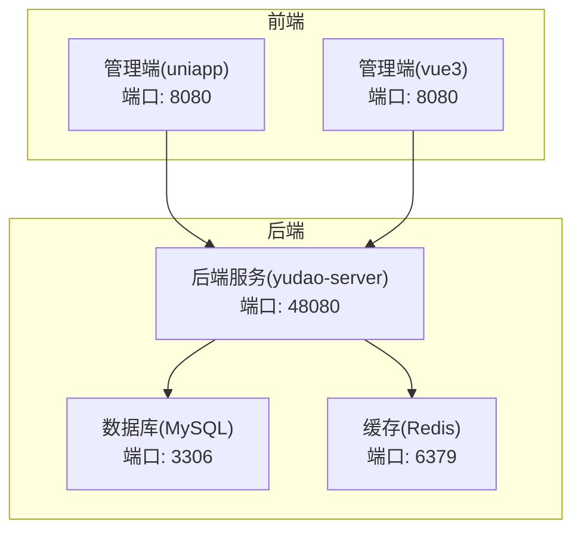
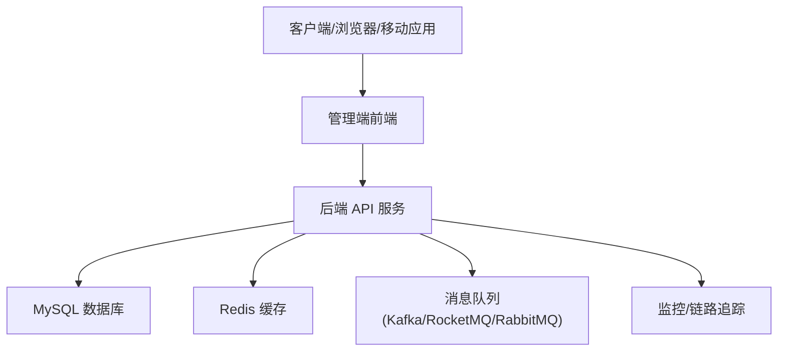
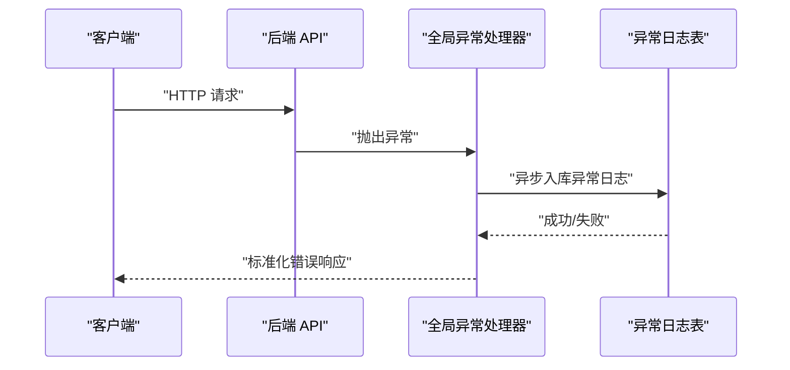
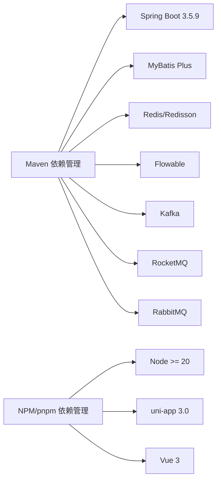

# 常见问题与故障排查

<cite>
**本文引用的文件**
- [README.md](file://README.md)
- [pom.xml](file://backend/pom.xml)
- [docker-compose.yml](file://backend/script/docker/docker-compose.yml)
- [docker.env](file://backend/script/docker/docker.env)
- [application.yaml](file://backend/yudao-server/src/main/resources/application.yaml)
- [ruoyi-vue-pro.sql](file://backend/sql/mysql/ruoyi-vue-pro.sql)
- [GlobalExceptionHandler.java](file://backend/yudao-framework/yudao-spring-boot-starter-web/src/main/java/cn/iocoder/yudao/framework/web/core/handler/GlobalExceptionHandler.java)
- [YudaoMetricsAutoConfiguration.java](file://backend/yudao-framework/yudao-spring-boot-starter-monitor/src/main/java/cn/iocoder/yudao/framework/tracer/config/YudaoMetricsAutoConfiguration.java)
- [package.json](file://frontend/admin-uniapp/package.json)
</cite>

## 目录
1. [简介](#简介)
2. [项目结构](#项目结构)
3. [核心组件](#核心组件)
4. [架构总览](#架构总览)
5. [详细组件分析](#详细组件分析)
6. [依赖分析](#依赖分析)
7. [性能考虑](#性能考虑)
8. [故障排查指南](#故障排查指南)
9. [结论](#结论)
10. [附录](#附录)

## 简介
本指南面向使用 AgenticCPS 的用户与运维人员，聚焦安装、配置、使用过程中的常见问题与排障方法，涵盖启动失败、数据库连接、API 错误、性能问题、环境兼容性、版本冲突、依赖缺失、日志分析、错误码解释、修复步骤、性能调优、资源监控与容量规划、社区支持与升级维护建议。目标是帮助你在最短时间内定位并解决问题。

## 项目结构
AgenticCPS 采用前后端分离架构，后端为多模块 Maven 工程，前端包含 UniApp 管理端与 Vue3 管理端。系统通过 Docker Compose 提供一键本地部署方案，包含 MySQL 与 Redis 服务及后端 Server 与管理端 UI。

**图表来源**
- [docker-compose.yml:1-85](file://backend/script/docker/docker-compose.yml#L1-L85)
- [application.yaml:32-96](file://backend/yudao-server/src/main/resources/application.yaml#L32-L96)

**章节来源**
- [README.md:305-342](file://README.md#L305-L342)
- [docker-compose.yml:1-85](file://backend/script/docker/docker-compose.yml#L1-L85)
- [application.yaml:1-362](file://backend/yudao-server/src/main/resources/application.yaml#L1-L362)

## 核心组件
- 后端服务容器：提供 API、定时任务、MCP 工具、监控与链路追踪等能力。
- 数据库容器：初始化系统与业务表结构，支撑 API 访问日志与异常日志等。
- 缓存容器：提供 Redis 缓存与分布式能力，支撑会话、验证码、限流等。
- 前端管理端：提供管理后台与移动端多端适配，通过后端 API 获取数据。

**章节来源**
- [application.yaml:1-362](file://backend/yudao-server/src/main/resources/application.yaml#L1-L362)
- [docker-compose.yml:1-85](file://backend/script/docker/docker-compose.yml#L1-L85)

## 架构总览
系统通过 Docker Compose 将后端、数据库与缓存组合运行，前端通过后端暴露的 API 进行交互。后端使用 Spring Boot 3.5.9、MyBatis Plus、Redis、Flowable、Micrometer/SkyWalking 等组件，具备完善的日志、监控与链路追踪能力。

**图表来源**
- [application.yaml:55-225](file://backend/yudao-server/src/main/resources/application.yaml#L55-L225)
- [docker-compose.yml:1-85](file://backend/script/docker/docker-compose.yml#L1-L85)

## 详细组件分析

### 启动与部署问题
- 症状：容器启动后访问 48080 端口无响应、管理端 8080 端口无法打开。
- 排查要点：
  - 检查后端容器日志，确认数据库连接参数、Redis 连接参数是否正确。
  - 确认数据库初始化 SQL 已成功导入。
  - 确认容器间网络连通性（服务名与端口映射）。
- 修复步骤：
  - 校验 docker.env 中的数据库与 Redis 连接参数。
  - 确认 docker-compose.yml 中的环境变量与卷挂载。
  - 重新构建镜像并重启服务。

**章节来源**
- [docker-compose.yml:1-85](file://backend/script/docker/docker-compose.yml#L1-L85)
- [docker.env:1-26](file://backend/script/docker/docker.env#L1-L26)

### 数据库连接问题
- 症状：后端启动报数据库连接失败、超时或认证错误。
- 排查要点：
  - 检查 MASTER/SLAVE 数据源 URL、用户名、密码是否一致且正确。
  - 确认 MySQL 容器已就绪，端口 3306 可访问。
  - 确认初始化 SQL 已挂载并执行。
- 修复步骤：
  - 在 docker.env 中修正数据库连接参数。
  - 在 application.yaml 中核对数据源配置。
  - 确认 ruoyi-vue-pro.sql 已导入。

**章节来源**
- [docker.env:8-13](file://backend/script/docker/docker.env#L8-L13)
- [application.yaml:400-420](file://backend/yudao-server/src/main/resources/application.yaml#L400-L420)
- [ruoyi-vue-pro.sql:1-200](file://backend/sql/mysql/ruoyi-vue-pro.sql#L1-L200)

### 缓存连接问题
- 症状：缓存读写失败、验证码失效、限流异常。
- 排查要点：
  - 检查 Redis 主机与端口配置。
  - 确认 Redis 容器健康状态。
- 修复步骤：
  - 在 docker-compose.yml 中核对 REDIS_HOST。
  - 在 application.yaml 中核对 Redis 配置。

**章节来源**
- [docker-compose.yml:53-56](file://backend/script/docker/docker-compose.yml#L53-L56)
- [application.yaml:90-96](file://backend/yudao-server/src/main/resources/application.yaml#L90-L96)

### API 访问与异常处理
- 症状：接口报错、异常未被捕获、日志缺失。
- 排查要点：
  - 后端异常统一由全局异常处理器捕获并落库。
  - 检查异常日志表结构与字段完整性。
- 修复步骤：
  - 确认异常日志表已初始化。
  - 核对异常处理器日志落库逻辑。

**图表来源**
- [GlobalExceptionHandler.java:345-368](file://backend/yudao-framework/yudao-spring-boot-starter-web/src/main/java/cn/iocoder/yudao/framework/web/core/handler/GlobalExceptionHandler.java#L345-L368)
- [ruoyi-vue-pro.sql:60-94](file://backend/sql/mysql/ruoyi-vue-pro.sql#L60-L94)

**章节来源**
- [GlobalExceptionHandler.java:345-368](file://backend/yudao-framework/yudao-spring-boot-starter-web/src/main/java/cn/iocoder/yudao/framework/web/core/handler/GlobalExceptionHandler.java#L345-L368)
- [ruoyi-vue-pro.sql:60-94](file://backend/sql/mysql/ruoyi-vue-pro.sql#L60-L94)

### 前端构建与运行问题
- 症状：前端依赖安装失败、构建报错、运行时报 Node 版本不兼容。
- 排查要点：
  - 检查 package.json 中 Node 与 pnpm 版本要求。
  - 确认本地 Node 版本满足 >= 20，pnpm >= 9。
- 修复步骤：
  - 升级 Node 至 20+，安装 pnpm 9+。
  - 清理缓存后重新安装依赖。

**章节来源**
- [package.json:25-28](file://frontend/admin-uniapp/package.json#L25-L28)
- [package.json:92-98](file://frontend/admin-uniapp/package.json#L92-L98)

### 性能与监控
- 症状：接口响应慢、CPU/内存占用高、链路追踪缺失。
- 排查要点：
  - 启用 Micrometer 与通用标签，确认指标上报。
  - 检查链路追踪与日志中心配置。
- 修复步骤：
  - 在 application.yaml 中启用监控与链路追踪。
  - 配置 SkyWalking 或 Micrometer 采集端。

**章节来源**
- [application.yaml:1-362](file://backend/yudao-server/src/main/resources/application.yaml#L1-L362)
- [YudaoMetricsAutoConfiguration.java:1-27](file://backend/yudao-framework/yudao-spring-boot-starter-monitor/src/main/java/cn/iocoder/yudao/framework/tracer/config/YudaoMetricsAutoConfiguration.java#L1-L27)

## 依赖分析
- 后端依赖管理：
  - Spring Boot 3.5.9、MyBatis Plus、Redis、Flowable、Micrometer、Kafka/RocketMQ/RabbitMQ 等。
  - Maven 仓库使用华为云/阿里云镜像加速。
- 前端依赖管理：
  - Node >= 20、pnpm >= 9，使用 uni-app 3.0 与 Vue 3 生态。

**图表来源**
- [pom.xml:1-176](file://backend/pom.xml#L1-L176)
- [application.yaml:286-362](file://backend/yudao-server/src/main/resources/application.yaml#L286-L362)
- [package.json:25-28](file://frontend/admin-uniapp/package.json#L25-L28)

**章节来源**
- [pom.xml:1-176](file://backend/pom.xml#L1-L176)
- [package.json:25-28](file://frontend/admin-uniapp/package.json#L25-L28)

## 性能考虑
- 性能指标（后端侧）：
  - 单平台搜索 P99 < 2 秒，多平台比价 P99 < 5 秒，转链生成 < 1 秒，订单同步延迟 < 30 分钟，MCP 工具调用 < 3 秒（搜索类）/ < 1 秒（查询类）。
- 优化建议：
  - 合理设置 JVM 内存（JAVA_OPTS），避免频繁 GC。
  - 使用 Redis 缓存热点数据，降低数据库压力。
  - 对慢查询与高频接口进行索引优化与接口限流。
  - 启用链路追踪与指标监控，定位瓶颈。

**章节来源**
- [README.md:332-342](file://README.md#L332-L342)
- [application.yaml:1-362](file://backend/yudao-server/src/main/resources/application.yaml#L1-L362)

## 故障排查指南

### 启动失败
- 症状：容器启动即退出或长时间卡住。
- 可能原因：
  - 环境变量缺失或错误（数据库、Redis、端口映射）。
  - 依赖服务未就绪（MySQL/Redis 未启动）。
  - 端口冲突（48080/8080/3306/6379）。
- 修复步骤：
  - 检查 docker-compose.yml 与 docker.env。
  - 使用 docker compose logs 查看具体错误。
  - 释放冲突端口或调整映射。

**章节来源**
- [docker-compose.yml:1-85](file://backend/script/docker/docker-compose.yml#L1-L85)
- [docker.env:1-26](file://backend/script/docker/docker.env#L1-L26)

### 数据库连接失败
- 症状：启动报错“无法连接数据库”、“认证失败”、“连接超时”。
- 可能原因：
  - MASTER/SLAVE 数据源配置不一致。
  - 初始化 SQL 未导入或表结构缺失。
  - MySQL 容器未就绪或端口不可达。
- 修复步骤：
  - 在 docker.env 中统一 MASTER/SLAVE 连接参数。
  - 确认 ruoyi-vue-pro.sql 已挂载并执行。
  - 检查 MySQL 容器日志与端口映射。

**章节来源**
- [docker.env:8-13](file://backend/script/docker/docker.env#L8-L13)
- [ruoyi-vue-pro.sql:1-200](file://backend/sql/mysql/ruoyi-vue-pro.sql#L1-L200)

### 缓存连接失败
- 症状：验证码无效、限流异常、缓存读写失败。
- 可能原因：
  - REDIS_HOST 配置错误或容器未启动。
  - Redis 容器端口未映射或被防火墙阻断。
- 修复步骤：
  - 在 docker-compose.yml 中核对 REDIS_HOST。
  - 检查 Redis 容器健康状态与端口映射。

**章节来源**
- [docker-compose.yml:53-56](file://backend/script/docker/docker-compose.yml#L53-L56)

### API 错误与异常
- 症状：接口报 500、异常未落库、错误信息不明确。
- 可能原因：
  - 未启用异常日志落库或异常表未初始化。
  - 全局异常处理器未生效。
- 修复步骤：
  - 确认异常日志表已初始化。
  - 检查全局异常处理器配置与日志落库逻辑。

**章节来源**
- [GlobalExceptionHandler.java:345-368](file://backend/yudao-framework/yudao-spring-boot-starter-web/src/main/java/cn/iocoder/yudao/framework/web/core/handler/GlobalExceptionHandler.java#L345-L368)
- [ruoyi-vue-pro.sql:60-94](file://backend/sql/mysql/ruoyi-vue-pro.sql#L60-L94)

### 前端构建失败
- 症状：npm install/pnpm 安装失败、构建报错、运行时报 Node 版本不兼容。
- 可能原因：
  - Node 版本低于 20，pnpm 版本低于 9。
  - 网络环境不佳导致依赖下载失败。
- 修复步骤：
  - 升级 Node 至 20+，安装 pnpm 9+。
  - 清理缓存后重试安装。

**章节来源**
- [package.json:25-28](file://frontend/admin-uniapp/package.json#L25-L28)
- [package.json:92-98](file://frontend/admin-uniapp/package.json#L92-L98)

### 性能问题
- 症状：接口响应慢、CPU/内存占用高、链路追踪缺失。
- 可能原因：
  - 未启用监控与链路追踪。
  - 缓存未命中、慢查询未优化。
- 修复步骤：
  - 在 application.yaml 中启用 Micrometer 与链路追踪。
  - 配置 SkyWalking 或 Micrometer 采集端。
  - 对热点接口与数据库查询进行优化。

**章节来源**
- [application.yaml:1-362](file://backend/yudao-server/src/main/resources/application.yaml#L1-L362)
- [YudaoMetricsAutoConfiguration.java:1-27](file://backend/yudao-framework/yudao-spring-boot-starter-monitor/src/main/java/cn/iocoder/yudao/framework/tracer/config/YudaoMetricsAutoConfiguration.java#L1-L27)

### 环境兼容性与版本冲突
- 症状：编译失败、运行时类找不到、依赖冲突。
- 可能原因：
  - JDK 版本不满足（要求 17 或 21）。
  - Maven/Node/pnpm 版本过低。
- 修复步骤：
  - 使用 JDK 17 或 21。
  - 升级 Maven 至 3.8+，Node 至 20+，pnpm 至 9+。

**章节来源**
- [README.md:307-316](file://README.md#L307-L316)
- [pom.xml:32-45](file://backend/pom.xml#L32-L45)
- [package.json:25-28](file://frontend/admin-uniapp/package.json#L25-L28)

### 依赖缺失
- 症状：运行时报缺少类或资源文件。
- 可能原因：
  - 未执行完整初始化脚本或依赖未安装。
- 修复步骤：
  - 确认 ruoyi-vue-pro.sql 已导入。
  - 重新安装前端依赖并清理缓存。

**章节来源**
- [ruoyi-vue-pro.sql:1-200](file://backend/sql/mysql/ruoyi-vue-pro.sql#L1-L200)
- [package.json:92-98](file://frontend/admin-uniapp/package.json#L92-L98)

### 日志分析方法
- API 访问日志与异常日志：
  - 访问日志表包含请求方法、URL、参数、耗时、结果码等。
  - 异常日志表包含异常名、消息、根因、堆栈、类名、方法名等。
- 分析步骤：
  - 通过异常日志表定位异常根因。
  - 结合链路追踪与监控指标定位性能瓶颈。

**章节来源**
- [ruoyi-vue-pro.sql:20-94](file://backend/sql/mysql/ruoyi-vue-pro.sql#L20-L94)

### 错误代码解释与修复
- 常见错误类型：
  - 数据库连接错误：检查 MASTER/SLAVE 连接参数与初始化 SQL。
  - 缓存连接错误：检查 REDIS_HOST 与容器健康状态。
  - 前端依赖错误：检查 Node/pnpm 版本与网络环境。
  - 全局异常：确认异常日志表已初始化与异常处理器生效。
- 修复建议：
  - 逐项核对配置文件与环境变量。
  - 使用容器日志与数据库日志交叉定位问题。

**章节来源**
- [docker.env:8-13](file://backend/script/docker/docker.env#L8-L13)
- [docker-compose.yml:53-56](file://backend/script/docker/docker-compose.yml#L53-L56)
- [package.json:25-28](file://frontend/admin-uniapp/package.json#L25-L28)
- [GlobalExceptionHandler.java:345-368](file://backend/yudao-framework/yudao-spring-boot-starter-web/src/main/java/cn/iocoder/yudao/framework/web/core/handler/GlobalExceptionHandler.java#L345-L368)

### 性能调优建议
- JVM 参数：合理设置 JAVA_OPTS，避免频繁 Full GC。
- 缓存策略：热点数据放入 Redis，设置合理 TTL。
- 数据库优化：为高频查询建立索引，避免慢查询。
- 监控与告警：启用 Micrometer 与链路追踪，设置阈值告警。

**章节来源**
- [docker.env](file://backend/script/docker/docker.env#L6)
- [application.yaml:1-362](file://backend/yudao-server/src/main/resources/application.yaml#L1-L362)

### 资源使用监控与容量规划
- 监控指标：
  - CPU/内存/磁盘 IO、数据库连接数、Redis 命中率、接口 P99 延迟。
- 容量规划：
  - 根据业务峰值与增长趋势预留资源，结合慢查询与链路追踪结果进行容量评估。

**章节来源**
- [README.md:332-342](file://README.md#L332-L342)
- [application.yaml:1-362](file://backend/yudao-server/src/main/resources/application.yaml#L1-L362)

### 社区支持与升级维护
- 社区渠道：
  - 微信群、知识星球、GitHub Issues。
- 升级维护建议：
  - 关注版本变更与依赖升级，按需进行灰度验证。
  - 定期备份数据库与配置，确保可回滚。

**章节来源**
- [README.md:413-429](file://README.md#L413-L429)

## 结论
通过本指南，你可以系统地排查与解决安装、配置、使用过程中的常见问题，并掌握日志分析、性能调优与容量规划的方法。建议在生产环境中启用完善的监控与链路追踪，定期进行压测与容量评估，确保系统稳定高效运行。

## 附录

### 快速检查清单
- 后端：数据库连接参数、Redis 连接参数、端口映射、容器日志。
- 前端：Node/pnpm 版本、依赖安装、构建命令。
- 性能：JVM 参数、缓存命中率、慢查询、监控指标。
- 日志：异常日志表初始化、全局异常处理器、链路追踪。

**章节来源**
- [docker-compose.yml:1-85](file://backend/script/docker/docker-compose.yml#L1-L85)
- [docker.env:1-26](file://backend/script/docker/docker.env#L1-L26)
- [package.json:25-28](file://frontend/admin-uniapp/package.json#L25-L28)
- [application.yaml:1-362](file://backend/yudao-server/src/main/resources/application.yaml#L1-L362)
- [GlobalExceptionHandler.java:345-368](file://backend/yudao-framework/yudao-spring-boot-starter-web/src/main/java/cn/iocoder/yudao/framework/web/core/handler/GlobalExceptionHandler.java#L345-L368)