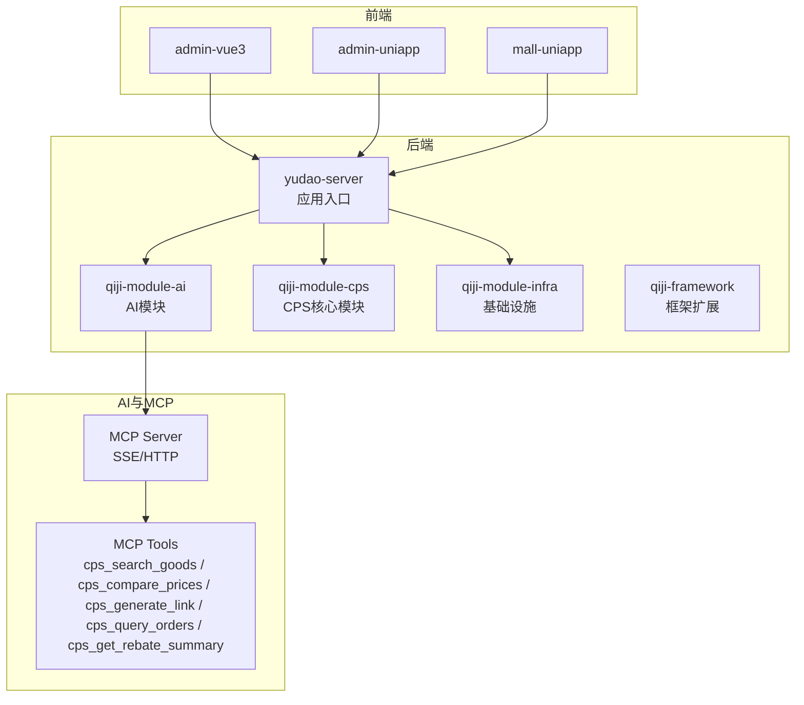
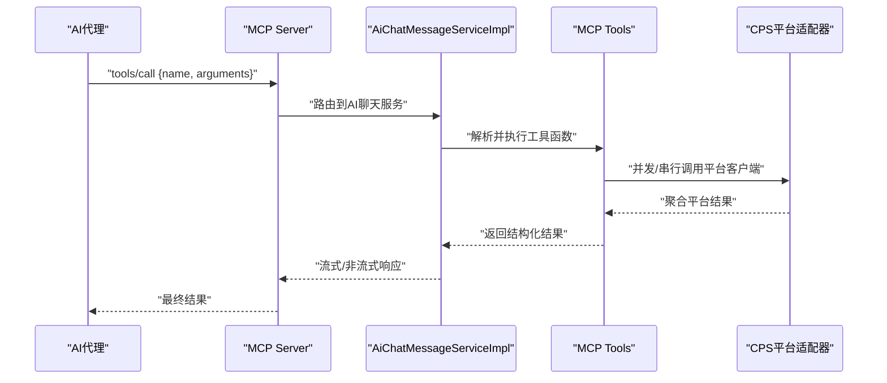
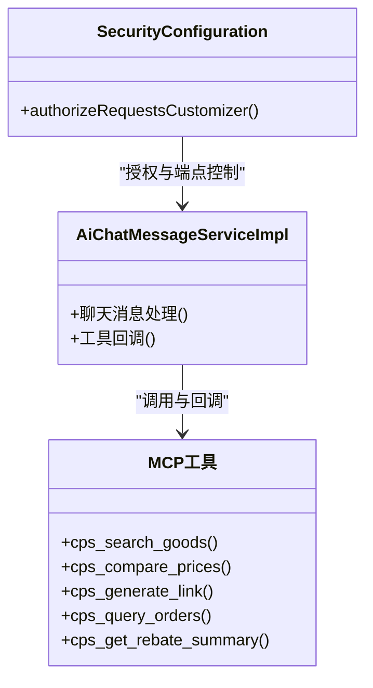
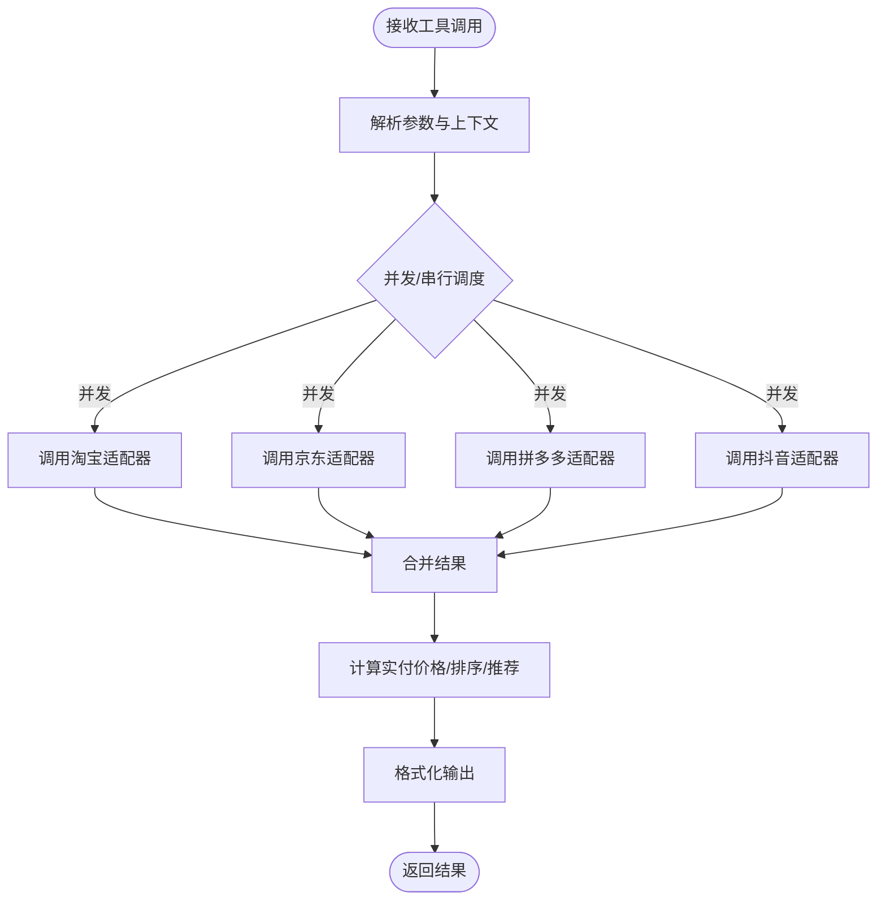
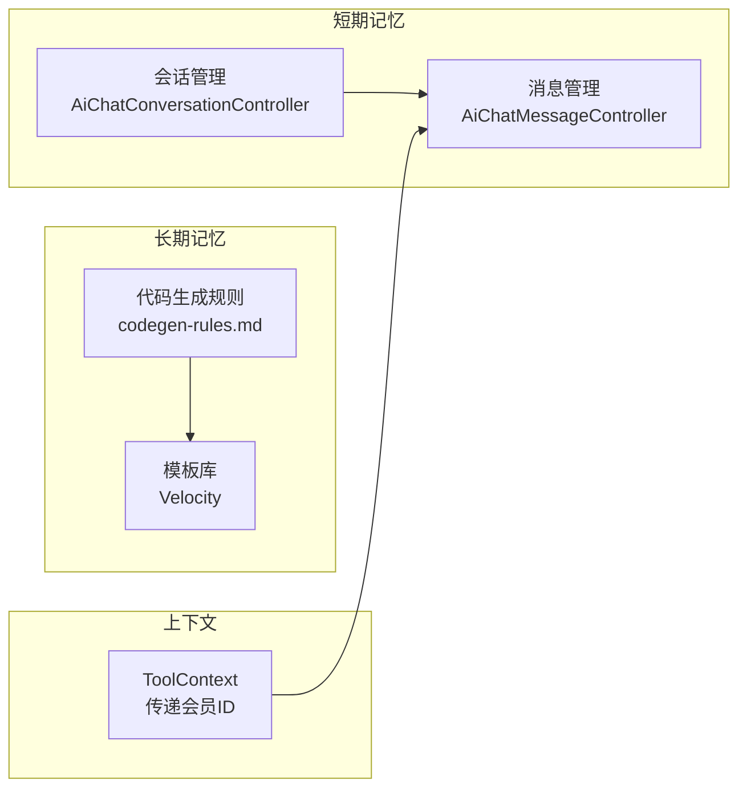
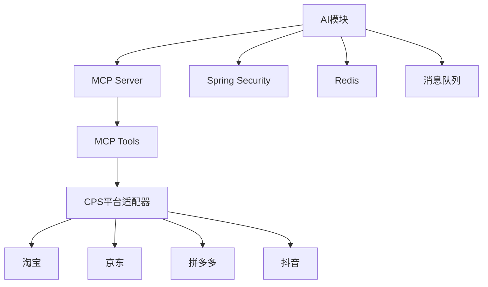

# AI代理管理

<cite>
**本文引用的文件**
- [AGENTS.md](file://AGENTS.md)
- [MEMORY.md](file://agent_improvement/memory/MEMORY.md)
- [codegen-rules.md](file://agent_improvement/memory/codegen-rules.md)
- [AiChatMessageServiceImpl.java](file://backend/qiji-module-ai/src/main/java/com/qiji/cps/module/ai/service/chat/AiChatMessageServiceImpl.java)
- [SecurityConfiguration.java](file://backend/qiji-module-ai/src/main/java/com/qiji/cps/module/ai/framework/security/config/SecurityConfiguration.java)
- [application-local.yaml](file://backend/qiji-server/src/main/resources/application-local.yaml)
- [CPS系统PRD文档.md](file://docs/CPS系统PRD文档.md)
</cite>

## 目录
1. [简介](#简介)
2. [项目结构](#项目结构)
3. [核心组件](#核心组件)
4. [架构总览](#架构总览)
5. [详细组件分析](#详细组件分析)
6. [依赖关系分析](#依赖关系分析)
7. [性能优化策略](#性能优化策略)
8. [监控与维护](#监控与维护)
9. [配置管理与安全策略](#配置管理与安全策略)
10. [故障排查指南](#故障排查指南)
11. [结论](#结论)
12. [附录](#附录)

## 简介
本指南面向AI代理管理与运维人员，围绕AgenticCPS系统中的AI代理能力，提供角色定义、技能模板设计、记忆系统使用、性能优化、监控维护、配置与安全策略等管理要点，并结合仓库中的MCP集成、AI聊天服务与代码生成规则，给出可操作的实践路径与参考示例。

## 项目结构
AgenticCPS是一个基于ruoyi-vue-pro的CPS联盟返利系统，后端采用Spring Boot生态，前端包含Vue3与uni-app多端应用。AI能力通过Spring AI与MCP协议集成，提供零代码接入的工具函数（如商品搜索、跨平台比价、推广链接生成、订单查询、返利汇总）。

图表来源
- [AGENTS.md:11-62](file://AGENTS.md#L11-L62)
- [AGENTS.md:170-189](file://AGENTS.md#L170-L189)

章节来源
- [AGENTS.md:5-62](file://AGENTS.md#L5-L62)

## 核心组件
- AI模块与MCP集成：提供AI聊天服务与MCP工具注册，支持SSE与HTTP传输，具备API Key鉴权与访问日志记录。
- CPS平台适配器：策略模式封装淘宝、京东、拼多多、抖音等平台对接，统一抽象接口，便于扩展新平台。
- MCP工具函数：封装跨平台商品搜索、价格比较、推广链接生成、订单查询、返利汇总等原子能力。
- 代码生成规则：基于Velocity模板的前后端代码生成规范，覆盖DO/Mapper/Service/Controller/VO分层与多前端模板。

章节来源
- [AGENTS.md:170-189](file://AGENTS.md#L170-L189)
- [AGENTS.md:150-168](file://AGENTS.md#L150-L168)
- [codegen-rules.md:5-29](file://agent_improvement/memory/codegen-rules.md#L5-L29)

## 架构总览
AI代理通过MCP协议直接调用CPS系统的工具函数，无需编写后端代码。AI模块负责安全策略、消息处理与工具回调，CPS模块提供平台适配与业务数据。

图表来源
- [AGENTS.md:170-189](file://AGENTS.md#L170-L189)
- [AiChatMessageServiceImpl.java:44-69](file://backend/qiji-module-ai/src/main/java/com/qiji/cps/module/ai/service/chat/AiChatMessageServiceImpl.java#L44-L69)

章节来源
- [AGENTS.md:170-189](file://AGENTS.md#L170-L189)
- [AiChatMessageServiceImpl.java:44-69](file://backend/qiji-module-ai/src/main/java/com/qiji/cps/module/ai/service/chat/AiChatMessageServiceImpl.java#L44-L69)

## 详细组件分析

### 组件A：AI代理角色与权限
- 角色类型：公共查询（public）、会员操作（member）、管理权限（admin）三档权限级别，用于区分MCP工具的可访问范围。
- 权限配置：通过API Key管理界面配置权限级别与限流规则，支持启用/禁用与备注说明。
- 行为约束：MCP端点仅允许SSE与HTTP访问，配合Spring Security进行授权控制。
- 交互模式：AI代理以JSON-RPC 2.0通过Streamable HTTP调用工具函数，上下文传递当前登录会员ID。

图表来源
- [SecurityConfiguration.java:25-30](file://backend/qiji-module-ai/src/main/java/com/qiji/cps/module/ai/framework/security/config/SecurityConfiguration.java#L25-L30)
- [AiChatMessageServiceImpl.java:44-69](file://backend/qiji-module-ai/src/main/java/com/qiji/cps/module/ai/service/chat/AiChatMessageServiceImpl.java#L44-L69)
- [AGENTS.md:170-189](file://AGENTS.md#L170-L189)

章节来源
- [AGENTS.md:694-737](file://docs/CPS系统PRD文档.md#L694-L737)
- [SecurityConfiguration.java:25-30](file://backend/qiji-module-ai/src/main/java/com/qiji/cps/module/ai/framework/security/config/SecurityConfiguration.java#L25-L30)

### 组件B：技能模板设计（MCP工具）
- 模板结构：工具函数以“工具名”注册，参数与返回值遵循统一契约，支持分页、筛选、并发调用平台客户端。
- 参数配置：工具参数包含关键词、价格区间、平台过滤、分页参数等；可通过管理后台配置默认值与限制。
- 执行逻辑：工具内部并发/串行调用平台适配器，聚合结果并进行排序/推荐（如最低价、最高返利、综合最优）。
- 结果格式：结构化商品信息列表、推荐理由、购买建议与注意事项。

图表来源
- [AGENTS.md:170-189](file://AGENTS.md#L170-L189)
- [CPS系统PRD文档.md:662-677](file://docs/CPS系统PRD文档.md#L662-L677)

章节来源
- [AGENTS.md:170-189](file://AGENTS.md#L170-L189)
- [CPS系统PRD文档.md:662-677](file://docs/CPS系统PRD文档.md#L662-L677)

### 组件C：记忆系统与代码生成
- 短期记忆：AI聊天服务的消息历史由会话与消息控制器管理，支持分页查询与导出。
- 长期记忆：通过代码生成规则沉淀业务模板，确保前后端一致性与可复用性。
- 知识检索：基于Velocity模板库的生成规范，覆盖DO/Mapper/Service/Controller/VO分层与多前端模板。
- 上下文管理：工具调用通过ToolContext传递当前登录会员ID，确保订单归属与权限隔离。

图表来源
- [MEMORY.md:1-21](file://agent_improvement/memory/MEMORY.md#L1-L21)
- [codegen-rules.md:5-29](file://agent_improvement/memory/codegen-rules.md#L5-L29)
- [AiChatMessageServiceImpl.java:44-69](file://backend/qiji-module-ai/src/main/java/com/qiji/cps/module/ai/service/chat/AiChatMessageServiceImpl.java#L44-L69)

章节来源
- [MEMORY.md:1-21](file://agent_improvement/memory/MEMORY.md#L1-L21)
- [codegen-rules.md:5-29](file://agent_improvement/memory/codegen-rules.md#L5-L29)
- [AiChatMessageServiceImpl.java:44-69](file://backend/qiji-module-ai/src/main/java/com/qiji/cps/module/ai/service/chat/AiChatMessageServiceImpl.java#L44-L69)

## 依赖关系分析
- 组件耦合：AI模块依赖MCP工具与CPS平台适配器；MCP工具依赖平台客户端；平台客户端通过策略模式解耦具体平台。
- 外部依赖：Spring AI、Spring Security、Quartz、Redis、RocketMQ/RabbitMQ/Kafka等。
- 安全边界：MCP端点受Spring Security保护，API Key用于鉴权与限流。

图表来源
- [AGENTS.md:150-168](file://AGENTS.md#L150-L168)
- [AGENTS.md:170-189](file://AGENTS.md#L170-L189)
- [application-local.yaml:121-135](file://backend/qiji-server/src/main/resources/application-local.yaml#L121-L135)

章节来源
- [AGENTS.md:150-168](file://AGENTS.md#L150-L168)
- [application-local.yaml:121-135](file://backend/qiji-server/src/main/resources/application-local.yaml#L121-L135)

## 性能优化策略
- 资源管理：合理配置数据库连接池（Druid）、Redis连接与线程池大小；Quartz线程池大小与misfire阈值需结合业务负载调整。
- 并发控制：MCP工具支持并发调用平台客户端，需设置超时与重试策略，避免雪崩效应。
- 缓存机制：利用Redis缓存热点商品信息与API Key鉴权结果，降低数据库与第三方平台压力。
- 响应时间优化：对高频工具（如商品搜索、跨平台比价）进行异步化与结果缓存；前端分页与懒加载减少一次性数据传输。

章节来源
- [application-local.yaml:32-47](file://backend/qiji-server/src/main/resources/application-local.yaml#L32-L47)
- [application-local.yaml:112-116](file://backend/qiji-server/src/main/resources/application-local.yaml#L112-L116)
- [AGENTS.md:357-368](file://AGENTS.md#L357-L368)

## 监控与维护
- 状态监控：通过Actuator端点与Spring Boot Admin查看应用健康、指标与日志；关注MCP工具调用次数与成功率。
- 日志分析：开启AI模块与CPS模块Mapper日志，定位慢SQL与异常；结合访问日志表分析工具使用情况。
- 性能评估：建立P99延迟目标（商品搜索、跨平台比价、工具调用），定期压测与容量规划。
- 故障处理：启用Quartz作业等待完成与集群检查；对消息队列进行死信与重试策略配置。

章节来源
- [application-local.yaml:146-166](file://backend/qiji-server/src/main/resources/application-local.yaml#L146-L166)
- [application-local.yaml:172-192](file://backend/qiji-server/src/main/resources/application-local.yaml#L172-L192)
- [AGENTS.md:357-368](file://AGENTS.md#L357-L368)

## 配置管理与安全策略
- 配置管理：本地开发使用application-local.yaml集中管理数据库、Redis、消息队列、监控与微信配置；Docker环境通过环境变量注入。
- 版本控制：MCP工具与API Key配置纳入版本管理，变更需走评审与灰度发布。
- 安全策略：MCP端点仅允许SSE与HTTP访问；API Key分级（public/member/admin）与限流；访问日志记录工具名、参数、耗时与来源IP。

章节来源
- [AGENTS.md:236-264](file://AGENTS.md#L236-L264)
- [AGENTS.md:182-188](file://AGENTS.md#L182-L188)
- [SecurityConfiguration.java:25-30](file://backend/qiji-module-ai/src/main/java/com/qiji/cps/module/ai/framework/security/config/SecurityConfiguration.java#L25-L30)

## 故障排查指南
- MCP工具调用失败：检查API Key是否启用、权限级别是否匹配、限流是否触发；查看访问日志表与AI模块日志。
- 并发超时：调整平台客户端超时与重试策略，必要时降级为串行调用；增加Redis缓存命中率。
- 数据库慢查询：开启Druid慢SQL记录，定位Mapper日志，优化分页与索引；评估读写分离与从库配置。
- 消息队列积压：检查消费者线程池与并发度，配置死信队列与重试上限，监控堆积趋势。

章节来源
- [application-local.yaml:16-32](file://backend/qiji-server/src/main/resources/application-local.yaml#L16-L32)
- [application-local.yaml:172-192](file://backend/qiji-server/src/main/resources/application-local.yaml#L172-L192)
- [AGENTS.md:182-188](file://AGENTS.md#L182-L188)

## 结论
AgenticCPS通过MCP协议与Spring AI实现了AI代理的零代码接入与统一工具编排。依托策略模式的平台适配器与完善的代码生成规则，系统在可扩展性、一致性与可维护性方面具备优势。通过合理的资源配置、并发控制、缓存与监控体系，可满足高并发场景下的性能与稳定性要求。

## 附录
- 实际配置示例与操作指南可参考以下文件路径：
  - [application-local.yaml](file://backend/qiji-server/src/main/resources/application-local.yaml)
  - [MCP工具与API Key管理（PRD）:694-737](file://docs/CPS系统PRD文档.md#L694-L737)
  - [AI聊天与MCP集成（代码）](file://backend/qiji-module-ai/src/main/java/com/qiji/cps/module/ai/service/chat/AiChatMessageServiceImpl.java)
  - [安全配置（代码）](file://backend/qiji-module-ai/src/main/java/com/qiji/cps/module/ai/framework/security/config/SecurityConfiguration.java)
  - [代码生成规则（模板）](file://agent_improvement/memory/codegen-rules.md)