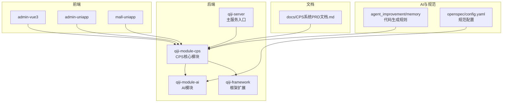
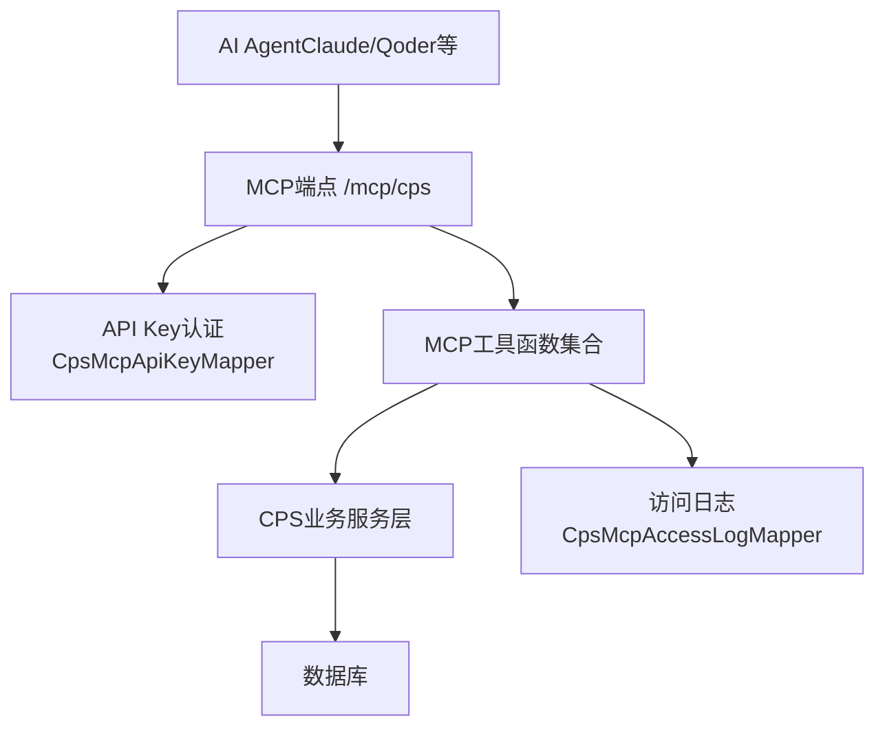
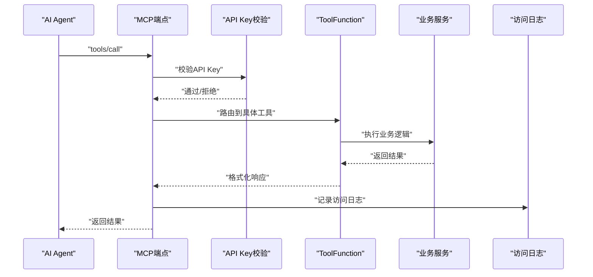
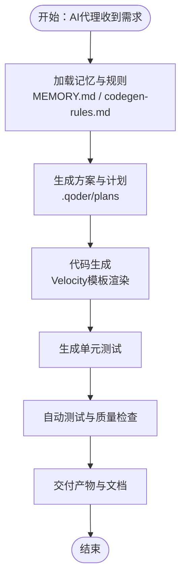
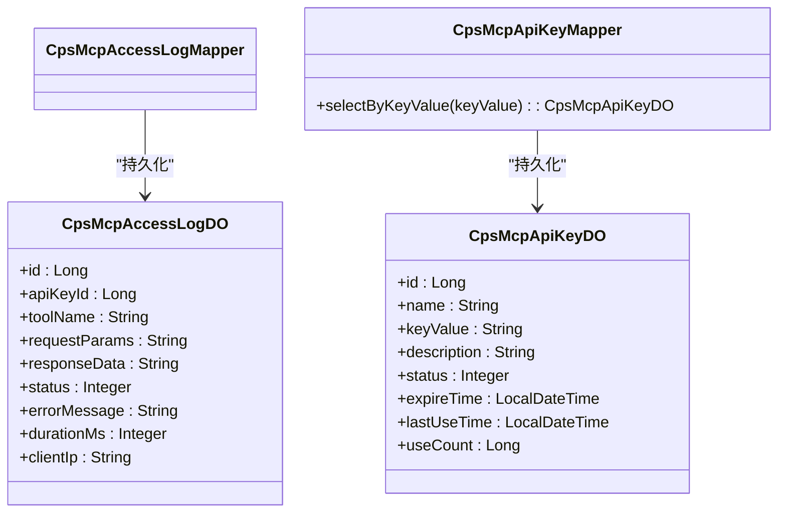
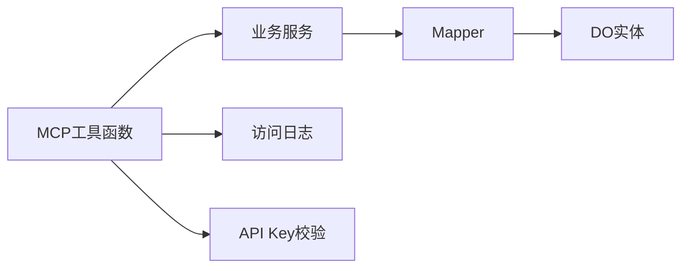
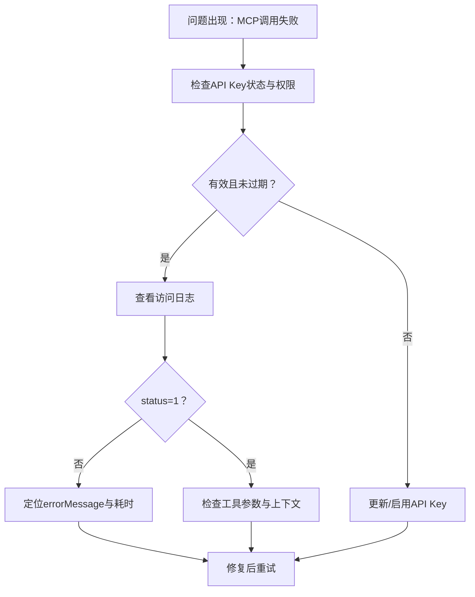

# AI编程指南

<cite>
**本文引用的文件**   
- [README.md](file://README.md)
- [AGENTS.md](file://AGENTS.md)
- [MEMORY.md](file://agent_improvement/memory/MEMORY.md)
- [codegen-rules.md](file://agent_improvement/memory/codegen-rules.md)
- [config.yaml](file://openspec/config.yaml)
- [CpsSearchGoodsToolFunction.java](file://backend/qiji-module-cps/qiji-module-cps-biz/src/main/java/com/qiji/cps/module/cps/mcp/tool/CpsSearchGoodsToolFunction.java)
- [CpsComparePricesToolFunction.java](file://backend/qiji-module-cps/qiji-module-cps-biz/src/main/java/com/qiji/cps/module/cps/mcp/tool/CpsComparePricesToolFunction.java)
- [CpsGenerateLinkToolFunction.java](file://backend/qiji-module-cps/qiji-module-cps-biz/src/main/java/com/qiji/cps/module/cps/mcp/tool/CpsGenerateLinkToolFunction.java)
- [CpsQueryOrdersToolFunction.java](file://backend/qiji-module-cps/qiji-module-cps-biz/src/main/java/com/qiji/cps/module/cps/mcp/tool/CpsQueryOrdersToolFunction.java)
- [CpsGetRebateSummaryToolFunction.java](file://backend/qiji-module-cps/qiji-module-cps-biz/src/main/java/com/qiji/cps/module/cps/mcp/tool/CpsGetRebateSummaryToolFunction.java)
- [CpsMcpAccessLogDO.java](file://backend/qiji-module-cps/qiji-module-cps-biz/src/main/java/com/qiji/cps/module/cps/dal/dataobject/mcp/CpsMcpAccessLogDO.java)
- [CpsMcpApiKeyDO.java](file://backend/qiji-module-cps/qiji-module-cps-biz/src/main/java/com/qiji/cps/module/cps/dal/dataobject/mcp/CpsMcpApiKeyDO.java)
- [CpsMcpAccessLogMapper.java](file://backend/qiji-module-cps/qiji-module-cps-biz/src/main/java/com/qiji/cps/module/cps/dal/mysql/mcp/CpsMcpAccessLogMapper.java)
- [CpsMcpApiKeyMapper.java](file://backend/qiji-module-cps/qiji-module-cps-biz/src/main/java/com/qiji/cps/module/cps/dal/mysql/mcp/CpsMcpApiKeyMapper.java)
- [init_cps_test_data.py](file://script/test/init_cps_test_data.py)
- [CPS系统PRD文档.md](file://docs/CPS系统PRD文档.md)
</cite>

## 目录
1. [简介](#简介)
2. [项目结构](#项目结构)
3. [核心组件](#核心组件)
4. [架构总览](#架构总览)
5. [详细组件分析](#详细组件分析)
6. [依赖关系分析](#依赖关系分析)
7. [性能考量](#性能考量)
8. [故障排查指南](#故障排查指南)
9. [结论](#结论)
10. [附录](#附录)

## 简介
本指南面向在 AgenticCPS 项目中开展 AI 编程与自动化开发的工程师与产品人员。围绕 Vibe Coding 工作流、MCP 协议与 AI 工具、AI 代理管理与记忆系统、Velocity 模板驱动的代码生成规则，以及质量保证与调试测试方法，提供系统化的实操指引与最佳实践。

AgenticCPS 是一套融合 Vibe Coding、低代码与 AI 自主编程的 CPS 联盟返利平台，后端采用 Spring Boot 3.5.9 + Spring AI 1.1.2 + MCP 协议，前端覆盖 Vue3 与 UniApp，提供 5 个开箱即用的 MCP AI Tools，支持 AI Agent 直接调用，实现“需求描述 → AI 理解 → AI 编码 → AI 测试 → AI 交付”的闭环。

章节来源
- [README.md: 84-144:84-144](file://README.md#L84-L144)
- [AGENTS.md: 1-62:1-62](file://AGENTS.md#L1-L62)

## 项目结构
- 后端 backend：模块化工程，核心为 qiji-module-cps（CPS 联盟返利），包含 API 定义、业务实现、平台适配器、定时任务、MCP 接口层等。
- 前端 frontend：admin-vue3（Vue3 管理后台）、admin-uniapp（uni-app 移动端管理）、mall-uniapp（电商小程序）。
- agent_improvement：AI 代理改进与记忆库，包含 Velocity 模板驱动的代码生成规则与记忆索引。
- openspec：规范驱动配置，用于约束 AI 产物的上下文与规则。
- docs：PRD 等需求文档，支撑 MCP 管理后台与工具配置说明。

图示来源
- [AGENTS.md: 14-62:14-62](file://AGENTS.md#L14-L62)
- [README.md: 229-249:229-249](file://README.md#L229-L249)

章节来源
- [AGENTS.md: 14-62:14-62](file://AGENTS.md#L14-L62)
- [README.md: 229-249:229-249](file://README.md#L229-L249)

## 核心组件
- Vibe Coding 工作流：以 .qoder/specs 与 .qoder/plans 为约束，结合 AI 代理与技能模板，确保“需求对齐 → 方案设计 → 自主编码 → 验收交付”的高质量闭环。
- MCP 协议与 AI 工具：基于 Spring AI 的 MCP（Model Context Protocol）实现，提供 5 个工具函数，支持流式 HTTP 传输与 JSON-RPC 2.0，具备 API Key 认证、访问日志与限流控制。
- 代码生成与模板：基于 Velocity 模板库的代码生成规则，覆盖后端分层（DO/Service/Controller/Mapper/VO）与前端多套模板（Vue3 Element Plus、Vben、Antd、UniApp），支持通用、树表、ERP 主子表三类模板类型。
- AI 代理与记忆：通过 MEMORY.md 与 codegen-rules.md 形成 Claude Code 的记忆索引与规则集，支撑 AI 代理在生成与重构中的上下文一致性。

章节来源
- [README.md: 113-144:113-144](file://README.md#L113-L144)
- [AGENTS.md: 170-190:170-190](file://AGENTS.md#L170-L190)
- [MEMORY.md: 1-21:1-21](file://agent_improvement/memory/MEMORY.md#L1-L21)
- [codegen-rules.md: 1-30:1-30](file://agent_improvement/memory/codegen-rules.md#L1-L30)

## 架构总览
下图展示了 MCP 工具调用在系统中的位置与交互关系：AI Agent 通过 MCP 端点调用工具函数，工具函数经认证与鉴权后执行业务逻辑，并记录访问日志与 API Key 使用情况。

图示来源
- [AGENTS.md: 182-189:182-189](file://AGENTS.md#L182-L189)
- [CpsMcpAccessLogDO.java: 14-62:14-62](file://backend/qiji-module-cps/qiji-module-cps-biz/src/main/java/com/qiji/cps/module/cps/dal/dataobject/mcp/CpsMcpAccessLogDO.java#L14-L62)
- [CpsMcpApiKeyDO.java: 16-60:16-60](file://backend/qiji-module-cps/qiji-module-cps-biz/src/main/java/com/qiji/cps/module/cps/dal/dataobject/mcp/CpsMcpApiKeyDO.java#L16-L60)

章节来源
- [AGENTS.md: 182-189:182-189](file://AGENTS.md#L182-L189)

## 详细组件分析

### Vibe Coding 工作流
- 规范与计划：.qoder/specs 定义技术标准、架构约束与代码风格；.qoder/plans 明确任务分解、验收标准与交付清单。
- 工作流步骤：需求对齐 → 方案设计 → AI 自主编码 → 自动测试 → 验收报告 → 文档输出。
- 质量保障：自动测试 + 规范约束 + 验收标准，确保 AI 产物符合预期。

章节来源
- [README.md: 113-144:113-144](file://README.md#L113-L144)

### MCP 协议与工具函数
- 协议规范
  - 传输：Streamable HTTP（JSON-RPC 2.0）
  - 端点：/mcp/cps
  - 认证：API Key（CpsMcpApiKeyDO/CpsMcpApiKeyMapper）
  - 访问日志：CpsMcpAccessLogDO/CpsMcpAccessLogMapper
  - 上下文：ToolContext 传递当前登录会员 ID，用于订单归属
- 工具函数清单
  - cps_search_goods：跨平台商品搜索（关键词、平台过滤、价格区间、分页）
  - cps_compare_prices：跨平台比价（最低价/最高返利/综合最优）
  - cps_generate_link：生成带返利追踪的推广链接（短链/长链/口令/移动端）
  - cps_query_orders：查询会员订单与返利状态
  - cps_get_rebate_summary：查询返利账户（余额、待结算、累计、最近记录）

图示来源
- [AGENTS.md: 182-189:182-189](file://AGENTS.md#L182-L189)
- [CpsSearchGoodsToolFunction.java](file://backend/qiji-module-cps/qiji-module-cps-biz/src/main/java/com/qiji/cps/module/cps/mcp/tool/CpsSearchGoodsToolFunction.java)
- [CpsComparePricesToolFunction.java](file://backend/qiji-module-cps/qiji-module-cps-biz/src/main/java/com/qiji/cps/module/cps/mcp/tool/CpsComparePricesToolFunction.java)
- [CpsGenerateLinkToolFunction.java](file://backend/qiji-module-cps/qiji-module-cps-biz/src/main/java/com/qiji/cps/module/cps/mcp/tool/CpsGenerateLinkToolFunction.java)
- [CpsQueryOrdersToolFunction.java](file://backend/qiji-module-cps/qiji-module-cps-biz/src/main/java/com/qiji/cps/module/cps/mcp/tool/CpsQueryOrdersToolFunction.java)
- [CpsGetRebateSummaryToolFunction.java](file://backend/qiji-module-cps/qiji-module-cps-biz/src/main/java/com/qiji/cps/module/cps/mcp/tool/CpsGetRebateSummaryToolFunction.java)

章节来源
- [AGENTS.md: 170-190:170-190](file://AGENTS.md#L170-L190)

### AI 代理管理与记忆系统
- 角色与职责：在 AGENTS.md 中明确 AI 代理在仓库中的定位与协作边界。
- 技能模板：通过 agent_improvement/memory 下的记忆与规则，形成可复用的生成模板与最佳实践。
- 记忆索引：MEMORY.md 指向 codegen-rules.md，后者定义 Velocity 模板库与生成规范。
- 代码生成规则：覆盖后端分层与前端多模板，支持通用、树表、ERP 主子表三类模板类型。

图示来源
- [MEMORY.md: 1-21:1-21](file://agent_improvement/memory/MEMORY.md#L1-L21)
- [codegen-rules.md: 1-30:1-30](file://agent_improvement/memory/codegen-rules.md#L1-L30)

章节来源
- [AGENTS.md: 1-62:1-62](file://AGENTS.md#L1-L62)
- [MEMORY.md: 1-21:1-21](file://agent_improvement/memory/MEMORY.md#L1-L21)
- [codegen-rules.md: 1-30:1-30](file://agent_improvement/memory/codegen-rules.md#L1-L30)

### AI 代码生成规则（Velocity 模板）
- 后端分层：DO → Mapper → Service → Controller → VO，统一命名约定与注解规范。
- 前端模板：Vue3 Element Plus、Vben Admin、Vben5 Antd、UniApp 移动端，覆盖列表、表单、详情与导出。
- 模板类型：通用（1）、树表（2）、ERP 主子表（11），支持主子表独立增删改查与批量操作。
- VO 类型：PageReqVO、ListReqVO、SaveReqVO、RespVO，满足不同场景的请求与响应结构。

图示来源
- [CpsMcpAccessLogDO.java: 14-62:14-62](file://backend/qiji-module-cps/qiji-module-cps-biz/src/main/java/com/qiji/cps/module/cps/dal/dataobject/mcp/CpsMcpAccessLogDO.java#L14-L62)
- [CpsMcpApiKeyDO.java: 16-60:16-60](file://backend/qiji-module-cps/qiji-module-cps-biz/src/main/java/com/qiji/cps/module/cps/dal/dataobject/mcp/CpsMcpApiKeyDO.java#L16-L60)
- [CpsMcpAccessLogMapper.java: 12-15:12-15](file://backend/qiji-module-cps/qiji-module-cps-biz/src/main/java/com/qiji/cps/module/cps/dal/mysql/mcp/CpsMcpAccessLogMapper.java#L12-L15)
- [CpsMcpApiKeyMapper.java: 15-19:15-19](file://backend/qiji-module-cps/qiji-module-cps-biz/src/main/java/com/qiji/cps/module/cps/dal/mysql/mcp/CpsMcpApiKeyMapper.java#L15-L19)

章节来源
- [codegen-rules.md: 5-30:5-30](file://agent_improvement/memory/codegen-rules.md#L5-L30)
- [codegen-rules.md: 327-788:327-788](file://agent_improvement/memory/codegen-rules.md#L327-L788)

### MCP 管理后台与配置
- API Key 管理：支持创建、更新、删除、权限级别（public/member/admin）、限流配置与使用统计。
- Tools 配置：查看工具列表、配置访问权限、参数默认值与限制、查看使用统计与性能指标。
- 访问日志：记录工具调用、参数、耗时、客户端 IP、错误信息等。

章节来源
- [CPS系统PRD文档.md: 698-737:698-737](file://docs/CPS系统PRD文档.md#L698-L737)

## 依赖关系分析
- 组件耦合
  - MCP 工具函数依赖业务服务层，业务服务层依赖 DAL 与 Mapper。
  - 访问日志与 API Key 管理作为横切关注点，贯穿工具调用链。
- 外部依赖
  - Spring AI 1.1.2 提供 MCP 协议支持与流式传输。
  - MyBatis Plus 提供 ORM 能力，Redis/Redisson 提供缓存与分布式锁。
  - 前端框架 Vue3 与 UniApp 提供多端一致的 UI 体验。

图示来源
- [AGENTS.md: 182-189:182-189](file://AGENTS.md#L182-L189)
- [CpsMcpAccessLogDO.java: 14-62:14-62](file://backend/qiji-module-cps/qiji-module-cps-biz/src/main/java/com/qiji/cps/module/cps/dal/dataobject/mcp/CpsMcpAccessLogDO.java#L14-L62)
- [CpsMcpApiKeyDO.java: 16-60:16-60](file://backend/qiji-module-cps/qiji-module-cps-biz/src/main/java/com/qiji/cps/module/cps/dal/dataobject/mcp/CpsMcpApiKeyDO.java#L16-L60)

章节来源
- [AGENTS.md: 182-189:182-189](file://AGENTS.md#L182-L189)

## 性能考量
- 搜索与比价：单平台搜索 < 2s（P99），多平台比价 < 5s（P99）。
- 链接生成：转链生成 < 1s。
- 订单同步：延迟 < 30 分钟，返利入账在平台结算后 24 小时内。
- MCP 工具调用：搜索类 < 3s，查询类 < 1s。

章节来源
- [README.md: 369-379:369-379](file://README.md#L369-L379)

## 故障排查指南
- API Key 与权限
  - 确认 API Key 状态（启用/禁用）、权限级别与过期时间。
  - 使用 CpsMcpApiKeyMapper 的 selectByKeyValue 方法进行校验。
- 访问日志与审计
  - 通过 CpsMcpAccessLogDO 与 CpsMcpAccessLogMapper 定位失败原因、耗时与客户端 IP。
- 测试数据准备
  - 使用 init_cps_test_data.py 初始化测试数据，包括返利账户、API Key 与转链记录，便于本地联调。
- 前端与后端联调
  - 管理后台 MCP 管理页面提供 Tools 配置与访问日志，辅助定位工具调用问题。

图示来源
- [CpsMcpApiKeyDO.java: 16-60:16-60](file://backend/qiji-module-cps/qiji-module-cps-biz/src/main/java/com/qiji/cps/module/cps/dal/dataobject/mcp/CpsMcpApiKeyDO.java#L16-L60)
- [CpsMcpAccessLogDO.java: 14-62:14-62](file://backend/qiji-module-cps/qiji-module-cps-biz/src/main/java/com/qiji/cps/module/cps/dal/dataobject/mcp/CpsMcpAccessLogDO.java#L14-L62)
- [init_cps_test_data.py: 327-342:327-342](file://script/test/init_cps_test_data.py#L327-L342)

章节来源
- [CpsMcpApiKeyMapper.java: 15-19:15-19](file://backend/qiji-module-cps/qiji-module-cps-biz/src/main/java/com/qiji/cps/module/cps/dal/mysql/mcp/CpsMcpApiKeyMapper.java#L15-L19)
- [CpsMcpAccessLogMapper.java: 12-15:12-15](file://backend/qiji-module-cps/qiji-module-cps-biz/src/main/java/com/qiji/cps/module/cps/dal/mysql/mcp/CpsMcpAccessLogMapper.java#L12-L15)
- [init_cps_test_data.py: 327-342:327-342](file://script/test/init_cps_test_data.py#L327-L342)

## 结论
通过 Vibe Coding 工作流、MCP 协议与 AI 工具、Velocity 模板驱动的代码生成规则，以及完善的代理管理与质量保障机制，AgenticCPS 实现了从需求到交付的高效闭环。建议在实际落地中：
- 严格遵循 .qoder/specs 与 .qoder/plans，确保 AI 理解与实现一致；
- 借助 MCP 工具与管理后台，快速接入与治理 AI Agent；
- 基于 codegen-rules.md 与模板，标准化生成与重构流程；
- 以访问日志与 API Key 管理为抓手，强化可观测性与安全性。

## 附录
- 规范驱动配置：openspec/config.yaml 支持为 AI 提供项目上下文与定制规则。
- PRD 管理后台：CPS系统PRD文档.md 提供 MCP 管理后台页面与字段说明，便于产品与运营协同。

章节来源
- [config.yaml: 1-21:1-21](file://openspec/config.yaml#L1-L21)
- [CPS系统PRD文档.md: 698-737:698-737](file://docs/CPS系统PRD文档.md#L698-L737)