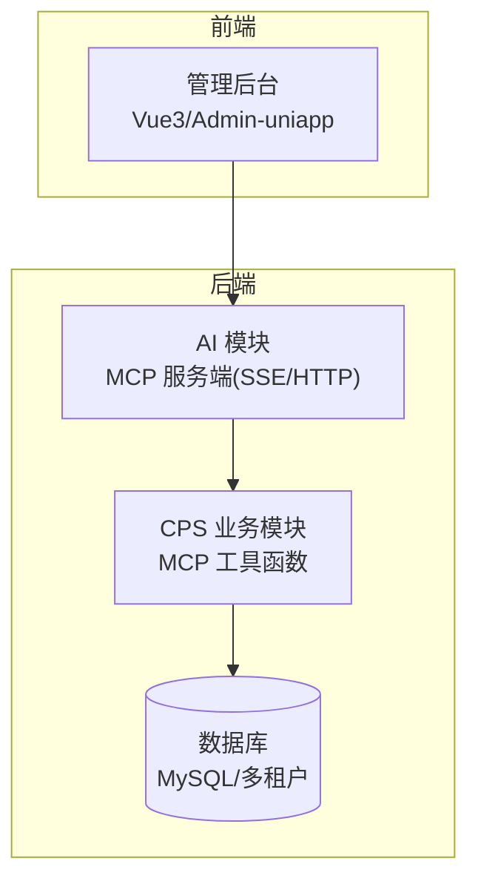
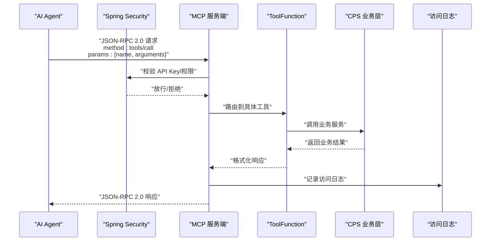
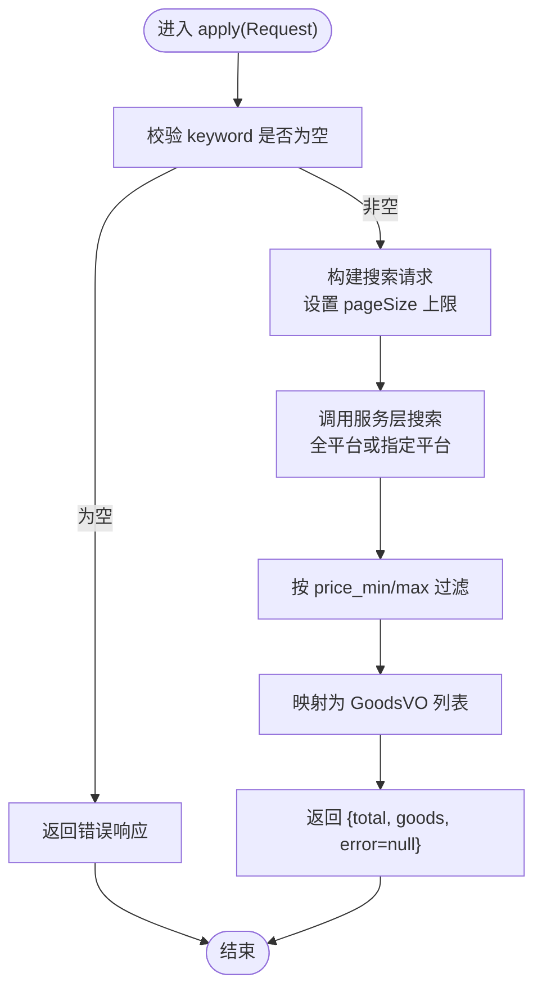
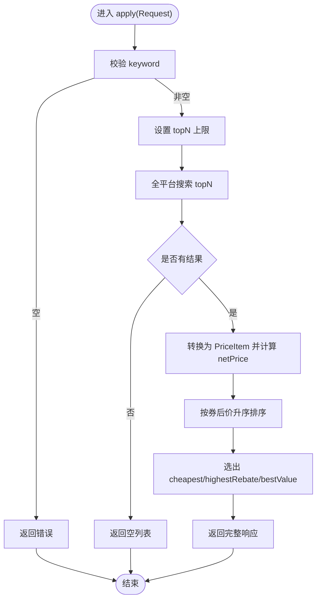
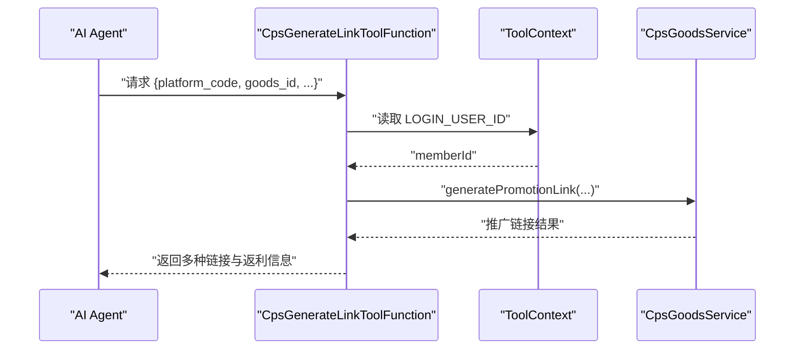
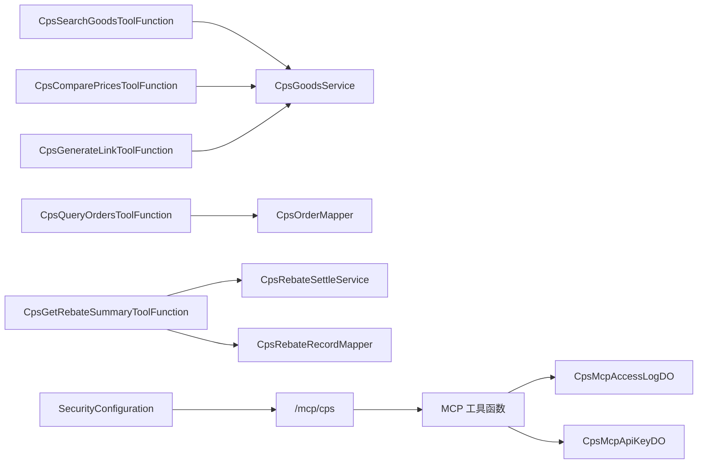

# MCP协议使用

<cite>
**本文引用的文件**
- [AGENTS.md](file://AGENTS.md)
- [CPS系统PRD文档.md](file://docs/CPS系统PRD文档.md)
- [SecurityConfiguration.java](file://backend/qiji-module-ai/src/main/java/com/qiji/cps/module/ai/framework/security/config/SecurityConfiguration.java)
- [CpsSearchGoodsToolFunction.java](file://backend/qiji-module-cps/qiji-module-cps-biz/src/main/java/com/qiji/cps/module/cps/mcp/tool/CpsSearchGoodsToolFunction.java)
- [CpsComparePricesToolFunction.java](file://backend/qiji-module-cps/qiji-module-cps-biz/src/main/java/com/qiji/cps/module/cps/mcp/tool/CpsComparePricesToolFunction.java)
- [CpsGenerateLinkToolFunction.java](file://backend/qiji-module-cps/qiji-module-cps-biz/src/main/java/com/qiji/cps/module/cps/mcp/tool/CpsGenerateLinkToolFunction.java)
- [CpsQueryOrdersToolFunction.java](file://backend/qiji-module-cps/qiji-module-cps-biz/src/main/java/com/qiji/cps/module/cps/mcp/tool/CpsQueryOrdersToolFunction.java)
- [CpsGetRebateSummaryToolFunction.java](file://backend/qiji-module-cps/qiji-module-cps-biz/src/main/java/com/qiji/cps/module/cps/mcp/tool/CpsGetRebateSummaryToolFunction.java)
- [CpsMcpAccessLogDO.java](file://backend/qiji-module-cps/qiji-module-cps-biz/src/main/java/com/qiji/cps/module/cps/dal/dataobject/mcp/CpsMcpAccessLogDO.java)
- [CpsMcpApiKeyDO.java](file://backend/qiji-module-cps/qiji-module-cps-biz/src/main/java/com/qiji/cps/module/cps/dal/dataobject/mcp/CpsMcpApiKeyDO.java)
- [backend README.md](file://backend/README.md)
</cite>

## 目录
1. [简介](#简介)
2. [项目结构](#项目结构)
3. [核心组件](#核心组件)
4. [架构总览](#架构总览)
5. [详细组件分析](#详细组件分析)
6. [依赖分析](#依赖分析)
7. [性能考虑](#性能考虑)
8. [故障排查指南](#故障排查指南)
9. [结论](#结论)
10. [附录](#附录)

## 简介
本文件面向使用 MCP（Model Context Protocol）协议对接 AgenticCPS 的开发者与集成方，系统性说明 MCP 协议规范、传输机制、消息格式、版本兼容性；深入讲解工具函数开发（ToolFunction 接口实现、参数校验、响应格式化、错误处理策略）；阐述 Agent 配置管理（Agent 角色定义、技能模板设计、会话与状态保持）；提供调试与测试方法（本地调试环境搭建、测试用例编写、性能测试、故障排查）；并覆盖 MCP 端点配置、安全认证、访问控制、日志记录等技术细节，最后给出实际 API 调用示例与最佳实践建议。

## 项目结构
AgenticCPS 采用前后端分离架构，后端基于 Spring Boot 3.5.9 + Spring AI 1.1.2，MCP 协议通过 Streamable HTTP（JSON-RPC 2.0）实现，端点位于 /mcp/cps。AI 模块负责 MCP 服务端能力，CPS 模块提供业务工具函数与数据访问层。管理后台提供 MCP 服务状态、API Key 管理、Tools 配置与访问日志等功能。

图表来源
- [AGENTS.md:11-62](file://AGENTS.md#L11-L62)
- [AGENTS.md:170-188](file://AGENTS.md#L170-L188)

章节来源
- [AGENTS.md:11-62](file://AGENTS.md#L11-L62)
- [AGENTS.md:170-188](file://AGENTS.md#L170-L188)

## 核心组件
- MCP 协议与端点
  - 传输：Streamable HTTP（JSON-RPC 2.0）
  - 端点：/mcp/cps
  - 认证：API Key（存储于 cps_mcp_api_key 表）
  - 访问日志：cps_mcp_access_log 表（记录 toolName、params、duration、clientIp）
  - 安全：Spring Security 对 MCP SSE 与 HTTP 端点放行
  - 上下文：ToolContext 传递当前登录会员 ID（LOGIN_USER_ID）用于订单归因
- 五个开箱即用的 MCP 工具
  - cps_search_goods：跨平台商品搜索
  - cps_compare_prices：跨平台比价
  - cps_generate_link：生成推广链接（转链）
  - cps_query_orders：查询会员返利订单
  - cps_get_rebate_summary：返利账户汇总

章节来源
- [AGENTS.md:182-188](file://AGENTS.md#L182-L188)
- [backend README.md:179-205](file://backend/README.md#L179-L205)

## 架构总览
MCP 工作流概览：AI Agent 通过 Streamable HTTP 发送 JSON-RPC 2.0 请求到 /mcp/cps，后端根据 API Key 进行鉴权与限流，随后路由到对应的 ToolFunction，执行业务逻辑并返回结构化响应。期间记录访问日志，异常时返回统一错误信息。

图表来源
- [AGENTS.md:182-188](file://AGENTS.md#L182-L188)
- [SecurityConfiguration.java:25-40](file://backend/qiji-module-ai/src/main/java/com/qiji/cps/module/ai/framework/security/config/SecurityConfiguration.java#L25-L40)
- [CpsMcpAccessLogDO.java:14-61](file://backend/qiji-module-cps/qiji-module-cps-biz/src/main/java/com/qiji/cps/module/cps/dal/dataobject/mcp/CpsMcpAccessLogDO.java#L14-L61)

## 详细组件分析

### MCP 协议规范与消息格式
- 传输机制
  - Streamable HTTP（JSON-RPC 2.0）
  - 端点：/mcp/cps
- 消息格式
  - 请求：包含 method（如 tools/call）、params（包含 name 与 arguments）
  - 响应：遵循 JSON-RPC 2.0 规范，包含 result 或 error
- 版本兼容性
  - 以 JSON-RPC 2.0 为基础，保持向后兼容
  - 工具函数参数与响应字段按需扩展，避免破坏既有字段

章节来源
- [AGENTS.md:182-188](file://AGENTS.md#L182-L188)
- [backend README.md:179-205](file://backend/README.md#L179-L205)

### 安全认证与访问控制
- API Key 管理
  - 存储表：cps_mcp_api_key（含名称、值、描述、状态、过期时间、最后使用时间、累计调用次数）
  - 管理后台提供 API Key 列表、创建/更新/删除、权限级别（public/member/admin）、限流配置、使用统计
- 访问控制
  - Spring Security 对 MCP SSE 与 HTTP 端点放行（允许 AI Agent 访问）
  - ToolContext 提供 LOGIN_USER_ID，用于会员相关工具的上下文注入
- 访问日志
  - 记录表：cps_mcp_access_log（apiKeyId、toolName、requestParams、responseData、status、errorMessage、durationMs、clientIp）

章节来源
- [AGENTS.md:182-188](file://AGENTS.md#L182-L188)
- [CpsMcpApiKeyDO.java:16-61](file://backend/qiji-module-cps/qiji-module-cps-biz/src/main/java/com/qiji/cps/module/cps/dal/dataobject/mcp/CpsMcpApiKeyDO.java#L16-L61)
- [CpsMcpAccessLogDO.java:14-61](file://backend/qiji-module-cps/qiji-module-cps-biz/src/main/java/com/qiji/cps/module/cps/dal/dataobject/mcp/CpsMcpAccessLogDO.java#L14-L61)
- [SecurityConfiguration.java:25-40](file://backend/qiji-module-ai/src/main/java/com/qiji/cps/module/ai/framework/security/config/SecurityConfiguration.java#L25-L40)

### 工具函数开发指南

#### 通用实现模式
- 接口实现
  - 搜索类：Function<Request, Response>
  - 会员相关类：BiFunction<Request, ToolContext, Response>
- 参数校验
  - 必填字段校验（如 keyword、goods_id、platform_code）
  - 参数边界控制（pageSize/topN/recentCount 等）
  - 异常捕获并返回统一错误信息
- 响应格式化
  - 统一包含 total/列表/error 字段
  - 金额统一为元（BigDecimal），内部以“分”存储
- 错误处理策略
  - 明确区分业务错误与系统异常
  - 返回可读的错误信息，避免泄露内部细节

章节来源
- [CpsSearchGoodsToolFunction.java:28-34](file://backend/qiji-module-cps/qiji-module-cps-biz/src/main/java/com/qiji/cps/module/cps/mcp/tool/CpsSearchGoodsToolFunction.java#L28-L34)
- [CpsComparePricesToolFunction.java:30-36](file://backend/qiji-module-cps/qiji-module-cps-biz/src/main/java/com/qiji/cps/module/cps/mcp/tool/CpsComparePricesToolFunction.java#L30-L36)
- [CpsGenerateLinkToolFunction.java:27-35](file://backend/qiji-module-cps/qiji-module-cps-biz/src/main/java/com/qiji/cps/module/cps/mcp/tool/CpsGenerateLinkToolFunction.java#L27-L35)
- [CpsQueryOrdersToolFunction.java:33-40](file://backend/qiji-module-cps/qiji-module-cps-biz/src/main/java/com/qiji/cps/module/cps/mcp/tool/CpsQueryOrdersToolFunction.java#L33-L40)
- [CpsGetRebateSummaryToolFunction.java:32-42](file://backend/qiji-module-cps/qiji-module-cps-biz/src/main/java/com/qiji/cps/module/cps/mcp/tool/CpsGetRebateSummaryToolFunction.java#L32-L42)

#### 工具一：商品搜索（cps_search_goods）
- 输入参数
  - keyword（必填）、platform_code（可选）、page_size（默认10，上限20）、price_min、price_max
- 输出格式
  - total、goods（含 goodsId、platformCode、title、mainPic、originalPrice、actualPrice、couponPrice、commissionRate、commissionAmount、monthSales、shopName、goodsSign）、error
- 关键逻辑
  - 全平台或指定平台搜索
  - 价格范围过滤
  - 统一金额单位与空值处理

图表来源
- [CpsSearchGoodsToolFunction.java:120-174](file://backend/qiji-module-cps/qiji-module-cps-biz/src/main/java/com/qiji/cps/module/cps/mcp/tool/CpsSearchGoodsToolFunction.java#L120-L174)

章节来源
- [CpsSearchGoodsToolFunction.java:28-177](file://backend/qiji-module-cps/qiji-module-cps-biz/src/main/java/com/qiji/cps/module/cps/mcp/tool/CpsSearchGoodsToolFunction.java#L28-L177)

#### 工具二：跨平台比价（cps_compare_prices）
- 输入参数
  - keyword（必填）、topN（默认5，上限10）
- 输出格式
  - total、cheapest、highestRebate、bestValue（均继承 PriceItem 字段）、items（按券后价升序）、error
- 关键逻辑
  - 按券后价排序 cheapest
  - 按返利金额排序 highestRebate
  - 按净价（券后价 - 返利）排序 bestValue

图表来源
- [CpsComparePricesToolFunction.java:113-173](file://backend/qiji-module-cps/qiji-module-cps-biz/src/main/java/com/qiji/cps/module/cps/mcp/tool/CpsComparePricesToolFunction.java#L113-L173)

章节来源
- [CpsComparePricesToolFunction.java:30-176](file://backend/qiji-module-cps/qiji-module-cps-biz/src/main/java/com/qiji/cps/module/cps/mcp/tool/CpsComparePricesToolFunction.java#L30-L176)

#### 工具三：生成推广链接（cps_generate_link）
- 输入参数
  - platform_code（必填）、goods_id（必填）、goods_sign（可选，拼多多必填）、member_id（可选，缺省从 ToolContext 获取）、adzone_id（可选）
- 输出格式
  - shortUrl、longUrl、tpwd（淘宝口令）、mobileUrl（拼多多移动端）、actualPrice、commissionRate、commissionAmount、couponInfo、error
- 关键逻辑
  - 从 ToolContext 提取 LOGIN_USER_ID 完成订单归因
  - 调用服务层生成推广链接并返回多种格式

图表来源
- [CpsGenerateLinkToolFunction.java:97-141](file://backend/qiji-module-cps/qiji-module-cps-biz/src/main/java/com/qiji/cps/module/cps/mcp/tool/CpsGenerateLinkToolFunction.java#L97-L141)

章节来源
- [CpsGenerateLinkToolFunction.java:27-142](file://backend/qiji-module-cps/qiji-module-cps-biz/src/main/java/com/qiji/cps/module/cps/mcp/tool/CpsGenerateLinkToolFunction.java#L27-L142)

#### 工具四：查询会员订单（cps_query_orders）
- 输入参数
  - platform_code（可选）、order_status（可选）、page_no（默认1）、page_size（默认10，上限20）
- 输出格式
  - total、orders（含 id、platformCode、platformOrderId、itemTitle、itemPic、finalPrice、estimateRebate、realRebate、orderStatus、rebateTime、createTime）、error
- 关键逻辑
  - 从 ToolContext 提取会员 ID
  - 分页查询并映射为 VO 列表

章节来源
- [CpsQueryOrdersToolFunction.java:33-169](file://backend/qiji-module-cps/qiji-module-cps-biz/src/main/java/com/qiji/cps/module/cps/mcp/tool/CpsQueryOrdersToolFunction.java#L33-L169)

#### 工具五：返利账户汇总（cps_get_rebate_summary）
- 输入参数
  - recent_count（默认5，上限20）
- 输出格式
  - availableBalance、frozenBalance、totalRebate、withdrawnAmount、accountStatus、recentRecords（含 itemTitle、platformCode、rebateAmount、rebateType、rebateStatus、createTime）、error
- 关键逻辑
  - 获取或初始化返利账户
  - 查询最近 N 条返利记录

章节来源
- [CpsGetRebateSummaryToolFunction.java:32-162](file://backend/qiji-module-cps/qiji-module-cps-biz/src/main/java/com/qiji/cps/module/cps/mcp/tool/CpsGetRebateSummaryToolFunction.java#L32-L162)

### Agent 配置管理
- Agent 角色定义
  - 通过 API Key 权限级别（public/member/admin）控制工具访问范围
- 技能模板设计
  - 五个工具作为标准技能，可按需组合为不同 Agent 角色
- 会话与状态保持
  - ToolContext 传递 LOGIN_USER_ID，确保工具调用具备用户上下文
- 管理后台功能
  - MCP 服务状态、API Key 管理（创建/更新/删除/限流）、Tools 配置（权限、默认值、限制）、访问日志查看

章节来源
- [AGENTS.md:182-188](file://AGENTS.md#L182-L188)
- [CPS系统PRD文档.md:698-737](file://docs/CPS系统PRD文档.md#L698-L737)

## 依赖分析
MCP 工具函数与业务层解耦，通过服务层接口调用平台适配器与数据访问层。安全配置对 MCP 端点放行，访问日志与 API Key 管理贯穿工具调用生命周期。

图表来源
- [CpsSearchGoodsToolFunction.java:32-33](file://backend/qiji-module-cps/qiji-module-cps-biz/src/main/java/com/qiji/cps/module/cps/mcp/tool/CpsSearchGoodsToolFunction.java#L32-L33)
- [CpsComparePricesToolFunction.java:34-35](file://backend/qiji-module-cps/qiji-module-cps-biz/src/main/java/com/qiji/cps/module/cps/mcp/tool/CpsComparePricesToolFunction.java#L34-L35)
- [CpsGenerateLinkToolFunction.java:34-35](file://backend/qiji-module-cps/qiji-module-cps-biz/src/main/java/com/qiji/cps/module/cps/mcp/tool/CpsGenerateLinkToolFunction.java#L34-L35)
- [CpsQueryOrdersToolFunction.java:39-40](file://backend/qiji-module-cps/qiji-module-cps-biz/src/main/java/com/qiji/cps/module/cps/mcp/tool/CpsQueryOrdersToolFunction.java#L39-L40)
- [CpsGetRebateSummaryToolFunction.java:38-42](file://backend/qiji-module-cps/qiji-module-cps-biz/src/main/java/com/qiji/cps/module/cps/mcp/tool/CpsGetRebateSummaryToolFunction.java#L38-L42)
- [SecurityConfiguration.java:25-40](file://backend/qiji-module-ai/src/main/java/com/qiji/cps/module/ai/framework/security/config/SecurityConfiguration.java#L25-L40)
- [CpsMcpAccessLogDO.java:14-61](file://backend/qiji-module-cps/qiji-module-cps-biz/src/main/java/com/qiji/cps/module/cps/dal/dataobject/mcp/CpsMcpAccessLogDO.java#L14-L61)
- [CpsMcpApiKeyDO.java:16-61](file://backend/qiji-module-cps/qiji-module-cps-biz/src/main/java/com/qiji/cps/module/cps/dal/dataobject/mcp/CpsMcpApiKeyDO.java#L16-L61)

章节来源
- [CpsSearchGoodsToolFunction.java:32-33](file://backend/qiji-module-cps/qiji-module-cps-biz/src/main/java/com/qiji/cps/module/cps/mcp/tool/CpsSearchGoodsToolFunction.java#L32-L33)
- [CpsComparePricesToolFunction.java:34-35](file://backend/qiji-module-cps/qiji-module-cps-biz/src/main/java/com/qiji/cps/module/cps/mcp/tool/CpsComparePricesToolFunction.java#L34-L35)
- [CpsGenerateLinkToolFunction.java:34-35](file://backend/qiji-module-cps/qiji-module-cps-biz/src/main/java/com/qiji/cps/module/cps/mcp/tool/CpsGenerateLinkToolFunction.java#L34-L35)
- [CpsQueryOrdersToolFunction.java:39-40](file://backend/qiji-module-cps/qiji-module-cps-biz/src/main/java/com/qiji/cps/module/cps/mcp/tool/CpsQueryOrdersToolFunction.java#L39-L40)
- [CpsGetRebateSummaryToolFunction.java:38-42](file://backend/qiji-module-cps/qiji-module-cps-biz/src/main/java/com/qiji/cps/module/cps/mcp/tool/CpsGetRebateSummaryToolFunction.java#L38-L42)
- [SecurityConfiguration.java:25-40](file://backend/qiji-module-ai/src/main/java/com/qiji/cps/module/ai/framework/security/config/SecurityConfiguration.java#L25-L40)
- [CpsMcpAccessLogDO.java:14-61](file://backend/qiji-module-cps/qiji-module-cps-biz/src/main/java/com/qiji/cps/module/cps/dal/dataobject/mcp/CpsMcpAccessLogDO.java#L14-L61)
- [CpsMcpApiKeyDO.java:16-61](file://backend/qiji-module-cps/qiji-module-cps-biz/src/main/java/com/qiji/cps/module/cps/dal/dataobject/mcp/CpsMcpApiKeyDO.java#L16-L61)

## 性能考虑
- 单平台搜索：P99 < 2s
- 多平台比价：P99 < 5s
- 推广链接生成：P99 < 1s
- 订单同步延迟：< 30 分钟
- 返利入账：平台结算后 24 小时内
- MCP 工具调用（搜索）：P99 < 3s
- MCP 工具调用（查询）：P99 < 1s

章节来源
- [AGENTS.md:357-368](file://AGENTS.md#L357-L368)

## 故障排查指南
- 认证失败
  - 检查 API Key 是否存在、状态是否启用、是否过期
  - 确认请求头携带正确的 Authorization（如 Bearer KEY）
- 工具调用异常
  - 查看访问日志表（cps_mcp_access_log）中的 errorMessage 与 durationMs
  - 根据错误信息定位工具参数问题或服务层异常
- 会员相关工具无上下文
  - 确保 ToolContext 中包含 LOGIN_USER_ID
  - 检查 Agent 会话是否正确传递用户身份
- 性能问题
  - 关注 P99 指标是否超过阈值
  - 优化参数（如 topN/pageSize）与缓存策略

章节来源
- [CpsMcpAccessLogDO.java:14-61](file://backend/qiji-module-cps/qiji-module-cps-biz/src/main/java/com/qiji/cps/module/cps/dal/dataobject/mcp/CpsMcpAccessLogDO.java#L14-L61)
- [CpsMcpApiKeyDO.java:16-61](file://backend/qiji-module-cps/qiji-module-cps-biz/src/main/java/com/qiji/cps/module/cps/dal/dataobject/mcp/CpsMcpApiKeyDO.java#L16-L61)
- [CpsQueryOrdersToolFunction.java:121-156](file://backend/qiji-module-cps/qiji-module-cps-biz/src/main/java/com/qiji/cps/module/cps/mcp/tool/CpsQueryOrdersToolFunction.java#L121-L156)
- [CpsGetRebateSummaryToolFunction.java:107-149](file://backend/qiji-module-cps/qiji-module-cps-biz/src/main/java/com/qiji/cps/module/cps/mcp/tool/CpsGetRebateSummaryToolFunction.java#L107-L149)

## 结论
AgenticCPS 通过 MCP 协议实现了零代码接入的 AI Agent 能力，结合统一的工具函数、完善的认证与日志体系、灵活的权限控制与限流策略，为跨平台商品搜索、比价、推广链接生成、订单查询与返利汇总提供了标准化接口。开发者可基于现有工具快速构建 Agent 角色，并通过管理后台进行配置与监控。

## 附录

### MCP 端点与消息格式示例
- 端点：/mcp/cps
- 方法：tools/call
- 请求参数示例（以搜索为例）：
  - name: cps_search_goods
  - arguments: 包含 keyword、platform_code（可选）、page_size（可选）、price_min/price_max（可选）
- 响应示例：
  - result: 包含 total、goods（列表）、error（可选）

章节来源
- [backend README.md:179-205](file://backend/README.md#L179-L205)

### 最佳实践建议
- 参数最小化：仅传递必要参数，避免超大 payload
- 错误幂等：对可重试场景进行幂等处理与退避重试
- 日志可观测：充分利用访问日志与错误信息定位问题
- 权限最小化：按需授予 API Key 权限，定期轮换密钥
- 性能优化：合理设置 topN/page_size，结合缓存与异步处理