# Vibe Coding工作流

<cite>
**本文档引用的文件**
- [README.md](file://README.md)
- [AGENTS.md](file://AGENTS.md)
- [MEMORY.md](file://agent_improvement/memory/MEMORY.md)
- [codegen-rules.md](file://agent_improvement/memory/codegen-rules.md)
- [CpsSearchGoodsToolFunction.java](file://backend/qiji-module-cps/qiji-module-cps-biz/src/main/java/com/qiji/cps/module/cps/mcp/tool/CpsSearchGoodsToolFunction.java)
- [CpsOrderService.java](file://backend/qiji-module-cps/qiji-module-cps-biz/src/main/java/com/qiji/cps/module/cps/service/order/CpsOrderService.java)
- [application-local.yaml](file://backend/qiji-server/src/main/resources/application-local.yaml)
- [category.json](file://backend/qiji-module-infra/src/test/resources/codecgen/table/category.json)
- [config.yaml](file://openspec/config.yaml)
- [CPS系统PRD文档.md](file://docs/CPS系统PRD文档.md)
</cite>

## 目录
1. [简介](#简介)
2. [项目结构](#项目结构)
3. [核心组件](#核心组件)
4. [架构概览](#架构概览)
5. [详细组件分析](#详细组件分析)
6. [依赖关系分析](#依赖关系分析)
7. [性能考虑](#性能考虑)
8. [故障排除指南](#故障排除指南)
9. [结论](#结论)
10. [附录](#附录)

## 简介

Vibe Coding工作流是一种革命性的软件开发范式，它将自然语言需求直接转化为精确的开发指令，并通过AI自主编程实现从需求到代码的完整转换。在AgenticCPS项目中，这一工作流已经实现了100%的AI自主编程，涵盖了CPS核心模块的20,000+行代码。

### Vibe Coding的核心理念

Vibe Coding（氛围编程）突破了传统的"写代码→编译→调试"开发模式，采用全新的"描述意图→AI理解→AI编码→AI测试→AI交付"流程：

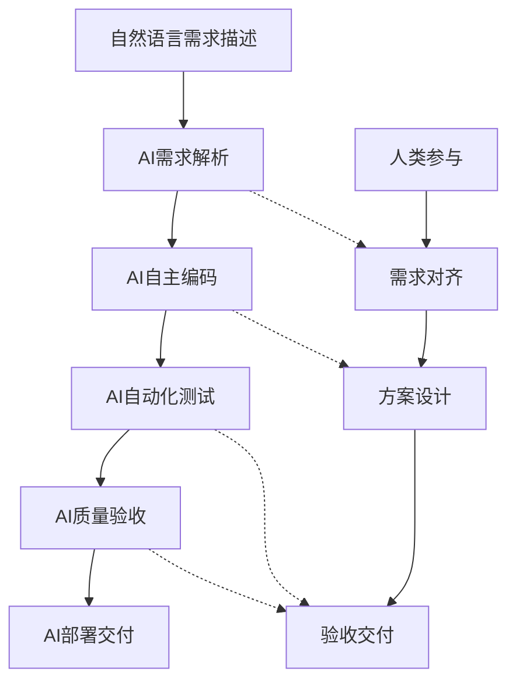

**章节来源**
- [README.md:84-144](file://README.md#L84-L144)

## 项目结构

AgenticCPS采用模块化的微服务架构，每个模块都有明确的职责分工：

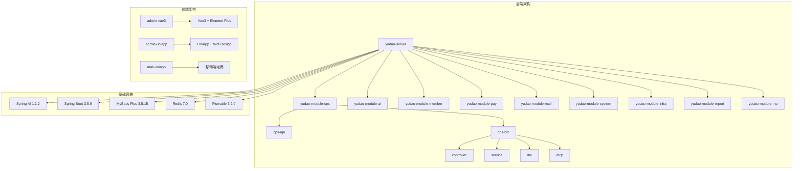

**图表来源**
- [AGENTS.md:14-62](file://AGENTS.md#L14-L62)

**章节来源**
- [AGENTS.md:11-62](file://AGENTS.md#L11-L62)

## 核心组件

### 1. 规范化AI编程工作流

AgenticCPS引入了基于Specs/Plans的规范化AI编程工作流，确保AI理解的准确性并避免"AI乱写代码"的问题：

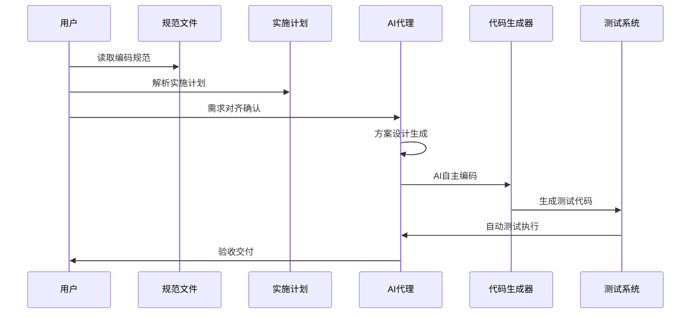

**章节来源**
- [README.md:113-144](file://README.md#L113-L144)

### 2. 代码生成器系统

系统提供了强大的代码生成功能，支持多种前端框架和模板类型：

| 模板类型 | 前端框架 | 特点 |
|---------|---------|------|
| 1 | Vue3 + Element Plus | 标准CRUD页面 |
| 2 | Vue3 + Vben Admin | 模态框表单 |
| 11 | Vue3 + Vben5 + Antd | ERP主表模式 |

**章节来源**
- [codegen-rules.md:327-788](file://agent_improvement/memory/codegen-rules.md#L327-L788)

### 3. MCP AI接口层

系统集成了5个开箱即用的AI工具，支持MCP协议：

| 工具名称 | 功能描述 | 调用方式 |
|---------|---------|---------|
| cps_search_goods | 商品搜索 | 搜索关键词、平台筛选、价格区间 |
| cps_compare_prices | 多平台比价 | 返回最便宜/返利最高/综合最优 |
| cps_generate_link | 推广链接生成 | 短链/长链/口令/移动端 |
| cps_query_orders | 订单查询 | 用户返利订单状态 |
| cps_get_rebate_summary | 返利汇总 | 余额、待结算、累计返利 |

**章节来源**
- [AGENTS.md:170-190](file://AGENTS.md#L170-L190)

## 架构概览

### CPS平台适配器架构

系统采用策略模式实现CPS平台适配器，支持淘宝、京东、拼多多、抖音等平台的无缝接入：

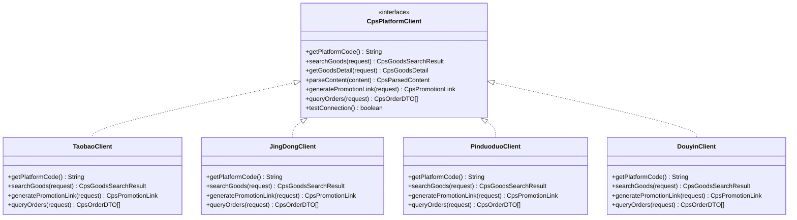

**图表来源**
- [AGENTS.md:152-169](file://AGENTS.md#L152-L169)

### 订单同步架构

系统采用Quartz定时任务实现订单的增量同步：

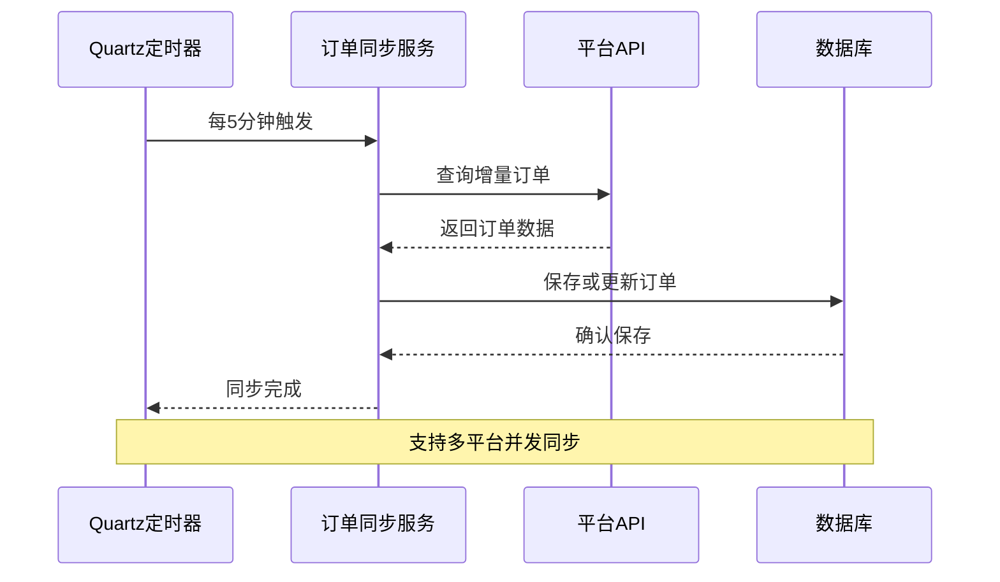

**图表来源**
- [AGENTS.md:195-204](file://AGENTS.md#L195-L204)

**章节来源**
- [AGENTS.md:152-204](file://AGENTS.md#L152-L204)

## 详细组件分析

### 1. 商品搜索MCP工具

CpsSearchGoodsToolFunction实现了多平台商品搜索功能，支持关键词搜索、平台筛选和价格范围过滤：

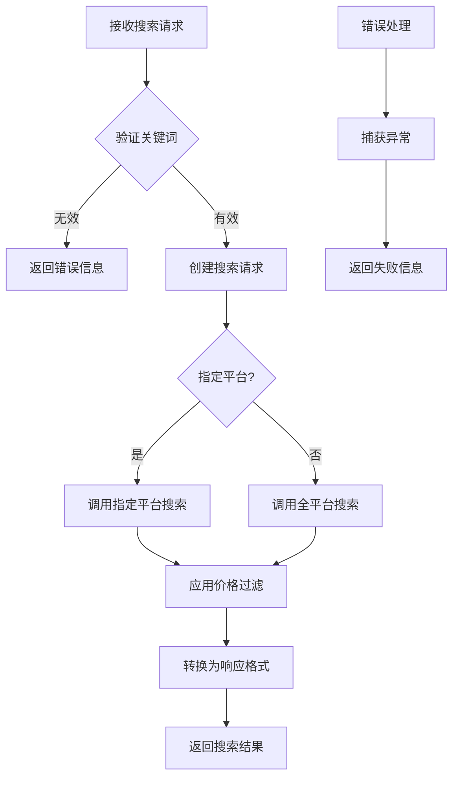

**图表来源**
- [CpsSearchGoodsToolFunction.java:120-177](file://backend/qiji-module-cps/qiji-module-cps-biz/src/main/java/com/qiji/cps/module/cps/mcp/tool/CpsSearchGoodsToolFunction.java#L120-L177)

**章节来源**
- [CpsSearchGoodsToolFunction.java:1-177](file://backend/qiji-module-cps/qiji-module-cps-biz/src/main/java/com/qiji/cps/module/cps/mcp/tool/CpsSearchGoodsToolFunction.java#L1-L177)

### 2. 订单服务接口

CpsOrderService定义了订单管理的核心接口，支持幂等保存、批量处理和手动同步：

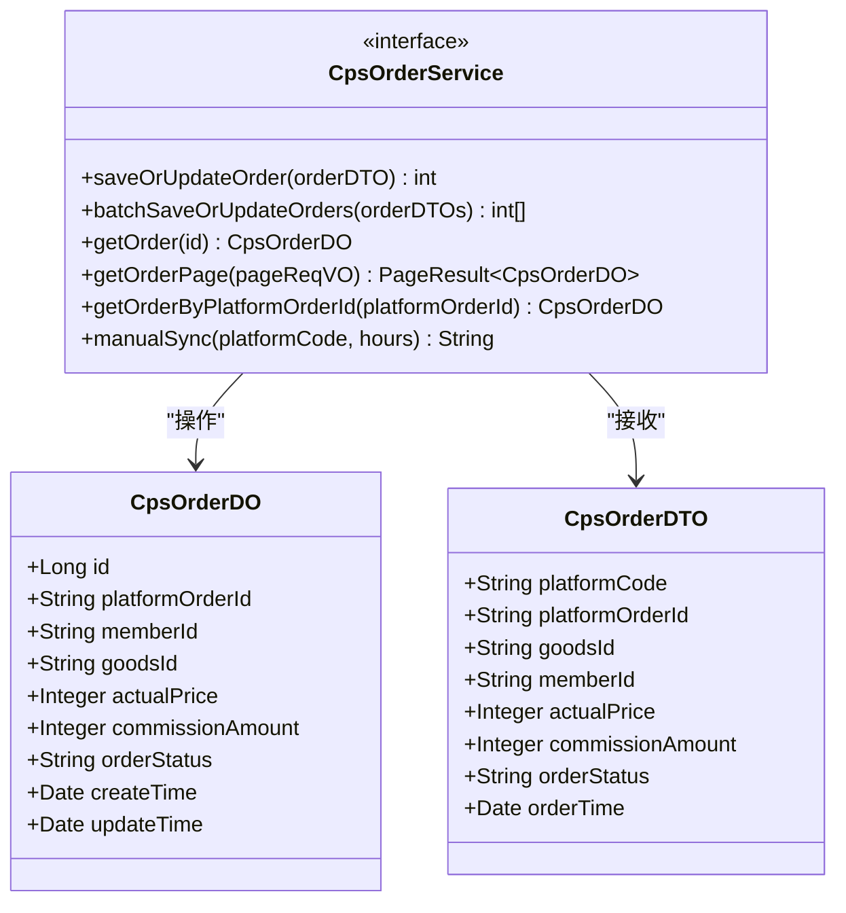

**图表来源**
- [CpsOrderService.java:15-60](file://backend/qiji-module-cps/qiji-module-cps-biz/src/main/java/com/qiji/cps/module/cps/service/order/CpsOrderService.java#L15-L60)

**章节来源**
- [CpsOrderService.java:1-60](file://backend/qiji-module-cps/qiji-module-cps-biz/src/main/java/com/qiji/cps/module/cps/service/order/CpsOrderService.java#L1-L60)

### 3. 代码生成规范

系统制定了详细的代码生成规范，确保生成代码的一致性和质量：

#### 后端分层结构

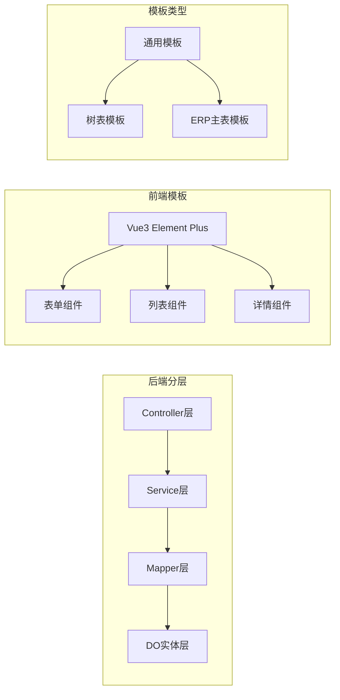

**图表来源**
- [codegen-rules.md:7-29](file://agent_improvement/memory/codegen-rules.md#L7-L29)

**章节来源**
- [codegen-rules.md:5-788](file://agent_improvement/memory/codegen-rules.md#L5-L788)

## 依赖关系分析

### 技术栈依赖

AgenticCPS采用了现代化的技术栈组合，确保系统的高性能和可维护性：

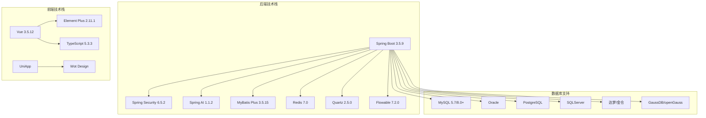

**图表来源**
- [AGENTS.md:73-90](file://AGENTS.md#L73-L90)

### 配置管理

系统通过application-local.yaml集中管理各种配置：

| 配置类别 | 关键配置项 | 作用 |
|---------|-----------|------|
| 数据库 | spring.datasource.dynamic | 多数据源配置 |
| 缓存 | spring.data.redis | Redis连接配置 |
| 定时任务 | spring.quartz | Quartz调度器配置 |
| 监控 | management.endpoints.web.exposure | Actuator端点暴露 |
| 微信 | wx.mp, wx.miniapp | 微信公众号配置 |

**章节来源**
- [application-local.yaml:1-294](file://backend/qiji-server/src/main/resources/application-local.yaml#L1-L294)

## 性能考虑

### 性能基准要求

系统设定了严格的性能基准，确保在高并发场景下的稳定运行：

| 性能指标 | 目标值 | 说明 |
|---------|-------|------|
| 单平台搜索 | < 2秒(P99) | 搜索响应时间 |
| 多平台比价 | < 5秒(P99) | 并发查询响应 |
| 转链生成 | < 1秒 | 推广链接创建 |
| 订单同步延迟 | < 30分钟 | 增量同步间隔 |
| 返利入账 | 24小时内 | 平台结算后处理 |
| MCP工具调用 | < 3秒(搜索)/< 1秒(查询) | AI工具响应时间 |

### 缓存策略

系统采用多层缓存策略优化性能：

1. **Redis缓存**：热点数据缓存，减少数据库压力
2. **本地缓存**：高频访问数据的本地存储
3. **数据库连接池**：Druid连接池优化数据库连接
4. **静态资源缓存**：前端资源浏览器缓存

**章节来源**
- [AGENTS.md:357-368](file://AGENTS.md#L357-L368)

## 故障排除指南

### 常见问题及解决方案

#### 1. 文件编码问题

**问题描述**：Windows PowerShell操作UTF-8文件导致中文字符损坏

**解决方案**：
- 使用Python进行文件操作
- 确保文件以UTF-8编码读写
- 避免使用PowerShell的Get-Content/Set-Content

#### 2. 数据库连接问题

**诊断步骤**：
1. 检查application-local.yaml中的数据库配置
2. 验证MySQL服务状态
3. 确认网络连接和防火墙设置

**配置要点**：
- 主从库分离配置
- 连接池参数调优
- SSL连接配置

#### 3. MCP工具调用失败

**排查方法**：
1. 检查API密钥配置
2. 验证MCP端点可用性
3. 查看访问日志记录

**章节来源**
- [AGENTS.md:266-344](file://AGENTS.md#L266-L344)

### 单元测试执行

系统提供了完善的单元测试框架：

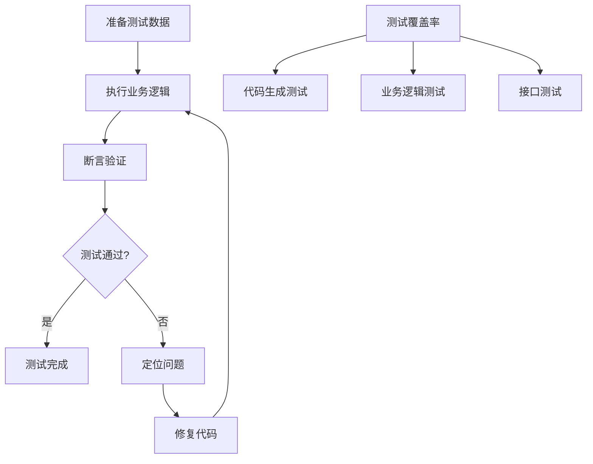

**章节来源**
- [backend/README.md:39-129](file://backend/README.md#L39-L129)

## 结论

Vibe Coding工作流通过规范化AI编程，实现了从需求描述到代码交付的完整自动化流程。AgenticCPS项目展示了这一工作流的强大能力，20,000+行代码的CPS核心模块完全由AI自主编程完成，体现了Vibe Coding在实际项目中的可行性。

### 核心优势总结

1. **需求精准对齐**：通过Specs/Plans确保AI理解准确性
2. **方案先行**：先设计→再确认→后编码，零返工
3. **纯AI自主编程**：全流程AI化，效率提升10倍以上
4. **质量可保障**：自动测试+规范约束+验收标准
5. **持续自进化**：每次项目反馈自动优化工作流

### 未来发展方向

1. **AI工具生态扩展**：增加更多专业领域的AI工具
2. **多模态需求处理**：支持图片、语音等多模态需求描述
3. **智能代码重构**：AI自动识别和重构低质量代码
4. **跨平台部署**：支持更多部署环境和平台

## 附录

### 实际代码生成示例

#### 数据库表到代码的完整转换

基于category.json配置，系统自动生成完整的CRUD代码：

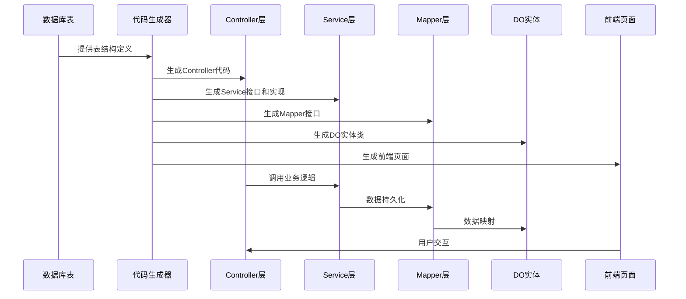

**图表来源**
- [category.json:1-52](file://backend/qiji-module-infra/src/test/resources/codecgen/table/category.json#L1-L52)

### 最佳实践建议

1. **需求描述规范**
   - 使用具体而非模糊的描述语言
   - 明确业务背景和目标用户
   - 指定性能和质量要求

2. **AI编码规范**
   - 严格遵循命名约定
   - 保持代码风格一致性
   - 完善注释和文档

3. **质量保证机制**
   - 建立多层次测试体系
   - 实施代码审查流程
   - 持续监控和优化

4. **性能优化策略**
   - 采用缓存和异步处理
   - 优化数据库查询
   - 实施负载均衡和容灾

**章节来源**
- [codegen-rules.md:315-326](file://agent_improvement/memory/codegen-rules.md#L315-L326)
- [CPS系统PRD文档.md:991-1018](file://docs/CPS系统PRD文档.md#L991-L1018)