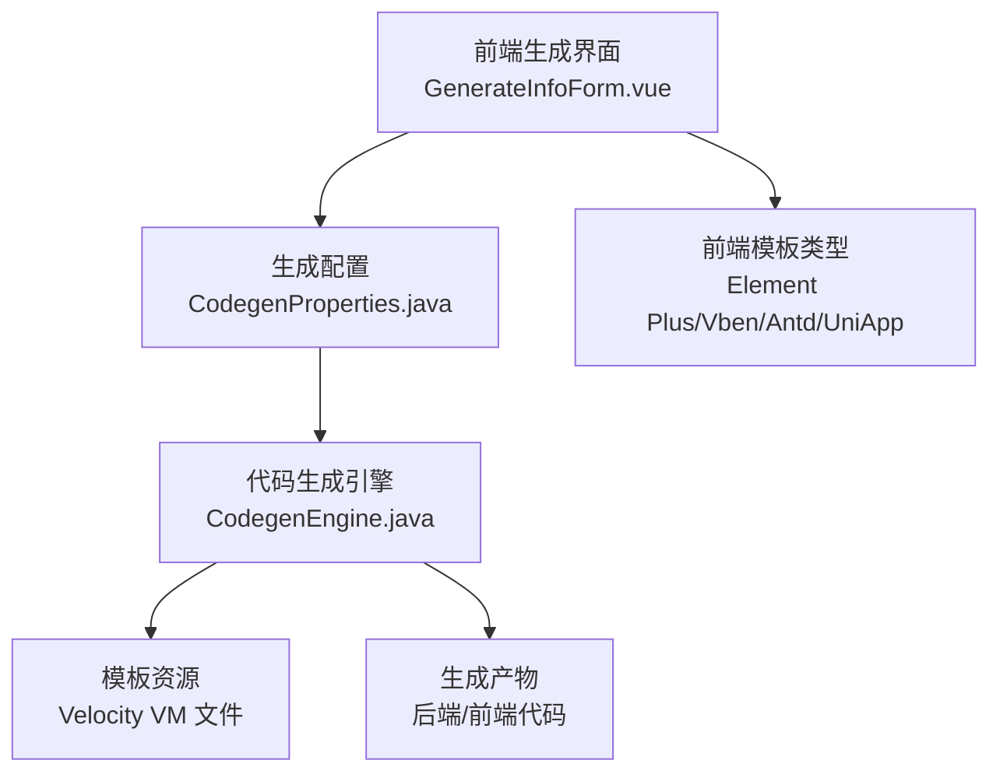
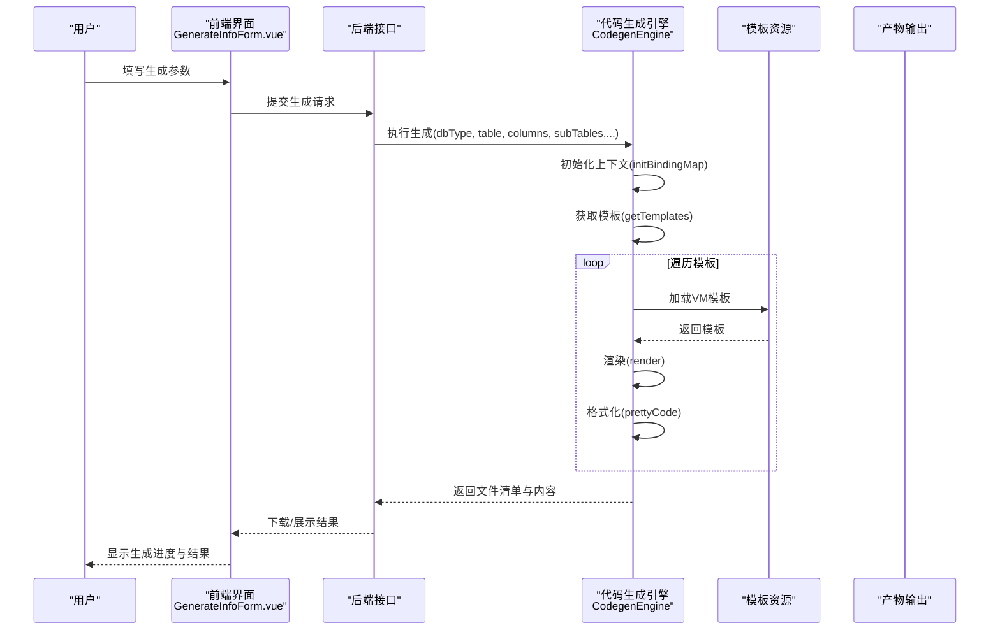
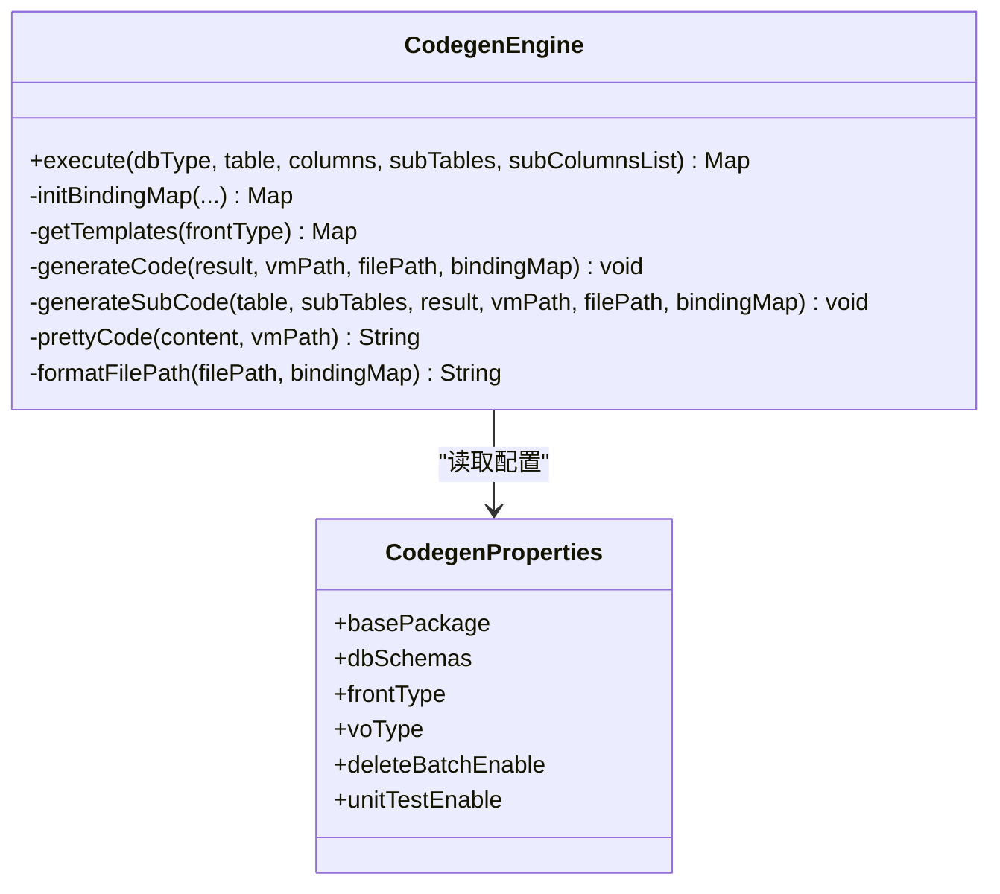
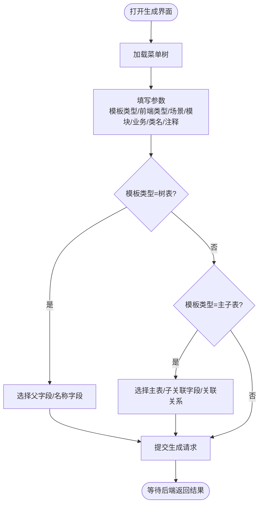
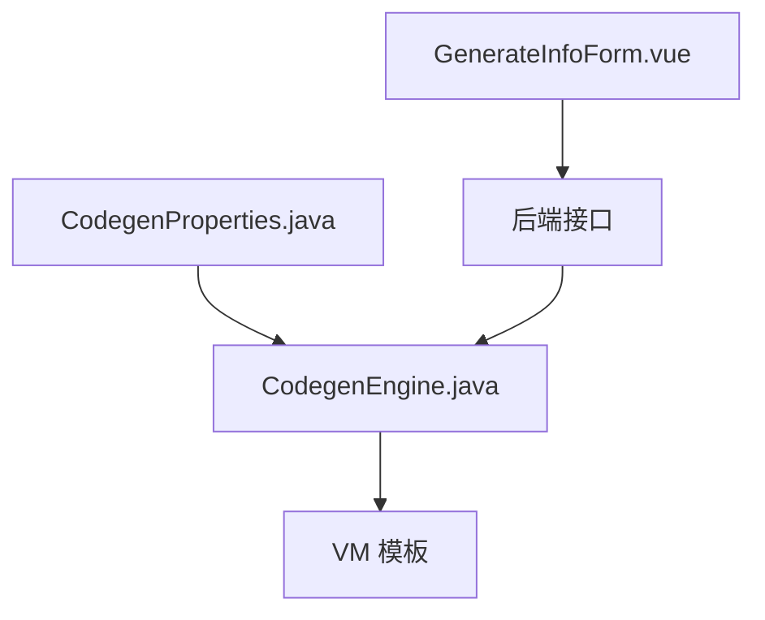

# 代码生成规则

<cite>
**本文引用的文件**
- [CodegenEngine.java](file://backend/qiji-module-infra/src/main/java/com/qiji/cps/module/infra/service/codegen/inner/CodegenEngine.java)
- [CodegenProperties.java](file://backend/qiji-module-infra/src/main/java/com/qiji/cps/module/infra/framework/codegen/config/CodegenProperties.java)
- [CodegenConfiguration.java](file://backend/qiji-module-infra/src/main/java/com/qiji/cps/module/infra/framework/codegen/config/CodegenConfiguration.java)
- [GenerateInfoForm.vue](file://frontend/admin-vue3/src/views/infra/codegen/components/GenerateInfoForm.vue)
- [codegen-rules.md](file://agent_improvement/memory/codegen-rules.md)
- [project_rules.md](file://frontend/admin-uniapp/.trae/rules/project_rules.md)
- [config.yaml](file://openspec/config.yaml)
</cite>

## 目录
1. [简介](#简介)
2. [项目结构](#项目结构)
3. [核心组件](#核心组件)
4. [架构总览](#架构总览)
5. [详细组件分析](#详细组件分析)
6. [依赖分析](#依赖分析)
7. [性能考量](#性能考量)
8. [故障排除指南](#故障排除指南)
9. [结论](#结论)
10. [附录](#附录)

## 简介
本指南面向“代码生成规则”的配置与落地，围绕后端 Velocity 模板引擎与前端多框架模板体系，系统讲解模板语法、变量替换、条件与循环、批量生成流程、并发控制、错误处理、进度跟踪、定制化规则、最佳实践以及不同前端框架（Vue3、UniApp 等）的模板差异与使用方法。文档以仓库中的代码生成引擎与规则文档为基础，结合前端生成界面与项目规范，提供从配置到落地的完整参考。

## 项目结构
- 后端代码生成引擎位于基础设施模块，负责加载模板、绑定上下文、渲染输出与格式化。
- 前端提供可视化生成配置表单，支持模板类型、前端框架类型、生成场景等参数选择。
- 项目内含多套前端模板（Element Plus、Vben、Ant Design、UniApp），覆盖 Vue3 与移动端场景。
- 通过配置属性集中管理基础包、数据库 Schema、前端类型、VO 类型、是否启用批量删除与单元测试等全局开关。

图表来源
- [GenerateInfoForm.vue:1-120](file://frontend/admin-vue3/src/views/infra/codegen/components/GenerateInfoForm.vue#L1-L120)
- [CodegenProperties.java:1-58](file://backend/qiji-module-infra/src/main/java/com/qiji/cps/module/infra/framework/codegen/config/CodegenProperties.java#L1-L58)
- [CodegenEngine.java:520-543](file://backend/qiji-module-infra/src/main/java/com/qiji/cps/module/infra/service/codegen/inner/CodegenEngine.java#L520-L543)

章节来源
- [GenerateInfoForm.vue:1-120](file://frontend/admin-vue3/src/views/infra/codegen/components/GenerateInfoForm.vue#L1-L120)
- [CodegenProperties.java:1-58](file://backend/qiji-module-infra/src/main/java/com/qiji/cps/module/infra/framework/codegen/config/CodegenProperties.java#L1-L58)
- [CodegenEngine.java:520-543](file://backend/qiji-module-infra/src/main/java/com/qiji/cps/module/infra/service/codegen/inner/CodegenEngine.java#L520-L543)

## 核心组件
- 代码生成引擎（后端）
  - 负责模板加载、上下文绑定、渲染与格式化；支持主子表、树表、不同前端模板类型与场景的差异化生成。
  - 提供全局变量映射（基础包、Jakarta/Javax 兼容、VO 类型、工具类等）。
- 生成配置（后端）
  - 通过配置类集中管理基础包、数据库 Schema、前端类型、VO 类型、是否启用批量删除与单元测试等。
- 生成界面（前端）
  - 提供模板类型、前端类型、生成场景、模块名、业务名、类名、类注释、树表/主子表字段等参数输入，支持菜单挂载与自定义生成路径。

章节来源
- [CodegenEngine.java:258-310](file://backend/qiji-module-infra/src/main/java/com/qiji/cps/module/infra/service/codegen/inner/CodegenEngine.java#L258-L310)
- [CodegenProperties.java:13-58](file://backend/qiji-module-infra/src/main/java/com/qiji/cps/module/infra/framework/codegen/config/CodegenProperties.java#L13-L58)
- [GenerateInfoForm.vue:1-120](file://frontend/admin-vue3/src/views/infra/codegen/components/GenerateInfoForm.vue#L1-L120)

## 架构总览
后端以 Velocity 模板引擎为核心，按前端类型与场景动态选择模板集合，渲染后进行统一格式化；前端通过表单收集参数，调用后端生成接口，返回文件清单与下载链接。

图表来源
- [CodegenEngine.java:321-351](file://backend/qiji-module-infra/src/main/java/com/qiji/cps/module/infra/service/codegen/inner/CodegenEngine.java#L321-L351)
- [GenerateInfoForm.vue:1-120](file://frontend/admin-vue3/src/views/infra/codegen/components/GenerateInfoForm.vue#L1-L120)

## 详细组件分析

### 后端代码生成引擎（CodegenEngine）
- 模板映射
  - 后端模板映射：定义 Java 模块、SQL、测试等模板与目标路径的映射关系。
  - 前端模板映射：按前端类型（Element Plus、Vben、Antd、UniApp 等）建立 VM 模板到目标路径的映射表。
- 上下文绑定
  - 全局变量：基础包、框架包、Jakarta/Javax、VO 类型、工具类等。
  - 表级变量：表名、业务名、类名、权限前缀、主键字段、场景枚举等。
  - 树表变量：父字段、名称字段及其下划线命名等。
  - 主子表变量：子表集合、子主键、关联字段、简化类名等。
- 渲染与格式化
  - 渲染后对前端代码进行逗号、字典、日期格式化等清理，确保生成代码风格一致。
- 模板选择与过滤
  - 根据模板类型（通用、树表、ERP 主表）与前端类型动态筛选模板集合。
  - 支持根据云环境（Boot/Cloud）调整模块路径。
  - 可按配置禁用单元测试与 VO 类型模板。

图表来源
- [CodegenEngine.java:321-351](file://backend/qiji-module-infra/src/main/java/com/qiji/cps/module/infra/service/codegen/inner/CodegenEngine.java#L321-L351)
- [CodegenEngine.java:430-518](file://backend/qiji-module-infra/src/main/java/com/qiji/cps/module/infra/service/codegen/inner/CodegenEngine.java#L430-L518)
- [CodegenEngine.java:520-543](file://backend/qiji-module-infra/src/main/java/com/qiji/cps/module/infra/service/codegen/inner/CodegenEngine.java#L520-L543)
- [CodegenProperties.java:13-58](file://backend/qiji-module-infra/src/main/java/com/qiji/cps/module/infra/framework/codegen/config/CodegenProperties.java#L13-L58)

章节来源
- [CodegenEngine.java:69-97](file://backend/qiji-module-infra/src/main/java/com/qiji/cps/module/infra/service/codegen/inner/CodegenEngine.java#L69-L97)
- [CodegenEngine.java:106-232](file://backend/qiji-module-infra/src/main/java/com/qiji/cps/module/infra/service/codegen/inner/CodegenEngine.java#L106-L232)
- [CodegenEngine.java:277-310](file://backend/qiji-module-infra/src/main/java/com/qiji/cps/module/infra/service/codegen/inner/CodegenEngine.java#L277-L310)
- [CodegenEngine.java:321-351](file://backend/qiji-module-infra/src/main/java/com/qiji/cps/module/infra/service/codegen/inner/CodegenEngine.java#L321-L351)
- [CodegenEngine.java:353-389](file://backend/qiji-module-infra/src/main/java/com/qiji/cps/module/infra/service/codegen/inner/CodegenEngine.java#L353-L389)
- [CodegenEngine.java:401-428](file://backend/qiji-module-infra/src/main/java/com/qiji/cps/module/infra/service/codegen/inner/CodegenEngine.java#L401-L428)
- [CodegenEngine.java:430-518](file://backend/qiji-module-infra/src/main/java/com/qiji/cps/module/infra/service/codegen/inner/CodegenEngine.java#L430-L518)
- [CodegenEngine.java:520-543](file://backend/qiji-module-infra/src/main/java/com/qiji/cps/module/infra/service/codegen/inner/CodegenEngine.java#L520-L543)

### 前端生成界面（GenerateInfoForm.vue）
- 功能要点
  - 模板类型、前端类型、生成场景、模块名、业务名、类名、类注释等必填项。
  - 树表场景下的父字段与名称字段选择。
  - 主子表场景下的主表关联、子表关联字段与关联关系（一对多/一对一）。
  - 菜单挂载与自定义生成路径（可选）。
- 交互流程
  - 加载菜单树、表列表，动态校验必填项，提交生成请求。

图表来源
- [GenerateInfoForm.vue:1-120](file://frontend/admin-vue3/src/views/infra/codegen/components/GenerateInfoForm.vue#L1-L120)
- [GenerateInfoForm.vue:186-293](file://frontend/admin-vue3/src/views/infra/codegen/components/GenerateInfoForm.vue#L186-L293)

章节来源
- [GenerateInfoForm.vue:1-120](file://frontend/admin-vue3/src/views/infra/codegen/components/GenerateInfoForm.vue#L1-L120)
- [GenerateInfoForm.vue:186-293](file://frontend/admin-vue3/src/views/infra/codegen/components/GenerateInfoForm.vue#L186-L293)

### 代码生成配置（CodegenProperties）
- 关键配置项
  - 基础包：Java 代码的基础包名。
  - 数据库 Schema：生成涉及的数据库名集合。
  - 前端类型：默认前端模板类型（如 Element Plus、Vben、Antd、UniApp）。
  - VO 类型：生成 VO 或 DO 作为请求/响应载体。
  - 批量删除：是否生成批量删除接口。
  - 单元测试：是否生成单元测试模板。
- 配置生效范围
  - 影响模板集合选择、模块路径、工具类注入与格式化策略。

章节来源
- [CodegenProperties.java:13-58](file://backend/qiji-module-infra/src/main/java/com/qiji/cps/module/infra/framework/codegen/config/CodegenProperties.java#L13-L58)

### Velocity 模板使用与变量替换
- 模板语法与变量
  - 通过引擎加载 VM 模板，使用绑定的上下文变量进行渲染。
  - 支持条件判断与循环（如主子表遍历、树表分支）。
- 变量来源
  - 全局变量：基础包、Jakarta/Javax、VO 类型、工具类等。
  - 表级变量：表名、业务名、类名、权限前缀、主键字段、场景枚举等。
  - 树表变量：父字段、名称字段及其下划线命名等。
  - 主子表变量：子表集合、子主键、关联字段、简化类名等。
- 输出格式化
  - 针对前端模板进行逗号、字典、日期格式化等清理，确保生成代码风格一致。

章节来源
- [CodegenEngine.java:277-310](file://backend/qiji-module-infra/src/main/java/com/qiji/cps/module/infra/service/codegen/inner/CodegenEngine.java#L277-L310)
- [CodegenEngine.java:430-518](file://backend/qiji-module-infra/src/main/java/com/qiji/cps/module/infra/service/codegen/inner/CodegenEngine.java#L430-L518)
- [CodegenEngine.java:401-428](file://backend/qiji-module-infra/src/main/java/com/qiji/cps/module/infra/service/codegen/inner/CodegenEngine.java#L401-L428)

### 代码生成配置（模板选择、参数传递、输出格式、文件结构）
- 模板选择
  - 后端模板：Java 模块、SQL、测试等模板映射。
  - 前端模板：按前端类型与场景选择模板集合。
- 参数传递
  - 通过上下文 Map 传递 dbType、table、columns、subTables、subColumnsList 等。
- 输出格式
  - 渲染后统一进行代码格式化，去除冗余逗号、字典导入等。
- 文件结构
  - 后端按模块与场景生成层级结构；前端按模板类型生成对应目录与文件。

章节来源
- [CodegenEngine.java:69-97](file://backend/qiji-module-infra/src/main/java/com/qiji/cps/module/infra/service/codegen/inner/CodegenEngine.java#L69-L97)
- [CodegenEngine.java:106-232](file://backend/qiji-module-infra/src/main/java/com/qiji/cps/module/infra/service/codegen/inner/CodegenEngine.java#L106-L232)
- [CodegenEngine.java:545-575](file://backend/qiji-module-infra/src/main/java/com/qiji/cps/module/infra/service/codegen/inner/CodegenEngine.java#L545-L575)

### 批量生成流程（机制、并发、错误处理、进度跟踪）
- 批量机制
  - 引擎按模板集合顺序执行渲染，主子表通过循环逐个生成。
- 并发控制
  - 当前实现为顺序执行，未见显式并发控制逻辑。
- 错误处理
  - 通过统一异常工具类抛出业务异常；前端通过消息提示与表单校验反馈。
- 进度跟踪
  - 前端表单提供参数校验与提交流程提示；后端返回文件清单与内容。

章节来源
- [CodegenEngine.java:362-389](file://backend/qiji-module-infra/src/main/java/com/qiji/cps/module/infra/service/codegen/inner/CodegenEngine.java#L362-L389)
- [GenerateInfoForm.vue:336-350](file://frontend/admin-vue3/src/views/infra/codegen/components/GenerateInfoForm.vue#L336-L350)

### 定制化规则（模板开发、规则扩展、特殊处理、兼容性）
- 自定义模板开发
  - 在后端模板目录中新增 VM 模板，按需扩展模板映射与路径格式化规则。
- 规则扩展
  - 通过配置类扩展全局变量与工具类注入；通过引擎扩展上下文变量与格式化策略。
- 特殊处理
  - 树表与主子表的分支与循环处理；Boot/Cloud 环境下的模块路径适配。
- 兼容性
  - Jakarta/Javax 注解包自动识别；Spring Boot 2.x/3.x 兼容处理。

章节来源
- [CodegenEngine.java:264-275](file://backend/qiji-module-infra/src/main/java/com/qiji/cps/module/infra/service/codegen/inner/CodegenEngine.java#L264-L275)
- [CodegenEngine.java:524-531](file://backend/qiji-module-infra/src/main/java/com/qiji/cps/module/infra/service/codegen/inner/CodegenEngine.java#L524-L531)

### 前端框架模板差异与使用（Vue3、UniApp 等）
- Vue3 Element Plus
  - 目录结构：API、视图、组件；提供分页、表单、列表等模板。
- Vben Admin（Antd Schema/General）
  - 目录结构：API、视图、配置数据；提供表格、表单、弹窗等模板。
- UniApp 移动端
  - 目录结构：API、页面（列表/表单/详情）、搜索组件；适配多端开发。

章节来源
- [codegen-rules.md:329-491](file://agent_improvement/memory/codegen-rules.md#L329-L491)
- [codegen-rules.md:492-629](file://agent_improvement/memory/codegen-rules.md#L492-L629)
- [codegen-rules.md:631-659](file://agent_improvement/memory/codegen-rules.md#L631-L659)
- [codegen-rules.md:661-744](file://agent_improvement/memory/codegen-rules.md#L661-L744)
- [project_rules.md:1-122](file://frontend/admin-uniapp/.trae/rules/project_rules.md#L1-L122)

## 依赖分析
- 组件耦合
  - 生成引擎依赖配置类与模板资源；前端表单依赖后端接口与字典枚举。
- 外部依赖
  - Velocity 模板引擎、Hutool 模板抽象、Spring 环境、前端 UI 组件库。

图表来源
- [CodegenProperties.java:13-58](file://backend/qiji-module-infra/src/main/java/com/qiji/cps/module/infra/framework/codegen/config/CodegenProperties.java#L13-L58)
- [CodegenEngine.java:520-543](file://backend/qiji-module-infra/src/main/java/com/qiji/cps/module/infra/service/codegen/inner/CodegenEngine.java#L520-L543)
- [GenerateInfoForm.vue:1-120](file://frontend/admin-vue3/src/views/infra/codegen/components/GenerateInfoForm.vue#L1-L120)

章节来源
- [CodegenConfiguration.java:1-9](file://backend/qiji-module-infra/src/main/java/com/qiji/cps/module/infra/framework/codegen/config/CodegenConfiguration.java#L1-L9)
- [CodegenProperties.java:13-58](file://backend/qiji-module-infra/src/main/java/com/qiji/cps/module/infra/framework/codegen/config/CodegenProperties.java#L13-L58)
- [CodegenEngine.java:520-543](file://backend/qiji-module-infra/src/main/java/com/qiji/cps/module/infra/service/codegen/inner/CodegenEngine.java#L520-L543)

## 性能考量
- 模板数量与渲染开销
  - 模板越多，渲染与格式化耗时越长；建议按需启用单元测试与 VO 类型模板。
- 路径格式化与字符串替换
  - 路径格式化与字符串替换为 O(n) 操作，注意避免重复替换。
- 前端格式化
  - 生成后统一格式化可减少前端校验失败导致的重试成本。

## 故障排除指南
- 常见问题
  - 模板路径错误：检查模板映射与路径格式化逻辑。
  - 变量缺失：确认上下文初始化与模板变量注入。
  - 前端格式化报错：检查 prettyCode 清理逻辑与模板差异。
  - 树表/主子表异常：核对模板类型与分支过滤逻辑。
- 定位步骤
  - 查看生成日志与异常堆栈；核对前端表单参数与后端配置；验证模板资源是否存在。

章节来源
- [CodegenEngine.java:401-428](file://backend/qiji-module-infra/src/main/java/com/qiji/cps/module/infra/service/codegen/inner/CodegenEngine.java#L401-L428)
- [CodegenEngine.java:362-389](file://backend/qiji-module-infra/src/main/java/com/qiji/cps/module/infra/service/codegen/inner/CodegenEngine.java#L362-L389)

## 结论
本指南基于仓库现有代码生成引擎与规则文档，系统梳理了 Velocity 模板使用、配置参数、前后端模板差异与批量生成流程。通过合理配置与模板扩展，可在多前端框架下高效生成标准化代码，提升开发效率与一致性。

## 附录
- 配置示例
  - 基础包与前端类型：在配置类中设置基础包与默认前端类型。
  - 模板类型与场景：在前端表单中选择模板类型与生成场景。
- 模板示例
  - 后端模板映射与前端模板映射分别定义了生成路径与目标目录。
- 最佳实践
  - 模板设计：保持简洁，将复杂逻辑放入上下文与格式化阶段。
  - 性能优化：按需启用模板，减少不必要的渲染与格式化。
  - 质量保证：统一格式化策略，确保生成代码风格一致。

章节来源
- [config.yaml:1-20](file://openspec/config.yaml#L1-L20)
- [CodegenEngine.java:69-97](file://backend/qiji-module-infra/src/main/java/com/qiji/cps/module/infra/service/codegen/inner/CodegenEngine.java#L69-L97)
- [CodegenEngine.java:106-232](file://backend/qiji-module-infra/src/main/java/com/qiji/cps/module/infra/service/codegen/inner/CodegenEngine.java#L106-L232)
- [codegen-rules.md:1-788](file://agent_improvement/memory/codegen-rules.md#L1-L788)
- [project_rules.md:1-122](file://frontend/admin-uniapp/.trae/rules/project_rules.md#L1-L122)