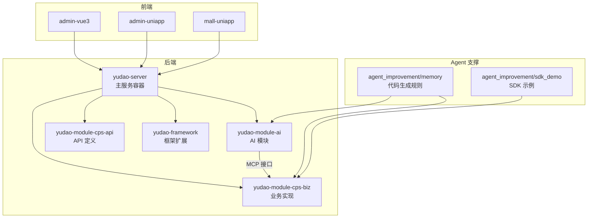
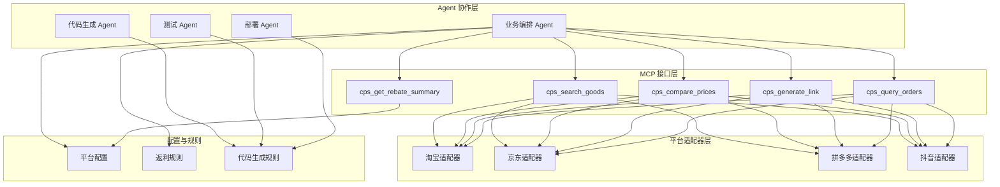
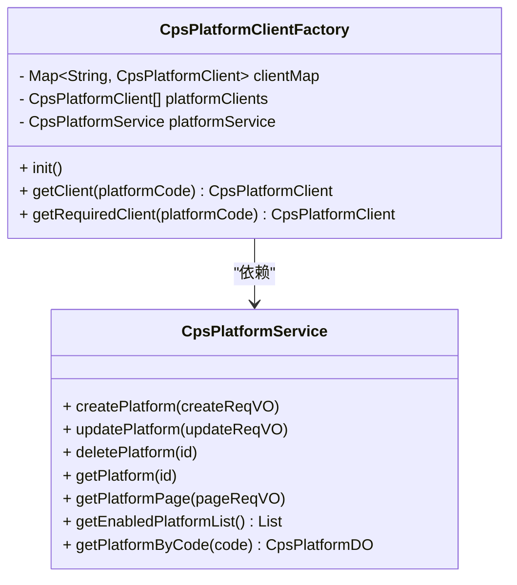
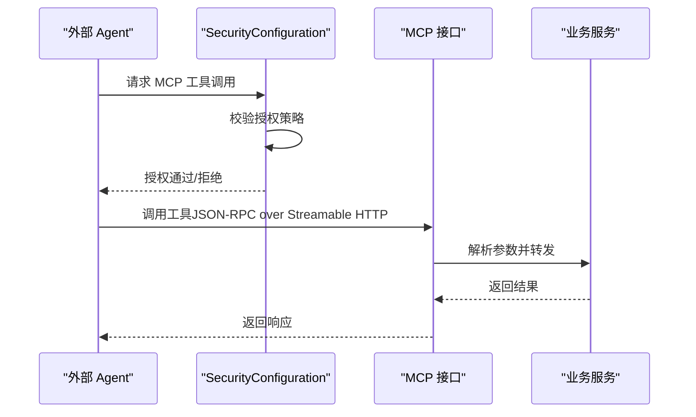
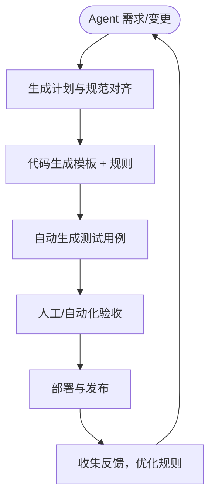
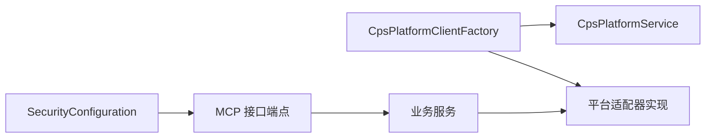

# AI 代理协作机制

<cite>
**本文引用的文件**   
- [AGENTS.md](file://AGENTS.md)
- [README.md](file://README.md)
- [MEMORY.md](file://agent_improvement/memory/MEMORY.md)
- [codegen-rules.md](file://agent_improvement/memory/codegen-rules.md)
- [SecurityConfiguration.java](file://backend/yudao-module-ai/src/main/java/cn/iocoder/yudao/module/ai/framework/security/config/SecurityConfiguration.java)
- [CpsPlatformClientFactory.java](file://backend/yudao-module-cps/yudao-module-cps-biz/src/main/java/cn/iocoder/yudao/module/cps/client/CpsPlatformClientFactory.java)
- [CpsPlatformService.java](file://backend/yudao-module-cps/yudao-module-cps-biz/src/main/java/cn/iocoder/yudao/module/cps/service/platform/CpsPlatformService.java)
</cite>

## 目录
1. [简介](#简介)
2. [项目结构](#项目结构)
3. [核心组件](#核心组件)
4. [架构总览](#架构总览)
5. [详细组件分析](#详细组件分析)
6. [依赖关系分析](#依赖关系分析)
7. [性能考量](#性能考量)
8. [故障排查指南](#故障排查指南)
9. [结论](#结论)
10. [附录](#附录)

## 简介
本文件系统化阐述 AgenticCPS 的 AI 代理协作机制，围绕多 Agent 协同架构、通信协议、配置管理、角色分工与任务分配、信息共享与状态同步、冲突解决、能力矩阵与技能匹配、负载均衡策略、扩展开发指南、实际协作案例以及故障处理与异常恢复等方面进行全面说明。AgenticCPS 以 Spring Boot 为基础，融合 Spring AI 与 MCP（Model Context Protocol）协议，实现 AI Agent 的零代码接入与自动化协作；同时通过“Vibe Coding + 低代码 + AI 自主编程”的工作流，支撑 Agent 的持续演进与规模化扩展。

## 项目结构
AgenticCPS 采用模块化分层架构，AI 与 CPS 核心能力分别置于独立模块中，便于 Agent 的独立扩展与协作：
- 后端模块
  - yudao-module-ai：AI 模块，提供 Spring AI 与 MCP 协议支持，包含安全配置与授权定制。
  - yudao-module-cps：CPS 联盟返利核心模块，包含 API 定义、业务实现、平台适配器、数据访问层、定时任务与 MCP 接口层。
  - yudao-framework：框架扩展（安全、缓存、权限、多租户等）。
  - yudao-server：主服务容器，聚合各模块。
- 前端模块
  - admin-vue3、admin-uniapp、mall-uniapp：多端前端，支撑管理后台与移动端。
- Agent 支撑
  - agent_improvement/memory：代码生成规则与 Claude 记忆索引，支撑 Agent 的规范化扩展。
  - agent_improvement/sdk_demo：第三方 SDK 示例（如大淘客 Java SDK），用于平台对接参考。

**图示来源**
- [AGENTS.md:11-57](file://AGENTS.md#L11-L57)
- [README.md:267-284](file://README.md#L267-L284)

**章节来源**
- [AGENTS.md:11-57](file://AGENTS.md#L11-L57)
- [README.md:229-249](file://README.md#L229-L249)

## 核心组件
- 平台适配器工厂（策略模式）
  - 通过工厂集中注册与发现各平台适配器，支持按平台编码动态获取客户端实例，实现平台扩展的零侵入。
- 平台配置服务
  - 提供平台配置的增删改查、分页查询、启用列表与按编码查询等能力，支撑 Agent 的配置驱动式协作。
- MCP 安全配置
  - 基于 Spring Security 与 MCP 协议特性，定制授权策略，确保 MCP 接口的安全访问。
- 代码生成规则与 Agent 记忆
  - 通过规范化模板与规则，支撑 Agent 的自动生成与持续优化，降低 Agent 扩展成本。

**章节来源**
- [CpsPlatformClientFactory.java:14-77](file://backend/yudao-module-cps/yudao-module-cps-biz/src/main/java/cn/iocoder/yudao/module/cps/client/CpsPlatformClientFactory.java#L14-L77)
- [CpsPlatformService.java:11-53](file://backend/yudao-module-cps/yudao-module-cps-biz/src/main/java/cn/iocoder/yudao/module/cps/service/platform/CpsPlatformService.java#L11-L53)
- [SecurityConfiguration.java:14-30](file://backend/yudao-module-ai/src/main/java/cn/iocoder/yudao/module/ai/framework/security/config/SecurityConfiguration.java#L14-L30)
- [MEMORY.md:1-21](file://agent_improvement/memory/MEMORY.md#L1-L21)
- [codegen-rules.md:1-788](file://agent_improvement/memory/codegen-rules.md#L1-L788)

## 架构总览
AgenticCPS 的 Agent 协作架构以“平台适配器 + MCP 接口 + 配置驱动 + 规则化生成”为核心：
- 平台适配器层：统一抽象各电商联盟的搜索、详情、链接生成、订单查询等能力，通过策略模式注册与发现。
- MCP 接口层：提供标准化的 AI Tools（搜索、比价、生成链接、查询订单、返利汇总），Agent 可直接调用。
- 配置与规则：平台配置、返利规则、Agent 记忆与代码生成规则共同决定 Agent 的行为边界与协作策略。
- 安全与授权：MCP 接口的安全配置确保外部 Agent 的访问受控。

**图示来源**
- [AGENTS.md:143-168](file://AGENTS.md#L143-L168)
- [AGENTS.md:194-209](file://AGENTS.md#L194-L209)
- [codegen-rules.md:327-788](file://agent_improvement/memory/codegen-rules.md#L327-L788)

## 详细组件分析

### 平台适配器工厂（策略模式）
- 职责
  - 注册：启动时扫描并注册所有实现了平台客户端接口的 Bean。
  - 发现：按平台编码动态获取对应客户端实例，支持必需存在校验。
- 关键点
  - 基于并发映射表维护平台编码到客户端的映射，保证高并发场景下的稳定性。
  - 未找到适配器时的日志提示，便于问题定位与扩展验证。
- 与 Agent 的关系
  - Agent 通过 MCP 工具调用时，编排 Agent 将根据业务上下文选择合适的平台编码，工厂负责提供具体实现。

**图示来源**
- [CpsPlatformClientFactory.java:14-77](file://backend/yudao-module-cps/yudao-module-cps-biz/src/main/java/cn/iocoder/yudao/module/cps/client/CpsPlatformClientFactory.java#L14-L77)
- [CpsPlatformService.java:11-53](file://backend/yudao-module-cps/yudao-module-cps-biz/src/main/java/cn/iocoder/yudao/module/cps/service/platform/CpsPlatformService.java#L11-L53)

**章节来源**
- [CpsPlatformClientFactory.java:14-77](file://backend/yudao-module-cps/yudao-module-cps-biz/src/main/java/cn/iocoder/yudao/module/cps/client/CpsPlatformClientFactory.java#L14-L77)
- [CpsPlatformService.java:11-53](file://backend/yudao-module-cps/yudao-module-cps-biz/src/main/java/cn/iocoder/yudao/module/cps/service/platform/CpsPlatformService.java#L11-L53)

### MCP 安全配置
- 职责
  - 基于 Spring Security 定制 MCP 接口的授权策略，结合 MCP SSE 与 Streamable HTTP 配置，确保 MCP 端点的安全访问。
- 关键点
  - 通过 AuthorizeRequestsCustomizer 定义访问控制规则，避免未授权调用。
  - 与 MCP Server 配置属性联动，确保协议端点正确暴露与保护。

**图示来源**
- [SecurityConfiguration.java:25-30](file://backend/yudao-module-ai/src/main/java/cn/iocoder/yudao/module/ai/framework/security/config/SecurityConfiguration.java#L25-L30)
- [AGENTS.md:161-168](file://AGENTS.md#L161-L168)

**章节来源**
- [SecurityConfiguration.java:14-30](file://backend/yudao-module-ai/src/main/java/cn/iocoder/yudao/module/ai/framework/security/config/SecurityConfiguration.java#L14-L30)
- [AGENTS.md:161-168](file://AGENTS.md#L161-L168)

### 代码生成规则与 Agent 记忆
- 作用
  - 为 Agent 的自动生成与持续优化提供模板与规范，降低 Agent 扩展成本，提升一致性与可维护性。
- 关键点
  - 后端分层结构、命名约定、DO/Mapper/Service/Controller/VO 规范，前端模板（Vue3、Vben、UniApp）等。
  - 支持模板类型（通用、树表、ERP 主表）与错误码规范，确保生成代码的质量与一致性。

**图示来源**
- [codegen-rules.md:5-29](file://agent_improvement/memory/codegen-rules.md#L5-L29)
- [codegen-rules.md:327-788](file://agent_improvement/memory/codegen-rules.md#L327-L788)
- [MEMORY.md:1-21](file://agent_improvement/memory/MEMORY.md#L1-L21)

**章节来源**
- [codegen-rules.md:1-788](file://agent_improvement/memory/codegen-rules.md#L1-L788)
- [MEMORY.md:1-21](file://agent_improvement/memory/MEMORY.md#L1-L21)

## 依赖关系分析
- 组件耦合
  - 平台适配器工厂与平台配置服务存在直接依赖，用于在启动阶段注册适配器并校验平台可用性。
  - MCP 安全配置与 MCP 协议端点存在间接依赖，通过授权策略保障接口安全。
- 外部依赖
  - Spring AI 与 MCP Server 提供 AI Agent 的协议支持。
  - 各电商联盟平台 API 作为外部资源，通过适配器抽象接入。
- 潜在风险
  - 平台适配器缺失会导致编排 Agent 无法获取对应能力。
  - MCP 授权策略不当可能导致接口被滥用或无法访问。

**图示来源**
- [CpsPlatformClientFactory.java:34-38](file://backend/yudao-module-cps/yudao-module-cps-biz/src/main/java/cn/iocoder/yudao/module/cps/client/CpsPlatformClientFactory.java#L34-L38)
- [CpsPlatformService.java:11-53](file://backend/yudao-module-cps/yudao-module-cps-biz/src/main/java/cn/iocoder/yudao/module/cps/service/platform/CpsPlatformService.java#L11-L53)
- [SecurityConfiguration.java:25-30](file://backend/yudao-module-ai/src/main/java/cn/iocoder/yudao/module/ai/framework/security/config/SecurityConfiguration.java#L25-L30)

**章节来源**
- [CpsPlatformClientFactory.java:34-38](file://backend/yudao-module-cps/yudao-module-cps-biz/src/main/java/cn/iocoder/yudao/module/cps/client/CpsPlatformClientFactory.java#L34-L38)
- [CpsPlatformService.java:11-53](file://backend/yudao-module-cps/yudao-module-cps-biz/src/main/java/cn/iocoder/yudao/module/cps/service/platform/CpsPlatformService.java#L11-L53)
- [SecurityConfiguration.java:25-30](file://backend/yudao-module-ai/src/main/java/cn/iocoder/yudao/module/ai/framework/security/config/SecurityConfiguration.java#L25-L30)

## 性能考量
- 搜索与比价
  - 单平台搜索 P99 < 2 秒，多平台比价 P99 < 5 秒，确保 Agent 在交互中的即时响应。
- 链接生成与订单同步
  - 转链生成 P99 < 1 秒，订单同步延迟 < 30 分钟，保障 Agent 的业务闭环效率。
- MCP 工具调用
  - 搜索类工具 P99 < 3 秒，查询类工具 P99 < 1 秒，满足 Agent 的高频调用性能要求。

**章节来源**
- [README.md:332-341](file://README.md#L332-L341)

## 故障排查指南
- 平台适配器缺失
  - 现象：编排 Agent 调用工具时报错或返回空结果。
  - 排查：检查平台编码是否正确、适配器是否注册成功、日志中是否存在未找到适配器的警告。
  - 处理：新增适配器实现并确保以 Spring Bean 形式注册，重启后验证。
- MCP 授权失败
  - 现象：外部 Agent 无法访问 MCP 工具。
  - 排查：检查安全配置中的授权策略与端点暴露情况。
  - 处理：调整 AuthorizeRequestsCustomizer 规则或 MCP Server 配置。
- 代码生成异常
  - 现象：Agent 生成的代码不符合预期或编译失败。
  - 排查：核对模板变量与规则配置，确认模板类型与命名约定。
  - 处理：修正模板或规则，重新生成并验证。

**章节来源**
- [CpsPlatformClientFactory.java:57-77](file://backend/yudao-module-cps/yudao-module-cps-biz/src/main/java/cn/iocoder/yudao/module/cps/client/CpsPlatformClientFactory.java#L57-L77)
- [SecurityConfiguration.java:25-30](file://backend/yudao-module-ai/src/main/java/cn/iocoder/yudao/module/ai/framework/security/config/SecurityConfiguration.java#L25-L30)
- [codegen-rules.md:327-788](file://agent_improvement/memory/codegen-rules.md#L327-L788)

## 结论
AgenticCPS 通过“平台适配器 + MCP 接口 + 配置驱动 + 规则化生成”的组合拳，构建了可扩展、可协作、可自治的 AI 代理生态。平台适配器工厂与平台配置服务确保能力的可插拔与可配置，MCP 安全配置保障接口安全，代码生成规则与 Agent 记忆推动持续演进。在性能与可靠性方面，系统提供了明确的指标与优化方向。通过本指南，读者可快速理解并实践多 Agent 的协作机制，实现从需求到交付的高效闭环。

## 附录
- MCP 工具清单
  - cps_search_goods：商品搜索
  - cps_compare_prices：多平台比价
  - cps_generate_link：推广链接生成
  - cps_query_orders：订单查询
  - cps_get_rebate_summary：返利汇总
- 代码生成模板类型
  - 通用（1）、树表（2）、ERP 主表（11）
- 平台适配器扩展步骤
  - 实现平台客户端接口并注册为 Spring Bean
  - 在平台配置中启用对应平台
  - 编排 Agent 通过平台编码选择适配器

**章节来源**
- [AGENTS.md:194-209](file://AGENTS.md#L194-L209)
- [codegen-rules.md:307-314](file://agent_improvement/memory/codegen-rules.md#L307-L314)
- [AGENTS.md:143-159](file://AGENTS.md#L143-L159)