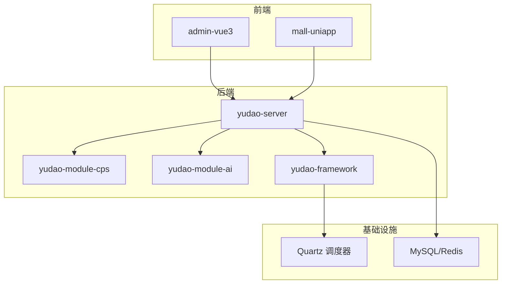
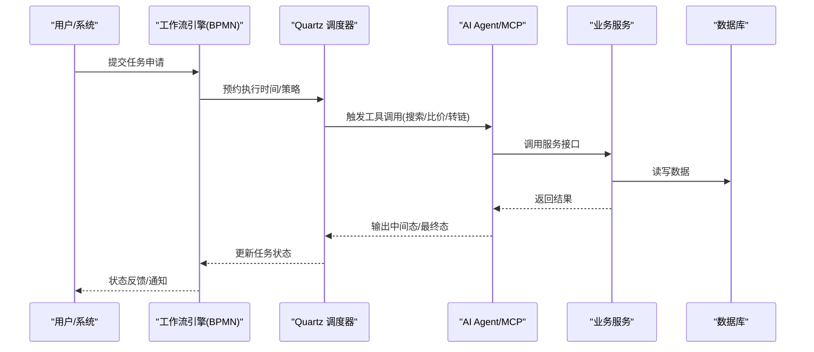
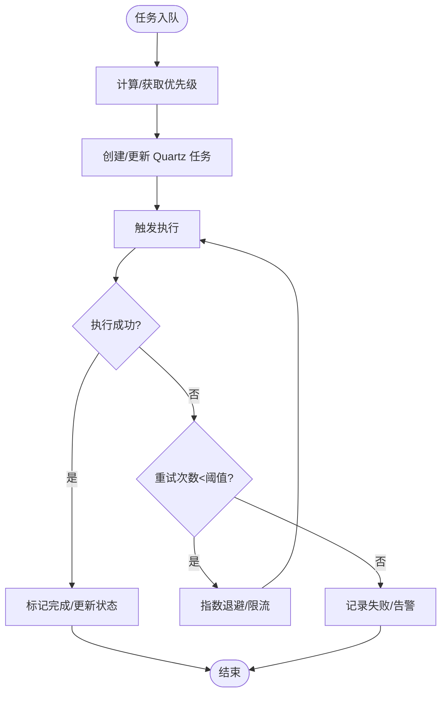
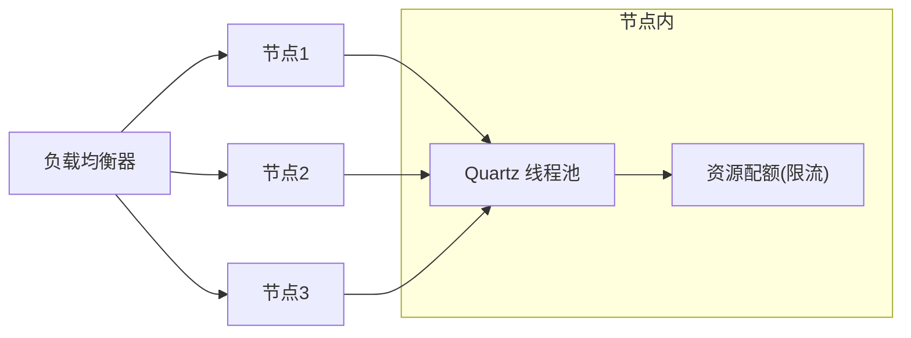
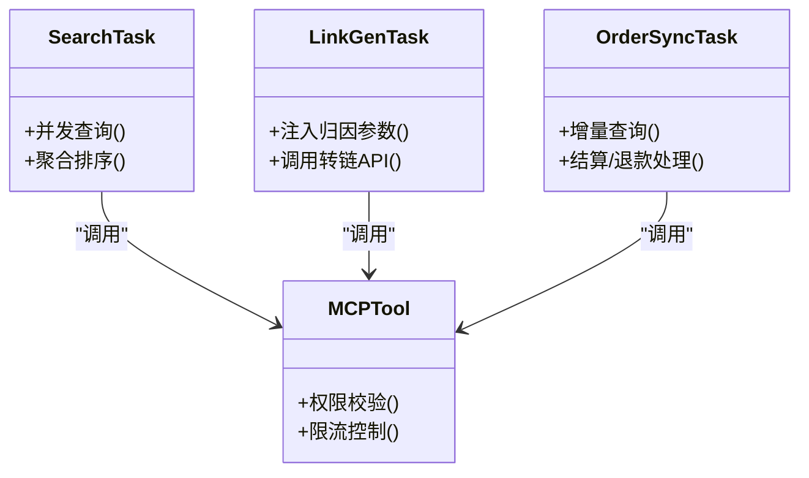
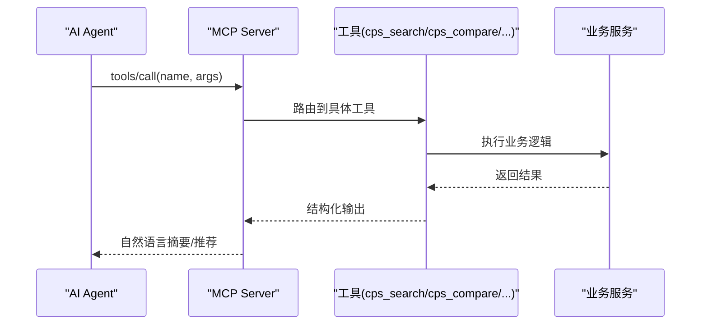
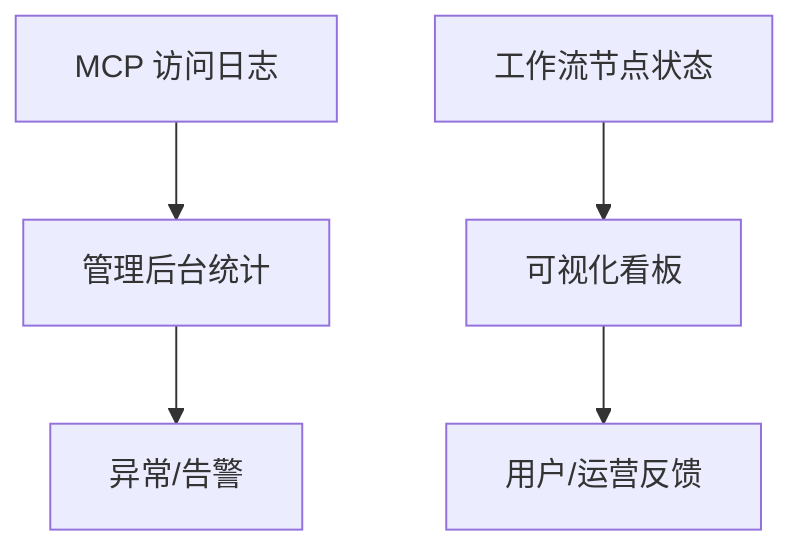
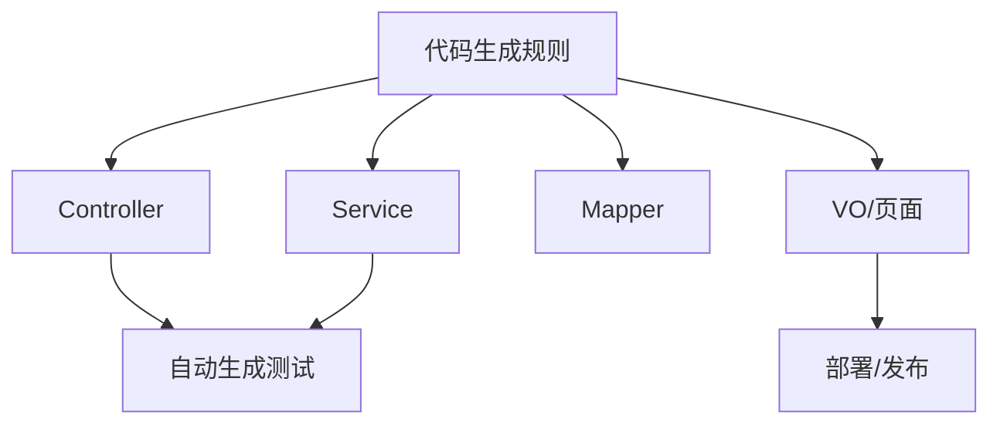
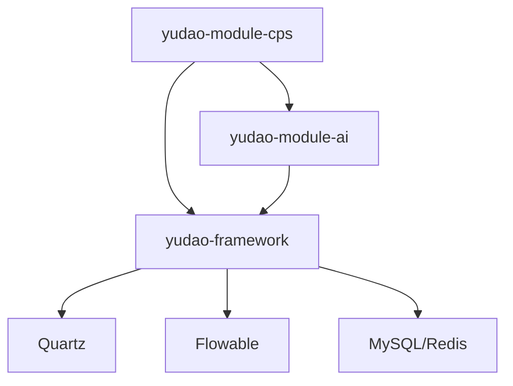

# Agent 任务分配

<cite>
**本文引用的文件**
- [AGENTS.md](file://AGENTS.md)
- [README.md](file://README.md)
- [CPS系统PRD文档.md](file://docs/CPS系统PRD文档.md)
- [codegen-rules.md](file://agent_improvement/memory/codegen-rules.md)
- [application-local.yaml](file://backend/yudao-server/src/main/resources/application-local.yaml)
- [SchedulerManager.java](file://backend/yudao-framework/yudao-spring-boot-starter-job/src/main/java/cn/iocoder/yudao/framework/quartz/core/scheduler/SchedulerManager.java)
- [AiChatMessageServiceImpl.java](file://backend/yudao-module-ai/src/main/java/cn/iocoder/yudao/module/ai/service/chat/AiChatMessageServiceImpl.java)
- [DouBaoMcpTests.java](file://backend/yudao-module-ai/src/test/java/cn/iocoder/yudao/module/ai/framework/ai/core/model/mcp/DouBaoMcpTests.java)
- [flowableDescriptor.json](file://frontend/admin-vue3/src/components/bpmnProcessDesigner/package/designer/plugins/descriptor/flowableDescriptor.json)
- [ruoyi-vue-pro.sql（MySQL）](file://backend/sql/mysql/ruoyi-vue-pro.sql)
- [quartz.sql（MySQL）](file://backend/sql/mysql/quartz.sql)
</cite>

## 目录
1. [简介](#简介)
2. [项目结构](#项目结构)
3. [核心组件](#核心组件)
4. [架构总览](#架构总览)
5. [详细组件分析](#详细组件分析)
6. [依赖关系分析](#依赖关系分析)
7. [性能考量](#性能考量)
8. [故障排查指南](#故障排查指南)
9. [结论](#结论)
10. [附录](#附录)

## 简介
本文件聚焦于 Agent 任务分配机制，围绕任务调度算法、优先级管理、资源分配策略、任务类型分类、执行策略与超时处理、Agent 能力矩阵与技能匹配、负载均衡、监控与进度跟踪、状态反馈、性能优化与扩展性，以及典型场景（代码生成、测试、部署）的任务分配策略进行系统化阐述。结合仓库中的 CPS 系统与 AI 模块，给出可落地的实现参考与最佳实践。

## 项目结构
- 后端采用 Spring Boot + 多模块架构，核心模块包括 yudao-module-cps（CPS 业务）、yudao-module-ai（AI 与 MCP）、yudao-framework（Quartz 定时任务、监控等基础设施）。
- 前端包含管理后台与移动端，支撑工作流与任务分配的可视化配置与监控。
- 任务分配与调度主要依托 Quartz（分布式集群 + JDBC 存储），并通过 BPMN 工作流进行任务候选策略配置。

**章节来源**
- [AGENTS.md:11-57](file://AGENTS.md#L11-L57)
- [README.md:229-284](file://README.md#L229-L284)

## 核心组件
- 任务调度与分配
  - Quartz：分布式集群 + JDBC 存储，支持任务持久化与容错。
  - SchedulerManager：封装任务创建、更新、触发，统一管理任务处理器与参数。
- 工作流与任务候选策略
  - BPMN 用户任务支持候选策略（角色、部门成员、部门负责人、用户、用户组），用于任务分配。
- AI 与 MCP
  - AI Chat 服务与 MCP 测试用例展示了 AI Agent 的工具调用与交互流程，为任务编排与执行提供参考。
- 代码生成与低代码
  - 代码生成规则定义了标准的 CRUD 与前端页面生成模板，便于快速扩展任务执行器与监控界面。

**章节来源**
- [application-local.yaml:90-113](file://backend/yudao-server/src/main/resources/application-local.yaml#L90-L113)
- [SchedulerManager.java:1-65](file://backend/yudao-framework/yudao-spring-boot-starter-job/src/main/java/cn/iocoder/yudao/framework/quartz/core/scheduler/SchedulerManager.java#L1-L65)
- [flowableDescriptor.json:275-337](file://frontend/admin-vue3/src/components/bpmnProcessDesigner/package/designer/plugins/descriptor/flowableDescriptor.json#L275-L337)
- [AiChatMessageServiceImpl.java:22-43](file://backend/yudao-module-ai/src/main/java/cn/iocoder/yudao/module/ai/service/chat/AiChatMessageServiceImpl.java#L22-L43)
- [DouBaoMcpTests.java:30-69](file://backend/yudao-module-ai/src/test/java/cn/iocoder/yudao/module/ai/framework/ai/core/model/mcp/DouBaoMcpTests.java#L30-L69)
- [codegen-rules.md:1-788](file://agent_improvement/memory/codegen-rules.md#L1-L788)

## 架构总览
Agent 任务分配的整体流程如下：
- 任务类型识别与分类（搜索、比价、转链、订单查询、返利汇总、定时同步、日志清理等）。
- 任务优先级与资源约束（CPU/IO/网络/平台限流）。
- 任务调度与执行（Quartz + 工作流候选策略）。
- Agent 能力矩阵与技能匹配（MCP 工具集）。
- 负载均衡与超时处理（限流、重试、熔断）。
- 监控与状态反馈（日志、指标、告警）。

**图表来源**
- [flowableDescriptor.json:275-337](file://frontend/admin-vue3/src/components/bpmnProcessDesigner/package/designer/plugins/descriptor/flowableDescriptor.json#L275-L337)
- [application-local.yaml:90-113](file://backend/yudao-server/src/main/resources/application-local.yaml#L90-L113)
- [AiChatMessageServiceImpl.java:22-43](file://backend/yudao-module-ai/src/main/java/cn/iocoder/yudao/module/ai/service/chat/AiChatMessageServiceImpl.java#L22-L43)

## 详细组件分析

### 任务调度与优先级管理
- 调度器配置
  - Quartz 使用 JDBC 存储，开启集群模式，线程池大小可配置，确保高可用与弹性伸缩。
- 任务优先级
  - 通过 Quartz 触发器优先级字段与业务策略（如“紧急订单同步”高于“日统计”）实现差异化调度。
- 重试与容错
  - 任务处理器支持重试次数与间隔配置，避免瞬时故障导致任务失败。

**图表来源**
- [SchedulerManager.java:40-65](file://backend/yudao-framework/yudao-spring-boot-starter-job/src/main/java/cn/iocoder/yudao/framework/quartz/core/scheduler/SchedulerManager.java#L40-L65)
- [application-local.yaml:90-113](file://backend/yudao-server/src/main/resources/application-local.yaml#L90-L113)

**章节来源**
- [application-local.yaml:90-113](file://backend/yudao-server/src/main/resources/application-local.yaml#L90-L113)
- [SchedulerManager.java:1-65](file://backend/yudao-framework/yudao-spring-boot-starter-job/src/main/java/cn/iocoder/yudao/framework/quartz/core/scheduler/SchedulerManager.java#L1-L65)

### 资源分配策略与负载均衡
- 资源抽象
  - CPU/IO/网络/平台 API 限流作为资源约束，避免过载。
- 负载均衡
  - 多实例部署 + Quartz 集群，任务在节点间均衡分配。
  - 工作流候选策略支持按角色/部门/用户等维度选择执行人，实现软负载均衡。
- 超时与熔断
  - 平台 API 调用设置超时与熔断阈值，失败快速失败并记录。

**图表来源**
- [application-local.yaml:90-113](file://backend/yudao-server/src/main/resources/application-local.yaml#L90-L113)
- [flowableDescriptor.json:275-337](file://frontend/admin-vue3/src/components/bpmnProcessDesigner/package/designer/plugins/descriptor/flowableDescriptor.json#L275-L337)

**章节来源**
- [flowableDescriptor.json:275-337](file://frontend/admin-vue3/src/components/bpmnProcessDesigner/package/designer/plugins/descriptor/flowableDescriptor.json#L275-L337)

### 任务类型分类与执行策略
- 任务类型
  - 搜索类：cps_search/cps_compare（并发查询多平台，聚合结果）
  - 链接生成类：cps_generate_link（注入归因参数，调用平台转链）
  - 订单类：cps_query_orders/cps_get_rebate_summary（定时同步、结算、入账）
  - 管理类：MCP 服务管理、Tools 配置、访问日志与统计
- 执行策略
  - 搜索/比价：并发策略 + 聚合排序（价格/返利/销量）
  - 链接生成：平台适配器 + 归因参数注入
  - 订单同步：增量查询 + 状态变更处理（结算/退款）
  - MCP：工具权限分级（public/member/admin）

**图表来源**
- [CPS系统PRD文档.md:643-737](file://docs/CPS系统PRD文档.md#L643-L737)

**章节来源**
- [CPS系统PRD文档.md:643-737](file://docs/CPS系统PRD文档.md#L643-L737)

### Agent 能力矩阵与技能匹配
- 能力矩阵
  - 搜索/比价/转链/订单查询/返利汇总等工具构成 Agent 的可执行技能集。
- 技能匹配
  - 通过工具权限级别与用户身份（public/member/admin）匹配，确保安全与合规。
- 交互流程
  - AI Agent 发起工具调用，系统解析参数并执行，返回结构化结果与自然语言总结。

**图表来源**
- [CPS系统PRD文档.md:643-737](file://docs/CPS系统PRD文档.md#L643-L737)
- [AiChatMessageServiceImpl.java:22-43](file://backend/yudao-module-ai/src/main/java/cn/iocoder/yudao/module/ai/service/chat/AiChatMessageServiceImpl.java#L22-L43)
- [DouBaoMcpTests.java:30-69](file://backend/yudao-module-ai/src/test/java/cn/iocoder/yudao/module/ai/framework/ai/core/model/mcp/DouBaoMcpTests.java#L30-L69)

**章节来源**
- [CPS系统PRD文档.md:643-737](file://docs/CPS系统PRD文档.md#L643-L737)
- [AiChatMessageServiceImpl.java:22-43](file://backend/yudao-module-ai/src/main/java/cn/iocoder/yudao/module/ai/service/chat/AiChatMessageServiceImpl.java#L22-L43)
- [DouBaoMcpTests.java:30-69](file://backend/yudao-module-ai/src/test/java/cn/iocoder/yudao/module/ai/framework/ai/core/model/mcp/DouBaoMcpTests.java#L30-L69)

### 监控、进度跟踪与状态反馈
- 监控与日志
  - MCP 访问日志记录请求时间、工具名、参数脱敏、响应状态与耗时。
  - 运营后台提供 MCP 服务状态、Tools 配置与统计分析。
- 进度跟踪
  - 工作流节点状态（进行中/已完成/拒绝）与简单模型渲染，便于可视化跟踪。
- 状态反馈
  - 任务执行结果通过回调/轮询/消息推送反馈给用户或系统。

**图表来源**
- [CPS系统PRD文档.md:735-757](file://docs/CPS系统PRD文档.md#L735-L757)
- [frontend/admin-vue3/src/views/bpm/processInstance/detail/ProcessInstanceSimpleViewer.vue:37-75](file://frontend/admin-vue3/src/views/bpm/processInstance/detail/ProcessInstanceSimpleViewer.vue#L37-L75)

**章节来源**
- [CPS系统PRD文档.md:735-757](file://docs/CPS系统PRD文档.md#L735-L757)
- [frontend/admin-vue3/src/views/bpm/processInstance/detail/ProcessInstanceSimpleViewer.vue:37-75](file://frontend/admin-vue3/src/views/bpm/processInstance/detail/ProcessInstanceSimpleViewer.vue#L37-L75)

### 典型任务分配场景
- 代码生成任务
  - 通过代码生成规则模板，自动生成 Controller/Service/Mapper/VO/前端页面，降低重复劳动。
- 测试任务
  - 生成单元测试代码，结合测试规范，确保覆盖率与质量。
- 部署任务
  - 通过 CI/CD 脚本与容器化配置，自动化打包、镜像构建与部署。

**图表来源**
- [codegen-rules.md:1-788](file://agent_improvement/memory/codegen-rules.md#L1-L788)

**章节来源**
- [codegen-rules.md:1-788](file://agent_improvement/memory/codegen-rules.md#L1-L788)

## 依赖关系分析
- 模块耦合
  - yudao-module-cps 与 yudao-module-ai 通过 MCP 协议松耦合交互。
  - yudao-framework 为调度与监控提供基础设施。
- 外部依赖
  - Quartz（任务调度）、Flowable（工作流）、MySQL/Redis（存储与缓存）。
- 数据一致性
  - 订单同步与结算依赖定时任务与平台 API，需保证幂等与一致性。

**图表来源**
- [AGENTS.md:11-57](file://AGENTS.md#L11-L57)
- [README.md:229-284](file://README.md#L229-L284)

**章节来源**
- [AGENTS.md:11-57](file://AGENTS.md#L11-L57)
- [README.md:229-284](file://README.md#L229-L284)

## 性能考量
- 调度性能
  - 线程池大小与集群检查间隔需根据任务吞吐与延迟目标调优。
- 并发与限流
  - 平台 API 限流与任务重试策略，避免雪崩效应。
- 存储与索引
  - Quartz 表与系统字典表建立合适索引，减少查询开销。
- 前端可视化
  - 工作流节点状态渲染与日志筛选，提升可观测性与诊断效率。

**章节来源**
- [application-local.yaml:90-113](file://backend/yudao-server/src/main/resources/application-local.yaml#L90-L113)
- [quartz.sql（MySQL）:124-134](file://backend/sql/mysql/quartz.sql#L124-L134)
- [ruoyi-vue-pro.sql（MySQL）:561-563](file://backend/sql/mysql/ruoyi-vue-pro.sql#L561-L563)

## 故障排查指南
- 任务未执行/延迟
  - 检查 Quartz 集群状态、线程池大小、misfire 阀值与任务触发器配置。
- 工作流任务无人认领
  - 校验候选策略（角色/部门/用户/用户组）与用户权限。
- MCP 工具调用异常
  - 查看访问日志（参数脱敏）、工具权限与限流配置，定位失败原因。
- 数据不一致
  - 核对订单同步策略、状态变更处理与结算入账流程。

**章节来源**
- [application-local.yaml:90-113](file://backend/yudao-server/src/main/resources/application-local.yaml#L90-L113)
- [CPS系统PRD文档.md:735-757](file://docs/CPS系统PRD文档.md#L735-L757)
- [ruoyi-vue-pro.sql（MySQL）:561-563](file://backend/sql/mysql/ruoyi-vue-pro.sql#L561-L563)

## 结论
本文件基于仓库现有资料，系统梳理了 Agent 任务分配机制的关键要素：调度与优先级、资源与负载均衡、任务类型与执行策略、Agent 能力矩阵与技能匹配、监控与状态反馈，并结合典型场景给出实践建议。建议在生产环境中进一步完善任务治理（SLA/配额/熔断）、工作流候选策略的动态配置与灰度发布，以及 MCP 工具的可观测性与安全审计。

## 附录
- 相关数据库字典与 Quartz 表结构可参考：
  - [ruoyi-vue-pro.sql（MySQL）:561-563](file://backend/sql/mysql/ruoyi-vue-pro.sql#L561-L563)
  - [quartz.sql（MySQL）:124-134](file://backend/sql/mysql/quartz.sql#L124-L134)