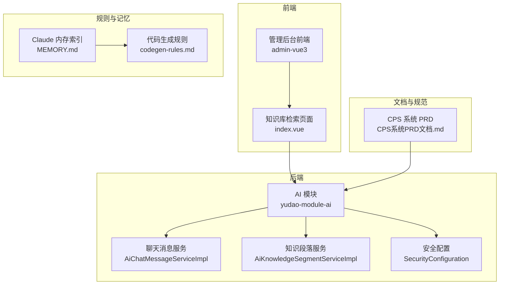
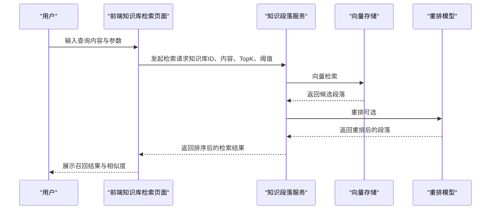
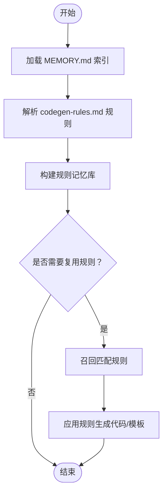
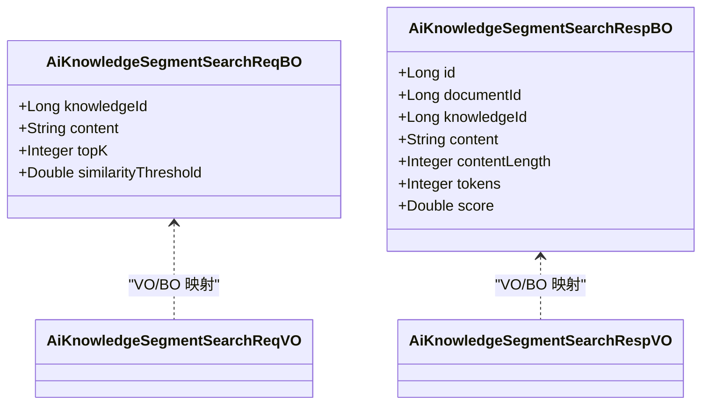
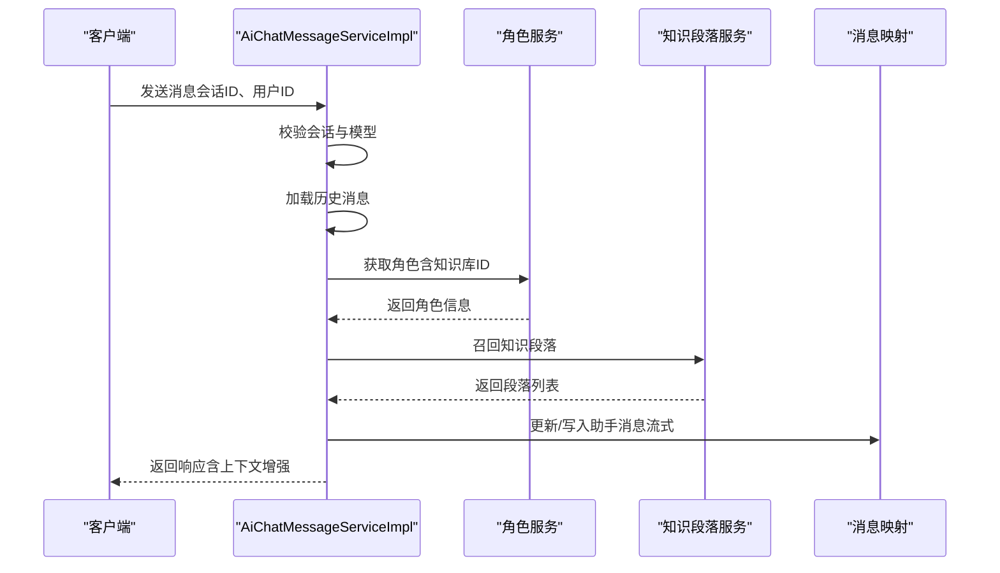
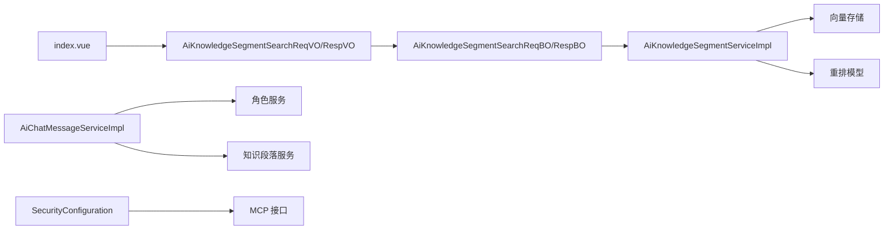

# Agent 内存与协调

<cite>
**本文引用的文件**
- [AGENTS.md](file://AGENTS.md)
- [MEMORY.md](file://agent_improvement/memory/MEMORY.md)
- [codegen-rules.md](file://agent_improvement/memory/codegen-rules.md)
- [AiChatMessageServiceImpl.java](file://backend/yudao-module-ai/src/main/java/cn/iocoder/yudao/module/ai/service/chat/AiChatMessageServiceImpl.java)
- [AiKnowledgeSegmentSearchReqBO.java](file://backend/yudao-module-ai/src/main/java/cn/iocoder/yudao/module/ai/service/knowledge/bo/AiKnowledgeSegmentSearchReqBO.java)
- [AiKnowledgeSegmentSearchRespBO.java](file://backend/yudao-module-ai/src/main/java/cn/iocoder/yudao/module/ai/service/knowledge/bo/AiKnowledgeSegmentSearchRespBO.java)
- [AiKnowledgeSegmentServiceImpl.java](file://backend/yudao-module-ai/src/main/java/cn/iocoder/yudao/module/ai/service/knowledge/AiKnowledgeSegmentServiceImpl.java)
- [AiKnowledgeSegmentSearchReqVO.java](file://backend/yudao-module-ai/src/main/java/cn/iocoder/yudao/module/ai/controller/admin/knowledge/vo/segment/AiKnowledgeSegmentSearchReqVO.java)
- [AiKnowledgeSegmentSearchRespVO.java](file://backend/yudao-module-ai/src/main/java/cn/iocoder/yudao/module/ai/controller/admin/knowledge/vo/segment/AiKnowledgeSegmentSearchRespVO.java)
- [index.vue](file://frontend/admin-vue3/src/views/ai/knowledge/knowledge/retrieval/index.vue)
- [SecurityConfiguration.java](file://backend/yudao-module-ai/src/main/java/cn/iocoder/yudao/module/ai/framework/security/config/SecurityConfiguration.java)
- [CPS系统PRD文档.md](file://docs/CPS系统PRD文档.md)
</cite>

## 目录
1. [引言](#引言)
2. [项目结构](#项目结构)
3. [核心组件](#核心组件)
4. [架构总览](#架构总览)
5. [详细组件分析](#详细组件分析)
6. [依赖关系分析](#依赖关系分析)
7. [性能考量](#性能考量)
8. [故障排查指南](#故障排查指南)
9. [结论](#结论)
10. [附录](#附录)

## 引言
本文件聚焦于 Agent 内存管理与协调机制，围绕以下目标展开：
- Agent 的记忆存储、上下文维护与状态同步
- Claude 内存系统的实现原理与数据持久化策略
- Agent 间知识共享、经验传递与协作模式
- 内存清理、垃圾回收与性能优化策略
- 内存使用监控与故障诊断方法
- 实际内存协调场景：以“代码生成规则”的记忆与复用为例

## 项目结构
本仓库采用前后端分离与模块化架构，AI 与知识检索能力位于后端 yudao-module-ai 模块，前端提供知识库检索与可视化界面；Agent 改进与规则沉淀位于 agent_improvement/memory 目录，Claude 的记忆体系以“规则与模板”形式落地。

图示来源
- [AGENTS.md:11-57](file://AGENTS.md#L11-L57)
- [MEMORY.md:1-21](file://agent_improvement/memory/MEMORY.md#L1-L21)
- [codegen-rules.md:1-788](file://agent_improvement/memory/codegen-rules.md#L1-L788)
- [AiChatMessageServiceImpl.java:127-150](file://backend/yudao-module-ai/src/main/java/cn/iocoder/yudao/module/ai/service/chat/AiChatMessageServiceImpl.java#L127-L150)
- [AiKnowledgeSegmentServiceImpl.java:241-270](file://backend/yudao-module-ai/src/main/java/cn/iocoder/yudao/module/ai/service/knowledge/AiKnowledgeSegmentServiceImpl.java#L241-L270)
- [SecurityConfiguration.java:14-30](file://backend/yudao-module-ai/src/main/java/cn/iocoder/yudao/module/ai/framework/security/config/SecurityConfiguration.java#L14-L30)
- [CPS系统PRD文档.md:654-737](file://docs/CPS系统PRD文档.md#L654-L737)

章节来源
- [AGENTS.md:11-57](file://AGENTS.md#L11-L57)
- [MEMORY.md:1-21](file://agent_improvement/memory/MEMORY.md#L1-L21)
- [codegen-rules.md:1-788](file://agent_improvement/memory/codegen-rules.md#L1-L788)

## 核心组件
- Claude 内存与规则沉淀
  - MEMORY.md：对 Claude 记忆与规则的索引与说明
  - codegen-rules.md：基于 Velocity 模板库总结的代码生成规范，作为“规则记忆”
- AI 知识库检索与上下文增强
  - AiKnowledgeSegmentServiceImpl：向量检索与重排，支持 TopK 与相似度阈值
  - AiKnowledgeSegmentSearchReqBO/RespBO：检索请求与响应的数据结构
  - AiKnowledgeSegmentSearchReqVO/RespVO：管理后台 VO 层
  - index.vue：知识库检索页面，用于验证检索效果
- 聊天消息与上下文维护
  - AiChatMessageServiceImpl：会话历史加载、角色绑定、知识召回与流式输出
- 安全与 MCP 接入
  - SecurityConfiguration：MCP SSE/Streamable HTTP 授权配置
- PRD 与工具链
  - CPS系统PRD文档.md：AI Agent 的工具与资源清单、调用流程与权限控制

章节来源
- [MEMORY.md:1-21](file://agent_improvement/memory/MEMORY.md#L1-L21)
- [codegen-rules.md:1-788](file://agent_improvement/memory/codegen-rules.md#L1-L788)
- [AiKnowledgeSegmentServiceImpl.java:241-270](file://backend/yudao-module-ai/src/main/java/cn/iocoder/yudao/module/ai/service/knowledge/AiKnowledgeSegmentServiceImpl.java#L241-L270)
- [AiKnowledgeSegmentSearchReqBO.java:1-39](file://backend/yudao-module-ai/src/main/java/cn/iocoder/yudao/module/ai/service/knowledge/bo/AiKnowledgeSegmentSearchReqBO.java#L1-L39)
- [AiKnowledgeSegmentSearchRespBO.java:1-45](file://backend/yudao-module-ai/src/main/java/cn/iocoder/yudao/module/ai/service/knowledge/bo/AiKnowledgeSegmentSearchRespBO.java#L1-L45)
- [AiKnowledgeSegmentSearchReqVO.java:1-27](file://backend/yudao-module-ai/src/main/java/cn/iocoder/yudao/module/ai/controller/admin/knowledge/vo/segment/AiKnowledgeSegmentSearchReqVO.java#L1-L27)
- [AiKnowledgeSegmentSearchRespVO.java:1-16](file://backend/yudao-module-ai/src/main/java/cn/iocoder/yudao/module/ai/controller/admin/knowledge/vo/segment/AiKnowledgeSegmentSearchRespVO.java#L1-L16)
- [index.vue:68-163](file://frontend/admin-vue3/src/views/ai/knowledge/knowledge/retrieval/index.vue#L68-L163)
- [AiChatMessageServiceImpl.java:127-150](file://backend/yudao-module-ai/src/main/java/cn/iocoder/yudao/module/ai/service/chat/AiChatMessageServiceImpl.java#L127-L150)
- [SecurityConfiguration.java:14-30](file://backend/yudao-module-ai/src/main/java/cn/iocoder/yudao/module/ai/framework/security/config/SecurityConfiguration.java#L14-L30)
- [CPS系统PRD文档.md:654-737](file://docs/CPS系统PRD文档.md#L654-L737)

## 架构总览
Agent 内存与协调的关键路径包括：
- 规则沉淀与检索：规则文件（codegen-rules.md）作为“静态记忆”，前端页面用于验证检索与复用
- 上下文增强：聊天消息服务根据角色绑定的知识库 ID，召回相关段落并参与对话
- 知识检索：基于向量存储与重排模型，按 TopK 与相似度阈值返回结果
- 安全与授权：MCP 接口的安全配置，确保外部 Agent 的接入受控

图示来源
- [AiKnowledgeSegmentServiceImpl.java:241-270](file://backend/yudao-module-ai/src/main/java/cn/iocoder/yudao/module/ai/service/knowledge/AiKnowledgeSegmentServiceImpl.java#L241-L270)
- [AiKnowledgeSegmentSearchReqBO.java:1-39](file://backend/yudao-module-ai/src/main/java/cn/iocoder/yudao/module/ai/service/knowledge/bo/AiKnowledgeSegmentSearchReqBO.java#L1-L39)
- [AiKnowledgeSegmentSearchReqVO.java:1-27](file://backend/yudao-module-ai/src/main/java/cn/iocoder/yudao/module/ai/controller/admin/knowledge/vo/segment/AiKnowledgeSegmentSearchReqVO.java#L1-L27)
- [index.vue:108-131](file://frontend/admin-vue3/src/views/ai/knowledge/knowledge/retrieval/index.vue#L108-L131)

章节来源
- [AiKnowledgeSegmentServiceImpl.java:241-270](file://backend/yudao-module-ai/src/main/java/cn/iocoder/yudao/module/ai/service/knowledge/AiKnowledgeSegmentServiceImpl.java#L241-L270)
- [index.vue:68-163](file://frontend/admin-vue3/src/views/ai/knowledge/knowledge/retrieval/index.vue#L68-L163)

## 详细组件分析

### Claude 内存与规则沉淀
- 目标：将“代码生成规则”固化为可检索、可复用的“记忆”
- 结构：
  - MEMORY.md：索引与说明
  - codegen-rules.md：后端分层、命名约定、模板类型、VO 规范、前端模板变量与映射等
- 作用：
  - 作为 Claude 的“规则记忆”，指导后续代码生成与模板复用
  - 为 Agent 间知识共享提供统一的“规则基线”

图示来源
- [MEMORY.md:1-21](file://agent_improvement/memory/MEMORY.md#L1-L21)
- [codegen-rules.md:1-788](file://agent_improvement/memory/codegen-rules.md#L1-L788)

章节来源
- [MEMORY.md:1-21](file://agent_improvement/memory/MEMORY.md#L1-L21)
- [codegen-rules.md:1-788](file://agent_improvement/memory/codegen-rules.md#L1-L788)

### 知识检索与上下文增强
- 请求与响应数据结构：
  - 请求：AiKnowledgeSegmentSearchReqBO/ReqVO（知识库ID、内容、TopK、相似度阈值）
  - 响应：AiKnowledgeSegmentSearchRespBO/RespVO（段落ID、文档名、相似度分数等）
- 服务实现要点：
  - 向量检索后增加召回计数
  - 按分数降序排序返回
  - 支持基于 Embedding + 重排模型的二次排序
- 前端验证：
  - index.vue 提供检索入口与结果展示，支持默认参数从知识库配置读取

图示来源
- [AiKnowledgeSegmentSearchReqBO.java:1-39](file://backend/yudao-module-ai/src/main/java/cn/iocoder/yudao/module/ai/service/knowledge/bo/AiKnowledgeSegmentSearchReqBO.java#L1-L39)
- [AiKnowledgeSegmentSearchRespBO.java:1-45](file://backend/yudao-module-ai/src/main/java/cn/iocoder/yudao/module/ai/service/knowledge/bo/AiKnowledgeSegmentSearchRespBO.java#L1-L45)
- [AiKnowledgeSegmentSearchReqVO.java:1-27](file://backend/yudao-module-ai/src/main/java/cn/iocoder/yudao/module/ai/controller/admin/knowledge/vo/segment/AiKnowledgeSegmentSearchReqVO.java#L1-L27)
- [AiKnowledgeSegmentSearchRespVO.java:1-16](file://backend/yudao-module-ai/src/main/java/cn/iocoder/yudao/module/ai/controller/admin/knowledge/vo/segment/AiKnowledgeSegmentSearchRespVO.java#L1-L16)

章节来源
- [AiKnowledgeSegmentServiceImpl.java:241-270](file://backend/yudao-module-ai/src/main/java/cn/iocoder/yudao/module/ai/service/knowledge/AiKnowledgeSegmentServiceImpl.java#L241-L270)
- [AiKnowledgeSegmentSearchReqBO.java:1-39](file://backend/yudao-module-ai/src/main/java/cn/iocoder/yudao/module/ai/service/knowledge/bo/AiKnowledgeSegmentSearchReqBO.java#L1-L39)
- [AiKnowledgeSegmentSearchRespBO.java:1-45](file://backend/yudao-module-ai/src/main/java/cn/iocoder/yudao/module/ai/service/knowledge/bo/AiKnowledgeSegmentSearchRespBO.java#L1-L45)
- [index.vue:108-131](file://frontend/admin-vue3/src/views/ai/knowledge/knowledge/retrieval/index.vue#L108-L131)

### 聊天消息与角色-知识绑定
- 会话与历史加载：根据会话ID加载历史消息
- 角色绑定：根据会话的角色ID获取知识库ID集合
- 知识召回：遍历知识库ID，执行检索并合并结果
- 流式输出：支持增量内容更新与异常处理

图示来源
- [AiChatMessageServiceImpl.java:127-150](file://backend/yudao-module-ai/src/main/java/cn/iocoder/yudao/module/ai/service/chat/AiChatMessageServiceImpl.java#L127-L150)
- [AiChatMessageServiceImpl.java:291-318](file://backend/yudao-module-ai/src/main/java/cn/iocoder/yudao/module/ai/service/chat/AiChatMessageServiceImpl.java#L291-L318)

章节来源
- [AiChatMessageServiceImpl.java:127-150](file://backend/yudao-module-ai/src/main/java/cn/iocoder/yudao/module/ai/service/chat/AiChatMessageServiceImpl.java#L127-L150)
- [AiChatMessageServiceImpl.java:291-318](file://backend/yudao-module-ai/src/main/java/cn/iocoder/yudao/module/ai/service/chat/AiChatMessageServiceImpl.java#L291-L318)

### 安全与 MCP 接入
- 安全配置：针对 MCP SSE 与 Streamable HTTP 的授权规则定制
- 作用：保障外部 Agent 通过 MCP 协议接入时的访问控制与审计

章节来源
- [SecurityConfiguration.java:14-30](file://backend/yudao-module-ai/src/main/java/cn/iocoder/yudao/module/ai/framework/security/config/SecurityConfiguration.java#L14-L30)

### Agent 间知识共享与协作
- 角色-知识库绑定：通过聊天角色将多个知识库与特定 Agent 绑定，实现“经验”共享
- 工具与资源：PRD 中列出的 MCP 工具（如跨平台比价、订单查询等）可被不同 Agent 复用
- 权限与限流：管理后台提供 API Key 管理、权限级别与限流配置，保障协作安全

章节来源
- [CPS系统PRD文档.md:654-737](file://docs/CPS系统PRD文档.md#L654-L737)

## 依赖关系分析
- 组件耦合
  - 前端 index.vue 依赖后端知识检索接口与 VO/BO
  - 后端 AiChatMessageServiceImpl 依赖角色服务与知识段落服务
  - 知识段落服务依赖向量存储与重排模型
- 外部依赖
  - MCP 协议与 Spring AI 集成
  - 安全框架对 MCP 接口的授权

图示来源
- [AiKnowledgeSegmentSearchReqVO.java:1-27](file://backend/yudao-module-ai/src/main/java/cn/iocoder/yudao/module/ai/controller/admin/knowledge/vo/segment/AiKnowledgeSegmentSearchReqVO.java#L1-L27)
- [AiKnowledgeSegmentSearchRespVO.java:1-16](file://backend/yudao-module-ai/src/main/java/cn/iocoder/yudao/module/ai/controller/admin/knowledge/vo/segment/AiKnowledgeSegmentSearchRespVO.java#L1-L16)
- [AiKnowledgeSegmentSearchReqBO.java:1-39](file://backend/yudao-module-ai/src/main/java/cn/iocoder/yudao/module/ai/service/knowledge/bo/AiKnowledgeSegmentSearchReqBO.java#L1-L39)
- [AiKnowledgeSegmentSearchRespBO.java:1-45](file://backend/yudao-module-ai/src/main/java/cn/iocoder/yudao/module/ai/service/knowledge/bo/AiKnowledgeSegmentSearchRespBO.java#L1-L45)
- [AiKnowledgeSegmentServiceImpl.java:241-270](file://backend/yudao-module-ai/src/main/java/cn/iocoder/yudao/module/ai/service/knowledge/AiKnowledgeSegmentServiceImpl.java#L241-L270)
- [AiChatMessageServiceImpl.java:127-150](file://backend/yudao-module-ai/src/main/java/cn/iocoder/yudao/module/ai/service/chat/AiChatMessageServiceImpl.java#L127-L150)
- [SecurityConfiguration.java:14-30](file://backend/yudao-module-ai/src/main/java/cn/iocoder/yudao/module/ai/framework/security/config/SecurityConfiguration.java#L14-L30)

章节来源
- [AiKnowledgeSegmentServiceImpl.java:241-270](file://backend/yudao-module-ai/src/main/java/cn/iocoder/yudao/module/ai/service/knowledge/AiKnowledgeSegmentServiceImpl.java#L241-L270)
- [AiChatMessageServiceImpl.java:127-150](file://backend/yudao-module-ai/src/main/java/cn/iocoder/yudao/module/ai/service/chat/AiChatMessageServiceImpl.java#L127-L150)

## 性能考量
- 向量检索与重排
  - 控制 TopK 与相似度阈值，避免返回过多无关段落
  - 重排模型可能带来额外延迟，建议在高 QPS 场景下缓存热点查询结果
- 流式输出
  - 增量更新助手消息，减少一次性写入压力
- 并发与限流
  - MCP 工具调用需结合 API Key 限流策略，防止过载
- 存储与索引
  - 向量索引的维度与数据规模直接影响检索性能，建议定期评估与优化

## 故障排查指南
- 知识检索无结果
  - 检查知识库 ID 是否正确、内容是否为空、TopK 与阈值是否合理
  - 确认向量存储可用与重排模型可达
- 会话上下文缺失
  - 校验会话是否存在、用户是否匹配、角色是否绑定知识库
  - 确认知识召回逻辑是否正常执行
- MCP 接入失败
  - 检查安全配置是否放行 MCP SSE/Streamable HTTP
  - 核对 API Key 权限级别与限流配置

章节来源
- [AiKnowledgeSegmentServiceImpl.java:241-270](file://backend/yudao-module-ai/src/main/java/cn/iocoder/yudao/module/ai/service/knowledge/AiKnowledgeSegmentServiceImpl.java#L241-L270)
- [AiChatMessageServiceImpl.java:291-318](file://backend/yudao-module-ai/src/main/java/cn/iocoder/yudao/module/ai/service/chat/AiChatMessageServiceImpl.java#L291-L318)
- [SecurityConfiguration.java:14-30](file://backend/yudao-module-ai/src/main/java/cn/iocoder/yudao/module/ai/framework/security/config/SecurityConfiguration.java#L14-L30)

## 结论
本项目通过“规则沉淀 + 知识检索 + 角色绑定 + MCP 接入”的组合，实现了 Agent 的记忆存储、上下文维护与状态同步。Claude 内存系统以规则文件为载体，形成可检索、可复用的经验基线；AI 知识库与聊天消息服务共同支撑上下文增强；安全配置与权限控制保障了 Agent 协作的可控性。未来可在向量索引优化、重排模型性能与流式输出稳定性方面持续改进。

## 附录
- 实际内存协调场景：代码生成规则的记忆与复用
  - 规则沉淀：codegen-rules.md 作为“静态记忆”
  - 复用验证：前端知识库检索页面用于演示与校验
  - 协作模式：不同 Agent 可通过角色绑定共享同一知识库，实现经验复用

章节来源
- [codegen-rules.md:1-788](file://agent_improvement/memory/codegen-rules.md#L1-L788)
- [index.vue:68-163](file://frontend/admin-vue3/src/views/ai/knowledge/knowledge/retrieval/index.vue#L68-L163)