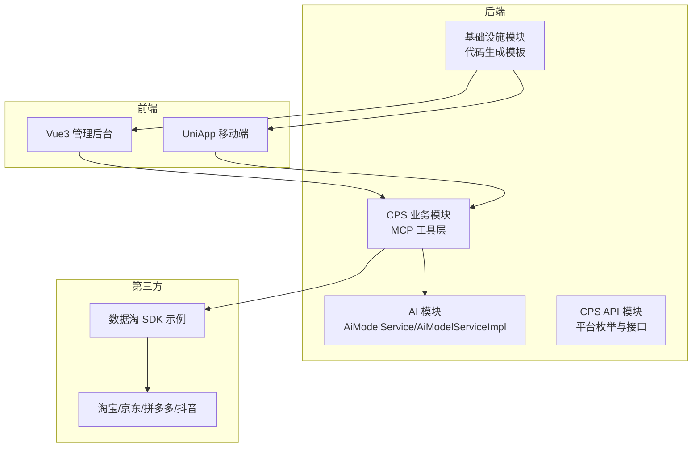
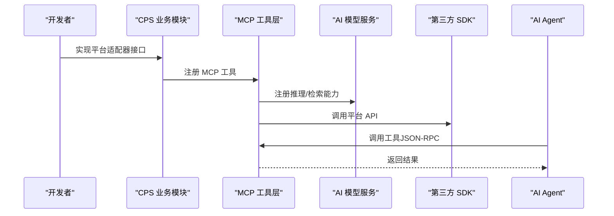
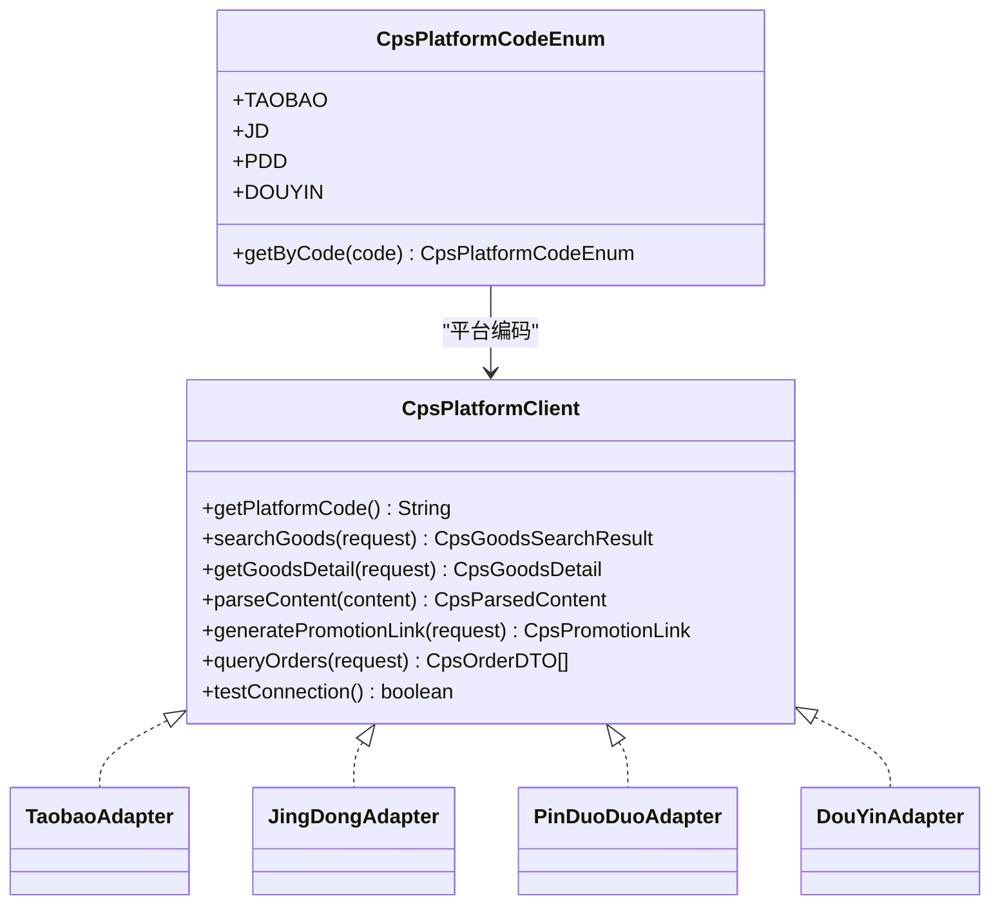
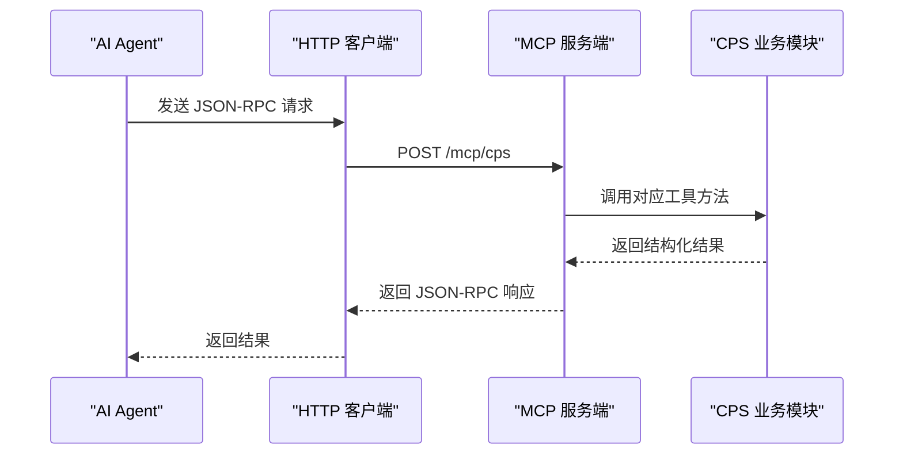
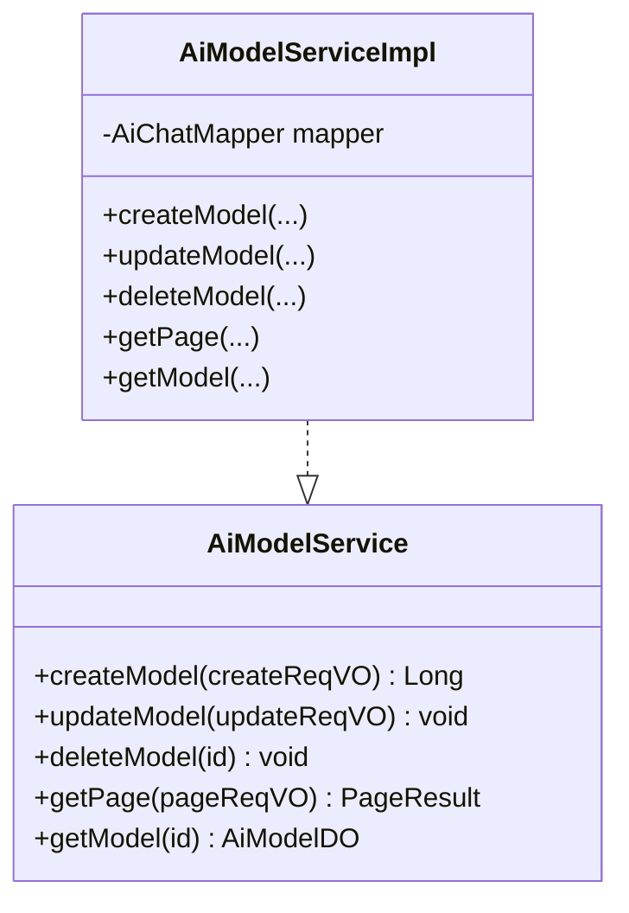
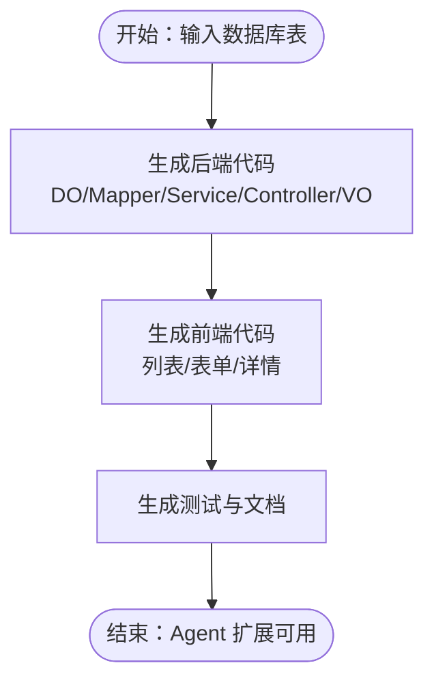
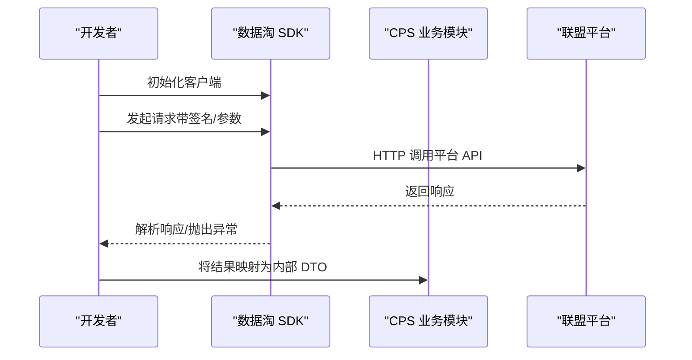
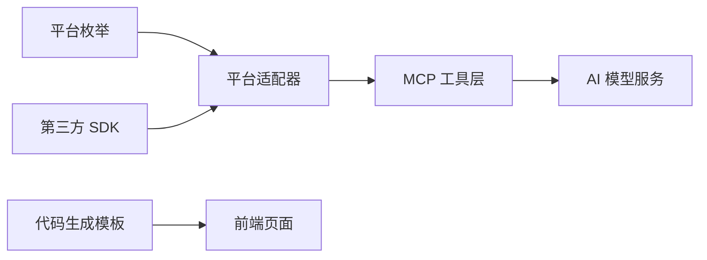

# Agent 扩展开发

<cite>
**本文引用的文件**
- [AGENTS.md](file://AGENTS.md)
- [README.md](file://README.md)
- [codegen-rules.md](file://agent_improvement/memory/codegen-rules.md)
- [MEMORY.md](file://agent_improvement/memory/MEMORY.md)
- [CpsPlatformCodeEnum.java](file://backend/yudao-module-cps/yudao-module-cps-api/src/main/java/cn/iocoder/yudao/module/cps/enums/CpsPlatformCodeEnum.java)
- [DtkJavaOpenPlatformSdkApplication.java](file://agent_improvement/sdk_demo/dataoke-sdk-java/src/main/java/com/dtk/api/DtkJavaOpenPlatformSdkApplication.java)
- [DtkApiClient.java](file://agent_improvement/sdk_demo/dataoke-sdk-java/src/main/java/com/dtk/api/client/DtkApiClient.java)
- [AiModelService.java](file://backend/yudao-module-ai/src/main/java/cn/iocoder/yudao/module/ai/service/model/AiModelService.java)
- [AiModelServiceImpl.java](file://backend/yudao-module-ai/src/main/java/cn/iocoder/yudao/module/ai/service/model/AiModelServiceImpl.java)
</cite>

## 目录
1. [简介](#简介)
2. [项目结构](#项目结构)
3. [核心组件](#核心组件)
4. [架构总览](#架构总览)
5. [详细组件分析](#详细组件分析)
6. [依赖关系分析](#依赖关系分析)
7. [性能考量](#性能考量)
8. [故障排查指南](#故障排查指南)
9. [结论](#结论)
10. [附录](#附录)

## 简介
本指南面向希望在 AgenticCPS 项目中扩展 Agent 能力的开发者，系统讲解如何创建自定义 Agent、定义接口规范、实现 MCP（Model Context Protocol）集成、扩展插件机制与第三方平台对接。文档同时覆盖 Agent 开发生命周期、测试策略、部署流程、代码生成规则定制、模板开发与规则引擎使用，以及最佳实践、性能优化与安全考虑，并提供从需求分析到生产部署的完整案例流程。

## 项目结构
AgenticCPS 采用多模块分层架构，后端以 Spring Boot 为基础，结合 AI 模块与 CPS 核心模块，前端提供 Vue3 管理后台与 UniApp 移动端。Agent 扩展主要围绕以下位置展开：
- 后端 AI 模块：提供 AI 模型抽象与服务接口，支撑 MCP 工具注册与调用
- CPS 核心模块：提供平台适配器接口与 MCP 工具层，便于接入新平台
- 代码生成与模板：提供统一的 Velocity 模板与前端模板，支撑 Agent 扩展的快速落地
- 第三方 SDK 示例：以数据淘 SDK 为例，展示如何封装第三方平台能力

**图表来源**
- [AiModelService.java:1-49](file://backend/yudao-module-ai/src/main/java/cn/iocoder/yudao/module/ai/service/model/AiModelService.java#L1-L49)
- [AiModelServiceImpl.java:1-25](file://backend/yudao-module-ai/src/main/java/cn/iocoder/yudao/module/ai/service/model/AiModelServiceImpl.java#L1-L25)
- [CpsPlatformCodeEnum.java:1-45](file://backend/yudao-module-cps/yudao-module-cps-api/src/main/java/cn/iocoder/yudao/module/cps/enums/CpsPlatformCodeEnum.java#L1-L45)
- [codegen-rules.md:1-788](file://agent_improvement/memory/codegen-rules.md#L1-L788)

**章节来源**
- [AGENTS.md:11-57](file://AGENTS.md#L11-L57)
- [README.md:229-284](file://README.md#L229-L284)

## 核心组件
- 平台适配器接口：定义统一的平台能力契约，包括商品搜索、详情、内容解析、推广链接生成、订单查询与连通性测试
- MCP 工具层：将上述能力暴露为 AI Agent 可直接调用的工具，支持 JSON-RPC over Streamable HTTP
- AI 模型服务：抽象不同大模型与能力（聊天、图像、向量存储），为 Agent 提供统一的推理与检索能力
- 代码生成规则：提供 Velocity 模板与前端模板，支撑 Agent 扩展的快速生成与一致性

**章节来源**
- [AGENTS.md:141-182](file://AGENTS.md#L141-L182)
- [AiModelService.java:19-49](file://backend/yudao-module-ai/src/main/java/cn/iocoder/yudao/module/ai/service/model/AiModelService.java#L19-L49)
- [codegen-rules.md:1-788](file://agent_improvement/memory/codegen-rules.md#L1-L788)

## 架构总览
Agent 扩展开发的关键路径如下：
- 平台接入：实现平台适配器接口，注册为 Spring Bean，无需改动核心逻辑
- MCP 工具注册：在 MCP 层将平台能力封装为工具，供 AI Agent 直接调用
- 代码生成：利用模板生成控制器、服务、Mapper、VO 与前端页面，保证前后端一致
- 第三方 SDK：参考数据淘 SDK 的封装方式，对接新的联盟平台 API

**图表来源**
- [AGENTS.md:161-169](file://AGENTS.md#L161-L169)
- [AiModelServiceImpl.java:1-25](file://backend/yudao-module-ai/src/main/java/cn/iocoder/yudao/module/ai/service/model/AiModelServiceImpl.java#L1-L25)
- [DtkApiClient.java](file://agent_improvement/sdk_demo/dataoke-sdk-java/src/main/java/com/dtk/api/client/DtkApiClient.java)

## 详细组件分析

### 平台适配器接口与扩展
- 接口职责：统一抽象平台能力，便于新增平台时仅实现接口并注册 Bean
- 扩展步骤：实现接口方法，注入必要的 SDK 客户端，返回标准化的数据结构
- 平台枚举：通过平台编码枚举统一管理平台标识

**图表来源**
- [AGENTS.md:141-157](file://AGENTS.md#L141-L157)
- [CpsPlatformCodeEnum.java:14-44](file://backend/yudao-module-cps/yudao-module-cps-api/src/main/java/cn/iocoder/yudao/module/cps/enums/CpsPlatformCodeEnum.java#L14-L44)

**章节来源**
- [AGENTS.md:141-159](file://AGENTS.md#L141-L159)
- [CpsPlatformCodeEnum.java:14-44](file://backend/yudao-module-cps/yudao-module-cps-api/src/main/java/cn/iocoder/yudao/module/cps/enums/CpsPlatformCodeEnum.java#L14-L44)

### MCP 工具层与 AI Agent 集成
- 工具类型：工具（Tools）、资源（Resources）、提示（Prompts）
- 调用方式：通过 JSON-RPC over Streamable HTTP 的 /mcp/cps 端点
- 工具示例：商品搜索、多平台比价、推广链接生成、订单查询、返利汇总

**图表来源**
- [AGENTS.md:161-169](file://AGENTS.md#L161-L169)
- [AGENTS.md:200-209](file://AGENTS.md#L200-L209)

**章节来源**
- [AGENTS.md:161-169](file://AGENTS.md#L161-L169)
- [AGENTS.md:200-209](file://AGENTS.md#L200-L209)

### AI 模型服务与规则引擎
- 模型抽象：统一 ChatModel、ImageModel、EmbeddingModel、VectorStore 等能力
- 规则引擎：通过 AiModelService 接口管理模型的创建、更新、删除与查询
- 集成方式：在 MCP 工具中调用 AI 能力，实现智能提示、内容解析与摘要生成

**图表来源**
- [AiModelService.java:19-49](file://backend/yudao-module-ai/src/main/java/cn/iocoder/yudao/module/ai/service/model/AiModelService.java#L19-L49)
- [AiModelServiceImpl.java:1-25](file://backend/yudao-module-ai/src/main/java/cn/iocoder/yudao/module/ai/service/model/AiModelServiceImpl.java#L1-L25)

**章节来源**
- [AiModelService.java:19-49](file://backend/yudao-module-ai/src/main/java/cn/iocoder/yudao/module/ai/service/model/AiModelService.java#L19-L49)
- [AiModelServiceImpl.java:1-25](file://backend/yudao-module-ai/src/main/java/cn/iocoder/yudao/module/ai/service/model/AiModelServiceImpl.java#L1-L25)

### 代码生成规则与模板开发
- 后端模板：统一的 DO/Mapper/Service/Controller/VO 分层结构，支持通用、树表、ERP 主表三种模板类型
- 前端模板：Vue3 Element Plus、Vben Admin、Vben5 Antd、UniApp 移动端模板
- 命名约定：PascalCase、camelCase、kebab-case，确保前后端一致
- 主子表处理：提供子表增删改查与批量操作的模板化实现

**图表来源**
- [codegen-rules.md:307-326](file://agent_improvement/memory/codegen-rules.md#L307-L326)
- [codegen-rules.md:327-788](file://agent_improvement/memory/codegen-rules.md#L327-L788)

**章节来源**
- [codegen-rules.md:1-788](file://agent_improvement/memory/codegen-rules.md#L1-L788)
- [MEMORY.md:1-21](file://agent_improvement/memory/MEMORY.md#L1-L21)

### 第三方 SDK 封装与平台对接
- SDK 示例：数据淘 SDK 展示了客户端封装、请求/响应对象、工具类与异常处理
- 对接流程：分析平台 API → 生成适配器 → 注册平台 → 编写测试 → 更新文档
- 最佳实践：统一异常处理、参数校验、签名与加密、超时与重试策略

**图表来源**
- [DtkJavaOpenPlatformSdkApplication.java](file://agent_improvement/sdk_demo/dataoke-sdk-java/src/main/java/com/dtk/api/DtkJavaOpenPlatformSdkApplication.java)
- [DtkApiClient.java](file://agent_improvement/sdk_demo/dataoke-sdk-java/src/main/java/com/dtk/api/client/DtkApiClient.java)

**章节来源**
- [DtkJavaOpenPlatformSdkApplication.java](file://agent_improvement/sdk_demo/dataoke-sdk-java/src/main/java/com/dtk/api/DtkJavaOpenPlatformSdkApplication.java)
- [DtkApiClient.java](file://agent_improvement/sdk_demo/dataoke-sdk-java/src/main/java/com/dtk/api/client/DtkApiClient.java)

## 依赖关系分析
- 平台适配器与枚举：平台枚举用于标识平台编码，适配器实现具体平台能力
- MCP 工具与 AI 服务：MCP 工具依赖 AI 服务能力，实现智能增强
- 代码生成与前端模板：统一模板确保 Agent 扩展的一致性与可维护性
- 第三方 SDK：SDK 作为底层能力提供方，向上提供稳定接口

**图表来源**
- [CpsPlatformCodeEnum.java:14-44](file://backend/yudao-module-cps/yudao-module-cps-api/src/main/java/cn/iocoder/yudao/module/cps/enums/CpsPlatformCodeEnum.java#L14-L44)
- [AiModelService.java:19-49](file://backend/yudao-module-ai/src/main/java/cn/iocoder/yudao/module/ai/service/model/AiModelService.java#L19-L49)
- [codegen-rules.md:307-326](file://agent_improvement/memory/codegen-rules.md#L307-L326)

**章节来源**
- [CpsPlatformCodeEnum.java:14-44](file://backend/yudao-module-cps/yudao-module-cps-api/src/main/java/cn/iocoder/yudao/module/cps/enums/CpsPlatformCodeEnum.java#L14-L44)
- [AiModelService.java:19-49](file://backend/yudao-module-ai/src/main/java/cn/iocoder/yudao/module/ai/service/model/AiModelService.java#L19-L49)
- [codegen-rules.md:307-326](file://agent_improvement/memory/codegen-rules.md#L307-L326)

## 性能考量
- 搜索与比价：单平台搜索 P99 < 2 秒，多平台比价 P99 < 5 秒
- 转链生成：P99 < 1 秒
- 订单同步：延迟 < 30 分钟
- 返利入账：平台结算后 24 小时内
- MCP 工具调用：搜索类 < 3 秒，查询类 < 1 秒
- 优化建议：缓存热点数据、异步处理耗时任务、合理分页与索引、并发控制与熔断降级

**章节来源**
- [README.md:332-341](file://README.md#L332-L341)

## 故障排查指南
- 平台连通性测试：通过适配器的 testConnection 方法快速定位网络与鉴权问题
- 异常处理：参考数据淘 SDK 的异常处理与响应封装，统一捕获与上报
- 日志与监控：结合后端日志与链路追踪，定位 MCP 工具调用瓶颈
- 配置检查：核对 application-local.yaml 中的数据库、Redis、MCP 与平台 API Key 配置

**章节来源**
- [AGENTS.md:158-159](file://AGENTS.md#L158-L159)
- [DtkApiClient.java](file://agent_improvement/sdk_demo/dataoke-sdk-java/src/main/java/com/dtk/api/client/DtkApiClient.java)

## 结论
通过平台适配器接口、MCP 工具层、AI 模型服务与统一代码生成模板，AgenticCPS 为 Agent 扩展提供了高内聚、低耦合的开发框架。依托第三方 SDK 封装与平台对接流程，开发者可在极短时间内完成新平台接入与 Agent 能力扩展，并通过模板与规则引擎确保代码质量与一致性。配合性能与安全最佳实践，可实现从需求到生产的高效闭环。

## 附录

### Agent 开发生命周期（从需求到生产）
- 需求对齐：明确 Agent 能力边界与调用场景
- 方案设计：设计 MCP 工具与平台适配器接口
- 自主编码：使用模板生成后端与前端代码，实现适配器与工具
- 自动测试：编写单元测试与集成测试，验证工具与接口
- 验收交付：生成文档与部署清单，完成上线

**章节来源**
- [README.md:107-144](file://README.md#L107-L144)
- [codegen-rules.md:1-788](file://agent_improvement/memory/codegen-rules.md#L1-L788)

### 测试策略
- 单元测试：针对适配器与工具方法进行边界与异常测试
- 集成测试：模拟 MCP 工具调用与第三方平台交互
- 性能测试：压测搜索、比价与订单查询工具，确保 SLA 达标
- 安全测试：校验鉴权、参数校验与敏感信息脱敏

**章节来源**
- [README.md:107-144](file://README.md#L107-L144)

### 部署流程
- 后端：打包 JAR，配置环境变量，启动 yudao-server
- 前端：构建管理后台与移动端，部署静态资源
- 数据库：初始化 CPS 模块与基础设施表
- Docker：使用 docker-compose 启动 MySQL、Redis、后端与前端服务

**章节来源**
- [AGENTS.md:126-139](file://AGENTS.md#L126-L139)
- [README.md:305-341](file://README.md#L305-L341)

### 最佳实践
- 接口设计：保持平台适配器接口稳定，新增平台仅实现接口
- 模板复用：统一使用代码生成模板，减少重复劳动
- 安全考虑：严格参数校验、鉴权与加密，避免敏感信息泄露
- 性能优化：缓存热点数据、异步处理、合理分页与索引
- 规范化：遵循 AGENTS.md 与 codegen-rules.md 的规范与约定

**章节来源**
- [AGENTS.md:214-234](file://AGENTS.md#L214-L234)
- [codegen-rules.md:315-326](file://agent_improvement/memory/codegen-rules.md#L315-L326)