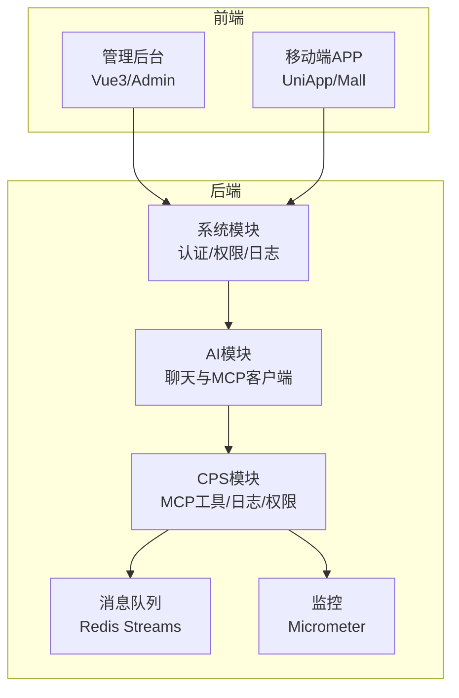
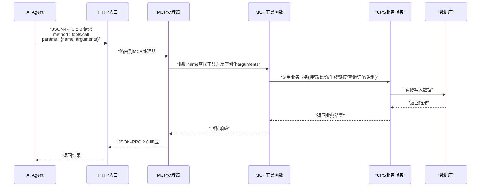
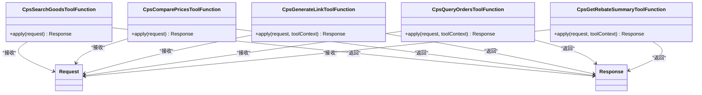
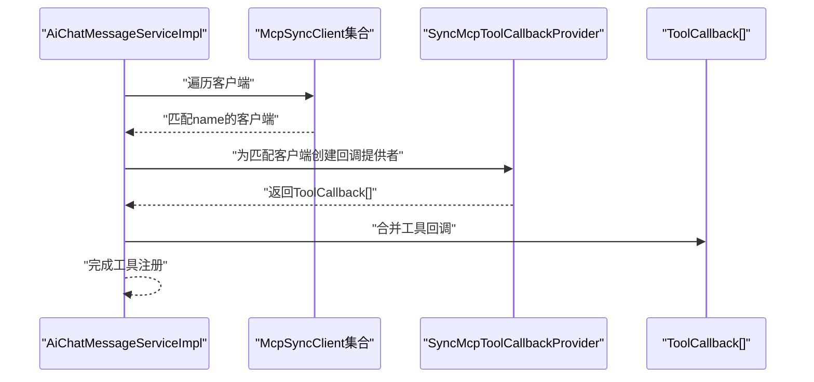
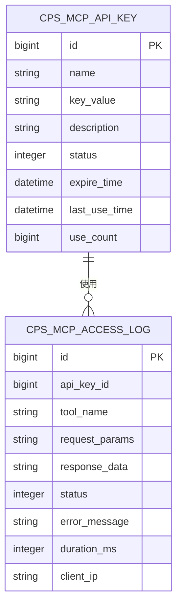
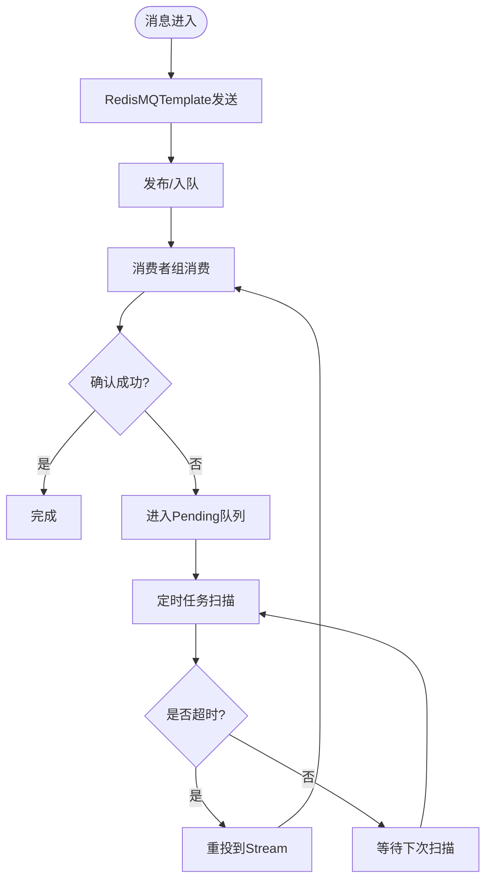
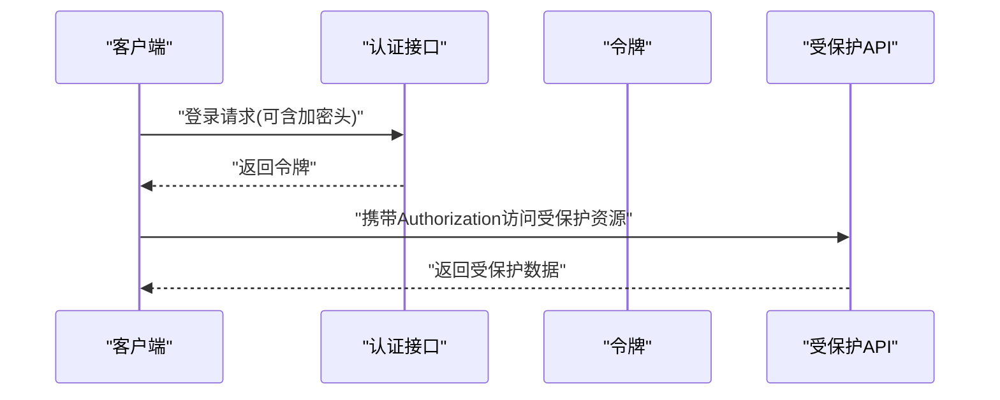
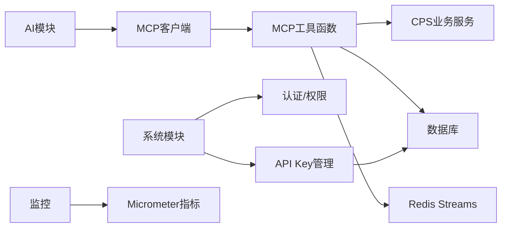

# Agent 通信协议

<cite>
**本文引用的文件**
- [AGENTS.md](file://AGENTS.md)
- [AiChatMessageServiceImpl.java](file://backend/yudao-module-ai/src/main/java/cn/iocoder/yudao/module/ai/service/chat/AiChatMessageServiceImpl.java)
- [CpsSearchGoodsToolFunction.java](file://backend/yudao-module-cps/yudao-module-cps-biz/src/main/java/cn/iocoder/yudao/module/cps/mcp/tool/CpsSearchGoodsToolFunction.java)
- [CpsComparePricesToolFunction.java](file://backend/yudao-module-cps/yudao-module-cps-biz/src/main/java/cn/iocoder/yudao/module/cps/mcp/tool/CpsComparePricesToolFunction.java)
- [CpsGenerateLinkToolFunction.java](file://backend/yudao-module-cps/yudao-module-cps-biz/src/main/java/cn/iocoder/yudao/module/cps/mcp/tool/CpsGenerateLinkToolFunction.java)
- [CpsQueryOrdersToolFunction.java](file://backend/yudao-module-cps/yudao-module-cps-biz/src/main/java/cn/iocoder/yudao/module/cps/mcp/tool/CpsQueryOrdersToolFunction.java)
- [CpsGetRebateSummaryToolFunction.java](file://backend/yudao-module-cps/yudao-module-cps-biz/src/main/java/cn/iocoder/yudao/module/cps/mcp/tool/CpsGetRebateSummaryToolFunction.java)
- [CpsMcpAccessLogDO.java](file://backend/yudao-module-cps/yudao-module-cps-biz/src/main/java/cn/iocoder/yudao/module/cps/dal/dataobject/mcp/CpsMcpAccessLogDO.java)
- [CpsMcpApiKeyDO.java](file://backend/yudao-module-cps/yudao-module-cps-biz/src/main/java/cn/iocoder/yudao/module/cps/dal/dataobject/mcp/CpsMcpApiKeyDO.java)
- [CpsMcpAccessLogMapper.java](file://backend/yudao-module-cps/yudao-module-cps-biz/src/main/java/cn/iocoder/yudao/module/cps/dal/mysql/mcp/CpsMcpAccessLogMapper.java)
- [CpsMcpApiKeyMapper.java](file://backend/yudao-module-cps/yudao-module-cps-biz/src/main/java/cn/iocoder/yudao/module/cps/dal/mysql/mcp/CpsMcpApiKeyMapper.java)
- [AuthController.http](file://backend/yudao-module-system/src/main/java/cn/iocoder/yudao/module/system/controller/admin/auth/AuthController.http)
- [ApiEncrypt.java](file://backend/yudao-framework/yudao-spring-boot-starter-web/src/main/java/cn/iocoder/yudao/framework/encrypt/core/annotation/ApiEncrypt.java)
- [ApiEncryptTest.java](file://backend/yudao-framework/yudao-spring-boot-starter-web/src/test/java/cn/iocoder/yudao/framework/encrypt/ApiEncryptTest.java)
- [YudaoMetricsAutoConfiguration.java](file://backend/yudao-framework/yudao-spring-boot-starter-monitor/src/main/java/cn/iocoder/yudao/framework/tracer/config/YudaoMetricsAutoConfiguration.java)
- [RedisMQTemplate.java](file://backend/yudao-framework/yudao-spring-boot-starter-mq/src/main/java/cn/iocoder/yudao/framework/mq/redis/core/RedisMQTemplate.java)
- [RedisPendingMessageResendJob.java](file://backend/yudao-framework/yudao-spring-boot-starter-mq/src/main/java/cn/iocoder/yudao/framework/mq/redis/core/job/RedisPendingMessageResendJob.java)
- [RedisMessageInterceptor.java](file://backend/yudao-framework/yudao-spring-boot-starter-mq/src/main/java/cn/iocoder/yudao/framework/mq/redis/core/interceptor/RedisMessageInterceptor.java)
- [CPS系统PRD文档.md](file://docs/CPS系统PRD文档.md)
</cite>

## 目录
1. [引言](#引言)
2. [项目结构](#项目结构)
3. [核心组件](#核心组件)
4. [架构总览](#架构总览)
5. [详细组件分析](#详细组件分析)
6. [依赖关系分析](#依赖关系分析)
7. [性能考虑](#性能考虑)
8. [故障排查指南](#故障排查指南)
9. [结论](#结论)
10. [附录](#附录)

## 引言
本文件面向“Agent 通信协议”的综合文档，聚焦于以下目标：
- 解释 Agent 之间（以及 Agent 与后端服务之间）的通信机制、消息格式与传输协议
- 详述 MCP（Model Context Protocol）在本项目中的实现细节与 JSON-RPC 2.0 的应用
- 文档化消息路由、负载均衡与故障转移机制
- 提供通信安全、认证授权与数据加密方案
- 给出通信性能优化策略与监控指标
- 展示典型通信场景与消息示例（任务分发、状态同步、结果回传）

## 项目结构
本仓库采用多模块分层架构，Agent 通信相关的关键位置如下：
- 后端模块
  - yudao-module-ai：AI 聊天与 MCP 客户端集成
  - yudao-module-cps：CPS 核心业务，包含 MCP 工具函数与访问日志
  - yudao-framework：通用框架能力（监控、消息队列、安全等）
  - yudao-module-system：系统管理与认证授权
- 文档与参考
  - AGENTS.md：总体架构与 MCP 说明
  - docs/CPS系统PRD文档.md：MCP 管理后台与 API Key 等管理能力

章节来源
- [AGENTS.md:11-57](file://AGENTS.md#L11-L57)

## 核心组件
- MCP 服务端与工具函数
  - 后端通过 MCP 工具函数暴露 AI 可调用的能力，包括商品搜索、跨平台比价、生成推广链接、查询订单、返利汇总等
  - 工具函数以函数式接口形式定义，请求/响应对象通过 Jackson 注解声明参数与字段含义
- MCP 客户端与路由
  - AI 模块在聊天消息处理中，根据配置匹配对应的 MCP 同步客户端，并注册其工具回调
- 访问控制与审计
  - API Key 管理与访问日志记录，支持权限级别、限流与统计
- 传输与安全
  - MCP 使用 JSON-RPC 2.0 over Streamable HTTP；系统提供 API 加解密注解与测试样例
- 消息队列与可靠性
  - Redis Streams 作为消息中间件，具备消费者组、Pending 消息重投与拦截器扩展

章节来源
- [AiChatMessageServiceImpl.java:127-425](file://backend/yudao-module-ai/src/main/java/cn/iocoder/yudao/module/ai/service/chat/AiChatMessageServiceImpl.java#L127-L425)
- [CpsSearchGoodsToolFunction.java:28-177](file://backend/yudao-module-cps/yudao-module-cps-biz/src/main/java/cn/iocoder/yudao/module/cps/mcp/tool/CpsSearchGoodsToolFunction.java#L28-L177)
- [CpsComparePricesToolFunction.java:30-176](file://backend/yudao-module-cps/yudao-module-cps-biz/src/main/java/cn/iocoder/yudao/module/cps/mcp/tool/CpsComparePricesToolFunction.java#L30-L176)
- [CpsGenerateLinkToolFunction.java:27-142](file://backend/yudao-module-cps/yudao-module-cps-biz/src/main/java/cn/iocoder/yudao/module/cps/mcp/tool/CpsGenerateLinkToolFunction.java#L27-L142)
- [CpsQueryOrdersToolFunction.java:33-169](file://backend/yudao-module-cps/yudao-module-cps-biz/src/main/java/cn/iocoder/yudao/module/cps/mcp/tool/CpsQueryOrdersToolFunction.java#L33-L169)
- [CpsGetRebateSummaryToolFunction.java:32-162](file://backend/yudao-module-cps/yudao-module-cps-biz/src/main/java/cn/iocoder/yudao/module/cps/mcp/tool/CpsGetRebateSummaryToolFunction.java#L32-L162)
- [CpsMcpAccessLogDO.java:22-62](file://backend/yudao-module-cps/yudao-module-cps-biz/src/main/java/cn/iocoder/yudao/module/cps/dal/dataobject/mcp/CpsMcpAccessLogDO.java#L22-L62)
- [CpsMcpApiKeyDO.java:24-60](file://backend/yudao-module-cps/yudao-module-cps-biz/src/main/java/cn/iocoder/yudao/module/cps/dal/dataobject/mcp/CpsMcpApiKeyDO.java#L24-L60)
- [CpsMcpAccessLogMapper.java:12-15](file://backend/yudao-module-cps/yudao-module-cps-biz/src/main/java/cn/iocoder/yudao/module/cps/dal/mysql/mcp/CpsMcpAccessLogMapper.java#L12-L15)
- [CpsMcpApiKeyMapper.java](file://backend/yudao-module-cps/yudao-module-cps-biz/src/main/java/cn/iocoder/yudao/module/cps/dal/mysql/mcp/CpsMcpApiKeyMapper.java)
- [RedisMQTemplate.java:22-41](file://backend/yudao-framework/yudao-spring-boot-starter-mq/src/main/java/cn/iocoder/yudao/framework/mq/redis/core/RedisMQTemplate.java#L22-L41)
- [RedisPendingMessageResendJob.java:24-68](file://backend/yudao-framework/yudao-spring-boot-starter-mq/src/main/java/cn/iocoder/yudao/framework/mq/redis/core/job/RedisPendingMessageResendJob.java#L24-L68)
- [RedisMessageInterceptor.java:12-26](file://backend/yudao-framework/yudao-spring-boot-starter-mq/src/main/java/cn/iocoder/yudao/framework/mq/redis/core/interceptor/RedisMessageInterceptor.java#L12-L26)
- [ApiEncrypt.java:11-23](file://backend/yudao-framework/yudao-spring-boot-starter-web/src/main/java/cn/iocoder/yudao/framework/encrypt/core/annotation/ApiEncrypt.java#L11-L23)
- [YudaoMetricsAutoConfiguration.java:16-27](file://backend/yudao-framework/yudao-spring-boot-starter-monitor/src/main/java/cn/iocoder/yudao/framework/tracer/config/YudaoMetricsAutoConfiguration.java#L16-L27)

## 架构总览
MCP 在本项目中的定位是“零代码接入”，AI Agent 通过标准 JSON-RPC 2.0 请求直接调用后端工具函数，后端解析请求、执行业务逻辑并返回结果。整体交互如下：

图表来源
- [AGENTS.md:161-168](file://AGENTS.md#L161-L168)
- [CpsSearchGoodsToolFunction.java:28-177](file://backend/yudao-module-cps/yudao-module-cps-biz/src/main/java/cn/iocoder/yudao/module/cps/mcp/tool/CpsSearchGoodsToolFunction.java#L28-L177)
- [CpsComparePricesToolFunction.java:30-176](file://backend/yudao-module-cps/yudao-module-cps-biz/src/main/java/cn/iocoder/yudao/module/cps/mcp/tool/CpsComparePricesToolFunction.java#L30-L176)
- [CpsGenerateLinkToolFunction.java:27-142](file://backend/yudao-module-cps/yudao-module-cps-biz/src/main/java/cn/iocoder/yudao/module/cps/mcp/tool/CpsGenerateLinkToolFunction.java#L27-L142)
- [CpsQueryOrdersToolFunction.java:33-169](file://backend/yudao-module-cps/yudao-module-cps-biz/src/main/java/cn/iocoder/yudao/module/cps/mcp/tool/CpsQueryOrdersToolFunction.java#L33-L169)
- [CpsGetRebateSummaryToolFunction.java:32-162](file://backend/yudao-module-cps/yudao-module-cps-biz/src/main/java/cn/iocoder/yudao/module/cps/mcp/tool/CpsGetRebateSummaryToolFunction.java#L32-L162)

## 详细组件分析

### MCP 工具函数与消息格式
- 工具函数命名与职责
  - cps_search_goods：多平台商品搜索，返回结构化商品列表
  - cps_compare_prices：跨平台比价，输出价格最低、返利最高、综合最优
  - cps_generate_link：生成推广链接（短链/口令/移动端），支持会员归因
  - cps_query_orders：查询会员返利订单，支持分页与状态筛选
  - cps_get_rebate_summary：返利账户汇总与最近记录
- 请求/响应对象
  - 请求对象通过 Jackson 注解声明字段与描述，确保 Agent 调用时参数清晰
  - 响应对象包含总数、列表、错误信息与业务字段，统一结构便于上层处理
- 示例（路径引用）
  - [搜索请求/响应定义:37-118](file://backend/yudao-module-cps/yudao-module-cps-biz/src/main/java/cn/iocoder/yudao/module/cps/mcp/tool/CpsSearchGoodsToolFunction.java#L37-L118)
  - [比价请求/响应定义:39-111](file://backend/yudao-module-cps/yudao-module-cps-biz/src/main/java/cn/iocoder/yudao/module/cps/mcp/tool/CpsComparePricesToolFunction.java#L39-L111)
  - [生成链接请求/响应定义:39-95](file://backend/yudao-module-cps/yudao-module-cps-biz/src/main/java/cn/iocoder/yudao/module/cps/mcp/tool/CpsGenerateLinkToolFunction.java#L39-L95)
  - [查询订单请求/响应定义:44-118](file://backend/yudao-module-cps/yudao-module-cps-biz/src/main/java/cn/iocoder/yudao/module/cps/mcp/tool/CpsQueryOrdersToolFunction.java#L44-L118)
  - [返利汇总请求/响应定义:46-105](file://backend/yudao-module-cps/yudao-module-cps-biz/src/main/java/cn/iocoder/yudao/module/cps/mcp/tool/CpsGetRebateSummaryToolFunction.java#L46-L105)

图表来源
- [CpsSearchGoodsToolFunction.java:28-177](file://backend/yudao-module-cps/yudao-module-cps-biz/src/main/java/cn/iocoder/yudao/module/cps/mcp/tool/CpsSearchGoodsToolFunction.java#L28-L177)
- [CpsComparePricesToolFunction.java:30-176](file://backend/yudao-module-cps/yudao-module-cps-biz/src/main/java/cn/iocoder/yudao/module/cps/mcp/tool/CpsComparePricesToolFunction.java#L30-L176)
- [CpsGenerateLinkToolFunction.java:27-142](file://backend/yudao-module-cps/yudao-module-cps-biz/src/main/java/cn/iocoder/yudao/module/cps/mcp/tool/CpsGenerateLinkToolFunction.java#L27-L142)
- [CpsQueryOrdersToolFunction.java:33-169](file://backend/yudao-module-cps/yudao-module-cps-biz/src/main/java/cn/iocoder/yudao/module/cps/mcp/tool/CpsQueryOrdersToolFunction.java#L33-L169)
- [CpsGetRebateSummaryToolFunction.java:32-162](file://backend/yudao-module-cps/yudao-module-cps-biz/src/main/java/cn/iocoder/yudao/module/cps/mcp/tool/CpsGetRebateSummaryToolFunction.java#L32-L162)

章节来源
- [CpsSearchGoodsToolFunction.java:28-177](file://backend/yudao-module-cps/yudao-module-cps-biz/src/main/java/cn/iocoder/yudao/module/cps/mcp/tool/CpsSearchGoodsToolFunction.java#L28-L177)
- [CpsComparePricesToolFunction.java:30-176](file://backend/yudao-module-cps/yudao-module-cps-biz/src/main/java/cn/iocoder/yudao/module/cps/mcp/tool/CpsComparePricesToolFunction.java#L30-L176)
- [CpsGenerateLinkToolFunction.java:27-142](file://backend/yudao-module-cps/yudao-module-cps-biz/src/main/java/cn/iocoder/yudao/module/cps/mcp/tool/CpsGenerateLinkToolFunction.java#L27-L142)
- [CpsQueryOrdersToolFunction.java:33-169](file://backend/yudao-module-cps/yudao-module-cps-biz/src/main/java/cn/iocoder/yudao/module/cps/mcp/tool/CpsQueryOrdersToolFunction.java#L33-L169)
- [CpsGetRebateSummaryToolFunction.java:32-162](file://backend/yudao-module-cps/yudao-module-cps-biz/src/main/java/cn/iocoder/yudao/module/cps/mcp/tool/CpsGetRebateSummaryToolFunction.java#L32-L162)

### MCP 客户端路由与工具回调
- AI 聊天消息处理流程中，会根据配置查找匹配的 MCP 同步客户端，并注册其工具回调，使 Agent 能够发现并调用后端工具
- 关键点：客户端名称匹配、工具回调收集、上下文消息过滤

图表来源
- [AiChatMessageServiceImpl.java:127-425](file://backend/yudao-module-ai/src/main/java/cn/iocoder/yudao/module/ai/service/chat/AiChatMessageServiceImpl.java#L127-L425)

章节来源
- [AiChatMessageServiceImpl.java:127-425](file://backend/yudao-module-ai/src/main/java/cn/iocoder/yudao/module/ai/service/chat/AiChatMessageServiceImpl.java#L127-L425)

### 访问控制与审计
- API Key 管理
  - 支持创建、更新、删除、权限级别（public/member/admin）、限流配置、状态开关与备注
  - 记录最后使用时间与累计调用次数
- 访问日志
  - 记录工具名、请求参数摘要、响应摘要、状态、错误信息、耗时、客户端IP等
- 管理后台页面
  - MCP 服务状态、Tools 配置、访问日志等

图表来源
- [CpsMcpApiKeyDO.java:24-60](file://backend/yudao-module-cps/yudao-module-cps-biz/src/main/java/cn/iocoder/yudao/module/cps/dal/dataobject/mcp/CpsMcpApiKeyDO.java#L24-L60)
- [CpsMcpAccessLogDO.java:22-62](file://backend/yudao-module-cps/yudao-module-cps-biz/src/main/java/cn/iocoder/yudao/module/cps/dal/dataobject/mcp/CpsMcpAccessLogDO.java#L22-L62)

章节来源
- [CpsMcpApiKeyDO.java:24-60](file://backend/yudao-module-cps/yudao-module-cps-biz/src/main/java/cn/iocoder/yudao/module/cps/dal/dataobject/mcp/CpsMcpApiKeyDO.java#L24-L60)
- [CpsMcpAccessLogDO.java:22-62](file://backend/yudao-module-cps/yudao-module-cps-biz/src/main/java/cn/iocoder/yudao/module/cps/dal/dataobject/mcp/CpsMcpAccessLogDO.java#L22-L62)
- [CPS系统PRD文档.md:698-737](file://docs/CPS系统PRD文档.md#L698-L737)

### 传输协议与 JSON-RPC 2.0
- MCP 使用 JSON-RPC 2.0 over Streamable HTTP，端点为 /mcp/cps
- 请求包含 method 与 params（name 为工具名，arguments 为工具参数）
- 响应遵循 JSON-RPC 2.0 规范（id、result/error）

章节来源
- [AGENTS.md:161-168](file://AGENTS.md#L161-L168)

### 消息路由、负载均衡与故障转移
- 消息路由
  - Redis Streams 作为消息通道，支持消费者组与消息确认
  - RedisMQTemplate 提供发送与拦截器扩展能力
- 负载均衡
  - 通过消费者组与多个消费者实例实现水平扩展
- 故障转移
  - RedisPendingMessageResendJob 定时扫描 Pending 消息并在超时后重投，避免崩溃导致的消息丢失

图表来源
- [RedisMQTemplate.java:22-41](file://backend/yudao-framework/yudao-spring-boot-starter-mq/src/main/java/cn/iocoder/yudao/framework/mq/redis/core/RedisMQTemplate.java#L22-L41)
- [RedisPendingMessageResendJob.java:24-68](file://backend/yudao-framework/yudao-spring-boot-starter-mq/src/main/java/cn/iocoder/yudao/framework/mq/redis/core/job/RedisPendingMessageResendJob.java#L24-L68)
- [RedisMessageInterceptor.java:12-26](file://backend/yudao-framework/yudao-spring-boot-starter-mq/src/main/java/cn/iocoder/yudao/framework/mq/redis/core/interceptor/RedisMessageInterceptor.java#L12-L26)

章节来源
- [RedisMQTemplate.java:22-41](file://backend/yudao-framework/yudao-spring-boot-starter-mq/src/main/java/cn/iocoder/yudao/framework/mq/redis/core/RedisMQTemplate.java#L22-L41)
- [RedisPendingMessageResendJob.java:24-68](file://backend/yudao-framework/yudao-spring-boot-starter-mq/src/main/java/cn/iocoder/yudao/framework/mq/redis/core/job/RedisPendingMessageResendJob.java#L24-L68)
- [RedisMessageInterceptor.java:12-26](file://backend/yudao-framework/yudao-spring-boot-starter-mq/src/main/java/cn/iocoder/yudao/framework/mq/redis/core/interceptor/RedisMessageInterceptor.java#L12-L26)

### 通信安全、认证授权与数据加密
- 认证授权
  - 系统提供登录接口与权限信息查询接口，支持多租户标识
  - 管理后台提供 API Key 管理，支持权限级别与限流
- 数据加密
  - 提供 API 加解密注解，支持请求/响应加解密开关
  - 测试用例演示了 RSA/AES 加密流程与密钥生成

图表来源
- [AuthController.http:1-51](file://backend/yudao-module-system/src/main/java/cn/iocoder/yudao/module/system/controller/admin/auth/AuthController.http#L1-L51)
- [ApiEncrypt.java:11-23](file://backend/yudao-framework/yudao-spring-boot-starter-web/src/main/java/cn/iocoder/yudao/framework/encrypt/core/annotation/ApiEncrypt.java#L11-L23)
- [ApiEncryptTest.java:22-86](file://backend/yudao-framework/yudao-spring-boot-starter-web/src/test/java/cn/iocoder/yudao/framework/encrypt/ApiEncryptTest.java#L22-L86)

章节来源
- [AuthController.http:1-51](file://backend/yudao-module-system/src/main/java/cn/iocoder/yudao/module/system/controller/admin/auth/AuthController.http#L1-L51)
- [ApiEncrypt.java:11-23](file://backend/yudao-framework/yudao-spring-boot-starter-web/src/main/java/cn/iocoder/yudao/framework/encrypt/core/annotation/ApiEncrypt.java#L11-L23)
- [ApiEncryptTest.java:22-86](file://backend/yudao-framework/yudao-spring-boot-starter-web/src/test/java/cn/iocoder/yudao/framework/encrypt/ApiEncryptTest.java#L22-L86)
- [CPS系统PRD文档.md:698-737](file://docs/CPS系统PRD文档.md#L698-L737)

### 典型通信场景与消息示例
- 场景一：任务分发（Agent 调用搜索工具）
  - 请求：tools/call + name=cps_search_goods + arguments={keyword, platform_code, page_size, price_min, price_max}
  - 响应：包含 total 与 goods 列表
  - 参考路径：[搜索工具实现:120-174](file://backend/yudao-module-cps/yudao-module-cps-biz/src/main/java/cn/iocoder/yudao/module/cps/mcp/tool/CpsSearchGoodsToolFunction.java#L120-L174)
- 场景二：状态同步（Agent 查询订单）
  - 请求：tools/call + name=cps_query_orders + arguments={platform_code, order_status, page_no, page_size}
  - 响应：包含 total 与 orders 列表
  - 参考路径：[查询订单工具实现:120-156](file://backend/yudao-module-cps/yudao-module-cps-biz/src/main/java/cn/iocoder/yudao/module/cps/mcp/tool/CpsQueryOrdersToolFunction.java#L120-L156)
- 场景三：结果回传（Agent 获取返利汇总）
  - 请求：tools/call + name=cps_get_rebate_summary + arguments={recent_count}
  - 响应：账户余额、冻结余额、累计返利、最近记录等
  - 参考路径：[返利汇总工具实现:107-149](file://backend/yudao-module-cps/yudao-module-cps-biz/src/main/java/cn/iocoder/yudao/module/cps/mcp/tool/CpsGetRebateSummaryToolFunction.java#L107-L149)

章节来源
- [CpsSearchGoodsToolFunction.java:120-174](file://backend/yudao-module-cps/yudao-module-cps-biz/src/main/java/cn/iocoder/yudao/module/cps/mcp/tool/CpsSearchGoodsToolFunction.java#L120-L174)
- [CpsQueryOrdersToolFunction.java:120-156](file://backend/yudao-module-cps/yudao-module-cps-biz/src/main/java/cn/iocoder/yudao/module/cps/mcp/tool/CpsQueryOrdersToolFunction.java#L120-L156)
- [CpsGetRebateSummaryToolFunction.java:107-149](file://backend/yudao-module-cps/yudao-module-cps-biz/src/main/java/cn/iocoder/yudao/module/cps/mcp/tool/CpsGetRebateSummaryToolFunction.java#L107-L149)

## 依赖关系分析
- 组件耦合
  - AI 模块依赖 MCP 客户端配置与工具回调提供者
  - MCP 工具函数依赖 CPS 业务服务（搜索、比价、链接生成、订单查询、返利）
  - 访问日志与 API Key 管理依赖数据库映射
  - 消息队列依赖 Redis 与消费者组机制
- 外部依赖
  - Spring AI、Spring Security、MyBatis Plus、Redis、Micrometer

图表来源
- [AiChatMessageServiceImpl.java:127-425](file://backend/yudao-module-ai/src/main/java/cn/iocoder/yudao/module/ai/service/chat/AiChatMessageServiceImpl.java#L127-L425)
- [CpsSearchGoodsToolFunction.java:28-177](file://backend/yudao-module-cps/yudao-module-cps-biz/src/main/java/cn/iocoder/yudao/module/cps/mcp/tool/CpsSearchGoodsToolFunction.java#L28-L177)
- [CpsMcpAccessLogMapper.java:12-15](file://backend/yudao-module-cps/yudao-module-cps-biz/src/main/java/cn/iocoder/yudao/module/cps/dal/mysql/mcp/CpsMcpAccessLogMapper.java#L12-L15)
- [CpsMcpApiKeyMapper.java](file://backend/yudao-module-cps/yudao-module-cps-biz/src/main/java/cn/iocoder/yudao/module/cps/dal/mysql/mcp/CpsMcpApiKeyMapper.java)
- [YudaoMetricsAutoConfiguration.java:16-27](file://backend/yudao-framework/yudao-spring-boot-starter-monitor/src/main/java/cn/iocoder/yudao/framework/tracer/config/YudaoMetricsAutoConfiguration.java#L16-L27)

章节来源
- [AiChatMessageServiceImpl.java:127-425](file://backend/yudao-module-ai/src/main/java/cn/iocoder/yudao/module/ai/service/chat/AiChatMessageServiceImpl.java#L127-L425)
- [CpsSearchGoodsToolFunction.java:28-177](file://backend/yudao-module-cps/yudao-module-cps-biz/src/main/java/cn/iocoder/yudao/module/cps/mcp/tool/CpsSearchGoodsToolFunction.java#L28-L177)
- [CpsMcpAccessLogMapper.java:12-15](file://backend/yudao-module-cps/yudao-module-cps-biz/src/main/java/cn/iocoder/yudao/module/cps/dal/mysql/mcp/CpsMcpAccessLogMapper.java#L12-L15)
- [CpsMcpApiKeyMapper.java](file://backend/yudao-module-cps/yudao-module-cps-biz/src/main/java/cn/iocoder/yudao/module/cps/dal/mysql/mcp/CpsMcpApiKeyMapper.java)
- [YudaoMetricsAutoConfiguration.java:16-27](file://backend/yudao-framework/yudao-spring-boot-starter-monitor/src/main/java/cn/iocoder/yudao/framework/tracer/config/YudaoMetricsAutoConfiguration.java#L16-L27)

## 性能考虑
- 指标与监控
  - 通过 Micrometer 注册通用标签，便于统一采集与展示
- 优化建议
  - 工具函数侧：参数校验前置、结果缓存（如热门商品）、分页与上限控制
  - 传输侧：合理设置超时与重试、压缩大响应体（如图片URL列表）
  - 存储侧：索引优化（关键词、价格区间、会员ID）、批量写入与异步落库
  - MQ 侧：消费者并发度与确认策略、Pending 消息重投周期调优

章节来源
- [YudaoMetricsAutoConfiguration.java:16-27](file://backend/yudao-framework/yudao-spring-boot-starter-monitor/src/main/java/cn/iocoder/yudao/framework/tracer/config/YudaoMetricsAutoConfiguration.java#L16-L27)

## 故障排查指南
- 访问日志与 API Key
  - 检查 API Key 状态与权限级别，核对请求参数与响应摘要
  - 关注错误信息与耗时，定位慢查询与异常
- 消息队列
  - 关注 Pending 消息堆积与重投频率，排查消费者异常退出
- 加解密问题
  - 确认请求头与加解密开关一致，验证密钥生成与加解密流程

章节来源
- [CpsMcpAccessLogDO.java:22-62](file://backend/yudao-module-cps/yudao-module-cps-biz/src/main/java/cn/iocoder/yudao/module/cps/dal/dataobject/mcp/CpsMcpAccessLogDO.java#L22-L62)
- [RedisPendingMessageResendJob.java:24-68](file://backend/yudao-framework/yudao-spring-boot-starter-mq/src/main/java/cn/iocoder/yudao/framework/mq/redis/core/job/RedisPendingMessageResendJob.java#L24-L68)
- [ApiEncryptTest.java:22-86](file://backend/yudao-framework/yudao-spring-boot-starter-web/src/test/java/cn/iocoder/yudao/framework/encrypt/ApiEncryptTest.java#L22-L86)

## 结论
本项目通过 MCP 与 JSON-RPC 2.0 实现了 Agent 与后端服务的标准化通信，结合 API Key 管理、访问日志与 Redis Streams 可靠性保障，形成了可扩展、可观测、可治理的 Agent 通信体系。配合认证授权与数据加密能力，满足生产环境的安全与性能要求。

## 附录
- 关键实现路径
  - [MCP 端点与协议说明:161-168](file://AGENTS.md#L161-L168)
  - [AI 聊天消息处理与工具回调注册:127-425](file://backend/yudao-module-ai/src/main/java/cn/iocoder/yudao/module/ai/service/chat/AiChatMessageServiceImpl.java#L127-L425)
  - [MCP 工具函数实现（搜索/比价/生成链接/查询订单/返利汇总）:28-177](file://backend/yudao-module-cps/yudao-module-cps-biz/src/main/java/cn/iocoder/yudao/module/cps/mcp/tool/CpsSearchGoodsToolFunction.java#L28-L177)
  - [API Key 与访问日志数据模型:24-60](file://backend/yudao-module-cps/yudao-module-cps-biz/src/main/java/cn/iocoder/yudao/module/cps/dal/dataobject/mcp/CpsMcpApiKeyDO.java#L24-L60)
  - [Redis MQ 模板与拦截器:22-41](file://backend/yudao-framework/yudao-spring-boot-starter-mq/src/main/java/cn/iocoder/yudao/framework/mq/redis/core/RedisMQTemplate.java#L22-L41)
  - [Pending 消息重投任务:24-68](file://backend/yudao-framework/yudao-spring-boot-starter-mq/src/main/java/cn/iocoder/yudao/framework/mq/redis/core/job/RedisPendingMessageResendJob.java#L24-L68)
  - [API 加解密注解与测试:11-23](file://backend/yudao-framework/yudao-spring-boot-starter-web/src/main/java/cn/iocoder/yudao/framework/encrypt/core/annotation/ApiEncrypt.java#L11-L23)