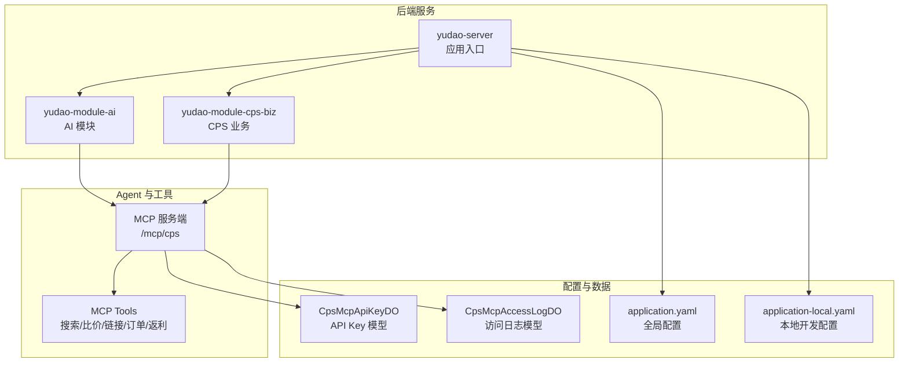
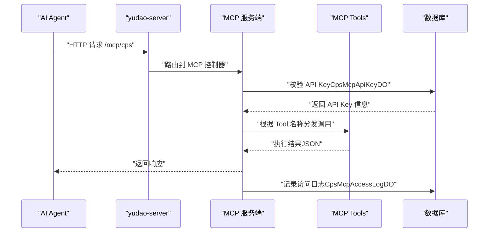
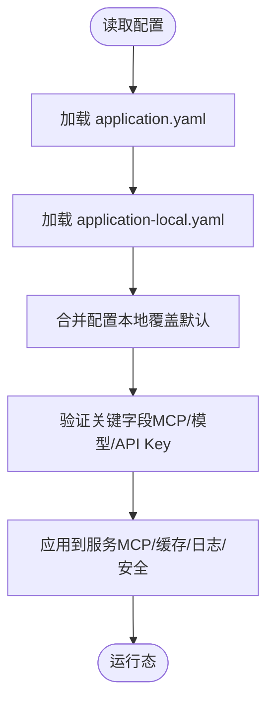
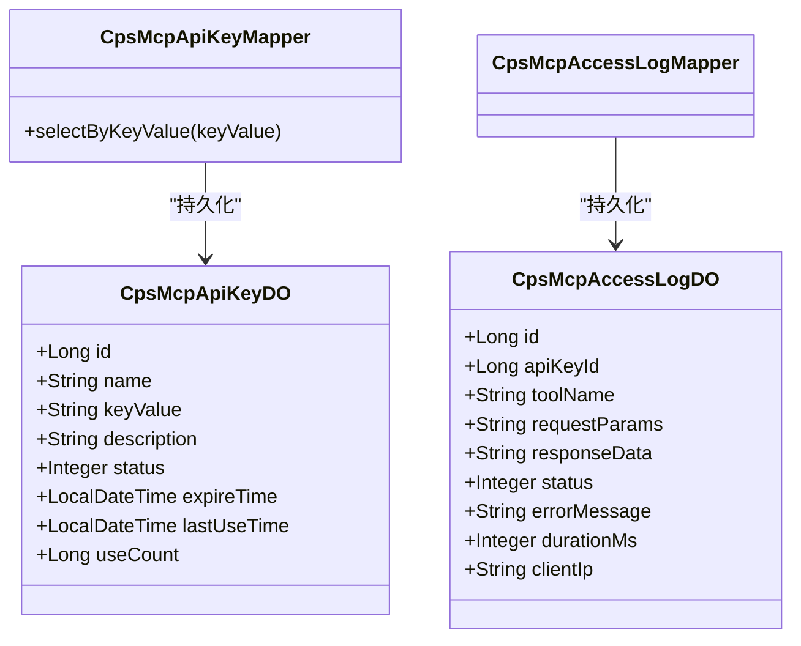
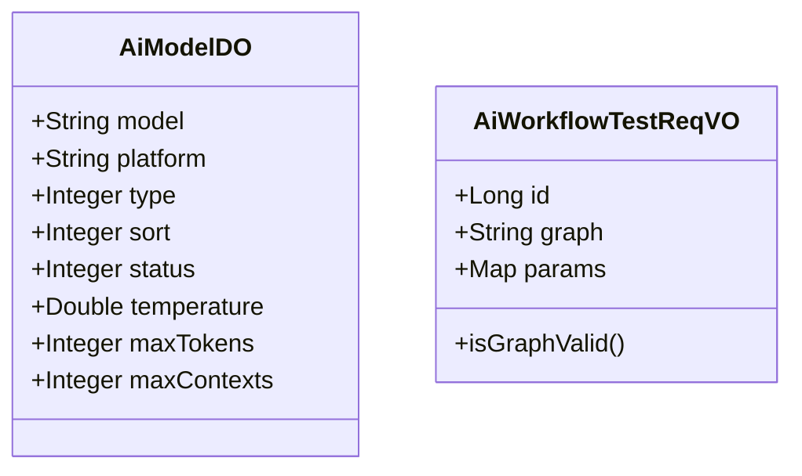
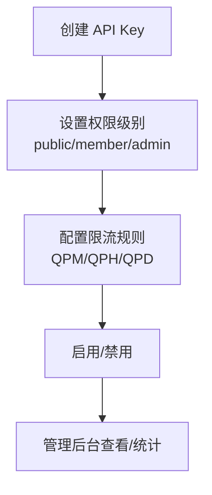
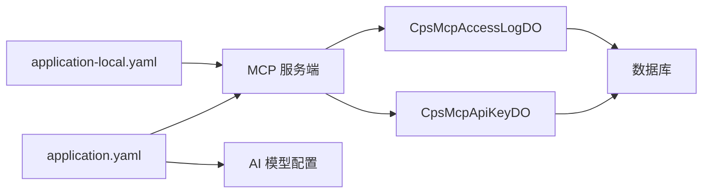

# Agent 配置管理

<cite>
**本文引用的文件**
- [AGENTS.md](file://AGENTS.md)
- [README.md](file://README.md)
- [settings.local.json](file://.claude/settings.local.json)
- [application.yaml](file://backend/yudao-server/src/main/resources/application.yaml)
- [application-local.yaml](file://backend/yudao-server/src/main/resources/application-local.yaml)
- [CpsMcpApiKeyDO.java](file://backend/yudao-module-cps/yudao-module-cps-biz/src/main/java/cn/iocoder/yudao/module/cps/dal/dataobject/mcp/CpsMcpApiKeyDO.java)
- [CpsMcpAccessLogDO.java](file://backend/yudao-module-cps/yudao-module-cps-biz/src/main/java/cn/iocoder/yudao/module/cps/dal/dataobject/mcp/CpsMcpAccessLogDO.java)
- [CpsMcpApiKeyMapper.java](file://backend/yudao-module-cps/yudao-module-cps-biz/src/main/java/cn/iocoder/yudao/module/cps/dal/mysql/mcp/CpsMcpApiKeyMapper.java)
- [CpsMcpAccessLogMapper.java](file://backend/yudao-module-cps/yudao-module-cps-biz/src/main/java/cn/iocoder/yudao/module/cps/dal/mysql/mcp/CpsMcpAccessLogMapper.java)
- [AiModelDO.java](file://backend/yudao-module-ai/src/main/java/cn/iocoder/yudao/module/ai/dal/dataobject/model/AiModelDO.java)
- [AiWorkflowTestReqVO.java](file://backend/yudao-module-ai/src/main/java/cn/iocoder/yudao/module/ai/controller/admin/workflow/vo/AiWorkflowTestReqVO.java)
- [CPS系统PRD文档.md](file://docs/CPS系统PRD文档.md)
</cite>

## 目录
1. [简介](#简介)
2. [项目结构](#项目结构)
3. [核心组件](#核心组件)
4. [架构总览](#架构总览)
5. [详细组件分析](#详细组件分析)
6. [依赖分析](#依赖分析)
7. [性能考虑](#性能考虑)
8. [故障排查指南](#故障排查指南)
9. [结论](#结论)
10. [附录](#附录)

## 简介
本文件面向 AgenticCPS 项目中的 Agent 配置管理，系统性阐述 Agent 的配置结构、参数设置、生命周期管理、角色权限与环境变量、配置验证规则、错误处理与调试方法，并提供最佳实践与常见问题解决方案。重点围绕 MCP（Model Context Protocol）Agent 的接入与运行，结合后端 Spring Boot 配置、数据库模型与管理后台能力，给出可操作的配置指南与可视化架构图。

## 项目结构
AgenticCPS 采用多模块架构，Agent 配置主要涉及后端 yudao-server 与 yudao-module-ai 模块，以及 CPS 业务模块中的 MCP 管理能力。关键位置如下：
- 配置文件：application.yaml 与 application-local.yaml
- MCP 管理：API Key、访问日志、Tools 配置
- AI 模型与工作流：模型配置、工作流测试参数校验
- 文档与规范：AGENTS.md、CPS系统PRD文档.md

**图表来源**
- [application.yaml:199-225](file://backend/yudao-server/src/main/resources/application.yaml#L199-L225)
- [application-local.yaml:240-260](file://backend/yudao-server/src/main/resources/application-local.yaml#L240-L260)
- [CpsMcpApiKeyDO.java:1-60](file://backend/yudao-module-cps/yudao-module-cps-biz/src/main/java/cn/iocoder/yudao/module/cps/dal/dataobject/mcp/CpsMcpApiKeyDO.java#L1-L60)
- [CpsMcpAccessLogDO.java:1-62](file://backend/yudao-module-cps/yudao-module-cps-biz/src/main/java/cn/iocoder/yudao/module/cps/dal/dataobject/mcp/CpsMcpAccessLogDO.java#L1-L62)

**章节来源**
- [AGENTS.md:161-169](file://AGENTS.md#L161-L169)
- [application.yaml:199-225](file://backend/yudao-server/src/main/resources/application.yaml#L199-L225)
- [application-local.yaml:240-260](file://backend/yudao-server/src/main/resources/application-local.yaml#L240-L260)

## 核心组件
- MCP 服务端配置：启用/禁用、名称、版本、指令、类型（SYNC）、SSE 端点、消息端点
- AI 多模型配置：平台、模型、温度、最大 Token、上下文长度等
- API Key 管理：名称、值、描述、状态、过期时间、最后使用时间、累计调用次数
- 访问日志：API Key、Tool 名称、请求参数、响应摘要、状态、错误信息、耗时、客户端 IP
- 工作流测试参数：工作流编号或图、参数 Map 校验

**章节来源**
- [application.yaml:199-225](file://backend/yudao-server/src/main/resources/application.yaml#L199-L225)
- [application.yaml:146-266](file://backend/yudao-server/src/main/resources/application.yaml#L146-L266)
- [CpsMcpApiKeyDO.java:1-60](file://backend/yudao-module-cps/yudao-module-cps-biz/src/main/java/cn/iocoder/yudao/module/cps/dal/dataobject/mcp/CpsMcpApiKeyDO.java#L1-L60)
- [CpsMcpAccessLogDO.java:1-62](file://backend/yudao-module-cps/yudao-module-cps-biz/src/main/java/cn/iocoder/yudao/module/cps/dal/dataobject/mcp/CpsMcpAccessLogDO.java#L1-L62)
- [AiWorkflowTestReqVO.java:1-28](file://backend/yudao-module-ai/src/main/java/cn/iocoder/yudao/module/ai/controller/admin/workflow/vo/AiWorkflowTestReqVO.java#L1-L28)

## 架构总览
Agent 配置管理贯穿“配置文件 → 服务端启用 → 工具注册 → 访问鉴权 → 日志审计”的全链路。

**图表来源**
- [application.yaml:199-225](file://backend/yudao-server/src/main/resources/application.yaml#L199-L225)
- [CpsMcpApiKeyDO.java:1-60](file://backend/yudao-module-cps/yudao-module-cps-biz/src/main/java/cn/iocoder/yudao/module/cps/dal/dataobject/mcp/CpsMcpApiKeyDO.java#L1-L60)
- [CpsMcpAccessLogDO.java:1-62](file://backend/yudao-module-cps/yudao-module-cps-biz/src/main/java/cn/iocoder/yudao/module/cps/dal/dataobject/mcp/CpsMcpAccessLogDO.java#L1-L62)

## 详细组件分析

### 配置文件与默认值
- application.yaml
  - MCP 服务端启用、名称、版本、指令、类型（SYNC）、SSE 端点、消息端点
  - AI 多模型配置（DashScope、OpenAI、Azure、Anthropic、Ollama、StabilityAI、Minimax、Moonshot、DeepSeek、Gemini、Doubao、Hunyuan、SiliconFlow、Xinghuo、Baichuan、Midjourney、Suno、WebSearch）
- application-local.yaml
  - 数据库、Redis、消息队列、定时任务、监控、微信公众号/小程序、CPS 平台 API Key、JustAuth 等

**图表来源**
- [application.yaml:199-266](file://backend/yudao-server/src/main/resources/application.yaml#L199-L266)
- [application-local.yaml:240-294](file://backend/yudao-server/src/main/resources/application-local.yaml#L240-L294)

**章节来源**
- [application.yaml:199-266](file://backend/yudao-server/src/main/resources/application.yaml#L199-L266)
- [application-local.yaml:240-294](file://backend/yudao-server/src/main/resources/application-local.yaml#L240-L294)

### MCP 服务端与工具
- 服务端启用与端点：/mcp/cps（JSON-RPC over Streamable HTTP）
- 工具集：cps_search_goods、cps_compare_prices、cps_generate_link、cps_query_orders、cps_get_rebate_summary
- 类型：SYNC（SpringMVC）

**图表来源**
- [CpsMcpApiKeyDO.java:1-60](file://backend/yudao-module-cps/yudao-module-cps-biz/src/main/java/cn/iocoder/yudao/module/cps/dal/dataobject/mcp/CpsMcpApiKeyDO.java#L1-L60)
- [CpsMcpAccessLogDO.java:1-62](file://backend/yudao-module-cps/yudao-module-cps-biz/src/main/java/cn/iocoder/yudao/module/cps/dal/dataobject/mcp/CpsMcpAccessLogDO.java#L1-L62)
- [CpsMcpApiKeyMapper.java:1-19](file://backend/yudao-module-cps/yudao-module-cps-biz/src/main/java/cn/iocoder/yudao/module/cps/dal/mysql/mcp/CpsMcpApiKeyMapper.java#L1-L19)
- [CpsMcpAccessLogMapper.java:1-15](file://backend/yudao-module-cps/yudao-module-cps-biz/src/main/java/cn/iocoder/yudao/module/cps/dal/mysql/mcp/CpsMcpAccessLogMapper.java#L1-L15)

**章节来源**
- [application.yaml:199-225](file://backend/yudao-server/src/main/resources/application.yaml#L199-L225)
- [CPS系统PRD文档.md:717-737](file://docs/CPS系统PRD文档.md#L717-L737)

### AI 模型与工作流参数
- 模型配置：平台、模型、温度、最大 Token、上下文长度、排序、状态
- 工作流测试参数：工作流编号或图、参数 Map 校验（二选一）

**图表来源**
- [AiModelDO.java:46-88](file://backend/yudao-module-ai/src/main/java/cn/iocoder/yudao/module/ai/dal/dataobject/model/AiModelDO.java#L46-L88)
- [AiWorkflowTestReqVO.java:1-28](file://backend/yudao-module-ai/src/main/java/cn/iocoder/yudao/module/ai/controller/admin/workflow/vo/AiWorkflowTestReqVO.java#L1-L28)

**章节来源**
- [application.yaml:146-266](file://backend/yudao-server/src/main/resources/application.yaml#L146-L266)
- [AiModelDO.java:46-88](file://backend/yudao-module-ai/src/main/java/cn/iocoder/yudao/module/ai/dal/dataobject/model/AiModelDO.java#L46-L88)
- [AiWorkflowTestReqVO.java:1-28](file://backend/yudao-module-ai/src/main/java/cn/iocoder/yudao/module/ai/controller/admin/workflow/vo/AiWorkflowTestReqVO.java#L1-L28)

### 角色定义与权限配置
- API Key 权限级别：public（仅查询）/ member（会员级操作）/ admin（管理权限）
- 请求限流：每分钟/小时/天的最大请求数
- 状态：启用/禁用
- 管理后台页面：MCP Tools 配置、MCP 访问日志

**图表来源**
- [CPS系统PRD文档.md:700-737](file://docs/CPS系统PRD文档.md#L700-L737)

**章节来源**
- [CPS系统PRD文档.md:700-737](file://docs/CPS系统PRD文档.md#L700-L737)

### 生命周期管理
- 启动：application.yaml 中启用 MCP 服务端，加载 AI 模型配置
- 运行：接收 Agent 请求，鉴权与限流，执行工具，记录日志
- 停止：优雅关闭，等待定时任务完成（Quartz 配置）

**章节来源**
- [application.yaml:199-225](file://backend/yudao-server/src/main/resources/application.yaml#L199-L225)
- [application-local.yaml:90-118](file://backend/yudao-server/src/main/resources/application-local.yaml#L90-L118)

### 配置验证规则与错误处理
- 配置验证
  - MCP 服务端必需字段：enabled、name、version、instructions、type、sse-endpoint、sse-message-endpoint
  - AI 模型必需字段：enable、api-key、model
  - API Key 校验：名称、值、权限级别、限流、状态
- 错误处理
  - 访问日志记录状态与错误信息
  - 管理后台查看调用统计与性能指标

**章节来源**
- [application.yaml:199-266](file://backend/yudao-server/src/main/resources/application.yaml#L199-L266)
- [CpsMcpAccessLogDO.java:1-62](file://backend/yudao-module-cps/yudao-module-cps-biz/src/main/java/cn/iocoder/yudao/module/cps/dal/dataobject/mcp/CpsMcpAccessLogDO.java#L1-L62)
- [CPS系统PRD文档.md:717-737](file://docs/CPS系统PRD文档.md#L717-L737)

### 调试方法
- 启用详细日志：application-local.yaml 中 logging 配置
- 访问日志：CpsMcpAccessLogDO 记录请求参数、响应摘要、耗时、错误信息
- 管理后台：查看 Tools 使用统计、API Key 状态与使用统计

**章节来源**
- [application-local.yaml:167-195](file://backend/yudao-server/src/main/resources/application-local.yaml#L167-L195)
- [CpsMcpAccessLogDO.java:1-62](file://backend/yudao-module-cps/yudao-module-cps-biz/src/main/java/cn/iocoder/yudao/module/cps/dal/dataobject/mcp/CpsMcpAccessLogDO.java#L1-L62)
- [CPS系统PRD文档.md:735-737](file://docs/CPS系统PRD文档.md#L735-L737)

### 动态调整与热更新
- 配置文件热加载：通过 Spring Profile 与环境变量切换（application.yaml profiles.active）
- 环境变量：Docker 环境通过环境变量覆盖配置
- 管理后台：在线调整 API Key 权限与限流，查看统计与日志

**章节来源**
- [application.yaml:5-6](file://backend/yudao-server/src/main/resources/application.yaml#L5-L6)
- [AGENTS.md:214-226](file://AGENTS.md#L214-L226)
- [CPS系统PRD文档.md:700-737](file://docs/CPS系统PRD文档.md#L700-L737)

## 依赖分析
- 配置依赖：application.yaml 为主配置，application-local.yaml 为本地覆盖
- 组件耦合：MCP 服务端依赖 AI 模型配置；API Key 与访问日志模型支撑鉴权与审计
- 外部依赖：AI 平台 API Key、消息队列、缓存、数据库

**图表来源**
- [application.yaml:199-266](file://backend/yudao-server/src/main/resources/application.yaml#L199-L266)
- [application-local.yaml:240-294](file://backend/yudao-server/src/main/resources/application-local.yaml#L240-L294)
- [CpsMcpApiKeyDO.java:1-60](file://backend/yudao-module-cps/yudao-module-cps-biz/src/main/java/cn/iocoder/yudao/module/cps/dal/dataobject/mcp/CpsMcpApiKeyDO.java#L1-L60)
- [CpsMcpAccessLogDO.java:1-62](file://backend/yudao-module-cps/yudao-module-cps-biz/src/main/java/cn/iocoder/yudao/module/cps/dal/dataobject/mcp/CpsMcpAccessLogDO.java#L1-L62)

**章节来源**
- [application.yaml:199-266](file://backend/yudao-server/src/main/resources/application.yaml#L199-L266)
- [application-local.yaml:240-294](file://backend/yudao-server/src/main/resources/application-local.yaml#L240-L294)

## 性能考虑
- MCP 工具调用延迟：PRD 中定义了搜索类与查询类的性能目标
- 缓存与并发：Redis 缓存、线程池大小（Quartz）
- 日志与监控：Actuator、Spring Boot Admin、慢 SQL 记录

**章节来源**
- [README.md:332-341](file://README.md#L332-L341)
- [application-local.yaml:146-195](file://backend/yudao-server/src/main/resources/application-local.yaml#L146-L195)

## 故障排查指南
- 配置未生效
  - 检查 application.yaml profiles.active 与 application-local.yaml 是否正确加载
  - 确认环境变量覆盖顺序
- MCP 无法访问
  - 校验 MCP.enabled、端点、类型（SYNC）
  - 检查网络连通性与防火墙
- API Key 无效
  - 管理后台查看状态与权限级别
  - 检查限流配置与过期时间
- 性能问题
  - 查看访问日志耗时与错误信息
  - 启用慢 SQL 记录与监控端点

**章节来源**
- [application.yaml:5-6](file://backend/yudao-server/src/main/resources/application.yaml#L5-L6)
- [application.yaml:199-225](file://backend/yudao-server/src/main/resources/application.yaml#L199-L225)
- [CPS系统PRD文档.md:700-737](file://docs/CPS系统PRD文档.md#L700-L737)
- [application-local.yaml:146-195](file://backend/yudao-server/src/main/resources/application-local.yaml#L146-L195)

## 结论
本文件系统化梳理了 AgenticCPS 中 Agent 配置管理的关键要素：配置文件结构与覆盖机制、MCP 服务端与工具、API Key 权限与限流、访问日志与审计、AI 模型与工作流参数、生命周期与热更新策略。通过管理后台与日志体系，可实现对 Agent 的可观测性与可治理性，满足生产环境的稳定性与安全性要求。

## 附录
- 环境变量与 Docker：通过环境变量覆盖 application-local.yaml 中的敏感配置
- 角色与权限：基于 API Key 的权限级别与限流策略
- 最佳实践：分环境配置、最小权限原则、定期审计与容量规划

**章节来源**
- [AGENTS.md:214-226](file://AGENTS.md#L214-L226)
- [CPS系统PRD文档.md:700-737](file://docs/CPS系统PRD文档.md#L700-L737)