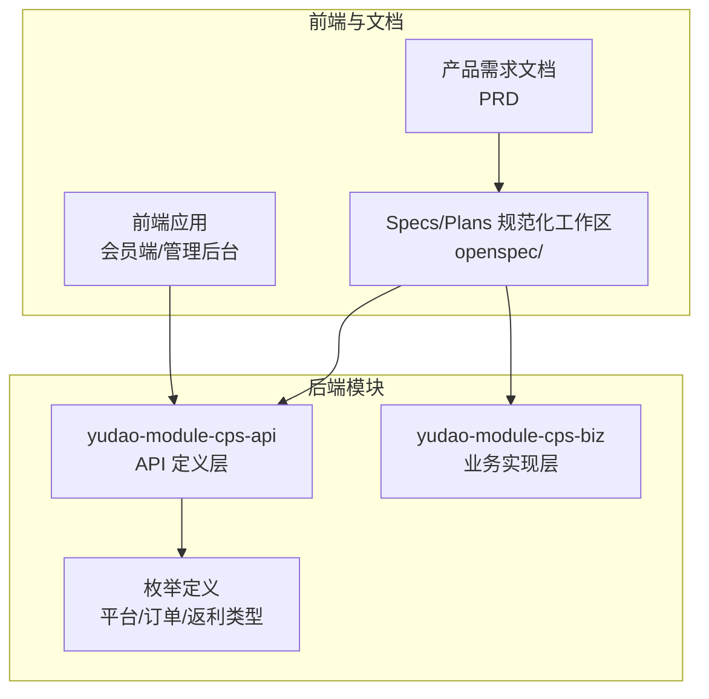
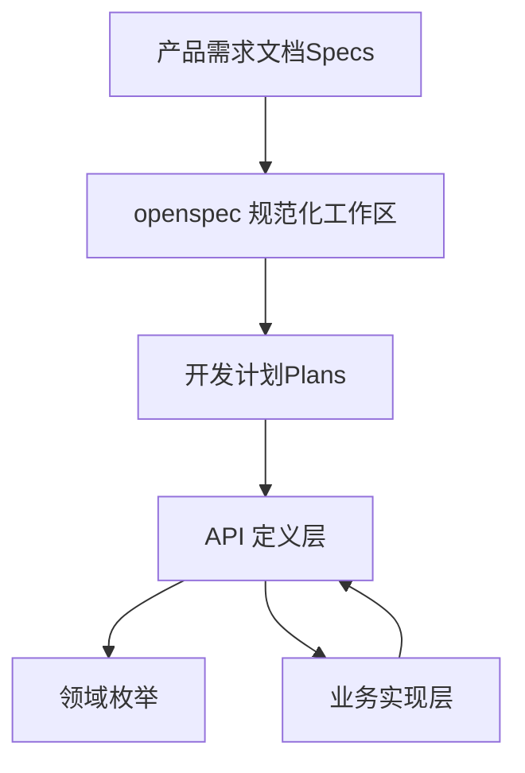
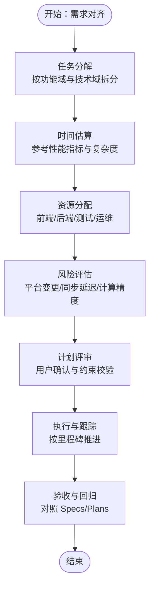
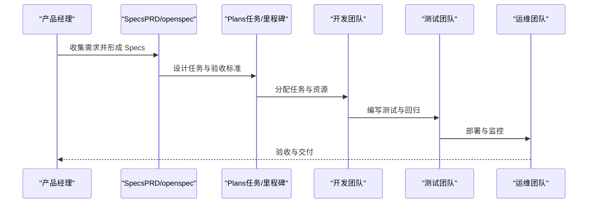
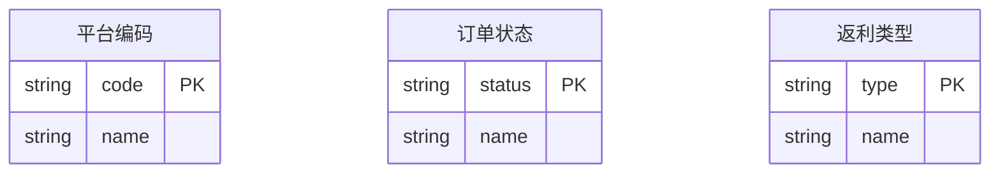
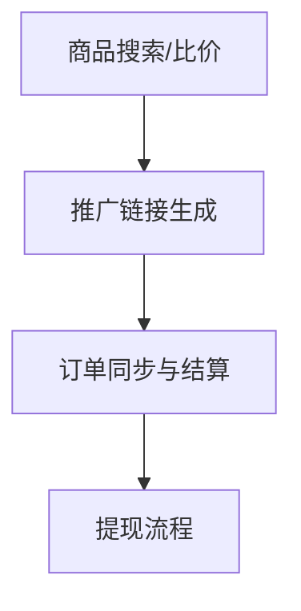
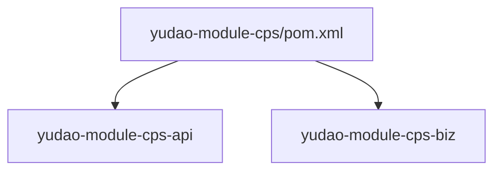

# Specs/Plans 规范化流程

<cite>
**本文引用的文件**
- [CPS系统PRD文档.md](file://docs/CPS系统PRD文档.md)
- [README.md](file://README.md)
- [config.yaml](file://openspec/config.yaml)
- [CpsPlatformCodeEnum.java](file://backend/yudao-module-cps/yudao-module-cps-api/src/main/java/cn/iocoder/yudao/module/cps/enums/CpsPlatformCodeEnum.java)
- [CpsOrderStatusEnum.java](file://backend/yudao-module-cps/yudao-module-cps-api/src/main/java/cn/iocoder/yudao/module/cps/enums/CpsOrderStatusEnum.java)
- [CpsRebateTypeEnum.java](file://backend/yudao-module-cps/yudao-module-cps-api/src/main/java/cn/iocoder/yudao/module/cps/enums/CpsRebateTypeEnum.java)
- [pom.xml](file://backend/yudao-module-cps/pom.xml)
</cite>

## 目录
1. [简介](#简介)
2. [项目结构](#项目结构)
3. [核心组件](#核心组件)
4. [架构总览](#架构总览)
5. [详细组件分析](#详细组件分析)
6. [依赖关系分析](#依赖关系分析)
7. [性能考量](#性能考量)
8. [故障排查指南](#故障排查指南)
9. [结论](#结论)
10. [附录](#附录)

## 简介
本文件面向“Specs/Plans 规范化工作流”的落地与执行，围绕需求规格说明书（Specs）与开发计划（Plans）的设计理念、编写方法与实施流程展开，结合仓库中的产品需求文档（PRD）与项目说明，系统化阐述如何将自然语言需求转化为结构化的 Specs 文档，并据此制定可执行的 Plans 计划；同时给出从需求收集到计划执行的完整工作流程、质量检查清单与评审标准，确保 Specs/Plans 的准确性与可执行性。

## 项目结构
本项目采用模块化组织，其中与 CPS 联盟返利系统直接相关的核心模块位于 backend/yudao-module-cps，包含 API 定义层与业务实现层，支撑会员端、管理后台与 MCP AI 接口的完整闭环。

**图表来源**
- [pom.xml:21-24](file://backend/yudao-module-cps/pom.xml#L21-L24)
- [README.md:229-249](file://README.md#L229-L249)

**章节来源**
- [README.md:229-249](file://README.md#L229-L249)
- [pom.xml:21-24](file://backend/yudao-module-cps/pom.xml#L21-L24)

## 核心组件
- 产品需求文档（PRD）：提供业务目标、用户角色、核心流程、功能清单与详细设计，是 Specs 的直接来源。
- 规范化工作区（openspec）：承载 Specs/Plans 的结构化产物，配合 config.yaml 提供上下文与规则约束。
- 枚举与领域模型：平台编码、订单状态、返利类型等，构成 Specs/Plans 的领域基础与一致性保障。
- 模块化后端：API 层定义契约，业务层实现流程，为 Plans 的任务分解与验收提供技术边界。

**章节来源**
- [CPS系统PRD文档.md:1-800](file://docs/CPS系统PRD文档.md#L1-L800)
- [config.yaml:1-21](file://openspec/config.yaml#L1-L21)
- [CpsPlatformCodeEnum.java:16-44](file://backend/yudao-module-cps/yudao-module-cps-api/src/main/java/cn/iocoder/yudao/module/cps/enums/CpsPlatformCodeEnum.java#L16-L44)
- [CpsOrderStatusEnum.java:16-45](file://backend/yudao-module-cps/yudao-module-cps-api/src/main/java/cn/iocoder/yudao/module/cps/enums/CpsOrderStatusEnum.java#L16-L45)
- [CpsRebateTypeEnum.java:16-39](file://backend/yudao-module-cps/yudao-module-cps-api/src/main/java/cn/iocoder/yudao/module/cps/enums/CpsRebateTypeEnum.java#L16-L39)

## 架构总览
下图展示了从 Specs/Plans 到系统实现的关键映射关系：PRD 作为 Specs 的载体，指导 Plans 的任务分解与验收标准；openspec 提供规范化约束；后端模块承接契约与实现。

**图表来源**
- [CPS系统PRD文档.md:1-800](file://docs/CPS系统PRD文档.md#L1-L800)
- [config.yaml:1-21](file://openspec/config.yaml#L1-L21)
- [pom.xml:21-24](file://backend/yudao-module-cps/pom.xml#L21-L24)

## 详细组件分析

### 1) Specs 设计理念与编写方法
- 以 PRD 为权威来源，提炼业务目标、用户角色、核心流程与功能清单，形成可追溯、可验证的 Specs。
- 明确业务需求分解边界：按“会员端功能、管理后台功能、AI Agent 功能”三层划分，确保覆盖全场景。
- 技术约束定义：基于后端模块与枚举定义，明确平台接入、订单状态流转、返利类型等技术边界。
- 验收标准制定：将 PRD 中的流程节点与页面设计转化为可测试的验收条件（如“订单同步延迟 < 30 分钟”）。

**章节来源**
- [CPS系统PRD文档.md:19-800](file://docs/CPS系统PRD文档.md#L19-L800)
- [CpsPlatformCodeEnum.java:16-44](file://backend/yudao-module-cps/yudao-module-cps-api/src/main/java/cn/iocoder/yudao/module/cps/enums/CpsPlatformCodeEnum.java#L16-L44)
- [CpsOrderStatusEnum.java:16-45](file://backend/yudao-module-cps/yudao-module-cps-api/src/main/java/cn/iocoder/yudao/module/cps/enums/CpsOrderStatusEnum.java#L16-L45)
- [CpsRebateTypeEnum.java:16-39](file://backend/yudao-module-cps/yudao-module-cps-api/src/main/java/cn/iocoder/yudao/module/cps/enums/CpsRebateTypeEnum.java#L16-L39)

### 2) Plans 计划制定过程
- 任务分解：依据 PRD 的功能清单与流程图，拆分为前端页面开发、后端接口实现、定时任务与 MCP 工具配置等子任务。
- 时间估算：参考 README 中的性能指标与模块复杂度，对搜索、比价、转链、订单同步等关键路径进行量化评估。
- 资源分配：明确前端、后端、测试与运维资源，结合模块化结构（API/Biz/枚举）进行职责划分。
- 风险评估：关注平台 API 变更、订单同步延迟、返利计算精度与 MCP 工具稳定性等风险点。

**图表来源**
- [README.md:332-342](file://README.md#L332-L342)
- [CPS系统PRD文档.md:1-800](file://docs/CPS系统PRD文档.md#L1-L800)

**章节来源**
- [README.md:332-342](file://README.md#L332-L342)
- [CPS系统PRD文档.md:1-800](file://docs/CPS系统PRD文档.md#L1-L800)

### 3) 从需求到计划的完整工作流程
- 需求收集：以 PRD 为基础，梳理用户角色、业务流程与功能清单。
- 规划设计：在 openspec 中沉淀 Specs，明确技术约束与验收标准。
- 计划生成：将 Specs 转化为可执行的 Plans，包含任务、里程碑、资源与风险。
- 执行与测试：按 Plans 推进开发，结合自动化测试与规范约束进行质量控制。
- 验收与交付：以 Specs/Plans 为依据进行验收，输出文档与可运行系统。

**图表来源**
- [CPS系统PRD文档.md:1-800](file://docs/CPS系统PRD文档.md#L1-L800)
- [README.md:113-144](file://README.md#L113-L144)

**章节来源**
- [CPS系统PRD文档.md:1-800](file://docs/CPS系统PRD文档.md#L1-L800)
- [README.md:113-144](file://README.md#L113-L144)

### 4) 数据模型与领域一致性
- 平台编码：用于标识接入平台（如淘宝、京东、拼多多、抖音），保证跨平台一致性。
- 订单状态：覆盖下单、付款、收货、结算、返利入账、退款、失效等关键节点。
- 返利类型：区分返利入账、返利扣回与系统调整，确保财务与审计一致性。

**图表来源**
- [CpsPlatformCodeEnum.java:16-44](file://backend/yudao-module-cps/yudao-module-cps-api/src/main/java/cn/iocoder/yudao/module/cps/enums/CpsPlatformCodeEnum.java#L16-L44)
- [CpsOrderStatusEnum.java:16-45](file://backend/yudao-module-cps/yudao-module-cps-api/src/main/java/cn/iocoder/yudao/module/cps/enums/CpsOrderStatusEnum.java#L16-L45)
- [CpsRebateTypeEnum.java:16-39](file://backend/yudao-module-cps/yudao-module-cps-api/src/main/java/cn/iocoder/yudao/module/cps/enums/CpsRebateTypeEnum.java#L16-L39)

**章节来源**
- [CpsPlatformCodeEnum.java:16-44](file://backend/yudao-module-cps/yudao-module-cps-api/src/main/java/cn/iocoder/yudao/module/cps/enums/CpsPlatformCodeEnum.java#L16-L44)
- [CpsOrderStatusEnum.java:16-45](file://backend/yudao-module-cps/yudao-module-cps-api/src/main/java/cn/iocoder/yudao/module/cps/enums/CpsOrderStatusEnum.java#L16-L45)
- [CpsRebateTypeEnum.java:16-39](file://backend/yudao-module-cps/yudao-module-cps-api/src/main/java/cn/iocoder/yudao/module/cps/enums/CpsRebateTypeEnum.java#L16-L39)

### 5) 业务流程与任务映射
- 商品搜索与比价：对应前端页面与后端搜索/比价工具，需关注并发查询与排序策略。
- 推广链接生成：对应转链 API 调用与归因参数注入，需考虑平台差异与风控。
- 订单同步与结算：对应定时任务与结算引擎，需满足“订单同步延迟 < 30 分钟”等性能指标。
- 提现流程：对应管理后台审核与支付接口，需满足“预计到账时间 T+1 工作日”。

**图表来源**
- [CPS系统PRD文档.md:121-261](file://docs/CPS系统PRD文档.md#L121-L261)
- [README.md:332-342](file://README.md#L332-L342)

**章节来源**
- [CPS系统PRD文档.md:121-261](file://docs/CPS系统PRD文档.md#L121-L261)
- [README.md:332-342](file://README.md#L332-L342)

## 依赖关系分析
- 模块间依赖：yudao-module-cps 作为父模块，包含 API 与 Biz 子模块，API 层提供契约与枚举，Biz 层实现业务逻辑。
- 外部依赖：平台 API（淘宝/京东/拼多多/抖音）、支付系统、定时任务与 MCP 协议等。

**图表来源**
- [pom.xml:21-24](file://backend/yudao-module-cps/pom.xml#L21-L24)

**章节来源**
- [pom.xml:21-24](file://backend/yudao-module-cps/pom.xml#L21-L24)

## 性能考量
- 搜索与比价：单平台搜索 < 2 秒（P99），多平台比价 < 5 秒（P99）。
- 转链生成：< 1 秒。
- 订单同步：延迟 < 30 分钟。
- 返利入账：平台结算后 24 小时内。
- MCP 工具调用：搜索类 < 3 秒，查询类 < 1 秒。

这些指标为 Specs/Plans 的任务估算与验收提供量化依据。

**章节来源**
- [README.md:332-342](file://README.md#L332-L342)

## 故障排查指南
- 平台接入异常：检查平台编码与 API 配置，核对 AppKey/AppSecret 与默认推广位。
- 订单同步失败：核查定时任务配置与平台回调状态，关注“订单同步延迟”阈值。
- 返利计算偏差：核对返利比例优先级与平台服务费率，确保结算流程一致。
- 提现审核阻塞：检查提现规则与风控阈值，确认支付接口状态与限额配置。

**章节来源**
- [CPS系统PRD文档.md:553-757](file://docs/CPS系统PRD文档.md#L553-L757)
- [README.md:332-342](file://README.md#L332-L342)

## 结论
通过将 PRD 转化为结构化的 Specs，并在此基础上制定可执行的 Plans，结合 openspec 的规范化约束与后端模块的技术边界，能够有效降低需求偏差、提升开发效率与质量可控性。建议在每次迭代后对 Specs/Plans 进行回顾与优化，持续提升团队的“自主编码—自动测试—验收交付”闭环能力。

## 附录

### A. Specs/Plans 模板与示例（路径指引）
- 产品概述与目标：参考 PRD 的“产品概述/产品目标/用户角色”部分，形成 Specs 的高层描述与关键指标。
  - 示例路径：[CPS系统PRD文档.md:19-800](file://docs/CPS系统PRD文档.md#L19-L800)
- 业务流程与验收：参考 PRD 的“核心业务流程/功能详细设计”，形成 Plans 的任务清单与验收条件。
  - 示例路径：[CPS系统PRD文档.md:80-800](file://docs/CPS系统PRD文档.md#L80-L800)
- 技术约束与领域模型：参考枚举定义，明确平台编码、订单状态与返利类型的一致性。
  - 示例路径：[CpsPlatformCodeEnum.java:16-44](file://backend/yudao-module-cps/yudao-module-cps-api/src/main/java/cn/iocoder/yudao/module/cps/enums/CpsPlatformCodeEnum.java#L16-L44)
  - 示例路径：[CpsOrderStatusEnum.java:16-45](file://backend/yudao-module-cps/yudao-module-cps-api/src/main/java/cn/iocoder/yudao/module/cps/enums/CpsOrderStatusEnum.java#L16-L45)
  - 示例路径：[CpsRebateTypeEnum.java:16-39](file://backend/yudao-module-cps/yudao-module-cps-api/src/main/java/cn/iocoder/yudao/module/cps/enums/CpsRebateTypeEnum.java#L16-L39)
- 规范化工作区配置：参考 openspec/config.yaml，补充项目上下文与制品规则。
  - 示例路径：[config.yaml:1-21](file://openspec/config.yaml#L1-L21)

### B. 质量检查清单与评审标准
- 需求对齐
  - 是否覆盖所有用户角色与核心流程？
  - 是否明确业务目标与成功指标？
- 技术约束
  - 是否与后端模块与枚举保持一致？
  - 是否包含性能与可用性约束？
- 计划可执行性
  - 任务是否可拆分、可估算、可验证？
  - 是否包含里程碑与风险应对？
- 验收标准
  - 是否具备可量化的验收指标？
  - 是否与 Specs 一一对应？