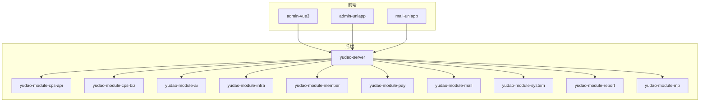
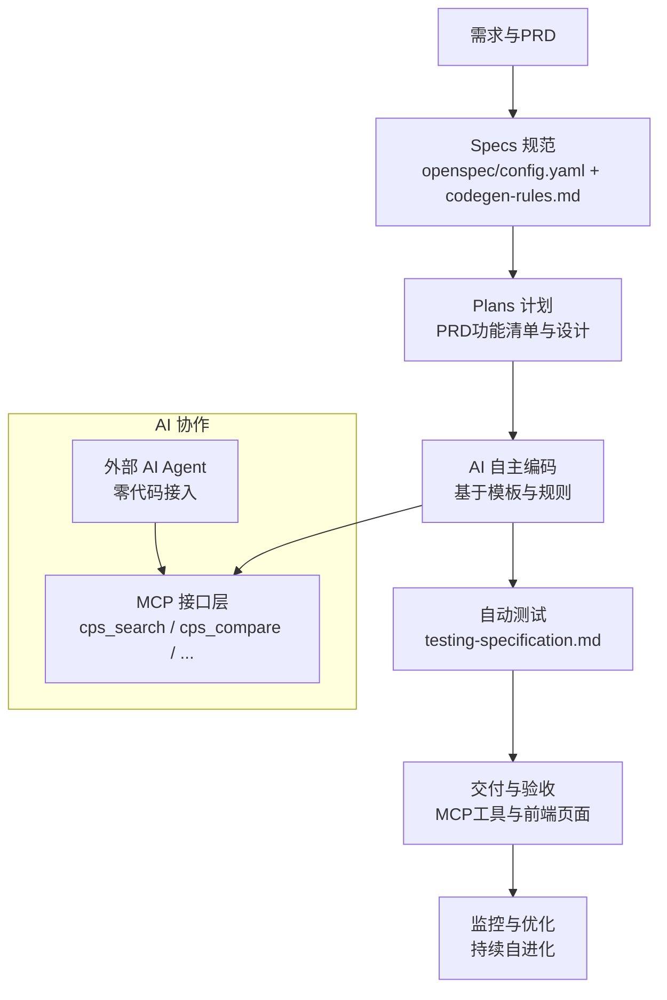
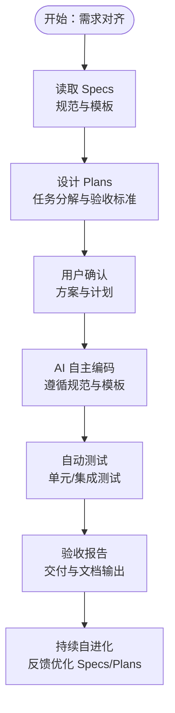
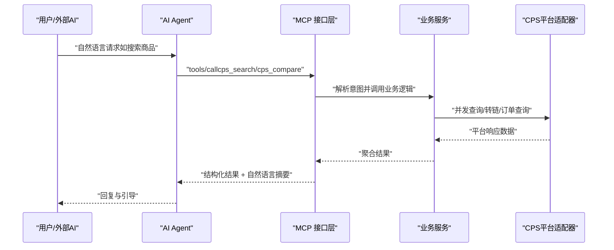
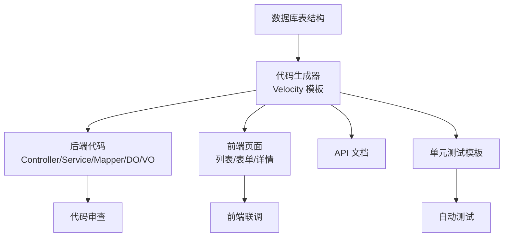
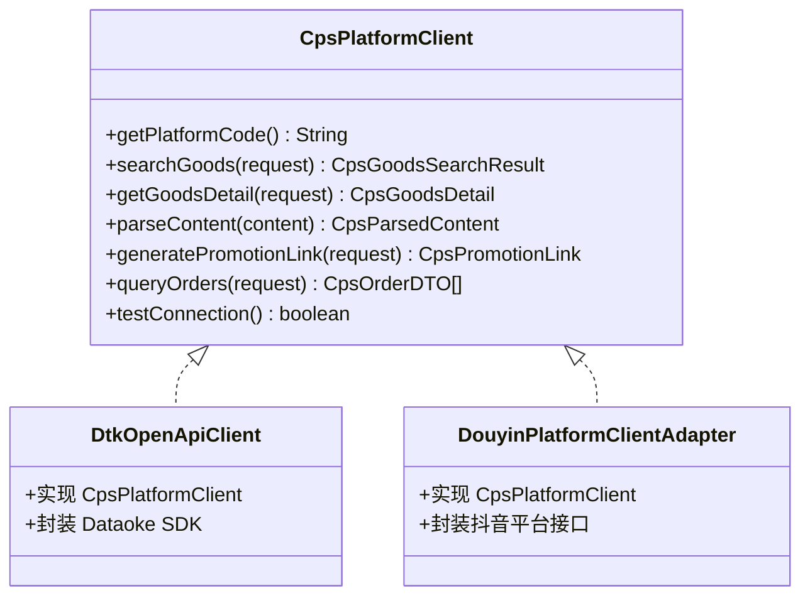
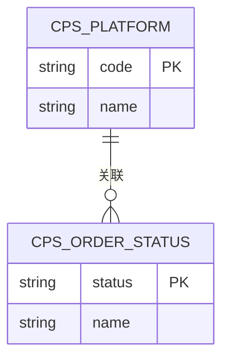
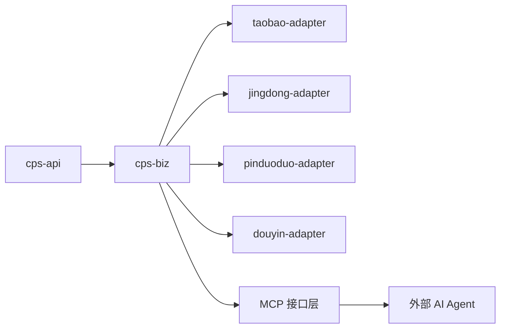

# Vibe Coding 工作流

<cite>
**本文引用的文件**
- [README.md](file://README.md)
- [AGENTS.md](file://AGENTS.md)
- [CPS系统PRD文档.md](file://docs/CPS系统PRD文档.md)
- [config.yaml](file://openspec/config.yaml)
- [MEMORY.md](file://agent_improvement/memory/MEMORY.md)
- [codegen-rules.md](file://agent_improvement/memory/codegen-rules.md)
- [testing-specification.md](file://agent_improvement/memory/testing-specification.md)
- [CpsPlatformCodeEnum.java](file://backend/yudao-module-cps/yudao-module-cps-api/src/main/java/cn/iocoder/yudao/module/cps/enums/CpsPlatformCodeEnum.java)
- [CpsOrderStatusEnum.java](file://backend/yudao-module-cps/yudao-module-cps-api/src/main/java/cn/iocoder/yudao/module/cps/enums/CpsOrderStatusEnum.java)
- [AbstractDtkApiClient.java](file://agent_improvement/sdk_demo/dataoke-sdk-java/src/main/java/com/dtk/api/client/AbstractDtkApiClient.java)
- [DtkOpenApiClient.java](file://backend/yudao-module-cps/yudao-module-cps-biz/src/main/java/cn/iocoder/yudao/module/cps/client/dataoke/DtkOpenApiClient.java)
- [DouyinPlatformClientAdapter.java](file://backend/yudao-module-cps/yudao-module-cps-biz/src/main/java/cn/iocoder/yudao/module/cps/client/douyin/DouyinPlatformClientAdapter.java)
</cite>

## 目录
1. [简介](#简介)
2. [项目结构](#项目结构)
3. [核心组件](#核心组件)
4. [架构总览](#架构总览)
5. [详细组件分析](#详细组件分析)
6. [依赖关系分析](#依赖关系分析)
7. [性能考量](#性能考量)
8. [故障排查指南](#故障排查指南)
9. [结论](#结论)
10. [附录](#附录)

## 简介
本文件系统化阐述 Vibe Coding 自主编程工作流在 AgenticCPS 项目中的落地实践，围绕 Specs/Plans 规范化工作流、AI 代理协作机制、Agent 配置管理与任务分配策略展开；同时给出需求规格说明书编写指南、技术方案设计流程、开发计划制定方法，覆盖代码生成器使用技巧、低代码开发实践与快速原型设计方法，并文档化 AI 辅助编程的工作流程、代码审查自动化与质量保证机制，最后总结团队协作模式、知识管理与经验传承方法及实际案例与最佳实践。

## 项目结构
AgenticCPS 采用多模块分层架构，后端基于 Spring Boot 3.x，前端包含 Vue3 管理后台与 UniApp 移动端，核心模块为 yudao-module-cps（CPS 联盟返利系统）。项目引入 Vibe Coding + 低代码 + AI 自主编程理念，通过规范化 Specs/Plans 工作流与 MCP 协议实现 AI Agent 的零代码接入与协作。

**图表来源**
- [AGENTS.md:13-57](file://AGENTS.md#L13-L57)

**章节来源**
- [AGENTS.md:11-57](file://AGENTS.md#L11-L57)
- [README.md:229-249](file://README.md#L229-L249)

## 核心组件
- 规范化工作流（Specs/Plans）
  - Spec 驱动：通过 openspec/config.yaml 与 agent_improvement/memory 下的 codegen-rules.md、testing-specification.md 等规则，确保 AI 生成代码符合统一规范与测试标准。
  - Plans 管理：以 PRD 文档为依据，将需求拆解为可执行的开发计划与验收标准，贯穿“需求对齐 → 方案设计 → 自主编码 → 验收交付”的闭环。
- AI 代理协作与 MCP 接口
  - 基于 Spring AI 与 MCP 协议，提供 cps_search、cps_compare、cps_generate_link、cps_query_orders、cps_get_rebate_summary 等工具，支持外部 AI Agent 直接调用。
- 低代码与代码生成器
  - 后端：基于 Velocity 模板的代码生成器，支持通用、树表、ERP 主表三种模板类型，自动生成 Controller/Service/Mapper/DO/VO、Swagger 文档与单元测试。
  - 前端：Vue3 Element Plus、Vben Admin、Vben5 Antd、UniApp 移动端模板，一键生成 CRUD 页面与 API。
- CPS 平台适配器（策略模式）
  - 通过 CpsPlatformClient 接口抽象，实现淘宝、京东、拼多多、抖音等平台的适配器，新增平台只需实现接口并注册为 Spring Bean。
- 数据与枚举
  - 平台编码与订单状态等枚举统一管理，确保跨模块一致性与可维护性。

**章节来源**
- [README.md:113-144](file://README.md#L113-L144)
- [AGENTS.md:141-182](file://AGENTS.md#L141-L182)
- [codegen-rules.md:1-788](file://agent_improvement/memory/codegen-rules.md#L1-L788)
- [testing-specification.md:1-784](file://agent_improvement/memory/testing-specification.md#L1-L784)
- [CpsPlatformCodeEnum.java:1-45](file://backend/yudao-module-cps/yudao-module-cps-api/src/main/java/cn/iocoder/yudao/module/cps/enums/CpsPlatformCodeEnum.java#L1-L45)
- [CpsOrderStatusEnum.java:1-48](file://backend/yudao-module-cps/yudao-module-cps-api/src/main/java/cn/iocoder/yudao/module/cps/enums/CpsOrderStatusEnum.java#L1-L48)

## 架构总览
AgenticCPS 的整体架构以“需求驱动 + 规范约束 + AI 自主编程 + 低代码生成 + MCP 协议”为核心，形成从需求到交付的闭环。

**图表来源**
- [README.md:113-144](file://README.md#L113-L144)
- [AGENTS.md:161-168](file://AGENTS.md#L161-L168)
- [CPS系统PRD文档.md:343-374](file://docs/CPS系统PRD文档.md#L343-L374)

## 详细组件分析

### 组件A：规范化工作流（Specs/Plans）
- Specs 设计理念
  - 以 openspec/config.yaml 为上下文入口，结合 codegen-rules.md 的代码生成规范与 testing-specification.md 的测试规范，确保 AI 生成的代码在风格、结构、测试与可维护性上保持一致。
  - 通过 MEMORY.md 的索引，集中管理 Claude Code 的规则与记忆文件，提升 AI 对项目的理解与生成质量。
- Plans 制定方法
  - 以 PRD 文档为蓝本，将功能清单（P0/P1/P2）转化为可执行的任务清单，明确验收标准与交付物，避免返工。
  - 通过“用户确认 → AI 自动完成 → 自动测试 → 验收报告 → 文档输出”的流程，确保交付质量与可追溯性。

**图表来源**
- [README.md:113-144](file://README.md#L113-L144)
- [CPS系统PRD文档.md:265-374](file://docs/CPS系统PRD文档.md#L265-L374)
- [codegen-rules.md:1-788](file://agent_improvement/memory/codegen-rules.md#L1-L788)
- [testing-specification.md:1-784](file://agent_improvement/memory/testing-specification.md#L1-L784)

**章节来源**
- [config.yaml:1-21](file://openspec/config.yaml#L1-L21)
- [MEMORY.md:1-21](file://agent_improvement/memory/MEMORY.md#L1-L21)
- [CPS系统PRD文档.md:265-374](file://docs/CPS系统PRD文档.md#L265-L374)

### 组件B：AI 代理协作机制与 MCP 接口
- MCP 协议与工具
  - 系统提供 5 个开箱即用的 MCP 工具：商品搜索、多平台比价、推广链接生成、订单查询、返利汇总，支持外部 AI Agent 直接调用，无需额外开发。
  - MCP 接口层位于 yudao-module-cps-biz/mcp，包含 Tools、Resources、Prompts 等，统一管理 AI 可调用能力与交互模板。
- Agent 配置管理
  - 支持 API Key 管理、权限级别（public/member/admin）、限流配置与使用统计，便于控制与审计。
  - MCP 访问日志提供请求时间、Tool/Resource、输入参数、响应状态、耗时、用户ID、IP 等信息，支撑监控与排障。

**图表来源**
- [AGENTS.md:161-168](file://AGENTS.md#L161-L168)
- [CPS系统PRD文档.md:643-694](file://docs/CPS系统PRD文档.md#L643-L694)

**章节来源**
- [AGENTS.md:161-168](file://AGENTS.md#L161-L168)
- [CPS系统PRD文档.md:643-694](file://docs/CPS系统PRD文档.md#L643-L694)

### 组件C：代码生成器与低代码实践
- 后端代码生成
  - 通过 codegen-rules.md 的模板与命名约定，自动生成 Controller/Service/Mapper/DO/VO 分层结构，配套 Swagger 文档与单元测试模板，覆盖通用、树表、ERP 主表三种模式。
- 前端代码生成
  - 提供 Vue3 Element Plus、Vben Admin、Vben5 Antd、UniApp 移动端四种模板，一键生成列表页、表单弹窗、详情页与 API 接口，支持分页、导出、树表与主子表场景。
- 快速原型设计
  - 基于生成器与模板，可在 30 分钟内完成从数据库表到前后端页面的完整原型，显著缩短开发周期。

**图表来源**
- [codegen-rules.md:1-788](file://agent_improvement/memory/codegen-rules.md#L1-L788)

**章节来源**
- [codegen-rules.md:1-788](file://agent_improvement/memory/codegen-rules.md#L1-L788)
- [README.md:147-210](file://README.md#L147-L210)

### 组件D：CPS 平台适配器（策略模式）
- 接口抽象
  - CpsPlatformClient 定义统一的平台适配接口，包括搜索、详情、内容解析、推广链接生成、订单查询、连通性测试等方法，确保新增平台只需实现接口并注册为 Spring Bean。
- 典型实现
  - 以 Dataoke SDK 与抖音适配器为例，展示如何封装第三方 API 并融入统一的适配器体系，便于扩展与维护。

**图表来源**
- [AGENTS.md:143-159](file://AGENTS.md#L143-L159)
- [DtkOpenApiClient.java](file://backend/yudao-module-cps/yudao-module-cps-biz/src/main/java/cn/iocoder/yudao/module/cps/client/dataoke/DtkOpenApiClient.java)
- [DouyinPlatformClientAdapter.java](file://backend/yudao-module-cps/yudao-module-cps-biz/src/main/java/cn/iocoder/yudao/module/cps/client/douyin/DouyinPlatformClientAdapter.java)

**章节来源**
- [AGENTS.md:143-159](file://AGENTS.md#L143-L159)
- [CpsPlatformCodeEnum.java:1-45](file://backend/yudao-module-cps/yudao-module-cps-api/src/main/java/cn/iocoder/yudao/module/cps/enums/CpsPlatformCodeEnum.java#L1-L45)

### 组件E：数据模型与枚举
- 平台编码与订单状态
  - 通过 CpsPlatformCodeEnum 与 CpsOrderStatusEnum 统一枚举值，确保跨模块一致性与可维护性，减少硬编码风险。
- 金额与时间规范
  - 金额统一以“分”为最小单位（Integer），避免浮点误差；时间统一使用上海时区，确保跨模块时间一致性。

**图表来源**
- [CpsPlatformCodeEnum.java:1-45](file://backend/yudao-module-cps/yudao-module-cps-api/src/main/java/cn/iocoder/yudao/module/cps/enums/CpsPlatformCodeEnum.java#L1-L45)
- [CpsOrderStatusEnum.java:1-48](file://backend/yudao-module-cps/yudao-module-cps-api/src/main/java/cn/iocoder/yudao/module/cps/enums/CpsOrderStatusEnum.java#L1-L48)

**章节来源**
- [CpsPlatformCodeEnum.java:1-45](file://backend/yudao-module-cps/yudao-module-cps-api/src/main/java/cn/iocoder/yudao/module/cps/enums/CpsPlatformCodeEnum.java#L1-L45)
- [CpsOrderStatusEnum.java:1-48](file://backend/yudao-module-cps/yudao-module-cps-api/src/main/java/cn/iocoder/yudao/module/cps/enums/CpsOrderStatusEnum.java#L1-L48)
- [AGENTS.md:206-213](file://AGENTS.md#L206-L213)

## 依赖关系分析
- 模块耦合与内聚
  - yudao-module-cps-api 与 yudao-module-cps-biz 通过清晰的分层与接口抽象实现低耦合；平台适配器通过策略模式与接口解耦具体实现。
- 外部依赖与集成点
  - MCP 协议作为统一集成点，连接外部 AI Agent 与内部业务服务；Dataoke SDK 与抖音适配器作为第三方平台集成的参考实现。
- 规范约束与测试保障
  - codegen-rules.md 与 testing-specification.md 为跨模块一致性提供规范与测试保障，降低集成风险。

**图表来源**
- [AGENTS.md:18-31](file://AGENTS.md#L18-L31)
- [AGENTS.md:161-168](file://AGENTS.md#L161-L168)

**章节来源**
- [AGENTS.md:18-31](file://AGENTS.md#L18-L31)
- [AGENTS.md:161-168](file://AGENTS.md#L161-L168)

## 性能考量
- 搜索与比价性能
  - 单平台搜索 P99 < 2 秒，多平台比价 P99 < 5 秒，转链生成 < 1 秒，满足用户体验与业务 SLA。
- 订单同步与时延
  - 订单同步周期 5 分钟，平台结算后返利入账延迟 < 24 小时，MCP Tool 调用 < 3 秒（搜索类）/ < 1 秒（查询类）。
- 缓存与并发
  - 建议在商品搜索与比价场景引入缓存策略，结合限流与熔断，保障高并发下的稳定性。

[本节为通用性能讨论，无需引用具体文件]

## 故障排查指南
- MCP 接口问题
  - 检查 API Key 权限级别与限流配置，查看 MCP 访问日志中的请求时间、Tool/Resource、响应状态与耗时，定位异常请求。
- 平台适配器异常
  - 通过 testConnection() 方法验证平台连通性；检查平台 AppKey/Secret 与 API 基础地址配置。
- 金额与时间问题
  - 确认金额字段使用“分”为单位，时间统一为 Asia/Shanghai；多租户场景下确保 tenant_id 隔离。
- 测试与回归
  - 使用 testing-specification.md 的测试模板与断言规范，针对异常路径与边界条件进行回归测试，确保修复有效。

**章节来源**
- [AGENTS.md:161-168](file://AGENTS.md#L161-L168)
- [AGENTS.md:214-234](file://AGENTS.md#L214-L234)
- [testing-specification.md:1-784](file://agent_improvement/memory/testing-specification.md#L1-L784)

## 结论
AgenticCPS 将 Vibe Coding、低代码与 AI 自主编程有机结合，通过 Specs/Plans 规范化工作流、MCP 协议与平台适配器策略模式，实现了从需求到交付的高效闭环。借助统一的代码生成器与测试规范，项目在保证质量的同时显著提升了开发效率与可维护性。未来可进一步完善 AI 辅助编程的自动化程度与团队知识沉淀机制，持续优化性能与稳定性。

[本节为总结性内容，无需引用具体文件]

## 附录
- 实际案例
  - “接入抖音联盟平台”：AI 自动完成 API 文档分析、适配器生成、数据库配置、MCP Tool 注册、单元测试与文档输出，用时约 30 分钟。
  - “接入唯品会联盟”：通过自然语言描述，AI 在 30 分钟内完成平台对接与功能上线，开发成本从 3 万元降至 0。
- 最佳实践
  - 严格遵循 Specs/Plans，确保 AI 理解无偏差；
  - 优先使用 MCP 工具与低代码生成器，减少手工编码；
  - 建立持续自进化机制，基于项目反馈优化规范与模板；
  - 强化测试与监控，保障交付质量与系统稳定。

**章节来源**
- [README.md:68-80](file://README.md#L68-L80)
- [README.md:345-370](file://README.md#L345-L370)