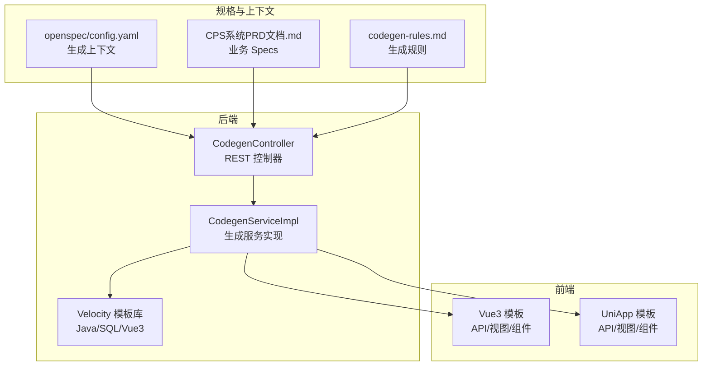
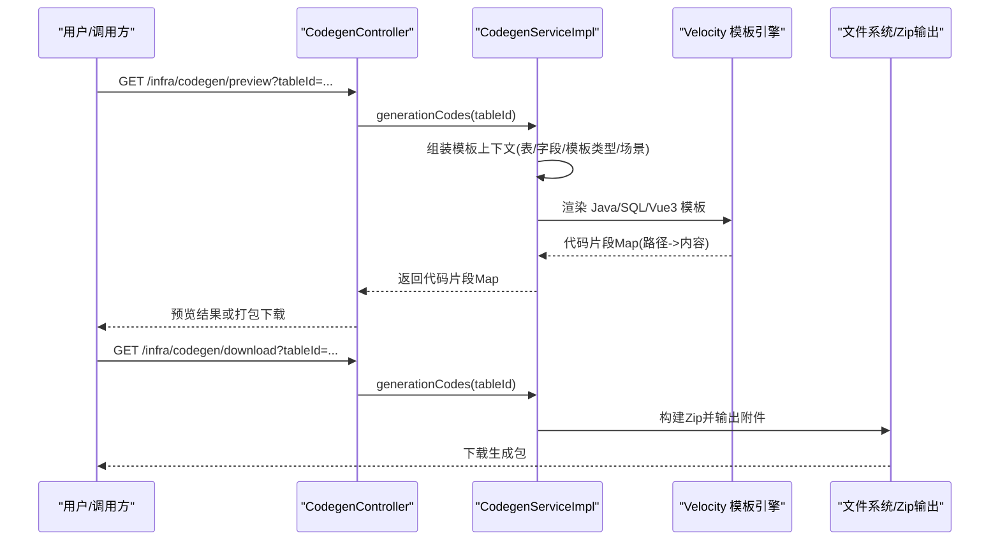
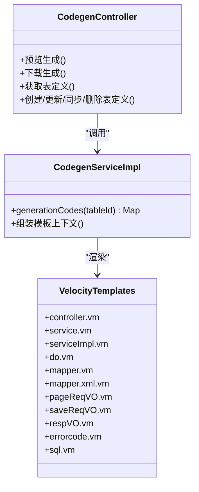
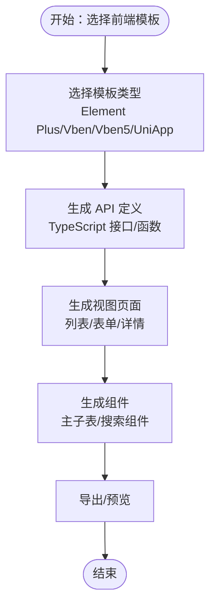
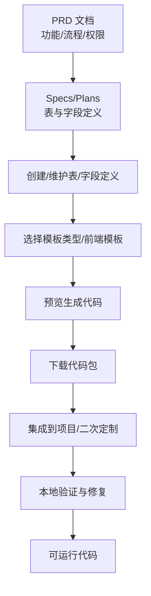
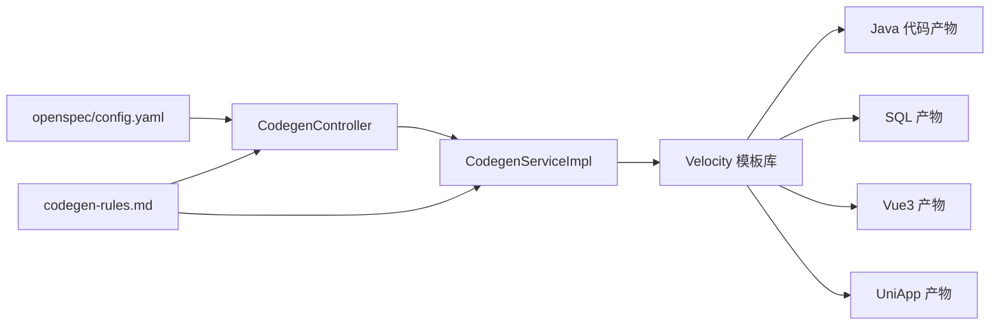

# 代码生成工作流

<cite>
**本文引用的文件**
- [openspec/config.yaml](file://openspec/config.yaml)
- [agent_improvement/memory/MEMORY.md](file://agent_improvement/memory/MEMORY.md)
- [agent_improvement/memory/codegen-rules.md](file://agent_improvement/memory/codegen-rules.md)
- [backend/yudao-module-infra/src/main/java/cn/iocoder/yudao/module/infra/controller/admin/codegen/CodegenController.java](file://backend/yudao-module-infra/src/main/java/cn/iocoder/yudao/module/infra/controller/admin/codegen/CodegenController.java)
- [backend/yudao-module-infra/src/main/java/cn/iocoder/yudao/module/infra/service/codegen/CodegenServiceImpl.java](file://backend/yudao-module-infra/src/main/java/cn/iocoder/yudao/module/infra/service/codegen/CodegenServiceImpl.java)
- [backend/yudao-module-infra/src/main/resources/codegen/java/controller/controller.vm](file://backend/yudao-module-infra/src/main/resources/codegen/java/controller/controller.vm)
- [backend/yudao-module-infra/src/main/resources/codegen/vue3/views/components/form_sub_erp.vue.vm](file://backend/yudao-module-infra/src/main/resources/codegen/vue3/views/components/form_sub_erp.vue.vm)
- [backend/yudao-module-infra/src/main/resources/codegen/sql/sql.vm](file://backend/yudao-module-infra/src/main/resources/codegen/sql/sql.vm)
- [backend/yudao-module-infra/src/main/resources/codegen/java/enums/errorcode.vm](file://backend/yudao-module-infra/src/main/resources/codegen/java/enums/errorcode.vm)
- [backend/yudao-module-infra/src/main/resources/codegen/java/controller/vo/pageReqVO.vm](file://backend/yudao-module-infra/src/main/resources/codegen/java/controller/vo/pageReqVO.vm)
- [backend/yudao-module-infra/src/main/resources/codegen/java/controller/vo/saveReqVO.vm](file://backend/yudao-module-infra/src/main/resources/codegen/java/controller/vo/saveReqVO.vm)
- [backend/yudao-module-infra/src/main/resources/codegen/java/controller/vo/respVO.vm](file://backend/yudao-module-infra/src/main/resources/codegen/java/controller/vo/respVO.vm)
- [backend/yudao-module-infra/src/main/resources/codegen/java/dal/do.vm](file://backend/yudao-module-infra/src/main/resources/codegen/java/dal/do.vm)
- [backend/yudao-module-infra/src/main/resources/codegen/java/dal/mapper.vm](file://backend/yudao-module-infra/src/main/resources/codegen/java/dal/mapper.vm)
- [backend/yudao-module-infra/src/main/resources/codegen/java/dal/mapper.xml.vm](file://backend/yudao-module-infra/src/main/resources/codegen/java/dal/mapper.xml.vm)
- [backend/yudao-module-infra/src/main/resources/codegen/java/service/service.vm](file://backend/yudao-module-infra/src/main/resources/codegen/java/service/service.vm)
- [backend/yudao-module-infra/src/main/resources/codegen/java/service/serviceImpl.vm](file://backend/yudao-module-infra/src/main/resources/codegen/java/service/serviceImpl.vm)
- [backend/yudao-module-infra/src/main/resources/codegen/vue3/api/api.ts.vm](file://backend/yudao-module-infra/src/main/resources/codegen/vue3/api/api.ts.vm)
- [backend/yudao-module-infra/src/main/resources/codegen/vue3/views/components/form_sub_normal.vue.vm](file://backend/yudao-module-infra/src/main/resources/codegen/vue3/views/components/form_sub_normal.vue.vm)
- [docs/CPS系统PRD文档.md](file://docs/CPS系统PRD文档.md)
</cite>

## 目录
1. [引言](#引言)
2. [项目结构](#项目结构)
3. [核心组件](#核心组件)
4. [架构总览](#架构总览)
5. [详细组件分析](#详细组件分析)
6. [依赖分析](#依赖分析)
7. [性能考虑](#性能考虑)
8. [故障排查指南](#故障排查指南)
9. [结论](#结论)
10. [附录](#附录)

## 引言
本文件系统化阐述基于 Specs/Plans 的自动化代码生成工作流，重点覆盖：
- 基于 Velocity 模板引擎的后端 Spring Boot 与前端 Vue3/UniApp 代码生成
- 从 Specs 文档到可运行代码的完整转换流程
- 代码生成规则、命名约定、模板类型与质量控制
- 低代码开发实践：可视化界面生成、业务逻辑自动实现、API 接口自动生成
- 代码生成器使用指南：参数配置、模板选择、输出定制
- 实际生成案例与质量检查、格式化、标准化处理机制

## 项目结构
该项目采用“后端 + 前端 + 规则与模板 + 规格文档”的组织方式：
- 后端模块 infra 提供代码生成器的控制器、服务与模板资源
- 前端包含 Vue3 与 UniApp 两套模板，覆盖 API、视图与组件
- 规则与模板集中于 yudao-module-infra 的 codegen 资源目录
- Openspec 与 PRD 文档为 Specs/Plans 的来源，驱动生成

**图表来源**
- [backend/yudao-module-infra/src/main/java/cn/iocoder/yudao/module/infra/controller/admin/codegen/CodegenController.java](file://backend/yudao-module-infra/src/main/java/cn/iocoder/yudao/module/infra/controller/admin/codegen/CodegenController.java)
- [backend/yudao-module-infra/src/main/java/cn/iocoder/yudao/module/infra/service/codegen/CodegenServiceImpl.java](file://backend/yudao-module-infra/src/main/java/cn/iocoder/yudao/module/infra/service/codegen/CodegenServiceImpl.java)
- [openspec/config.yaml](file://openspec/config.yaml)
- [docs/CPS系统PRD文档.md](file://docs/CPS系统PRD文档.md)
- [agent_improvement/memory/codegen-rules.md](file://agent_improvement/memory/codegen-rules.md)

**章节来源**
- [openspec/config.yaml:1-21](file://openspec/config.yaml#L1-L21)
- [docs/CPS系统PRD文档.md:1-120](file://docs/CPS系统PRD文档.md#L1-L120)
- [agent_improvement/memory/codegen-rules.md:1-50](file://agent_improvement/memory/codegen-rules.md#L1-L50)

## 核心组件
- 代码生成控制器：提供数据库表查询、表与字段定义管理、预览与打包下载生成代码等接口
- 代码生成服务：负责将表结构与字段元数据转换为 Velocity 模板上下文，执行模板渲染并输出代码
- Velocity 模板库：覆盖后端 Java 分层（DO/Mapper/Service/Controller/VO/SQL/枚举）、前端 Vue3/UniApp 页面与组件
- 规则与上下文：命名约定、模板类型、前后端变量映射、生成规则文档

关键职责与交互：
- 控制器接收请求，调用服务生成代码，返回预览或打包下载
- 服务组装模板上下文（表、字段、模板类型、场景等），调用模板引擎渲染
- 模板库依据上下文变量生成标准代码文件

**章节来源**
- [backend/yudao-module-infra/src/main/java/cn/iocoder/yudao/module/infra/controller/admin/codegen/CodegenController.java:40-161](file://backend/yudao-module-infra/src/main/java/cn/iocoder/yudao/module/infra/controller/admin/codegen/CodegenController.java#L40-L161)
- [agent_improvement/memory/codegen-rules.md:307-326](file://agent_improvement/memory/codegen-rules.md#L307-L326)

## 架构总览
下图展示了从 Specs/PRD 到生成代码的关键流程：控制器接收请求，服务组装上下文并调用模板引擎，模板库根据变量渲染 Java/SQL/Vue3/UniApp 代码。

**图表来源**
- [backend/yudao-module-infra/src/main/java/cn/iocoder/yudao/module/infra/controller/admin/codegen/CodegenController.java:134-158](file://backend/yudao-module-infra/src/main/java/cn/iocoder/yudao/module/infra/controller/admin/codegen/CodegenController.java#L134-L158)
- [backend/yudao-module-infra/src/main/java/cn/iocoder/yudao/module/infra/service/codegen/CodegenServiceImpl.java](file://backend/yudao-module-infra/src/main/java/cn/iocoder/yudao/module/infra/service/codegen/CodegenServiceImpl.java)

## 详细组件分析

### 后端代码生成（Spring Boot）
- 模板类型与分层结构
  - 模板类型：通用(1)、树表(2)、ERP主表(11)
  - 分层：Controller/Service/ServiceImpl/DO/Mapper/VO/SQL/错误码
- 生成规则
  - 命名约定：模块名 module-{name}、业务名小写中划线、类名 PascalCase、变量 camelCase
  - HTTP 路径：/{moduleName}/{className_strike_case}
  - VO 类型：PageReqVO/ListReqVO/SaveReqVO/RespVO
- 关键模板
  - Controller：基于场景鉴权、分页/列表接口、导出 Excel、主子表子接口
  - Service/ServiceImpl：增删改查、事务、校验、子表批量处理
  - DO/Mapper：MyBatis Plus 基类、条件构造器、树表/主子表标记
  - SQL：建表/索引/初始化脚本
  - 错误码：统一错误码常量

**图表来源**
- [backend/yudao-module-infra/src/main/java/cn/iocoder/yudao/module/infra/controller/admin/codegen/CodegenController.java:40-161](file://backend/yudao-module-infra/src/main/java/cn/iocoder/yudao/module/infra/controller/admin/codegen/CodegenController.java#L40-L161)
- [backend/yudao-module-infra/src/main/resources/codegen/java/controller/controller.vm](file://backend/yudao-module-infra/src/main/resources/codegen/java/controller/controller.vm)
- [backend/yudao-module-infra/src/main/resources/codegen/java/service/service.vm](file://backend/yudao-module-infra/src/main/resources/codegen/java/service/service.vm)
- [backend/yudao-module-infra/src/main/resources/codegen/java/service/serviceImpl.vm](file://backend/yudao-module-infra/src/main/resources/codegen/java/service/serviceImpl.vm)
- [backend/yudao-module-infra/src/main/resources/codegen/java/dal/do.vm](file://backend/yudao-module-infra/src/main/resources/codegen/java/dal/do.vm)
- [backend/yudao-module-infra/src/main/resources/codegen/java/dal/mapper.vm](file://backend/yudao-module-infra/src/main/resources/codegen/java/dal/mapper.vm)
- [backend/yudao-module-infra/src/main/resources/codegen/java/dal/mapper.xml.vm](file://backend/yudao-module-infra/src/main/resources/codegen/java/dal/mapper.xml.vm)
- [backend/yudao-module-infra/src/main/resources/codegen/java/controller/vo/pageReqVO.vm](file://backend/yudao-module-infra/src/main/resources/codegen/java/controller/vo/pageReqVO.vm)
- [backend/yudao-module-infra/src/main/resources/codegen/java/controller/vo/saveReqVO.vm](file://backend/yudao-module-infra/src/main/resources/codegen/java/controller/vo/saveReqVO.vm)
- [backend/yudao-module-infra/src/main/resources/codegen/java/controller/vo/respVO.vm](file://backend/yudao-module-infra/src/main/resources/codegen/java/controller/vo/respVO.vm)
- [backend/yudao-module-infra/src/main/resources/codegen/java/enums/errorcode.vm](file://backend/yudao-module-infra/src/main/resources/codegen/java/enums/errorcode.vm)
- [backend/yudao-module-infra/src/main/resources/codegen/sql/sql.vm](file://backend/yudao-module-infra/src/main/resources/codegen/sql/sql.vm)

**章节来源**
- [agent_improvement/memory/codegen-rules.md:5-326](file://agent_improvement/memory/codegen-rules.md#L5-L326)
- [backend/yudao-module-infra/src/main/resources/codegen/java/controller/controller.vm:1-271](file://backend/yudao-module-infra/src/main/resources/codegen/java/controller/controller.vm#L1-L271)
- [backend/yudao-module-infra/src/main/resources/codegen/java/service/serviceImpl.vm:138-202](file://backend/yudao-module-infra/src/main/resources/codegen/java/service/serviceImpl.vm#L138-L202)

### 前端代码生成（Vue3 与 UniApp）
- 模板类型与目录结构
  - Vue3 Element Plus、Vben Admin、Vben5 Antd
  - UniApp 移动端：API、列表/表单/详情页、搜索组件
- 生成规则
  - API 接口：GET/POST/PUT/DELETE、分页/导出
  - 视图：搜索表单、表格、分页、弹窗/模态表单
  - 组件：主子表组件（ERP/普通/内嵌）
  - HTML 类型映射：字符串/整型/布尔/时间/上传/富文本等
- 关键模板
  - API 定义：TypeScript 接口与函数
  - 列表页：表格、分页、操作列
  - 表单弹窗：校验、提交、成功回调
  - 主子表组件：ERP 模式独立 CRUD，普通模式内嵌列表

**图表来源**
- [agent_improvement/memory/codegen-rules.md:327-788](file://agent_improvement/memory/codegen-rules.md#L327-L788)
- [backend/yudao-module-infra/src/main/resources/codegen/vue3/api/api.ts.vm](file://backend/yudao-module-infra/src/main/resources/codegen/vue3/api/api.ts.vm)
- [backend/yudao-module-infra/src/main/resources/codegen/vue3/views/components/form_sub_erp.vue.vm](file://backend/yudao-module-infra/src/main/resources/codegen/vue3/views/components/form_sub_erp.vue.vm)
- [backend/yudao-module-infra/src/main/resources/codegen/vue3/views/components/form_sub_normal.vue.vm](file://backend/yudao-module-infra/src/main/resources/codegen/vue3/views/components/form_sub_normal.vue.vm)

**章节来源**
- [agent_improvement/memory/codegen-rules.md:327-788](file://agent_improvement/memory/codegen-rules.md#L327-L788)
- [backend/yudao-module-infra/src/main/resources/codegen/vue3/api/api.ts.vm](file://backend/yudao-module-infra/src/main/resources/codegen/vue3/api/api.ts.vm)
- [backend/yudao-module-infra/src/main/resources/codegen/vue3/views/components/form_sub_erp.vue.vm:1-204](file://backend/yudao-module-infra/src/main/resources/codegen/vue3/views/components/form_sub_erp.vue.vm#L1-L204)

### 代码生成规则与质量控制
- 规则来源与覆盖范围
  - 后端分层结构、命名约定、DO/Mapper/Service/Controller/VO/SQL/错误码
  - 前端模板类型、目录结构、API/视图/组件生成、HTML 类型映射
  - 模板类型：通用(1)、树表(2)、ERP主表(11)
- 质量控制要点
  - 统一命名与包路径变量
  - 树表/主子表的特殊处理（父字段、子表列表标记、ERD 关系）
  - 权限前缀与鉴权注解
  - Excel 导出 VO 字段标注与字典转换
  - SQL 初始化脚本与索引生成

**章节来源**
- [agent_improvement/memory/codegen-rules.md:1-788](file://agent_improvement/memory/codegen-rules.md#L1-L788)

### 低代码开发实践
- 可视化界面生成
  - 列表页：表格列、搜索表单、分页、操作列
  - 表单弹窗：校验规则、必填项、字典选项
  - 主子表：ERP 独立 CRUD、普通内嵌列表
- 业务逻辑自动实现
  - Controller：REST 接口、鉴权、分页/列表、导出
  - Service：增删改查、事务、校验、子表批量处理
  - Mapper：条件构造器、树表/主子表处理
- API 接口自动生成
  - 后端：Swagger 注解、权限注解、Excel 导出
  - 前端：Axios/defHttp 封装、分页参数、下载

**章节来源**
- [agent_improvement/memory/codegen-rules.md:204-261](file://agent_improvement/memory/codegen-rules.md#L204-L261)
- [agent_improvement/memory/codegen-rules.md:327-788](file://agent_improvement/memory/codegen-rules.md#L327-L788)

### 代码生成器使用指南
- 参数配置
  - 表与字段定义：通过数据库表同步或手动维护
  - 模板类型：通用/树表/ERP 主表
  - 场景：admin/app/api 等
  - 模块与业务名：遵循命名约定
- 模板选择
  - 后端：根据业务复杂度选择通用/树表/ERP 模板
  - 前端：Element Plus/Vben/Vben5/UniApp
- 输出定制
  - 预览：查看生成代码片段
  - 下载：打包为 zip，包含 Java/SQL/Vue3/UniApp 文件
  - 上下文：openspec/config.yaml 提供项目上下文与规则

**章节来源**
- [openspec/config.yaml:1-21](file://openspec/config.yaml#L1-L21)
- [backend/yudao-module-infra/src/main/java/cn/iocoder/yudao/module/infra/controller/admin/codegen/CodegenController.java:134-158](file://backend/yudao-module-infra/src/main/java/cn/iocoder/yudao/module/infra/controller/admin/codegen/CodegenController.java#L134-L158)

### 实际生成案例（从 Specs 到可运行代码）
- 业务 Specs 来源：CPS 系统 PRD 文档，定义功能清单、流程与权限矩阵
- 生成步骤
  - 在管理后台创建/维护表与字段定义
  - 选择模板类型与前端模板
  - 预览生成代码，检查命名、接口、权限
  - 下载并集成到项目，进行本地验证与二次定制
- 输出产物
  - 后端：Controller/Service/ServiceImpl/DO/Mapper/VO/SQL/错误码
  - 前端：API、视图、组件、主子表组件

**图表来源**
- [docs/CPS系统PRD文档.md:265-354](file://docs/CPS系统PRD文档.md#L265-L354)
- [backend/yudao-module-infra/src/main/java/cn/iocoder/yudao/module/infra/controller/admin/codegen/CodegenController.java:92-158](file://backend/yudao-module-infra/src/main/java/cn/iocoder/yudao/module/infra/controller/admin/codegen/CodegenController.java#L92-L158)

**章节来源**
- [docs/CPS系统PRD文档.md:1-120](file://docs/CPS系统PRD文档.md#L1-L120)
- [backend/yudao-module-infra/src/main/java/cn/iocoder/yudao/module/infra/controller/admin/codegen/CodegenController.java:92-158](file://backend/yudao-module-infra/src/main/java/cn/iocoder/yudao/module/infra/controller/admin/codegen/CodegenController.java#L92-L158)

## 依赖分析
- 控制器依赖服务：注入 CodegenService，提供预览与下载能力
- 服务依赖模板引擎：渲染 Java/SQL/Vue3 模板
- 模板依赖上下文变量：表、字段、模板类型、场景、权限前缀等
- 规则与上下文：codegen-rules.md 与 openspec/config.yaml 提供生成约束与风格

**图表来源**
- [backend/yudao-module-infra/src/main/java/cn/iocoder/yudao/module/infra/controller/admin/codegen/CodegenController.java:40-161](file://backend/yudao-module-infra/src/main/java/cn/iocoder/yudao/module/infra/controller/admin/codegen/CodegenController.java#L40-L161)
- [agent_improvement/memory/codegen-rules.md:1-50](file://agent_improvement/memory/codegen-rules.md#L1-L50)
- [openspec/config.yaml:1-21](file://openspec/config.yaml#L1-L21)

**章节来源**
- [backend/yudao-module-infra/src/main/java/cn/iocoder/yudao/module/infra/controller/admin/codegen/CodegenController.java:40-161](file://backend/yudao-module-infra/src/main/java/cn/iocoder/yudao/module/infra/controller/admin/codegen/CodegenController.java#L40-L161)

## 性能考虑
- 模板渲染性能
  - 合理拆分模板，避免过长模板导致渲染缓慢
  - 复用公共宏与片段，减少重复逻辑
- 生成代码体积
  - 仅生成必要接口与组件，避免冗余代码
  - 对树表/主子表按需生成接口
- 导出与下载
  - 大量文件打包时注意内存占用，采用流式写入
- 规则与上下文
  - openspec/config.yaml 与 codegen-rules.md 保持简洁，避免过度约束影响生成效率

## 故障排查指南
- 预览为空或下载失败
  - 检查表与字段定义是否完整
  - 确认模板类型与前端模板选择正确
- 权限不足
  - 确认鉴权注解与权限前缀配置
- 前端组件缺失
  - 检查主子表字段与模板类型（ERP/普通）
- 导出异常
  - 校验 RespVO 字段标注与字典转换
- 生成规则不生效
  - 对照 codegen-rules.md 的命名约定与模板类型说明

**章节来源**
- [agent_improvement/memory/codegen-rules.md:315-326](file://agent_improvement/memory/codegen-rules.md#L315-L326)
- [backend/yudao-module-infra/src/main/resources/codegen/java/controller/controller.vm:47-161](file://backend/yudao-module-infra/src/main/resources/codegen/java/controller/controller.vm#L47-L161)

## 结论
本工作流以 Specs/PRD 为源头，结合 Velocity 模板引擎与统一规则，实现了后端 Spring Boot 与前端 Vue3/UniApp 的自动化代码生成。通过清晰的分层结构、模板类型与命名约定，以及完善的质量控制机制，显著提升了低代码开发效率与代码一致性。建议在实际项目中持续沉淀规则与模板，形成可复用的生成资产。

## 附录
- 术语
  - Specs/Plans：业务规格与计划，驱动代码生成
  - 模板类型：通用/树表/ERP 主表
  - 场景：admin/app/api
- 参考文件
  - openspec/config.yaml：项目上下文与规则
  - codegen-rules.md：生成规则与模板规范
  - PRD 文档：业务 Specs