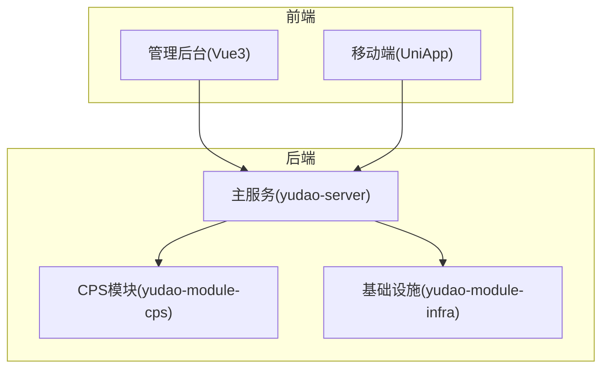
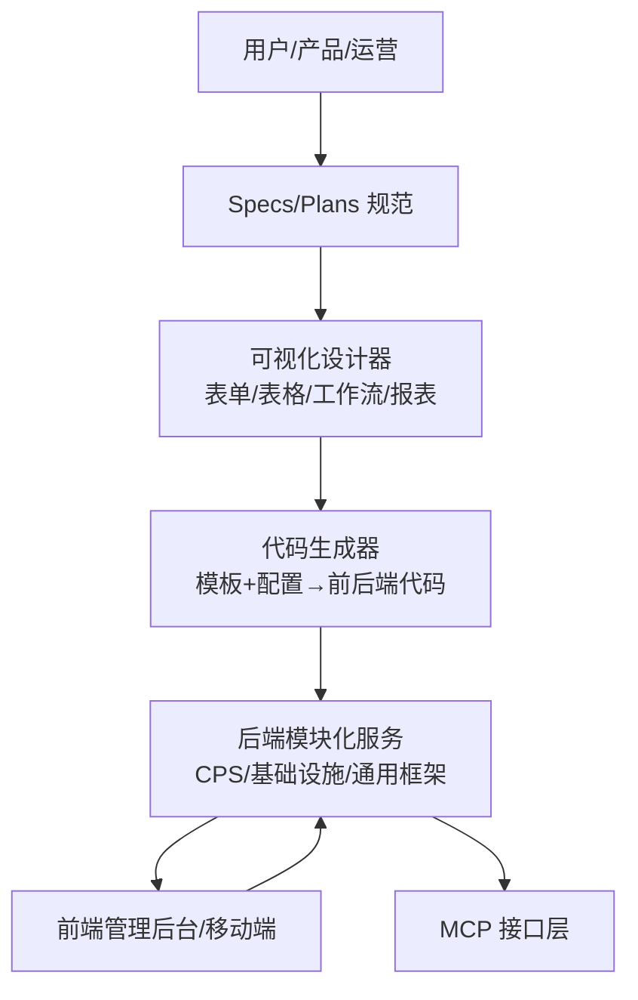
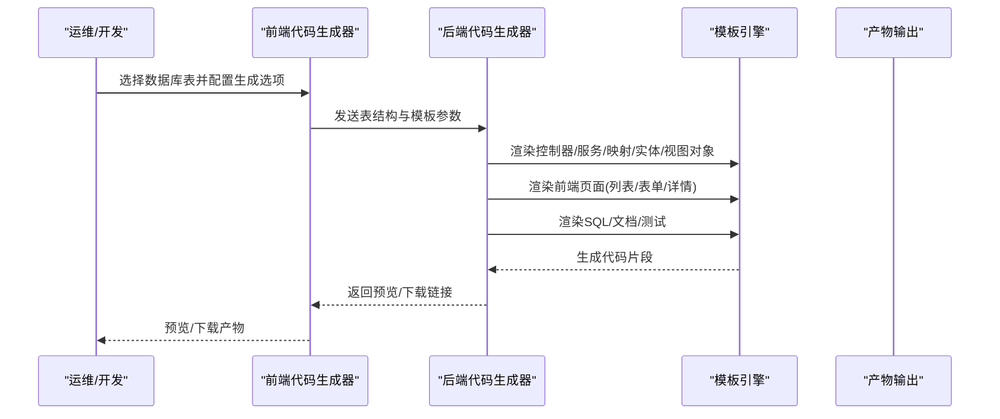
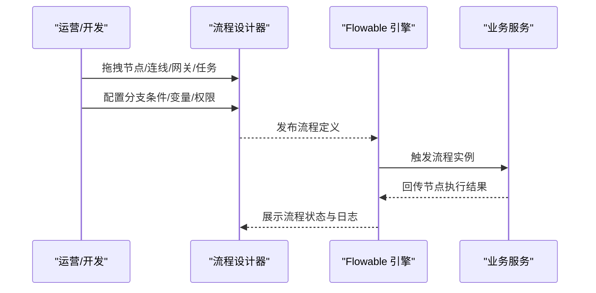
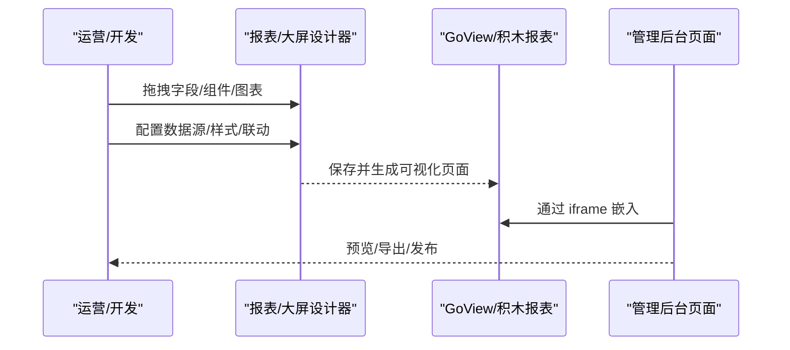
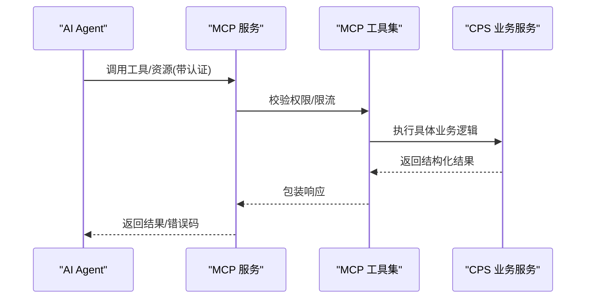
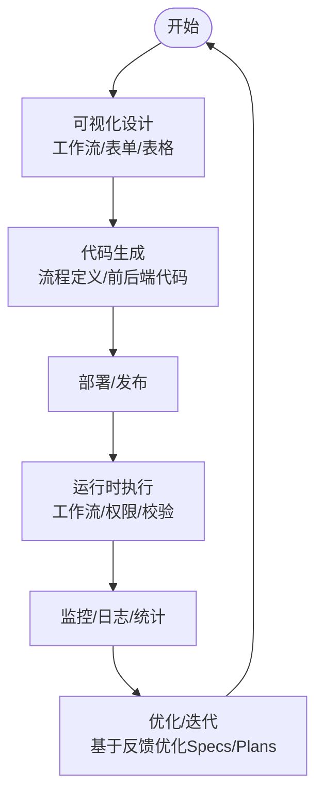
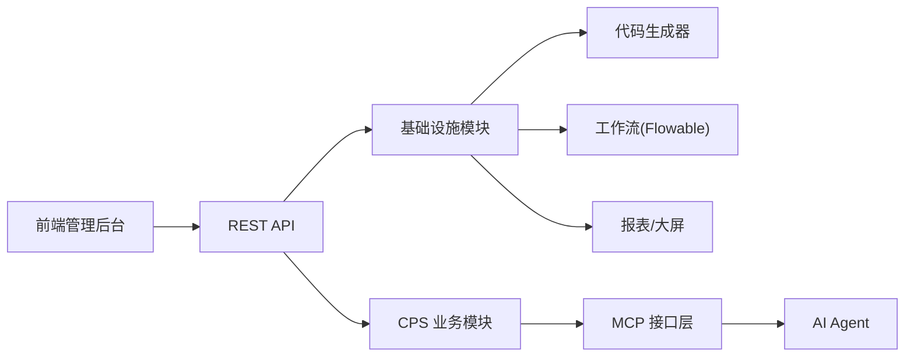

# 低代码开发

<cite>
**本文引用的文件**
- [README.md](file://README.md)
- [CPS系统PRD文档.md](file://docs/CPS系统PRD文档.md)
- [config.yaml](file://openspec/config.yaml)
- [CpsErrorCodeConstants.java](file://backend/yudao-module-cps/yudao-module-cps-api/src/main/java/cn/iocoder/yudao/module/cps/enums/CpsErrorCodeConstants.java)
- [CpsOrderStatusEnum.java](file://backend/yudao-module-cps/yudao-module-cps-api/src/main/java/cn/iocoder/yudao/module/cps/enums/CpsOrderStatusEnum.java)
- [CpsPlatformCodeEnum.java](file://backend/yudao-module-cps/yudao-module-cps-api/src/main/java/cn/iocoder/yudao/module/cps/enums/CpsPlatformCodeEnum.java)
- [CodegenServiceImplTest.java](file://backend/yudao-module-infra/src/test/java/cn/iocoder/yudao/module/infra/service/codegen/CodegenServiceImplTest.java)
- [index.ts](file://frontend/admin-vue3/src/api/infra/codegen/index.ts)
- [CodegenTableRespVO.java](file://backend/yudao-module-infra/src/main/java/cn/iocoder/yudao/module/infra/controller/admin/codegen/vo/table/CodegenTableRespVO.java)
- [category.json](file://backend/yudao-module-infra/src/test/resources/codecgen/table/category.json)
- [student.json](file://backend/yudao-module-infra/src/test/resources/codecgen/table/student.json)
- [ProcessDesigner.vue](file://frontend/admin-vue3/src/components/bpmnProcessDesigner/package/designer/ProcessDesigner.vue)
- [index.js](file://frontend/admin-vue3/src/components/bpmnProcessDesigner/package/designer/plugins/extension-moddle/flowable/index.js)
- [index.vue](file://frontend/admin-vue3/src/views/report/goview/index.vue)
- [bi.vue](file://frontend/admin-vue3/src/views/report/jmreport/bi.vue)
</cite>

## 目录
1. [引言](#引言)
2. [项目结构](#项目结构)
3. [核心组件](#核心组件)
4. [架构总览](#架构总览)
5. [详细组件分析](#详细组件分析)
6. [依赖关系分析](#依赖关系分析)
7. [性能考量](#性能考量)
8. [故障排查指南](#故障排查指南)
9. [结论](#结论)
10. [附录](#附录)

## 引言
本文件面向“低代码开发实践”，围绕基于 Specs 文档的可视化开发模式，系统阐述从“业务需求”到“代码实现”的自动化转换路径；重点覆盖前端界面生成机制（表单设计器、表格配置器、页面布局工具）、业务逻辑自动生成（工作流配置、权限控制、数据验证规则）、低代码工具链（Specs 编辑器、模板选择器、预览调试）以及在快速原型开发、业务变更响应与团队协作中的应用价值。

## 项目结构
AgenticCPS 采用前后端分离架构，后端以模块化方式组织（如 yudao-module-cps、yudao-module-infra 等），前端提供 Vue3 管理后台与 UniApp 移动端。低代码能力贯穿基础设施与业务模块，尤其在“代码生成器”“可视化工作流”“报表/大屏设计器”等方面形成闭环。

**章节来源**
- [README.md: 267-302:267-302](file://README.md#L267-L302)

## 核心组件
- 规范驱动的 Specs/Plans 工作流：以 Specs 为“技术标准与约束”，以 Plans 为“任务分解与验收”，确保 AI 编码与测试严格遵循规范，实现“需求对齐—方案设计—自主编码—自动测试—验收交付”的闭环。
- 代码生成器：基于数据库表结构一键生成前后端代码（Java 控制器/服务/映射/实体/视图对象、Vue3 页面、SQL 建表脚本、Swagger 文档、单元测试），覆盖单表、树表、主子表场景。
- 可视化工作流：基于 Flowable 引擎，提供 BPMN 与仿钉钉/飞书双设计器，支持在线拖拽设计审批流程（提现审核、返利结算、平台接入等）。
- 报表与大屏：集成 GoView、积木报表等，提供拖拽式数据报表、图形报表、大屏设计器与打印模板设计。
- MCP 协议：通过 MCP（Model Context Protocol）零代码接入 AI Agent，提供商品搜索、多平台比价、推广链接生成、订单查询、返利汇总等工具。

**章节来源**
- [README.md: 113-144:113-144](file://README.md#L113-L144)
- [README.md: 147-210:147-210](file://README.md#L147-L210)

## 架构总览
低代码开发的总体架构由“需求与规范层（Specs/Plans）—可视化设计层（表单/表格/工作流/报表）—代码生成与模板渲染层—运行与运维层”构成。前端通过 API 与后端交互，后端模块化承载业务域与基础设施能力，MCP 为外部 AI Agent 提供统一接口。

**章节来源**
- [README.md: 113-144:113-144](file://README.md#L113-L144)
- [README.md: 147-210:147-210](file://README.md#L147-L210)

## 详细组件分析

### 组件A：代码生成器（从数据库表到前后端代码）
- 输入：数据库表结构（含表定义与字段属性）
- 输出：后端 Java（Controller/Service/DAO/DO/VO）、前端 Vue3 页面（列表/表单/详情）、SQL 建表脚本、Swagger 文档、单元测试
- 能力覆盖：单表、树表、主子表，满足 80% 管理后台开发场景
- 关键流程：同步数据库表定义 → 预览生成代码 → 下载/导入工程

**图表来源**
- [index.ts: 84-92:84-92](file://frontend/admin-vue3/src/api/infra/codegen/index.ts#L84-L92)
- [CodegenServiceImplTest.java: 384-413:384-413](file://backend/yudao-module-infra/src/test/java/cn/iocoder/yudao/module/infra/service/codegen/CodegenServiceImplTest.java#L384-L413)

**章节来源**
- [README.md: 151-165:151-165](file://README.md#L151-L165)
- [index.ts: 61-100:61-100](file://frontend/admin-vue3/src/api/infra/codegen/index.ts#L61-L100)
- [CodegenTableRespVO.java: 1-35:1-35](file://backend/yudao-module-infra/src/main/java/cn/iocoder/yudao/module/infra/controller/admin/codegen/vo/table/CodegenTableRespVO.java#L1-L35)
- [category.json: 1-52:1-52](file://backend/yudao-module-infra/src/test/resources/codecgen/table/category.json#L1-L52)
- [student.json: 1-134:1-134](file://backend/yudao-module-infra/src/test/resources/codecgen/table/student.json#L1-L134)

### 组件B：可视化工作流（Flowable 拖拽设计）
- 设计器：支持 BPMN 与仿钉钉/飞书两种设计器，满足轻量配置与复杂编排
- 应用：提现审核、返利结算、平台接入等审批流程
- 集成：前端组件封装为可安装的 Vue 组件，后端基于 Flowable 引擎执行

**图表来源**
- [ProcessDesigner.vue](file://frontend/admin-vue3/src/components/bpmnProcessDesigner/package/designer/ProcessDesigner.vue)
- [index.js: 1-10:1-10](file://frontend/admin-vue3/src/components/bpmnProcessDesigner/package/designer/plugins/extension-moddle/flowable/index.js#L1-L10)

**章节来源**
- [README.md: 167-174:167-174](file://README.md#L167-L174)

### 组件C：报表与大屏设计器（拖拽生成可视化）
- 能力：数据报表设计器、图形报表设计器、大屏设计器、打印设计器
- 集成：通过 iframe 嵌入 GoView、积木报表等第三方平台，支持导出 Excel/PDF

**图表来源**
- [index.vue: 1-16:1-16](file://frontend/admin-vue3/src/views/report/goview/index.vue#L1-L16)
- [bi.vue: 1-15:1-15](file://frontend/admin-vue3/src/views/report/jmreport/bi.vue#L1-L15)

**章节来源**
- [README.md: 176-183:176-183](file://README.md#L176-L183)

### 组件D：MCP 协议（AI Agent 零代码接入）
- 目标：通过 MCP 协议，AI Agent 直接调用系统工具与资源，无需额外开发
- 工具示例：商品搜索、多平台比价、推广链接生成、订单查询、返利汇总
- 管理：提供 API Key 管理、权限分级、限流配置、访问日志与统计分析

**图表来源**
- [README.md: 185-209:185-209](file://README.md#L185-L209)

**章节来源**
- [README.md: 185-209:185-209](file://README.md#L185-L209)

### 组件E：业务逻辑自动生成（工作流、权限、验证）
- 工作流：通过可视化设计器生成流程定义，后端引擎自动执行，降低手工编码成本
- 权限控制：基于角色与菜单的权限矩阵，结合 API 级别权限与资源访问控制
- 数据验证：通过表单/表格配置器生成前端校验与后端参数校验规则，保证数据一致性

**章节来源**
- [README.md: 113-144:113-144](file://README.md#L113-L144)
- [CPS系统PRD文档.md: 51-76:51-76](file://docs/CPS系统PRD文档.md#L51-L76)
- [CpsErrorCodeConstants.java: 1-65:1-65](file://backend/yudao-module-cps/yudao-module-cps-api/src/main/java/cn/iocoder/yudao/module/cps/enums/CpsErrorCodeConstants.java#L1-L65)
- [CpsOrderStatusEnum.java: 1-48:1-48](file://backend/yudao-module-cps/yudao-module-cps-api/src/main/java/cn/iocoder/yudao/module/cps/enums/CpsOrderStatusEnum.java#L1-L48)
- [CpsPlatformCodeEnum.java: 1-45:1-45](file://backend/yudao-module-cps/yudao-module-cps-api/src/main/java/cn/iocoder/yudao/module/cps/enums/CpsPlatformCodeEnum.java#L1-L45)

## 依赖关系分析
- 前端与后端通过 REST API 交互，前端负责可视化设计器与页面展示，后端负责业务逻辑与数据持久化
- 代码生成器依赖模板与配置文件，生成前后端代码并支持预览与下载
- 工作流依赖 Flowable 引擎，报表依赖第三方可视化平台
- MCP 作为统一接口层，向上提供工具/资源调用，向下对接业务服务

**章节来源**
- [README.md: 267-302:267-302](file://README.md#L267-L302)

## 性能考量
- 搜索与比价：多平台并发查询，需关注超时与降级策略，确保 P99 延迟达标
- 订单同步：定时任务增量拉取，避免全量扫描，减少数据库压力
- 转链与结算：平台 API 限流与重试机制，保障成功率与稳定性
- 报表与大屏：数据聚合与缓存策略，支持导出与分页加载

[本节为通用指导，无需列出具体文件来源]

## 故障排查指南
- 代码生成异常：检查表定义与字段配置是否完整，确认模板类型与场景设置正确
- 工作流执行失败：查看流程日志与节点状态，核对分支条件与变量映射
- 报表/大屏空白：确认数据源连接、权限与访问令牌有效，检查嵌入 URL 与跨域配置
- MCP 调用失败：核对 API Key 权限级别与限流配置，查看访问日志与错误码

**章节来源**
- [CodegenServiceImplTest.java: 384-413:384-413](file://backend/yudao-module-infra/src/test/java/cn/iocoder/yudao/module/infra/service/codegen/CodegenServiceImplTest.java#L384-L413)
- [CpsErrorCodeConstants.java: 1-65:1-65](file://backend/yudao-module-cps/yudao-module-cps-api/src/main/java/cn/iocoder/yudao/module/cps/enums/CpsErrorCodeConstants.java#L1-L65)

## 结论
AgenticCPS 将“Specs/Plans 规范驱动 + 可视化设计器 + 代码生成器 + MCP 接口”有机融合，形成从需求到交付的一体化低代码开发体系。该体系在快速原型开发、业务变更响应与团队协作方面具备显著优势：需求对齐更准、方案先行零返工、AI 自主编程效率倍增、质量可保障、持续自进化。

[本节为总结性内容，无需列出具体文件来源]

## 附录

### 附录A：低代码工具链使用指南
- Specs 编辑器：在 openspec/config.yaml 中配置上下文与制品规则，确保 AI 理解一致
- 模板选择器：在代码生成器中选择模板类型（单表/树表/主子表），按需配置生成场景
- 预览与调试：通过预览功能快速验证生成代码，结合单元测试与接口文档进行调试

**章节来源**
- [config.yaml: 1-21:1-21](file://openspec/config.yaml#L1-L21)
- [README.md: 151-165:151-165](file://README.md#L151-L165)

### 附录B：业务场景与价值
- 快速原型：输入数据库表结构，一键生成 CRUD 页面与接口，快速搭建原型
- 业务变更：通过可视化设计器调整流程与页面，无需改动代码即可上线
- 团队协作：Specs/Plans 明确规范，MCP 统一接口，降低沟通成本与技术门槛

**章节来源**
- [README.md: 345-370:345-370](file://README.md#L345-L370)