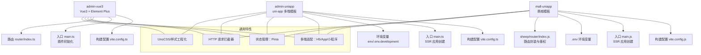
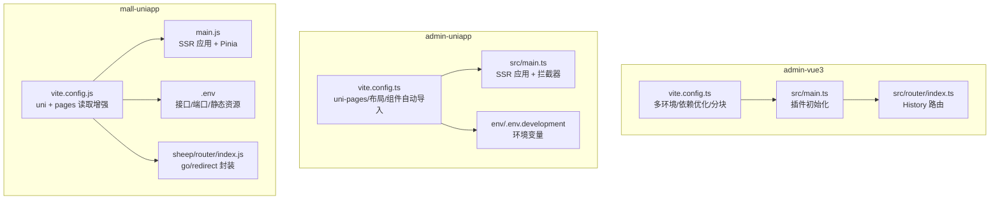
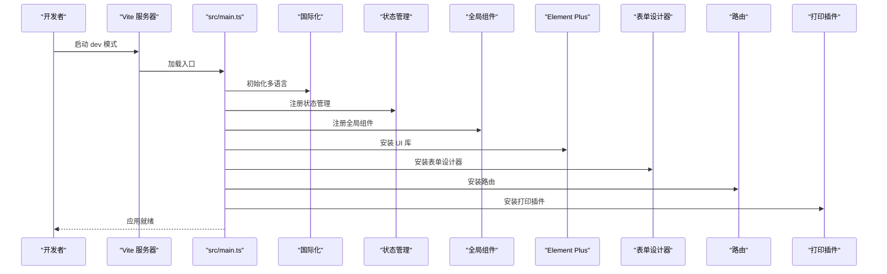
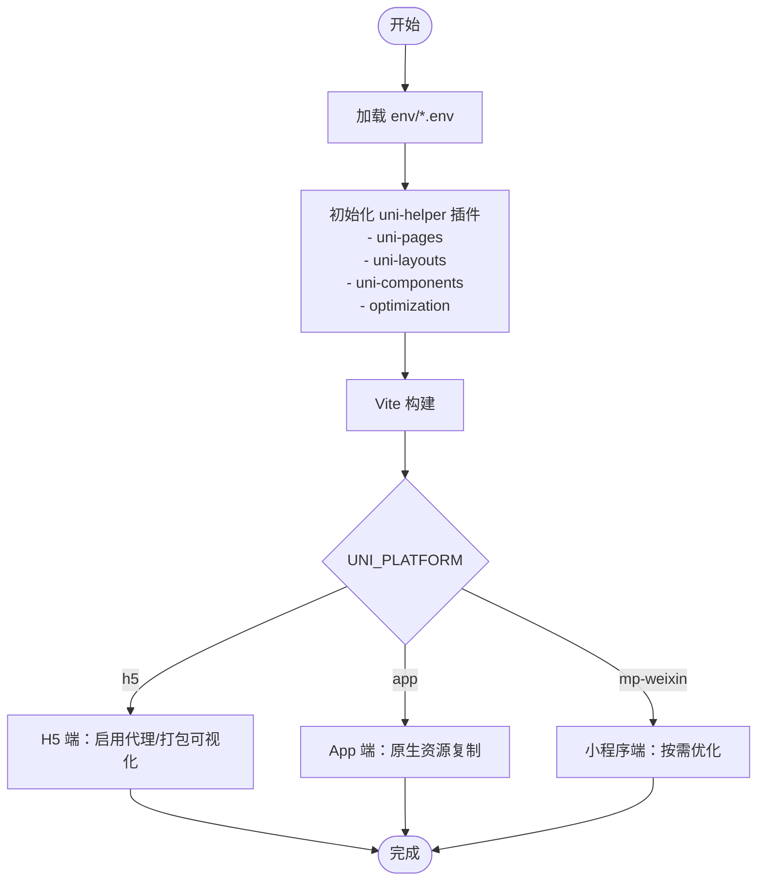
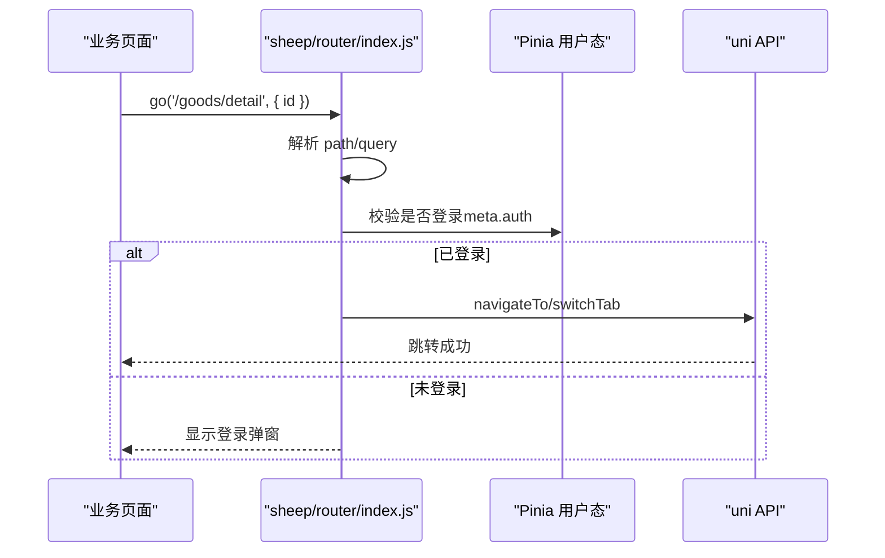
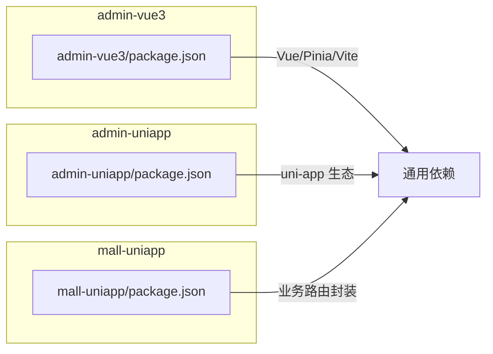

# 前端模板系统

<cite>
**本文档引用的文件**
- [frontend/admin-vue3/package.json](file://frontend/admin-vue3/package.json)
- [frontend/admin-vue3/vite.config.ts](file://frontend/admin-vue3/vite.config.ts)
- [frontend/admin-vue3/src/main.ts](file://frontend/admin-vue3/src/main.ts)
- [frontend/admin-vue3/src/router/index.ts](file://frontend/admin-vue3/src/router/index.ts)
- [frontend/admin-uniapp/package.json](file://frontend/admin-uniapp/package.json)
- [frontend/admin-uniapp/vite.config.ts](file://frontend/admin-uniapp/vite.config.ts)
- [frontend/admin-uniapp/src/main.ts](file://frontend/admin-uniapp/src/main.ts)
- [frontend/admin-uniapp/env/.env.development](file://frontend/admin-uniapp/env/.env.development)
- [frontend/mall-uniapp/package.json](file://frontend/mall-uniapp/package.json)
- [frontend/mall-uniapp/vite.config.js](file://frontend/mall-uniapp/vite.config.js)
- [frontend/mall-uniapp/main.js](file://frontend/mall-uniapp/main.js)
- [frontend/mall-uniapp/.env](file://frontend/mall-uniapp/.env)
- [frontend/mall-uniapp/sheep/router/index.js](file://frontend/mall-uniapp/sheep/router/index.js)
</cite>

## 目录
1. [简介](#简介)
2. [项目结构](#项目结构)
3. [核心组件](#核心组件)
4. [架构总览](#架构总览)
5. [详细组件分析](#详细组件分析)
6. [依赖关系分析](#依赖关系分析)
7. [性能考量](#性能考量)
8. [故障排查指南](#故障排查指南)
9. [结论](#结论)
10. [附录](#附录)

## 简介
本文件系统性梳理并文档化仓库中的前端模板体系，重点覆盖以下三类模板：
- Vue3 + Element Plus + Vben Admin 风格的后台管理模板（admin-vue3）
- 基于 uni-app 的多端统一模板（admin-uniapp）
- 商城类 uni-app 模板（mall-uniapp）

文档内容涵盖：
- 架构与实现方式
- API 接口模板、页面组件模板、表单模板的生成规则
- 前端模板变量系统（业务字段映射、权限控制、组件类型映射）
- 前端模板开发指南（新模板创建、组件生成、样式定制）
- 多端模板适配机制与扩展最佳实践

## 项目结构
该仓库包含三个主要前端模板目录，每个模板均采用独立的构建配置与运行脚本，具备明确的职责边界与可复用能力。

图表来源
- [frontend/admin-vue3/vite.config.ts:1-89](file://frontend/admin-vue3/vite.config.ts#L1-L89)
- [frontend/admin-vue3/src/main.ts:1-86](file://frontend/admin-vue3/src/main.ts#L1-L86)
- [frontend/admin-vue3/src/router/index.ts:1-37](file://frontend/admin-vue3/src/router/index.ts#L1-L37)
- [frontend/admin-uniapp/vite.config.ts:1-214](file://frontend/admin-uniapp/vite.config.ts#L1-L214)
- [frontend/admin-uniapp/src/main.ts:1-20](file://frontend/admin-uniapp/src/main.ts#L1-L20)
- [frontend/admin-uniapp/env/.env.development:1-10](file://frontend/admin-uniapp/env/.env.development#L1-L10)
- [frontend/mall-uniapp/vite.config.js:1-35](file://frontend/mall-uniapp/vite.config.js#L1-L35)
- [frontend/mall-uniapp/main.js:1-16](file://frontend/mall-uniapp/main.js#L1-L16)
- [frontend/mall-uniapp/.env:1-36](file://frontend/mall-uniapp/.env#L1-L36)
- [frontend/mall-uniapp/sheep/router/index.js:1-204](file://frontend/mall-uniapp/sheep/router/index.js#L1-L204)

章节来源
- [frontend/admin-vue3/package.json:1-160](file://frontend/admin-vue3/package.json#L1-L160)
- [frontend/admin-uniapp/package.json:1-194](file://frontend/admin-uniapp/package.json#L1-L194)
- [frontend/mall-uniapp/package.json:1-104](file://frontend/mall-uniapp/package.json#L1-L104)

## 核心组件
- 构建与开发服务器
  - admin-vue3：基于 Vite，提供多环境模式、依赖预打包与分块策略、CSS 预处理器配置。
  - admin-uniapp：基于 Vite + uni-helper 插件生态，支持多端页面自动发现、分包优化、组件自动导入、UnoCSS、打包可视化等。
  - mall-uniapp：基于 Vite + @dcloudio/vite-plugin-uni，提供 pages.json 读取增强与 Manifest 插件。

- 应用入口与初始化
  - admin-vue3：集中初始化 i18n、状态管理、全局组件、Element Plus、表单设计器、路由、指令、打印插件等。
  - admin-uniapp：创建 SSR 应用，挂载状态管理与路由/请求拦截器。
  - mall-uniapp：创建 SSR 应用，初始化 Pinia。

- 路由与权限
  - admin-vue3：基于 vue-router 的 History 模式，提供路由重置能力与滚动行为控制。
  - mall-uniapp：自定义 go/redirect/back 等路由封装，内置登录鉴权与 TabBar 切换逻辑。

章节来源
- [frontend/admin-vue3/vite.config.ts:1-89](file://frontend/admin-vue3/vite.config.ts#L1-L89)
- [frontend/admin-vue3/src/main.ts:1-86](file://frontend/admin-vue3/src/main.ts#L1-L86)
- [frontend/admin-vue3/src/router/index.ts:1-37](file://frontend/admin-vue3/src/router/index.ts#L1-L37)
- [frontend/admin-uniapp/vite.config.ts:1-214](file://frontend/admin-uniapp/vite.config.ts#L1-L214)
- [frontend/admin-uniapp/src/main.ts:1-20](file://frontend/admin-uniapp/src/main.ts#L1-L20)
- [frontend/mall-uniapp/vite.config.js:1-35](file://frontend/mall-uniapp/vite.config.js#L1-L35)
- [frontend/mall-uniapp/main.js:1-16](file://frontend/mall-uniapp/main.js#L1-L16)
- [frontend/mall-uniapp/sheep/router/index.js:1-204](file://frontend/mall-uniapp/sheep/router/index.js#L1-L204)

## 架构总览
三类模板在“构建工具链 + 应用初始化 + 路由与权限 + 状态管理 + 多端适配”的层面形成一致的工程化范式，差异主要体现在：
- 构建插件与多端页面发现机制（admin-uniapp 采用 uni-helper 生态）
- 路由封装与鉴权策略（mall-uniapp 提供更细粒度的 go/redirect 封装）
- 组件与 UI 库选择（admin-vue3 使用 Element Plus；admin-uniapp 使用 Wot Design Uni）

图表来源
- [frontend/admin-vue3/vite.config.ts:1-89](file://frontend/admin-vue3/vite.config.ts#L1-L89)
- [frontend/admin-vue3/src/main.ts:1-86](file://frontend/admin-vue3/src/main.ts#L1-L86)
- [frontend/admin-vue3/src/router/index.ts:1-37](file://frontend/admin-vue3/src/router/index.ts#L1-L37)
- [frontend/admin-uniapp/vite.config.ts:1-214](file://frontend/admin-uniapp/vite.config.ts#L1-L214)
- [frontend/admin-uniapp/src/main.ts:1-20](file://frontend/admin-uniapp/src/main.ts#L1-L20)
- [frontend/admin-uniapp/env/.env.development:1-10](file://frontend/admin-uniapp/env/.env.development#L1-L10)
- [frontend/mall-uniapp/vite.config.js:1-35](file://frontend/mall-uniapp/vite.config.js#L1-L35)
- [frontend/mall-uniapp/main.js:1-16](file://frontend/mall-uniapp/main.js#L1-L16)
- [frontend/mall-uniapp/.env:1-36](file://frontend/mall-uniapp/.env#L1-L36)
- [frontend/mall-uniapp/sheep/router/index.js:1-204](file://frontend/mall-uniapp/sheep/router/index.js#L1-L204)

## 详细组件分析

### Vue3 + Element Plus 模板（admin-vue3）
- 构建与优化
  - 多环境模式：dev/test/stage/prod，通过 Vite 模式切换加载不同 .env 文件。
  - 依赖优化：手动分块将大体积库（如 ECharts、form-create）单独打包，减少主包体积。
  - CSS 预处理：SCSS 全局注入变量，统一主题与样式规范。
- 应用初始化
  - 插件初始化顺序严格：i18n → Store → 全局组件 → Element Plus → 表单设计器 → Router → 指令 → 打印插件 → 挂载。
  - 权限入口：permission.ts 在 main.ts 中被显式引入，确保路由守卫与权限控制在应用启动时生效。
- 路由
  - History 模式，提供 resetRouter 方法，便于动态刷新或角色变更后的路由重建。
  - 滚动行为：每次路由切换滚动条回到顶部，提升用户体验。

图表来源
- [frontend/admin-vue3/src/main.ts:1-86](file://frontend/admin-vue3/src/main.ts#L1-L86)
- [frontend/admin-vue3/vite.config.ts:1-89](file://frontend/admin-vue3/vite.config.ts#L1-L89)

章节来源
- [frontend/admin-vue3/src/main.ts:1-86](file://frontend/admin-vue3/src/main.ts#L1-L86)
- [frontend/admin-vue3/src/router/index.ts:1-37](file://frontend/admin-vue3/src/router/index.ts#L1-L37)
- [frontend/admin-vue3/vite.config.ts:1-89](file://frontend/admin-vue3/vite.config.ts#L1-L89)

### uni-app 多端模板（admin-uniapp）
- 构建与多端适配
  - 采用 uni-helper 插件生态：自动布局、页面发现、组件自动导入、分包优化、打包可视化等。
  - pages.json 分包配置集中在 uni-pages 插件中，subPackages 指定核心模块目录，提升首屏性能。
  - 环境变量：通过 env 目录下的 .env.* 文件区分开发/生产环境，支持代理、端口、标题等配置。
- 应用入口
  - createSSRApp 创建应用，统一挂载状态管理、路由拦截器与请求拦截器。
- 多端适配要点
  - UNI_PLATFORM 环境变量决定当前构建平台（h5/app/mp-weixin 等），配合条件编译与插件行为差异化。

图表来源
- [frontend/admin-uniapp/vite.config.ts:1-214](file://frontend/admin-uniapp/vite.config.ts#L1-L214)
- [frontend/admin-uniapp/env/.env.development:1-10](file://frontend/admin-uniapp/env/.env.development#L1-L10)

章节来源
- [frontend/admin-uniapp/vite.config.ts:1-214](file://frontend/admin-uniapp/vite.config.ts#L1-L214)
- [frontend/admin-uniapp/src/main.ts:1-20](file://frontend/admin-uniapp/src/main.ts#L1-L20)
- [frontend/admin-uniapp/env/.env.development:1-10](file://frontend/admin-uniapp/env/.env.development#L1-L10)

### 商城模板（mall-uniapp）
- 构建与环境
  - 基于 @dcloudio/vite-plugin-uni，增强 pages.json 读取与 Manifest 插件集成。
  - .env 文件集中管理后端接口、端口、静态资源、租户 ID 等变量。
- 应用入口
  - createSSRApp 创建应用，初始化 Pinia。
- 路由与鉴权
  - sheep/router/index.js 提供 go/redirect/back 等封装，支持外链跳转、动作处理、TabBar 切换、登录鉴权等。

图表来源
- [frontend/mall-uniapp/sheep/router/index.js:1-204](file://frontend/mall-uniapp/sheep/router/index.js#L1-L204)

章节来源
- [frontend/mall-uniapp/vite.config.js:1-35](file://frontend/mall-uniapp/vite.config.js#L1-L35)
- [frontend/mall-uniapp/main.js:1-16](file://frontend/mall-uniapp/main.js#L1-L16)
- [frontend/mall-uniapp/.env:1-36](file://frontend/mall-uniapp/.env#L1-L36)
- [frontend/mall-uniapp/sheep/router/index.js:1-204](file://frontend/mall-uniapp/sheep/router/index.js#L1-L204)

## 依赖关系分析
- 通用依赖
  - Vue 3、Vue Router、Pinia、UnoCSS、TypeScript、Vite 等作为基础依赖贯穿三模板。
- admin-vue3 特有
  - Element Plus、@form-create、@wangeditor、vue3-print-nb 等用于后台管理场景。
- admin-uniapp 特有
  - @dcloudio/uni-app 生态与 uni-helper 插件生态，支持多端页面自动发现与优化。
- mall-uniapp 特有
  - 业务路由封装与 UI 组件库（如 sheep/ui 下的组件）。

图表来源
- [frontend/admin-vue3/package.json:1-160](file://frontend/admin-vue3/package.json#L1-L160)
- [frontend/admin-uniapp/package.json:1-194](file://frontend/admin-uniapp/package.json#L1-L194)
- [frontend/mall-uniapp/package.json:1-104](file://frontend/mall-uniapp/package.json#L1-L104)

章节来源
- [frontend/admin-vue3/package.json:1-160](file://frontend/admin-vue3/package.json#L1-L160)
- [frontend/admin-uniapp/package.json:1-194](file://frontend/admin-uniapp/package.json#L1-L194)
- [frontend/mall-uniapp/package.json:1-104](file://frontend/mall-uniapp/package.json#L1-L104)

## 性能考量
- 代码分割与懒加载
  - admin-vue3：对 ECharts、form-create、form-designer 进行手动分块，降低首屏包体。
  - admin-uniapp：通过 uni-helper 的分包优化与异步组件/模块，减少跨包调用阻塞。
- 构建优化
  - 生产环境启用压缩（terser/esbuild），开发环境关闭压缩以提升热更新速度。
  - H5 端打包可视化插件仅在生产环境启用，避免开发阶段干扰。
- 缓存与资源
  - mall-uniapp 通过 .env 配置静态资源 CDN 前缀，结合 CDN 缓存策略提升加载速度。

章节来源
- [frontend/admin-vue3/vite.config.ts:65-86](file://frontend/admin-vue3/vite.config.ts#L65-L86)
- [frontend/admin-uniapp/vite.config.ts:139-146](file://frontend/admin-uniapp/vite.config.ts#L139-L146)
- [frontend/mall-uniapp/.env:24-26](file://frontend/mall-uniapp/.env#L24-L26)

## 故障排查指南
- 环境变量未生效
  - admin-vue3：确认 .env.* 文件与 Vite 模式匹配，检查 VITE_* 前缀。
  - admin-uniapp：确认 env 目录与 .env.* 文件存在，UNI_PLATFORM 是否正确。
  - mall-uniapp：确认 .env 文件与 Vite envPrefix 配置一致。
- 跨端页面未识别
  - admin-uniapp：检查 uni-pages 插件的 subPackages 配置与 pages 目录层级，避免将分包目录放在 pages 内部。
- 路由跳转异常
  - mall-uniapp：检查 ROUTES_MAP 与 meta.auth 配置，确认登录态与 TabBar 规则。
- 打包体积过大
  - admin-vue3：确认 manualChunks 配置是否命中目标库；考虑进一步拆分第三方库。
  - admin-uniapp：启用分包优化与异步组件，减少主包依赖。

章节来源
- [frontend/admin-vue3/vite.config.ts:15-22](file://frontend/admin-vue3/vite.config.ts#L15-L22)
- [frontend/admin-uniapp/vite.config.ts:71-82](file://frontend/admin-uniapp/vite.config.ts#L71-L82)
- [frontend/mall-uniapp/sheep/router/index.js:51-90](file://frontend/mall-uniapp/sheep/router/index.js#L51-L90)
- [frontend/mall-uniapp/.env:1-36](file://frontend/mall-uniapp/.env#L1-L36)

## 结论
本前端模板系统以“工程化 + 多端适配 + 可扩展性”为核心设计目标，admin-vue3 适合后台管理场景，admin-uniapp 适合多端统一开发，mall-uniapp 适合电商类业务。通过统一的构建工具链与插件生态，三者在权限、路由、状态管理等方面形成一致的工程范式，便于二次开发与扩展。

## 附录

### API 接口模板、页面组件模板、表单模板的生成规则
- API 接口模板
  - admin-vue3：基于 axios 与请求拦截器，结合后端接口前缀与环境变量，统一管理请求与响应。
  - admin-uniapp：通过请求拦截器与路由拦截器，统一处理登录态与权限。
  - mall-uniapp：通过 sheep/store 与路由封装，统一处理用户态与页面跳转。
- 页面组件模板
  - admin-vue3：采用模块化路由与全局组件注册，页面按模块划分，便于维护。
  - admin-uniapp：通过 uni-pages 自动发现页面，结合分包策略提升性能。
  - mall-uniapp：sheep/router 提供统一跳转封装，页面按业务域组织。
- 表单模板
  - admin-vue3：集成 form-create 设计器，支持拖拽生成复杂表单，结合 Element Plus 组件库。
  - admin-uniapp：可复用 form-create 或基于 uni-app 表单组件进行二次封装。
  - mall-uniapp：基于业务表单组件库进行封装，结合校验与提交流程。

章节来源
- [frontend/admin-vue3/src/main.ts:1-86](file://frontend/admin-vue3/src/main.ts#L1-L86)
- [frontend/admin-uniapp/src/main.ts:1-20](file://frontend/admin-uniapp/src/main.ts#L1-L20)
- [frontend/mall-uniapp/sheep/router/index.js:1-204](file://frontend/mall-uniapp/sheep/router/index.js#L1-L204)

### 前端模板变量系统（业务字段映射、权限控制、组件类型映射）
- 业务字段映射
  - admin-vue3：通过 i18n 与全局样式变量，统一多语言与主题字段。
  - admin-uniapp：通过 env 变量映射接口地址、端口、标题等。
  - mall-uniapp：通过 .env 映射接口前缀、静态资源、租户 ID 等。
- 权限控制
  - admin-vue3：permission.ts 与路由守卫结合，动态重置路由。
  - mall-uniapp：sheep/router 提供 meta.auth 与登录态校验。
- 组件类型映射
  - admin-vue3：Element Plus 组件库与全局组件注册。
  - admin-uniapp：Wot Design Uni 与 uni-components 自动导入。
  - mall-uniapp：sheep/ui 组件库与业务组件。

章节来源
- [frontend/admin-vue3/src/main.ts:1-86](file://frontend/admin-vue3/src/main.ts#L1-L86)
- [frontend/admin-vue3/src/router/index.ts:1-37](file://frontend/admin-vue3/src/router/index.ts#L1-L37)
- [frontend/admin-uniapp/env/.env.development:1-10](file://frontend/admin-uniapp/env/.env.development#L1-L10)
- [frontend/mall-uniapp/.env:1-36](file://frontend/mall-uniapp/.env#L1-L36)
- [frontend/mall-uniapp/sheep/router/index.js:60-64](file://frontend/mall-uniapp/sheep/router/index.js#L60-L64)

### 前端模板开发指南（新模板创建、组件生成、样式定制）
- 新模板创建
  - 选择模板基座：admin-vue3（后台管理）、admin-uniapp（多端）、mall-uniapp（电商）。
  - 复用构建配置：参考对应 vite.config.ts 与 package.json，按需增减插件与依赖。
  - 环境变量：在 env 或 .env 中配置接口地址、端口、静态资源等。
- 组件生成
  - admin-vue3：全局组件注册与 Element Plus 组件组合。
  - admin-uniapp：使用 uni-components 自动导入与 Wot Design Uni。
  - mall-uniapp：基于 sheep/ui 组件库进行二次封装。
- 样式定制
  - admin-vue3：SCSS 全局变量注入与 UnoCSS 组合。
  - admin-uniapp：UnoCSS 与组件样式隔离。
  - mall-uniapp：通过 .env 控制静态资源前缀，结合 CDN 缓存。

章节来源
- [frontend/admin-vue3/vite.config.ts:43-51](file://frontend/admin-vue3/vite.config.ts#L43-L51)
- [frontend/admin-uniapp/vite.config.ts:101-106](file://frontend/admin-uniapp/vite.config.ts#L101-L106)
- [frontend/mall-uniapp/.env:24-26](file://frontend/mall-uniapp/.env#L24-L26)

### 多端模板适配机制与扩展最佳实践
- 多端适配机制
  - 通过 UNI_PLATFORM 与条件编译，针对 H5/App/小程序端做差异化处理。
  - pages.json 与 uni-pages 插件联动，实现页面自动发现与分包优化。
- 扩展最佳实践
  - 插件化：优先使用官方或生态插件（如 uni-helper），减少自定义成本。
  - 分包策略：将非核心模块放入分包，缩短首屏加载时间。
  - 环境变量：集中管理接口、端口、静态资源等，避免硬编码。
  - 路由封装：统一跳转与鉴权逻辑，提升可维护性与一致性。

章节来源
- [frontend/admin-uniapp/vite.config.ts:48-49](file://frontend/admin-uniapp/vite.config.ts#L48-L49)
- [frontend/admin-uniapp/vite.config.ts:71-82](file://frontend/admin-uniapp/vite.config.ts#L71-L82)
- [frontend/mall-uniapp/sheep/router/index.js:1-204](file://frontend/mall-uniapp/sheep/router/index.js#L1-L204)