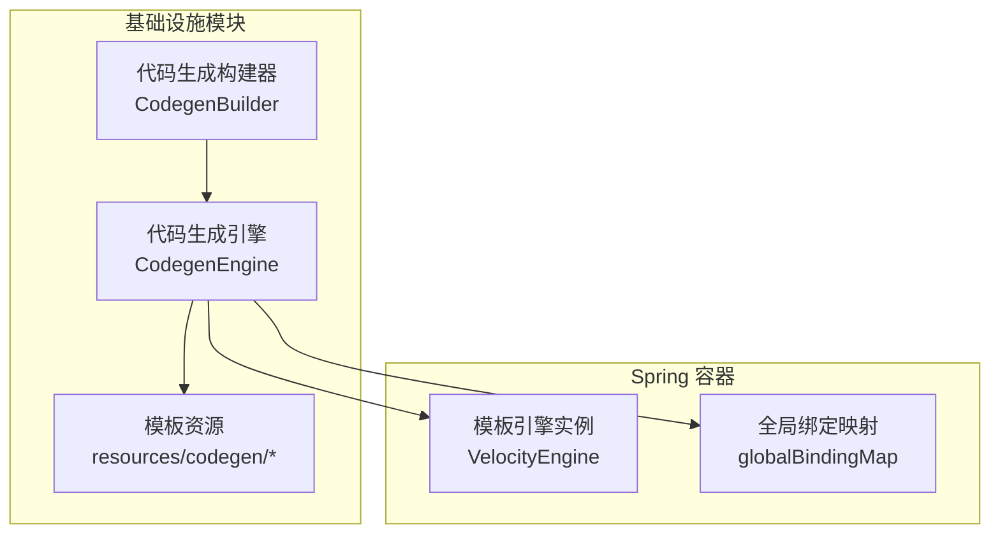
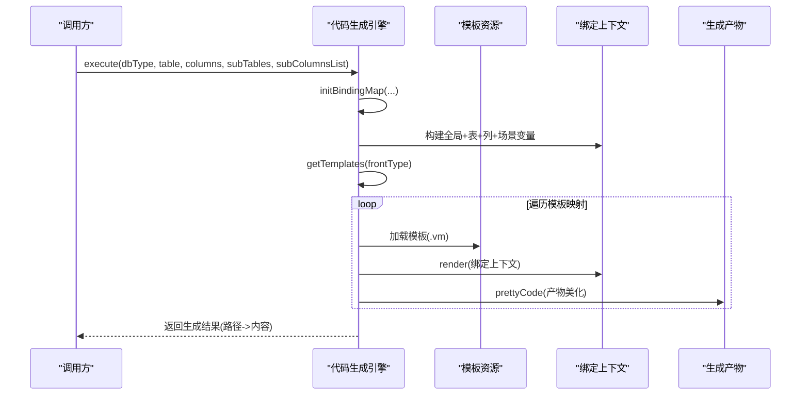
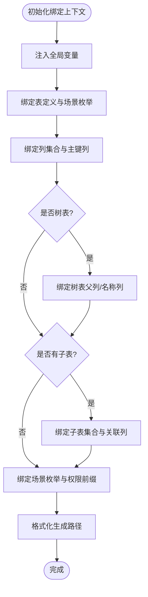
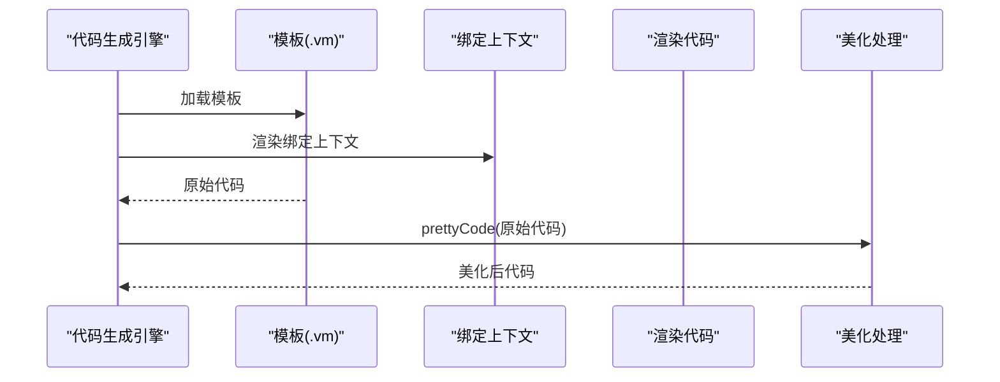
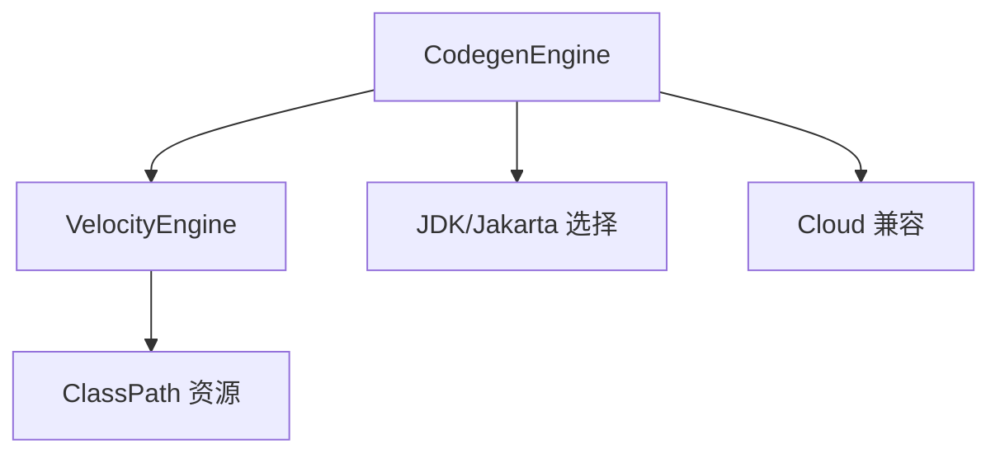

# 后端模板引擎

<cite>
**本文档引用的文件**
- [CodegenEngine.java](file://backend/yudao-module-infra/src/main/java/cn/iocoder/yudao/module/infra/service/codegen/inner/CodegenEngine.java)
- [CodegenBuilder.java](file://backend/yudao-module-infra/src/main/java/cn/iocoder/yudao/module/infra/service/codegen/inner/CodegenBuilder.java)
</cite>

## 目录
1. [简介](#简介)
2. [项目结构](#项目结构)
3. [核心组件](#核心组件)
4. [架构总览](#架构总览)
5. [详细组件分析](#详细组件分析)
6. [依赖分析](#依赖分析)
7. [性能考虑](#性能考虑)
8. [故障排查指南](#故障排查指南)
9. [结论](#结论)
10. [附录](#附录)

## 简介
本文件系统化阐述基于 Velocity 的后端模板引擎架构与实现，重点覆盖：
- 模板文件组织结构与路径映射规则
- 变量替换机制与上下文绑定策略
- 渲染流程与代码生成管线
- Spring Boot 后端模板库的分层结构（控制器、服务、数据访问层、视图组件模板）
- 模板变量系统（业务表字段映射、权限控制变量、场景化变量）
- 模板开发指南（新建模板、变量定义、渲染测试）
- 扩展机制与自定义模板开发最佳实践

## 项目结构
模板引擎位于基础设施模块的代码生成子系统中，采用 Velocity 作为底层模板引擎，通过 Hutool 的模板抽象封装实现跨模板引擎的可移植性。

**图表来源**
- [CodegenEngine.java:60-275](file://backend/yudao-module-infra/src/main/java/cn/iocoder/yudao/module/infra/service/codegen/inner/CodegenEngine.java#L60-L275)
- [CodegenBuilder.java:30-103](file://backend/yudao-module-infra/src/main/java/cn/iocoder/yudao/module/infra/service/codegen/inner/CodegenBuilder.java#L30-L103)

**章节来源**
- [CodegenEngine.java:69-97](file://backend/yudao-module-infra/src/main/java/cn/iocoder/yudao/module/infra/service/codegen/inner/CodegenEngine.java#L69-L97)
- [CodegenEngine.java:106-232](file://backend/yudao-module-infra/src/main/java/cn/iocoder/yudao/module/infra/service/codegen/inner/CodegenEngine.java#L106-L232)

## 核心组件
- 代码生成引擎（CodegenEngine）
  - 负责模板加载、上下文绑定、渲染与产物格式化
  - 维护后端模板与前端模板的路径映射表
  - 提供全局变量注入与场景化变量绑定
- 代码生成构建器（CodegenBuilder）
  - 将数据库表/列元数据转换为模板上下文可用的领域对象
  - 初始化字段的 CRUD/UI/示例等默认行为

**章节来源**
- [CodegenEngine.java:60-61](file://backend/yudao-module-infra/src/main/java/cn/iocoder/yudao/module/infra/service/codegen/inner/CodegenEngine.java#L60-L61)
- [CodegenBuilder.java:30-31](file://backend/yudao-module-infra/src/main/java/cn/iocoder/yudao/module/infra/service/codegen/inner/CodegenBuilder.java#L30-L31)

## 架构总览
模板引擎采用“模板路径映射 + 上下文绑定 + 渲染”的三层架构：
- 模板路径映射：后端模板与前端模板分别维护映射表，决定生成产物的物理路径
- 上下文绑定：全局变量 + 表/列元数据 + 场景化变量 + 权限前缀等
- 渲染与格式化：Velocity 渲染 + 产物美化（如 Vue 代码格式化）

**图表来源**
- [CodegenEngine.java:321-351](file://backend/yudao-module-infra/src/main/java/cn/iocoder/yudao/module/infra/service/codegen/inner/CodegenEngine.java#L321-L351)
- [CodegenEngine.java:353-360](file://backend/yudao-module-infra/src/main/java/cn/iocoder/yudao/module/infra/service/codegen/inner/CodegenEngine.java#L353-L360)

## 详细组件分析

### 模板文件组织结构
- 后端模板（Java 代码生成）
  - 控制器 VO：pageReqVO、listReqVO、respVO、saveReqVO
  - 控制器：controller
  - 数据访问层：DO、Mapper、Mapper XML
  - 服务层：Service、ServiceImpl
  - 测试：serviceTest
  - 枚举：ErrorCodeConstants
  - SQL：sql.vm、h2.vm
- 前端模板（多 UI 框架适配）
  - Vue2 Element UI
  - Vue3 Element Plus（含 Admin UniApp、Vben 系列多种变体）
- 路径映射规则
  - 后端模板路径统一前缀为 codegen/java/*
  - 前端模板路径统一前缀为 codegen/vue*/*
  - 生成产物路径支持占位符替换（模块名、业务名、类名、场景枚举等）

**章节来源**
- [CodegenEngine.java:69-97](file://backend/yudao-module-infra/src/main/java/cn/iocoder/yudao/module/infra/service/codegen/inner/CodegenEngine.java#L69-L97)
- [CodegenEngine.java:106-232](file://backend/yudao-module-infra/src/main/java/cn/iocoder/yudao/module/infra/service/codegen/inner/CodegenEngine.java#L106-L232)
- [CodegenEngine.java:577-613](file://backend/yudao-module-infra/src/main/java/cn/iocoder/yudao/module/infra/service/codegen/inner/CodegenEngine.java#L577-L613)

### 变量替换机制与上下文绑定
- 全局变量
  - 基础包名、框架包名、Jakarta/Javax 注解包选择、VO 类型开关、删除批量开关
  - 常用类名（CommonResult、PageResult、BaseDO、LambdaQueryWrapperX、BaseMapperX 等）
  - 工具类（ServiceExceptionUtil、DateUtils、ExcelUtils、LocalDateTimeUtils、ObjectUtils、DictConvert、ApiAccessLog、OperateTypeEnum、BeanUtils、CollectionUtils）
- 表/列上下文
  - 表定义（模块名、业务名、类名、注释、模板类型等）
  - 列集合（字段名、Java 类型、是否主键、是否可创建/更新/列表等）
  - 主键列、树表父列/名称列、主子表关联列等特殊字段
- 场景化变量
  - 场景枚举（prefixClass、basePackage），用于生成类名前缀与包路径
- 权限前缀
  - permissionPrefix = moduleName:businessName-with-hyphen
- 路径格式化
  - 通过 formatFilePath 对生成路径中的占位符进行替换（${basePackage}、${table.*}、${sceneEnum.*} 等）

**图表来源**
- [CodegenEngine.java:430-518](file://backend/yudao-module-infra/src/main/java/cn/iocoder/yudao/module/infra/service/codegen/inner/CodegenEngine.java#L430-L518)
- [CodegenEngine.java:546-575](file://backend/yudao-module-infra/src/main/java/cn/iocoder/yudao/module/infra/service/codegen/inner/CodegenEngine.java#L546-L575)

**章节来源**
- [CodegenEngine.java:277-309](file://backend/yudao-module-infra/src/main/java/cn/iocoder/yudao/module/infra/service/codegen/inner/CodegenEngine.java#L277-L309)
- [CodegenEngine.java:430-518](file://backend/yudao-module-infra/src/main/java/cn/iocoder/yudao/module/infra/service/codegen/inner/CodegenEngine.java#L430-L518)

### 渲染流程与代码生成
- 模板加载
  - 通过 Hutool VelocityEngine 从 ClassPath 加载 .vm 模板
- 渲染执行
  - 使用绑定上下文渲染模板，得到原始代码内容
- 产物美化
  - 针对前端模板（Vue 等）进行格式化处理（去除多余逗号、修正 refs、清理未使用的字典相关代码等）
- 结果收集
  - 以生成路径为键、渲染内容为值，返回给调用方

**图表来源**
- [CodegenEngine.java:353-360](file://backend/yudao-module-infra/src/main/java/cn/iocoder/yudao/module/infra/service/codegen/inner/CodegenEngine.java#L353-L360)
- [CodegenEngine.java:401-428](file://backend/yudao-module-infra/src/main/java/cn/iocoder/yudao/module/infra/service/codegen/inner/CodegenEngine.java#L401-L428)

**章节来源**
- [CodegenEngine.java:353-360](file://backend/yudao-module-infra/src/main/java/cn/iocoder/yudao/module/infra/service/codegen/inner/CodegenEngine.java#L353-L360)
- [CodegenEngine.java:401-428](file://backend/yudao-module-infra/src/main/java/cn/iocoder/yudao/module/infra/service/codegen/inner/CodegenEngine.java#L401-L428)

### Spring Boot 后端模板库结构
- 控制器（Controller）
  - 生成路径：server/main 下的 controller/${sceneEnum.basePackage}/${table.businessName}/${sceneEnum.prefixClass}${table.className}Controller.java
- 控制器 VO（VO）
  - PageReqVO、ListReqVO、RespVO、SaveReqVO
  - 生成路径：server/main 下的 controller/${sceneEnum.basePackage}/${table.businessName}/vo/${sceneEnum.prefixClass}${table.className}*.java
- 数据访问层（DAL）
  - DO：dal/dataobject/${table.businessName}/${table.className}DO.java
  - Mapper：dal/mysql/${table.businessName}/${table.className}Mapper.java
  - Mapper XML：src/main/resources/mapper/${table.businessName}/${table.className}Mapper.xml
- 服务层（Service）
  - Service 接口：service/${table.businessName}/${table.className}Service.java
  - Service 实现：service/${table.businessName}/${table.className}ServiceImpl.java
- 测试（Test）
  - 生成路径：server/test 下的 service/${table.businessName}/${table.className}ServiceImplTest.java
- 枚举（Enums）
  - ErrorCodeConstants_*：yudao-module-${table.moduleName}-api/main 下的 enums/ErrorCodeConstants_手动操作.java
- SQL
  - sql.sql、h2.sql：sql/ 目录

**章节来源**
- [CodegenEngine.java:69-97](file://backend/yudao-module-infra/src/main/java/cn/iocoder/yudao/module/infra/service/codegen/inner/CodegenEngine.java#L69-L97)
- [CodegenEngine.java:581-613](file://backend/yudao-module-infra/src/main/java/cn/iocoder/yudao/module/infra/service/codegen/inner/CodegenEngine.java#L581-L613)

### 模板变量系统详解
- 业务表字段映射
  - 表：moduleName、businessName、className、classComment、templateType 等
  - 列：javaField、javaType、primaryKey、createOperation、updateOperation、listOperation、listOperationCondition、listOperationResult、htmlType、example 等
  - CodegenBuilder 负责默认值推断（如 CRUD 开关、UI 类型、示例值）
- 权限控制变量
  - permissionPrefix：用于生成权限字符串，格式为 moduleName:businessName-with-hyphen
- 场景化变量
  - sceneEnum：包含 prefixClass、basePackage，影响生成类名前缀与包路径
- 主子表与树表变量
  - 主子表：subTables、subColumnsList、subPrimaryColumns、subJoinColumns、subSimpleClassNames 等
  - 树表：treeParentColumn、treeNameColumn 及其下划线/短横形式

**章节来源**
- [CodegenEngine.java:430-518](file://backend/yudao-module-infra/src/main/java/cn/iocoder/yudao/module/infra/service/codegen/inner/CodegenEngine.java#L430-L518)
- [CodegenBuilder.java:99-141](file://backend/yudao-module-infra/src/main/java/cn/iocoder/yudao/module/infra/service/codegen/inner/CodegenBuilder.java#L99-L141)

### 模板开发指南
- 新模板创建
  - 在 resources/codegen/java/ 或 resources/codegen/vue*/ 下新增 .vm 模板文件
  - 在相应映射表中注册模板路径与生成路径映射
- 变量定义
  - 在 initGlobalBindingMap 中注入全局变量
  - 在 initBindingMap 中按需扩展表/列/场景变量
- 渲染测试
  - 通过 execute(dbType, table, columns, subTables, subColumnsList) 触发渲染
  - 校验生成路径与内容是否符合预期
- 前端模板美化
  - 在 prettyCode 中补充针对特定 UI 框架的格式化规则

**章节来源**
- [CodegenEngine.java:277-309](file://backend/yudao-module-infra/src/main/java/cn/iocoder/yudao/module/infra/service/codegen/inner/CodegenEngine.java#L277-L309)
- [CodegenEngine.java:401-428](file://backend/yudao-module-infra/src/main/java/cn/iocoder/yudao/module/infra/service/codegen/inner/CodegenEngine.java#L401-L428)

### 扩展机制与最佳实践
- 模板扩展
  - 新增模板类型：在映射表中添加新的模板路径与生成路径
  - 新增场景：在场景枚举中定义 prefixClass/basePackage
- 最佳实践
  - 模板尽量简洁，复杂格式化逻辑集中在 prettyCode
  - 使用占位符进行路径与类名生成，避免硬编码
  - 严格区分后端模板与前端模板的映射表，避免路径冲突
  - 为每个新模板编写最小化测试用例，验证渲染结果

**章节来源**
- [CodegenEngine.java:520-543](file://backend/yudao-module-infra/src/main/java/cn/iocoder/yudao/module/infra/service/codegen/inner/CodegenEngine.java#L520-L543)
- [CodegenEngine.java:401-428](file://backend/yudao-module-infra/src/main/java/cn/iocoder/yudao/module/infra/service/codegen/inner/CodegenEngine.java#L401-L428)

## 依赖分析
- 模板引擎依赖
  - Hutool VelocityEngine：提供 Velocity 模板加载与渲染能力
  - ClassPath 资源模式：模板从 resources/codegen/* 加载
- 运行时依赖
  - Jakarta/Javax 注解包选择：根据运行环境自动切换
  - Spring Cloud 兼容：根据是否启用 Cloud 决定生成路径中是否包含 api/server 模块

**图表来源**
- [CodegenEngine.java:264-275](file://backend/yudao-module-infra/src/main/java/cn/iocoder/yudao/module/infra/service/codegen/inner/CodegenEngine.java#L264-L275)

**章节来源**
- [CodegenEngine.java:264-275](file://backend/yudao-module-infra/src/main/java/cn/iocoder/yudao/module/infra/service/codegen/inner/CodegenEngine.java#L264-L275)

## 性能考虑
- 模板数量与渲染次数
  - 生成流程会遍历模板映射表，模板越多，渲染次数越多
  - 建议按需启用测试模板与 VO 模板，减少不必要的渲染
- 路径格式化与美化
  - prettyCode 中的字符串替换与正则处理可能带来额外开销
  - 建议仅对必要模板进行美化，或优化正则表达式
- 资源加载
  - 模板从 ClassPath 加载，建议保持模板体积精简，避免过多静态资源

## 故障排查指南
- 模板路径错误
  - 症状：生成为空或抛出模板加载异常
  - 排查：确认模板路径是否存在于映射表，资源路径是否正确
- 变量缺失
  - 症状：渲染时报错或生成代码不完整
  - 排查：检查 initBindingMap 是否正确注入所需变量，尤其是场景化变量与权限前缀
- 前端模板格式问题
  - 症状：生成的 Vue 代码格式不符合规范
  - 排查：检查 prettyCode 中的格式化规则是否覆盖该模板类型
- 路径替换异常
  - 症状：生成路径包含未解析的占位符
  - 排查：检查 formatFilePath 中的占位符是否在绑定上下文中提供

**章节来源**
- [CodegenEngine.java:546-575](file://backend/yudao-module-infra/src/main/java/cn/iocoder/yudao/module/infra/service/codegen/inner/CodegenEngine.java#L546-L575)
- [CodegenEngine.java:401-428](file://backend/yudao-module-infra/src/main/java/cn/iocoder/yudao/module/infra/service/codegen/inner/CodegenEngine.java#L401-L428)

## 结论
该模板引擎以 Velocity 为核心，结合 Hutool 的模板抽象，实现了高度可配置的代码生成流水线。通过清晰的模板路径映射、完善的上下文绑定与产物美化机制，能够高效生成后端 Java 代码与前端界面模板。建议在实际使用中遵循占位符驱动的路径生成、最小化模板复杂度与按需启用模板的原则，确保生成质量与性能的平衡。

## 附录
- 模板路径与生成产物对照
  - 后端模板：resources/codegen/java/* → server/main 下的各层代码
  - 前端模板：resources/codegen/vue*/  → yudao-ui-* 下的页面与 API
- 常用变量速查
  - 全局：basePackage、baseFrameworkPackage、jakartaPackage、voType、deleteBatchEnable
  - 表：table、columns、primaryColumn、sceneEnum、simpleClassName、classNameVar、simpleClassName_strikeCase、permissionPrefix
  - 树表：treeParentColumn、treeNameColumn
  - 主子表：subTables、subColumnsList、subPrimaryColumns、subJoinColumns、subSimpleClassNames、subClassNameVars、subSimpleClassName_strikeCases