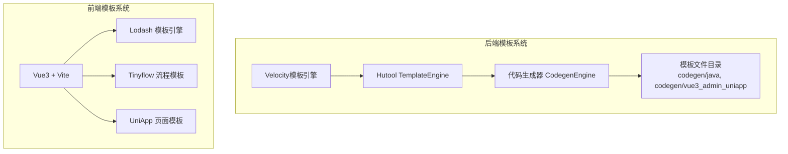
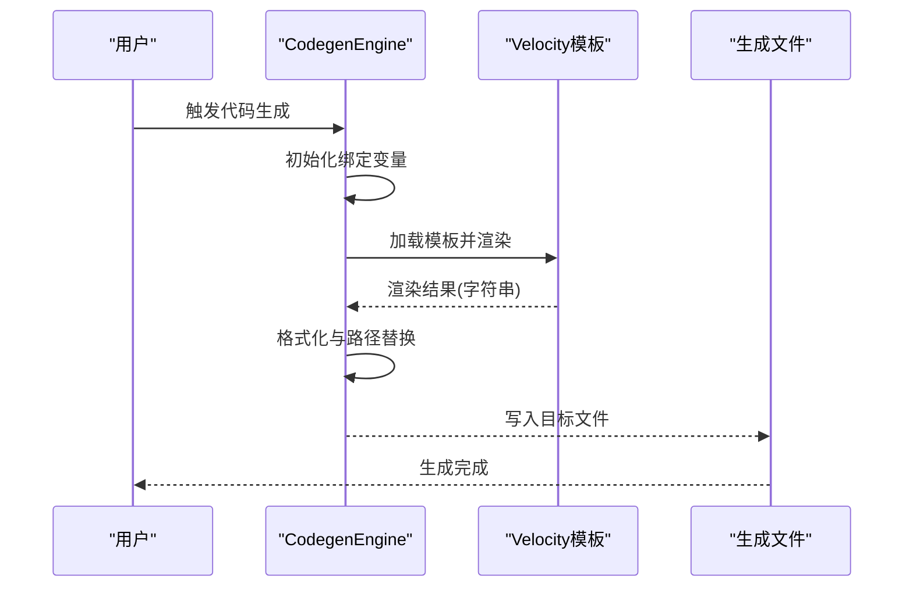
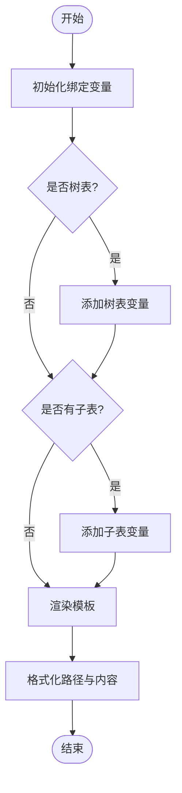
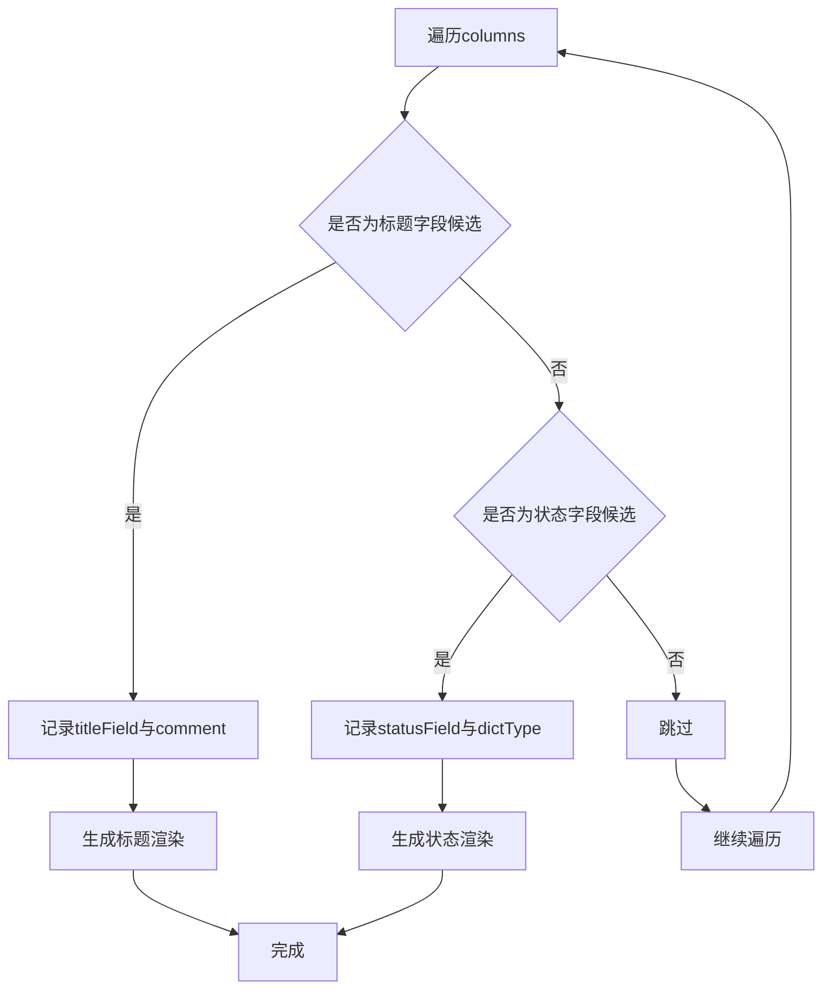
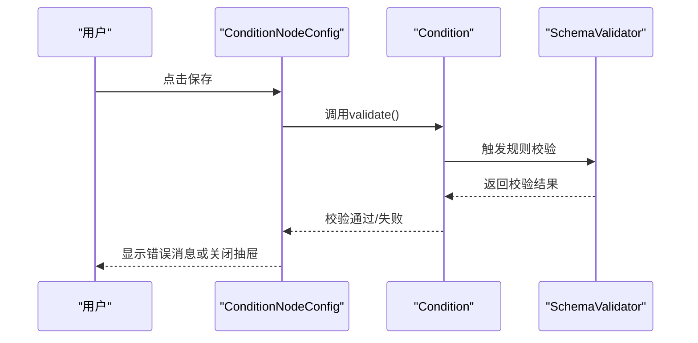
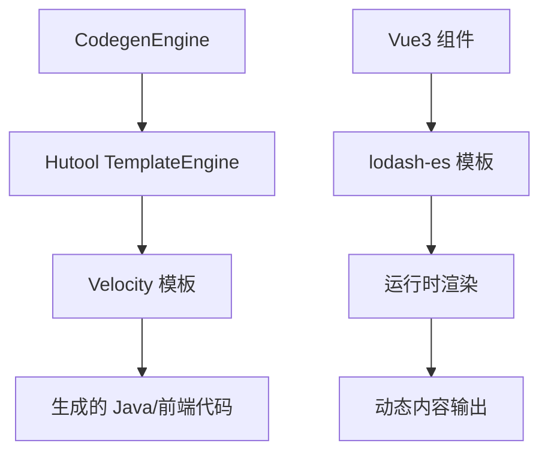

# 模板开发指南

<cite>
**本文档引用的文件**
- [CodegenEngine.java](file://backend/yudao-module-infra/src/main/java/cn/iocoder/yudao/module/infra/service/codegen/inner/CodegenEngine.java)
- [controller.vm](file://backend/yudao-module-infra/src/main/resources/codegen/java/controller/controller.vm)
- [index.vue.vm](file://backend/yudao-module-infra/src/main/resources/codegen/vue3_admin_uniapp/views/index.vue.vm)
- [template.js](file://frontend/mall-uniapp/unpackage/dist/cache/.vite/deps/lodash-es.js)
- [ConditionNodeConfig.vue](file://frontend/admin-vue3/src/components/SimpleProcessDesignerV2/src/nodes-config/ConditionNodeConfig.vue)
- [validate.js](file://frontend/mall-uniapp/uni_modules/uni-forms/components/uni-forms/validate.js)
- [decorate.vue](file://frontend/admin-vue3/src/views/mall/promotion/diy/template/decorate.vue)
- [CodegenEngine.java](file://backend/yudao-module-infra/src/main/java/cn/iocoder/yudao/module/infra/service/codegen/inner/CodegenEngine.java)
- [index.js](file://frontend/admin-vue3/src/components/Tinyflow/ui/index.js)
</cite>

## 目录
1. [简介](#简介)
2. [项目结构](#项目结构)
3. [核心组件](#核心组件)
4. [架构概览](#架构概览)
5. [详细组件分析](#详细组件分析)
6. [依赖分析](#依赖分析)
7. [性能考虑](#性能考虑)
8. [故障排除指南](#故障排除指南)
9. [结论](#结论)
10. [附录](#附录)

## 简介

本指南面向AgenticCPS项目中的模板开发需求，涵盖从模板设计原则、命名约定到文件组织规范的完整流程。文档重点解析后端基于Velocity/Hutool的代码生成模板与前端基于Vue3/Vite的动态模板系统，详细说明模板变量定义、占位符使用、条件渲染机制、模板验证规则、错误处理与调试方法，并提供模板开发最佳实践，包括性能优化、代码复用与维护策略，以及自定义模板开发和模板库扩展的完整指南。

## 项目结构

AgenticCPS项目包含两类主要模板系统：

- **后端代码生成模板**：位于`backend/yudao-module-infra/src/main/resources/codegen/`，使用Velocity模板引擎，通过Hutool封装的TemplateEngine进行渲染，生成Java后端代码与SQL脚本。
- **前端动态模板**：位于`frontend/`目录，包含Vue3组件、UniApp页面模板、Tinyflow流程模板等，支持条件渲染、表单校验与动态内容生成。

**图表来源**
- [CodegenEngine.java:258-275](file://backend/yudao-module-infra/src/main/java/cn/iocoder/yudao/module/infra/service/codegen/inner/CodegenEngine.java#L258-L275)
- [index.vue.vm:1-212](file://backend/yudao-module-infra/src/main/resources/codegen/vue3_admin_uniapp/views/index.vue.vm#L1-L212)
- [template.js:6496-6604](file://frontend/mall-uniapp/unpackage/dist/cache/.vite/deps/lodash-es.js#L6496-L6604)

**章节来源**
- [CodegenEngine.java:1-100](file://backend/yudao-module-infra/src/main/java/cn/iocoder/yudao/module/infra/service/codegen/inner/CodegenEngine.java#L1-L100)
- [index.vue.vm:1-50](file://backend/yudao-module-infra/src/main/resources/codegen/vue3_admin_uniapp/views/index.vue.vm#L1-L50)

## 核心组件

### 后端模板引擎与代码生成器

- **模板引擎选择**：使用Hutool封装的TemplateEngine，底层基于Velocity，支持资源模式为CLASSPATH，便于在Spring Boot应用中直接加载模板资源。
- **全局绑定变量**：初始化阶段注入基础包名、框架包名、Jakarta包兼容性、VO类型、分页开关等全局变量，确保模板渲染上下文一致。
- **模板映射与生成**：通过SERVER_TEMPLATES与FRONT_TEMPLATES映射，将模板路径与目标生成路径关联，支持不同前端UI框架（Element UI、Element Plus、Vben、UniApp等）的模板适配。
- **特殊模板处理**：支持主子表专属逻辑、树表专属逻辑、条件表达式与规则组渲染、Pretty格式化等，确保生成代码质量与可读性。

**章节来源**
- [CodegenEngine.java:69-97](file://backend/yudao-module-infra/src/main/java/cn/iocoder/yudao/module/infra/service/codegen/inner/CodegenEngine.java#L69-L97)
- [CodegenEngine.java:106-232](file://backend/yudao-module-infra/src/main/java/cn/iocoder/yudao/module/infra/service/codegen/inner/CodegenEngine.java#L106-L232)
- [CodegenEngine.java:277-309](file://backend/yudao-module-infra/src/main/java/cn/iocoder/yudao/module/infra/service/codegen/inner/CodegenEngine.java#L277-L309)
- [CodegenEngine.java:353-428](file://backend/yudao-module-infra/src/main/java/cn/iocoder/yudao/module/infra/service/codegen/inner/CodegenEngine.java#L353-L428)

### 前端模板系统

- **Vue3模板渲染**：前端模板以.vm结尾，结合Velocity语法实现动态渲染，如根据数据库字段自动选择列表展示字段、字典类型渲染、日期时间格式化等。
- **Lodash模板引擎**：前端运行时使用lodash-es的template函数，支持escape、evaluate、interpolate等模板设置，适用于运行时字符串模板编译与渲染。
- **Tinyflow模板**：基于轻量UI框架的模板节点管理，支持条件节点的增删改查、默认流分支控制、模板节点生命周期管理等。

**章节来源**
- [index.vue.vm:22-69](file://backend/yudao-module-infra/src/main/resources/codegen/vue3_admin_uniapp/views/index.vue.vm#L22-L69)
- [template.js:6496-6604](file://frontend/mall-uniapp/unpackage/dist/cache/.vite/deps/lodash-es.js#L6496-L6604)
- [index.js:924-948](file://frontend/admin-vue3/src/components/Tinyflow/ui/index.js#L924-L948)

## 架构概览

后端模板系统通过CodegenEngine协调模板加载、变量绑定与渲染输出，最终生成Java代码与前端页面模板。前端模板系统则通过Vue3组件与运行时模板引擎实现动态内容渲染与交互。

**图表来源**
- [CodegenEngine.java:321-351](file://backend/yudao-module-infra/src/main/java/cn/iocoder/yudao/module/infra/service/codegen/inner/CodegenEngine.java#L321-L351)
- [CodegenEngine.java:353-360](file://backend/yudao-module-infra/src/main/java/cn/iocoder/yudao/module/infra/service/codegen/inner/CodegenEngine.java#L353-L360)

## 详细组件分析

### 后端模板变量与占位符使用

- **基础变量**：包括basePackage、sceneEnum、table、columns、primaryColumn、permissionPrefix等，用于生成包名、类名、权限前缀、字段访问等。
- **特殊场景变量**：
  - 树表：treeParentColumn、treeNameColumn及其下划线命名形式，用于树形结构的父子关系与显示字段。
  - 主子表：subTables、subColumnsList、subPrimaryColumns、subJoinColumns、subJoinColumn_strikeCases、subSimpleClassNames、subClassNameVars、subSimpleClassName_strikeCases等，支持多子表的循环渲染与差异化处理。
  - VO类型：saveReqVOClass、updateReqVOClass、respVOClass、saveReqVOVar、updateReqVOVar等，根据配置决定生成VO还是DO。
- **占位符替换**：通过formatFilePath方法对模板中的${...}占位符进行替换，确保生成路径与业务模块、业务名、类名等保持一致。

**图表来源**
- [CodegenEngine.java:430-518](file://backend/yudao-module-infra/src/main/java/cn/iocoder/yudao/module/infra/service/codegen/inner/CodegenEngine.java#L430-L518)
- [CodegenEngine.java:545-575](file://backend/yudao-module-infra/src/main/java/cn/iocoder/yudao/module/infra/service/codegen/inner/CodegenEngine.java#L545-L575)

**章节来源**
- [CodegenEngine.java:430-518](file://backend/yudao-module-infra/src/main/java/cn/iocoder/yudao/module/infra/service/codegen/inner/CodegenEngine.java#L430-L518)
- [CodegenEngine.java:545-575](file://backend/yudao-module-infra/src/main/java/cn/iocoder/yudao/module/infra/service/codegen/inner/CodegenEngine.java#L545-L575)

### 前端模板变量与条件渲染

- **列表模板变量**：通过Velocity语法遍历columns，自动选择标题字段(titleField)与状态字段(statusField)，并根据字段类型渲染字典标签或日期时间格式。
- **条件渲染**：根据字段的listOperationResult、primaryKey、dictType、javaType等属性，动态生成列表项的展示逻辑，支持字典类型、日期时间、普通文本等多场景渲染。
- **权限控制**：通过permissionPrefix与hasAccessByCodes实现按钮级别的权限控制，确保只有具备相应权限的用户才能看到操作按钮。

**图表来源**
- [index.vue.vm:22-69](file://backend/yudao-module-infra/src/main/resources/codegen/vue3_admin_uniapp/views/index.vue.vm#L22-L69)

**章节来源**
- [index.vue.vm:22-69](file://backend/yudao-module-infra/src/main/resources/codegen/vue3_admin_uniapp/views/index.vue.vm#L22-L69)

### 模板验证规则与错误处理

- **表单校验**：前端使用uni-forms组件的SchemaValidator与RuleValidator，支持required、range、rangeNumber、rangeLength、pattern、format、arrayTypeFormat等多种校验规则，并提供统一的消息格式化与异常捕获。
- **条件节点配置校验**：前端流程设计器中的ConditionNodeConfig组件，通过ref调用子组件validate方法进行表单校验，确保条件表达式与规则组的有效性。
- **模板编译错误处理**：lodash-es模板引擎在编译失败时抛出异常，需在调用处进行try-catch处理，避免运行时崩溃。

**图表来源**
- [ConditionNodeConfig.vue:154-185](file://frontend/admin-vue3/src/components/SimpleProcessDesignerV2/src/nodes-config/ConditionNodeConfig.vue#L154-L185)
- [validate.js:165-203](file://frontend/mall-uniapp/uni_modules/uni-forms/components/uni-forms/validate.js#L165-L203)

**章节来源**
- [validate.js:165-203](file://frontend/mall-uniapp/uni_modules/uni-forms/components/uni-forms/validate.js#L165-L203)
- [ConditionNodeConfig.vue:154-185](file://frontend/admin-vue3/src/components/SimpleProcessDesignerV2/src/nodes-config/ConditionNodeConfig.vue#L154-L185)

### 自定义模板开发与模板库扩展

- **后端自定义模板**：在`codegen/java/`或`codegen/vue*/`目录下新增.vm模板文件，遵循现有命名约定与占位符规范，确保与CodegenEngine的模板映射一致。
- **前端自定义模板**：在Vue3组件中使用`<template>`与`<script setup>`语法，结合lodash模板引擎进行运行时渲染，注意变量命名与作用域隔离。
- **模板库扩展**：通过在decorate.vue中维护模板库libs与PAGE_LIBS，实现模板组件的动态加载与切换，支持多页面模板的组合与复用。

**章节来源**
- [decorate.vue:80-112](file://frontend/admin-vue3/src/views/mall/promotion/diy/template/decorate.vue#L80-L112)

## 依赖分析

后端模板系统依赖Hutool的TemplateEngine与Velocity，前端模板系统依赖Vue3与lodash-es模板引擎。两者均通过占位符与变量绑定实现模板渲染，但运行时环境与渲染时机存在差异。

**图表来源**
- [CodegenEngine.java:258-275](file://backend/yudao-module-infra/src/main/java/cn/iocoder/yudao/module/infra/service/codegen/inner/CodegenEngine.java#L258-L275)
- [template.js:6496-6604](file://frontend/mall-uniapp/unpackage/dist/cache/.vite/deps/lodash-es.js#L6496-L6604)

**章节来源**
- [CodegenEngine.java:258-275](file://backend/yudao-module-infra/src/main/java/cn/iocoder/yudao/module/infra/service/codegen/inner/CodegenEngine.java#L258-L275)
- [template.js:6496-6604](file://frontend/mall-uniapp/unpackage/dist/cache/.vite/deps/lodash-es.js#L6496-L6604)

## 性能考虑

- **模板渲染性能**：后端模板渲染在服务端执行，建议减少复杂计算逻辑，将静态常量与路径替换提前完成，避免在模板中进行大量循环与条件判断。
- **前端模板渲染性能**：运行时模板编译与渲染应在组件生命周期内合理安排，避免频繁重渲染；对于高频更新的列表，建议使用虚拟滚动或分页加载。
- **代码生成优化**：通过prettyCode方法统一格式化输出，减少前端格式检查的额外开销；对重复的字典类型与日期格式化逻辑进行抽象，提升模板复用率。

## 故障排除指南

- **模板变量缺失**：检查CodegenEngine的initBindingMap方法，确认所需变量是否正确注入；核对模板中的占位符是否与绑定变量一致。
- **路径替换错误**：验证formatFilePath方法中的字符串替换逻辑，确保模块名、业务名、类名等占位符被正确替换。
- **前端模板编译错误**：在使用lodash-es模板时，确保template函数的options参数正确设置，避免非法标识符导致的编译异常。
- **表单校验失败**：检查uni-forms的SchemaValidator配置，确认规则与消息格式化是否正确；在ConditionNodeConfig中确保validate方法返回正确的布尔值。

**章节来源**
- [CodegenEngine.java:545-575](file://backend/yudao-module-infra/src/main/java/cn/iocoder/yudao/module/infra/service/codegen/inner/CodegenEngine.java#L545-L575)
- [template.js:6588-6604](file://frontend/mall-uniapp/unpackage/dist/cache/.vite/deps/lodash-es.js#L6588-L6604)
- [validate.js:165-203](file://frontend/mall-uniapp/uni_modules/uni-forms/components/uni-forms/validate.js#L165-L203)

## 结论

模板开发涉及后端代码生成与前端动态渲染两大领域。通过合理的模板设计原则、严格的命名约定与文件组织规范，结合完善的变量定义、占位符使用与条件渲染机制，可以显著提升模板的可维护性与复用性。同时，建立完善的验证规则、错误处理与调试方法，能够有效降低模板开发与集成过程中的风险。建议在实际开发中遵循本文档的最佳实践，持续优化模板性能与用户体验。

## 附录

- **模板设计原则**：保持模板简洁、变量命名清晰、占位符语义明确、条件渲染逻辑可读性强。
- **命名约定**：后端模板使用Velocity语法与驼峰命名，前端模板使用Vue3语法与下划线命名，确保跨语言一致性。
- **文件组织规范**：按功能模块划分模板目录，统一模板命名与扩展名，便于查找与维护。
- **最佳实践**：优先使用全局变量与预处理逻辑，减少模板内的复杂计算；对常用逻辑进行抽象与复用；在前后端分别建立调试与验证机制，确保模板质量。