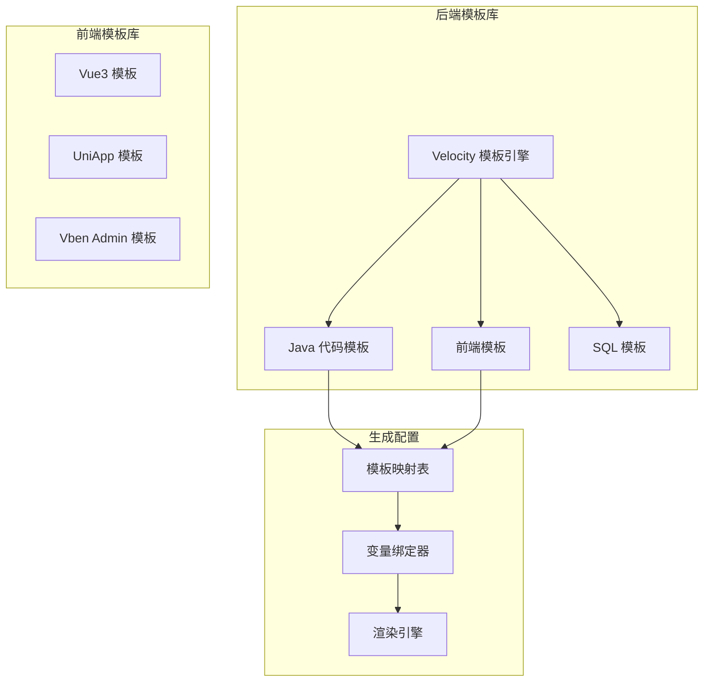
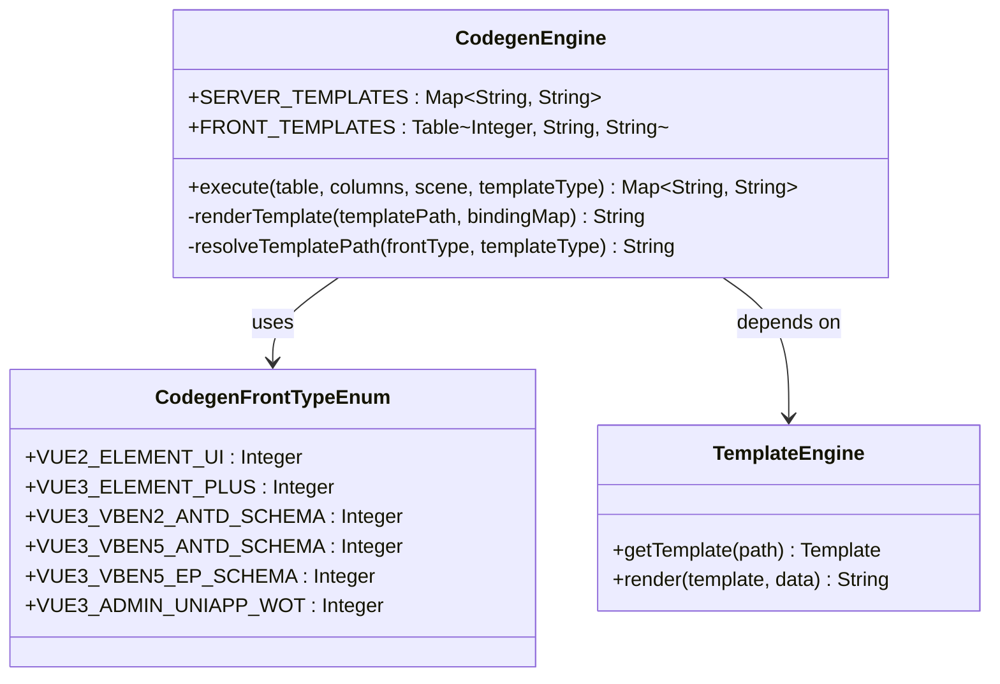
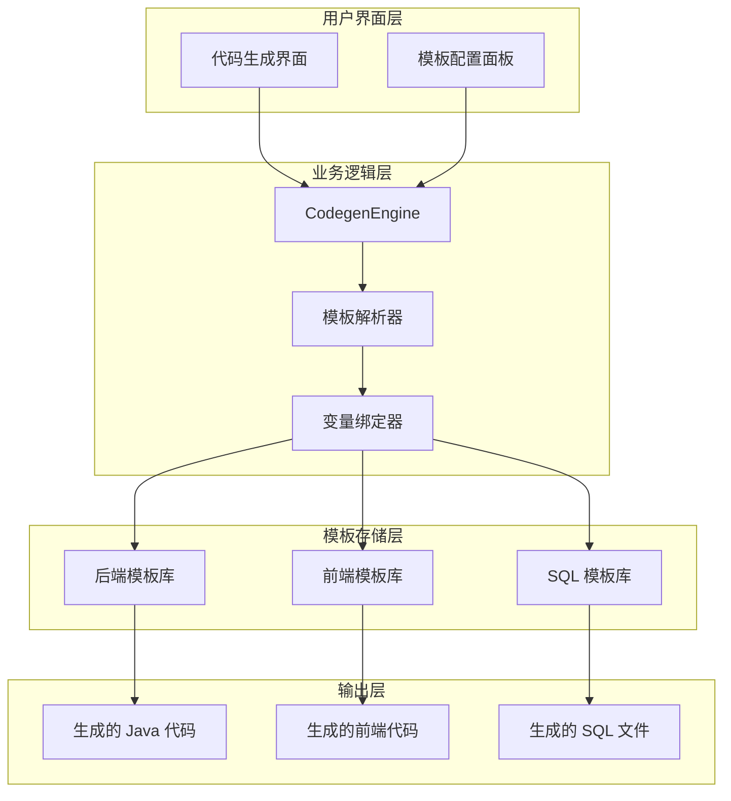
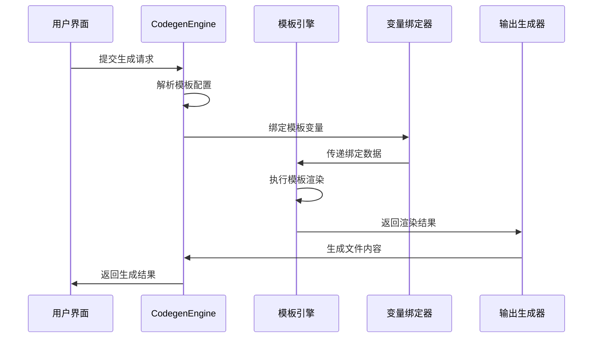
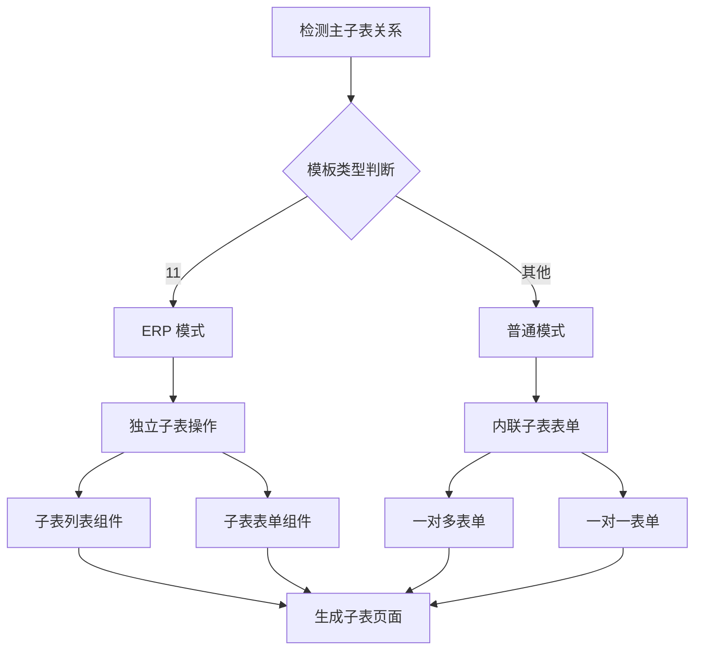
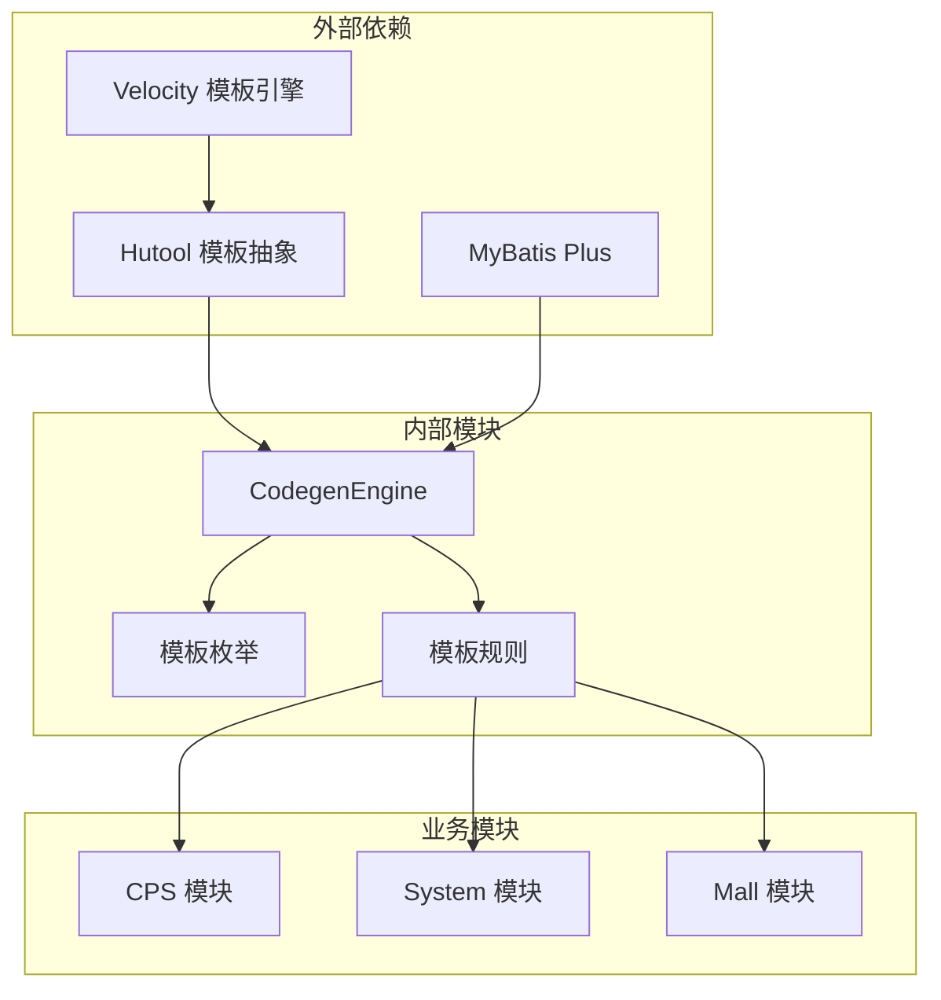

# 模板系统

<cite>
**本文档引用的文件**
- [AGENTS.md](file://AGENTS.md)
- [codegen-rules.md](file://agent_improvement/memory/codegen-rules.md)
- [CodegenEngine.java](file://backend/yudao-module-infra/src/main/java/cn/iocoder/yudao/module/infra/service/codegen/inner/CodegenEngine.java)
- [CodegenFrontTypeEnum.java](file://backend/yudao-module-infra/src/main/java/cn/iocoder/yudao/module/infra/enums/codegen/CodegenFrontTypeEnum.java)
- [index.vue.vm](file://backend/yudao-module-infra/src/main/resources/codegen/vue3/views/index.vue.vm)
- [form_sub_normal.vue.vm](file://backend/yudao-module-infra/src/main/resources/codegen/vue3/views/components/form_sub_normal.vue.vm)
- [list_sub_erp.vue.vm](file://backend/yudao-module-infra/src/main/resources/codegen/vue3/views/components/list_sub_erp.vue.vm)
- [GenerateInfoForm.vue](file://frontend/admin-vue3/src/views/infra/codegen/components/GenerateInfoForm.vue)
- [GoViewDataController.java](file://backend/yudao-module-report/src/main/java/cn/iocoder/yudao/module/report/controller/admin/goview/GoViewDataController.java)
</cite>

## 目录
1. [简介](#简介)
2. [项目结构](#项目结构)
3. [核心组件](#核心组件)
4. [架构概览](#架构概览)
5. [详细组件分析](#详细组件分析)
6. [依赖关系分析](#依赖关系分析)
7. [性能考虑](#性能考虑)
8. [故障排除指南](#故障排除指南)
9. [结论](#结论)

## 简介

模板系统是基于 Velocity 的代码生成引擎，为 AgenticCPS 提供了完整的前后端模板库。该系统支持多种前端框架（Vue3、UniApp、Vben Admin）和后端模板类型，实现了高度自动化的代码生成流程。

系统的核心特点包括：
- 基于 Velocity 模板引擎的代码生成
- 支持多种前端框架和模板类型
- 完整的 CRUD 页面生成能力
- 主子表和树表的特殊处理
- 权限控制和场景化变量支持

## 项目结构

模板系统采用模块化设计，主要分为以下几个部分：



**图表来源**
- [CodegenEngine.java:69-97](file://backend/yudao-module-infra/src/main/java/cn/iocoder/yudao/module/infra/service/codegen/inner/CodegenEngine.java#L69-L97)
- [CodegenEngine.java:106-196](file://backend/yudao-module-infra/src/main/java/cn/iocoder/yudao/module/infra/service/codegen/inner/CodegenEngine.java#L106-L196)

**章节来源**
- [AGENTS.md:183-204](file://AGENTS.md#L183-L204)
- [codegen-rules.md:5-29](file://agent_improvement/memory/codegen-rules.md#L5-L29)

## 核心组件

### 模板引擎架构

模板系统基于 Hutool 的 Template 抽象层，底层使用 Velocity 引擎实现。核心组件包括：



**图表来源**
- [CodegenEngine.java:61-61](file://backend/yudao-module-infra/src/main/java/cn/iocoder/yudao/module/infra/service/codegen/inner/CodegenEngine.java#L61-L61)
- [CodegenFrontTypeEnum.java:13-35](file://backend/yudao-module-infra/src/main/java/cn/iocoder/yudao/module/infra/enums/codegen/CodegenFrontTypeEnum.java#L13-L35)

### 模板类型系统

系统支持多种模板类型，每种类型对应不同的代码生成策略：

| 模板类型 | 类型 | 特点 | 应用场景 |
|---------|------|------|----------|
| 1 | 通用 | 标准 CRUD + 分页 | 普通业务表 |
| 2 | 树表 | 树父子关系 + 校验 | 组织架构、分类树 |
| 11 | ERP主表 | 主子表 + 独立子表操作 | 复杂业务实体 |

**章节来源**
- [codegen-rules.md:307-325](file://agent_improvement/memory/codegen-rules.md#L307-L325)
- [CodegenFrontTypeEnum.java:13-28](file://backend/yudao-module-infra/src/main/java/cn/iocoder/yudao/module/infra/enums/codegen/CodegenFrontTypeEnum.java#L13-L28)

## 架构概览

模板系统采用分层架构设计，确保了良好的可扩展性和维护性：



**图表来源**
- [CodegenEngine.java:69-97](file://backend/yudao-module-infra/src/main/java/cn/iocoder/yudao/module/infra/service/codegen/inner/CodegenEngine.java#L69-L97)
- [GenerateInfoForm.vue:1-40](file://frontend/admin-vue3/src/views/infra/codegen/components/GenerateInfoForm.vue#L1-L40)

## 详细组件分析

### 后端模板系统

后端模板系统负责生成 Java 代码，包括控制器、服务层、数据访问层和 VO 类。

#### 模板文件组织结构

```mermaid
graph LR
subgraph "后端模板目录结构"
A[controller/]
B[dal/]
C[service/]
D[test/]
E[enums/]
F[sql/]
end
subgraph "生成目标结构"
G[module-{moduleName}/]
H[controller/{sceneEnum.basePackage}/]
I[dal/dataobject/{businessName}/]
J[dal/mysql/{businessName}/]
K[service/{businessName}/]
L[enums/]
end
A --> H
B --> I
B --> J
C --> K
D --> L
E --> L
F --> L
```

**图表来源**
- [codegen-rules.md:8-29](file://agent_improvement/memory/codegen-rules.md#L8-L29)

#### 变量替换机制

后端模板使用 Velocity 语法进行变量替换，支持复杂的业务场景：

| 变量类型 | 示例 | 用途 |
|---------|------|------|
| `${table.className}` | `User` | 类名 |
| `${table.businessName}` | `user-management` | 业务名 |
| `${columns}` | `List<Column>` | 数据库列集合 |
| `${subTables}` | `List<Table>` | 子表集合 |
| `${permissionPrefix}` | `system:user` | 权限前缀 |

**章节来源**
- [codegen-rules.md:42-50](file://agent_improvement/memory/codegen-rules.md#L42-L50)
- [index.vue.vm:11-83](file://backend/yudao-module-infra/src/main/resources/codegen/vue3/views/index.vue.vm#L11-L83)

### 前端模板系统

前端模板系统支持多种框架，包括 Vue3、UniApp 和 Vben Admin。

#### Vue3 模板结构

```mermaid
graph TB
subgraph "Vue3 模板目录"
A[views/]
B[api/]
C[components/]
end
subgraph "生成目标结构"
D[src/views/{moduleName}/{businessName}/]
E[src/api/{moduleName}/{businessName}/]
F[src/views/{moduleName}/{businessName}/components/]
end
A --> D
B --> E
C --> F
```

**图表来源**
- [codegen-rules.md:329-341](file://agent_improvement/memory/codegen-rules.md#L329-L341)

#### UniApp 移动端模板

UniApp 模板专门针对移动端优化，提供了完整的移动端页面结构：

| 模板文件 | 生成路径 | 功能描述 |
|---------|----------|----------|
| `views/index.vue` | `pages-{moduleName}/{businessName}/index.vue` | 列表页 |
| `views/form/index.vue` | `pages-{moduleName}/{businessName}/form/index.vue` | 表单页 |
| `views/detail/index.vue` | `pages-{moduleName}/{businessName}/detail/index.vue` | 详情页 |
| `components/search-form.vue` | `pages-{moduleName}/{businessName}/components/search-form.vue` | 搜索组件 |

**章节来源**
- [codegen-rules.md:661-673](file://agent_improvement/memory/codegen-rules.md#L661-L673)
- [CodegenEngine.java:141-150](file://backend/yudao-module-infra/src/main/java/cn/iocoder/yudao/module/infra/service/codegen/inner/CodegenEngine.java#L141-L150)

### 渲染流程

模板渲染采用流水线处理方式，确保高效的代码生成：



**图表来源**
- [CodegenEngine.java:355-355](file://backend/yudao-module-infra/src/main/java/cn/iocoder/yudao/module/infra/service/codegen/inner/CodegenEngine.java#L355-L355)

**章节来源**
- [CodegenEngine.java:69-97](file://backend/yudao-module-infra/src/main/java/cn/iocoder/yudao/module/infra/service/codegen/inner/CodegenEngine.java#L69-L97)

### 主子表模板处理

系统提供了专门的主子表模板处理机制，支持复杂的业务场景：



**图表来源**
- [form_sub_normal.vue.vm:8-262](file://backend/yudao-module-infra/src/main/resources/codegen/vue3/views/components/form_sub_normal.vue.vm#L8-L262)
- [list_sub_erp.vue.vm:10-106](file://backend/yudao-module-infra/src/main/resources/codegen/vue3/views/components/list_sub_erp.vue.vm#L10-L106)

**章节来源**
- [form_sub_normal.vue.vm:1-360](file://backend/yudao-module-infra/src/main/resources/codegen/vue3/views/components/form_sub_normal.vue.vm#L1-L360)
- [list_sub_erp.vue.vm:1-231](file://backend/yudao-module-infra/src/main/resources/codegen/vue3/views/components/list_sub_erp.vue.vm#L1-L231)

## 依赖关系分析

模板系统具有清晰的依赖层次结构：



**图表来源**
- [CodegenEngine.java:8-10](file://backend/yudao-module-infra/src/main/java/cn/iocoder/yudao/module/infra/service/codegen/inner/CodegenEngine.java#L8-L10)
- [CodegenFrontTypeEnum.java:1-10](file://backend/yudao-module-infra/src/main/java/cn/iocoder/yudao/module/infra/enums/codegen/CodegenFrontTypeEnum.java#L1-L10)

**章节来源**
- [AGENTS.md:68-81](file://AGENTS.md#L68-L81)
- [CodegenEngine.java:31-35](file://backend/yudao-module-infra/src/main/java/cn/iocoder/yudao/module/infra/service/codegen/inner/CodegenEngine.java#L31-L35)

## 性能考虑

模板系统在设计时充分考虑了性能优化：

### 模板缓存机制
- Velocity 模板引擎内置缓存
- 避免重复解析相同模板
- 内存中缓存编译后的模板

### 并行处理
- 多模板并行渲染
- 异步文件写入
- 批量操作优化

### 内存管理
- 控制模板变量大小
- 及时释放临时资源
- 优化大数据集处理

## 故障排除指南

### 常见问题及解决方案

#### 模板渲染失败
**症状**: 生成代码出现语法错误
**原因**: 模板变量绑定错误
**解决**: 检查模板中的变量引用，确保所有必需变量都已绑定

#### 权限控制问题
**症状**: 生成的代码缺少权限注解
**原因**: 权限前缀配置错误
**解决**: 验证 `permissionPrefix` 变量的设置

#### 主子表模板异常
**症状**: 子表功能不完整
**原因**: 模板类型配置错误
**解决**: 确认 `templateType` 设置为 11 以启用 ERP 模式

**章节来源**
- [index.vue.vm:104-121](file://backend/yudao-module-infra/src/main/resources/codegen/vue3/views/index.vue.vm#L104-L121)
- [form_sub_normal.vue.vm:324-347](file://backend/yudao-module-infra/src/main/resources/codegen/vue3/views/components/form_sub_normal.vue.vm#L324-L347)

## 结论

模板系统为 AgenticCPS 提供了强大而灵活的代码生成能力。通过基于 Velocity 的模板引擎，系统实现了：

1. **高度自动化**: 减少重复性代码编写工作
2. **多框架支持**: 同时支持 Vue3、UniApp、Vben Admin 等主流前端框架
3. **场景化定制**: 针对不同业务场景提供专门的模板处理
4. **扩展性强**: 易于添加新的模板类型和前端框架支持

该系统不仅提高了开发效率，还确保了代码的一致性和质量标准。通过合理的架构设计和性能优化，模板系统能够满足大型项目的复杂需求。

未来可以考虑的功能扩展包括：
- 更多前端框架支持
- 自定义模板引擎集成
- 模板版本管理和热更新
- 模板性能监控和优化