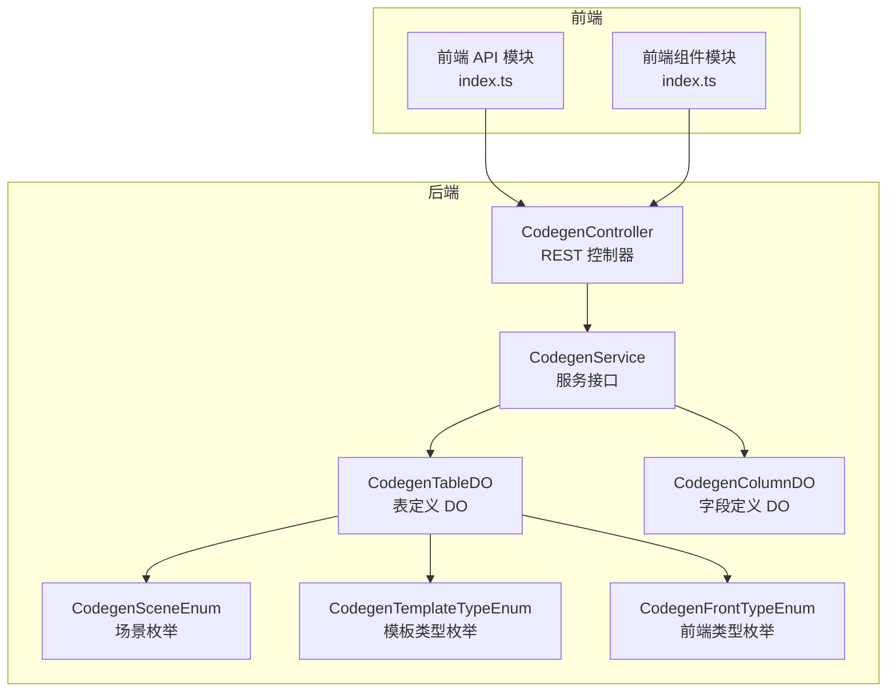
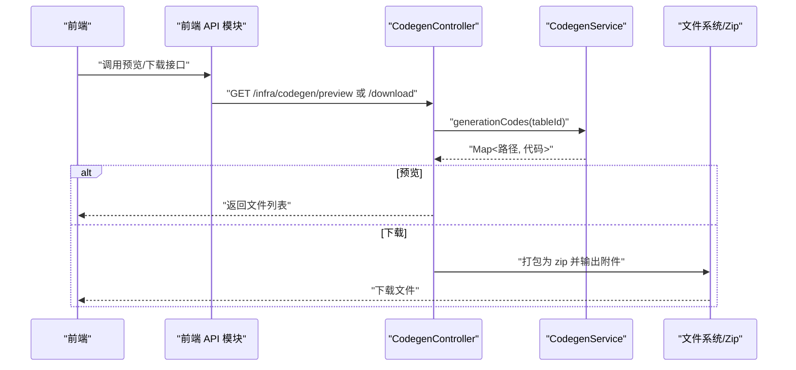
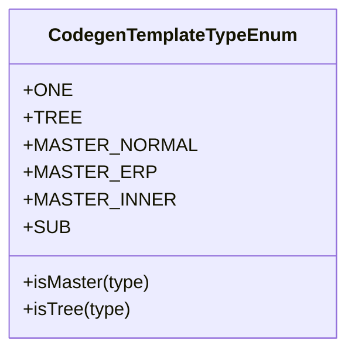
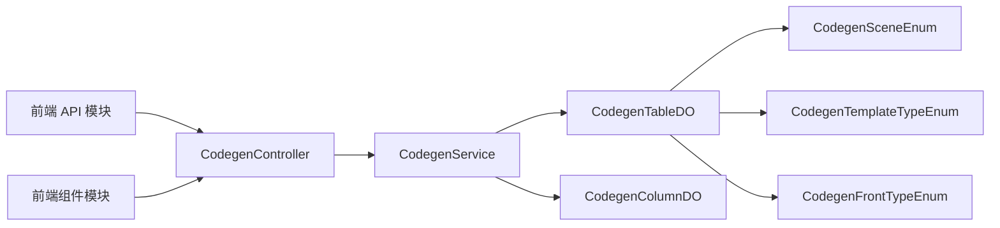
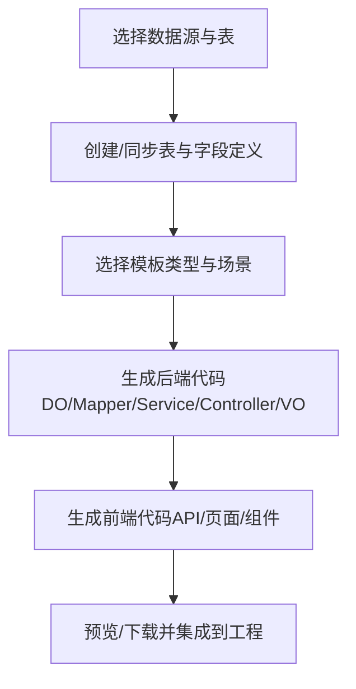

# 生成规则

<cite>
**本文引用的文件**
- [codegen-rules.md](file://agent_improvement/memory/codegen-rules.md)
- [CodegenController.java](file://backend/yudao-module-infra/src/main/java/cn/iocoder/yudao/module/infra/controller/admin/codegen/CodegenController.java)
- [CodegenService.java](file://backend/yudao-module-infra/src/main/java/cn/iocoder/yudao/module/infra/service/codegen/CodegenService.java)
- [CodegenTableDO.java](file://backend/yudao-module-infra/src/main/java/cn/iocoder/yudao/module/infra/dal/dataobject/codegen/CodegenTableDO.java)
- [CodegenColumnDO.java](file://backend/yudao-module-infra/src/main/java/cn/iocoder/yudao/module/infra/dal/dataobject/codegen/CodegenColumnDO.java)
- [CodegenSceneEnum.java](file://backend/yudao-module-infra/src/main/java/cn/iocoder/yudao/module/infra/enums/codegen/CodegenSceneEnum.java)
- [CodegenTemplateTypeEnum.java](file://backend/yudao-module-infra/src/main/java/cn/iocoder/yudao/module/infra/enums/codegen/CodegenTemplateTypeEnum.java)
- [CodegenFrontTypeEnum.java](file://backend/yudao-module-infra/src/main/java/cn/iocoder/yudao/module/infra/enums/codegen/CodegenFrontTypeEnum.java)
- [index.ts](file://frontend/admin-vue3/src/api/infra/codegen/index.ts)
- [index.ts](file://frontend/admin-vue3/src/views/infra/codegen/components/index.ts)
</cite>

## 目录
1. [简介](#简介)
2. [项目结构](#项目结构)
3. [核心组件](#核心组件)
4. [架构总览](#架构总览)
5. [详细组件分析](#详细组件分析)
6. [依赖关系分析](#依赖关系分析)
7. [性能考量](#性能考量)
8. [故障排查指南](#故障排查指南)
9. [结论](#结论)
10. [附录](#附录)

## 简介
本文件系统化阐述基于业务表结构的自动化代码生成规范，覆盖后端 Java 与前端多套模板的生成规则，明确层级结构约定、命名规范、文件组织标准，并详细说明 DO（数据对象）、Mapper、Service、Controller、VO 的生成规则与最佳实践。同时，文档化模板类型（templateType）的分类与差异，提供生成规则的配置项、自定义扩展与质量控制机制，展示从数据库表到完整业务代码的转换流程。

## 项目结构
代码生成体系由“后端控制器 + 服务层 + 数据模型 + 枚举 + 前端模板”构成，遵循统一的层级与命名约定，确保生成代码的一致性与可维护性。

**图表来源**
- [CodegenController.java:1-161](file://backend/yudao-module-infra/src/main/java/cn/iocoder/yudao/module/infra/controller/admin/codegen/CodegenController.java#L1-L161)
- [CodegenService.java:1-109](file://backend/yudao-module-infra/src/main/java/cn/iocoder/yudao/module/infra/service/codegen/CodegenService.java#L1-L109)
- [CodegenTableDO.java:1-157](file://backend/yudao-module-infra/src/main/java/cn/iocoder/yudao/module/infra/dal/dataobject/codegen/CodegenTableDO.java#L1-L157)
- [CodegenColumnDO.java:1-135](file://backend/yudao-module-infra/src/main/java/cn/iocoder/yudao/module/infra/dal/dataobject/codegen/CodegenColumnDO.java#L1-L135)
- [CodegenSceneEnum.java:1-42](file://backend/yudao-module-infra/src/main/java/cn/iocoder/yudao/module/infra/enums/codegen/CodegenSceneEnum.java#L1-L42)
- [CodegenTemplateTypeEnum.java:1-54](file://backend/yudao-module-infra/src/main/java/cn/iocoder/yudao/module/infra/enums/codegen/CodegenTemplateTypeEnum.java#L1-L54)
- [CodegenFrontTypeEnum.java:1-36](file://backend/yudao-module-infra/src/main/java/cn/iocoder/yudao/module/infra/enums/codegen/CodegenFrontTypeEnum.java#L1-L36)
- [index.ts](file://frontend/admin-vue3/src/api/infra/codegen/index.ts)
- [index.ts](file://frontend/admin-vue3/src/views/infra/codegen/components/index.ts)

**章节来源**
- [CodegenController.java:1-161](file://backend/yudao-module-infra/src/main/java/cn/iocoder/yudao/module/infra/controller/admin/codegen/CodegenController.java#L1-L161)
- [CodegenService.java:1-109](file://backend/yudao-module-infra/src/main/java/cn/iocoder/yudao/module/infra/service/codegen/CodegenService.java#L1-L109)
- [CodegenTableDO.java:1-157](file://backend/yudao-module-infra/src/main/java/cn/iocoder/yudao/module/infra/dal/dataobject/codegen/CodegenTableDO.java#L1-L157)
- [CodegenColumnDO.java:1-135](file://backend/yudao-module-infra/src/main/java/cn/iocoder/yudao/module/infra/dal/dataobject/codegen/CodegenColumnDO.java#L1-L135)
- [CodegenSceneEnum.java:1-42](file://backend/yudao-module-infra/src/main/java/cn/iocoder/yudao/module/infra/enums/codegen/CodegenSceneEnum.java#L1-L42)
- [CodegenTemplateTypeEnum.java:1-54](file://backend/yudao-module-infra/src/main/java/cn/iocoder/yudao/module/infra/enums/codegen/CodegenTemplateTypeEnum.java#L1-L54)
- [CodegenFrontTypeEnum.java:1-36](file://backend/yudao-module-infra/src/main/java/cn/iocoder/yudao/module/infra/enums/codegen/CodegenFrontTypeEnum.java#L1-L36)
- [index.ts](file://frontend/admin-vue3/src/api/infra/codegen/index.ts)
- [index.ts](file://frontend/admin-vue3/src/views/infra/codegen/components/index.ts)

## 核心组件
- 后端控制器：提供数据库表查询、表/字段定义 CRUD、同步、预览与打包下载等能力。
- 服务层：封装生成流程，负责将表/字段定义映射为代码产物。
- 数据模型：表定义与字段定义的持久化载体，承载模板类型、场景、树表/主子表配置等。
- 枚举：场景、模板类型、前端类型等配置化开关。
- 前端模块：提供 API 与页面组件，调用后端接口完成预览与下载。

**章节来源**
- [CodegenController.java:1-161](file://backend/yudao-module-infra/src/main/java/cn/iocoder/yudao/module/infra/controller/admin/codegen/CodegenController.java#L1-L161)
- [CodegenService.java:1-109](file://backend/yudao-module-infra/src/main/java/cn/iocoder/yudao/module/infra/service/codegen/CodegenService.java#L1-L109)
- [CodegenTableDO.java:1-157](file://backend/yudao-module-infra/src/main/java/cn/iocoder/yudao/module/infra/dal/dataobject/codegen/CodegenTableDO.java#L1-L157)
- [CodegenColumnDO.java:1-135](file://backend/yudao-module-infra/src/main/java/cn/iocoder/yudao/module/infra/dal/dataobject/codegen/CodegenColumnDO.java#L1-L135)
- [CodegenSceneEnum.java:1-42](file://backend/yudao-module-infra/src/main/java/cn/iocoder/yudao/module/infra/enums/codegen/CodegenSceneEnum.java#L1-L42)
- [CodegenTemplateTypeEnum.java:1-54](file://backend/yudao-module-infra/src/main/java/cn/iocoder/yudao/module/infra/enums/codegen/CodegenTemplateTypeEnum.java#L1-L54)
- [CodegenFrontTypeEnum.java:1-36](file://backend/yudao-module-infra/src/main/java/cn/iocoder/yudao/module/infra/enums/codegen/CodegenFrontTypeEnum.java#L1-L36)
- [index.ts](file://frontend/admin-vue3/src/api/infra/codegen/index.ts)
- [index.ts](file://frontend/admin-vue3/src/views/infra/codegen/components/index.ts)

## 架构总览
后端通过控制器暴露接口，服务层执行生成逻辑，数据模型承载配置；前端通过 API 模块调用后端接口进行预览与下载。

**图表来源**
- [CodegenController.java:134-158](file://backend/yudao-module-infra/src/main/java/cn/iocoder/yudao/module/infra/controller/admin/codegen/CodegenController.java#L134-L158)
- [CodegenService.java:96](file://backend/yudao-module-infra/src/main/java/cn/iocoder/yudao/module/infra/service/codegen/CodegenService.java#L96)
- [index.ts](file://frontend/admin-vue3/src/api/infra/codegen/index.ts)

**章节来源**
- [CodegenController.java:134-158](file://backend/yudao-module-infra/src/main/java/cn/iocoder/yudao/module/infra/controller/admin/codegen/CodegenController.java#L134-L158)
- [CodegenService.java:96](file://backend/yudao-module-infra/src/main/java/cn/iocoder/yudao/module/infra/service/codegen/CodegenService.java#L96)
- [index.ts](file://frontend/admin-vue3/src/api/infra/codegen/index.ts)

## 详细组件分析

### 层级结构与命名规范
- 层级结构：按模块名与业务名组织目录，生成 Controller、Service、DAL（DO/Mapper）三层结构。
- 命名约定：模块名、业务名、类名、变量名、包路径、HTTP 路径均有明确规则，保证一致性与可读性。
- 变量名转换：提供多种占位符（类名、变量名、下划线大小写等）以适配模板渲染。

**章节来源**
- [codegen-rules.md:5-50](file://agent_improvement/memory/codegen-rules.md#L5-L50)

### DO（Data Object）规范
- 基本要求：继承基础 DO，标注表名与序列（Oracle/PG 等），主键使用注解标识。
- 特殊处理：
  - 树表：定义根节点常量。
  - 主子表：子表字段标记为不存在于表中的字段。
  - 枚举字段：添加描述与字典转换注解。
  - 时间字段：确保引入 LocalDateTime。

**章节来源**
- [codegen-rules.md:51-75](file://agent_improvement/memory/codegen-rules.md#L51-L75)
- [CodegenTableDO.java:20-30](file://backend/yudao-module-infra/src/main/java/cn/iocoder/yudao/module/infra/dal/dataobject/codegen/CodegenTableDO.java#L20-L30)

### Mapper 规范
- 基本要求：使用 MyBatis-Plus Mapper 接口，提供分页与列表查询默认方法。
- 查询条件：支持等值、不等值、范围、模糊等条件，使用链式包装器。
- 树表与主子表：根据模板类型调整查询策略。

**章节来源**
- [codegen-rules.md:76-110](file://agent_improvement/memory/codegen-rules.md#L76-L110)

### Service 接口与实现规范
- 接口职责：提供创建、更新、删除、查询（分页/列表）等标准方法。
- 实现要点：
  - 主子表事务：统一开启事务，保证主子表一致性。
  - 校验逻辑：存在性校验、树表父子校验、唯一性校验。
  - 子表操作：ERP 模式独立子表 CRUD；非 ERP 模式支持批量差异计算与分批写入。

**章节来源**
- [codegen-rules.md:111-202](file://agent_improvement/memory/codegen-rules.md#L111-L202)

### Controller 规范
- 接口设计：提供创建、更新、删除、详情、分页/列表、导出 Excel 等接口。
- 权限控制：使用注解声明权限。
- 返回封装：统一返回结果与分页封装。

**章节来源**
- [codegen-rules.md:204-261](file://agent_improvement/memory/codegen-rules.md#L204-L261)
- [CodegenController.java:206-260](file://backend/yudao-module-infra/src/main/java/cn/iocoder/yudao/module/infra/controller/admin/codegen/CodegenController.java#L206-L260)

### VO 规范
- PageReqVO/ListReqVO：分页请求参数，支持范围字段与日期格式化。
- SaveReqVO：新增/修改请求参数，包含必填校验。
- RespVO：响应 VO，支持导出注解与字典转换。

**章节来源**
- [codegen-rules.md:263-305](file://agent_improvement/memory/codegen-rules.md#L263-L305)

### 模板类型（templateType）与应用场景
- 通用（1）：标准 CRUD + 分页。
- 树表（2）：列表查询 + 树父子校验。
- ERP 主子表（11）：主子表 + 独立子表增删改查。
- 其他类型（10/12/15）：主子表不同模式与子表类型。

**图表来源**
- [CodegenTemplateTypeEnum.java:14-53](file://backend/yudao-module-infra/src/main/java/cn/iocoder/yudao/module/infra/enums/codegen/CodegenTemplateTypeEnum.java#L14-L53)

**章节来源**
- [codegen-rules.md:307-325](file://agent_improvement/memory/codegen-rules.md#L307-L325)
- [CodegenTemplateTypeEnum.java:14-53](file://backend/yudao-module-infra/src/main/java/cn/iocoder/yudao/module/infra/enums/codegen/CodegenTemplateTypeEnum.java#L14-L53)

### 场景与前端类型
- 场景枚举：管理后台与用户 APP 两类场景，决定包名与类前缀。
- 前端类型：Vue2 Element UI、Vue3 Element Plus、Vben 系列、UniApp 等模板族。

**章节来源**
- [CodegenSceneEnum.java:13-41](file://backend/yudao-module-infra/src/main/java/cn/iocoder/yudao/module/infra/enums/codegen/CodegenSceneEnum.java#L13-L41)
- [CodegenFrontTypeEnum.java:11-35](file://backend/yudao-module-infra/src/main/java/cn/iocoder/yudao/module/infra/enums/codegen/CodegenFrontTypeEnum.java#L11-L35)

### 前端生成规则（多模板）
- Vue3 Element Plus：API、列表页、表单弹窗、子表组件、树表处理。
- Vue3 Vben 系列：表格/表单配置、弹窗、分页与权限集成。
- UniApp 移动端：API、列表/表单/详情页、搜索组件。
- 模板变量与 HTML 类型映射：统一前后端字段类型映射。

**章节来源**
- [codegen-rules.md:327-788](file://agent_improvement/memory/codegen-rules.md#L327-L788)
- [index.ts](file://frontend/admin-vue3/src/api/infra/codegen/index.ts)
- [index.ts](file://frontend/admin-vue3/src/views/infra/codegen/components/index.ts)

## 依赖关系分析
- 控制器依赖服务层；服务层依赖数据模型与枚举；前端模块依赖控制器。
- 模板类型与场景枚举驱动生成策略与包名/类名前缀。

**图表来源**
- [CodegenController.java:44-47](file://backend/yudao-module-infra/src/main/java/cn/iocoder/yudao/module/infra/controller/admin/codegen/CodegenController.java#L44-L47)
- [CodegenService.java:19-108](file://backend/yudao-module-infra/src/main/java/cn/iocoder/yudao/module/infra/service/codegen/CodegenService.java#L19-L108)
- [CodegenTableDO.java:20-156](file://backend/yudao-module-infra/src/main/java/cn/iocoder/yudao/module/infra/dal/dataobject/codegen/CodegenTableDO.java#L20-L156)
- [CodegenColumnDO.java:18-134](file://backend/yudao-module-infra/src/main/java/cn/iocoder/yudao/module/infra/dal/dataobject/codegen/CodegenColumnDO.java#L18-L134)
- [CodegenSceneEnum.java:13-41](file://backend/yudao-module-infra/src/main/java/cn/iocoder/yudao/module/infra/enums/codegen/CodegenSceneEnum.java#L13-L41)
- [CodegenTemplateTypeEnum.java:14-53](file://backend/yudao-module-infra/src/main/java/cn/iocoder/yudao/module/infra/enums/codegen/CodegenTemplateTypeEnum.java#L14-L53)
- [CodegenFrontTypeEnum.java:11-35](file://backend/yudao-module-infra/src/main/java/cn/iocoder/yudao/module/infra/enums/codegen/CodegenFrontTypeEnum.java#L11-L35)
- [index.ts](file://frontend/admin-vue3/src/api/infra/codegen/index.ts)
- [index.ts](file://frontend/admin-vue3/src/views/infra/codegen/components/index.ts)

**章节来源**
- [CodegenController.java:44-47](file://backend/yudao-module-infra/src/main/java/cn/iocoder/yudao/module/infra/controller/admin/codegen/CodegenController.java#L44-L47)
- [CodegenService.java:19-108](file://backend/yudao-module-infra/src/main/java/cn/iocoder/yudao/module/infra/service/codegen/CodegenService.java#L19-L108)
- [CodegenTableDO.java:20-156](file://backend/yudao-module-infra/src/main/java/cn/iocoder/yudao/module/infra/dal/dataobject/codegen/CodegenTableDO.java#L20-L156)
- [CodegenColumnDO.java:18-134](file://backend/yudao-module-infra/src/main/java/cn/iocoder/yudao/module/infra/dal/dataobject/codegen/CodegenColumnDO.java#L18-L134)
- [CodegenSceneEnum.java:13-41](file://backend/yudao-module-infra/src/main/java/cn/iocoder/yudao/module/infra/enums/codegen/CodegenSceneEnum.java#L13-L41)
- [CodegenTemplateTypeEnum.java:14-53](file://backend/yudao-module-infra/src/main/java/cn/iocoder/yudao/module/infra/enums/codegen/CodegenTemplateTypeEnum.java#L14-L53)
- [CodegenFrontTypeEnum.java:11-35](file://backend/yudao-module-infra/src/main/java/cn/iocoder/yudao/module/infra/enums/codegen/CodegenFrontTypeEnum.java#L11-L35)
- [index.ts](file://frontend/admin-vue3/src/api/infra/codegen/index.ts)
- [index.ts](file://frontend/admin-vue3/src/views/infra/codegen/components/index.ts)

## 性能考量
- 生成流程：批量生成时建议分批处理，避免内存峰值过高。
- 导出下载：打包为 ZIP 时注意流式写入，减少内存占用。
- 查询优化：Mapper 默认查询应结合索引与分页参数，避免全表扫描。
- 前端渲染：表格/表单配置按需加载，避免一次性渲染大量节点。

## 故障排查指南
- 预览失败：检查表定义与字段定义是否完整，确认模板类型与场景配置正确。
- 下载异常：确认响应头与附件写入逻辑，检查 ZIP 打包过程。
- 权限不足：确认控制器上权限注解与前端调用权限一致。
- 树表/主子表异常：核对父子字段与主子表关联字段配置，确保事务边界与校验逻辑正确。

**章节来源**
- [CodegenController.java:134-158](file://backend/yudao-module-infra/src/main/java/cn/iocoder/yudao/module/infra/controller/admin/codegen/CodegenController.java#L134-L158)
- [CodegenService.java:96](file://backend/yudao-module-infra/src/main/java/cn/iocoder/yudao/module/infra/service/codegen/CodegenService.java#L96)

## 结论
本规范以“表结构 → 配置 → 模板 → 代码”的路径，构建了可配置、可扩展、可复用的代码生成体系。通过统一的层级结构、命名约定与模板类型，既能满足通用业务场景，也能覆盖树表与 ERP 主子表等复杂场景。配合前端多模板支持与完善的质量控制机制，可显著提升开发效率与代码一致性。

## 附录

### 生成流程（从数据库表到完整业务代码）

[此图为概念流程图，无需图表来源]

### 配置项与扩展点
- 表/字段定义：支持 CRUD 字段、列表条件、UI 映射等配置。
- 模板类型：通过枚举控制生成策略与文件组织。
- 场景与前端类型：通过枚举控制包名与前端模板族。
- 自定义扩展：可在服务层增加自定义模板或生成策略，保持与现有接口兼容。

**章节来源**
- [CodegenTableDO.java:37-156](file://backend/yudao-module-infra/src/main/java/cn/iocoder/yudao/module/infra/dal/dataobject/codegen/CodegenTableDO.java#L37-L156)
- [CodegenColumnDO.java:34-134](file://backend/yudao-module-infra/src/main/java/cn/iocoder/yudao/module/infra/dal/dataobject/codegen/CodegenColumnDO.java#L34-L134)
- [CodegenTemplateTypeEnum.java:14-53](file://backend/yudao-module-infra/src/main/java/cn/iocoder/yudao/module/infra/enums/codegen/CodegenTemplateTypeEnum.java#L14-L53)
- [CodegenSceneEnum.java:13-41](file://backend/yudao-module-infra/src/main/java/cn/iocoder/yudao/module/infra/enums/codegen/CodegenSceneEnum.java#L13-L41)
- [CodegenFrontTypeEnum.java:11-35](file://backend/yudao-module-infra/src/main/java/cn/iocoder/yudao/module/infra/enums/codegen/CodegenFrontTypeEnum.java#L11-L35)