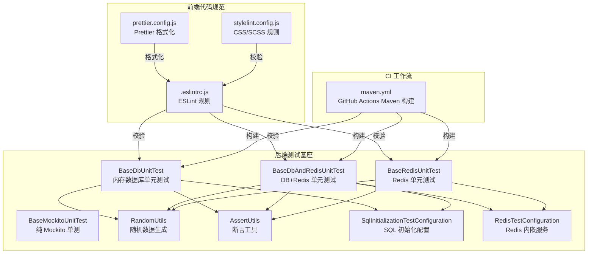
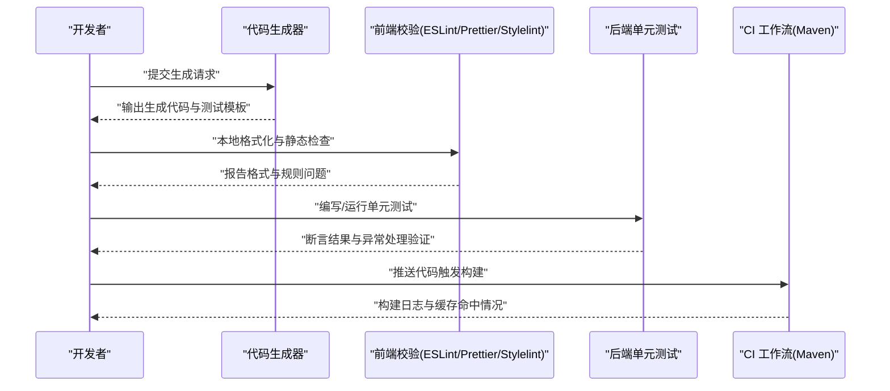
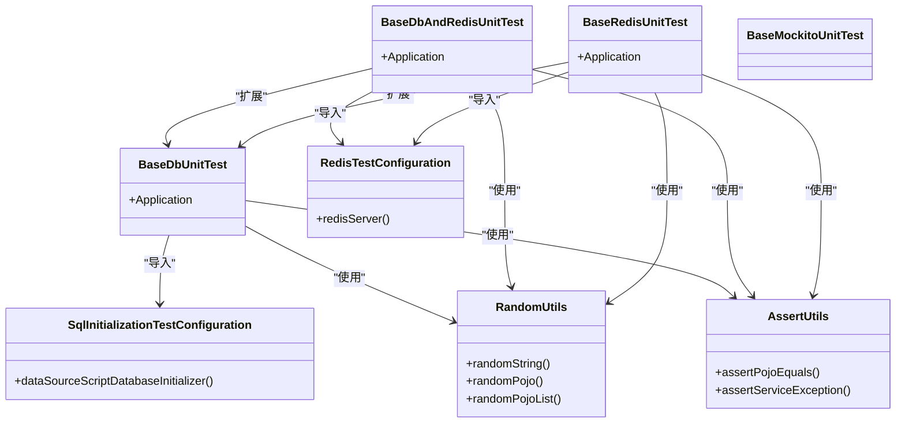
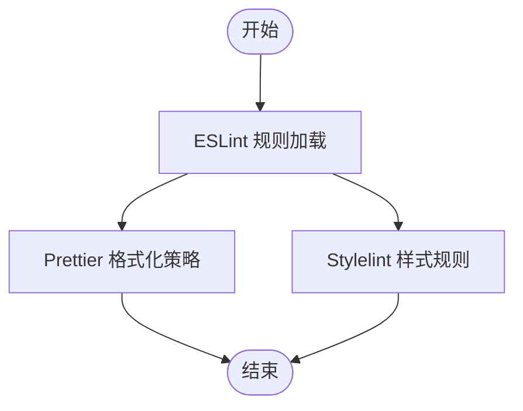
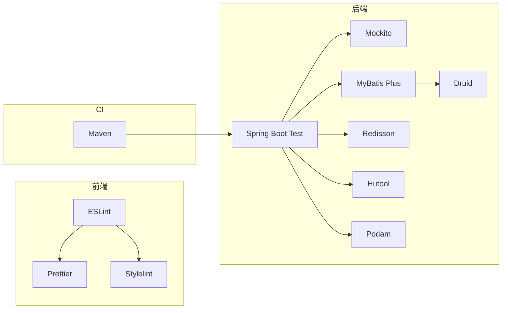

# 质量控制

<cite>
**本文引用的文件**
- [BaseDbUnitTest.java](file://backend/yudao-framework/yudao-spring-boot-starter-test/src/main/java/cn/iocoder/yudao/framework/test/core/ut/BaseDbUnitTest.java)
- [BaseDbAndRedisUnitTest.java](file://backend/yudao-framework/yudao-spring-boot-starter-test/src/main/java/cn/iocoder/yudao/framework/test/core/ut/BaseDbAndRedisUnitTest.java)
- [BaseRedisUnitTest.java](file://backend/yudao-framework/yudao-spring-boot-starter-test/src/main/java/cn/iocoder/yudao/framework/test/core/ut/BaseRedisUnitTest.java)
- [BaseMockitoUnitTest.java](file://backend/yudao-framework/yudao-spring-boot-starter-test/src/main/java/cn/iocoder/yudao/framework/test/core/ut/BaseMockitoUnitTest.java)
- [RandomUtils.java](file://backend/yudao-framework/yudao-spring-boot-starter-test/src/main/java/cn/iocoder/yudao/framework/test/core/util/RandomUtils.java)
- [AssertUtils.java](file://backend/yudao-framework/yudao-spring-boot-starter-test/src/main/java/cn/iocoder/yudao/framework/test/core/util/AssertUtils.java)
- [SqlInitializationTestConfiguration.java](file://backend/yudao-framework/yudao-spring-boot-starter-test/src/main/java/cn/iocoder/yudao/framework/test/config/SqlInitializationTestConfiguration.java)
- [RedisTestConfiguration.java](file://backend/yudao-framework/yudao-spring-boot-starter-test/src/main/java/cn/iocoder/yudao/framework/test/config/RedisTestConfiguration.java)
- [.eslintrc.js](file://frontend/admin-vue3/.eslintrc.js)
- [prettier.config.js](file://frontend/admin-vue3/prettier.config.js)
- [stylelint.config.js](file://frontend/admin-vue3/stylelint.config.js)
- [config.yaml](file://openspec/config.yaml)
- [maven.yml](file://backend/.github/workflows/maven.yml)
- [validate.js](file://frontend/mall-uniapp/uni_modules/uni-forms/components/uni-forms/validate.js)
</cite>

## 目录
1. [简介](#简介)
2. [项目结构](#项目结构)
3. [核心组件](#核心组件)
4. [架构总览](#架构总览)
5. [详细组件分析](#详细组件分析)
6. [依赖分析](#依赖分析)
7. [性能考虑](#性能考虑)
8. [故障排查指南](#故障排查指南)
9. [结论](#结论)
10. [附录](#附录)

## 简介
本文件系统性阐述 AgenticCPS 项目在代码生成流程中的质量控制机制与实践，覆盖以下方面：
- 代码格式化与静态分析：前端 ESLint/Prettier/Stylelint 配置与规则
- 单元测试生成与运行：基于 Spring Boot Test 的多场景测试基类与断言工具
- 规范验证：命名约定、注释完整性、异常处理规范
- 测试策略：单元测试模板、集成测试配置、性能测试生成
- 工具使用指南：代码审查清单、自动化检查流程、问题修复建议
- 质量控制在生成流程中的作用与实施方法

## 项目结构
质量控制相关能力横跨后端框架测试基座、前端代码规范与 CI 工作流三部分：
- 后端测试基座：提供内存数据库与 Redis 的测试环境，统一断言与随机数据生成
- 前端代码规范：ESLint、Prettier、Stylelint 统一风格与静态检查
- CI 工作流：GitHub Actions Maven 构建与缓存，保障构建一致性

图表来源
- [BaseDbUnitTest.java:1-48](file://backend/yudao-framework/yudao-spring-boot-starter-test/src/main/java/cn/iocoder/yudao/framework/test/core/ut/BaseDbUnitTest.java#L1-L48)
- [BaseDbAndRedisUnitTest.java:1-56](file://backend/yudao-framework/yudao-spring-boot-starter-test/src/main/java/cn/iocoder/yudao/framework/test/core/ut/BaseDbAndRedisUnitTest.java#L1-L56)
- [BaseRedisUnitTest.java:1-37](file://backend/yudao-framework/yudao-spring-boot-starter-test/src/main/java/cn/iocoder/yudao/framework/test/core/ut/BaseRedisUnitTest.java#L1-L37)
- [BaseMockitoUnitTest.java:1-13](file://backend/yudao-framework/yudao-spring-boot-starter-test/src/main/java/cn/iocoder/yudao/framework/test/core/ut/BaseMockitoUnitTest.java#L1-L13)
- [RandomUtils.java:1-147](file://backend/yudao-framework/yudao-spring-boot-starter-test/src/main/java/cn/iocoder/yudao/framework/test/core/util/RandomUtils.java#L1-L147)
- [AssertUtils.java:1-102](file://backend/yudao-framework/yudao-spring-boot-starter-test/src/main/java/cn/iocoder/yudao/framework/test/core/util/AssertUtils.java#L1-L102)
- [SqlInitializationTestConfiguration.java:1-53](file://backend/yudao-framework/yudao-spring-boot-starter-test/src/main/java/cn/iocoder/yudao/framework/test/config/SqlInitializationTestConfiguration.java#L1-L53)
- [RedisTestConfiguration.java:1-36](file://backend/yudao-framework/yudao-spring-boot-starter-test/src/main/java/cn/iocoder/yudao/framework/test/config/RedisTestConfiguration.java#L1-L36)
- [.eslintrc.js:1-76](file://frontend/admin-vue3/.eslintrc.js#L1-L76)
- [prettier.config.js:1-23](file://frontend/admin-vue3/prettier.config.js#L1-L23)
- [stylelint.config.js:1-236](file://frontend/admin-vue3/stylelint.config.js#L1-L236)
- [maven.yml:1-30](file://backend/.github/workflows/maven.yml#L1-L30)

章节来源
- [BaseDbUnitTest.java:1-48](file://backend/yudao-framework/yudao-spring-boot-starter-test/src/main/java/cn/iocoder/yudao/framework/test/core/ut/BaseDbUnitTest.java#L1-L48)
- [BaseDbAndRedisUnitTest.java:1-56](file://backend/yudao-framework/yudao-spring-boot-starter-test/src/main/java/cn/iocoder/yudao/framework/test/core/ut/BaseDbAndRedisUnitTest.java#L1-L56)
- [BaseRedisUnitTest.java:1-37](file://backend/yudao-framework/yudao-spring-boot-starter-test/src/main/java/cn/iocoder/yudao/framework/test/core/ut/BaseRedisUnitTest.java#L1-L37)
- [.eslintrc.js:1-76](file://frontend/admin-vue3/.eslintrc.js#L1-L76)
- [prettier.config.js:1-23](file://frontend/admin-vue3/prettier.config.js#L1-L23)
- [stylelint.config.js:1-236](file://frontend/admin-vue3/stylelint.config.js#L1-L236)
- [maven.yml:1-30](file://backend/.github/workflows/maven.yml#L1-L30)

## 核心组件
- 内存数据库单元测试基类：提供 H2 内存数据库与 MyBatis Plus 配置，支持每个测试后自动清理
- DB+Redis 单元测试基类：在内存数据库基础上增加内存 Redis，满足缓存场景测试
- Redis 单元测试基类：仅依赖内存 Redis，便于缓存相关功能快速验证
- 纯 Mockito 单元测试基类：专注接口/方法级测试，减少外部依赖
- 随机数据生成工具：按字段语义生成合理随机值，支持 POJO 列表与集合
- 断言工具：提供对象属性对比与业务异常断言，提升测试可读性与稳定性
- SQL 初始化配置：在测试中按需初始化/清理数据库结构与数据
- Redis 内嵌服务配置：启动内存 Redis 服务，避免外部依赖

章节来源
- [BaseDbUnitTest.java:17-47](file://backend/yudao-framework/yudao-spring-boot-starter-test/src/main/java/cn/iocoder/yudao/framework/test/core/ut/BaseDbUnitTest.java#L17-L47)
- [BaseDbAndRedisUnitTest.java:20-53](file://backend/yudao-framework/yudao-spring-boot-starter-test/src/main/java/cn/iocoder/yudao/framework/test/core/ut/BaseDbAndRedisUnitTest.java#L20-L53)
- [BaseRedisUnitTest.java:12-36](file://backend/yudao-framework/yudao-spring-boot-starter-test/src/main/java/cn/iocoder/yudao/framework/test/core/ut/BaseRedisUnitTest.java#L12-L36)
- [BaseMockitoUnitTest.java:6-12](file://backend/yudao-framework/yudao-spring-boot-starter-test/src/main/java/cn/iocoder/yudao/framework/test/core/ut/BaseMockitoUnitTest.java#L6-L12)
- [RandomUtils.java:21-147](file://backend/yudao-framework/yudao-spring-boot-starter-test/src/main/java/cn/iocoder/yudao/framework/test/core/util/RandomUtils.java#L21-L147)
- [AssertUtils.java:17-102](file://backend/yudao-framework/yudao-spring-boot-starter-test/src/main/java/cn/iocoder/yudao/framework/test/core/util/AssertUtils.java#L17-L102)
- [SqlInitializationTestConfiguration.java:17-53](file://backend/yudao-framework/yudao-spring-boot-starter-test/src/main/java/cn/iocoder/yudao/framework/test/config/SqlInitializationTestConfiguration.java#L17-L53)
- [RedisTestConfiguration.java:12-36](file://backend/yudao-framework/yudao-spring-boot-starter-test/src/main/java/cn/iocoder/yudao/framework/test/config/RedisTestConfiguration.java#L12-L36)

## 架构总览
质量控制贯穿“生成—校验—测试—发布”全流程：
- 生成阶段：根据 OpenSpec 规则生成代码与测试骨架
- 校验阶段：前端 ESLint/Prettier/Stylelint 检查代码风格与潜在问题；后端单元测试基类确保逻辑正确性
- 测试阶段：使用随机数据与断言工具驱动测试，覆盖边界与异常路径
- 发布阶段：CI 工作流统一构建与缓存，保证产物一致性

图表来源
- [config.yaml:1-20](file://openspec/config.yaml#L1-L20)
- [.eslintrc.js:1-76](file://frontend/admin-vue3/.eslintrc.js#L1-L76)
- [prettier.config.js:1-23](file://frontend/admin-vue3/prettier.config.js#L1-L23)
- [stylelint.config.js:1-236](file://frontend/admin-vue3/stylelint.config.js#L1-L236)
- [BaseDbUnitTest.java:24-26](file://backend/yudao-framework/yudao-spring-boot-starter-test/src/main/java/cn/iocoder/yudao/framework/test/core/ut/BaseDbUnitTest.java#L24-L26)
- [maven.yml:1-30](file://backend/.github/workflows/maven.yml#L1-L30)

## 详细组件分析

### 后端测试基座组件
- 内存数据库单元测试基类：导入数据源、事务、MyBatis Plus 与 SQL 初始化配置，设置单元测试配置文件，测试结束后清理数据库
- DB+Redis 单元测试基类：在上述基础上增加 Redis 测试配置与 Redisson 自动配置
- Redis 单元测试基类：仅启用 Redis 测试配置与 Redisson
- 纯 Mockito 单元测试基类：启用 Mockito 扩展，适合接口/方法级隔离测试
- 随机数据生成工具：按字段名语义生成字符串、日期、布尔、枚举状态等，支持 POJO 列表与集合
- 断言工具：提供对象属性逐字段对比与业务异常断言，支持忽略字段与消息格式化断言
- SQL 初始化配置：在测试容器启动时按配置初始化数据库结构与数据
- Redis 内嵌服务配置：启动内存 Redis 服务，避免外部依赖

图表来源
- [BaseDbUnitTest.java:24-45](file://backend/yudao-framework/yudao-spring-boot-starter-test/src/main/java/cn/iocoder/yudao/framework/test/core/ut/BaseDbUnitTest.java#L24-L45)
- [BaseDbAndRedisUnitTest.java:27-53](file://backend/yudao-framework/yudao-spring-boot-starter-test/src/main/java/cn/iocoder/yudao/framework/test/core/ut/BaseDbAndRedisUnitTest.java#L27-L53)
- [BaseRedisUnitTest.java:19-36](file://backend/yudao-framework/yudao-spring-boot-starter-test/src/main/java/cn/iocoder/yudao/framework/test/core/ut/BaseRedisUnitTest.java#L19-L36)
- [BaseMockitoUnitTest.java:11-12](file://backend/yudao-framework/yudao-spring-boot-starter-test/src/main/java/cn/iocoder/yudao/framework/test/core/ut/BaseMockitoUnitTest.java#L11-L12)
- [RandomUtils.java:68-147](file://backend/yudao-framework/yudao-spring-boot-starter-test/src/main/java/cn/iocoder/yudao/framework/test/core/util/RandomUtils.java#L68-L147)
- [AssertUtils.java:33-99](file://backend/yudao-framework/yudao-spring-boot-starter-test/src/main/java/cn/iocoder/yudao/framework/test/core/util/AssertUtils.java#L33-L99)
- [SqlInitializationTestConfiguration.java:34-39](file://backend/yudao-framework/yudao-spring-boot-starter-test/src/main/java/cn/iocoder/yudao/framework/test/config/SqlInitializationTestConfiguration.java#L34-L39)
- [RedisTestConfiguration.java:25-33](file://backend/yudao-framework/yudao-spring-boot-starter-test/src/main/java/cn/iocoder/yudao/framework/test/config/RedisTestConfiguration.java#L25-L33)

章节来源
- [BaseDbUnitTest.java:17-47](file://backend/yudao-framework/yudao-spring-boot-starter-test/src/main/java/cn/iocoder/yudao/framework/test/core/ut/BaseDbUnitTest.java#L17-L47)
- [BaseDbAndRedisUnitTest.java:20-53](file://backend/yudao-framework/yudao-spring-boot-starter-test/src/main/java/cn/iocoder/yudao/framework/test/core/ut/BaseDbAndRedisUnitTest.java#L20-L53)
- [BaseRedisUnitTest.java:12-36](file://backend/yudao-framework/yudao-spring-boot-starter-test/src/main/java/cn/iocoder/yudao/framework/test/core/ut/BaseRedisUnitTest.java#L12-L36)
- [RandomUtils.java:21-147](file://backend/yudao-framework/yudao-spring-boot-starter-test/src/main/java/cn/iocoder/yudao/framework/test/core/util/RandomUtils.java#L21-L147)
- [AssertUtils.java:17-102](file://backend/yudao-framework/yudao-spring-boot-starter-test/src/main/java/cn/iocoder/yudao/framework/test/core/util/AssertUtils.java#L17-L102)
- [SqlInitializationTestConfiguration.java:17-53](file://backend/yudao-framework/yudao-spring-boot-starter-test/src/main/java/cn/iocoder/yudao/framework/test/config/SqlInitializationTestConfiguration.java#L17-L53)
- [RedisTestConfiguration.java:12-36](file://backend/yudao-framework/yudao-spring-boot-starter-test/src/main/java/cn/iocoder/yudao/framework/test/config/RedisTestConfiguration.java#L12-L36)

### 前端代码规范组件
- ESLint 配置：启用 Vue 3 与 TypeScript 推荐规则，结合 Prettier 与 UnoCSS 插件，关闭部分严格规则以适配团队习惯
- Prettier 配置：统一缩进、引号、尾逗号、行宽等格式化策略
- Stylelint 配置：CSS/SCSS 规则与属性排序，兼容 Vue 模板与特殊伪类/伪元素

图表来源
- [.eslintrc.js:20-74](file://frontend/admin-vue3/.eslintrc.js#L20-L74)
- [prettier.config.js:1-23](file://frontend/admin-vue3/prettier.config.js#L1-L23)
- [stylelint.config.js:1-236](file://frontend/admin-vue3/stylelint.config.js#L1-L236)

章节来源
- [.eslintrc.js:1-76](file://frontend/admin-vue3/.eslintrc.js#L1-L76)
- [prettier.config.js:1-23](file://frontend/admin-vue3/prettier.config.js#L1-L23)
- [stylelint.config.js:1-236](file://frontend/admin-vue3/stylelint.config.js#L1-L236)

### 规范验证与异常处理
- 命名约定检查：ESLint 规则允许组件多单词命名关闭，降低命名门槛；同时保留属性顺序、HTML 自闭合等规则
- 注释完整性验证：前端未见专门的注释完整性规则；可在团队内部补充注释规范
- 异常处理规范：后端断言工具支持业务异常断言，要求错误码与消息格式化一致

章节来源
- [.eslintrc.js:47-73](file://frontend/admin-vue3/.eslintrc.js#L47-L73)
- [AssertUtils.java:92-99](file://backend/yudao-framework/yudao-spring-boot-starter-test/src/main/java/cn/iocoder/yudao/framework/test/core/util/AssertUtils.java#L92-L99)

### 测试策略
- 单元测试模板：使用内存数据库/Redis 基类，结合随机数据与断言工具快速编写测试
- 集成测试配置：通过 SQL 初始化配置与 Redis 内嵌服务，模拟真实依赖
- 性能测试生成：可在现有基类上扩展压测脚本与指标采集，结合 CI 进行回归对比

章节来源
- [BaseDbUnitTest.java:24-26](file://backend/yudao-framework/yudao-spring-boot-starter-test/src/main/java/cn/iocoder/yudao/framework/test/core/ut/BaseDbUnitTest.java#L24-L26)
- [BaseDbAndRedisUnitTest.java:27-29](file://backend/yudao-framework/yudao-spring-boot-starter-test/src/main/java/cn/iocoder/yudao/framework/test/core/ut/BaseDbAndRedisUnitTest.java#L27-L29)
- [RedisTestConfiguration.java:25-33](file://backend/yudao-framework/yudao-spring-boot-starter-test/src/main/java/cn/iocoder/yudao/framework/test/config/RedisTestConfiguration.java#L25-L33)

## 依赖分析
- 后端测试基座依赖：Spring Boot Test、Mockito、MyBatis Plus、Druid、Redisson、Hutool、Podam
- 前端代码规范依赖：ESLint 生态、Prettier、Stylelint 及其插件
- CI 工作流依赖：Maven 构建与缓存，支持多 JDK 版本

图表来源
- [BaseDbUnitTest.java:3-11](file://backend/yudao-framework/yudao-spring-boot-starter-test/src/main/java/cn/iocoder/yudao/framework/test/core/ut/BaseDbUnitTest.java#L3-L11)
- [BaseDbAndRedisUnitTest.java:3-14](file://backend/yudao-framework/yudao-spring-boot-starter-test/src/main/java/cn/iocoder/yudao/framework/test/core/ut/BaseDbAndRedisUnitTest.java#L3-L14)
- [BaseRedisUnitTest.java:3-8](file://backend/yudao-framework/yudao-spring-boot-starter-test/src/main/java/cn/iocoder/yudao/framework/test/core/ut/BaseRedisUnitTest.java#L3-L8)
- [.eslintrc.js:20-26](file://frontend/admin-vue3/.eslintrc.js#L20-L26)
- [maven.yml:22-30](file://backend/.github/workflows/maven.yml#L22-L30)

章节来源
- [BaseDbUnitTest.java:3-11](file://backend/yudao-framework/yudao-spring-boot-starter-test/src/main/java/cn/iocoder/yudao/framework/test/core/ut/BaseDbUnitTest.java#L3-L11)
- [BaseDbAndRedisUnitTest.java:3-14](file://backend/yudao-framework/yudao-spring-boot-starter-test/src/main/java/cn/iocoder/yudao/framework/test/core/ut/BaseDbAndRedisUnitTest.java#L3-L14)
- [BaseRedisUnitTest.java:3-8](file://backend/yudao-framework/yudao-spring-boot-starter-test/src/main/java/cn/iocoder/yudao/framework/test/core/ut/BaseRedisUnitTest.java#L3-L8)
- [.eslintrc.js:20-26](file://frontend/admin-vue3/.eslintrc.js#L20-L26)
- [maven.yml:22-30](file://backend/.github/workflows/maven.yml#L22-L30)

## 性能考虑
- 测试执行性能：优先使用内存数据库与 Redis，避免网络 IO；通过随机数据生成减少手工构造成本
- 构建性能：CI 使用 Maven 缓存，多 JDK 版本矩阵并行，缩短整体构建时间
- 规范检查性能：前端仅在本地或 CI 中执行，避免生产环境开销

## 故障排查指南
- 单元测试失败
  - 检查断言工具是否正确断言业务异常与消息格式
  - 确认 SQL 初始化配置是否按需加载，测试结束后是否清理干净
  - 若涉及 Redis，确认内嵌服务端口未被占用
- 前端格式化/规则报错
  - 检查 ESLint/Prettier/Stylelint 配置是否与 IDE 插件一致
  - 关闭严格规则时注意团队协作一致性
- CI 构建失败
  - 查看多 JDK 版本矩阵与缓存命中情况，必要时清理缓存重试

章节来源
- [AssertUtils.java:92-99](file://backend/yudao-framework/yudao-spring-boot-starter-test/src/main/java/cn/iocoder/yudao/framework/test/core/util/AssertUtils.java#L92-L99)
- [SqlInitializationTestConfiguration.java:34-39](file://backend/yudao-framework/yudao-spring-boot-starter-test/src/main/java/cn/iocoder/yudao/framework/test/config/SqlInitializationTestConfiguration.java#L34-L39)
- [RedisTestConfiguration.java:25-33](file://backend/yudao-framework/yudao-spring-boot-starter-test/src/main/java/cn/iocoder/yudao/framework/test/config/RedisTestConfiguration.java#L25-L33)
- [.eslintrc.js:71-73](file://frontend/admin-vue3/.eslintrc.js#L71-L73)
- [maven.yml:22-30](file://backend/.github/workflows/maven.yml#L22-L30)

## 结论
本项目通过“前端规范 + 后端测试基座 + CI 工作流”的组合，实现了生成代码的质量控制闭环。建议在后续迭代中：
- 补充前端注释完整性规则与后端异常处理规范
- 在现有基类上扩展性能测试与覆盖率统计
- 将 OpenSpec 规则与质量控制流程进一步自动化

## 附录
- 代码审查清单
  - 前端：ESLint 通过、Prettier 格式化、Stylelint 无严重告警
  - 后端：单元测试覆盖关键分支与异常路径、断言准确、SQL/Redis 初始化正确
  - CI：构建成功、缓存命中、多 JDK 版本通过
- 自动化检查流程
  - 本地：ESLint/Prettier/Stylelint + 单元测试
  - CI：Maven 构建与缓存、多 JDK 并行
- 问题修复建议
  - 对于规则冲突，统一在配置文件中收敛
  - 对于异常断言不一致，使用断言工具统一格式化消息