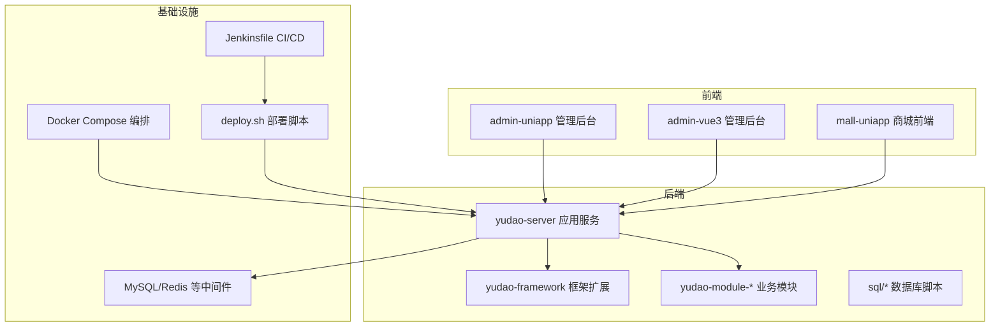
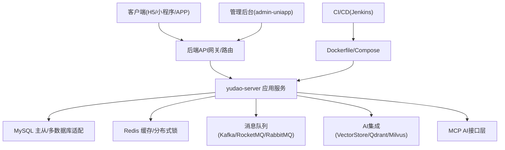
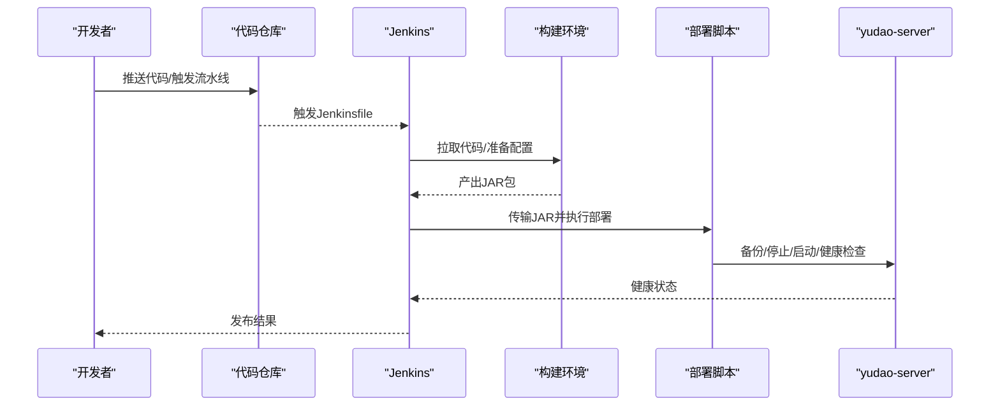
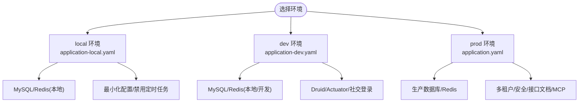
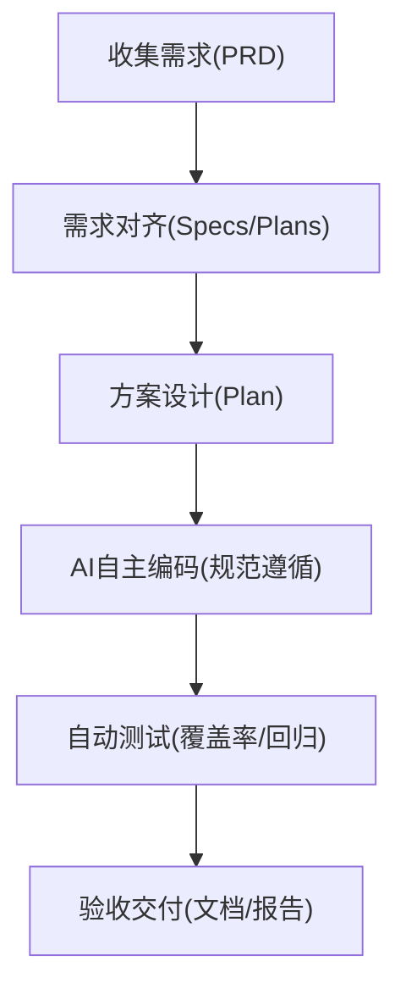
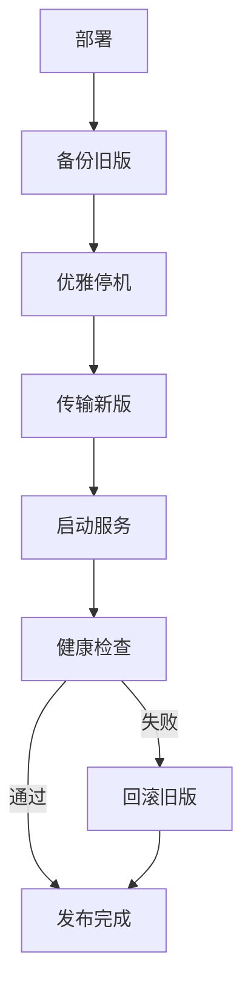
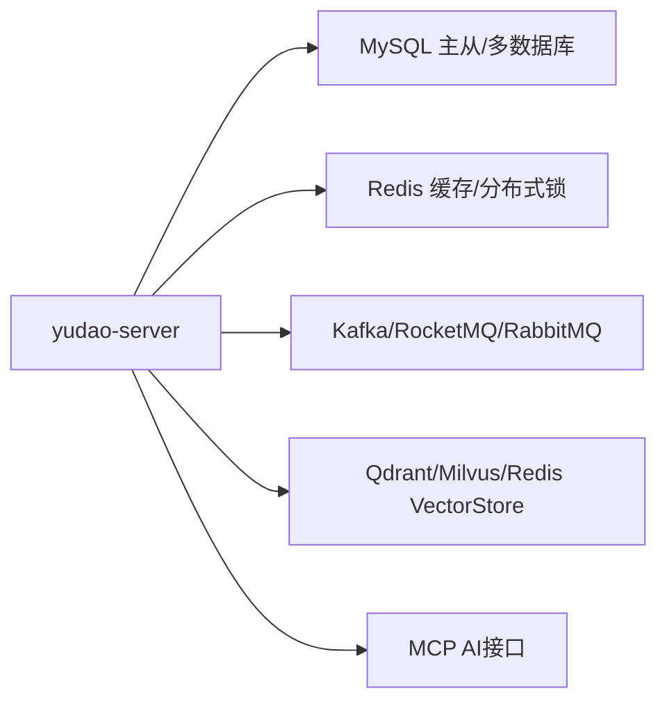

# 开发生命周期管理

<cite>
**本文引用的文件**
- [README.md](file://README.md)
- [Jenkinsfile](file://backend/script/jenkins/Jenkinsfile)
- [docker-compose.yml](file://backend/script/docker/docker-compose.yml)
- [Dockerfile](file://backend/yudao-server/Dockerfile)
- [deploy.sh](file://backend/script/shell/deploy.sh)
- [application.yaml](file://backend/yudao-server/src/main/resources/application.yaml)
- [application-dev.yaml](file://backend/yudao-server/src/main/resources/application-dev.yaml)
- [application-local.yaml](file://backend/yudao-server/src/main/resources/application-local.yaml)
- [CPS系统PRD文档.md](file://docs/CPS系统PRD文档.md)
- [config.yaml](file://openspec/config.yaml)
- [package.json](file://frontend/admin-uniapp/package.json)
</cite>

## 目录
1. [简介](#简介)
2. [项目结构](#项目结构)
3. [核心组件](#核心组件)
4. [架构概览](#架构概览)
5. [详细组件分析](#详细组件分析)
6. [依赖分析](#依赖分析)
7. [性能考虑](#性能考虑)
8. [故障排查指南](#故障排查指南)
9. [结论](#结论)
10. [附录](#附录)

## 简介
本文件面向AgenticCPS项目的开发生命周期管理，围绕从需求分析到生产部署的完整流程展开，系统化阐述迭代计划制定、版本控制策略、发布管理机制、CI/CD流水线配置、开发环境管理、实际开发案例（新功能开发、Bug修复、性能优化）、变更管理与回滚策略、应急响应机制，以及开发效率提升与团队协作最佳实践。文档结合项目现有配置与PRD，提供可操作的实施建议与可视化图示。

## 项目结构
AgenticCPS采用前后端分离与多模块后端架构：
- 后端：基于Spring Boot的多模块工程，包含系统管理、会员中心、基础设施、支付、商城、AI、微信公众号、报表与大屏、CPS等模块，统一由yudao-server容器化部署。
- 前端：包含admin-uniapp（管理后台）与admin-vue3等多套前端工程，支持H5/小程序/APP等多端。
- 基础设施：提供Docker Compose编排、Jenkins CI/CD、Shell部署脚本、数据库SQL脚本与多数据库适配。
- 文档与规范：PRD文档定义产品需求与业务流程，openspec提供规范驱动的AI编程上下文。

**图表来源**
- [docker-compose.yml:1-85](file://backend/script/docker/docker-compose.yml#L1-L85)
- [Jenkinsfile:1-61](file://backend/script/jenkins/Jenkinsfile#L1-L61)
- [Dockerfile:1-24](file://backend/yudao-server/Dockerfile#L1-L24)
- [deploy.sh:1-161](file://backend/script/shell/deploy.sh#L1-L161)

**章节来源**
- [README.md:267-302](file://README.md#L267-L302)
- [docker-compose.yml:1-85](file://backend/script/docker/docker-compose.yml#L1-L85)
- [Jenkinsfile:1-61](file://backend/script/jenkins/Jenkinsfile#L1-L61)
- [Dockerfile:1-24](file://backend/yudao-server/Dockerfile#L1-L24)
- [deploy.sh:1-161](file://backend/script/shell/deploy.sh#L1-L161)

## 核心组件
- 规划与规范驱动：openspec的config.yaml提供规范驱动的AI编程上下文，确保AI生成符合项目技术栈与风格。
- 需求与设计：CPS系统PRD文档定义业务流程、功能清单与详细设计，支撑需求对齐与方案设计。
- 后端服务：yudao-server作为统一容器，承载业务模块与基础设施配置。
- 前端工程：admin-uniapp等前端工程提供多端管理后台与移动端体验。
- CI/CD与部署：Jenkinsfile定义流水线，Docker Compose与Dockerfile负责容器化，Shell脚本实现灰度/回滚部署。

**章节来源**
- [config.yaml:1-21](file://openspec/config.yaml#L1-L21)
- [CPS系统PRD文档.md:1-120](file://docs/CPS系统PRD文档.md#L1-L120)
- [application.yaml:1-362](file://backend/yudao-server/src/main/resources/application.yaml#L1-L362)
- [package.json:1-194](file://frontend/admin-uniapp/package.json#L1-L194)

## 架构概览
系统采用微服务化的模块化后端与多端前端协同架构，通过容器化与CI/CD实现自动化构建与部署。后端通过多数据源、缓存、消息队列与AI集成实现高性能与可扩展性。

**图表来源**
- [application.yaml:146-266](file://backend/yudao-server/src/main/resources/application.yaml#L146-L266)
- [docker-compose.yml:1-85](file://backend/script/docker/docker-compose.yml#L1-L85)
- [Jenkinsfile:1-61](file://backend/script/jenkins/Jenkinsfile#L1-L61)

**章节来源**
- [README.md:229-249](file://README.md#L229-L249)
- [application.yaml:146-266](file://backend/yudao-server/src/main/resources/application.yaml#L146-L266)

## 详细组件分析

### CI/CD流水线与发布管理
- 流水线阶段
  - 检出：从指定分支拉取代码。
  - 构建：准备多环境配置，执行打包（跳过测试）。
  - 部署：复制构建产物到目标目录，赋予执行权限并执行部署脚本。
- 环境变量与凭证：通过参数化构建传递TAG_NAME，使用Docker Hub/GitHub/Kubernetes凭证ID。
- 部署策略：Shell脚本实现备份、优雅停机、启动与健康检查，支持回滚。

**图表来源**
- [Jenkinsfile:29-59](file://backend/script/jenkins/Jenkinsfile#L29-L59)
- [deploy.sh:146-158](file://backend/script/shell/deploy.sh#L146-L158)

**章节来源**
- [Jenkinsfile:1-61](file://backend/script/jenkins/Jenkinsfile#L1-L61)
- [deploy.sh:1-161](file://backend/script/shell/deploy.sh#L1-L161)

### 开发环境管理（本地/测试/生产）
- 本地开发：application-local.yaml提供轻量配置，关闭Quartz自动启动，简化调试。
- 开发环境：application-dev.yaml启用Druid监控、Actuator端点、社交登录等开发特性。
- 生产环境：application.yaml集中配置缓存、接口文档、AI与MCP集成、多租户与安全策略。
- 容器化：docker-compose.yml定义MySQL/Redis/Server/Admin服务，环境变量覆盖数据库与Redis连接。

**图表来源**
- [application-local.yaml:1-294](file://backend/yudao-server/src/main/resources/application-local.yaml#L1-L294)
- [application-dev.yaml:1-213](file://backend/yudao-server/src/main/resources/application-dev.yaml#L1-L213)
- [application.yaml:1-362](file://backend/yudao-server/src/main/resources/application.yaml#L1-L362)
- [docker-compose.yml:1-85](file://backend/script/docker/docker-compose.yml#L1-L85)

**章节来源**
- [application-local.yaml:1-294](file://backend/yudao-server/src/main/resources/application-local.yaml#L1-L294)
- [application-dev.yaml:1-213](file://backend/yudao-server/src/main/resources/application-dev.yaml#L1-L213)
- [application.yaml:1-362](file://backend/yudao-server/src/main/resources/application.yaml#L1-L362)
- [docker-compose.yml:1-85](file://backend/script/docker/docker-compose.yml#L1-L85)

### 需求分析与迭代计划制定
- PRD驱动：CPS系统PRD文档定义用户角色、权限矩阵、核心业务流程与功能清单，支撑需求对齐与验收标准。
- 规范驱动：openspec的config.yaml提供AI编程上下文，确保生成代码符合项目规范。
- 迭代节奏：结合PRD的P0/P1/P2分级与里程碑（Phase 1-7），制定阶段性交付与验收。

**图表来源**
- [CPS系统PRD文档.md:51-77](file://docs/CPS系统PRD文档.md#L51-L77)
- [config.yaml:1-21](file://openspec/config.yaml#L1-L21)
- [README.md:113-144](file://README.md#L113-L144)

**章节来源**
- [CPS系统PRD文档.md:1-120](file://docs/CPS系统PRD文档.md#L1-L120)
- [config.yaml:1-21](file://openspec/config.yaml#L1-L21)
- [README.md:113-144](file://README.md#L113-L144)

### 版本控制策略与发布管理
- 分支策略：Jenkinsfile从devops分支检出，建议采用Git Flow或GitHub Flow，区分feature/release/hotfix。
- 标签与制品：通过参数化TAG_NAME管理版本标签与制品归档。
- 发布窗口：结合健康检查与回滚脚本，限定发布窗口与变更影响面。

**章节来源**
- [Jenkinsfile:6-8](file://backend/script/jenkins/Jenkinsfile#L6-L8)
- [Jenkinsfile:30-35](file://backend/script/jenkins/Jenkinsfile#L30-L35)

### 变更管理与回滚策略
- 部署脚本：deploy.sh实现备份、优雅停机、启动与健康检查；健康检查失败自动输出日志并退出。
- 回滚：通过备份文件与脚本回滚至上一个稳定版本。
- 应急响应：结合Actuator监控与日志配置，快速定位问题并执行回滚。

**图表来源**
- [deploy.sh:146-158](file://backend/script/shell/deploy.sh#L146-L158)
- [deploy.sh:106-143](file://backend/script/shell/deploy.sh#L106-L143)

**章节来源**
- [deploy.sh:1-161](file://backend/script/shell/deploy.sh#L1-L161)

### 实际开发案例

#### 新功能开发（以“商品收藏”为例）
- 需求来源：PRD中M-201为增强功能，支持商品收藏与降价提醒。
- 规划与设计：依据PRD功能清单与权限矩阵，设计数据库表、接口与前端页面。
- AI自编：利用规范驱动的AI编程工作流，自动生成后端控制器、服务、Mapper、前端页面与测试代码。
- 测试与验收：执行单元测试与集成测试，输出验收报告与文档。

**章节来源**
- [CPS系统PRD文档.md:294-303](file://docs/CPS系统PRD文档.md#L294-L303)
- [README.md:113-144](file://README.md#L113-L144)

#### Bug修复（以“订单同步延迟”为例）
- 问题定位：结合Actuator监控与日志配置，定位定时任务与平台API调用瓶颈。
- 修复策略：优化Quartz配置、增加幂等与重试、优化平台接口调用与缓存策略。
- 验证与发布：回归测试通过后，走CI/CD流水线发布。

**章节来源**
- [application-dev.yaml:67-115](file://backend/yudao-server/src/main/resources/application-dev.yaml#L67-L115)
- [application.yaml:146-266](file://backend/yudao-server/src/main/resources/application.yaml#L146-L266)

#### 性能优化（以“多平台比价”为例）
- 优化方向：并发查询、缓存热点数据、索引优化与慢查询分析。
- 实施：结合AI与低代码能力，生成优化后的查询与缓存策略，压测验证。

**章节来源**
- [CPS系统PRD文档.md:417-449](file://docs/CPS系统PRD文档.md#L417-L449)
- [application.yaml:146-266](file://backend/yudao-server/src/main/resources/application.yaml#L146-L266)

### 团队协作与效率提升
- 规范先行：通过openspec与PRD确保AI理解一致，减少返工。
- 工具链：前端使用package.json脚本统一开发与构建；后端使用Docker Compose快速搭建环境。
- 文档与报告：Swagger/Knife4j接口文档、AI工具使用统计与日志审计。

**章节来源**
- [package.json:29-98](file://frontend/admin-uniapp/package.json#L29-L98)
- [application.yaml:40-54](file://backend/yudao-server/src/main/resources/application.yaml#L40-L54)
- [application.yaml:66-89](file://backend/yudao-server/src/main/resources/application.yaml#L66-L89)

## 依赖分析
后端服务依赖多数据源、缓存、消息队列与AI向量存储，通过配置文件集中管理。

**图表来源**
- [application.yaml:90-266](file://backend/yudao-server/src/main/resources/application.yaml#L90-L266)

**章节来源**
- [application.yaml:90-266](file://backend/yudao-server/src/main/resources/application.yaml#L90-L266)

## 性能考虑
- 接口性能：单平台搜索P99<2秒，多平台比价P99<5秒，转链生成<1秒。
- 订单同步：每5分钟增量同步，平台结算后24小时内入账。
- MCP工具：搜索类<3秒，查询类<1秒。

**章节来源**
- [README.md:332-341](file://README.md#L332-L341)

## 故障排查指南
- 健康检查：通过/actuator/health端点与deploy.sh健康检查脚本定位服务状态。
- 日志与监控：application-dev.yaml与application-local.yaml配置日志文件与Actuator端点，便于问题定位。
- 回滚：deploy.sh提供回滚逻辑，失败时输出日志便于人工判断。

**章节来源**
- [application-dev.yaml:146-152](file://backend/yudao-server/src/main/resources/application-dev.yaml#L146-L152)
- [application-local.yaml:167-171](file://backend/yudao-server/src/main/resources/application-local.yaml#L167-L171)
- [deploy.sh:106-143](file://backend/script/shell/deploy.sh#L106-L143)

## 结论
AgenticCPS通过规范驱动的AI编程、完善的PRD与CI/CD流水线、清晰的环境管理与回滚策略，实现了从需求到生产的高效闭环。建议持续优化AI生成质量、加强监控与压测、完善应急演练，以进一步提升交付质量与稳定性。

## 附录
- 前端脚本与多端构建：参考admin-uniapp的package.json脚本，统一开发与构建流程。
- 容器化与编排：参考docker-compose.yml与Dockerfile，快速搭建本地开发环境。
- MCP与AI集成：参考application.yaml中的MCP配置，确保AI工具与接口稳定可用。

**章节来源**
- [package.json:29-98](file://frontend/admin-uniapp/package.json#L29-L98)
- [docker-compose.yml:1-85](file://backend/script/docker/docker-compose.yml#L1-L85)
- [Dockerfile:1-24](file://backend/yudao-server/Dockerfile#L1-L24)
- [application.yaml:199-225](file://backend/yudao-server/src/main/resources/application.yaml#L199-L225)