# 知识管理体系

<cite>
**本文档引用的文件**
- [AGENTS.md](file://AGENTS.md)
- [README.md](file://README.md)
- [MEMORY.md](file://agent_improvement/memory/MEMORY.md)
- [codegen-rules.md](file://agent_improvement/memory/codegen-rules.md)
- [testing-specification.md](file://agent_improvement/memory/testing-specification.md)
- [CPS系统PRD文档.md](file://docs/CPS系统PRD文档.md)
- [config.yaml](file://openspec/config.yaml)
</cite>

## 目录
1. [引言](#引言)
2. [项目结构](#项目结构)
3. [核心组件](#核心组件)
4. [架构概览](#架构概览)
5. [详细组件分析](#详细组件分析)
6. [依赖关系分析](#依赖关系分析)
7. [性能考虑](#性能考虑)
8. [故障排除指南](#故障排除指南)
9. [结论](#结论)
10. [附录](#附录)

## 引言

AgenticCPS是一个基于ruoyi-vue-pro的成本按销售额提成(CPS)联盟返利系统，采用Vibe Coding + 低代码 + AI自主编程的全新开发范式。该项目的核心创新在于实现了100%由AI自主编写的CPS核心模块，从数据库设计到API接口，从业务逻辑到单元测试，形成了完整的知识管理体系。

本知识管理体系旨在建立一套系统化的知识收集、整理、存储和传承机制，确保项目知识的有效管理和持续演进。通过Agent记忆(MEMORY)系统的组织结构，文档化知识分类体系，提供知识更新和维护流程，展示知识共享机制，最终实现个人知识管理与团队知识文化建设的有机结合。

## 项目结构

AgenticCPS项目采用模块化架构设计，主要包含以下几个核心部分：

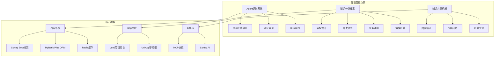

**图表来源**
- [AGENTS.md:14-57](file://AGENTS.md#L14-L57)
- [README.md:267-302](file://README.md#L267-L302)

项目结构体现了三层架构设计：
- **知识管理层**：Agent记忆系统、知识分类体系、知识共享机制
- **技术实现层**：后端Spring Boot系统、前端Vue3系统、AI集成模块
- **业务应用层**：CPS联盟返利系统、会员管理、支付系统等

**章节来源**
- [AGENTS.md:14-57](file://AGENTS.md#L14-L57)
- [README.md:267-302](file://README.md#L267-L302)

## 核心组件

### Agent记忆系统

Agent记忆系统是AgenticCPS知识管理体系的核心组件，专门负责存储和管理AI相关的知识资产。该系统采用结构化的方式组织不同类型的知识内容。

#### 组件架构

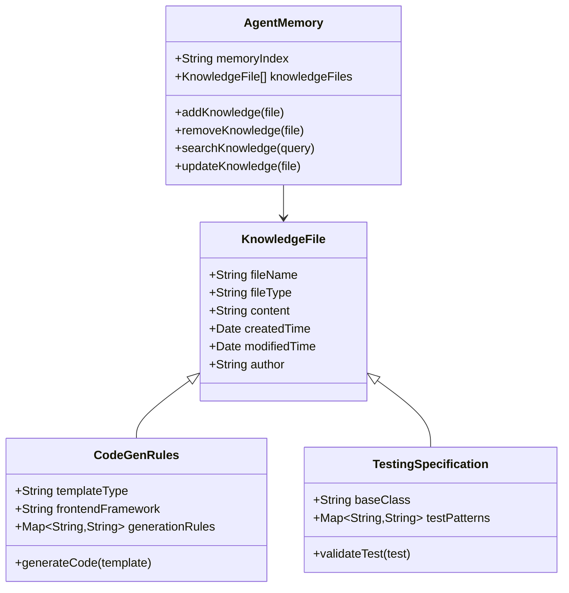

**图表来源**
- [MEMORY.md:1-21](file://agent_improvement/memory/MEMORY.md#L1-L21)
- [codegen-rules.md:1-788](file://agent_improvement/memory/codegen-rules.md#L1-L788)
- [testing-specification.md:1-784](file://agent_improvement/memory/testing-specification.md#L1-L784)

#### 核心特性

1. **结构化存储**：采用层级化的文件组织方式，便于知识的分类和检索
2. **版本控制**：支持知识文件的版本管理和变更追踪
3. **智能检索**：提供基于关键词和标签的知识检索功能
4. **自动化更新**：与AI编程流程集成，实现知识的自动更新和维护

**章节来源**
- [MEMORY.md:1-21](file://agent_improvement/memory/MEMORY.md#L1-L21)

### 知识分类体系

知识分类体系是AgenticCPS知识管理的基础框架，将不同类型的知识按照既定的分类标准进行组织和管理。

#### 分类标准

| 分类维度 | 具体类别 | 描述 | 存储位置 |
|---------|---------|------|---------|
| 技术层面 | 架构设计 | 系统架构、模块设计、技术选型 | agent_improvement/memory/ |
| 技术层面 | 开发规范 | 代码规范、命名约定、模板规则 | agent_improvement/memory/ |
| 技术层面 | 测试规范 | 单元测试、集成测试、测试策略 | agent_improvement/memory/ |
| 业务层面 | 业务逻辑 | CPS业务流程、返利计算、订单处理 | docs/ |
| 业务层面 | 产品需求 | PRD文档、功能清单、用户故事 | docs/ |
| 运维层面 | 部署配置 | 环境配置、部署脚本、监控指标 | backend/script/ |
| 运维层面 | 运维经验 | 故障处理、性能优化、最佳实践 | references/ |

#### 分类流程

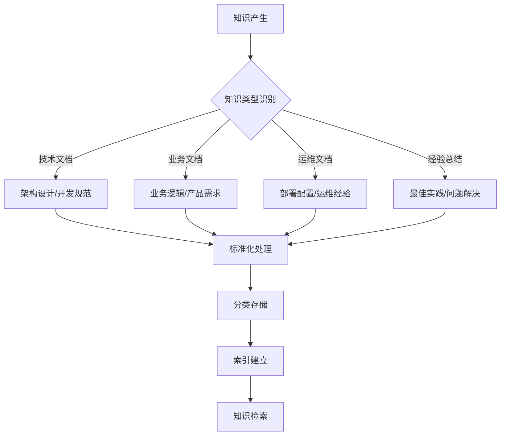

**图表来源**
- [CPS系统PRD文档.md:19-77](file://docs/CPS系统PRD文档.md#L19-L77)

**章节来源**
- [CPS系统PRD文档.md:19-77](file://docs/CPS系统PRD文档.md#L19-L77)

### 知识共享机制

知识共享机制是确保知识在团队内部有效传播和应用的重要保障，通过多种渠道和方式促进知识的交流和传承。

#### 共享渠道

1. **文档评审制度**
   - 定期组织技术文档评审会议
   - 建立文档质量评估标准
   - 实施文档版本控制和发布流程

2. **团队培训体系**
   - 新员工入职培训
   - 技术专题培训
   - 最佳实践分享会

3. **经验交流活动**
   - 技术沙龙和研讨会
   - 项目复盘和经验总结
   - 跨团队知识分享

#### 知识传承

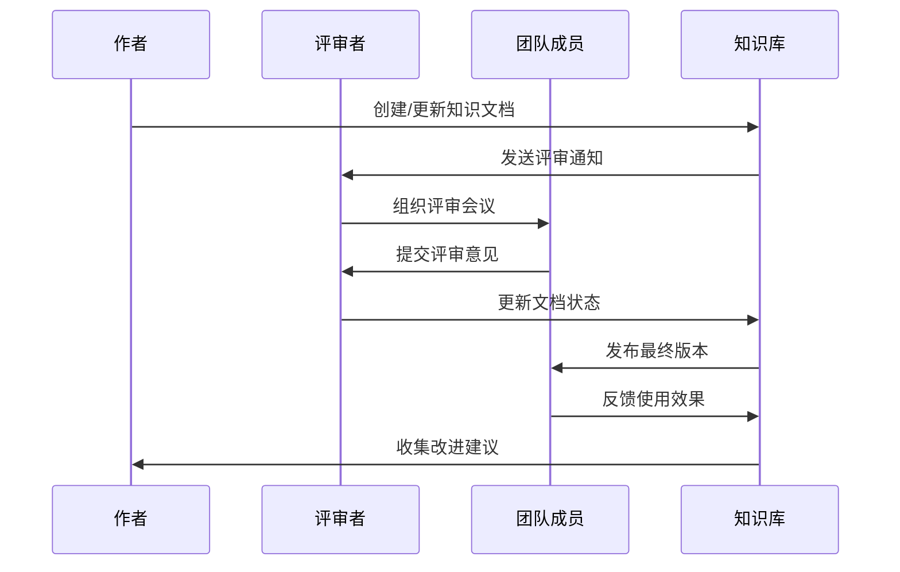

**图表来源**
- [AGENTS.md:141-182](file://AGENTS.md#L141-L182)

**章节来源**
- [AGENTS.md:141-182](file://AGENTS.md#L141-L182)

## 架构概览

AgenticCPS的知识管理体系采用分层架构设计，确保各个组件之间的协调运作和知识的有效流转。

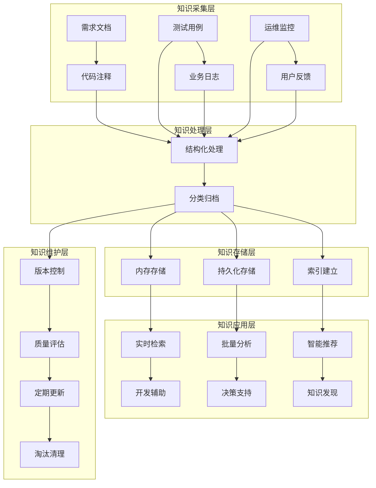

**图表来源**
- [AGENTS.md:82-140](file://AGENTS.md#L82-L140)

该架构体现了知识管理的全生命周期：从知识的采集、处理、存储到应用，再到维护和更新，形成一个完整的闭环管理系统。

**章节来源**
- [AGENTS.md:82-140](file://AGENTS.md#L82-L140)

## 详细组件分析

### Agent记忆(MEMORY)系统

Agent记忆系统是AgenticCPS知识管理体系的核心基础设施，专门负责存储和管理AI相关的知识资产。

#### 系统组成

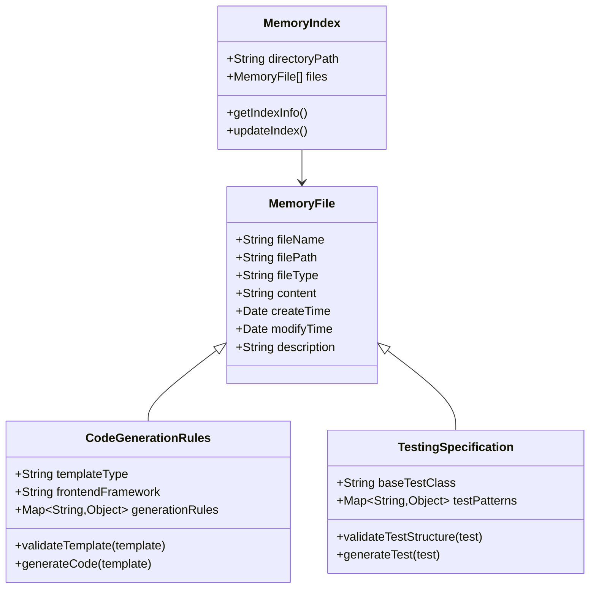

**图表来源**
- [MEMORY.md:1-21](file://agent_improvement/memory/MEMORY.md#L1-L21)
- [codegen-rules.md:1-788](file://agent_improvement/memory/codegen-rules.md#L1-L788)
- [testing-specification.md:1-784](file://agent_improvement/memory/testing-specification.md#L1-L784)

#### 核心功能

1. **知识存储管理**
   - 支持多种格式的知识文件存储
   - 提供文件版本管理和变更追踪
   - 实现知识文件的分类和标签管理

2. **智能检索系统**
   - 基于关键词的知识检索
   - 支持模糊匹配和语义搜索
   - 提供相关性排序和过滤功能

3. **自动化处理**
   - 与AI编程流程集成
   - 自动生成和更新知识文件
   - 实现知识的自动分类和归档

**章节来源**
- [MEMORY.md:1-21](file://agent_improvement/memory/MEMORY.md#L1-L21)

### 代码生成规则系统

代码生成规则系统是AgenticCPS技术规范的核心组成部分，为AI自主编程提供了标准化的模板和规则。

#### 规则体系

| 规则类别 | 具体内容 | 应用场景 |
|---------|---------|---------|
| 层级结构 | Controller/Service/Mapper/DO分层 | 后端代码生成 |
| 命名约定 | PascalCase/camelCase/kebab-case | 全栈代码规范 |
| 数据对象 | DO规范、枚举处理、时间字段 | 数据层设计 |
| 接口规范 | Service接口、Controller接口 | 业务层规范 |
| 前端模板 | Vue3 Element Plus、Vben Admin | 前端页面生成 |
| 模板类型 | 通用、树表、ERP主表 | 不同业务场景 |

#### 生成流程

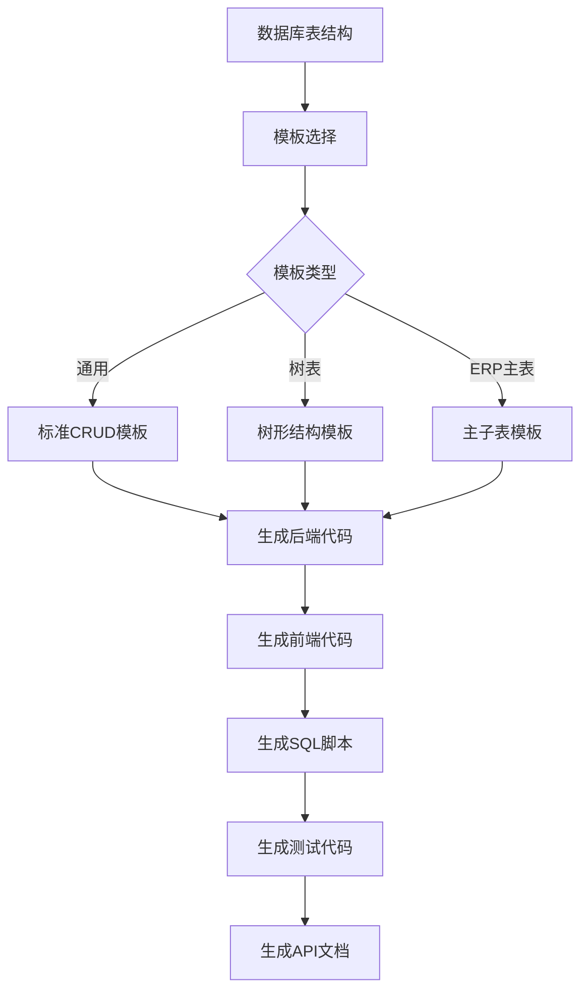

**图表来源**
- [codegen-rules.md:307-326](file://agent_improvement/memory/codegen-rules.md#L307-L326)

**章节来源**
- [codegen-rules.md:307-326](file://agent_improvement/memory/codegen-rules.md#L307-L326)

### 测试规范系统

测试规范系统为AgenticCPS的AI自主编程提供了完整的测试保障机制，确保生成代码的质量和可靠性。

#### 测试层次

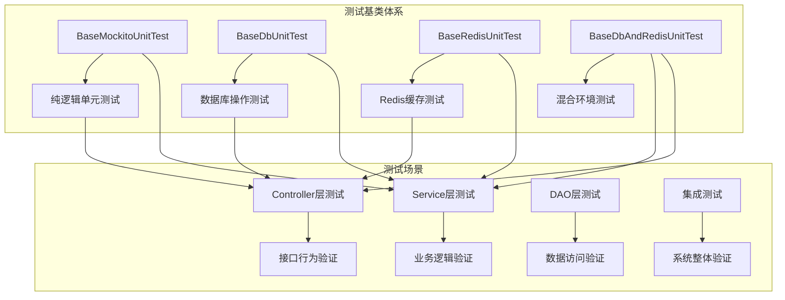

**图表来源**
- [testing-specification.md:5-15](file://agent_improvement/memory/testing-specification.md#L5-L15)

#### 测试策略

1. **分层测试策略**
   - Service层：业务逻辑正确性验证
   - Controller层：接口行为和响应格式验证
   - DAO层：数据访问和数据库交互验证

2. **测试数据管理**
   - 随机数据生成：使用PODAM库生成测试数据
   - 数据克隆：通过cloneIgnoreId()避免唯一性冲突
   - 环境隔离：H2内存数据库和内嵌Redis

3. **异常处理测试**
   - 不存在数据测试：验证异常路径
   - 业务规则测试：验证业务校验
   - 参数验证测试：验证输入校验

**章节来源**
- [testing-specification.md:5-15](file://agent_improvement/memory/testing-specification.md#L5-L15)

### 产品需求文档(PRDD)

产品需求文档是AgenticCPS业务知识管理的重要载体，详细描述了系统的业务逻辑和功能需求。

#### 文档结构

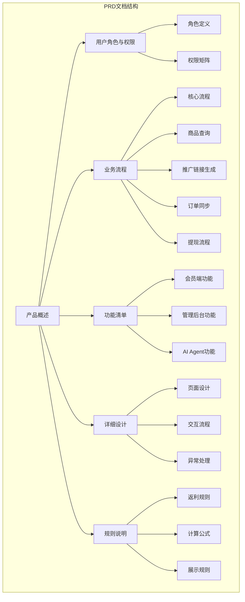

**图表来源**
- [CPS系统PRD文档.md:19-77](file://docs/CPS系统PRD文档.md#L19-L77)

#### 业务流程

系统的核心业务流程涵盖了从用户注册到返利提现的完整闭环：

1. **用户注册登录** → **商品查询** → **多平台比价** → **生成推广链接**
2. **会员下单** → **订单同步** → **状态追踪** → **平台结算**
3. **返利计算** → **返利入账** → **会员提现** → **审核打款**

**章节来源**
- [CPS系统PRD文档.md:19-77](file://docs/CPS系统PRD文档.md#L19-L77)

## 依赖关系分析

AgenticCPS知识管理体系中的各个组件之间存在着复杂的依赖关系，这些关系确保了知识管理系统的协调运作。

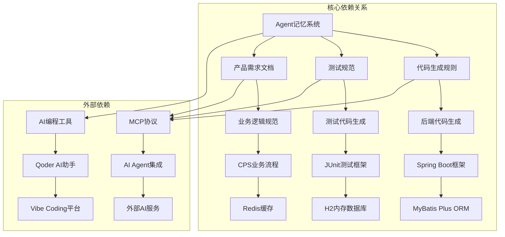

**图表来源**
- [AGENTS.md:141-182](file://AGENTS.md#L141-L182)
- [README.md:84-144](file://README.md#L84-L144)

### 组件耦合度分析

| 组件 | 内聚性 | 耦合度 | 依赖方向 |
|------|--------|--------|----------|
| Agent记忆系统 | 高 | 低 | ← 独立组件 |
| 代码生成规则 | 中 | 高 | → 后端框架 |
| 测试规范系统 | 中 | 高 | → 测试框架 |
| 产品需求文档 | 高 | 低 | ← 业务需求 |
| AI编程工具 | 低 | 高 | → 外部服务 |

### 循环依赖风险

系统设计避免了循环依赖的产生：
- Agent记忆系统不依赖具体的技术实现
- 技术规范不依赖具体的业务逻辑
- 业务文档不依赖技术实现细节

**章节来源**
- [AGENTS.md:141-182](file://AGENTS.md#L141-L182)
- [README.md:84-144](file://README.md#L84-L144)

## 性能考虑

在知识管理体系的设计和实现过程中，性能优化是一个重要的考量因素。系统采用了多种策略来确保知识管理的高效性。

### 存储性能优化

1. **内存缓存策略**
   - 热门知识文件缓存在内存中
   - 使用LRU算法管理缓存容量
   - 支持缓存预热和延迟加载

2. **索引优化**
   - 建立多维索引提高检索效率
   - 支持全文搜索和结构化查询
   - 实现索引的增量更新

3. **文件压缩**
   - 知识文件采用压缩存储
   - 支持增量压缩和解压
   - 平衡存储空间和访问速度

### 检索性能优化

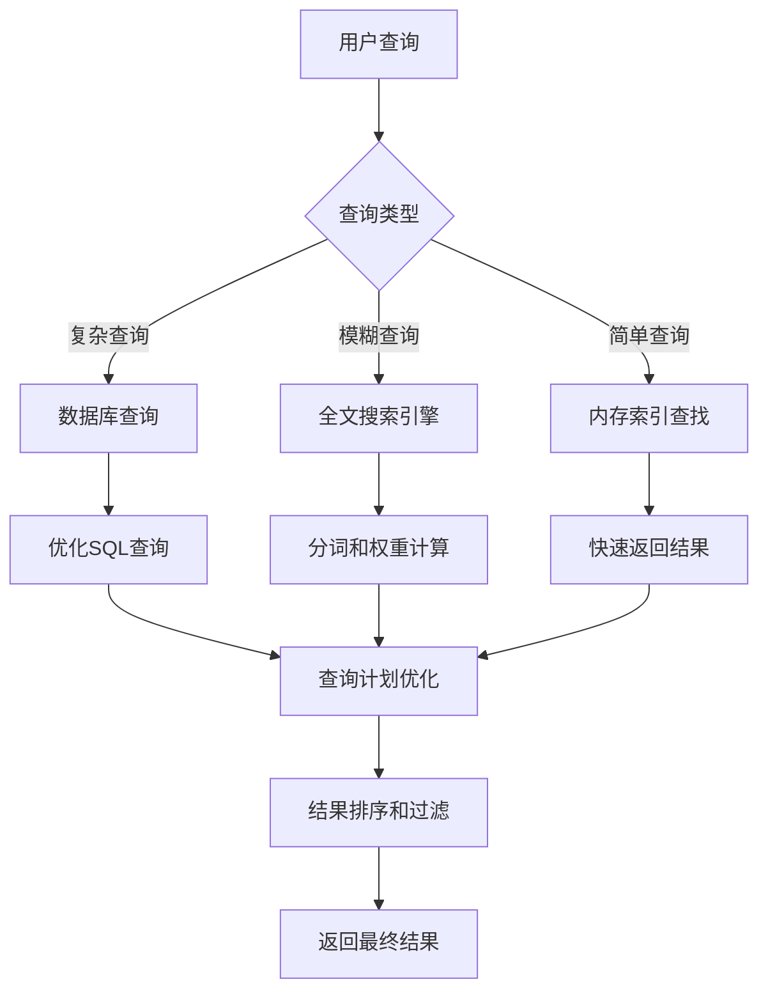

**图表来源**
- [testing-specification.md:151-188](file://agent_improvement/memory/testing-specification.md#L151-L188)

### 处理性能优化

1. **异步处理**
   - 知识文件的处理采用异步方式
   - 支持批量处理和流式处理
   - 实现背压控制和限流机制

2. **并发控制**
   - 使用读写锁保护共享资源
   - 支持乐观锁和悲观锁策略
   - 实现事务的原子性和一致性

3. **资源管理**
   - 连接池管理数据库连接
   - 线程池管理并发任务
   - 缓存池管理临时对象

## 故障排除指南

### 常见问题及解决方案

#### Agent记忆系统问题

| 问题类型 | 症状表现 | 可能原因 | 解决方案 |
|---------|---------|---------|---------|
| 知识文件丢失 | 文件无法找到 | 存储路径错误 | 检查配置文件和存储路径 |
| 知识检索失败 | 搜索结果为空 | 索引损坏 | 重建索引或恢复备份 |
| 内存溢出 | 系统响应缓慢 | 缓存过大 | 调整缓存大小和清理策略 |
| 并发冲突 | 数据不一致 | 锁竞争 | 优化锁策略和事务设计 |

#### 代码生成问题

| 问题类型 | 症状表现 | 可能原因 | 解决方案 |
|---------|---------|---------|---------|
| 生成代码错误 | 编译失败 | 模板规则错误 | 检查模板文件和规则配置 |
| 生成代码不完整 | 功能缺失 | 模板不完整 | 补充缺失的模板片段 |
| 生成代码性能差 | 运行缓慢 | 代码质量差 | 优化模板和生成策略 |
| 生成代码不符合规范 | 代码风格不统一 | 规范不明确 | 更新代码规范和检查规则 |

#### 测试生成问题

| 问题类型 | 症状表现 | 可能原因 | 解决方案 |
|---------|---------|---------|---------|
| 测试代码生成失败 | 测试文件缺失 | 测试规范错误 | 检查测试规范和依赖关系 |
| 测试覆盖率不足 | 部分逻辑未测试 | 测试用例不完整 | 补充缺失的测试用例 |
| 测试执行失败 | 单元测试报错 | 测试环境问题 | 检查测试环境和依赖配置 |
| 测试结果不稳定 | 偶尔失败 | 随机性因素 | 使用固定种子和隔离环境 |

### 故障诊断流程

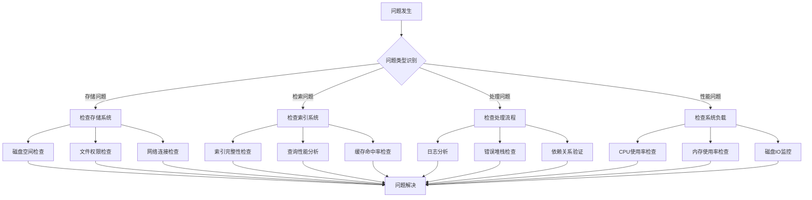

**图表来源**
- [testing-specification.md:766-784](file://agent_improvement/memory/testing-specification.md#L766-L784)

### 预防性维护

1. **定期检查**
   - 存储空间监控和清理
   - 索引健康度检查和维护
   - 系统性能指标监控

2. **备份策略**
   - 知识文件的定期备份
   - 索引的增量备份
   - 配置文件的版本管理

3. **升级管理**
   - 知识规范的版本升级
   - 系统组件的兼容性检查
   - 升级前的充分测试

**章节来源**
- [testing-specification.md:766-784](file://agent_improvement/memory/testing-specification.md#L766-L784)

## 结论

AgenticCPS的知识管理体系通过Agent记忆系统、知识分类体系、知识共享机制和完善的维护流程，构建了一个完整的知识管理闭环。该体系不仅支持AI自主编程的需求，也为团队的知识传承和经验积累提供了有力保障。

### 主要成就

1. **系统化知识管理**：建立了从知识采集到应用的完整流程
2. **智能化处理机制**：通过AI技术实现知识的自动处理和更新
3. **标准化规范体系**：制定了统一的代码生成和测试规范
4. **高效的共享机制**：通过多种渠道促进知识的传播和应用

### 未来发展方向

1. **智能化推荐**：基于用户行为和需求提供个性化的知识推荐
2. **知识图谱**：构建更加完善的知识关联网络
3. **自动化评估**：建立知识质量的自动化评估体系
4. **跨平台集成**：与其他开发工具和平台的深度集成

该知识管理体系为AgenticCPS项目的持续发展奠定了坚实的基础，也为其他AI驱动的项目提供了宝贵的参考经验。

## 附录

### 相关文件清单

| 文件类型 | 文件路径 | 用途描述 |
|---------|---------|---------|
| 系统文档 | AGENTS.md | 项目架构和使用指南 |
| 项目介绍 | README.md | 项目概述和快速开始 |
| 知识管理 | agent_improvement/memory/MEMORY.md | Agent记忆系统索引 |
| 代码规范 | agent_improvement/memory/codegen-rules.md | 代码生成规则 |
| 测试规范 | agent_improvement/memory/testing-specification.md | 单元测试规范 |
| 产品文档 | docs/CPS系统PRD文档.md | 产品需求文档 |
| 配置文件 | openspec/config.yaml | Openspec配置 |

### 最佳实践建议

1. **持续改进**：定期回顾和优化知识管理体系
2. **团队协作**：鼓励团队成员积极参与知识贡献
3. **工具支持**：利用合适的工具提高知识管理效率
4. **文化培养**：营造重视知识分享和传承的团队文化