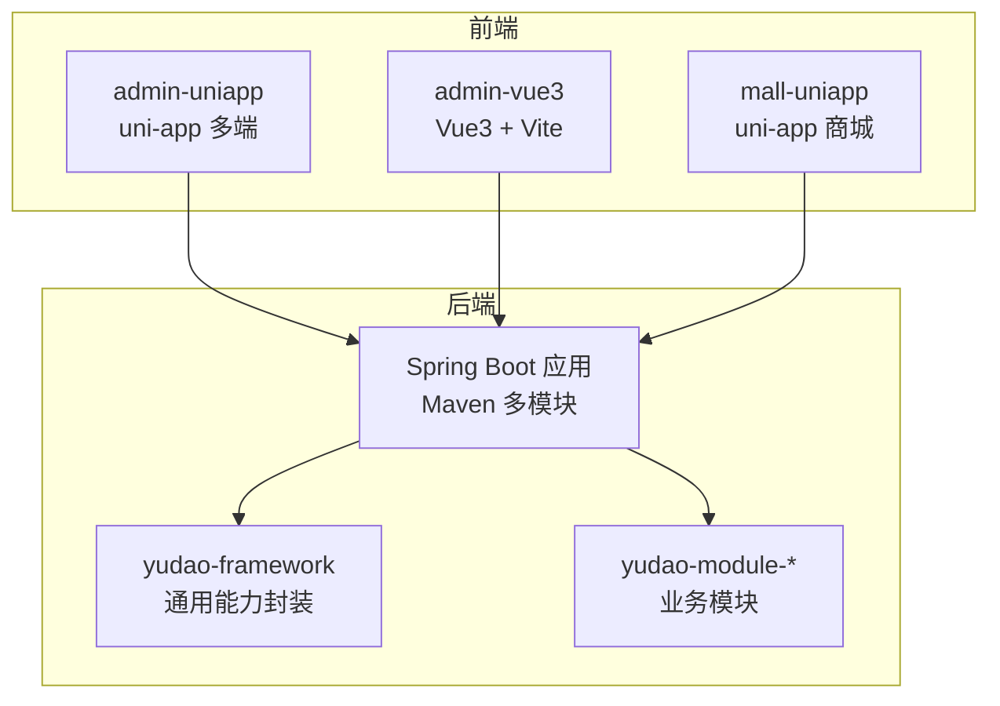
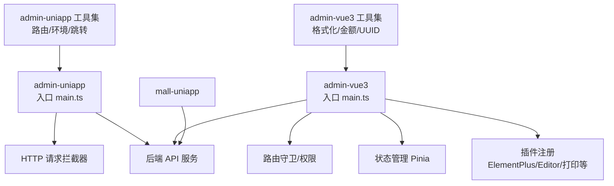
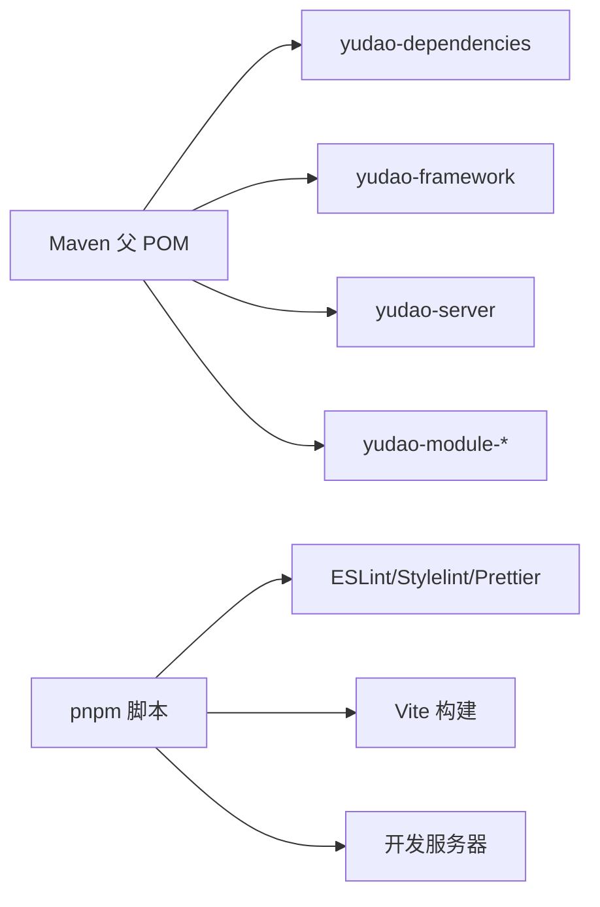

# 代码规范与标准

<cite>
**本文引用的文件**
- [frontend/admin-uniapp/.editorconfig](file://frontend/admin-uniapp/.editorconfig)
- [frontend/admin-vue3/.editorconfig](file://frontend/admin-vue3/.editorconfig)
- [frontend/admin-uniapp/.prettierrc](file://frontend/admin-uniapp/.prettierrc)
- [frontend/admin-vue3/.prettierrc](file://frontend/admin-vue3/.prettierrc)
- [frontend/admin-uniapp/eslint.config.mjs](file://frontend/admin-uniapp/eslint.config.mjs)
- [frontend/admin-vue3/.eslintrc.js](file://frontend/admin-vue3/.eslintrc.js)
- [frontend/admin-vue3/prettier.config.js](file://frontend/admin-vue3/prettier.config.js)
- [frontend/admin-vue3/stylelint.config.js](file://frontend/admin-vue3/stylelint.config.js)
- [frontend/admin-uniapp/package.json](file://frontend/admin-uniapp/package.json)
- [frontend/admin-vue3/package.json](file://frontend/admin-vue3/package.json)
- [frontend/admin-uniapp/src/main.ts](file://frontend/admin-uniapp/src/main.ts)
- [frontend/admin-vue3/src/main.ts](file://frontend/admin-vue3/src/main.ts)
- [frontend/admin-uniapp/src/utils/index.ts](file://frontend/admin-uniapp/src/utils/index.ts)
- [frontend/admin-vue3/src/utils/index.ts](file://frontend/admin-vue3/src/utils/index.ts)
- [backend/pom.xml](file://backend/pom.xml)
- [backend/lombok.config](file://backend/lombok.config)
- [backend/yudao-framework/yudao-common/src/main/java/cn/iocoder/yudao/framework/common/util/collection/CollectionUtils.java](file://backend/yudao-framework/yudao-common/src/main/java/cn/iocoder/yudao/framework/common/util/collection/CollectionUtils.java)
- [frontend/admin-uniapp/.commitlintrc.cjs](file://frontend/admin-uniapp/.commitlintrc.cjs)
- [frontend/mall-uniapp/.gitignore](file://frontend/mall-uniapp/.gitignore)
</cite>

## 目录
1. [简介](#简介)
2. [项目结构](#项目结构)
3. [核心组件](#核心组件)
4. [架构总览](#架构总览)
5. [详细组件分析](#详细组件分析)
6. [依赖分析](#依赖分析)
7. [性能考虑](#性能考虑)
8. [故障排查指南](#故障排查指南)
9. [结论](#结论)
10. [附录](#附录)

## 简介
本文件为 AgenticCPS 项目的代码规范与标准，覆盖后端 Java、前端 TypeScript/JavaScript、Vue.js 组件开发、CSS/SCSS 样式规范，以及 Git 提交信息规范。同时提供代码审查检查清单、静态代码分析工具配置与代码质量度量建议，帮助团队统一风格、提升可维护性与协作效率。

## 项目结构
项目采用前后端分离架构：
- 后端基于 Spring Boot 3 + Maven，模块化组织（系统、基础设施、会员、支付、商品、AI 等模块）
- 前端包含多个应用：
  - admin-uniapp（基于 uni-app 的多端应用）
  - admin-vue3（基于 Vue3 + Vite + Element Plus 的 Web 应用）
  - mall-uniapp（多端电商应用）

**章节来源**
- [backend/pom.xml:1-175](file://backend/pom.xml#L1-L175)

## 核心组件
本节从规范维度梳理各技术栈的关键配置与约定，便于落地执行。

- 后端 Java
  - 语言版本与构建：Java 17，Maven 插件统一管理
  - 注解工具：Lombok 配置 ToString/Equals/Hashcode/链式调用等
  - 通用工具：集合工具类（Stream、Map 转换、分页转换、去重合并等）

- 前端 TypeScript/JavaScript
  - 编辑器与格式化：EditorConfig、Prettier
  - 代码检查：ESLint（含 Vue/TS 支持、Unocss 插件）
  - 样式检查：Stylelint（含 Vue/HTML 支持、属性顺序）
  - 包管理与脚本：pnpm + npm scripts（lint、build、预览）

- Vue.js 组件开发
  - 统一入口初始化与插件注册
  - 组件命名与导出规范（withInstall 等）
  - 工具函数：日期格式化、UUID、文件大小格式化、金额换算等

- CSS/SCSS 样式规范
  - 属性顺序与层级结构（Declaration Block、At-Rule、Rules）
  - rpx 单位兼容（小程序）
  - Vue SFC 中样式块缩进策略

- Git 提交信息规范
  - Conventional Commits 风格
  - commitlint 配置继承

**章节来源**
- [backend/lombok.config:1-5](file://backend/lombok.config#L1-L5)
- [backend/yudao-framework/yudao-common/src/main/java/cn/iocoder/yudao/framework/common/util/collection/CollectionUtils.java:1-352](file://backend/yudao-framework/yudao-common/src/main/java/cn/iocoder/yudao/framework/common/util/collection/CollectionUtils.java#L1-L352)
- [frontend/admin-uniapp/.editorconfig:1-14](file://frontend/admin-uniapp/.editorconfig#L1-L14)
- [frontend/admin-vue3/.editorconfig:1-13](file://frontend/admin-vue3/.editorconfig#L1-L13)
- [frontend/admin-uniapp/.prettierrc:1-11](file://frontend/admin-uniapp/.prettierrc#L1-L11)
- [frontend/admin-vue3/prettier.config.js:1-23](file://frontend/admin-vue3/prettier.config.js#L1-L23)
- [frontend/admin-uniapp/eslint.config.mjs:1-65](file://frontend/admin-uniapp/eslint.config.mjs#L1-L65)
- [frontend/admin-vue3/.eslintrc.js:1-76](file://frontend/admin-vue3/.eslintrc.js#L1-L76)
- [frontend/admin-vue3/stylelint.config.js:1-236](file://frontend/admin-vue3/stylelint.config.js#L1-L236)
- [frontend/admin-uniapp/package.json:1-194](file://frontend/admin-uniapp/package.json#L1-L194)
- [frontend/admin-vue3/package.json:1-160](file://frontend/admin-vue3/package.json#L1-L160)
- [frontend/admin-uniapp/src/main.ts:1-20](file://frontend/admin-uniapp/src/main.ts#L1-L20)
- [frontend/admin-vue3/src/main.ts:1-86](file://frontend/admin-vue3/src/main.ts#L1-L86)
- [frontend/admin-uniapp/src/utils/index.ts:1-244](file://frontend/admin-uniapp/src/utils/index.ts#L1-L244)
- [frontend/admin-vue3/src/utils/index.ts:1-538](file://frontend/admin-vue3/src/utils/index.ts#L1-L538)
- [frontend/admin-uniapp/.commitlintrc.cjs:1-4](file://frontend/admin-uniapp/.commitlintrc.cjs#L1-L4)
- [frontend/mall-uniapp/.gitignore:1-12](file://frontend/mall-uniapp/.gitignore#L1-L12)

## 架构总览
下图展示前端应用与后端服务的交互关系，以及关键初始化流程与工具链集成。

**图表来源**
- [frontend/admin-uniapp/src/main.ts:1-20](file://frontend/admin-uniapp/src/main.ts#L1-L20)
- [frontend/admin-vue3/src/main.ts:1-86](file://frontend/admin-vue3/src/main.ts#L1-L86)
- [frontend/admin-uniapp/src/utils/index.ts:1-244](file://frontend/admin-uniapp/src/utils/index.ts#L1-L244)
- [frontend/admin-vue3/src/utils/index.ts:1-538](file://frontend/admin-vue3/src/utils/index.ts#L1-L538)

**章节来源**
- [frontend/admin-uniapp/src/main.ts:1-20](file://frontend/admin-uniapp/src/main.ts#L1-L20)
- [frontend/admin-vue3/src/main.ts:1-86](file://frontend/admin-vue3/src/main.ts#L1-L86)

## 详细组件分析

### 后端 Java 规范
- 语言与构建
  - 使用 Java 17，统一 Maven 插件版本与编译参数
  - 通过 flatten-maven-plugin 统一版本管理
- 注解工具
  - Lombok 配置 ToString/Equals/Hashcode 调用父类、链式调用等
- 通用工具
  - 集合工具类提供丰富的 Stream 转换、分页转换、去重合并、差集对比等方法，减少重复代码与边界判断

最佳实践
- 使用 Lombok 简化 POJO，配合 equals/hashCode 覆盖策略
- 集合操作优先使用 Stream 与工具类，避免显式循环
- 分页查询统一使用 PageResult，保证接口一致性

**章节来源**
- [backend/pom.xml:30-44](file://backend/pom.xml#L30-L44)
- [backend/pom.xml:113-141](file://backend/pom.xml#L113-L141)
- [backend/lombok.config:1-5](file://backend/lombok.config#L1-L5)
- [backend/yudao-framework/yudao-common/src/main/java/cn/iocoder/yudao/framework/common/util/collection/CollectionUtils.java:17-352](file://backend/yudao-framework/yudao-common/src/main/java/cn/iocoder/yudao/framework/common/util/collection/CollectionUtils.java#L17-L352)

### 前端 TypeScript/JavaScript 规范
- 编辑器与格式化
  - EditorConfig 统一缩进、换行、尾随空白
  - Prettier 统一代码风格（宽度、分号、引号、拖尾逗号、rpx 兼容）
- 代码检查
  - ESLint：Vue/TS 支持、Unocss 插件、忽略生成文件
  - admin-vue3 使用 vue-eslint-parser + @typescript-eslint/parser，结合 Prettier 插件
- 样式检查
  - Stylelint：Vue/HTML 支持、属性顺序、rpx 单位忽略
- 包管理与脚本
  - pnpm + npm scripts：dev/build/lint/format 等命令

最佳实践
- 在 CI 中启用 lint-staged，提交前自动修复
- 统一使用 Prettier 格式化，避免手动调整
- Vue SFC 中 script 块顺序与样式块顺序遵循项目约定

**章节来源**
- [frontend/admin-uniapp/.editorconfig:1-14](file://frontend/admin-uniapp/.editorconfig#L1-L14)
- [frontend/admin-vue3/.editorconfig:1-13](file://frontend/admin-vue3/.editorconfig#L1-L13)
- [frontend/admin-uniapp/.prettierrc:1-11](file://frontend/admin-uniapp/.prettierrc#L1-L11)
- [frontend/admin-vue3/prettier.config.js:1-23](file://frontend/admin-vue3/prettier.config.js#L1-L23)
- [frontend/admin-uniapp/eslint.config.mjs:1-65](file://frontend/admin-uniapp/eslint.config.mjs#L1-L65)
- [frontend/admin-vue3/.eslintrc.js:1-76](file://frontend/admin-vue3/.eslintrc.js#L1-L76)
- [frontend/admin-vue3/stylelint.config.js:1-236](file://frontend/admin-vue3/stylelint.config.js#L1-L236)
- [frontend/admin-uniapp/package.json:96-97](file://frontend/admin-uniapp/package.json#L96-L97)
- [frontend/admin-vue3/package.json:22-25](file://frontend/admin-vue3/package.json#L22-L25)

### Vue.js 组件开发规范
- 统一入口初始化
  - admin-uniapp：创建 SSR App，按序挂载 store、路由拦截器、请求拦截器
  - admin-vue3：集中初始化 i18n、store、全局组件、Element Plus、路由、指令、wangEditor、打印插件等
- 组件导出
  - withInstall 模式，支持全局注册与别名
- 工具函数
  - 日期格式化、UUID、文件大小格式化、金额换算、ERP 专用格式化等

最佳实践
- 组件命名使用语义化英文，避免缩写
- 工具函数集中管理，避免重复实现
- 插件注册集中在入口文件，便于统一治理

**章节来源**
- [frontend/admin-uniapp/src/main.ts:1-20](file://frontend/admin-uniapp/src/main.ts#L1-L20)
- [frontend/admin-vue3/src/main.ts:1-86](file://frontend/admin-vue3/src/main.ts#L1-L86)
- [frontend/admin-vue3/src/utils/index.ts:9-18](file://frontend/admin-vue3/src/utils/index.ts#L9-L18)
- [frontend/admin-vue3/src/utils/index.ts:79-105](file://frontend/admin-vue3/src/utils/index.ts#L79-L105)
- [frontend/admin-vue3/src/utils/index.ts:198-227](file://frontend/admin-vue3/src/utils/index.ts#L198-L227)
- [frontend/admin-vue3/src/utils/index.ts:236-245](file://frontend/admin-vue3/src/utils/index.ts#L236-L245)

### CSS/SCSS 样式规范
- 属性顺序与层级
  - Declaration Block → At-Rule → Rules，保持一致的书写顺序
  - 支持 @supports/@media 等嵌套规则
- rpx 单位
  - 忽略 rpx 未知单位警告，适配小程序端
- Vue/HTML 支持
  - 针对 Vue/HTML 文件启用推荐配置，忽略特定伪类/伪元素

最佳实践
- 优先使用 UnoCSS 原子类，减少自定义样式
- 在 Vue SFC 中，保持 script 与 style 的顺序一致
- 避免深层选择器，降低样式耦合

**章节来源**
- [frontend/admin-vue3/stylelint.config.js:41-210](file://frontend/admin-vue3/stylelint.config.js#L41-L210)
- [frontend/admin-vue3/stylelint.config.js:212-234](file://frontend/admin-vue3/stylelint.config.js#L212-L234)

### Git 提交信息规范
- 使用 Conventional Commits 风格
- commitlint 继承 @commitlint/config-conventional
- 建议在本地安装 husky + lint-staged，提交前自动校验

最佳实践
- 提交信息包含 type(scope)：feat(auth)、fix(api)、docs(readme)、chore(deps)
- 避免一次性提交过多无关变更，拆分为多个小提交

**章节来源**
- [frontend/admin-uniapp/.commitlintrc.cjs:1-4](file://frontend/admin-uniapp/.commitlintrc.cjs#L1-L4)
- [frontend/admin-uniapp/package.json:95](file://frontend/admin-uniapp/package.json#L95)

## 依赖分析
- 后端
  - Spring Boot 3.5.x、Lombok 1.18.x、MapStruct 1.6.x、Surefire 3.5.x
  - Maven 编译插件配置包含参数发现与处理器路径
- 前端
  - admin-uniapp：@dcloudio/uni-app、@uni-helper/eslint-config、UnoCSS、husky、lint-staged
  - admin-vue3：@vitejs/plugin-vue、@typescript-eslint/eslint-plugin、stylelint、unplugin-auto-import、unplugin-vue-components

**图表来源**
- [backend/pom.xml:10-24](file://backend/pom.xml#L10-L24)
- [frontend/admin-uniapp/package.json:29-97](file://frontend/admin-uniapp/package.json#L29-L97)
- [frontend/admin-vue3/package.json:7-26](file://frontend/admin-vue3/package.json#L7-L26)

**章节来源**
- [backend/pom.xml:46-56](file://backend/pom.xml#L46-L56)
- [backend/pom.xml:74-105](file://backend/pom.xml#L74-L105)
- [frontend/admin-uniapp/package.json:128-177](file://frontend/admin-uniapp/package.json#L128-L177)
- [frontend/admin-vue3/package.json:85-144](file://frontend/admin-vue3/package.json#L85-L144)

## 性能考虑
- 前端
  - 使用 Vite 构建，开启按需加载与 Tree Shaking
  - UnoCSS 原子类减少样式体积
  - 图片与资源按需引入，避免冗余依赖
- 后端
  - 使用 Lombok 减少样板代码，提高编译与运行效率
  - 集合工具类优化流式处理，避免不必要的中间集合

[本节为通用指导，无需具体文件引用]

## 故障排查指南
- ESLint/Stylelint 报错
  - 检查对应配置文件是否生效（ESLint/Vue/TS、Stylelint Vue/HTML）
  - 使用脚本自动修复：lint:eslint、lint:style、lint:format
- Prettier 格式冲突
  - 确认 VS Code/IDE 插件使用同一配置
  - 在 CI 中统一执行格式化与检查
- 提交被拒绝
  - 检查 commitlint 配置与提交信息格式
  - 使用 husky + lint-staged 自动修复

**章节来源**
- [frontend/admin-uniapp/eslint.config.mjs:23-51](file://frontend/admin-uniapp/eslint.config.mjs#L23-L51)
- [frontend/admin-vue3/.eslintrc.js:20-26](file://frontend/admin-vue3/.eslintrc.js#L20-L26)
- [frontend/admin-vue3/stylelint.config.js:1-236](file://frontend/admin-vue3/stylelint.config.js#L1-L236)
- [frontend/admin-uniapp/package.json:96-97](file://frontend/admin-uniapp/package.json#L96-L97)
- [frontend/admin-vue3/package.json:22-25](file://frontend/admin-vue3/package.json#L22-L25)

## 结论
通过统一的编辑器配置、格式化工具、代码检查与提交规范，结合后端注解与工具类的最佳实践，团队可以在多端前端与后端之间建立一致的开发体验与质量标准。建议持续在 CI 中集成 lint-staged、ESLint、Stylelint、Prettier 与 commitlint，确保代码质量与协作效率。

[本节为总结，无需具体文件引用]

## 附录

### 代码审查检查清单
- 命名规范
  - 变量/函数/类/组件使用语义化英文，避免缩写
  - Vue 组件文件名使用 PascalCase
- 注释规范
  - 公共 API/复杂逻辑添加必要注释
  - TODO/FIXME 明确责任人与截止时间
- 代码格式化
  - 统一 EditorConfig、Prettier 配置
  - ESLint/Stylelint 无严重错误
- Git 提交
  - 提交信息符合 Conventional Commits
  - 提交粒度合理，避免大范围改动

[本节为通用指导，无需具体文件引用]

### 静态代码分析工具配置
- ESLint
  - admin-uniapp：基于 @uni-helper/eslint-config，启用 Vue、UnoCSS、HTML/CSS 格式化
  - admin-vue3：vue-eslint-parser + @typescript-eslint/parser，结合 Prettier 插件
- Stylelint
  - 启用 stylelint-config-standard，支持 Vue/HTML，属性顺序严格
- Prettier
  - 统一宽度、引号、拖尾逗号、rpx 兼容

**章节来源**
- [frontend/admin-uniapp/eslint.config.mjs:1-65](file://frontend/admin-uniapp/eslint.config.mjs#L1-L65)
- [frontend/admin-vue3/.eslintrc.js:1-76](file://frontend/admin-vue3/.eslintrc.js#L1-L76)
- [frontend/admin-vue3/stylelint.config.js:1-236](file://frontend/admin-vue3/stylelint.config.js#L1-L236)
- [frontend/admin-uniapp/.prettierrc:1-11](file://frontend/admin-uniapp/.prettierrc#L1-L11)
- [frontend/admin-vue3/prettier.config.js:1-23](file://frontend/admin-vue3/prettier.config.js#L1-L23)

### 代码质量度量标准
- 前端
  - ESLint 错误数：0；警告数：尽量接近 0
  - Stylelint 警告数：尽量接近 0
  - Prettier 格式化一致性：100%
- 后端
  - 编译无警告
  - 集合工具类使用率高，避免重复实现

[本节为通用指导，无需具体文件引用]