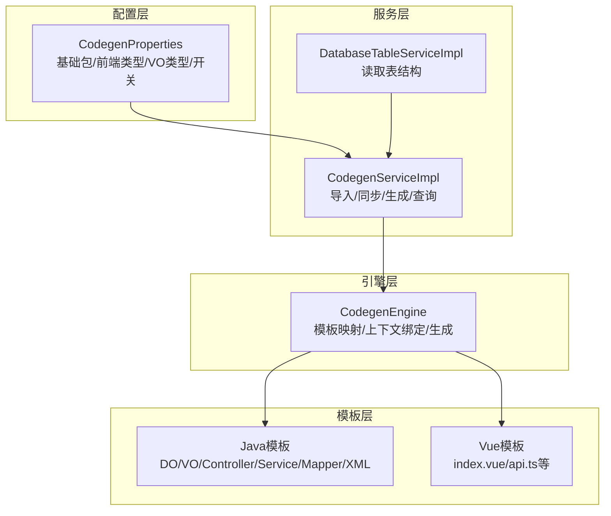
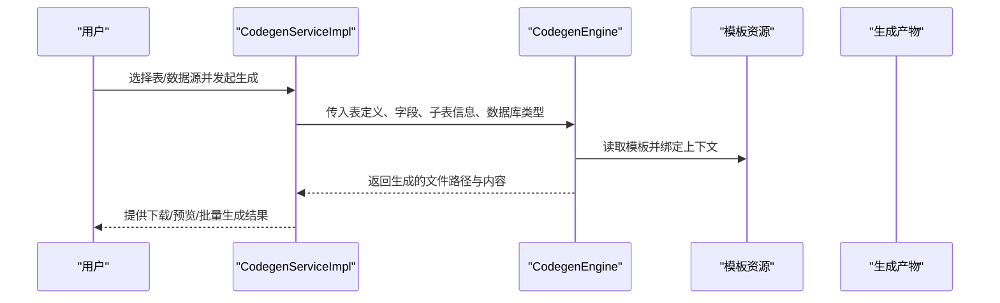
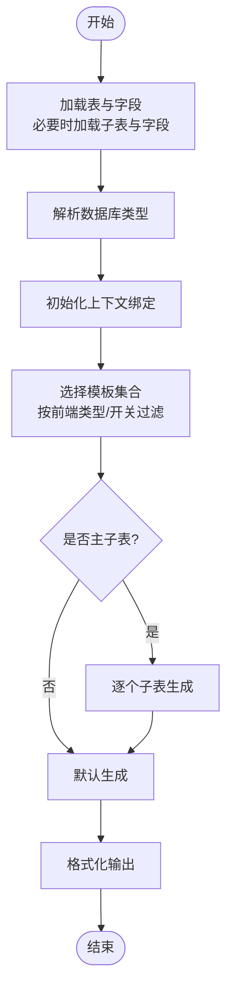
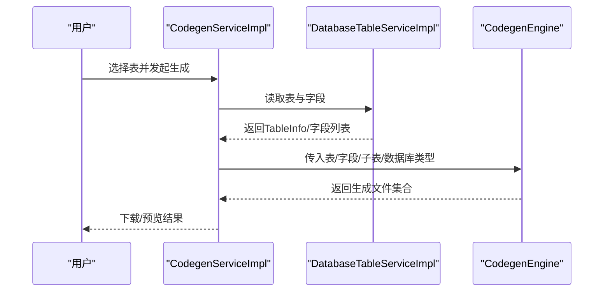
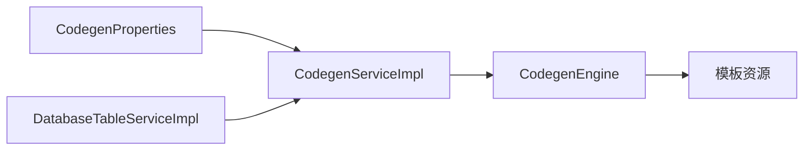

# 代码生成器

<cite>
**本文引用的文件**
- [CodegenEngine.java](file://backend/qiji-module-infra/src/main/java/com/qiji/cps/module/infra/service/codegen/inner/CodegenEngine.java)
- [CodegenServiceImpl.java](file://backend/qiji-module-infra/src/main/java/com/qiji/cps/module/infra/service/codegen/CodegenServiceImpl.java)
- [DatabaseTableServiceImpl.java](file://backend/qiji-module-infra/src/main/java/com/qiji/cps/module/infra/service/db/DatabaseTableServiceImpl.java)
- [CodegenProperties.java](file://backend/qiji-module-infra/src/main/java/com/qiji/cps/module/infra/framework/codegen/config/CodegenProperties.java)
- [codegen-rules.md](file://agent_improvement/memory/codegen-rules.md)
- [do.vm](file://backend/qiji-module-infra/src/main/resources/codegen/java/dal/do.vm)
- [controller.vm](file://backend/qiji-module-infra/src/main/resources/codegen/java/controller/controller.vm)
- [serviceImpl.vm](file://backend/qiji-module-infra/src/main/resources/codegen/java/service/serviceImpl.vm)
- [index.vue.vm](file://backend/qiji-module-infra/src/main/resources/codegen/vue3/views/index.vue.vm)
</cite>

## 目录
1. [简介](#简介)
2. [项目结构](#项目结构)
3. [核心组件](#核心组件)
4. [架构总览](#架构总览)
5. [详细组件分析](#详细组件分析)
6. [依赖关系分析](#依赖关系分析)
7. [性能考量](#性能考量)
8. [故障排查指南](#故障排查指南)
9. [结论](#结论)
10. [附录](#附录)

## 简介
本文件面向AgenticCPS项目的“代码生成器”，目标是帮助开发者快速理解并高效使用该生成器，完成从数据库表到后端Java代码（DO/Mapper/Service/Controller/VO）、以及前端Vue页面的自动化生成。内容涵盖：
- 数据库表设计原则与最佳实践（命名、索引、外键）
- 生成器配置项详解（模板选择、包名、作者、日期格式等）
- 代码生成规则（Velocity模板语法、生成逻辑控制、条件判断、循环遍历）
- 代码定制化方法（自定义模板、字段映射、注解、业务逻辑嵌入）
- 批量生成流程（从表到实体、Mapper、Service、Controller的完整链路）
- 实际使用示例与常见问题解决方案

## 项目结构
代码生成器位于后端模块infra中，核心由以下层次组成：
- 配置层：读取全局生成配置（基础包、前端类型、VO类型、是否启用批量删除、是否生成单元测试等）
- 服务层：负责导入表结构、同步字段、执行生成、提供预览与批量生成入口
- 引擎层：封装Velocity模板引擎，按模板映射生成各类文件
- 模板层：提供Java与前端模板，覆盖DO/Mapper/Service/Controller/VO、Mapper XML、前端页面与API等

图表来源
- [CodegenProperties.java:16-58](file://backend/qiji-module-infra/src/main/java/com/qiji/cps/module/infra/framework/codegen/config/CodegenProperties.java#L16-L58)
- [CodegenServiceImpl.java:48-311](file://backend/qiji-module-infra/src/main/java/com/qiji/cps/module/infra/service/codegen/CodegenServiceImpl.java#L48-L311)
- [DatabaseTableServiceImpl.java:28-35](file://backend/qiji-module-infra/src/main/java/com/qiji/cps/module/infra/service/db/DatabaseTableServiceImpl.java#L28-L35)
- [CodegenEngine.java:60-680](file://backend/qiji-module-infra/src/main/java/com/qiji/cps/module/infra/service/codegen/inner/CodegenEngine.java#L60-L680)

章节来源
- [CodegenProperties.java:16-58](file://backend/qiji-module-infra/src/main/java/com/qiji/cps/module/infra/framework/codegen/config/CodegenProperties.java#L16-L58)
- [CodegenServiceImpl.java:48-311](file://backend/qiji-module-infra/src/main/java/com/qiji/cps/module/infra/service/codegen/CodegenServiceImpl.java#L48-L311)
- [DatabaseTableServiceImpl.java:28-35](file://backend/qiji-module-infra/src/main/java/com/qiji/cps/module/infra/service/db/DatabaseTableServiceImpl.java#L28-L35)
- [CodegenEngine.java:60-680](file://backend/qiji-module-infra/src/main/java/com/qiji/cps/module/infra/service/codegen/inner/CodegenEngine.java#L60-L680)

## 核心组件
- 配置中心（CodegenProperties）：集中管理基础包、前端类型、VO类型、批量删除开关、单元测试开关等
- 服务实现（CodegenServiceImpl）：导入表结构、同步字段、生成代码、查询可用表、删除生成记录
- 数据库表服务（DatabaseTableServiceImpl）：根据数据源配置读取表与字段元信息
- 代码生成引擎（CodegenEngine）：模板映射、上下文绑定、生成结果格式化、前后端模板组合

章节来源
- [CodegenProperties.java:16-58](file://backend/qiji-module-infra/src/main/java/com/qiji/cps/module/infra/framework/codegen/config/CodegenProperties.java#L16-L58)
- [CodegenServiceImpl.java:48-311](file://backend/qiji-module-infra/src/main/java/com/qiji/cps/module/infra/service/codegen/CodegenServiceImpl.java#L48-L311)
- [DatabaseTableServiceImpl.java:28-35](file://backend/qiji-module-infra/src/main/java/com/qiji/cps/module/infra/service/db/DatabaseTableServiceImpl.java#L28-L35)
- [CodegenEngine.java:60-680](file://backend/qiji-module-infra/src/main/java/com/qiji/cps/module/infra/service/codegen/inner/CodegenEngine.java#L60-L680)

## 架构总览
生成器遵循“配置驱动 + 模板引擎”的架构，通过服务层协调数据库元信息与模板映射，最终输出标准化的代码文件。

图表来源
- [CodegenServiceImpl.java:260-298](file://backend/qiji-module-infra/src/main/java/com/qiji/cps/module/infra/service/codegen/CodegenServiceImpl.java#L260-L298)
- [CodegenEngine.java:321-351](file://backend/qiji-module-infra/src/main/java/com/qiji/cps/module/infra/service/codegen/inner/CodegenEngine.java#L321-L351)

## 详细组件分析

### 1) 配置与模板映射
- 基础包与全局变量：引擎初始化时将基础包、框架包、Jakarta包、VO类型、批量删除开关、工具类等注入全局上下文
- 后端模板映射：定义了Java侧各层级模板与生成路径的映射关系（如DO、Mapper、Service、Controller、VO、XML、枚举、测试等）
- 前端模板映射：按前端类型（Element Plus、Vben、UniApp等）映射到不同目录结构
- 模板选择策略：根据项目是否Cloud模式、是否启用单元测试、是否启用VO类型动态调整模板集合

章节来源
- [CodegenEngine.java:69-97](file://backend/qiji-module-infra/src/main/java/com/qiji/cps/module/infra/service/codegen/inner/CodegenEngine.java#L69-L97)
- [CodegenEngine.java:106-232](file://backend/qiji-module-infra/src/main/java/com/qiji/cps/module/infra/service/codegen/inner/CodegenEngine.java#L106-L232)
- [CodegenEngine.java:277-309](file://backend/qiji-module-infra/src/main/java/com/qiji/cps/module/infra/service/codegen/inner/CodegenEngine.java#L277-L309)
- [CodegenEngine.java:520-543](file://backend/qiji-module-infra/src/main/java/com/qiji/cps/module/infra/service/codegen/inner/CodegenEngine.java#L520-L543)

### 2) 生成上下文与变量绑定
- 表与字段上下文：绑定表、字段、主键、场景枚举、权限前缀、树表字段、主子表集合与关联字段等
- 代码生成变量：类名、变量名、下划线/短横线命名、VO类名与变量、子表相关集合等
- 前端变量：模块名、业务名、类名、权限前缀、主键类型、树表字段、子表字段等

章节来源
- [CodegenEngine.java:430-518](file://backend/qiji-module-infra/src/main/java/com/qiji/cps/module/infra/service/codegen/inner/CodegenEngine.java#L430-L518)

### 3) 生成逻辑与控制流
- 生成入口：根据表ID加载表与字段，必要时加载子表与其字段；解析数据源数据库类型；调用引擎执行生成
- 条件分支：树表/普通表/主子表分别生成不同的接口与逻辑；根据模板类型决定是否生成PageReqVO/ListReqVO
- 主子表专属逻辑：对每个子表循环生成，并按模板类型区分ER模式与非ER模式的子表接口与批量操作

图表来源
- [CodegenServiceImpl.java:260-298](file://backend/qiji-module-infra/src/main/java/com/qiji/cps/module/infra/service/codegen/CodegenServiceImpl.java#L260-L298)
- [CodegenEngine.java:321-351](file://backend/qiji-module-infra/src/main/java/com/qiji/cps/module/infra/service/codegen/inner/CodegenEngine.java#L321-L351)
- [CodegenEngine.java:362-389](file://backend/qiji-module-infra/src/main/java/com/qiji/cps/module/infra/service/codegen/inner/CodegenEngine.java#L362-L389)

章节来源
- [CodegenServiceImpl.java:260-298](file://backend/qiji-module-infra/src/main/java/com/qiji/cps/module/infra/service/codegen/CodegenServiceImpl.java#L260-L298)
- [CodegenEngine.java:321-351](file://backend/qiji-module-infra/src/main/java/com/qiji/cps/module/infra/service/codegen/inner/CodegenEngine.java#L321-L351)

### 4) Velocity模板语法与生成规则
- 模板语法要点：使用Velocity指令进行条件判断、循环遍历、字符串替换与变量插值
- Java模板示例要点：
  - DO模板：自动导入BigDecimal/LocalDateTime；按VO类型决定是否添加Swagger与Excel注解；树表常量、主子表字段标记
  - Controller模板：按模板类型生成分页/列表接口；按场景添加鉴权注解；支持子表接口（ER模式与非ER模式）
  - ServiceImpl模板：树表校验父节点与唯一性；主子表事务与批量/差异更新；导出Excel适配
- 前端模板示例要点：
  - index.vue：按字段生成搜索表单、表格列、字典渲染、时间格式化、树表展开/折叠、批量删除
  - API接口：按模块与业务名生成TS接口，适配不同前端框架

章节来源
- [do.vm:1-104](file://backend/qiji-module-infra/src/main/resources/codegen/java/dal/do.vm#L1-L104)
- [controller.vm:1-271](file://backend/qiji-module-infra/src/main/resources/codegen/java/controller/controller.vm#L1-L271)
- [serviceImpl.vm:1-419](file://backend/qiji-module-infra/src/main/resources/codegen/java/service/serviceImpl.vm#L1-L419)
- [index.vue.vm:1-424](file://backend/qiji-module-infra/src/main/resources/codegen/vue3/views/index.vue.vm#L1-L424)

### 5) 数据库表设计原则与最佳实践
- 表命名与字段命名
  - 表名：使用小写+下划线，业务名小写中划线
  - 字段：驼峰命名，避免保留字；主键字段明确标注
- 索引策略
  - 唯一键：确保业务唯一性（如唯一用户名、唯一订单号）
  - 查询热点字段：建立单列或联合索引，注意区分选择性与存储成本
  - 范围查询：对时间、数值范围字段建立合适索引
- 外键约束
  - 明确外键关系，保持参照完整性
  - 对频繁关联查询的字段建立索引，避免全表扫描
- 业务扩展
  - 建议保留必要的冗余字段以降低复杂JOIN
  - 对枚举字段使用字典类型，便于前端展示与校验

章节来源
- [codegen-rules.md:31-110](file://agent_improvement/memory/codegen-rules.md#L31-L110)

### 6) 生成器配置选项详解
- 基础包（basePackage）：生成代码的基础包名
- 数据库schema集合（dbSchemas）：支持多schema
- 前端类型（frontType）：选择Vue2/Vue3/UniApp等模板族
- VO类型（voType）：VO模式或DO模式
- 批量删除开关（deleteBatchEnable）：是否生成批量删除接口
- 单元测试开关（unitTestEnable）：是否生成Service测试与SQL脚本

章节来源
- [CodegenProperties.java:16-58](file://backend/qiji-module-infra/src/main/java/com/qiji/cps/module/infra/framework/codegen/config/CodegenProperties.java#L16-L58)

### 7) 代码定制化方法
- 自定义模板开发
  - 在模板目录新增.vm文件，参考现有模板语法与变量命名
  - 通过引擎的模板映射注册新模板与生成路径
- 字段映射规则
  - 在模板中使用字段集合与条件判断，实现字段级别的注解与渲染
- 注解配置
  - DO层：按VO类型决定Swagger与Excel注解；树表常量；主子表字段标记
  - Controller层：按场景添加鉴权注解；按模板类型生成接口
- 业务逻辑嵌入
  - 在ServiceImpl中按模板类型与场景添加校验、事务与差异更新逻辑

章节来源
- [CodegenEngine.java:69-97](file://backend/qiji-module-infra/src/main/java/com/qiji/cps/module/infra/service/codegen/inner/CodegenEngine.java#L69-L97)
- [do.vm:16-75](file://backend/qiji-module-infra/src/main/resources/codegen/java/dal/do.vm#L16-L75)
- [controller.vm:47-161](file://backend/qiji-module-infra/src/main/resources/codegen/java/controller/controller.vm#L47-L161)
- [serviceImpl.vm:50-137](file://backend/qiji-module-infra/src/main/resources/codegen/java/service/serviceImpl.vm#L50-L137)

### 8) 批量生成流程
- 步骤概览
  - 选择数据源与表：从数据库读取表与字段元信息
  - 导入/同步：导入新表或同步已有表字段变更
  - 生成：按模板映射生成Java与前端代码
  - 预览/下载：提供预览与批量下载
- 关键流程图

图表来源
- [CodegenServiceImpl.java:300-310](file://backend/qiji-module-infra/src/main/java/com/qiji/cps/module/infra/service/codegen/CodegenServiceImpl.java#L300-L310)
- [DatabaseTableServiceImpl.java:33-35](file://backend/qiji-module-infra/src/main/java/com/qiji/cps/module/infra/service/db/DatabaseTableServiceImpl.java#L33-L35)
- [CodegenEngine.java:321-351](file://backend/qiji-module-infra/src/main/java/com/qiji/cps/module/infra/service/codegen/inner/CodegenEngine.java#L321-L351)

章节来源
- [CodegenServiceImpl.java:68-109](file://backend/qiji-module-infra/src/main/java/com/qiji/cps/module/infra/service/codegen/CodegenServiceImpl.java#L68-L109)
- [CodegenServiceImpl.java:155-215](file://backend/qiji-module-infra/src/main/java/com/qiji/cps/module/infra/service/codegen/CodegenServiceImpl.java#L155-L215)
- [CodegenServiceImpl.java:260-298](file://backend/qiji-module-infra/src/main/java/com/qiji/cps/module/infra/service/codegen/CodegenServiceImpl.java#L260-L298)

## 依赖关系分析
- 服务层依赖数据库表服务与数据源配置服务，负责表与字段的导入、同步与生成
- 引擎层依赖模板资源与全局配置，负责模板渲染与路径格式化
- 模板层与业务规则强耦合，通过变量与条件控制生成内容

图表来源
- [CodegenServiceImpl.java:50-66](file://backend/qiji-module-infra/src/main/java/com/qiji/cps/module/infra/service/codegen/CodegenServiceImpl.java#L50-L66)
- [CodegenEngine.java:234-275](file://backend/qiji-module-infra/src/main/java/com/qiji/cps/module/infra/service/codegen/inner/CodegenEngine.java#L234-L275)

章节来源
- [CodegenServiceImpl.java:50-66](file://backend/qiji-module-infra/src/main/java/com/qiji/cps/module/infra/service/codegen/CodegenServiceImpl.java#L50-L66)
- [CodegenEngine.java:234-275](file://backend/qiji-module-infra/src/main/java/com/qiji/cps/module/infra/service/codegen/inner/CodegenEngine.java#L234-L275)

## 性能考量
- 模板渲染：尽量简化模板逻辑，将复杂处理放入引擎或工具类
- 批量操作：生成器默认逐表生成，避免一次性大批量导入导致内存压力
- 前端格式化：引擎对Vue代码进行格式化处理，减少前端格式校验失败
- 数据库元信息：优先缓存常用元信息，减少重复查询

## 故障排查指南
- 表或字段缺失：导入时校验表注释与字段注释是否为空，避免生成不完整
- 主子表缺失：生成主子表时需确保子表存在且关联字段存在
- 同步无变更：同步时若字段未发生新增/删除/修改，抛出无变更异常
- 数据源类型识别：根据URL解析数据库类型，确保模板路径与注解正确

章节来源
- [CodegenServiceImpl.java:111-127](file://backend/qiji-module-infra/src/main/java/com/qiji/cps/module/infra/service/codegen/CodegenServiceImpl.java#L111-L127)
- [CodegenServiceImpl.java:169-215](file://backend/qiji-module-infra/src/main/java/com/qiji/cps/module/infra/service/codegen/CodegenServiceImpl.java#L169-L215)
- [CodegenServiceImpl.java:272-291](file://backend/qiji-module-infra/src/main/java/com/qiji/cps/module/infra/service/codegen/CodegenServiceImpl.java#L272-L291)

## 结论
AgenticCPS代码生成器通过“配置驱动 + 模板引擎”的方式，实现了从数据库表到后端Java与前端页面的自动化生成。其优势在于：
- 模板体系完善，覆盖主流前端框架与后端分层
- 上下文变量丰富，支持树表、主子表、批量删除等复杂场景
- 生成结果可定制化，便于扩展与维护
建议在实际使用中结合业务规则与团队规范，合理选择模板类型与配置项，以获得最佳的生成效果。

## 附录
- 术语
  - 模板：Velocity模板文件，定义生成代码的骨架与变量
  - 上下文：模板渲染时使用的变量集合
  - 前端类型：前端模板族（Element Plus/Vben/UniApp等）
  - 模板类型：通用/树表/主子表等
- 参考文档
  - 代码生成规则与命名约定：见[codegen-rules.md:1-788](file://agent_improvement/memory/codegen-rules.md#L1-L788)