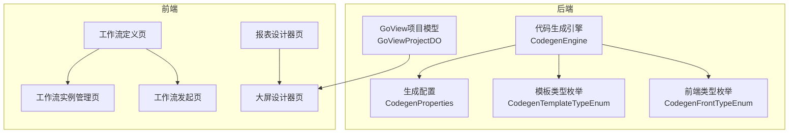
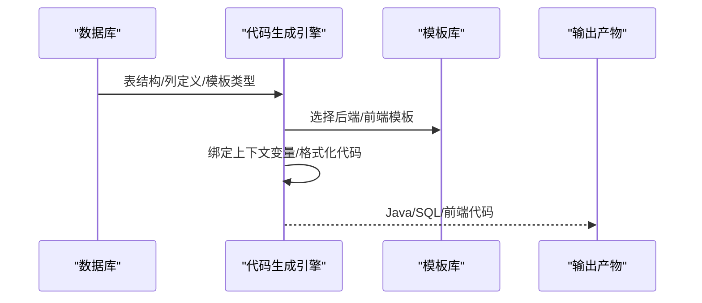
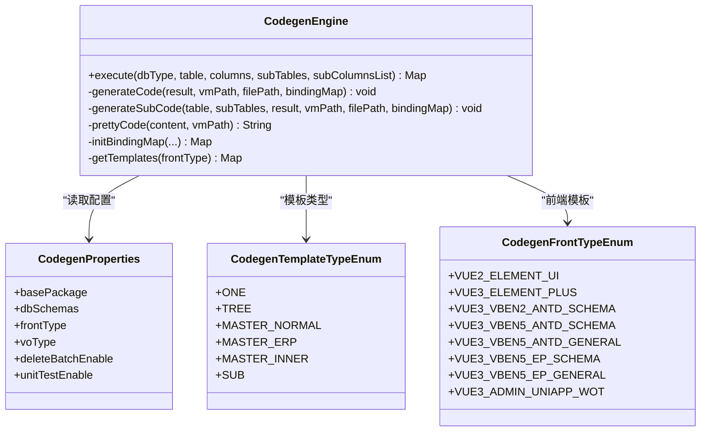
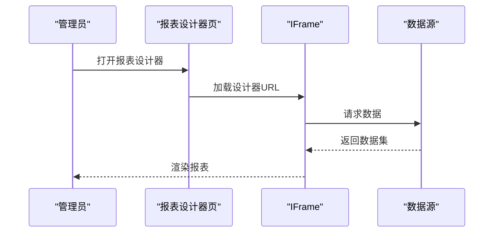
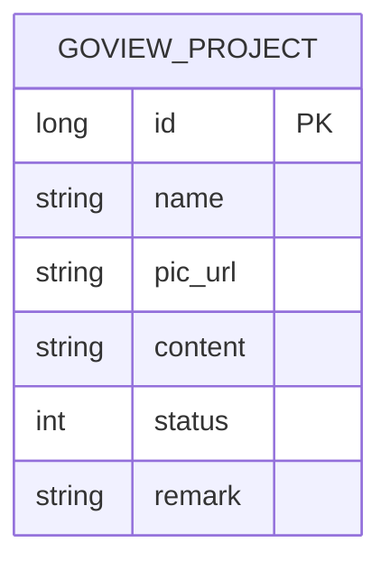
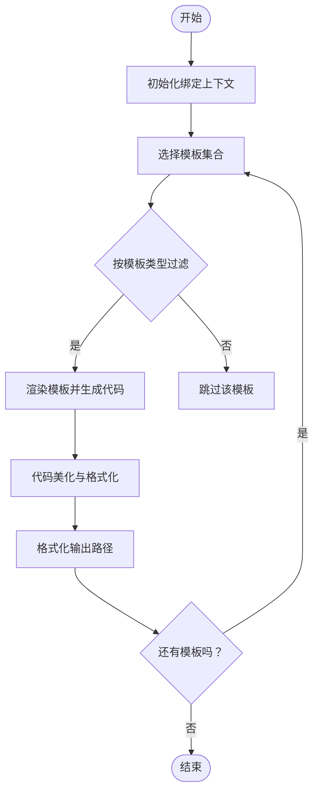
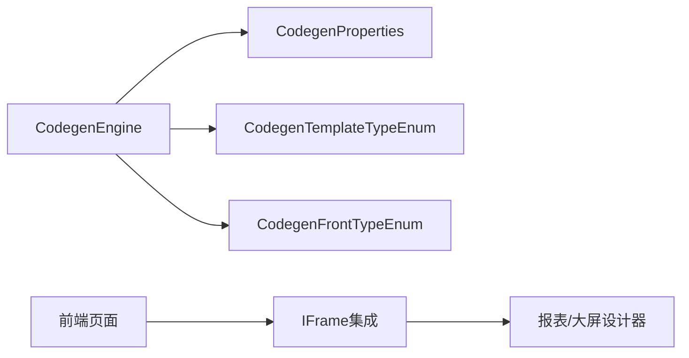

# 低代码开发

<cite>
**本文引用的文件**
- [CodegenEngine.java](file://backend/qiji-module-infra/src/main/java/com/qiji/cps/module/infra/service/codegen/inner/CodegenEngine.java)
- [CodegenProperties.java](file://backend/qiji-module-infra/src/main/java/com/qiji/cps/module/infra/framework/codegen/config/CodegenProperties.java)
- [CodegenTemplateTypeEnum.java](file://backend/qiji-module-infra/src/main/java/com/qiji/cps/module/infra/enums/codegen/CodegenTemplateTypeEnum.java)
- [CodegenFrontTypeEnum.java](file://backend/qiji-module-infra/src/main/java/com/qiji/cps/module/infra/enums/codegen/CodegenFrontTypeEnum.java)
- [codegen-rules.md](file://agent_improvement/memory/codegen-rules.md)
- [index.vue（GoView 大屏设计器）](file://frontend/admin-vue3/src/views/report/goview/index.vue)
- [index.vue（JimuReport 报表设计器）](file://frontend/admin-vue3/src/views/report/jmreport/index.vue)
- [index.vue（工作流定义）](file://frontend/admin-vue3/src/views/bpm/model/definition/index.vue)
- [index.vue（工作流实例管理）](file://frontend/admin-vue3/src/views/bpm/processInstance/manager/index.vue)
- [index.vue（工作流发起）](file://frontend/admin-vue3/src/views/bpm/processInstance/create/index.vue)
- [GoViewProjectDO.java](file://backend/qiji-module-report/src/main/java/com/qiji/cps/module/report/dal/dataobject/goview/GoViewProjectDO.java)
</cite>

## 目录
1. [简介](#简介)
2. [项目结构](#项目结构)
3. [核心组件](#核心组件)
4. [架构总览](#架构总览)
5. [详细组件分析](#详细组件分析)
6. [依赖分析](#依赖分析)
7. [性能考虑](#性能考虑)
8. [故障排查指南](#故障排查指南)
9. [结论](#结论)
10. [附录](#附录)

## 简介
本文件面向AgenticCPS低代码开发平台，围绕“代码生成器”“可视化工作流”“报表设计器与大屏设计器”三大能力，提供从数据库表设计、生成器配置、模板选择、代码定制，到流程设计、节点配置、权限控制、流程监控，再到报表与大屏的组件配置、数据绑定与响应式适配的完整指导。同时给出Velocity模板语法要点、生成逻辑控制、批量生成流程与输出格式定制方法，并总结最佳实践与常见问题。

## 项目结构
AgenticCPS采用前后端分离架构，后端以Spring Boot微服务模块化组织，前端提供多套UI模板（Vue2/Vue3、Element Plus、Vben、UniApp等）。低代码能力主要分布在：
- 后端代码生成：位于基础设施模块，通过Velocity模板引擎渲染生成Java/SQL/前端代码。
- 前端集成：通过iframe嵌入报表与大屏设计器；工作流页面基于Element Plus/Vben组件。
- 数据模型：报表大屏项目持久化为GoViewProjectDO；工作流基于Flowable。



**图表来源**
- [CodegenEngine.java:60-97](file://backend/qiji-module-infra/src/main/java/com/qiji/cps/module/infra/service/codegen/inner/CodegenEngine.java#L60-L97)
- [CodegenProperties.java:16-58](file://backend/qiji-module-infra/src/main/java/com/qiji/cps/module/infra/framework/codegen/config/CodegenProperties.java#L16-L58)
- [CodegenTemplateTypeEnum.java:16-53](file://backend/qiji-module-infra/src/main/java/com/qiji/cps/module/infra/enums/codegen/CodegenTemplateTypeEnum.java#L16-L53)
- [CodegenFrontTypeEnum.java:13-35](file://backend/qiji-module-infra/src/main/java/com/qiji/cps/module/infra/enums/codegen/CodegenFrontTypeEnum.java#L13-L35)
- [GoViewProjectDO.java:23-57](file://backend/qiji-module-report/src/main/java/com/qiji/cps/module/report/dal/dataobject/goview/GoViewProjectDO.java#L23-L57)
- [index.vue（工作流定义）:1-31](file://frontend/admin-vue3/src/views/bpm/model/definition/index.vue#L1-L31)
- [index.vue（工作流实例管理）:1-43](file://frontend/admin-vue3/src/views/bpm/processInstance/manager/index.vue#L1-L43)
- [index.vue（工作流发起）:64-100](file://frontend/admin-vue3/src/views/bpm/processInstance/create/index.vue#L64-L100)
- [index.vue（报表设计器）:1-16](file://frontend/admin-vue3/src/views/report/jmreport/index.vue#L1-L16)
- [index.vue（大屏设计器）:1-17](file://frontend/admin-vue3/src/views/report/goview/index.vue#L1-L17)

**章节来源**
- [CodegenEngine.java:60-97](file://backend/qiji-module-infra/src/main/java/com/qiji/cps/module/infra/service/codegen/inner/CodegenEngine.java#L60-L97)
- [CodegenProperties.java:16-58](file://backend/qiji-module-infra/src/main/java/com/qiji/cps/module/infra/framework/codegen/config/CodegenProperties.java#L16-L58)
- [GoViewProjectDO.java:23-57](file://backend/qiji-module-report/src/main/java/com/qiji/cps/module/report/dal/dataobject/goview/GoViewProjectDO.java#L23-L57)

## 核心组件
- 代码生成引擎：负责根据表结构与模板生成后端Java代码、Mapper XML、前端页面与API文件，支持多种前端模板与主子表/树表/ERP模式。
- 生成配置：集中管理基础包、数据库schema、前端模板类型、VO类型、批量删除开关、单元测试开关等。
- 模板类型与前端类型：定义单表、树表、主子表（普通/ERP/内嵌）、以及多种前端模板族（Element Plus、Vben、UniApp等）。
- 报表与大屏：通过iframe集成外部设计器；项目数据持久化至GoViewProjectDO。
- 工作流：基于Flowable，提供双设计器（BPMN与仿钉钉/飞书），支持流程定义、实例管理与发起。

**章节来源**
- [CodegenEngine.java:60-97](file://backend/qiji-module-infra/src/main/java/com/qiji/cps/module/infra/service/codegen/inner/CodegenEngine.java#L60-L97)
- [CodegenProperties.java:16-58](file://backend/qiji-module-infra/src/main/java/com/qiji/cps/module/infra/framework/codegen/config/CodegenProperties.java#L16-L58)
- [CodegenTemplateTypeEnum.java:16-53](file://backend/qiji-module-infra/src/main/java/com/qiji/cps/module/infra/enums/codegen/CodegenTemplateTypeEnum.java#L16-L53)
- [CodegenFrontTypeEnum.java:13-35](file://backend/qiji-module-infra/src/main/java/com/qiji/cps/module/infra/enums/codegen/CodegenFrontTypeEnum.java#L13-L35)
- [index.vue（大屏设计器）:1-17](file://frontend/admin-vue3/src/views/report/goview/index.vue#L1-L17)
- [index.vue（报表设计器）:1-16](file://frontend/admin-vue3/src/views/report/jmreport/index.vue#L1-L16)
- [index.vue（工作流定义）:1-31](file://frontend/admin-vue3/src/views/bpm/model/definition/index.vue#L1-L31)

## 架构总览
低代码开发的端到端流程如下：
- 设计阶段：数据库表设计 → 选择模板类型（单表/树表/主子表）与前端模板 → 配置生成参数。
- 生成阶段：引擎按模板渲染，输出Java、Mapper XML、前端页面与API文件。
- 集成阶段：前端通过iframe集成报表/大屏设计器；工作流页面提供流程定义与实例管理。
- 运行阶段：权限控制与流程监控贯穿系统。



**图表来源**
- [CodegenEngine.java:321-351](file://backend/qiji-module-infra/src/main/java/com/qiji/cps/module/infra/service/codegen/inner/CodegenEngine.java#L321-L351)
- [codegen-rules.md:1-788](file://agent_improvement/memory/codegen-rules.md#L1-L788)

## 详细组件分析

### 代码生成器使用指南
- 数据库表设计原则
  - 主键字段：明确主键，确保唯一性与高选择性。
  - 字段命名：遵循小写中划线风格，便于生成HTTP路径与前端变量。
  - 枚举字段：使用字典转换器与Excel导出注解，保证一致性。
  - 树表字段：设置父节点与名称字段，便于层级查询与渲染。
  - 主子表：明确子表关联字段与主键，支持独立增删改查。
- 生成器配置选项
  - 基础包与数据库schema：统一基础包，避免跨模块冲突。
  - 前端模板类型：根据团队UI栈选择（Element Plus/Vben/UniApp）。
  - VO类型：选择VO或DO作为请求/响应载体，影响生成的API与页面。
  - 批量删除与单元测试：按需开启，减少冗余代码。
- 模板选择策略
  - 单表：标准CRUD+分页。
  - 树表：列表查询+父子校验。
  - 主子表：普通/ERP/内嵌模式，分别对应独立子表与内嵌子表。
- 代码定制化方法
  - Velocity模板：利用上下文变量（如类名、字段、权限前缀）动态生成。
  - 代码美化：对Vue模板进行逗号、字典、日期格式化等统一处理。
  - 条件生成：针对树表/主子表/ERP模式，按模板类型过滤生成项。



**图表来源**
- [CodegenEngine.java:60-97](file://backend/qiji-module-infra/src/main/java/com/qiji/cps/module/infra/service/codegen/inner/CodegenEngine.java#L60-L97)
- [CodegenEngine.java:520-543](file://backend/qiji-module-infra/src/main/java/com/qiji/cps/module/infra/service/codegen/inner/CodegenEngine.java#L520-L543)
- [CodegenProperties.java:16-58](file://backend/qiji-module-infra/src/main/java/com/qiji/cps/module/infra/framework/codegen/config/CodegenProperties.java#L16-L58)
- [CodegenTemplateTypeEnum.java:16-53](file://backend/qiji-module-infra/src/main/java/com/qiji/cps/module/infra/enums/codegen/CodegenTemplateTypeEnum.java#L16-L53)
- [CodegenFrontTypeEnum.java:13-35](file://backend/qiji-module-infra/src/main/java/com/qiji/cps/module/infra/enums/codegen/CodegenFrontTypeEnum.java#L13-L35)

**章节来源**
- [CodegenEngine.java:321-351](file://backend/qiji-module-infra/src/main/java/com/qiji/cps/module/infra/service/codegen/inner/CodegenEngine.java#L321-L351)
- [CodegenEngine.java:401-428](file://backend/qiji-module-infra/src/main/java/com/qiji/cps/module/infra/service/codegen/inner/CodegenEngine.java#L401-L428)
- [CodegenEngine.java:430-518](file://backend/qiji-module-infra/src/main/java/com/qiji/cps/module/infra/service/codegen/inner/CodegenEngine.java#L430-L518)
- [CodegenEngine.java:545-575](file://backend/qiji-module-infra/src/main/java/com/qiji/cps/module/infra/service/codegen/inner/CodegenEngine.java#L545-L575)
- [CodegenProperties.java:16-58](file://backend/qiji-module-infra/src/main/java/com/qiji/cps/module/infra/framework/codegen/config/CodegenProperties.java#L16-L58)
- [codegen-rules.md:1-788](file://agent_improvement/memory/codegen-rules.md#L1-L788)

### 可视化工作流设计
- 流程设计器使用
  - 双设计器：BPMN设计器与仿钉钉/飞书设计器，前者适合复杂编排，后者适合轻量配置。
  - 流程定义：支持流程图标、可见范围（全部/指定用户）、流程类型等。
  - 实例管理：支持按发起人、流程名称、分类等筛选，查看运行中的流程实例。
  - 发起流程：按流程分类与名称检索，选择流程定义后填写表单提交。
- 节点配置说明
  - 起始/结束节点：定义流程入口与出口。
  - 用户任务：配置审批人、候选人、任务分配策略。
  - 网关：并行/串行/排他网关，控制分支与合并。
  - 子流程：复用已有流程，提升可维护性。
- 权限控制设置
  - 流程定义可见范围：支持全局可见或指定用户可见。
  - 任务执行权限：结合角色与岗位，限制任务领取与处理。
- 流程监控管理
  - 实时跟踪：查看流程实例状态、节点执行情况。
  - 日志审计：记录流程操作与异常，便于回溯。

```mermaid
sequenceDiagram
participant U as "用户"
participant Def as "流程定义页"
participant InstMgr as "实例管理页"
participant Create as "发起页"
participant Engine as "工作流引擎"
U->>Def : 查看流程定义
U->>InstMgr : 筛选与查看实例
U->>Create : 搜索流程定义
U->>Create : 填写表单并提交
Create->>Engine : 提交流程实例
Engine-->>U : 返回流程实例ID
```

**图表来源**
- [index.vue（工作流定义）:1-31](file://frontend/admin-vue3/src/views/bpm/model/definition/index.vue#L1-L31)
- [index.vue（工作流实例管理）:1-43](file://frontend/admin-vue3/src/views/bpm/processInstance/manager/index.vue#L1-L43)
- [index.vue（工作流发起）:64-100](file://frontend/admin-vue3/src/views/bpm/processInstance/create/index.vue#L64-L100)

**章节来源**
- [index.vue（工作流定义）:1-31](file://frontend/admin-vue3/src/views/bpm/model/definition/index.vue#L1-L31)
- [index.vue（工作流实例管理）:1-43](file://frontend/admin-vue3/src/views/bpm/processInstance/manager/index.vue#L1-L43)
- [index.vue（工作流发起）:64-100](file://frontend/admin-vue3/src/views/bpm/processInstance/create/index.vue#L64-L100)

### 报表设计器架构
- 报表设计器使用
  - 集成方式：通过iframe加载报表设计器，支持访问令牌传递。
  - 功能覆盖：数据报表、图形报表、打印设计。
- 图表组件配置
  - 坐标轴、系列、图例、提示框等配置项，支持多维数据展示。
  - 日期/区间选择、字典联动等交互。
- 数据源配置
  - 支持多数据源接入，统一通过后端接口或直连数据库。
  - 导出与打印：支持Excel导出与打印预览。
- 样式定制
  - 主题色、字体、边距、背景等样式可配置，满足品牌一致性。



**图表来源**
- [index.vue（报表设计器）:1-16](file://frontend/admin-vue3/src/views/report/jmreport/index.vue#L1-L16)

**章节来源**
- [index.vue（报表设计器）:1-16](file://frontend/admin-vue3/src/views/report/jmreport/index.vue#L1-L16)

### 大屏设计器实现
- 大屏布局设计
  - 项目化管理：每个大屏对应一个GoView项目，包含名称、预览图、内容JSON、状态与备注。
  - 内容JSON：以字符串存储，设计器解析后渲染组件。
- 组件拖拽配置
  - 支持图表、文本、容器等组件拖拽，配置数据绑定与样式。
- 数据绑定
  - 组件属性与数据源字段映射，支持实时刷新。
- 响应式适配
  - 布局网格与组件尺寸自适应不同分辨率，保证在移动端与桌面端一致体验。



**图表来源**
- [GoViewProjectDO.java:23-57](file://backend/qiji-module-report/src/main/java/com/qiji/cps/module/report/dal/dataobject/goview/GoViewProjectDO.java#L23-L57)

**章节来源**
- [index.vue（大屏设计器）:1-17](file://frontend/admin-vue3/src/views/report/goview/index.vue#L1-L17)
- [GoViewProjectDO.java:23-57](file://backend/qiji-module-report/src/main/java/com/qiji/cps/module/report/dal/dataobject/goview/GoViewProjectDO.java#L23-L57)

### 代码生成规则详解
- Velocity模板语法要点
  - 变量：${variable}，如类名、字段、权限前缀。
  - 控制：#if/#elseif/#else/#end，#foreach迭代子表。
  - 工具：字符串转换、集合处理、日期格式化。
- 生成逻辑控制
  - 模板类型过滤：按树表/主子表/ERP模式决定是否生成特定模板。
  - 条件生成：PageReqVO/LsitReqVO按模板类型动态启用。
  - 文件路径格式化：将模板变量替换为实际包路径与文件名。
- 批量生成流程
  - 输入：表定义、列定义、子表与子列定义、模板类型、前端类型。
  - 输出：后端Java、Mapper XML、前端页面与API文件。
- 输出格式定制
  - 代码美化：统一Vue模板逗号、字典、日期格式化，修正$refs。
  - 路径定制：按模块/业务名/类名生成标准目录结构。



**图表来源**
- [CodegenEngine.java:321-351](file://backend/qiji-module-infra/src/main/java/com/qiji/cps/module/infra/service/codegen/inner/CodegenEngine.java#L321-L351)
- [CodegenEngine.java:401-428](file://backend/qiji-module-infra/src/main/java/com/qiji/cps/module/infra/service/codegen/inner/CodegenEngine.java#L401-L428)
- [CodegenEngine.java:545-575](file://backend/qiji-module-infra/src/main/java/com/qiji/cps/module/infra/service/codegen/inner/CodegenEngine.java#L545-L575)

**章节来源**
- [CodegenEngine.java:321-351](file://backend/qiji-module-infra/src/main/java/com/qiji/cps/module/infra/service/codegen/inner/CodegenEngine.java#L321-L351)
- [CodegenEngine.java:401-428](file://backend/qiji-module-infra/src/main/java/com/qiji/cps/module/infra/service/codegen/inner/CodegenEngine.java#L401-L428)
- [CodegenEngine.java:545-575](file://backend/qiji-module-infra/src/main/java/com/qiji/cps/module/infra/service/codegen/inner/CodegenEngine.java#L545-L575)
- [codegen-rules.md:1-788](file://agent_improvement/memory/codegen-rules.md#L1-L788)

## 依赖分析
- 组件耦合
  - CodegenEngine依赖配置与枚举，模板类型与前端类型共同决定生成集合。
  - 前端通过iframe集成报表/大屏，与后端生成代码解耦。
- 外部依赖
  - 模板引擎：Velocity（通过hutool封装）。
  - 工作流：Flowable。
  - 报表/大屏：GoView/JimuReport外部设计器。
- 潜在风险
  - 模板变量缺失或拼写错误导致生成失败。
  - 前端模板与后端生成代码版本不一致引发运行期问题。



**图表来源**
- [CodegenEngine.java:60-97](file://backend/qiji-module-infra/src/main/java/com/qiji/cps/module/infra/service/codegen/inner/CodegenEngine.java#L60-L97)
- [CodegenProperties.java:16-58](file://backend/qiji-module-infra/src/main/java/com/qiji/cps/module/infra/framework/codegen/config/CodegenProperties.java#L16-L58)
- [index.vue（大屏设计器）:1-17](file://frontend/admin-vue3/src/views/report/goview/index.vue#L1-L17)
- [index.vue（报表设计器）:1-16](file://frontend/admin-vue3/src/views/report/jmreport/index.vue#L1-L16)

**章节来源**
- [CodegenEngine.java:60-97](file://backend/qiji-module-infra/src/main/java/com/qiji/cps/module/infra/service/codegen/inner/CodegenEngine.java#L60-L97)
- [CodegenProperties.java:16-58](file://backend/qiji-module-infra/src/main/java/com/qiji/cps/module/infra/framework/codegen/config/CodegenProperties.java#L16-L58)

## 性能考虑
- 模板渲染优化
  - 合理拆分模板，避免单模板过大。
  - 使用上下文缓存与路径格式化复用。
- 生成产物体积控制
  - 按需生成：关闭单元测试与VO类型开关减少冗余。
  - 代码美化与格式化在生成后一次性完成，避免重复处理。
- 前端集成
  - IFrame懒加载，减少首屏压力。
  - 报表/大屏数据按需加载，支持分页与缓存。

## 故障排查指南
- 生成失败
  - 检查模板变量是否正确：类名、字段名、权限前缀等。
  - 确认模板类型与前端类型组合是否支持目标功能。
- 前端页面异常
  - Vue模板逗号与字典/日期格式化问题：参考代码美化逻辑。
  - $refs引用错误：统一替换为$refs。
- 工作流问题
  - 流程定义不可见：检查可见范围配置。
  - 任务无法领取：核对候选人/角色权限。
- 报表/大屏问题
  - iframe加载失败：确认访问令牌与URL参数。
  - 数据为空：检查数据源配置与查询条件。

**章节来源**
- [CodegenEngine.java:401-428](file://backend/qiji-module-infra/src/main/java/com/qiji/cps/module/infra/service/codegen/inner/CodegenEngine.java#L401-L428)
- [index.vue（大屏设计器）:8-16](file://frontend/admin-vue3/src/views/report/goview/index.vue#L8-L16)
- [index.vue（报表设计器）:8-15](file://frontend/admin-vue3/src/views/report/jmreport/index.vue#L8-L15)

## 结论
AgenticCPS低代码开发通过“代码生成器+可视化工作流+报表/大屏设计器”的一体化能力，显著降低重复劳动、提升交付效率。建议在项目初期严格遵循数据库表设计与命名规范，合理选择模板类型与前端模板，结合权限与流程监控保障运行质量；在持续演进中，逐步沉淀模板与最佳实践，形成可复用的低代码资产。

## 附录
- 最佳实践
  - 表设计：主键、枚举、树表字段、主子表关联清晰。
  - 生成配置：统一基础包与前端模板，按需开启批量删除与单元测试。
  - 模板定制：保持模板简洁，复杂逻辑下沉到工具类或后置处理。
  - 集成测试：生成后进行端到端验证，确保前后端协同。
- 常见问题
  - 模板变量缺失：对照上下文变量清单逐一核对。
  - 前端格式化报错：参考代码美化规则修正模板。
  - 工作流权限不足：检查角色与候选配置。
  - 报表/大屏无数据：核对数据源与查询条件。