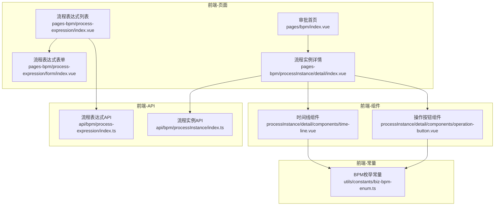
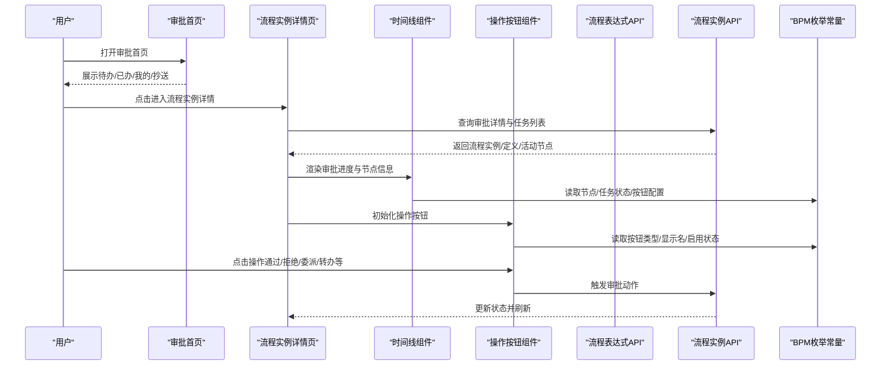
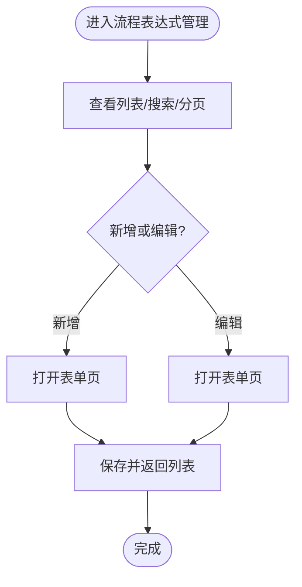
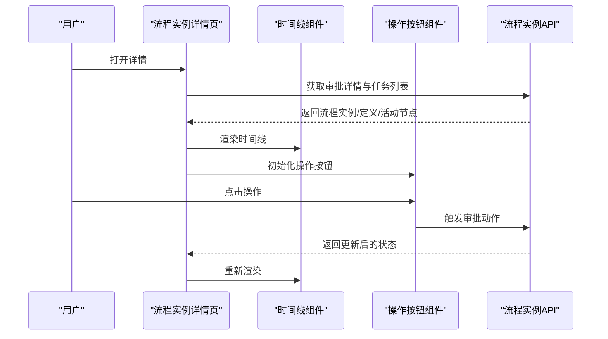
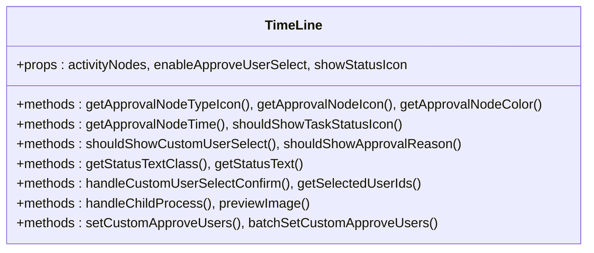
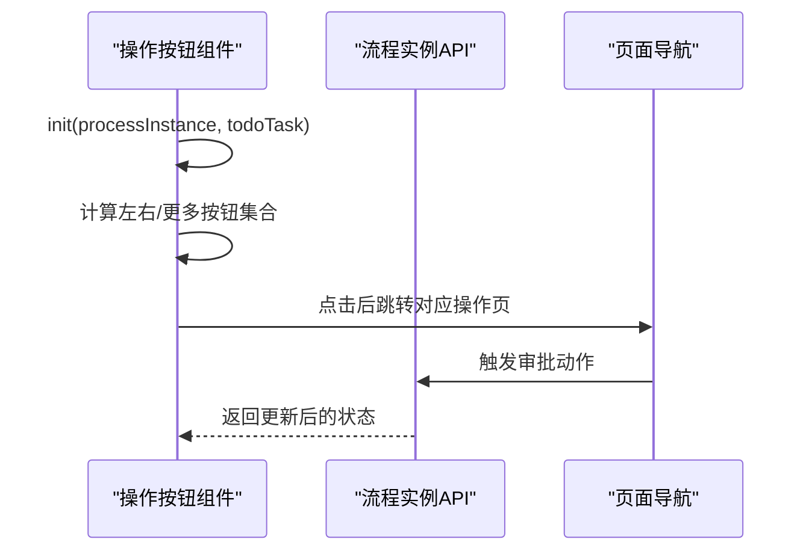
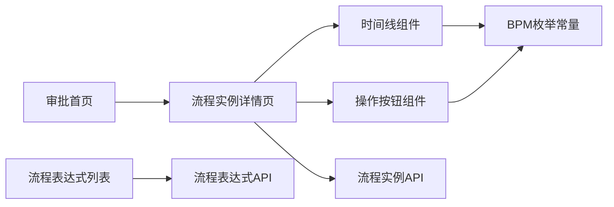

# 可视化工作流

<cite>
**本文引用的文件**
- [前端-流程表达式-列表页](file://frontend/admin-uniapp/src/pages-bpm/process-expression/index.vue)
- [前端-流程表达式-表单页](file://frontend/admin-uniapp/src/pages-bpm/process-expression/form/index.vue)
- [前端-流程实例-详情页](file://frontend/admin-uniapp/src/pages-bpm/processInstance/detail/index.vue)
- [前端-审批首页](file://frontend/admin-uniapp/src/pages/bpm/index.vue)
- [前端-流程实例-时间线组件](file://frontend/admin-uniapp/src/pages-bpm/processInstance/detail/components/time-line.vue)
- [前端-流程实例-操作按钮组件](file://frontend/admin-uniapp/src/pages-bpm/processInstance/detail/components/operation-button.vue)
- [前端-API-流程表达式](file://frontend/admin-uniapp/src/api/bpm/process-expression/index.ts)
- [前端-API-流程实例](file://frontend/admin-uniapp/src/api/bpm/processInstance/index.ts)
- [前端-通用常量-BPM枚举](file://frontend/admin-uniapp/src/utils/constants/biz-bpm-enum.ts)
</cite>

## 目录
1. [简介](#简介)
2. [项目结构](#项目结构)
3. [核心组件](#核心组件)
4. [架构总览](#架构总览)
5. [详细组件分析](#详细组件分析)
6. [依赖关系分析](#依赖关系分析)
7. [性能考量](#性能考量)
8. [故障排除指南](#故障排除指南)
9. [结论](#结论)
10. [附录](#附录)

## 简介
本文件面向AgenticCPS的“可视化工作流设计器”使用与运维，聚焦以下目标：
- 流程设计器使用方法：节点拖拽、连线绘制、节点属性配置
- 节点配置项详解：开始节点、结束节点、用户任务、服务任务、并行网关、排他网关等
- 权限控制：任务分配策略、角色权限配置、审批流程控制
- 流程监控：流程实例跟踪、任务状态监控、执行日志查看、性能分析
- 最佳实践：流程复杂度控制、错误处理机制、回滚策略
- 实战案例与故障排除

说明：当前仓库前端代码主要覆盖“流程表达式管理”“流程实例审批”“审批首页”等模块；“可视化设计器”的具体实现文件在当前目录中未直接呈现。本文将基于现有前端能力，给出可落地的使用指南与扩展建议，并标注“概念性”部分以示区分。

## 项目结构
前端采用Vue生态与UniApp跨端框架，BPM相关页面集中在admin-uniapp/src/pages-bpm与admin-uniapp/src/pages目录下，API层位于admin-uniapp/src/api/bpm。

图表来源
- [前端-审批首页:1-62](file://frontend/admin-uniapp/src/pages/bpm/index.vue#L1-L62)
- [前端-流程表达式-列表页:1-162](file://frontend/admin-uniapp/src/pages-bpm/process-expression/index.vue#L1-L162)
- [前端-流程表达式-表单页:1-141](file://frontend/admin-uniapp/src/pages-bpm/process-expression/form/index.vue#L1-L141)
- [前端-流程实例-详情页:1-148](file://frontend/admin-uniapp/src/pages-bpm/processInstance/detail/index.vue#L1-L148)
- [前端-流程实例-时间线组件:1-395](file://frontend/admin-uniapp/src/pages-bpm/processInstance/detail/components/time-line.vue#L1-L395)
- [前端-流程实例-操作按钮组件:1-312](file://frontend/admin-uniapp/src/pages-bpm/processInstance/detail/components/operation-button.vue#L1-L312)
- [前端-API-流程表达式](file://frontend/admin-uniapp/src/api/bpm/process-expression/index.ts)
- [前端-API-流程实例](file://frontend/admin-uniapp/src/api/bpm/processInstance/index.ts)
- [前端-通用常量-BPM枚举](file://frontend/admin-uniapp/src/utils/constants/biz-bpm-enum.ts)

章节来源
- [前端-审批首页:1-62](file://frontend/admin-uniapp/src/pages/bpm/index.vue#L1-L62)
- [前端-流程表达式-列表页:1-162](file://frontend/admin-uniapp/src/pages-bpm/process-expression/index.vue#L1-L162)
- [前端-流程表达式-表单页:1-141](file://frontend/admin-uniapp/src/pages-bpm/process-expression/form/index.vue#L1-L141)
- [前端-流程实例-详情页:1-148](file://frontend/admin-uniapp/src/pages-bpm/processInstance/detail/index.vue#L1-L148)
- [前端-流程实例-时间线组件:1-395](file://frontend/admin-uniapp/src/pages-bpm/processInstance/detail/components/time-line.vue#L1-L395)
- [前端-流程实例-操作按钮组件:1-312](file://frontend/admin-uniapp/src/pages-bpm/processInstance/detail/components/operation-button.vue#L1-L312)
- [前端-API-流程表达式](file://frontend/admin-uniapp/src/api/bpm/process-expression/index.ts)
- [前端-API-流程实例](file://frontend/admin-uniapp/src/api/bpm/processInstance/index.ts)
- [前端-通用常量-BPM枚举](file://frontend/admin-uniapp/src/utils/constants/biz-bpm-enum.ts)

## 核心组件
- 审批首页：提供“待办/已办/我的/抄送”四类任务入口，统一承载BPM任务流。
- 流程表达式管理：支持表达式新增、编辑、分页查询与状态管理，便于流程规则与条件表达式维护。
- 流程实例详情：展示流程发起人、提交时间、表单数据、审批进度（时间线）、操作按钮区（通过/拒绝/委派/转办/加签/减签/退回/取消等）。
- 时间线组件：按节点类型与任务状态渲染审批轨迹，支持候选/进行中任务、审批意见、签名预览、子流程跳转。
- 操作按钮组件：根据运行中任务的按钮配置动态生成操作按钮，支持更多操作弹窗、按钮显隐与文案定制。

章节来源
- [前端-审批首页:1-62](file://frontend/admin-uniapp/src/pages/bpm/index.vue#L1-L62)
- [前端-流程表达式-列表页:1-162](file://frontend/admin-uniapp/src/pages-bpm/process-expression/index.vue#L1-L162)
- [前端-流程表达式-表单页:1-141](file://frontend/admin-uniapp/src/pages-bpm/process-expression/form/index.vue#L1-L141)
- [前端-流程实例-详情页:1-148](file://frontend/admin-uniapp/src/pages-bpm/processInstance/detail/index.vue#L1-L148)
- [前端-流程实例-时间线组件:1-395](file://frontend/admin-uniapp/src/pages-bpm/processInstance/detail/components/time-line.vue#L1-L395)
- [前端-流程实例-操作按钮组件:1-312](file://frontend/admin-uniapp/src/pages-bpm/processInstance/detail/components/operation-button.vue#L1-L312)

## 架构总览
下图展示从前端页面到组件再到API与常量的调用关系，体现“审批首页—流程实例详情—时间线/操作按钮—API—BPM枚举”的闭环。

图表来源
- [前端-审批首页:1-62](file://frontend/admin-uniapp/src/pages/bpm/index.vue#L1-L62)
- [前端-流程实例-详情页:1-148](file://frontend/admin-uniapp/src/pages-bpm/processInstance/detail/index.vue#L1-L148)
- [前端-流程实例-时间线组件:1-395](file://frontend/admin-uniapp/src/pages-bpm/processInstance/detail/components/time-line.vue#L1-L395)
- [前端-流程实例-操作按钮组件:1-312](file://frontend/admin-uniapp/src/pages-bpm/processInstance/detail/components/operation-button.vue#L1-L312)
- [前端-API-流程表达式](file://frontend/admin-uniapp/src/api/bpm/process-expression/index.ts)
- [前端-API-流程实例](file://frontend/admin-uniapp/src/api/bpm/processInstance/index.ts)
- [前端-通用常量-BPM枚举](file://frontend/admin-uniapp/src/utils/constants/biz-bpm-enum.ts)

## 详细组件分析

### 组件A：流程表达式管理（新增/编辑/列表）
- 功能要点
  - 列表页：分页加载、状态标签、创建时间、搜索重置、新增入口。
  - 表单页：名称、状态、表达式三要素，必填校验，保存成功提示与返回。
- 使用建议
  - 表达式命名规范：清晰可读，避免歧义。
  - 状态开关：上线前务必核对状态，防止误发布。
  - 表达式复杂度：建议拆分为多个表达式组合，便于维护与审计。

图表来源
- [前端-流程表达式-列表页:1-162](file://frontend/admin-uniapp/src/pages-bpm/process-expression/index.vue#L1-L162)
- [前端-流程表达式-表单页:1-141](file://frontend/admin-uniapp/src/pages-bpm/process-expression/form/index.vue#L1-L141)

章节来源
- [前端-流程表达式-列表页:1-162](file://frontend/admin-uniapp/src/pages-bpm/process-expression/index.vue#L1-L162)
- [前端-流程表达式-表单页:1-141](file://frontend/admin-uniapp/src/pages-bpm/process-expression/form/index.vue#L1-L141)

### 组件B：流程实例详情（审批进度与操作）
- 功能要点
  - 基本信息：标题、发起人、部门、提交时间、状态图标。
  - 表单详情：随流程定义动态渲染。
  - 审批进度：时间线组件展示节点类型、任务状态、审批意见、签名等。
  - 操作按钮：根据任务状态与按钮配置动态生成，支持更多操作弹窗。
- 使用建议
  - 审批意见：建议强制填写必要节点，便于审计。
  - 签名预览：确保签名图片可访问与合规。
  - 子流程：点击“查看子流程”可快速定位子流程实例。

图表来源
- [前端-流程实例-详情页:1-148](file://frontend/admin-uniapp/src/pages-bpm/processInstance/detail/index.vue#L1-L148)
- [前端-流程实例-时间线组件:1-395](file://frontend/admin-uniapp/src/pages-bpm/processInstance/detail/components/time-line.vue#L1-L395)
- [前端-流程实例-操作按钮组件:1-312](file://frontend/admin-uniapp/src/pages-bpm/processInstance/detail/components/operation-button.vue#L1-L312)
- [前端-API-流程实例](file://frontend/admin-uniapp/src/api/bpm/processInstance/index.ts)

章节来源
- [前端-流程实例-详情页:1-148](file://frontend/admin-uniapp/src/pages-bpm/processInstance/detail/index.vue#L1-L148)
- [前端-流程实例-时间线组件:1-395](file://frontend/admin-uniapp/src/pages-bpm/processInstance/detail/components/time-line.vue#L1-L395)
- [前端-流程实例-操作按钮组件:1-312](file://frontend/admin-uniapp/src/pages-bpm/processInstance/detail/components/operation-button.vue#L1-L312)

### 组件C：时间线组件（节点类型与状态）
- 功能要点
  - 节点类型图标：开始用户、用户任务、服务任务、并行分支、条件分支、子流程等。
  - 任务状态图标：未开始、待审批、已通过、已拒绝、已取消、退回、委派中、审批中等。
  - 候选/进行中任务：支持展示候选用户与进行中任务，含部门、状态、审批意见、签名。
  - 自定义选择审批人：支持在特定候选策略下选择审批人。
  - 子流程跳转：点击“查看子流程”进入子流程实例详情。
- 使用建议
  - 状态一致性：确保节点状态与任务状态一致，避免误导。
  - 候选策略：合理设置候选策略，避免审批人过多导致拥堵。
  - 子流程：建议在子流程中复用主流程的关键节点与审批意见。

图表来源
- [前端-流程实例-时间线组件:1-395](file://frontend/admin-uniapp/src/pages-bpm/processInstance/detail/components/time-line.vue#L1-L395)

章节来源
- [前端-流程实例-时间线组件:1-395](file://frontend/admin-uniapp/src/pages-bpm/processInstance/detail/components/time-line.vue#L1-L395)

### 组件D：操作按钮组件（审批动作）
- 功能要点
  - 动态生成：根据任务按钮配置生成左侧图标+更多操作与右侧主按钮。
  - 按钮类型：通过、拒绝、委派、转办、加签、减签、退回、流程发起人取消等。
  - 显隐逻辑：依据任务状态、按钮配置、当前用户身份决定是否显示。
  - 跳转页面：点击后跳转至对应操作页面（如审核、委派、转办、加签、退回、取消）。
- 使用建议
  - 按钮配置：通过后端下发的按钮设置灵活控制显隐与文案。
  - 审批节奏：合理设置“更多操作”，避免按钮过多影响操作效率。
  - 回滚策略：退回/取消需结合流程定义与业务规则，避免误操作。

图表来源
- [前端-流程实例-操作按钮组件:1-312](file://frontend/admin-uniapp/src/pages-bpm/processInstance/detail/components/operation-button.vue#L1-L312)
- [前端-API-流程实例](file://frontend/admin-uniapp/src/api/bpm/processInstance/index.ts)

章节来源
- [前端-流程实例-操作按钮组件:1-312](file://frontend/admin-uniapp/src/pages-bpm/processInstance/detail/components/operation-button.vue#L1-L312)

## 依赖关系分析
- 页面依赖：审批首页依赖流程实例详情；流程实例详情依赖时间线与操作按钮组件；两者均依赖API与BPM枚举。
- 组件内聚：时间线与操作按钮组件职责明确，分别负责“展示”和“交互”，耦合度低。
- 外部依赖：API层负责与后端交互，常量层提供节点/任务/按钮类型定义，保证前端行为一致性。

图表来源
- [前端-审批首页:1-62](file://frontend/admin-uniapp/src/pages/bpm/index.vue#L1-L62)
- [前端-流程实例-详情页:1-148](file://frontend/admin-uniapp/src/pages-bpm/processInstance/detail/index.vue#L1-L148)
- [前端-流程实例-时间线组件:1-395](file://frontend/admin-uniapp/src/pages-bpm/processInstance/detail/components/time-line.vue#L1-L395)
- [前端-流程实例-操作按钮组件:1-312](file://frontend/admin-uniapp/src/pages-bpm/processInstance/detail/components/operation-button.vue#L1-L312)
- [前端-API-流程表达式](file://frontend/admin-uniapp/src/api/bpm/process-expression/index.ts)
- [frontend-通用常量-BPM枚举](file://frontend/admin-uniapp/src/utils/constants/biz-bpm-enum.ts)

章节来源
- [前端-审批首页:1-62](file://frontend/admin-uniapp/src/pages/bpm/index.vue#L1-L62)
- [前端-流程实例-详情页:1-148](file://frontend/admin-uniapp/src/pages-bpm/processInstance/detail/index.vue#L1-L148)
- [前端-流程实例-时间线组件:1-395](file://frontend/admin-uniapp/src/pages-bpm/processInstance/detail/components/time-line.vue#L1-L395)
- [前端-流程实例-操作按钮组件:1-312](file://frontend/admin-uniapp/src/pages-bpm/processInstance/detail/components/operation-button.vue#L1-L312)
- [前端-API-流程表达式](file://frontend/admin-uniapp/src/api/bpm/process-expression/index.ts)
- [前端-通用常量-BPM枚举](file://frontend/admin-uniapp/src/utils/constants/biz-bpm-enum.ts)

## 性能考量
- 列表分页与懒加载：列表页采用分页与触底加载，减少一次性渲染压力。
- 组件按需渲染：时间线与操作按钮组件仅在详情页初始化时渲染，避免全局重复渲染。
- 图片预览：签名图片采用预览模式，避免大图直接渲染造成卡顿。
- 状态缓存：组件内部使用响应式数据缓存用户选择与状态，降低重复请求。

## 故障排除指南
- 列表无数据或加载异常
  - 检查分页参数与状态切换逻辑，确认加载状态与总数匹配。
  - 参考路径：[前端-流程表达式-列表页:96-133](file://frontend/admin-uniapp/src/pages-bpm/process-expression/index.vue#L96-L133)
- 审批详情为空或参数错误
  - 确认传入的流程实例ID与任务ID有效，检查API返回结构。
  - 参考路径：[前端-流程实例-详情页:116-146](file://frontend/admin-uniapp/src/pages-bpm/processInstance/detail/index.vue#L116-L146)
- 操作按钮不显示或不可点击
  - 核对任务状态与按钮配置，确认当前用户身份满足触发条件。
  - 参考路径：[前端-流程实例-操作按钮组件:100-189](file://frontend/admin-uniapp/src/pages-bpm/processInstance/detail/components/operation-button.vue#L100-L189)
- 时间线节点状态异常
  - 对照BPM枚举常量，核对节点类型与任务状态映射。
  - 参考路径：[前端-通用常量-BPM枚举](file://frontend/admin-uniapp/src/utils/constants/biz-bpm-enum.ts)

章节来源
- [前端-流程表达式-列表页:96-133](file://frontend/admin-uniapp/src/pages-bpm/process-expression/index.vue#L96-L133)
- [前端-流程实例-详情页:116-146](file://frontend/admin-uniapp/src/pages-bpm/processInstance/detail/index.vue#L116-L146)
- [前端-流程实例-操作按钮组件:100-189](file://frontend/admin-uniapp/src/pages-bpm/processInstance/detail/components/operation-button.vue#L100-L189)
- [前端-通用常量-BPM枚举](file://frontend/admin-uniapp/src/utils/constants/biz-bpm-enum.ts)

## 结论
- 当前前端已具备完整的“流程表达式管理”与“流程实例审批”能力，覆盖了从列表到详情、从进度到操作的全流程体验。
- “可视化设计器”在本仓库中未直接呈现具体实现文件，但可通过“流程表达式”与“流程实例”两大模块进行扩展与集成。
- 建议后续补充：设计器节点面板、连线绘制交互、节点属性面板、流程校验与发布机制、流程监控与日志导出等。

## 附录

### A. 节点配置选项（概念性说明）
- 开始节点：标识流程起点，通常为“开始用户”节点，记录发起人与开始时间。
- 结束节点：标识流程终点，记录结束时间与最终状态。
- 用户任务：由具体用户或候选用户处理，支持审批意见、签名、状态流转。
- 服务任务：用于调用外部服务或脚本，适合自动化处理。
- 并行网关：允许多条分支同时执行，需配合汇聚网关。
- 排他网关：按条件选择唯一分支，适合多分支决策场景。

说明：以上为通用BPMN概念，具体字段与行为以后端流程定义为准。

### B. 权限控制设置（概念性说明）
- 任务分配策略
  - 指定审批人：直接绑定用户。
  - 候选人池：从角色/组织/用户组中抽取候选人。
  - 自助转办/委派：支持在任务状态下进行转交与委托。
- 角色权限配置
  - 通过角色/岗位/用户组控制可见范围与操作权限。
- 审批流程控制
  - 会签/或签：多级审批策略。
  - 退回/撤销：支持流程发起人取消与审批退回。

说明：以上为通用权限模型，具体策略以系统角色与流程定义为准。

### C. 流程监控管理（概念性说明）
- 流程实例跟踪：通过时间线组件查看节点执行情况与状态变化。
- 任务状态监控：实时显示任务状态与处理人，支持候选任务提醒。
- 执行日志查看：建议后端提供节点执行日志与异常告警。
- 性能分析：统计平均处理时长、超时节点、失败率等指标。

说明：当前前端已提供时间线与操作按钮，日志与性能分析建议由后端完善。

### D. 最佳实践（概念性说明）
- 流程复杂度控制：避免过多嵌套与循环，优先使用子流程拆分。
- 错误处理机制：为关键节点配置异常分支与通知策略。
- 回滚策略：退回/撤销需结合业务规则与数据一致性考虑。

### E. 实际业务场景示例（概念性说明）
- 请假审批：开始节点→用户任务（申请人）→并行网关（部门/HR）→结束节点。
- 采购审批：开始节点→用户任务（申请人）→排他网关（金额阈值）→服务任务（下单）→结束节点。
- 财务报账：开始节点→用户任务（经办人）→并行网关（会计/领导）→结束节点。