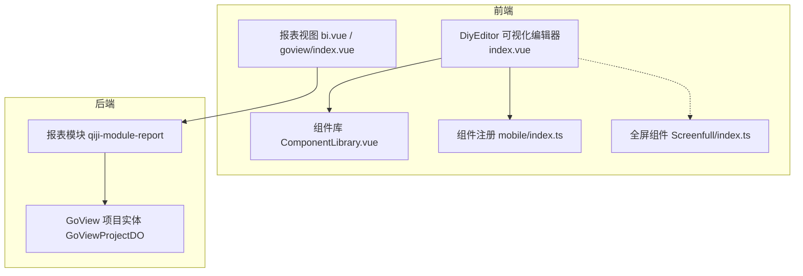
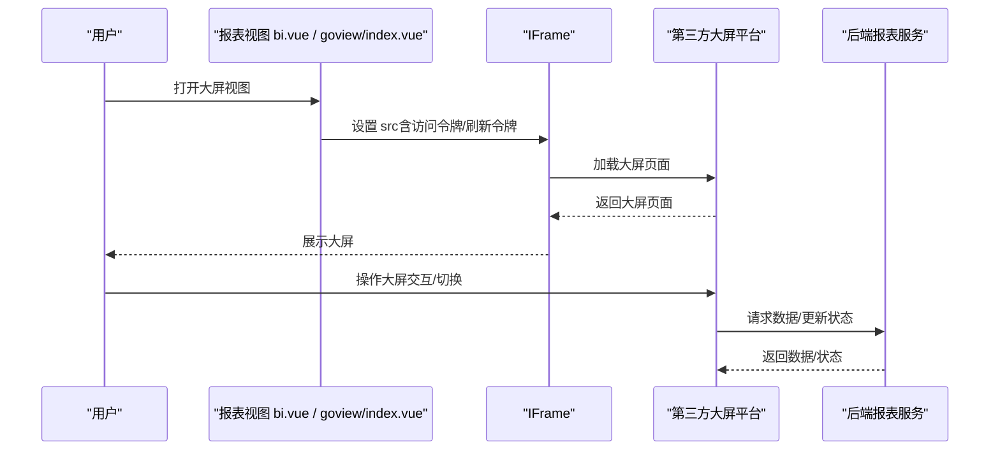
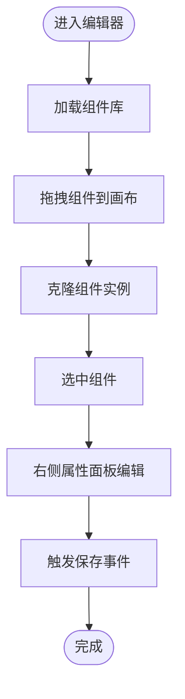
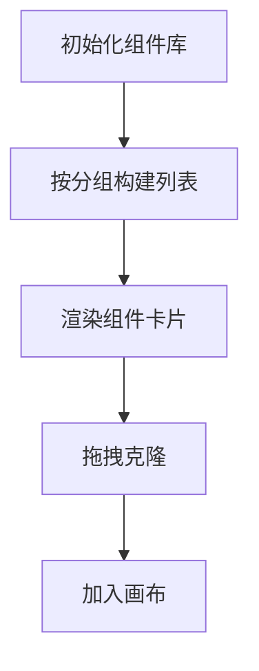
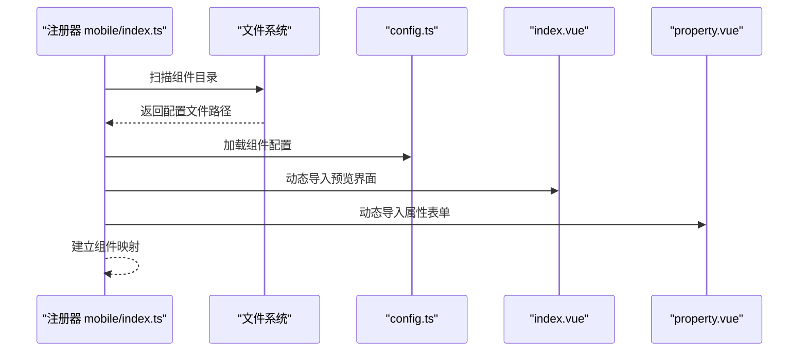
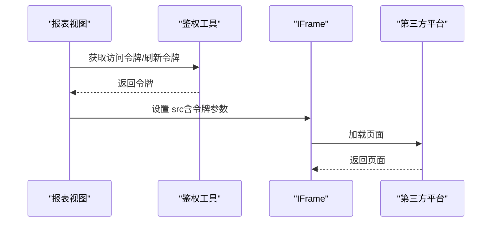
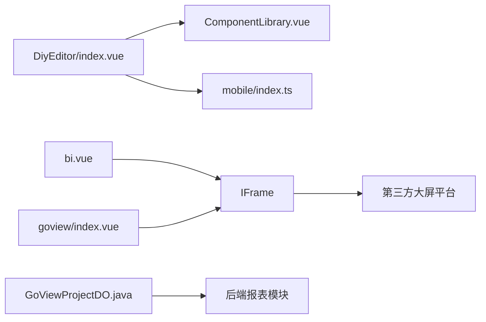

# 大屏设计器

<cite>
**本文引用的文件**   
- [DiyEditor/index.vue](file://frontend/admin-vue3/src/components/DiyEditor/index.vue)
- [ComponentLibrary.vue](file://frontend/admin-vue3/src/components/DiyEditor/components/ComponentLibrary.vue)
- [mobile/index.ts](file://frontend/admin-vue3/src/components/DiyEditor/components/mobile/index.ts)
- [ImageBar/config.ts](file://frontend/admin-vue3/src/components/DiyEditor/components/mobile/ImageBar/config.ts)
- [bi.vue](file://frontend/admin-vue3/src/views/report/jmreport/bi.vue)
- [index.vue](file://frontend/admin-vue3/src/views/report/goview/index.vue)
- [GoViewProjectDO.java](file://backend/qiji-module-report/src/main/java/com/qiji/cps/module/report/dal/dataobject/goview/GoViewProjectDO.java)
- [Screenfull/index.ts](file://frontend/admin-vue3/src/layout/components/Screenfull/index.ts)
- [dom-video.vue](file://frontend/mall-uniapp/uni_modules/uni-video/components/dom-video.vue)
- [uni-col.vue](file://frontend/mall-uniapp/uni_modules/uni-row/components/uni-col/uni-col.vue)
- [DeviceDetailsThingModelProperty.vue](file://frontend/admin-vue3/src/views/iot/device/device/detail/DeviceDetailsThingModelProperty.vue)
</cite>

## 目录
1. [简介](#简介)
2. [项目结构](#项目结构)
3. [核心组件](#核心组件)
4. [架构总览](#架构总览)
5. [详细组件分析](#详细组件分析)
6. [依赖关系分析](#依赖关系分析)
7. [性能考量](#性能考量)
8. [故障排查指南](#故障排查指南)
9. [结论](#结论)
10. [附录](#附录)

## 简介
本文件面向使用者与实施人员，系统化介绍 AgenticCPS 大屏设计器的使用方法与实现要点，覆盖布局设计、组件拖拽、属性配置、数据绑定、响应式适配、发布与展示、模板示例与性能优化等主题。大屏设计器基于前端可视化编辑器与后端报表模块协同工作，支持通过 iframe 嵌入第三方大屏平台（如积木报表、GoView）进行统一入口管理。

## 项目结构
大屏设计器主要由三部分构成：
- 前端可视化编辑器：提供组件库、画布、属性面板与工具栏，支持拖拽布局、组件属性配置与保存。
- 前端报表视图：通过 iframe 嵌入第三方大屏平台，统一入口访问与展示。
- 后端报表模块：持久化大屏项目配置，支撑发布与状态管理。

**图表来源**
- [DiyEditor/index.vue:1-605](file://frontend/admin-vue3/src/components/DiyEditor/index.vue#L1-L605)
- [ComponentLibrary.vue:1-212](file://frontend/admin-vue3/src/components/DiyEditor/components/ComponentLibrary.vue#L1-L212)
- [mobile/index.ts:1-62](file://frontend/admin-vue3/src/components/DiyEditor/components/mobile/index.ts#L1-L62)
- [bi.vue:1-16](file://frontend/admin-vue3/src/views/report/jmreport/bi.vue#L1-L16)
- [index.vue:1-17](file://frontend/admin-vue3/src/views/report/goview/index.vue#L1-L17)
- [GoViewProjectDO.java:1-57](file://backend/qiji-module-report/src/main/java/com/qiji/cps/module/report/dal/dataobject/goview/GoViewProjectDO.java#L1-L57)
- [Screenfull/index.ts:1-3](file://frontend/admin-vue3/src/layout/components/Screenfull/src/Screenfull.vue#L1-L3)

**章节来源**
- [DiyEditor/index.vue:1-605](file://frontend/admin-vue3/src/components/DiyEditor/index.vue#L1-L605)
- [ComponentLibrary.vue:1-212](file://frontend/admin-vue3/src/components/DiyEditor/components/ComponentLibrary.vue#L1-L212)
- [mobile/index.ts:1-62](file://frontend/admin-vue3/src/components/DiyEditor/components/mobile/index.ts#L1-L62)
- [bi.vue:1-16](file://frontend/admin-vue3/src/views/report/jmreport/bi.vue#L1-L16)
- [index.vue:1-17](file://frontend/admin-vue3/src/views/report/goview/index.vue#L1-L17)
- [GoViewProjectDO.java:1-57](file://backend/qiji-module-report/src/main/java/com/qiji/cps/module/report/dal/dataobject/goview/GoViewProjectDO.java#L1-L57)
- [Screenfull/index.ts:1-3](file://frontend/admin-vue3/src/layout/components/Screenfull/src/Screenfull.vue#L1-L3)

## 核心组件
- 可视化编辑器容器：提供工具栏、左侧组件库、中心画布、右侧属性面板与预览弹窗。
- 组件库：按分组展示可拖拽组件，支持克隆组件实例加入画布。
- 组件注册：通过约定式扫描与动态导入，注册组件界面与属性表单。
- 报表视图：iframe 嵌入第三方大屏平台（积木报表、GoView），支持令牌注入与预览二维码。
- 全屏展示：集成全屏组件，支持进入全屏模式。

**章节来源**
- [DiyEditor/index.vue:1-605](file://frontend/admin-vue3/src/components/DiyEditor/index.vue#L1-L605)
- [ComponentLibrary.vue:1-212](file://frontend/admin-vue3/src/components/DiyEditor/components/ComponentLibrary.vue#L1-L212)
- [mobile/index.ts:1-62](file://frontend/admin-vue3/src/components/DiyEditor/components/mobile/index.ts#L1-L62)
- [bi.vue:1-16](file://frontend/admin-vue3/src/views/report/jmreport/bi.vue#L1-L16)
- [index.vue:1-17](file://frontend/admin-vue3/src/views/report/goview/index.vue#L1-L17)
- [Screenfull/index.ts:1-3](file://frontend/admin-vue3/src/layout/components/Screenfull/src/Screenfull.vue#L1-L3)

## 架构总览
大屏设计器采用“前端可视化编辑器 + iframe 嵌入第三方平台”的双层架构：
- 前端编辑器负责组件拖拽、布局与属性配置，并将配置序列化为页面结构。
- 报表视图通过 iframe 加载第三方大屏平台，注入访问令牌或刷新令牌，实现统一入口与权限控制。
- 后端报表模块负责存储大屏项目配置与状态，支撑发布与管理。

**图表来源**
- [bi.vue:1-16](file://frontend/admin-vue3/src/views/report/jmreport/bi.vue#L1-L16)
- [index.vue:1-17](file://frontend/admin-vue3/src/views/report/goview/index.vue#L1-L17)

## 详细组件分析

### 可视化编辑器容器（DiyEditor/index.vue）
- 功能概览
  - 工具栏：重置、预览、保存。
  - 左侧组件库：拖拽克隆组件到画布。
  - 中心画布：支持组件拖拽排序、复制、删除、选中高亮。
  - 右侧属性面板：根据选中组件动态加载属性表单。
  - 预览弹窗：在固定尺寸手机容器中预览。
- 关键特性
  - 组件克隆：拖拽时克隆组件实例，保证唯一标识。
  - 配置监听：深度监听页面配置变化，触发保存事件。
  - 默认选中：根据开关显示页面配置、顶部导航、底部导航。
  - 样式与尺寸：内置手机容器宽度与工具栏高度，保证编辑一致性。

**图表来源**
- [DiyEditor/index.vue:187-443](file://frontend/admin-vue3/src/components/DiyEditor/index.vue#L187-L443)

**章节来源**
- [DiyEditor/index.vue:1-605](file://frontend/admin-vue3/src/components/DiyEditor/index.vue#L1-L605)

### 组件库（ComponentLibrary.vue）
- 功能概览
  - 分组折叠：按组件分组展开/折叠。
  - 组件展示：网格化展示组件图标与名称。
  - 拖拽克隆：将组件克隆到画布，生成唯一标识。
- 关键特性
  - 分组映射：根据传入的组件库清单，映射到组件配置集合。
  - 克隆策略：深拷贝组件并生成新 uid，避免重复引用。

**图表来源**
- [ComponentLibrary.vue:1-212](file://frontend/admin-vue3/src/components/DiyEditor/components/ComponentLibrary.vue#L1-L212)

**章节来源**
- [ComponentLibrary.vue:1-212](file://frontend/admin-vue3/src/components/DiyEditor/components/ComponentLibrary.vue#L1-L212)

### 组件注册（mobile/index.ts）
- 功能概览
  - 约定式扫描：通过 glob 自动发现组件目录与配置文件。
  - 动态导入：异步加载组件界面与属性表单。
  - 组件映射：建立组件 ID 到配置与视图的映射关系。
- 关键特性
  - 规范化命名：组件 ID 以 config.ts 中 id 为准；建议目录名与 ID 一致。
  - 双视图注册：同时注册“预览界面”和“属性表单”。

**图表来源**
- [mobile/index.ts:1-62](file://frontend/admin-vue3/src/components/DiyEditor/components/mobile/index.ts#L1-L62)

**章节来源**
- [mobile/index.ts:1-62](file://frontend/admin-vue3/src/components/DiyEditor/components/mobile/index.ts#L1-L62)

### 图片组件（ImageBar/config.ts）
- 功能概览
  - 图片展示：支持图片链接与跳转链接配置。
  - 样式配置：背景类型、背景色、间距等。
- 使用建议
  - 图片链接建议使用 CDN 或平台直链，确保加载稳定。
  - 跳转链接遵循业务规范，避免外链安全风险。

**章节来源**
- [ImageBar/config.ts:1-27](file://frontend/admin-vue3/src/components/DiyEditor/components/mobile/ImageBar/config.ts#L1-L27)

### 报表视图（bi.vue / goview/index.vue）
- 功能概览
  - 积木报表：通过刷新令牌拼接 URL，便于刷新访问令牌。
  - GoView：通过访问令牌与刷新令牌注入，保障会话有效性。
- 关键特性
  - 统一入口：通过 iframe 嵌入第三方平台，便于统一管理。
  - 令牌注入：根据环境变量与鉴权工具动态拼接 URL。

**图表来源**
- [bi.vue:1-16](file://frontend/admin-vue3/src/views/report/jmreport/bi.vue#L1-L16)
- [index.vue:1-17](file://frontend/admin-vue3/src/views/report/goview/index.vue#L1-L17)

**章节来源**
- [bi.vue:1-16](file://frontend/admin-vue3/src/views/report/jmreport/bi.vue#L1-L16)
- [index.vue:1-17](file://frontend/admin-vue3/src/views/report/goview/index.vue#L1-L17)

### 全屏展示（Screenfull/index.ts）
- 功能概览
  - 提供全屏能力，支持进入/退出全屏模式。
- 使用建议
  - 在大屏展示场景中，结合 iframe 页面进行全屏预览与演示。

**章节来源**
- [Screenfull/index.ts:1-3](file://frontend/admin-vue3/src/layout/components/Screenfull/src/Screenfull.vue#L1-L3)

### 视频组件（dom-video.vue）
- 功能概览
  - DOM 视频播放：支持多种格式与属性（自动播放、循环、控制条、静音、封面）。
  - 事件驱动：通过 renderjs 与服务层联动，实现播放、暂停、停止等事件。
- 使用建议
  - 建议开启自动播放需满足浏览器策略要求，必要时引导用户交互。
  - 封面图与对象填充策略需与设计稿一致。

**章节来源**
- [dom-video.vue:1-157](file://frontend/mall-uniapp/uni_modules/uni-video/components/dom-video.vue#L1-L157)

### 响应式布局（uni-row/uni-col）
- 功能概览
  - 基于断点的栅格系统：支持 xs/sm/md/lg/xl 等断点。
  - 列宽与偏移：提供 0-24 列的宽度与偏移类，适配多分辨率。
- 使用建议
  - 在大屏设计中，结合断点与列宽，实现组件在不同屏幕下的自适应排列。

**章节来源**
- [uni-col.vue:221-317](file://frontend/mall-uniapp/uni_modules/uni-row/components/uni-col/uni-col.vue#L221-L317)

### 数据绑定与自动刷新（设备属性示例）
- 功能概览
  - 监听自动刷新开关：开启后每 5 秒轮询刷新数据。
  - 组件卸载时清理定时器，避免内存泄漏。
- 使用建议
  - 对高频刷新的数据，建议合理设置刷新周期，平衡实时性与性能。
  - 结合后端接口限流与缓存策略，提升稳定性。

**章节来源**
- [DeviceDetailsThingModelProperty.vue:215-245](file://frontend/admin-vue3/src/views/iot/device/device/detail/DeviceDetailsThingModelProperty.vue#L215-L245)

## 依赖关系分析
- 组件注册依赖约定式扫描与动态导入，确保新增组件无需手动注册。
- 编辑器与组件库通过 vuedraggable 实现拖拽交互，组件克隆与唯一标识管理避免冲突。
- 报表视图通过 iframe 与第三方平台解耦，令牌注入保障鉴权。
- 后端报表模块提供项目实体，承载大屏配置与状态。

**图表来源**
- [DiyEditor/index.vue:1-605](file://frontend/admin-vue3/src/components/DiyEditor/index.vue#L1-L605)
- [ComponentLibrary.vue:1-212](file://frontend/admin-vue3/src/components/DiyEditor/components/ComponentLibrary.vue#L1-L212)
- [mobile/index.ts:1-62](file://frontend/admin-vue3/src/components/DiyEditor/components/mobile/index.ts#L1-L62)
- [bi.vue:1-16](file://frontend/admin-vue3/src/views/report/jmreport/bi.vue#L1-L16)
- [index.vue:1-17](file://frontend/admin-vue3/src/views/report/goview/index.vue#L1-L17)
- [GoViewProjectDO.java:1-57](file://backend/qiji-module-report/src/main/java/com/qiji/cps/module/report/dal/dataobject/goview/GoViewProjectDO.java#L1-L57)

**章节来源**
- [DiyEditor/index.vue:1-605](file://frontend/admin-vue3/src/components/DiyEditor/index.vue#L1-L605)
- [ComponentLibrary.vue:1-212](file://frontend/admin-vue3/src/components/DiyEditor/components/ComponentLibrary.vue#L1-L212)
- [mobile/index.ts:1-62](file://frontend/admin-vue3/src/components/DiyEditor/components/mobile/index.ts#L1-L62)
- [bi.vue:1-16](file://frontend/admin-vue3/src/views/report/jmreport/bi.vue#L1-L16)
- [index.vue:1-17](file://frontend/admin-vue3/src/views/report/goview/index.vue#L1-L17)
- [GoViewProjectDO.java:1-57](file://backend/qiji-module-report/src/main/java/com/qiji/cps/module/report/dal/dataobject/goview/GoViewProjectDO.java#L1-L57)

## 性能考量
- 组件克隆与唯一标识：避免重复引用，降低渲染与事件冲突成本。
- 深度监听与保存：仅在配置变更时触发保存，减少不必要的网络请求。
- 自动刷新策略：对高频数据设置合理刷新周期，结合后端限流与缓存。
- 响应式布局：利用断点与列宽，减少复杂计算，提升渲染效率。
- 视频组件：按需加载与懒加载策略，避免首屏阻塞。

[本节为通用指导，无需特定文件引用]

## 故障排查指南
- 无法拖拽组件到画布
  - 检查组件库是否正确加载与分组。
  - 确认 vuedraggable 的 group 与 clone 配置是否正确。
- 属性面板不显示
  - 确认已选中有效组件，且组件存在属性表单。
  - 检查组件注册是否成功，属性表单是否正确命名。
- 预览弹窗无法打开
  - 检查预览 URL 与工具栏按钮可见性配置。
- iframe 无法加载第三方平台
  - 核对令牌注入逻辑与环境变量配置。
  - 确认跨域与安全策略允许 iframe 嵌入。
- 自动刷新无效
  - 检查定时器是否被清理，组件卸载钩子是否生效。
  - 确认刷新周期与接口可用性。

**章节来源**
- [DiyEditor/index.vue:187-443](file://frontend/admin-vue3/src/components/DiyEditor/index.vue#L187-L443)
- [ComponentLibrary.vue:1-212](file://frontend/admin-vue3/src/components/DiyEditor/components/ComponentLibrary.vue#L1-L212)
- [bi.vue:1-16](file://frontend/admin-vue3/src/views/report/jmreport/bi.vue#L1-L16)
- [index.vue:1-17](file://frontend/admin-vue3/src/views/report/goview/index.vue#L1-L17)
- [DeviceDetailsThingModelProperty.vue:215-245](file://frontend/admin-vue3/src/views/iot/device/device/detail/DeviceDetailsThingModelProperty.vue#L215-L245)

## 结论
AgenticCPS 大屏设计器通过“可视化编辑器 + iframe 嵌入第三方平台”的架构，实现了从布局设计、组件拖拽、属性配置到发布展示的完整闭环。依托约定式组件注册与响应式布局体系，既保证了扩展性，也兼顾了性能与易用性。结合合理的数据刷新策略与全屏展示能力，能够满足多行业场景的大屏需求。

[本节为总结性内容，无需特定文件引用]

## 附录
- 行业场景模板建议
  - 物联网监控：顶部指标卡 + 实时图表 + 设备状态看板。
  - 电商运营：销售趋势 + 商品排行 + 用户画像 + 营销活动。
  - 交通调度：实时路况 + 车辆分布 + 运力分析 + 异常预警。
- 性能优化清单
  - 合理设置自动刷新周期，避免频繁请求。
  - 使用断点与栅格系统，减少复杂布局计算。
  - 视频组件按需加载，避免首屏阻塞。
  - 组件克隆与唯一标识管理，降低渲染冲突。

[本节为通用指导，无需特定文件引用]