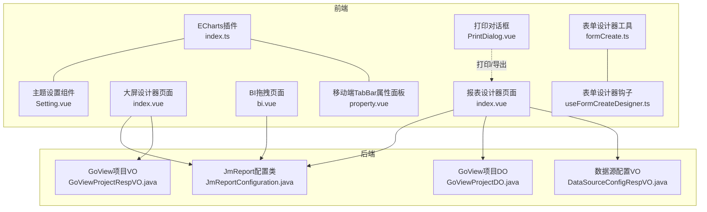
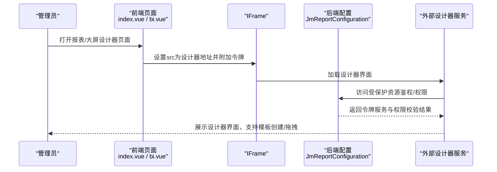
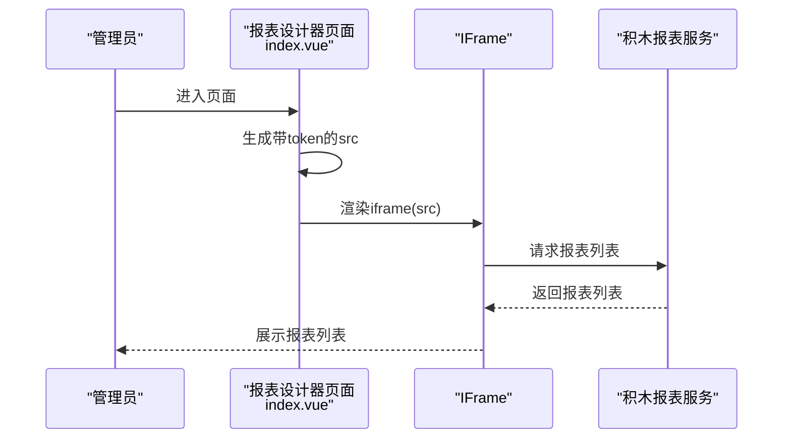
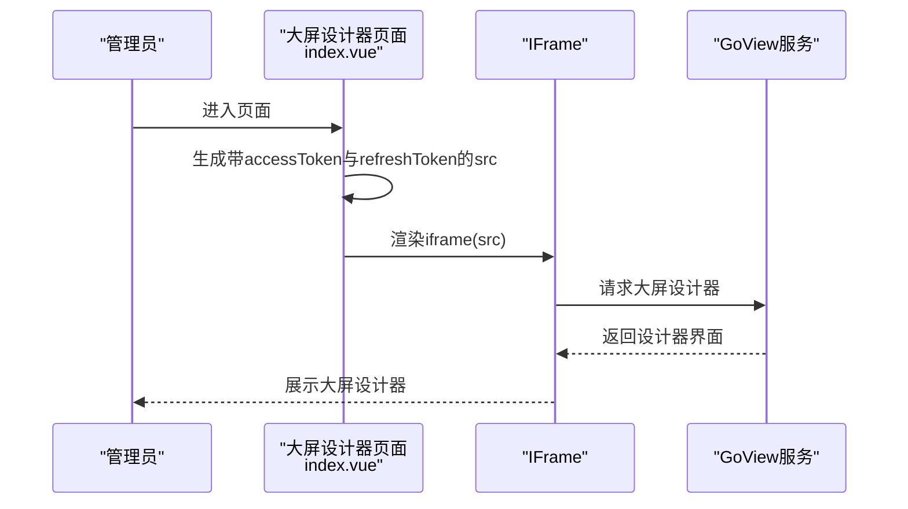
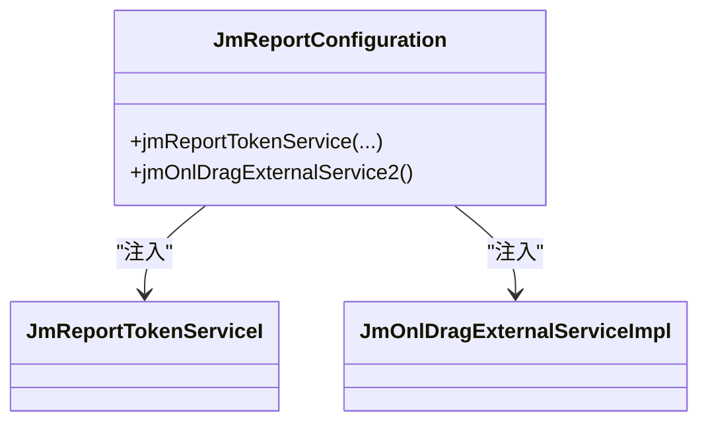
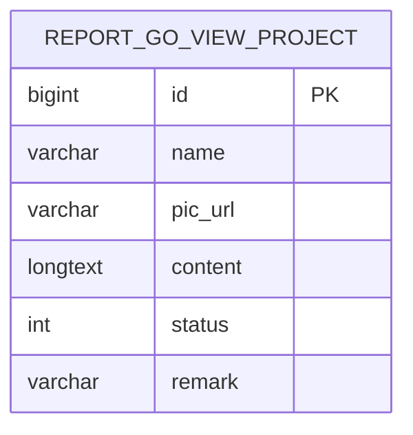
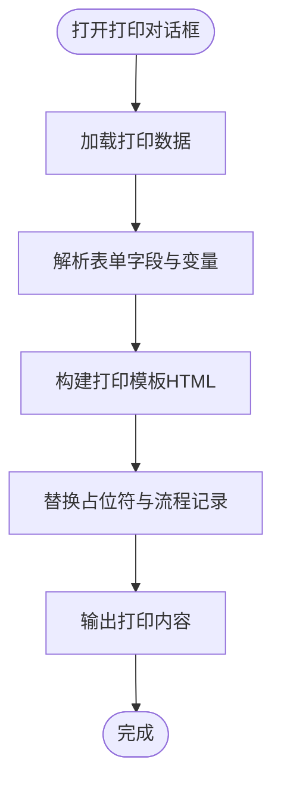
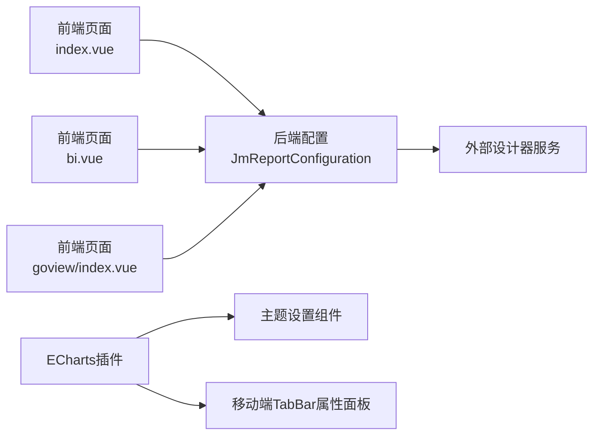

# 报表设计器

<cite>
**本文引用的文件**   
- [index.vue](file://frontend/admin-vue3/src/views/report/jmreport/index.vue)
- [index.vue](file://frontend/admin-vue3/src/views/report/goview/index.vue)
- [bi.vue](file://frontend/admin-vue3/src/views/report/jmreport/bi.vue)
- [JmReportConfiguration.java](file://backend/qiji-module-report/src/main/java/com/qiji/cps/module/report/framework/jmreport/config/JmReportConfiguration.java)
- [GoViewProjectDO.java](file://backend/qiji-module-report/src/main/java/com/qiji/cps/module/report/dal/dataobject/goview/GoViewProjectDO.java)
- [GoViewProjectRespVO.java](file://backend/qiji-module-report/src/main/java/com/qiji/cps/module/report/controller/admin/goview/vo/project/GoViewProjectRespVO.java)
- [DataSourceConfigRespVO.java](file://backend/qiji-module-infra/src/main/java/com/qiji/cps/module/infra/controller/admin/db/vo/DataSourceConfigRespVO.java)
- [index.ts](file://frontend/admin-vue3/src/plugins/echarts/index.ts)
- [Setting.vue](file://frontend/admin-vue3/src/layout/components/Setting/src/Setting.vue)
- [property.vue](file://frontend/admin-vue3/src/components/DiyEditor/components/mobile/TabBar/property.vue)
- [_dark.scss](file://frontend/mall-uniapp/sheep/scss/theme/_dark.scss)
- [_light.scss](file://frontend/mall-uniapp/sheep/scss/theme/_light.scss)
- [PrintDialog.vue](file://frontend/admin-vue3/src/views/bpm/processInstance/detail/PrintDialog.vue)
- [formCreate.ts](file://frontend/admin-vue3/src/utils/formCreate.ts)
- [useFormCreateDesigner.ts](file://frontend/admin-vue3/src/components/FormCreate/src/useFormCreateDesigner.ts)
</cite>

## 目录
1. [简介](#简介)
2. [项目结构](#项目结构)
3. [核心组件](#核心组件)
4. [架构总览](#架构总览)
5. [详细组件分析](#详细组件分析)
6. [依赖分析](#依赖分析)
7. [性能考虑](#性能考虑)
8. [故障排查指南](#故障排查指南)
9. [结论](#结论)
10. [附录](#附录)

## 简介
本文件面向AgenticCPS的“报表设计器”模块，提供从使用到部署的完整指南。当前系统集成了两大设计器能力：
- 积木报表（JimuReport）：支持拖拽式报表模板创建、数据源绑定、字段映射与布局设计。
- GoView大屏（GoView）：支持可视化大屏设计与发布。

同时，系统提供了基础的图表组件（ECharts）、主题与样式定制、打印与导出能力，并在后端通过配置类与数据对象支撑设计器的鉴权、项目持久化与数据源模型。

## 项目结构
报表设计器相关的关键位置如下：
- 前端页面入口：报表设计器与大屏设计器的页面组件，分别以iframe方式嵌入外部设计器服务。
- 后端集成：通过配置类注入设计器所需的鉴权与权限服务；通过数据对象与VO描述设计器项目的持久化结构。
- 图表与样式：前端插件注册ECharts组件，提供柱状、折线、饼图、仪表盘等常用图表；主题系统支持头部、菜单与系统级主题切换。
- 数据源：基础设施模块提供数据源配置的响应模型，便于在设计器中进行数据源选择与参数传递。
- 打印与导出：提供通用打印对话框与表单设计器工具函数，支撑报表打印与导出场景。

**图表来源**
- [index.vue:1-16](file://frontend/admin-vue3/src/views/report/jmreport/index.vue#L1-L16)
- [index.vue:1-17](file://frontend/admin-vue3/src/views/report/goview/index.vue#L1-L17)
- [bi.vue:1-16](file://frontend/admin-vue3/src/views/report/jmreport/bi.vue#L1-L16)
- [JmReportConfiguration.java:1-37](file://backend/qiji-module-report/src/main/java/com/qiji/cps/module/report/framework/jmreport/config/JmReportConfiguration.java#L1-L37)
- [GoViewProjectDO.java:1-57](file://backend/qiji-module-report/src/main/java/com/qiji/cps/module/report/dal/dataobject/goview/GoViewProjectDO.java#L1-L57)
- [GoViewProjectRespVO.java:1-37](file://backend/qiji-module-report/src/main/java/com/qiji/cps/module/report/controller/admin/goview/vo/project/GoViewProjectRespVO.java#L1-L37)
- [DataSourceConfigRespVO.java:1-28](file://backend/qiji-module-infra/src/main/java/com/qiji/cps/module/infra/controller/admin/db/vo/DataSourceConfigRespVO.java#L1-L28)
- [index.ts:1-51](file://frontend/admin-vue3/src/plugins/echarts/index.ts#L1-L51)
- [Setting.vue:34-276](file://frontend/admin-vue3/src/layout/components/Setting/src/Setting.vue#L34-L276)
- [property.vue:1-36](file://frontend/admin-vue3/src/components/DiyEditor/components/mobile/TabBar/property.vue#L1-L36)
- [PrintDialog.vue:1-148](file://frontend/admin-vue3/src/views/bpm/processInstance/detail/PrintDialog.vue#L1-L148)
- [formCreate.ts:1-47](file://frontend/admin-vue3/src/utils/formCreate.ts#L1-L47)
- [useFormCreateDesigner.ts:130-183](file://frontend/admin-vue3/src/components/FormCreate/src/useFormCreateDesigner.ts#L130-L183)

**章节来源**
- [index.vue:1-16](file://frontend/admin-vue3/src/views/report/jmreport/index.vue#L1-L16)
- [index.vue:1-17](file://frontend/admin-vue3/src/views/report/goview/index.vue#L1-L17)
- [bi.vue:1-16](file://frontend/admin-vue3/src/views/report/jmreport/bi.vue#L1-L16)
- [JmReportConfiguration.java:1-37](file://backend/qiji-module-report/src/main/java/com/qiji/cps/module/report/framework/jmreport/config/JmReportConfiguration.java#L1-L37)
- [GoViewProjectDO.java:1-57](file://backend/qiji-module-report/src/main/java/com/qiji/cps/module/report/dal/dataobject/goview/GoViewProjectDO.java#L1-L57)
- [GoViewProjectRespVO.java:1-37](file://backend/qiji-module-report/src/main/java/com/qiji/cps/module/report/controller/admin/goview/vo/project/GoViewProjectRespVO.java#L1-L37)
- [DataSourceConfigRespVO.java:1-28](file://backend/qiji-module-infra/src/main/java/com/qiji/cps/module/infra/controller/admin/db/vo/DataSourceConfigRespVO.java#L1-L28)
- [index.ts:1-51](file://frontend/admin-vue3/src/plugins/echarts/index.ts#L1-L51)
- [Setting.vue:34-276](file://frontend/admin-vue3/src/layout/components/Setting/src/Setting.vue#L34-L276)
- [property.vue:1-36](file://frontend/admin-vue3/src/components/DiyEditor/components/mobile/TabBar/property.vue#L1-L36)
- [PrintDialog.vue:1-148](file://frontend/admin-vue3/src/views/bpm/processInstance/detail/PrintDialog.vue#L1-L148)
- [formCreate.ts:1-47](file://frontend/admin-vue3/src/utils/formCreate.ts#L1-L47)
- [useFormCreateDesigner.ts:130-183](file://frontend/admin-vue3/src/components/FormCreate/src/useFormCreateDesigner.ts#L130-L183)

## 核心组件
- 报表设计器页面（积木报表）：通过iframe加载外部设计器地址，并携带刷新令牌，确保设计器内会话可用。
- 大屏设计器页面（GoView）：通过iframe加载外部设计器地址，并携带访问令牌与刷新令牌，满足设计器鉴权需求。
- BI拖拽页面（积木BI）：通过iframe加载拖拽列表地址，并携带刷新令牌，用于BI可视化拖拽。
- 后端集成配置：注入设计器的令牌服务与外部拖拽扩展服务，保证设计器在系统内具备鉴权与权限能力。
- GoView项目模型：定义项目名称、状态、内容（JSON）、预览图、备注等字段，支撑项目持久化与返回。
- 数据源配置模型：提供数据源名称、连接串、用户名、创建时间等字段，便于在设计器中选择与配置数据源。
- 图表组件（ECharts）：按需引入柱状、折线、饼图、仪表盘、漏斗等图表与组件，满足报表图表需求。
- 主题与样式：提供系统主题、头部主题、菜单主题切换，以及移动端TabBar的颜色与背景配置。
- 打印与导出：提供打印对话框与表单设计器工具函数，支撑打印模板替换与导出场景。

**章节来源**
- [index.vue:1-16](file://frontend/admin-vue3/src/views/report/jmreport/index.vue#L1-L16)
- [index.vue:1-17](file://frontend/admin-vue3/src/views/report/goview/index.vue#L1-L17)
- [bi.vue:1-16](file://frontend/admin-vue3/src/views/report/jmreport/bi.vue#L1-L16)
- [JmReportConfiguration.java:1-37](file://backend/qiji-module-report/src/main/java/com/qiji/cps/module/report/framework/jmreport/config/JmReportConfiguration.java#L1-L37)
- [GoViewProjectDO.java:1-57](file://backend/qiji-module-report/src/main/java/com/qiji/cps/module/report/dal/dataobject/goview/GoViewProjectDO.java#L1-L57)
- [GoViewProjectRespVO.java:1-37](file://backend/qiji-module-report/src/main/java/com/qiji/cps/module/report/controller/admin/goview/vo/project/GoViewProjectRespVO.java#L1-L37)
- [DataSourceConfigRespVO.java:1-28](file://backend/qiji-module-infra/src/main/java/com/qiji/cps/module/infra/controller/admin/db/vo/DataSourceConfigRespVO.java#L1-L28)
- [index.ts:1-51](file://frontend/admin-vue3/src/plugins/echarts/index.ts#L1-L51)
- [Setting.vue:34-276](file://frontend/admin-vue3/src/layout/components/Setting/src/Setting.vue#L34-L276)
- [property.vue:1-36](file://frontend/admin-vue3/src/components/DiyEditor/components/mobile/TabBar/property.vue#L1-L36)
- [PrintDialog.vue:1-148](file://frontend/admin-vue3/src/views/bpm/processInstance/detail/PrintDialog.vue#L1-L148)
- [formCreate.ts:1-47](file://frontend/admin-vue3/src/utils/formCreate.ts#L1-L47)
- [useFormCreateDesigner.ts:130-183](file://frontend/admin-vue3/src/components/FormCreate/src/useFormCreateDesigner.ts#L130-L183)

## 架构总览
下图展示了报表设计器从前端页面到后端配置的整体交互路径，以及与外部设计器服务的集成方式。

**图表来源**
- [index.vue:1-16](file://frontend/admin-vue3/src/views/report/jmreport/index.vue#L1-L16)
- [bi.vue:1-16](file://frontend/admin-vue3/src/views/report/jmreport/bi.vue#L1-L16)
- [JmReportConfiguration.java:1-37](file://backend/qiji-module-report/src/main/java/com/qiji/cps/module/report/framework/jmreport/config/JmReportConfiguration.java#L1-L37)

## 详细组件分析

### 组件A：报表设计器页面（积木报表）
- 功能概述：通过iframe加载积木报表列表页，携带刷新令牌，确保设计器内的会话有效。
- 关键点：
  - 页面名称定义为“JimuReport”，便于路由识别。
  - 使用刷新令牌拼接URL参数，避免设计器刷新访问令牌带来的兼容性问题。
  - 页面容器采用无内边距布局，适配设计器全屏展示。

**图表来源**
- [index.vue:1-16](file://frontend/admin-vue3/src/views/report/jmreport/index.vue#L1-L16)

**章节来源**
- [index.vue:1-16](file://frontend/admin-vue3/src/views/report/jmreport/index.vue#L1-L16)

### 组件B：大屏设计器页面（GoView）
- 功能概述：通过iframe加载GoView大屏设计器，携带访问令牌与刷新令牌，满足鉴权需求。
- 关键点：
  - 页面名称定义为“GoView”，便于路由识别。
  - 使用访问令牌与刷新令牌拼接URL参数，确保设计器内权限与会话稳定。

**图表来源**
- [index.vue:1-17](file://frontend/admin-vue3/src/views/report/goview/index.vue#L1-L17)

**章节来源**
- [index.vue:1-17](file://frontend/admin-vue3/src/views/report/goview/index.vue#L1-L17)

### 组件C：BI拖拽页面（积木BI）
- 功能概述：通过iframe加载积木BI拖拽列表，携带刷新令牌，进入BI可视化拖拽模式。
- 关键点：
  - 页面名称定义为“JimuBI”，便于路由识别。
  - 使用刷新令牌拼接URL参数，确保设计器内会话有效。

**章节来源**
- [bi.vue:1-16](file://frontend/admin-vue3/src/views/report/jmreport/bi.vue#L1-L16)

### 组件D：后端集成配置（JmReportConfiguration）
- 功能概述：向设计器注入令牌服务与外部拖拽扩展服务，保障设计器在系统内的鉴权与权限能力。
- 关键点：
  - 注入JmReportTokenServiceI，对接OAuth2与权限服务。
  - 注入JmOnlDragExternalServiceImpl，作为外部拖拽扩展服务的实现。

**图表来源**
- [JmReportConfiguration.java:1-37](file://backend/qiji-module-report/src/main/java/com/qiji/cps/module/report/framework/jmreport/config/JmReportConfiguration.java#L1-L37)

**章节来源**
- [JmReportConfiguration.java:1-37](file://backend/qiji-module-report/src/main/java/com/qiji/cps/module/report/framework/jmreport/config/JmReportConfiguration.java#L1-L37)

### 组件E：GoView项目模型与VO
- 功能概述：描述GoView项目的持久化结构与对外返回结构，支撑项目创建、发布与预览。
- 关键点：
  - GoViewProjectDO：包含项目名称、预览图、内容（JSON）、状态、备注等字段。
  - GoViewProjectRespVO：对外返回的项目信息，包含内容（JSON格式）、预览图、备注、创建人与创建时间等。

**图表来源**
- [GoViewProjectDO.java:1-57](file://backend/qiji-module-report/src/main/java/com/qiji/cps/module/report/dal/dataobject/goview/GoViewProjectDO.java#L1-L57)

**章节来源**
- [GoViewProjectDO.java:1-57](file://backend/qiji-module-report/src/main/java/com/qiji/cps/module/report/dal/dataobject/goview/GoViewProjectDO.java#L1-L57)
- [GoViewProjectRespVO.java:1-37](file://backend/qiji-module-report/src/main/java/com/qiji/cps/module/report/controller/admin/goview/vo/project/GoViewProjectRespVO.java#L1-L37)

### 组件F：数据源配置模型
- 功能概述：提供数据源配置的响应模型，便于在设计器中进行数据源选择与参数传递。
- 关键点：
  - 包含主键、名称、连接串、用户名、创建时间等字段。

**章节来源**
- [DataSourceConfigRespVO.java:1-28](file://backend/qiji-module-infra/src/main/java/com/qiji/cps/module/infra/controller/admin/db/vo/DataSourceConfigRespVO.java#L1-L28)

### 组件G：图表组件（ECharts）
- 功能概述：按需引入多种图表与组件，满足报表中的柱状图、折线图、饼图、仪表盘、漏斗等可视化需求。
- 关键点：
  - 引入Legend、Title、Tooltip、Toolbox、DataZoom、Grid、Polar、Aria、Parallel、VisualMap等组件。
  - 引入Bar、Line、Pie、Map、CanvasRenderer、PictorialBar、Radar、Gauge、Funnel等图表。

**章节来源**
- [index.ts:1-51](file://frontend/admin-vue3/src/plugins/echarts/index.ts#L1-L51)

### 组件H：主题与样式定制
- 功能概述：提供系统主题、头部主题、菜单主题切换，以及移动端TabBar的颜色与背景配置。
- 关键点：
  - Setting.vue：支持系统主题、头部主题、菜单主题的颜色选择与动态应用。
  - property.vue：移动端TabBar属性面板支持主题、默认颜色、选中颜色、导航背景（纯色/图片）等配置。
  - _dark.scss/_light.scss：提供深色与浅色主题变量，便于全局样式统一。

**章节来源**
- [Setting.vue:34-276](file://frontend/admin-vue3/src/layout/components/Setting/src/Setting.vue#L34-L276)
- [property.vue:1-36](file://frontend/admin-vue3/src/components/DiyEditor/components/mobile/TabBar/property.vue#L1-L36)
- [_dark.scss:1-39](file://frontend/mall-uniapp/sheep/scss/theme/_dark.scss#L1-L39)
- [_light.scss:1-39](file://frontend/mall-uniapp/sheep/scss/theme/_light.scss#L1-L39)

### 组件I：打印与导出
- 功能概述：提供打印对话框与表单设计器工具函数，支撑报表打印与导出场景。
- 关键点：
  - PrintDialog.vue：解析流程表单字段、构建打印模板HTML、替换占位符、输出打印内容。
  - formCreate.ts：提供编码/解码表单配置与字段的能力，适用于设计器场景。
  - useFormCreateDesigner.ts：在设计器挂载后自动修复重复字段ID，提升稳定性。

**图表来源**
- [PrintDialog.vue:1-148](file://frontend/admin-vue3/src/views/bpm/processInstance/detail/PrintDialog.vue#L1-L148)

**章节来源**
- [PrintDialog.vue:1-148](file://frontend/admin-vue3/src/views/bpm/processInstance/detail/PrintDialog.vue#L1-L148)
- [formCreate.ts:1-47](file://frontend/admin-vue3/src/utils/formCreate.ts#L1-L47)
- [useFormCreateDesigner.ts:130-183](file://frontend/admin-vue3/src/components/FormCreate/src/useFormCreateDesigner.ts#L130-L183)

## 依赖分析
- 前端页面与后端配置的耦合度低：页面仅负责拼接URL并加载iframe，具体鉴权由后端配置类处理。
- 设计器服务与系统鉴权解耦：通过令牌服务与权限服务注入，避免直接依赖外部服务的内部实现。
- 图表组件与主题系统相互独立：ECharts插件按需引入，主题系统通过CSS变量与组件联动，互不影响。

**图表来源**
- [index.vue:1-16](file://frontend/admin-vue3/src/views/report/jmreport/index.vue#L1-L16)
- [bi.vue:1-16](file://frontend/admin-vue3/src/views/report/jmreport/bi.vue#L1-L16)
- [index.vue:1-17](file://frontend/admin-vue3/src/views/report/goview/index.vue#L1-L17)
- [JmReportConfiguration.java:1-37](file://backend/qiji-module-report/src/main/java/com/qiji/cps/module/report/framework/jmreport/config/JmReportConfiguration.java#L1-L37)
- [index.ts:1-51](file://frontend/admin-vue3/src/plugins/echarts/index.ts#L1-L51)
- [Setting.vue:34-276](file://frontend/admin-vue3/src/layout/components/Setting/src/Setting.vue#L34-L276)
- [property.vue:1-36](file://frontend/admin-vue3/src/components/DiyEditor/components/mobile/TabBar/property.vue#L1-L36)

**章节来源**
- [index.vue:1-16](file://frontend/admin-vue3/src/views/report/jmreport/index.vue#L1-L16)
- [bi.vue:1-16](file://frontend/admin-vue3/src/views/report/jmreport/bi.vue#L1-L16)
- [index.vue:1-17](file://frontend/admin-vue3/src/views/report/goview/index.vue#L1-L17)
- [JmReportConfiguration.java:1-37](file://backend/qiji-module-report/src/main/java/com/qiji/cps/module/report/framework/jmreport/config/JmReportConfiguration.java#L1-L37)
- [index.ts:1-51](file://frontend/admin-vue3/src/plugins/echarts/index.ts#L1-L51)
- [Setting.vue:34-276](file://frontend/admin-vue3/src/layout/components/Setting/src/Setting.vue#L34-L276)
- [property.vue:1-36](file://frontend/admin-vue3/src/components/DiyEditor/components/mobile/TabBar/property.vue#L1-L36)

## 性能考虑
- iframe加载策略：尽量减少iframe内初始渲染的数据量，优先懒加载与按需渲染，降低首屏压力。
- 图表组件按需引入：仅引入实际使用的图表与组件，避免打包体积膨胀。
- 主题切换：通过CSS变量与组件联动，避免频繁重绘与样式回流。
- 打印与导出：在打印前对DOM进行最小化处理，避免不必要的元素参与打印，提升打印速度与质量。

## 故障排查指南
- 设计器无法加载或鉴权失败
  - 检查页面是否正确拼接了令牌参数（刷新令牌/访问令牌）。
  - 确认后端配置类已注入令牌服务与权限服务。
  - 参考：[index.vue:1-16](file://frontend/admin-vue3/src/views/report/jmreport/index.vue#L1-L16)、[index.vue:1-17](file://frontend/admin-vue3/src/views/report/goview/index.vue#L1-L17)、[JmReportConfiguration.java:1-37](file://backend/qiji-module-report/src/main/java/com/qiji/cps/module/report/framework/jmreport/config/JmReportConfiguration.java#L1-L37)
- 报表模板字段重复导致设计器异常
  - 使用表单设计器钩子自动修复重复字段ID。
  - 参考：[useFormCreateDesigner.ts:130-183](file://frontend/admin-vue3/src/components/FormCreate/src/useFormCreateDesigner.ts#L130-L183)
- 打印模板占位符未替换
  - 检查打印对话框中占位符解析与替换逻辑。
  - 参考：[PrintDialog.vue:1-148](file://frontend/admin-vue3/src/views/bpm/processInstance/detail/PrintDialog.vue#L1-L148)
- 主题切换无效或样式错乱
  - 检查CSS变量是否正确设置，主题组件是否正确调用。
  - 参考：[Setting.vue:34-276](file://frontend/admin-vue3/src/layout/components/Setting/src/Setting.vue#L34-L276)

**章节来源**
- [index.vue:1-16](file://frontend/admin-vue3/src/views/report/jmreport/index.vue#L1-L16)
- [index.vue:1-17](file://frontend/admin-vue3/src/views/report/goview/index.vue#L1-L17)
- [JmReportConfiguration.java:1-37](file://backend/qiji-module-report/src/main/java/com/qiji/cps/module/report/framework/jmreport/config/JmReportConfiguration.java#L1-L37)
- [useFormCreateDesigner.ts:130-183](file://frontend/admin-vue3/src/components/FormCreate/src/useFormCreateDesigner.ts#L130-L183)
- [PrintDialog.vue:1-148](file://frontend/admin-vue3/src/views/bpm/processInstance/detail/PrintDialog.vue#L1-L148)
- [Setting.vue:34-276](file://frontend/admin-vue3/src/layout/components/Setting/src/Setting.vue#L34-L276)

## 结论
AgenticCPS的报表设计器通过前端iframe嵌入与后端配置类集成，实现了与积木报表和GoView的无缝对接。配合ECharts图表组件、主题系统与打印导出能力，能够满足从模板创建、数据源配置、字段绑定到布局设计与发布预览的全流程需求。建议在生产环境中关注令牌传递、字段去重与打印模板替换等关键环节，以确保设计器的稳定性与易用性。

## 附录
- 快速上手步骤
  - 打开“报表设计器”页面，确认iframe加载成功且显示报表列表。
  - 在“数据源配置”中选择或新增数据源，填写连接串与凭据。
  - 在设计器中创建模板，绑定字段，配置图表类型与样式。
  - 发布项目并预览，如需打印或导出，使用打印对话框或导出功能。
- 常见业务场景示例
  - 销售报表：使用柱状图展示月度销售趋势，结合数据过滤与参数传递实现动态筛选。
  - 财务仪表盘：使用仪表盘与饼图展示预算执行情况与费用分布。
  - 大屏看板：使用GoView进行多图表组合的大屏展示，支持实时数据更新与主题切换。
- 性能优化建议
  - 控制图表数量与数据量，避免一次性渲染过多图表。
  - 合理使用主题变量，减少重复样式定义。
  - 在打印前清理DOM，仅保留必要元素，提升打印效率。