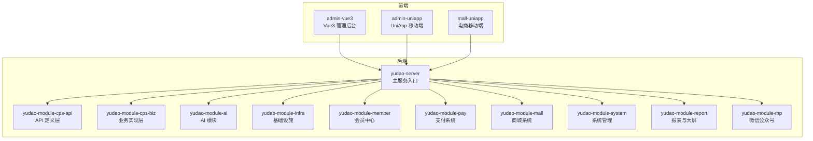
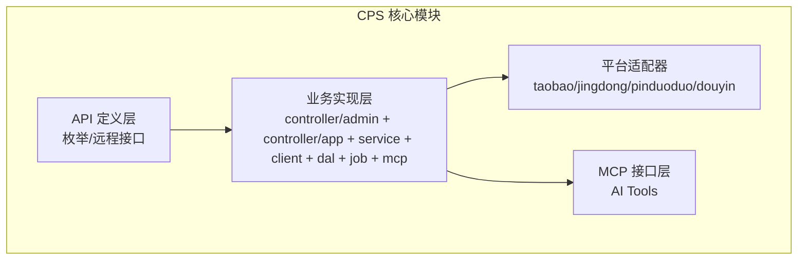
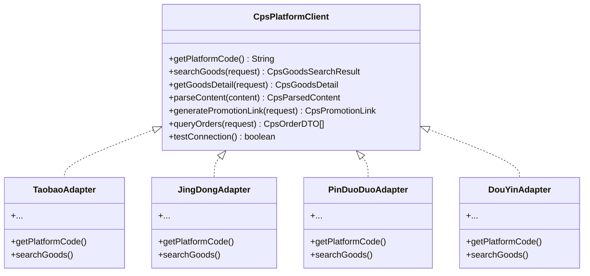
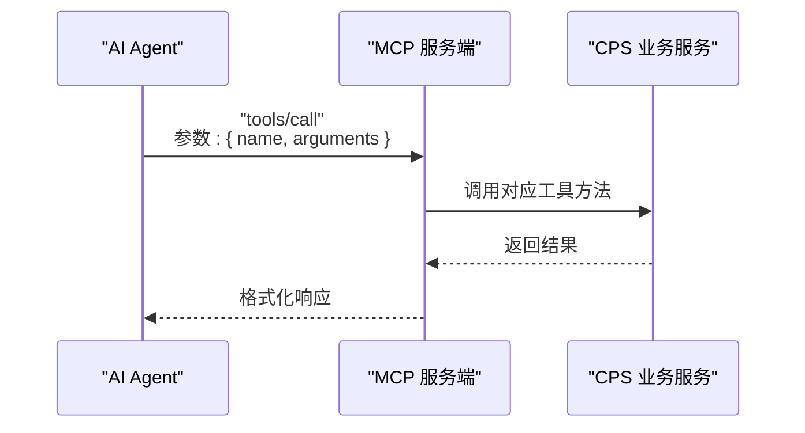
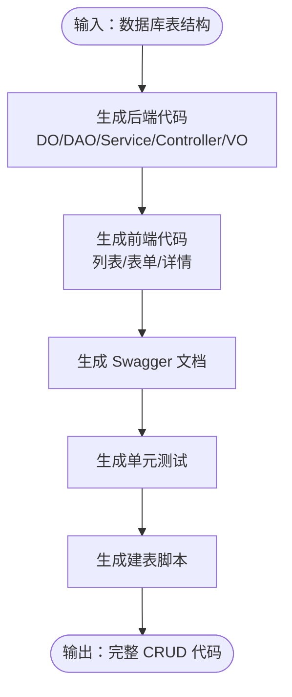
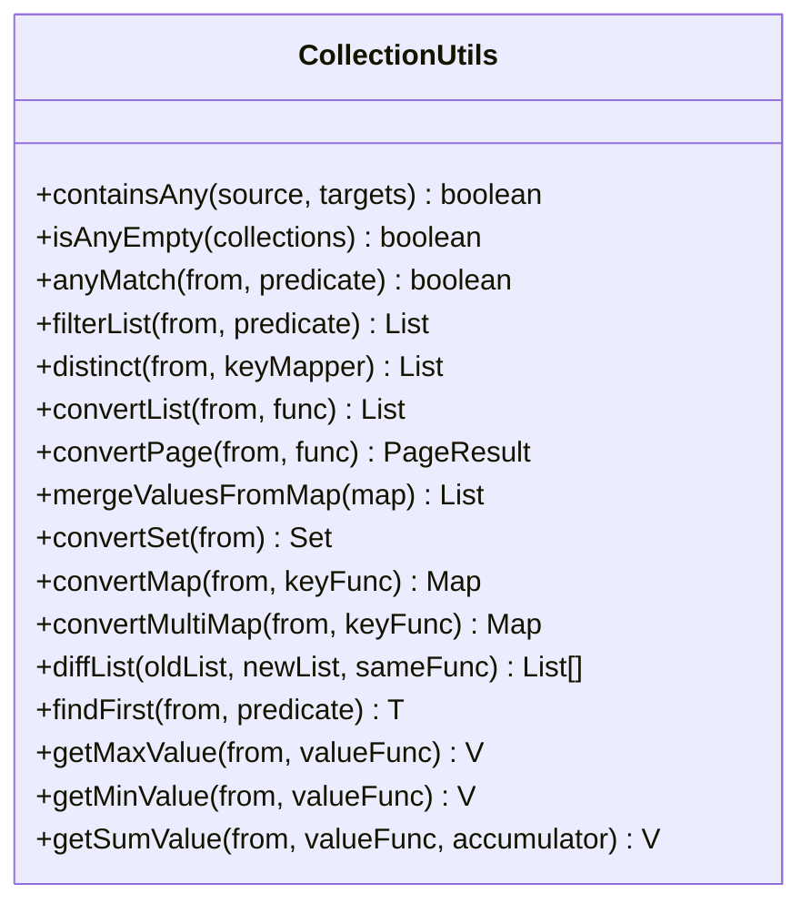
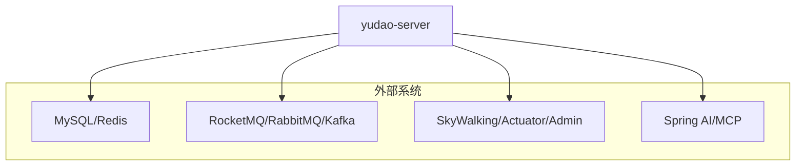

# 开发指南

<cite>
**本文引用的文件**
- [README.md](file://README.md)
- [AGENTS.md](file://AGENTS.md)
- [backend/README.md](file://backend/README.md)
- [frontend/admin-uniapp/README.md](file://frontend/admin-uniapp/README.md)
- [openspec/config.yaml](file://openspec/config.yaml)
- [agent_improvement/memory/MEMORY.md](file://agent_improvement/memory/MEMORY.md)
- [agent_improvement/memory/codegen-rules.md](file://agent_improvement/memory/codegen-rules.md)
- [backend/yudao-framework/yudao-common/src/main/java/cn/iocoder/yudao/framework/common/util/collection/CollectionUtils.java](file://backend/yudao-framework/yudao-common/src/main/java/cn/iocoder/yudao/framework/common/util/collection/CollectionUtils.java)
- [backend/yudao-server/src/main/resources/application-local.yaml](file://backend/yudao-server/src/main/resources/application-local.yaml)
</cite>

## 目录
1. [简介](#简介)
2. [项目结构](#项目结构)
3. [核心组件](#核心组件)
4. [架构总览](#架构总览)
5. [详细组件分析](#详细组件分析)
6. [依赖关系分析](#依赖关系分析)
7. [性能考虑](#性能考虑)
8. [故障排查指南](#故障排查指南)
9. [结论](#结论)
10. [附录](#附录)

## 简介
本开发指南面向参与 AgenticCPS 项目的开发者，系统阐述开发规范、代码风格与 Git 工作流程；详解 Vibe Coding + AI 自主编程的开发模式、Specs/Plans 规范化工作流与 AI 代理协作机制；给出新模块开发流程、平台适配器扩展方法与工具函数开发规范；提供代码生成器使用指南、低代码开发技巧与快速原型设计方法；文档化扩展点识别、插件开发与第三方集成方式；并涵盖开发环境配置、调试技巧与问题排查方法，最后总结最佳实践案例与经验。

## 项目结构
AgenticCPS 采用多模块分层架构，后端基于 Spring Boot 3.5.9，前端包含 Vue3 管理后台与 UniApp 移动端，核心模块为 yudao-module-cps（CPS 联盟返利系统）。项目强调“Vibe Coding + 低代码 + AI 自主编程”，通过规范化 Specs/Plans 与 AI 代理协作，实现从需求到代码的自动化交付。

**图表来源**
- [AGENTS.md:14-57](file://AGENTS.md#L14-L57)
- [README.md:267-284](file://README.md#L267-L284)

**章节来源**
- [AGENTS.md:14-57](file://AGENTS.md#L14-L57)
- [README.md:267-284](file://README.md#L267-L284)

## 核心组件
- 规范化 AI 编程工作流：.qoder/specs/（编码规范）、.qoder/plans/（实施计划）、.qoder/agents/（AI 代理）、.qoder/skills/（可复用技能）
- 低代码能力：代码生成器（后端分层 + 前端模板）、可视化工作流（Flowable）、报表/大屏设计器、MCP 协议（AI Agent 零代码接入）
- 平台适配器：CPS 平台适配器（策略模式，可插拔扩展），支持淘宝/京东/拼多多/抖音等
- AI 接口层：MCP 工具（商品搜索、比价、推广链接生成、订单查询、返利汇总）

**章节来源**
- [README.md:113-144](file://README.md#L113-L144)
- [README.md:147-210](file://README.md#L147-L210)
- [AGENTS.md:143-182](file://AGENTS.md#L143-L182)
- [AGENTS.md:161-168](file://AGENTS.md#L161-L168)

## 架构总览
系统采用“模块化 + 分层 + 低代码 + AI 自主编程”的混合架构。后端通过 yudao-server 聚合各模块，CPS 核心模块分为 API 定义层与业务实现层，业务实现层包含控制器、服务、数据访问层、定时任务与 MCP 接口层。前端提供 Vue3 管理后台与 UniApp 移动端，支持多端运行与统一后端交互。

**图表来源**
- [README.md:226-243](file://README.md#L226-L243)
- [AGENTS.md:143-168](file://AGENTS.md#L143-L168)

**章节来源**
- [README.md:226-243](file://README.md#L226-L243)
- [AGENTS.md:143-168](file://AGENTS.md#L143-L168)

## 详细组件分析

### 组件一：平台适配器（策略模式）
平台适配器通过统一接口对接不同联盟平台，新增平台只需实现接口并注册为 Spring Bean，无需改动核心逻辑。

**图表来源**
- [AGENTS.md:145-157](file://AGENTS.md#L145-L157)

**章节来源**
- [AGENTS.md:143-159](file://AGENTS.md#L143-L159)

### 组件二：MCP AI 接口层
MCP 接口层提供标准化的 AI Tools，支持 JSON-RPC 2.0 over Streamable HTTP，便于 AI Agent 直接调用。

**图表来源**
- [AGENTS.md:161-168](file://AGENTS.md#L161-L168)
- [README.md:185-209](file://README.md#L185-L209)

**章节来源**
- [AGENTS.md:161-168](file://AGENTS.md#L161-L168)
- [README.md:185-209](file://README.md#L185-L209)

### 组件三：代码生成器与低代码
代码生成器基于 Velocity 模板库，支持后端分层（DO/DAO/Service/Controller/VO）与前端多模板（Vue3 Element Plus/Vben Admin/Vben5 Antd/UniApp），覆盖单表、树表、主子表三种模式。

**图表来源**
- [codegen-rules.md:5-29](file://agent_improvement/memory/codegen-rules.md#L5-L29)
- [codegen-rules.md:327-480](file://agent_improvement/memory/codegen-rules.md#L327-L480)
- [codegen-rules.md:492-629](file://agent_improvement/memory/codegen-rules.md#L492-L629)
- [codegen-rules.md:631-659](file://agent_improvement/memory/codegen-rules.md#L631-L659)
- [codegen-rules.md:661-744](file://agent_improvement/memory/codegen-rules.md#L661-L744)

**章节来源**
- [codegen-rules.md:5-29](file://agent_improvement/memory/codegen-rules.md#L5-L29)
- [codegen-rules.md:327-480](file://agent_improvement/memory/codegen-rules.md#L327-L480)
- [codegen-rules.md:492-629](file://agent_improvement/memory/codegen-rules.md#L492-L629)
- [codegen-rules.md:631-659](file://agent_improvement/memory/codegen-rules.md#L631-L659)
- [codegen-rules.md:661-744](file://agent_improvement/memory/codegen-rules.md#L661-L744)

### 组件四：工具函数与通用工具
通用集合工具类提供丰富的集合转换、过滤、去重、分组、差异对比等方法，支撑业务层高效处理数据。

**图表来源**
- [CollectionUtils.java:22-352](file://backend/yudao-framework/yudao-common/src/main/java/cn/iocoder/yudao/framework/common/util/collection/CollectionUtils.java#L22-L352)

**章节来源**
- [CollectionUtils.java:22-352](file://backend/yudao-framework/yudao-common/src/main/java/cn/iocoder/yudao/framework/common/util/collection/CollectionUtils.java#L22-L352)

## 依赖关系分析
- 模块耦合：后端通过 yudao-server 聚合模块，模块间通过 API 定义层与服务接口交互；CPS 业务模块内部通过分层解耦，适配器与 MCP 层对外暴露能力。
- 外部依赖：MySQL/Redis/RocketMQ/RabbitMQ/Kafka/Quartz/SkyWalking 等基础设施；Spring AI 与 MCP 协议支持 AI Agent 集成。
- 规范约束：通过 .qoder/specs/ 与 .qoder/plans/ 约束 AI 编码与交付质量；通过代码生成器模板确保前后端一致性。

**图表来源**
- [backend/yudao-server/src/main/resources/application-local.yaml:13-135](file://backend/yudao-server/src/main/resources/application-local.yaml#L13-L135)
- [backend/yudao-server/src/main/resources/application-local.yaml:146-166](file://backend/yudao-server/src/main/resources/application-local.yaml#L146-L166)
- [backend/yudao-server/src/main/resources/application-local.yaml:228-294](file://backend/yudao-server/src/main/resources/application-local.yaml#L228-L294)

**章节来源**
- [backend/yudao-server/src/main/resources/application-local.yaml:13-135](file://backend/yudao-server/src/main/resources/application-local.yaml#L13-L135)
- [backend/yudao-server/src/main/resources/application-local.yaml:146-166](file://backend/yudao-server/src/main/resources/application-local.yaml#L146-L166)
- [backend/yudao-server/src/main/resources/application-local.yaml:228-294](file://backend/yudao-server/src/main/resources/application-local.yaml#L228-L294)

## 性能考虑
- 搜索与比价：单平台搜索 P99 < 2 秒，多平台比价 P99 < 5 秒
- 链接生成：转链生成 < 1 秒
- 订单同步：延迟 < 30 分钟
- 返利入账：平台结算后 24 小时内
- MCP 工具调用：搜索类 < 3 秒，查询类 < 1 秒

**章节来源**
- [README.md:326-341](file://README.md#L326-L341)

## 故障排查指南
- 开发环境启动
  - 后端：使用 Maven 编译并运行主类，或通过 Spring Boot 插件运行指定模块
  - 前端：安装依赖后启动开发服务器，支持 H5、小程序与 App 多端运行
  - Docker：通过 docker-compose 启动 MySQL、Redis、后端与前端服务
- 配置检查
  - application-local.yaml 中数据库、Redis、消息队列、定时任务、监控、微信公众号/小程序、CPS 平台密钥等关键配置
- 常见问题
  - 数据库时区：Asia/Shanghai，确保 JVM 与数据库一致
  - 多租户隔离：所有查询需包含 tenant_id
  - 软删除：使用 deleted 字段，禁止硬删除
  - 金额存储：统一使用整数（分）避免浮点误差
  - 默认密码：生产环境务必修改默认管理员密码

**章节来源**
- [AGENTS.md:84-140](file://AGENTS.md#L84-L140)
- [backend/yudao-server/src/main/resources/application-local.yaml:13-135](file://backend/yudao-server/src/main/resources/application-local.yaml#L13-L135)
- [backend/yudao-server/src/main/resources/application-local.yaml:146-166](file://backend/yudao-server/src/main/resources/application-local.yaml#L146-L166)
- [backend/yudao-server/src/main/resources/application-local.yaml:228-294](file://backend/yudao-server/src/main/resources/application-local.yaml#L228-L294)
- [AGENTS.md:227-234](file://AGENTS.md#L227-L234)

## 结论
AgenticCPS 通过“Vibe Coding + 低代码 + AI 自主编程”的组合拳，实现了从需求到交付的高效率与高质量。规范化 Specs/Plans 与 AI 代理协作确保理解一致、质量可控；平台适配器与 MCP 接口层提供强大的扩展能力；代码生成器与低代码工具大幅降低重复劳动。建议在新模块开发、平台扩展与第三方集成时严格遵循本文规范与流程，持续优化 Specs/Plans，使系统在实践中不断自进化。

## 附录

### 开发规范与代码风格
- 后端分层：DO/DAO/Service/Controller/VO 明确职责，遵循模板约定
- 命名规范：PascalCase 类名、camelCase 变量、小写中划线包路径
- 模板类型：通用(1)、树表(2)、ERP主表(11)，按场景选择
- 前端模板：Vue3 Element Plus、Vben Admin、Vben5 Antd、UniApp 移动端
- 错误码：统一定义与使用，树表与通用表分别提供错误码规范

**章节来源**
- [codegen-rules.md:31-50](file://agent_improvement/memory/codegen-rules.md#L31-L50)
- [codegen-rules.md:307-326](file://agent_improvement/memory/codegen-rules.md#L307-L326)
- [codegen-rules.md:327-480](file://agent_improvement/memory/codegen-rules.md#L327-L480)
- [codegen-rules.md:492-629](file://agent_improvement/memory/codegen-rules.md#L492-L629)
- [codegen-rules.md:631-659](file://agent_improvement/memory/codegen-rules.md#L631-L659)
- [codegen-rules.md:661-744](file://agent_improvement/memory/codegen-rules.md#L661-L744)

### Git 工作流程
- 规范化工作流：Specs/Plans → 方案设计 → AI 自主编码 → 自动测试 → 验收报告 → 文档输出
- 提交与评审：遵循约定式提交，Issue 与 PR 规范，功能悬赏与认领流程
- CI/CD：通过脚本与配置文件自动化构建与部署

**章节来源**
- [README.md:113-144](file://README.md#L113-L144)
- [README.md:494-509](file://README.md#L494-L509)

### 新模块开发流程
- 需求对齐：读取 Specs/Plans，明确目标与验收标准
- 方案设计：生成计划，确定技术选型与接口设计
- 自主编码：使用代码生成器与模板，AI 生成后端分层与前端页面
- 自动测试：生成单元测试并执行，确保覆盖率与正确性
- 验收交付：输出文档，更新 Specs/Plans，形成知识沉淀

**章节来源**
- [README.md:113-144](file://README.md#L113-L144)
- [codegen-rules.md:5-29](file://agent_improvement/memory/codegen-rules.md#L5-L29)

### 平台适配器扩展方法
- 实现 CpsPlatformClient 接口，提供平台唯一编码与核心能力
- 注册为 Spring Bean，无需修改核心业务逻辑
- 通过 MCP 接口层暴露工具，供 AI Agent 调用

**章节来源**
- [AGENTS.md:145-159](file://AGENTS.md#L145-L159)
- [AGENTS.md:161-168](file://AGENTS.md#L161-L168)

### 工具函数开发规范
- 遵循现有工具类命名与方法签名风格
- 提供泛型与空值安全处理
- 保持线程安全与性能优化

**章节来源**
- [CollectionUtils.java:22-352](file://backend/yudao-framework/yudao-common/src/main/java/cn/iocoder/yudao/framework/common/util/collection/CollectionUtils.java#L22-L352)

### 代码生成器使用指南
- 输入：数据库表结构
- 输出：后端分层代码 + 前端页面 + Swagger 文档 + 单元测试 + 建表脚本
- 模板选择：根据场景选择通用/树表/主子表模板

**章节来源**
- [README.md:147-166](file://README.md#L147-L166)
- [codegen-rules.md:5-29](file://agent_improvement/memory/codegen-rules.md#L5-L29)

### 低代码开发技巧
- 使用代码生成器一键生成 CRUD
- 可视化工作流设计审批流程
- 报表/大屏拖拽生成数据可视化
- MCP 协议零代码接入 AI Agent

**章节来源**
- [README.md:147-210](file://README.md#L147-L210)

### 快速原型设计方法
- 以 Specs/Plans 为蓝图，AI 生成原型代码
- 前后端联调，快速迭代
- 通过 MCP 工具验证核心业务逻辑

**章节来源**
- [README.md:113-144](file://README.md#L113-L144)
- [README.md:185-209](file://README.md#L185-L209)

### 扩展点识别与插件开发
- 适配器扩展：实现新平台适配器
- 工具扩展：新增 MCP 工具与资源
- 模块扩展：基于现有模块模板快速复制

**章节来源**
- [AGENTS.md:143-168](file://AGENTS.md#L143-L168)
- [AGENTS.md:161-168](file://AGENTS.md#L161-L168)

### 第三方集成方式
- 通过 MCP 协议集成 AI Agent
- 通过消息队列集成第三方系统
- 通过 SDK/HTTP 接口集成支付、短信、地图等服务

**章节来源**
- [AGENTS.md:161-168](file://AGENTS.md#L161-L168)
- [backend/yudao-server/src/main/resources/application-local.yaml:121-135](file://backend/yudao-server/src/main/resources/application-local.yaml#L121-L135)
- [backend/yudao-server/src/main/resources/application-local.yaml:228-294](file://backend/yudao-server/src/main/resources/application-local.yaml#L228-L294)

### 开发环境配置
- 后端：JDK 17/21、MySQL 5.7/8.0+、Redis 5.0+、Maven 3.8+、Spring Boot 3.5.9
- 前端：Node.js 16+、pnpm、Vue3、TypeScript、Vite、UnoCSS
- Docker：一键启动 MySQL、Redis、后端、前端

**章节来源**
- [README.md:301-310](file://README.md#L301-L310)
- [AGENTS.md:84-140](file://AGENTS.md#L84-L140)
- [frontend/admin-uniapp/README.md:36-45](file://frontend/admin-uniapp/README.md#L36-L45)

### 调试技巧
- 使用 Actuator 端点与 Spring Boot Admin 监控
- 启用 Druid SQL 监控与慢 SQL 记录
- SkyWalking 链路追踪与日志中心定位问题
- 前端使用 ESLint/Prettier/Husky 保证代码质量

**章节来源**
- [backend/yudao-server/src/main/resources/application-local.yaml:146-166](file://backend/yudao-server/src/main/resources/application-local.yaml#L146-L166)
- [backend/yudao-server/src/main/resources/application-local.yaml:168-194](file://backend/yudao-server/src/main/resources/application-local.yaml#L168-L194)
- [frontend/admin-uniapp/README.md:82](file://frontend/admin-uniapp/README.md#L82)

### 最佳实践案例
- 通过 Specs/Plans 精准对齐需求，避免“AI 乱写代码”
- 先设计再确认后编码，零返工
- 每次项目反馈自动优化 Specs/Plans，越用越聪明
- 使用代码生成器与低代码工具，大幅提升开发效率

**章节来源**
- [README.md:113-144](file://README.md#L113-L144)
- [README.md:147-210](file://README.md#L147-L210)