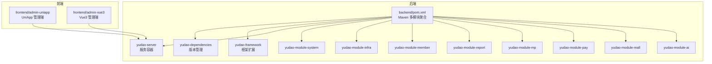
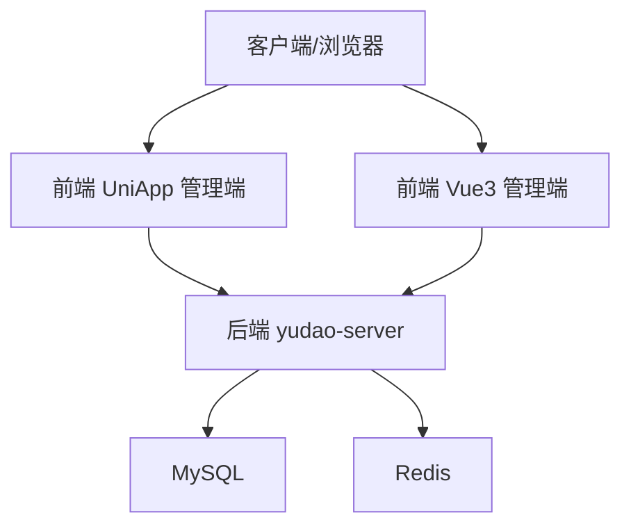
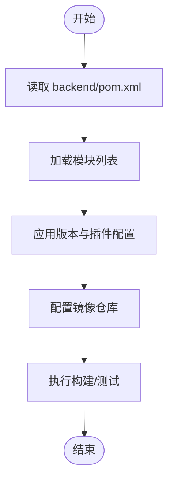
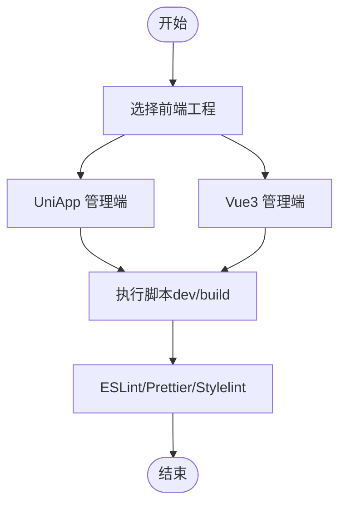
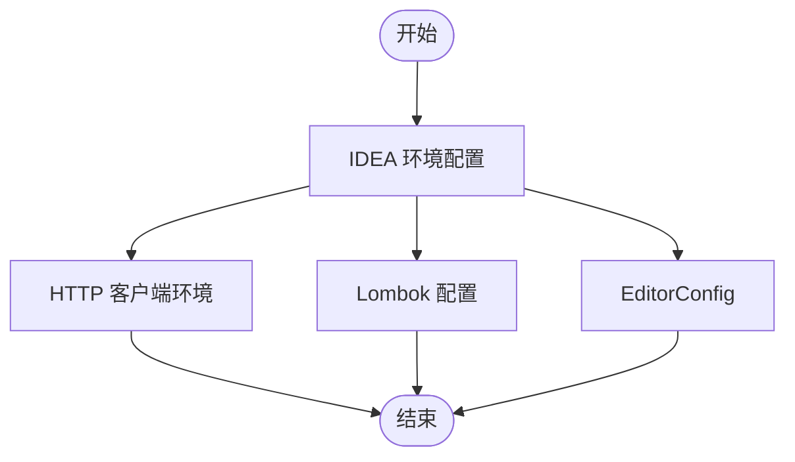
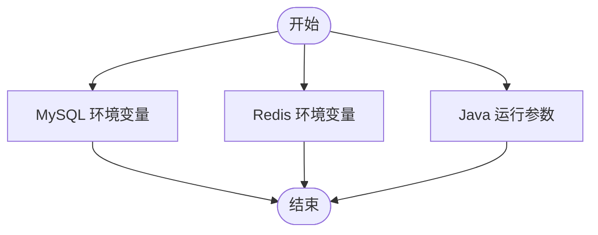
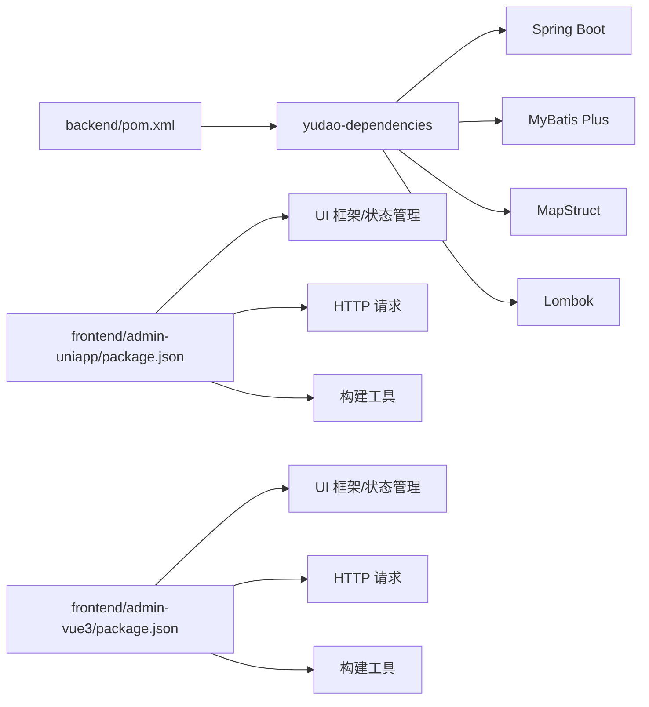
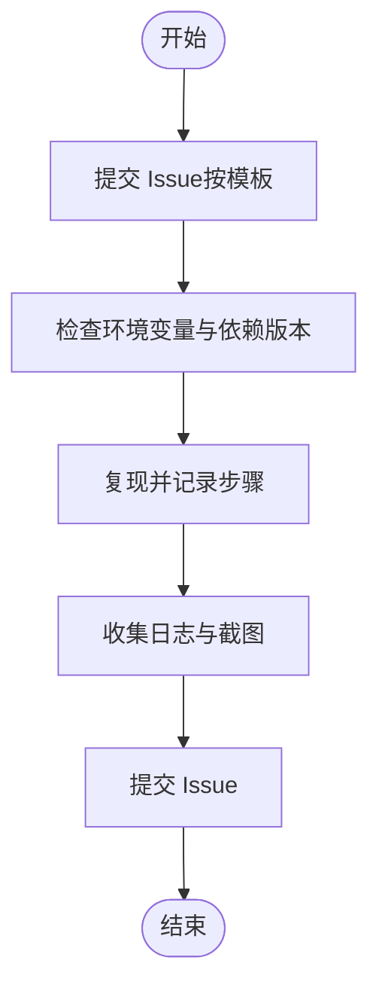

# 开发指南

<cite>
**本文引用的文件**
- [README.md](file://README.md)
- [backend/README.md](file://backend/README.md)
- [backend/pom.xml](file://backend/pom.xml)
- [backend/script/docker/docker.env](file://backend/script/docker/docker.env)
- [backend/script/idea/http-client.env.json](file://backend/script/idea/http-client.env.json)
- [backend/lombok.config](file://backend/lombok.config)
- [frontend/admin-uniapp/package.json](file://frontend/admin-uniapp/package.json)
- [frontend/admin-uniapp/eslint.config.mjs](file://frontend/admin-uniapp/eslint.config.mjs)
- [frontend/admin-uniapp/.commitlintrc.cjs](file://frontend/admin-uniapp/.commitlintrc.cjs)
- [frontend/admin-uniapp/.editorconfig](file://frontend/admin-uniapp/.editorconfig)
- [frontend/admin-vue3/package.json](file://frontend/admin-vue3/package.json)
- [backend/.gitee/ISSUE_TEMPLATE.zh-CN.md](file://backend/.gitee/ISSUE_TEMPLATE.zh-CN.md)
</cite>

## 目录
1. [简介](#简介)
2. [项目结构](#项目结构)
3. [核心组件](#核心组件)
4. [架构总览](#架构总览)
5. [详细组件分析](#详细组件分析)
6. [依赖分析](#依赖分析)
7. [性能考虑](#性能考虑)
8. [故障排查指南](#故障排查指南)
9. [结论](#结论)
10. [附录](#附录)

## 简介
本开发指南面向希望参与 AgenticCPS 项目的开发者，提供从环境搭建、项目导入、依赖安装、环境变量配置，到代码提交规范、分支管理策略、问题反馈流程、功能贡献指南的完整说明。同时涵盖开发规范、编码标准、文档编写要求、代码审查流程，以及常见开发场景的解决方案、调试技巧、性能优化建议与最佳实践，帮助新开发者快速融入项目。

## 项目结构
AgenticCPS 采用前后端分离架构，包含后端多模块 Maven 工程与多个前端工程：
- 后端：基于 Spring Boot 的多模块工程，包含依赖版本管理、框架扩展、各业务模块与服务端容器。
- 前端：包含 UniApp 管理端与 Vue3 管理端两个前端工程，分别对应移动端与 PC 管理端。
- 基础设施：Docker 环境变量配置、IDE 环境配置、数据库脚本与工具等。

**图示来源**
- [backend/pom.xml:10-24](file://backend/pom.xml#L10-L24)
- [backend/README.md:261-284](file://backend/README.md#L261-L284)

**章节来源**
- [backend/README.md:261-284](file://backend/README.md#L261-L284)
- [README.md:267-284](file://README.md#L267-L284)

## 核心组件
- 后端多模块工程：通过 Maven 聚合管理，统一版本与插件配置，便于模块间依赖与构建一致性。
- 前端工程：UniApp 管理端与 Vue3 管理端分别提供移动端与 PC 端管理体验，均包含完善的构建脚本与开发工具链。
- 基础设施与环境：Docker 环境变量、IDE 环境配置、数据库脚本与工具，支撑本地与容器化开发。

**章节来源**
- [backend/pom.xml:10-24](file://backend/pom.xml#L10-L24)
- [frontend/admin-uniapp/package.json:29-98](file://frontend/admin-uniapp/package.json#L29-L98)
- [frontend/admin-vue3/package.json:7-26](file://frontend/admin-vue3/package.json#L7-L26)

## 架构总览
系统采用“后端多模块 + 前端双端”的整体架构，后端通过统一的服务容器对外提供 API，前端通过 HTTP 客户端与后端交互；同时提供 Docker 环境变量以支持容器化部署。

**图示来源**
- [backend/script/docker/docker.env:1-26](file://backend/script/docker/docker.env#L1-L26)
- [backend/script/idea/http-client.env.json:1-21](file://backend/script/idea/http-client.env.json#L1-L21)

**章节来源**
- [backend/script/docker/docker.env:1-26](file://backend/script/docker/docker.env#L1-L26)
- [backend/script/idea/http-client.env.json:1-21](file://backend/script/idea/http-client.env.json#L1-L21)

## 详细组件分析

### 后端多模块工程（Maven）
- 模块组织：通过聚合 POM 管理依赖版本、编译插件与仓库镜像，确保构建一致性。
- 版本与插件：统一 Java 版本、Surefire 插件、编译器插件与 flatten 插件，提升构建稳定性。
- 依赖管理：集中管理 Spring Boot、MapStruct、Lombok 等关键依赖版本。

**图示来源**
- [backend/pom.xml:10-24](file://backend/pom.xml#L10-L24)
- [backend/pom.xml:30-44](file://backend/pom.xml#L30-L44)
- [backend/pom.xml:58-141](file://backend/pom.xml#L58-L141)
- [backend/pom.xml:144-172](file://backend/pom.xml#L144-L172)

**章节来源**
- [backend/pom.xml:10-24](file://backend/pom.xml#L10-L24)
- [backend/pom.xml:30-44](file://backend/pom.xml#L30-L44)
- [backend/pom.xml:58-141](file://backend/pom.xml#L58-L141)
- [backend/pom.xml:144-172](file://backend/pom.xml#L144-L172)

### 前端工程（UniApp 与 Vue3）
- UniApp 管理端：提供多端构建脚本（H5、小程序、App 等），包含 Husky、ESLint、TypeScript 等开发工具。
- Vue3 管理端：提供 Vite 构建脚本与多环境构建命令，包含 ESLint、Prettier、Stylelint 等代码质量工具。

**图示来源**
- [frontend/admin-uniapp/package.json:29-98](file://frontend/admin-uniapp/package.json#L29-L98)
- [frontend/admin-vue3/package.json:7-26](file://frontend/admin-vue3/package.json#L7-L26)

**章节来源**
- [frontend/admin-uniapp/package.json:29-98](file://frontend/admin-uniapp/package.json#L29-L98)
- [frontend/admin-vue3/package.json:7-26](file://frontend/admin-vue3/package.json#L7-L26)

### IDE 与环境配置
- IntelliJ IDEA 环境：提供 HTTP 客户端环境配置，包含本地与网关两种环境，便于 API 调试。
- Lombok 配置：统一 Lombok 行为，减少样板代码。
- EditorConfig：统一缩进、换行、字符集等编辑器配置。

**图示来源**
- [backend/script/idea/http-client.env.json:1-21](file://backend/script/idea/http-client.env.json#L1-L21)
- [backend/lombok.config:1-5](file://backend/lombok.config#L1-L5)
- [frontend/admin-uniapp/.editorconfig:1-14](file://frontend/admin-uniapp/.editorconfig#L1-L14)

**章节来源**
- [backend/script/idea/http-client.env.json:1-21](file://backend/script/idea/http-client.env.json#L1-L21)
- [backend/lombok.config:1-5](file://backend/lombok.config#L1-L5)
- [frontend/admin-uniapp/.editorconfig:1-14](file://frontend/admin-uniapp/.editorconfig#L1-L14)

### Docker 环境变量
- 数据库与缓存：提供 MySQL 与 Redis 的默认连接参数与环境变量占位符。
- 服务端：配置 JVM 参数与前端静态资源路径等。
- 管理端：配置前端运行环境与 API 基础地址。

**图示来源**
- [backend/script/docker/docker.env:1-26](file://backend/script/docker/docker.env#L1-L26)

**章节来源**
- [backend/script/docker/docker.env:1-26](file://backend/script/docker/docker.env#L1-L26)

## 依赖分析
- 后端依赖：通过 yudao-dependencies 统一版本管理，集中声明 Spring Boot、MyBatis Plus、MapStruct、Lombok 等关键依赖。
- 前端依赖：UniApp 与 Vue3 工程分别声明各自依赖生态，包含 UI 框架、状态管理、HTTP 请求、构建工具等。

**图示来源**
- [backend/pom.xml:46-56](file://backend/pom.xml#L46-L56)
- [frontend/admin-uniapp/package.json:99-127](file://frontend/admin-uniapp/package.json#L99-L127)
- [frontend/admin-vue3/package.json:27-84](file://frontend/admin-vue3/package.json#L27-L84)

**章节来源**
- [backend/pom.xml:46-56](file://backend/pom.xml#L46-L56)
- [frontend/admin-uniapp/package.json:99-127](file://frontend/admin-uniapp/package.json#L99-L127)
- [frontend/admin-vue3/package.json:27-84](file://frontend/admin-vue3/package.json#L27-L84)

## 性能考虑
- 后端性能目标：单平台搜索、多平台比价、转链生成、订单同步延迟、返利入账、MCP Tool 调用等均有明确性能指标，指导开发与压测。
- 前端性能：合理拆分构建产物、启用压缩与缓存、避免不必要的重渲染与网络请求。

**章节来源**
- [backend/README.md:326-336](file://backend/README.md#L326-L336)
- [README.md:326-342](file://README.md#L326-L342)

## 故障排查指南
- 问题反馈模板：提供标准化 Issue 模板，便于快速定位与复现问题。
- 环境变量检查：确认 Docker 环境变量、IDE HTTP 客户端环境与前端构建环境变量正确。
- 依赖与版本：核对后端依赖版本与前端 Node/PNPM 版本要求，避免版本不匹配导致的问题。

**图示来源**
- [backend/.gitee/ISSUE_TEMPLATE.zh-CN.md:1-26](file://backend/.gitee/ISSUE_TEMPLATE.zh-CN.md#L1-L26)

**章节来源**
- [backend/.gitee/ISSUE_TEMPLATE.zh-CN.md:1-26](file://backend/.gitee/ISSUE_TEMPLATE.zh-CN.md#L1-L26)

## 结论
本开发指南提供了从环境搭建到开发规范、从问题反馈到性能优化的完整路径。建议开发者在开始开发前，先完成环境准备与依赖安装，再熟悉代码提交规范与分支管理策略，最后结合调试与性能优化的最佳实践，高效地参与项目贡献。

## 附录

### 开发环境搭建与项目导入
- 后端：安装 JDK 17/21、Maven 3.8+、MySQL 5.7/8.0+、Redis 5.0+，克隆后端仓库，导入 Maven 聚合工程。
- 前端：安装 Node.js 16+、PNPM，进入前端工程目录执行安装与启动脚本。
- Docker：参考 docker.env 配置数据库与缓存连接，按需启动容器。

**章节来源**
- [backend/README.md:301-310](file://backend/README.md#L301-L310)
- [backend/README.md:313-324](file://backend/README.md#L313-L324)
- [frontend/admin-uniapp/package.json:25-28](file://frontend/admin-uniapp/package.json#L25-L28)
- [frontend/admin-vue3/package.json:155-158](file://frontend/admin-vue3/package.json#L155-L158)
- [backend/script/docker/docker.env:1-26](file://backend/script/docker/docker.env#L1-L26)

### 依赖安装说明
- 后端：使用 Maven 管理依赖，统一版本由 yudao-dependencies 提供。
- 前端：使用 PNPM 管理依赖，确保 Node 版本满足要求。

**章节来源**
- [backend/pom.xml:46-56](file://backend/pom.xml#L46-L56)
- [frontend/admin-uniapp/package.json:8-8](file://frontend/admin-uniapp/package.json#L8-L8)
- [frontend/admin-vue3/package.json:155-158](file://frontend/admin-vue3/package.json#L155-L158)

### 环境变量设置
- Docker 环境变量：配置数据库、缓存、JVM 参数与前端运行参数。
- IDEA HTTP 客户端环境：配置本地与网关环境的 baseUrl、token、租户等。
- EditorConfig：统一编辑器缩进、换行与字符集。

**章节来源**
- [backend/script/docker/docker.env:1-26](file://backend/script/docker/docker.env#L1-L26)
- [backend/script/idea/http-client.env.json:1-21](file://backend/script/idea/http-client.env.json#L1-L21)
- [frontend/admin-uniapp/.editorconfig:1-14](file://frontend/admin-uniapp/.editorconfig#L1-L14)

### 代码提交规范与分支管理
- 提交信息规范：使用 Conventional Commits，确保提交信息清晰可读。
- 分支管理：建议采用 Feature 分支开发，通过 Pull Request 合并，配合代码审查与自动化测试。

**章节来源**
- [frontend/admin-uniapp/.commitlintrc.cjs:1-4](file://frontend/admin-uniapp/.commitlintrc.cjs#L1-L4)

### 问题反馈流程
- 提交 Issue：按模板填写基本信息、复现步骤、报错信息与截图。
- 自查与复现：在提交前进行充分自查，确保问题可复现。
- 跟进与解决：关注社区与维护者反馈，及时补充信息。

**章节来源**
- [backend/.gitee/ISSUE_TEMPLATE.zh-CN.md:1-26](file://backend/.gitee/ISSUE_TEMPLATE.zh-CN.md#L1-L26)

### 功能特性贡献指南
- 需求对齐：基于项目规范与计划，确保 AI 理解无偏差。
- 方案先行：先设计、后确认、再编码，零返工。
- 自主编码：遵循规范约束与验收标准，确保质量可控。
- 持续自进化：每次反馈自动优化规范与计划。

**章节来源**
- [README.md:113-144](file://README.md#L113-L144)

### 开发规范与编码标准
- 前端代码质量：ESLint、Prettier、Stylelint 统一风格与格式。
- 编辑器配置：EditorConfig 统一缩进、换行与字符集。
- Lombok 配置：统一生成代码风格，减少样板代码。

**章节来源**
- [frontend/admin-uniapp/eslint.config.mjs:1-65](file://frontend/admin-uniapp/eslint.config.mjs#L1-L65)
- [frontend/admin-uniapp/.editorconfig:1-14](file://frontend/admin-uniapp/.editorconfig#L1-L14)
- [backend/lombok.config:1-5](file://backend/lombok.config#L1-L5)

### 文档编写要求与代码审查流程
- 文档：保持与代码同步更新，遵循项目文档规范。
- 代码审查：通过 Pull Request 进行审查，确保符合规范与质量标准。

**章节来源**
- [README.md:113-144](file://README.md#L113-L144)

### 常见开发场景与调试技巧
- API 调试：使用 IDEA HTTP 客户端环境快速切换本地与网关环境。
- 前端调试：利用 Vite/H5/小程序等多端构建脚本进行调试。
- 性能优化：关注搜索、比价、转链等关键路径的性能指标，持续优化。

**章节来源**
- [backend/script/idea/http-client.env.json:1-21](file://backend/script/idea/http-client.env.json#L1-L21)
- [frontend/admin-uniapp/package.json:29-98](file://frontend/admin-uniapp/package.json#L29-L98)
- [backend/README.md:326-336](file://backend/README.md#L326-L336)