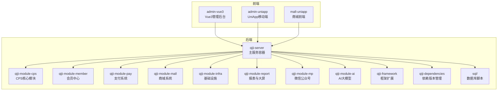
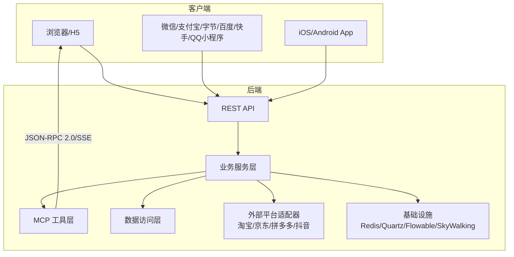
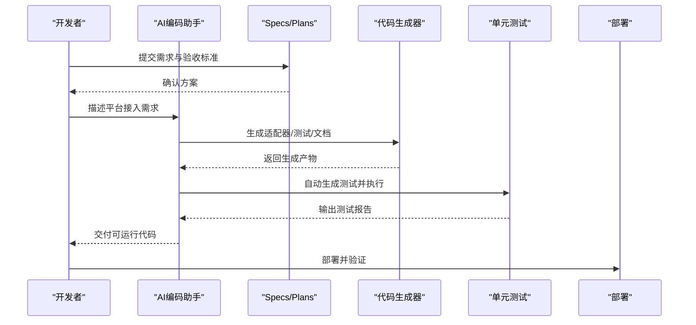
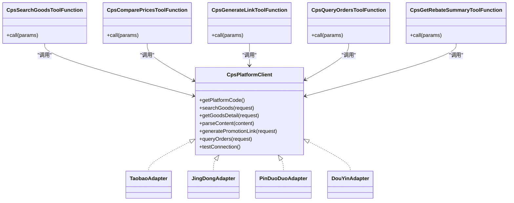
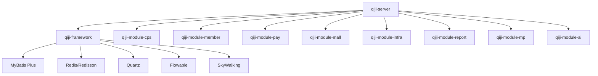

# 开发指南

<cite>
**本文引用的文件**   
- [README.md](file://README.md)
- [backend/README.md](file://backend/README.md)
- [AGENTS.md](file://AGENTS.md)
- [frontend/admin-uniapp/README.md](file://frontend/admin-uniapp/README.md)
- [backend/lombok.config](file://backend/lombok.config)
- [frontend/admin-uniapp/.editorconfig](file://frontend/admin-uniapp/.editorconfig)
- [frontend/admin-uniapp/eslint.config.mjs](file://frontend/admin-uniapp/eslint.config.mjs)
- [frontend/admin-uniapp/tsconfig.json](file://frontend/admin-uniapp/tsconfig.json)
- [openspec/config.yaml](file://openspec/config.yaml)
- [backend/qiji-framework/qiji-common/《芋道 Spring Boot 参数校验 Validation 入门》.md](file://backend/qiji-framework/qiji-common/《芋道 Spring Boot 参数校验 Validation 入门》.md)
- [backend/qiji-framework/qiji-spring-boot-starter-job/《芋道 Spring Boot 定时任务入门》.md](file://backend/qiji-framework/qiji-spring-boot-starter-job/《芋道 Spring Boot 定时任务入门》.md)
- [backend/qiji-framework/qiji-spring-boot-starter-monitor/《芋道 Spring Boot 监控工具 Admin 入门》.md](file://backend/qiji-framework/qiji-spring-boot-starter-monitor/《芋道 Spring Boot 监控工具 Admin 入门》.md)
- [backend/qiji-framework/qiji-spring-boot-starter-monitor/《芋道 Spring Boot 监控端点 Actuator 入门》.md](file://backend/qiji-framework/qiji-spring-boot-starter-monitor/《芋道 Spring Boot 监控端点 Actuator 入门》.md)
- [backend/qiji-framework/qiji-spring-boot-starter-monitor/《芋道 Spring Boot 链路追踪 SkyWalking 入门》.md](file://backend/qiji-framework/qiji-spring-boot-starter-monitor/《芋道 Spring Boot 链路追踪 SkyWalking 入门》.md)
- [backend/qiji-framework/qiji-spring-boot-starter-mq/《芋道 Spring Boot 事件机制 Event 入门》.md](file://backend/qiji-framework/qiji-spring-boot-starter-mq/《芋道 Spring Boot 事件机制 Event 入门》.md)
- [backend/qiji-framework/qiji-spring-boot-starter-mq/《芋道 Spring Boot 消息队列 Kafka 入门》.md](file://backend/qiji-framework/qiji-spring-boot-starter-mq/《芋道 Spring Boot 消息队列 Kafka 入门》.md)
- [backend/qiji-framework/qiji-spring-boot-starter-mq/《芋道 Spring Boot 消息队列 RabbitMQ 入门》.md](file://backend/qiji-framework/qiji-spring-boot-starter-mq/《芋道 Spring Boot 消息队列 RabbitMQ 入门》.md)
- [backend/qiji-framework/qiji-spring-boot-starter-mq/《芋道 Spring Boot 消息队列 RocketMQ 入门》.md](file://backend/qiji-framework/qiji-spring-boot-starter-mq/《芋道 Spring Boot 消息队列 RocketMQ 入门》.md)
- [backend/qiji-framework/qiji-spring-boot-starter-mybatis/《芋道 Spring Boot MyBatis 入门》.md](file://backend/qiji-framework/qiji-spring-boot-starter-mybatis/《芋道 Spring Boot MyBatis 入门》.md)
</cite>

## 目录
1. [简介](#简介)
2. [项目结构](#项目结构)
3. [核心组件](#核心组件)
4. [架构总览](#架构总览)
5. [详细组件分析](#详细组件分析)
6. [依赖关系分析](#依赖关系分析)
7. [性能考虑](#性能考虑)
8. [故障排查指南](#故障排查指南)
9. [结论](#结论)
10. [附录](#附录)

## 简介
AgenticCPS 是一个融合“Vibe Coding（氛围编程）+ 低代码 + AI 自主编程”的开箱即用智能 CPS 联盟返利平台。其后端基于 Spring Boot 3.5.9，前端包含 Vue3 管理后台与 UniApp 移动端，提供多平台（淘宝、京东、拼多多、抖音）返利搜索、比价、订单追踪、提现与 MCP AI 接口等能力，并通过 Docker 一键部署。项目强调“自然语言描述需求，AI 自动实现”，并提供代码生成器、可视化工作流、报表与大屏设计器等低代码能力。

章节来源
- [README.md: 10-15:10-15](file://README.md#L10-L15)
- [README.md: 84-144:84-144](file://README.md#L84-L144)
- [README.md: 147-228:147-228](file://README.md#L147-L228)
- [README.md: 267-302:267-302](file://README.md#L267-L302)
- [README.md: 305-379:305-379](file://README.md#L305-L379)

## 项目结构
项目采用前后端分离与模块化组织，后端以 Maven 多模块划分，前端包含 admin-vue3 与 admin-uniapp 两套管理后台，另有 mall-uniapp 商城前端。后端模块涵盖系统管理、会员中心、基础设施、支付、商城、AI、微信公众号、报表与大屏、CPS 核心模块等；前端提供统一的 UI 组件与多端适配能力。



图示来源
- [AGENTS.md: 14-62:14-62](file://AGENTS.md#L14-L62)
- [README.md: 267-284:267-284](file://README.md#L267-L284)

章节来源
- [AGENTS.md: 14-62:14-62](file://AGENTS.md#L14-L62)
- [README.md: 267-284:267-284](file://README.md#L267-L284)

## 核心组件
- 后端核心：Spring Boot 3.5.9 + Spring Security + Spring AI（MCP 支持）+ MyBatis Plus + Redis/Redisson + Flowable + Quartz + SkyWalking + MapStruct
- 前端核心：Vue 3.5.12 + Element Plus + TypeScript + UniApp（多端适配）
- AI 与 MCP：CPS 模块提供 5 个 MCP 工具函数，支持 AI Agent 直接调用
- 低代码：代码生成器（单表/树表/主子表）、可视化工作流（Flowable）、报表与大屏设计器、打印设计器
- 开发与运维：Docker 一键部署、Jenkinsfile、IDE 与代码规范配置

章节来源
- [README.md: 286-302:286-302](file://README.md#L286-L302)
- [frontend/admin-uniapp/README.md: 57-71:57-71](file://frontend/admin-uniapp/README.md#L57-L71)
- [AGENTS.md: 170-190:170-190](file://AGENTS.md#L170-L190)
- [AGENTS.md: 205-227:205-227](file://AGENTS.md#L205-L227)

## 架构总览
系统采用后端多模块与前端多入口的分层架构，后端通过 qiji-server 聚合各模块，CPS 核心模块通过平台适配器（策略模式）对接多平台，MCP 层向 AI Agent 提供标准化工具调用，基础设施模块提供缓存、消息队列、定时任务、监控等通用能力。



图示来源
- [AGENTS.md: 150-204:150-204](file://AGENTS.md#L150-L204)
- [AGENTS.md: 170-190:170-190](file://AGENTS.md#L170-L190)

章节来源
- [AGENTS.md: 150-204:150-204](file://AGENTS.md#L150-L204)
- [AGENTS.md: 170-190:170-190](file://AGENTS.md#L170-L190)

## 详细组件分析

### 开发环境与 IDE 配置
- 后端
  - JDK：17 或 21（推荐 21）
  - Maven：3.8+
  - Lombok：启用链式调用与父类调用策略
- 前端（admin-vue3）
  - Node.js：>= 16；pnpm：>= 8.6
  - TypeScript：开启严格模式与类型检查
- 前端（admin-uniapp）
  - Node.js：>= 20；pnpm：>= 9
  - ESLint + Prettier + UnoCSS + i18n + 多端适配
- Docker：一键拉起 MySQL 8、Redis 6、后端服务、前端面板

章节来源
- [README.md: 307-317:307-317](file://README.md#L307-L317)
- [README.md: 352-367:352-367](file://README.md#L352-L367)
- [backend/lombok.config: 1-5:1-5](file://backend/lombok.config#L1-L5)
- [frontend/admin-uniapp/README.md: 42-44:42-44](file://frontend/admin-uniapp/README.md#L42-L44)
- [frontend/admin-uniapp/eslint.config.mjs: 1-65:1-65](file://frontend/admin-uniapp/eslint.config.mjs#L1-L65)
- [frontend/admin-uniapp/tsconfig.json: 1-46:1-46](file://frontend/admin-uniapp/tsconfig.json#L1-L46)
- [AGENTS.md: 135-148:135-148](file://AGENTS.md#L135-L148)

### 代码规范与 Git 工作流
- 统一字符集与缩进：EditorConfig 设置 UTF-8、2 空格缩进、LF 换行
- 前端 ESLint 规则：关闭部分严格规则、格式化 CSS/HTML、Vue 块顺序
- TypeScript 配置：路径别名、类型声明、Volar 插件、生成 source map
- 文件操作安全：避免 PowerShell 直接读写含中文的 UTF-8 文件，使用 Python 替代并校验编码
- Git 提交：建议采用约定式提交（Conventional Commits）

章节来源
- [frontend/admin-uniapp/.editorconfig: 1-14:1-14](file://frontend/admin-uniapp/.editorconfig#L1-L14)
- [frontend/admin-uniapp/eslint.config.mjs: 24-51:24-51](file://frontend/admin-uniapp/eslint.config.mjs#L24-L51)
- [frontend/admin-uniapp/tsconfig.json: 2-33:2-33](file://frontend/admin-uniapp/tsconfig.json#L2-L33)
- [AGENTS.md: 266-344:266-344](file://AGENTS.md#L266-L344)
- [openspec/config.yaml: 12-21:12-21](file://openspec/config.yaml#L12-L21)

### 代码审查流程
- 单元测试：各模块均提供 application-unit-test.yaml 测试配置，建议在 PR 中确保测试通过
- 自动化：Jenkinsfile 存在于后端脚本目录，可作为 CI/CD 参考
- 规范遵循：基于 AGENTS.md 的模式与约束，确保新增代码符合平台适配器（策略模式）、MCP 工具注册、数据库命名与字段约定

章节来源
- [AGENTS.md: 150-169:150-169](file://AGENTS.md#L150-L169)
- [AGENTS.md: 170-190:170-190](file://AGENTS.md#L170-L190)
- [AGENTS.md: 228-235:228-235](file://AGENTS.md#L228-L235)

### 新功能开发流程（模块/接口/数据库/测试）
- 模块开发流程
  - 需求对齐：参考 .qoder/ 下的 specs/plans/agents/skills，明确目标与验收
  - 方案设计：生成计划与交付清单，用户确认
  - 自主编码：AI 基于规范生成代码（含后端 CRUD、前端页面、Swagger 文档、单元测试）
  - 验收交付：自动测试 + 规范约束 + 文档输出
- 接口设计规范
  - REST 接口：Admin/Member 两套控制器，遵循统一返回与鉴权
  - MCP 工具：注册为 Spring Bean，参数与返回值结构化，记录访问日志
- 数据库变更规范
  - 货币字段统一为“分”（整数），时间使用上海时区
  - 软删除 via deleted 字段，多租户 via tenant_id
  - CPS 模块表统一 cps_* 前缀
- 测试用例编写
  - 使用 application-unit-test.yaml 配置测试环境
  - 覆盖核心业务流程与边界条件，确保 CI 可运行

```mermaid
flowchart TD
Start(["开始"]) --> Align["需求对齐<br/>.qoder/specs/plans/agents/skills]
Align --> Design["生成计划与验收标准"]
Design --> Confirm{"用户确认"}
Confirm --> |否| Iterate["调整方案"]
Iterate --> Design
Confirm --> |是| AutoGen["AI 自动生成代码<br/>后端+前端+测试+文档"]
AutoGen --> Test["自动测试与质量检查"]
Test --> Review["代码审查与合并"]
Review --> End(["结束"])
```

图示来源
- [README.md: 113-135:113-135](file://README.md#L113-L135)
- [AGENTS.md: 150-169:150-169](file://AGENTS.md#L150-L169)
- [AGENTS.md: 170-190:170-190](file://AGENTS.md#L170-L190)
- [AGENTS.md: 228-235:228-235](file://AGENTS.md#L228-L235)

章节来源
- [README.md: 113-135:113-135](file://README.md#L113-L135)
- [AGENTS.md: 150-169:150-169](file://AGENTS.md#L150-L169)
- [AGENTS.md: 170-190:170-190](file://AGENTS.md#L170-L190)
- [AGENTS.md: 228-235:228-235](file://AGENTS.md#L228-L235)

### 第三方平台接入开发（适配器/文档解析/错误处理/性能优化）
- 平台适配器开发
  - 实现 CpsPlatformClient 接口，注册为 Spring Bean，工厂类负责选择与路由
  - 无需改动核心逻辑，仅新增平台实现与注册
- API 文档解析
  - AI 基于 OpenAPI/接口文档自动生成适配器与测试
- 错误处理机制
  - 统一异常与降级策略，幂等与重试控制
  - 访问日志与链路追踪（SkyWalking）定位问题
- 性能优化建议
  - 缓存热点数据（Redis/Redisson）
  - 分页与索引优化，异步处理耗时任务（Quartz/消息队列）
  - MCP 工具调用延迟目标：<3s（搜索类）/<1s（查询类）



图示来源
- [README.md: 113-135:113-135](file://README.md#L113-L135)
- [AGENTS.md: 150-169:150-169](file://AGENTS.md#L150-L169)
- [AGENTS.md: 170-190:170-190](file://AGENTS.md#L170-L190)

章节来源
- [AGENTS.md: 150-169:150-169](file://AGENTS.md#L150-L169)
- [AGENTS.md: 170-190:170-190](file://AGENTS.md#L170-L190)

### AI 编程指南（Vibe Coding、MCP 协议、AI 代理管理、代码生成规则）
- Vibe Coding 工作流
  - 读取 Specs/Plans → 设计方案 → AI 自主编码 → 自动测试 → 验收报告 → 文档输出
- MCP 协议使用
  - 工具端点：/mcp/cps，传输：Streamable HTTP（JSON-RPC 2.0）
  - 工具清单：cps_search_goods、cps_compare_prices、cps_generate_link、cps_query_orders、cps_get_rebate_summary
  - 认证：API Key（cps_mcp_api_key 表），访问日志：cps_mcp_access_log
- AI 代理管理
  - 通过 .qoder/ 下的 agents/ 与 skills/ 管理角色、职责与可复用技能
- 代码生成规则
  - 前端模板：vue3、vue3_vben、vue3_vben5_antd、vue3_admin_uniapp
  - 后端模板类型：Common/Tree/ERP Master（1/2/11）
  - 生成规则位于 agent_improvement/memory/codegen-rules.md



图示来源
- [AGENTS.md: 150-169:150-169](file://AGENTS.md#L150-L169)
- [AGENTS.md: 170-190:170-190](file://AGENTS.md#L170-L190)

章节来源
- [AGENTS.md: 150-169:150-169](file://AGENTS.md#L150-L169)
- [AGENTS.md: 170-190:170-190](file://AGENTS.md#L170-L190)
- [AGENTS.md: 205-227:205-227](file://AGENTS.md#L205-L227)

### 低代码开发（代码生成器/可视化工作流/报表与大屏）
- 代码生成器
  - 输入：数据库表结构；输出：Controller/Service/Mapper/DO/VO、前端页面、SQL、Swagger、单元测试
  - 支持单表/树表/主子表
- 可视化工作流
  - 基于 Flowable，在线拖拽设计审批流程（提现审核、返利结算、平台接入、自定义流程）
- 报表与大屏
  - 数据报表设计器、图形报表设计器（柱状/折线/饼图等）、大屏设计器、打印设计器（条形码/二维码）

章节来源
- [README.md: 147-184:147-184](file://README.md#L147-L184)
- [AGENTS.md: 205-227:205-227](file://AGENTS.md#L205-L227)

### 扩展开发、自定义配置与第三方集成最佳实践
- 扩展开发
  - 平台适配器：实现 CpsPlatformClient 接口并注册
  - MCP 工具：新增工具类并注册为 Spring Bean
- 自定义配置
  - application-local.yaml：数据库、Redis、MCP 服务端配置、平台 API Key
  - docker.env：Docker 环境变量
- 第三方集成
  - 支付：支付宝/微信支付已集成
  - 微信公众号：粉丝管理、消息推送、自动回复
  - 工作流：Flowable 引擎在线设计
  - 监控：SkyWalking 链路追踪与日志中心

章节来源
- [AGENTS.md: 236-248:236-248](file://AGENTS.md#L236-L248)
- [AGENTS.md: 249-264:249-264](file://AGENTS.md#L249-L264)
- [README.md: 251-264:251-264](file://README.md#L251-L264)

## 依赖关系分析
后端模块间依赖清晰，qiji-server 作为容器聚合各模块；qiji-framework 提供通用能力（Web、Security、MyBatis、Redis、Job、Tenant、Data Permission、MQ、Monitor、Excel）。前端 admin-vue3 与 admin-uniapp 均通过 REST API 与后端交互。



图示来源
- [AGENTS.md: 40-42:40-42](file://AGENTS.md#L40-L42)
- [README.md: 267-284:267-284](file://README.md#L267-L284)

章节来源
- [AGENTS.md: 40-42:40-42](file://AGENTS.md#L40-L42)
- [README.md: 267-284:267-284](file://README.md#L267-L284)

## 性能考虑
- 搜索与比价：单平台搜索 <2s（P99），多平台比价 <5s（P99）
- 链接生成：转链生成 <1s
- 订单同步：延迟 <30 分钟
- 返利入账：平台结算后 24 小时内
- MCP 工具调用：搜索类 <3s，查询类 <1s

章节来源
- [README.md: 369-379:369-379](file://README.md#L369-L379)

## 故障排查指南
- 文件编码问题
  - 避免使用 PowerShell 直接读写含中文的 UTF-8 文件，改用 Python 操作并校验编码
- 数据库时区与时钟
  - 确保数据库与 JVM 时区均为 Asia/Shanghai
- 多租户隔离
  - 所有 CPS 查询必须包含 tenant_id 隔离
- 软删除与货币精度
  - 使用 deleted 字段软删除；货币统一存储为“分”（整数）
- 监控与日志
  - 使用 SkyWalking 进行链路追踪与日志中心定位问题
- 定时任务与工作流
  - Quartz 任务与 Flowable 流程状态核对，必要时手动触发或补偿

章节来源
- [AGENTS.md: 266-344:266-344](file://AGENTS.md#L266-L344)
- [AGENTS.md: 349-356:349-356](file://AGENTS.md#L349-L356)
- [backend/qiji-framework/qiji-spring-boot-starter-monitor/《芋道 Spring Boot 链路追踪 SkyWalking 入门》.md: 1-1:1-1](file://backend/qiji-framework/qiji-spring-boot-starter-monitor/《芋道 Spring Boot 链路追踪 SkyWalking 入门》.md#L1-L1)

## 结论
AgenticCPS 通过 Vibe Coding 与 AI 自主编程，结合低代码与 MCP 协议，实现了从需求到代码、测试、部署的高效闭环。依托清晰的模块化架构与完善的基础设施，开发者可在极短时间内完成平台接入、功能扩展与系统运维。建议在实际开发中严格遵循规范、使用 AI 编码助手与代码生成器、配合单元测试与 CI/CD，确保高质量交付。

## 附录
- 常用命令
  - 后端：mvn clean compile/test/package；spring-boot:run 指定 profile
  - 前端：pnpm install/dev/build:prod/ts:check/lint:eslint
  - Docker：docker-compose up/down/logs
- 参考文档
  - 参数校验 Validation 入门、定时任务入门、监控 Admin/Actuator/SkyWalking、消息队列 Kafka/RabbitMQ/RocketMQ、MyBatis 入门等

章节来源
- [AGENTS.md: 91-148:91-148](file://AGENTS.md#L91-L148)
- [backend/qiji-framework/qiji-common/《芋道 Spring Boot 参数校验 Validation 入门》.md: 1-2:1-2](file://backend/qiji-framework/qiji-common/《芋道 Spring Boot 参数校验 Validation 入门》.md#L1-L2)
- [backend/qiji-framework/qiji-spring-boot-starter-job/《芋道 Spring Boot 定时任务入门》.md: 1-1:1-1](file://backend/qiji-framework/qiji-spring-boot-starter-job/《芋道 Spring Boot 定时任务入门》.md#L1-L1)
- [backend/qiji-framework/qiji-spring-boot-starter-monitor/《芋道 Spring Boot 监控工具 Admin 入门》.md: 1-1:1-1](file://backend/qiji-framework/qiji-spring-boot-starter-monitor/《芋道 Spring Boot 监控工具 Admin 入门》.md#L1-L1)
- [backend/qiji-framework/qiji-spring-boot-starter-monitor/《芋道 Spring Boot 监控端点 Actuator 入门》.md: 1-1:1-1](file://backend/qiji-framework/qiji-spring-boot-starter-monitor/《芋道 Spring Boot 监控端点 Actuator 入门》.md#L1-L1)
- [backend/qiji-framework/qiji-spring-boot-starter-monitor/《芋道 Spring Boot 链路追踪 SkyWalking 入门》.md: 1-1:1-1](file://backend/qiji-framework/qiji-spring-boot-starter-monitor/《芋道 Spring Boot 链路追踪 SkyWalking 入门》.md#L1-L1)
- [backend/qiji-framework/qiji-spring-boot-starter-mq/《芋道 Spring Boot 事件机制 Event 入门》.md: 1-1:1-1](file://backend/qiji-framework/qiji-spring-boot-starter-mq/《芋道 Spring Boot 事件机制 Event 入门》.md#L1-L1)
- [backend/qiji-framework/qiji-spring-boot-starter-mq/《芋道 Spring Boot 消息队列 Kafka 入门》.md: 1-1:1-1](file://backend/qiji-framework/qiji-spring-boot-starter-mq/《芋道 Spring Boot 消息队列 Kafka 入门》.md#L1-L1)
- [backend/qiji-framework/qiji-spring-boot-starter-mq/《芋道 Spring Boot 消息队列 RabbitMQ 入门》.md: 1-1:1-1](file://backend/qiji-framework/qiji-spring-boot-starter-mq/《芋道 Spring Boot 消息队列 RabbitMQ 入门》.md#L1-L1)
- [backend/qiji-framework/qiji-spring-boot-starter-mq/《芋道 Spring Boot 消息队列 RocketMQ 入门》.md: 1-1:1-1](file://backend/qiji-framework/qiji-spring-boot-starter-mq/《芋道 Spring Boot 消息队列 RocketMQ 入门》.md#L1-L1)
- [backend/qiji-framework/qiji-spring-boot-starter-mybatis/《芋道 Spring Boot MyBatis 入门》.md: 1-1:1-1](file://backend/qiji-framework/qiji-spring-boot-starter-mybatis/《芋道 Spring Boot MyBatis 入门》.md#L1-L1)