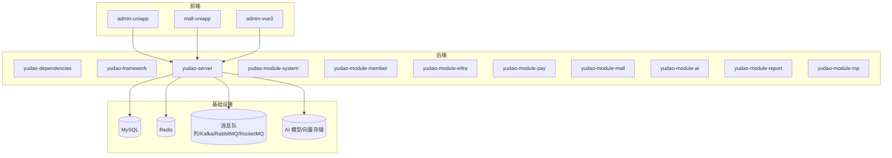
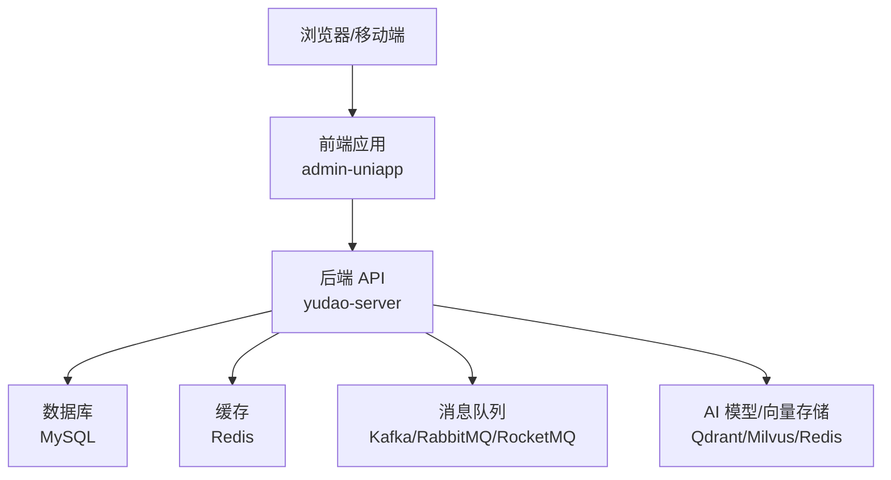
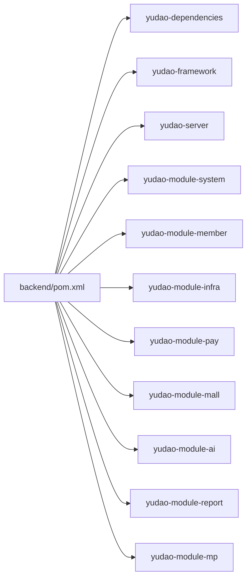

# 开发环境搭建

<cite>
**本文档引用的文件**
- [README.md](file://README.md)
- [pom.xml](file://backend/pom.xml)
- [docker-compose.yml](file://backend/script/docker/docker-compose.yml)
- [docker.env](file://backend/script/docker/docker.env)
- [application.yaml](file://backend/yudao-server/src/main/resources/application.yaml)
- [application-local.yaml](file://backend/yudao-server/src/main/resources/application-local.yaml)
- [ruoyi-vue-pro.sql](file://backend/sql/mysql/ruoyi-vue-pro.sql)
- [package.json](file://frontend/admin-uniapp/package.json)
- [vite.config.ts](file://frontend/admin-uniapp/vite.config.ts)
</cite>

## 目录
1. [简介](#简介)
2. [项目结构](#项目结构)
3. [核心组件](#核心组件)
4. [架构概览](#架构概览)
5. [详细组件分析](#详细组件分析)
6. [依赖分析](#依赖分析)
7. [性能考虑](#性能考虑)
8. [故障排除指南](#故障排除指南)
9. [结论](#结论)
10. [附录](#附录)

## 简介
本指南面向希望在本地快速搭建 AgenticCPS 开发环境的开发者。AgenticCPS 是一套融合 Vibe Coding、低代码与 AI 自主编程的智能 CPS 联盟返利平台，采用前后端分离架构：后端基于 Spring Boot 3.5.9 + Java 17/21，前端采用 Vue 3 + UniApp，数据库支持 MySQL 5.7/8.0+，并集成了 Redis、定时任务、消息队列、AI 大模型与 MCP 协议等能力。

本指南将详细说明：
- 环境要求与安装配置（JDK 17/21、MySQL 5.7/8.0+、Redis 5.0+、Maven 3.8+、Node.js 16+）
- 项目克隆、依赖安装、数据库初始化步骤
- 环境变量配置、IDE 设置、开发工具推荐
- 常见环境问题排查、性能优化建议、开发环境最佳实践

## 项目结构
AgenticCPS 采用多模块 Maven 架构，后端包含 yudao-dependencies、yudao-framework、yudao-server 以及多个业务模块；前端包含 admin-uniapp 等多端应用；同时提供 Docker Compose 快速启动方案。

**图表来源**
- [pom.xml:10-24](file://backend/pom.xml#L10-L24)
- [docker-compose.yml:5-57](file://backend/script/docker/docker-compose.yml#L5-L57)

**章节来源**
- [pom.xml:10-24](file://backend/pom.xml#L10-L24)
- [README.md:267-302](file://README.md#L267-L302)

## 核心组件
- 后端框架：Spring Boot 3.5.9、Spring Security、MyBatis Plus、Redis/Redisson、Flowable 工作流、Vue 3 + Element Plus、UniApp、MySQL、MapStruct、Quartz、SkyWalking
- 前端框架：Vue 3、Element Plus、UniApp、Vite、TypeScript、Pinia、Vue Router
- 基础设施：MySQL 5.7/8.0+、Redis 5.0+、消息队列（Kafka/RabbitMQ/RocketMQ）、AI 向量存储（Redis/Qdrant/Milvus）

**章节来源**
- [README.md:286-302](file://README.md#L286-L302)
- [application.yaml:1-362](file://backend/yudao-server/src/main/resources/application.yaml#L1-L362)

## 架构概览
后端通过 yudao-server 作为统一入口，整合多模块业务；前端通过 admin-uniapp 提供管理后台，支持多端构建（H5、小程序、App）。Docker Compose 提供一键启动数据库、缓存与后端服务。

**图表来源**
- [docker-compose.yml:29-78](file://backend/script/docker/docker-compose.yml#L29-L78)
- [application.yaml:120-145](file://backend/yudao-server/src/main/resources/application.yaml#L120-L145)

## 详细组件分析

### 环境要求与安装配置

- JDK 17/21
  - 项目使用 Java 17 作为默认编译版本，可在 17 或 21 上运行
  - 建议使用 SDKMAN 或 OpenJDK 官方安装包
  - 验证命令：java -version、javac -version

- MySQL 5.7/8.0+
  - 支持多种数据库（MySQL、PostgreSQL、Oracle、SQLServer 等），默认使用 MySQL
  - 建议使用 8.0+ 以获得更好的性能与特性
  - 初始化脚本位于 backend/sql/mysql/ruoyi-vue-pro.sql

- Redis 5.0+
  - 用于缓存、分布式锁、会话存储等
  - 建议启用持久化与合理内存上限

- Maven 3.8+
  - 使用 Maven 3.8+ 进行依赖管理与打包
  - 建议配置阿里云/华为云镜像加速

- Node.js 16+
  - 前端构建与开发使用 Node.js 16+
  - 建议使用 nvm 管理多版本 Node.js

**章节来源**
- [pom.xml:30-44](file://backend/pom.xml#L30-L44)
- [README.md:307-316](file://README.md#L307-L316)

### 项目克隆与依赖安装

- 克隆后端项目
  - 使用 Git 克隆仓库到本地目录
  - 进入 backend 目录，执行 Maven 编译与打包

- 克隆前端项目
  - 进入 frontend/admin-uniapp 目录
  - 使用 pnpm 安装依赖（package.json 中声明了 pnpm 版本要求）

- Docker 快速启动（可选）
  - 使用 docker-compose.yml 一键启动 MySQL、Redis、后端服务与前端管理后台
  - 环境变量通过 docker.env 配置

**章节来源**
- [README.md:317-330](file://README.md#L317-L330)
- [docker-compose.yml:1-85](file://backend/script/docker/docker-compose.yml#L1-L85)
- [docker.env:1-26](file://backend/script/docker/docker.env#L1-L26)

### 数据库初始化步骤

- MySQL 初始化
  - 启动 MySQL 服务（本地或 Docker）
  - 执行 backend/sql/mysql/ruoyi-vue-pro.sql 脚本创建数据库与表结构
  - 配置数据库连接信息（主机、端口、用户名、密码）

- Redis 初始化
  - 启动 Redis 服务
  - 配置连接信息（主机、端口、密码）

- 后端配置
  - application.yaml 指定活动 Profile 为 local
  - application-local.yaml 中配置数据源、Redis、定时任务、监控等参数

**章节来源**
- [ruoyi-vue-pro.sql:1-200](file://backend/sql/mysql/ruoyi-vue-pro.sql#L1-L200)
- [application.yaml:5-6](file://backend/yudao-server/src/main/resources/application.yaml#L5-L6)
- [application-local.yaml:4-87](file://backend/yudao-server/src/main/resources/application-local.yaml#L4-L87)

### 环境变量配置

- 后端环境变量
  - SPRING_PROFILES_ACTIVE: local
  - 数据源相关：MASTER_DATASOURCE_URL、USERNAME、PASSWORD
  - Redis 相关：REDIS_HOST
  - JVM 参数：JAVA_OPTS

- 前端环境变量
  - VITE_APP_PORT：开发服务器端口
  - VITE_SERVER_BASEURL：后端 API 基础地址
  - VITE_APP_PROXY_ENABLE：是否启用代理
  - VITE_APP_PROXY_PREFIX：代理前缀
  - VITE_APP_PUBLIC_BASE：静态资源公共路径

- Docker 环境变量
  - MYSQL_DATABASE、MYSQL_ROOT_PASSWORD
  - NODE_ENV、PUBLIC_PATH、VUE_APP_TITLE 等前端构建参数

**章节来源**
- [docker.env:1-26](file://backend/script/docker/docker.env#L1-L26)
- [docker-compose.yml:37-56](file://backend/script/docker/docker-compose.yml#L37-L56)
- [vite.config.ts:51-62](file://frontend/admin-uniapp/vite.config.ts#L51-L62)

### IDE 设置与开发工具推荐

- 后端 IDE 推荐
  - IntelliJ IDEA：启用 Lombok、MapStruct 注解处理器、Spring Boot 插件
  - Maven Settings：配置阿里云/华为云镜像，加速依赖下载
  - 运行配置：设置 VM Options 与 Program Arguments

- 前端 IDE 推荐
  - VS Code：安装 Vue、TypeScript、ESLint、Prettier 插件
  - Vite Dev Server：使用 pnpm scripts 启动开发服务器
  - UniApp 调试：支持 H5、小程序、App 多端调试

- 开发工具
  - Postman：API 接口测试
  - Navicat/DBeaver：数据库管理
  - Redis Desktop Manager：Redis 管理
  - Docker Desktop：容器化开发与部署

**章节来源**
- [pom.xml:74-104](file://backend/pom.xml#L74-L104)
- [package.json:25-28](file://frontend/admin-uniapp/package.json#L25-L28)
- [vite.config.ts:33-62](file://frontend/admin-uniapp/vite.config.ts#L33-L62)

### 开发工具推荐

- 后端
  - Lombok：简化 POJO 代码
  - MapStruct：对象映射
  - Spring Boot DevTools：热部署
  - Swagger UI：接口文档

- 前端
  - Vite：快速构建工具
  - UnoCSS：原子化 CSS
  - Pinia：状态管理
  - Vue Router：路由管理

**章节来源**
- [pom.xml:40-43](file://backend/pom.xml#L40-L43)
- [application.yaml:40-54](file://backend/yudao-server/src/main/resources/application.yaml#L40-L54)
- [package.json:99-127](file://frontend/admin-uniapp/package.json#L99-L127)

## 依赖分析

**图表来源**
- [pom.xml:10-24](file://backend/pom.xml#L10-L24)

**章节来源**
- [pom.xml:10-24](file://backend/pom.xml#L10-L24)

## 性能考虑
- 数据库性能
  - 合理设置连接池大小（初始连接、最小空闲、最大活跃）
  - 启用慢 SQL 记录与监控（Druid 控制台）
  - 为高频查询建立合适索引

- 缓存策略
  - 使用 Redis 缓存热点数据与会话
  - 合理设置过期时间与内存上限

- 定时任务
  - Quartz 使用 JDBC 存储，避免内存模式
  - 合理配置线程池大小与集群检查频率

- 前端性能
  - 使用 Vite 构建，启用代码分割与懒加载
  - 生产环境移除 console 语句与 SourceMap

**章节来源**
- [application-local.yaml:32-79](file://backend/yudao-server/src/main/resources/application-local.yaml#L32-L79)
- [application.yaml:66-89](file://backend/yudao-server/src/main/resources/application.yaml#L66-L89)
- [vite.config.ts:204-211](file://frontend/admin-uniapp/vite.config.ts#L204-L211)

## 故障排除指南

- 后端启动失败
  - 检查数据库连接参数与网络连通性
  - 确认 Redis 服务正常运行
  - 查看 Druid 监控页面定位慢 SQL

- 前端代理问题
  - 确认 VITE_SERVER_BASEURL 与后端 API 前缀一致
  - 检查代理配置与跨域设置

- Docker 启动异常
  - 检查端口占用与卷挂载路径
  - 确认环境变量值正确（如数据库密码、Redis 地址）

- 依赖下载缓慢
  - 配置 Maven 镜像源（阿里云/华为云）
  - 使用 pnpm 替代 npm/yarn，提升依赖安装速度

**章节来源**
- [application-local.yaml:14-87](file://backend/yudao-server/src/main/resources/application-local.yaml#L14-L87)
- [docker-compose.yml:11-56](file://backend/script/docker/docker-compose.yml#L11-L56)
- [vite.config.ts:185-200](file://frontend/admin-uniapp/vite.config.ts#L185-L200)

## 结论
通过本指南，开发者可以快速完成 AgenticCPS 的开发环境搭建，涵盖后端、前端、数据库与缓存的配置要点，并提供 Docker 快速启动方案。建议在本地开发时结合 IDE 插件与调试工具，配合性能监控与日志分析，持续优化开发体验与系统性能。

## 附录

### 快速开始步骤
- 克隆项目：git clone 仓库地址
- 初始化数据库：执行 ruoyi-vue-pro.sql
- 启动后端：mvn clean compile，运行 YudaoServerApplication
- 启动前端：pnpm install，pnpm dev:h5
- 可选：docker-compose up 启动完整环境

**章节来源**
- [README.md:317-330](file://README.md#L317-L330)