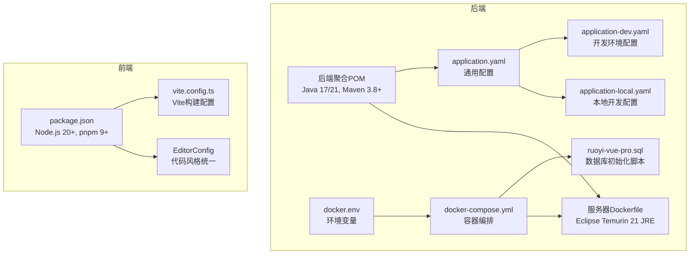
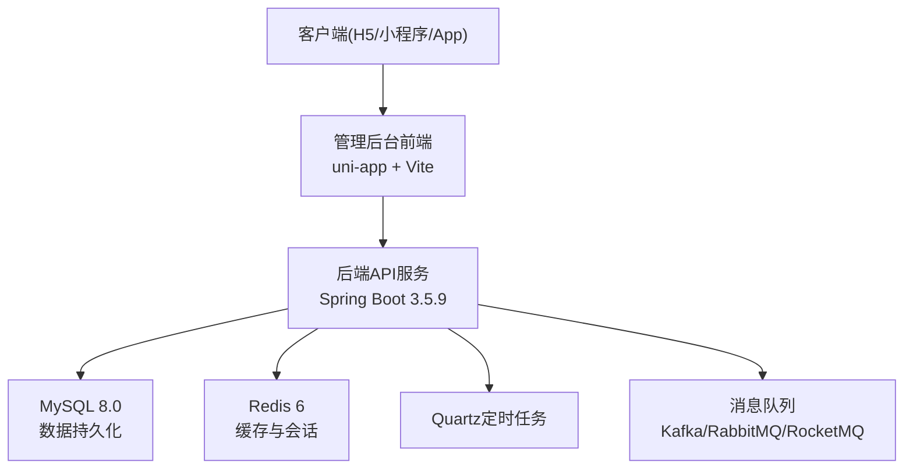
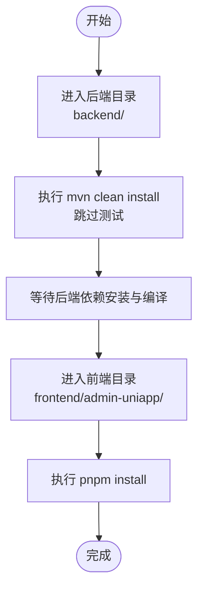
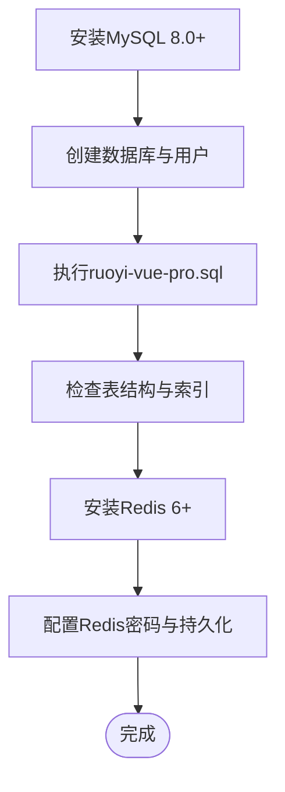
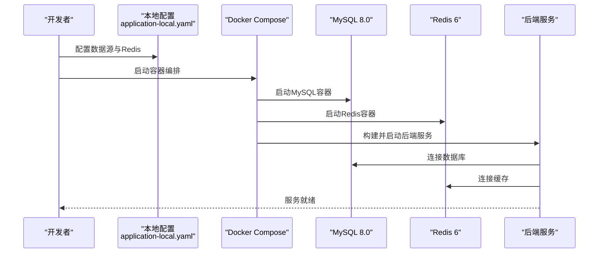
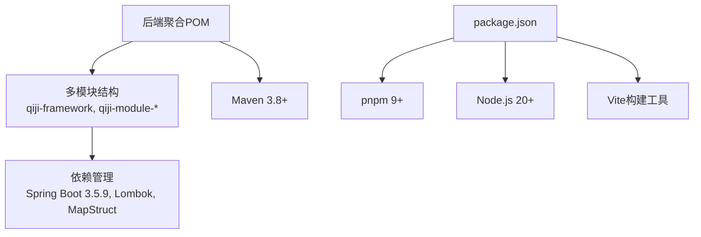

# 开发环境配置

<cite>
**本文引用的文件**   
- [后端聚合POM](file://backend/pom.xml)
- [后端服务器Dockerfile](file://backend/qiji-server/Dockerfile)
- [后端本地配置application-local.yaml](file://backend/qiji-server/src/main/resources/application-local.yaml)
- [后端通用配置application.yaml](file://backend/qiji-server/src/main/resources/application.yaml)
- [后端开发配置application-dev.yaml](file://backend/qiji-server/src/main/resources/application-dev.yaml)
- [后端Docker Compose](file://backend/script/docker/docker-compose.yml)
- [后端Docker环境变量](file://backend/script/docker/docker.env)
- [后端Lombok配置](file://backend/lombok.config)
- [前端包管理配置package.json](file://frontend/admin-uniapp/package.json)
- [前端Vite配置vite.config.ts](file://frontend/admin-uniapp/vite.config.ts)
- [前端EditorConfig](file://frontend/admin-uniapp/.editorconfig)
- [MySQL初始化SQL](file://backend/sql/mysql/ruoyi-vue-pro.sql)
</cite>

## 目录
1. [简介](#简介)
2. [项目结构](#项目结构)
3. [核心组件](#核心组件)
4. [架构概览](#架构概览)
5. [详细组件分析](#详细组件分析)
6. [依赖分析](#依赖分析)
7. [性能考虑](#性能考虑)
8. [故障排除指南](#故障排除指南)
9. [结论](#结论)
10. [附录](#附录)

## 简介
本指南面向AgenticCPS项目的开发者，提供从零开始搭建完整开发环境的详细步骤，涵盖IDE配置建议、开发工具链安装、项目依赖安装、数据库初始化、本地调试配置以及常见问题解决方案。文档同时给出Docker一键部署方案与性能优化建议，帮助团队快速上手并保持开发效率。

## 项目结构
AgenticCPS采用前后端分离架构：
- 后端：基于Spring Boot 3.5.9，使用Maven多模块管理，包含框架层、业务模块、基础设施模块与服务端模块
- 前端：基于uni-app生态，使用Vite构建，支持H5、小程序、App多端输出
- 数据库：MySQL 8.0+，配合Redis 6+，Quartz定时任务
- 开发工具：Java 17/21、Node.js 20+、pnpm 9+

**图表来源**
- [后端聚合POM:1-176](file://backend/pom.xml#L1-L176)
- [后端服务器Dockerfile:1-24](file://backend/qiji-server/Dockerfile#L1-L24)
- [后端本地配置application-local.yaml:1-294](file://backend/qiji-server/src/main/resources/application-local.yaml#L1-L294)
- [后端通用配置application.yaml:1-362](file://backend/qiji-server/src/main/resources/application.yaml#L1-L362)
- [后端开发配置application-dev.yaml:1-213](file://backend/qiji-server/src/main/resources/application-dev.yaml#L1-L213)
- [后端Docker Compose:1-85](file://backend/script/docker/docker-compose.yml#L1-L85)
- [后端Docker环境变量:1-26](file://backend/script/docker/docker.env#L1-L26)
- [前端包管理配置package.json:1-194](file://frontend/admin-uniapp/package.json#L1-L194)
- [前端Vite配置vite.config.ts:1-214](file://frontend/admin-uniapp/vite.config.ts#L1-L214)
- [前端EditorConfig:1-14](file://frontend/admin-uniapp/.editorconfig#L1-L14)

**章节来源**
- [后端聚合POM:1-176](file://backend/pom.xml#L1-L176)
- [前端包管理配置package.json:1-194](file://frontend/admin-uniapp/package.json#L1-L194)

## 核心组件
- Java与Maven：后端使用Java 17/21与Maven 3.8+，确保编译插件与依赖管理一致
- Node.js与pnpm：前端使用Node.js 20+与pnpm 9+，保证包管理器版本与脚本兼容
- 数据库与缓存：MySQL 8.0+与Redis 6+，配合Quartz定时任务
- 容器化：Docker Compose一键部署，包含MySQL、Redis与后端服务
- IDE配置：统一代码风格、格式化与静态检查

**章节来源**
- [后端聚合POM:31-45](file://backend/pom.xml#L31-L45)
- [前端包管理配置package.json:25-28](file://frontend/admin-uniapp/package.json#L25-L28)
- [后端Docker Compose:1-85](file://backend/script/docker/docker-compose.yml#L1-L85)

## 架构概览
AgenticCPS采用微服务化的多模块后端架构，结合容器化部署实现快速迭代与稳定运行。

**图表来源**
- [后端通用配置application.yaml:120-145](file://backend/qiji-server/src/main/resources/application.yaml#L120-L145)
- [后端本地配置application-local.yaml:119-135](file://backend/qiji-server/src/main/resources/application-local.yaml#L119-L135)

## 详细组件分析

### IDE配置建议
- IntelliJ IDEA
  - 插件：Lombok、MapStruct Support、MyBatis Log Plugin、Rainbow Brackets
  - 代码风格：使用EditorConfig统一缩进与编码
  - 编译配置：确保JDK 17/21与Maven 3.8+正确配置
- VS Code
  - 插件：ESLint、Prettier、EditorConfig、Vetur/Volar、UniApp相关插件
  - 设置：启用EditorConfig，配置格式化与保存行为
  - 前端调试：使用Vite Dev Server进行H5调试

**章节来源**
- [前端EditorConfig:1-14](file://frontend/admin-uniapp/.editorconfig#L1-L14)
- [后端Lombok配置:1-5](file://backend/lombok.config#L1-L5)

### 开发工具链配置
- Java 17/21
  - 下载并安装对应版本JDK
  - 配置JAVA_HOME与PATH
  - 在IDE中选择正确的JDK版本
- Maven 3.8+
  - 下载并安装Maven
  - 配置本地仓库与镜像源
  - 验证mvn -version
- Node.js 20+
  - 下载并安装Node.js 20+
  - 配置npm镜像源
  - 验证node -v与npm -v
- pnpm 9+
  - 安装pnpm 9+
  - 验证pnpm -v
  - 使用pnpm install进行依赖安装

**章节来源**
- [后端聚合POM:31-45](file://backend/pom.xml#L31-L45)
- [前端包管理配置package.json:25-28](file://frontend/admin-uniapp/package.json#L25-L28)

### 项目依赖安装步骤
- 后端Maven依赖
  - 进入backend目录
  - 执行mvn clean install -DskipTests
  - 等待依赖下载与编译完成
- 前端pnpm依赖
  - 进入frontend/admin-uniapp目录
  - 执行pnpm install
  - 等待依赖安装完成

**图表来源**
- [后端聚合POM:114-142](file://backend/pom.xml#L114-L142)
- [前端包管理配置package.json:1-194](file://frontend/admin-uniapp/package.json#L1-L194)

**章节来源**
- [后端聚合POM:114-142](file://backend/pom.xml#L114-L142)
- [前端包管理配置package.json:1-194](file://frontend/admin-uniapp/package.json#L1-L194)

### 数据库初始化配置
- MySQL 8.0+安装与配置
  - 安装MySQL 8.0
  - 创建数据库与用户
  - 修改root密码
- Redis 6+安装
  - 安装Redis 6
  - 配置密码与持久化
- 数据库脚本执行
  - 使用ruoyi-vue-pro.sql初始化数据库结构
  - 确认表结构与索引创建成功

**图表来源**
- [MySQL初始化SQL:1-200](file://backend/sql/mysql/ruoyi-vue-pro.sql#L1-L200)
- [后端Docker Compose:6-28](file://backend/script/docker/docker-compose.yml#L6-L28)

**章节来源**
- [MySQL初始化SQL:1-200](file://backend/sql/mysql/ruoyi-vue-pro.sql#L1-L200)
- [后端Docker Compose:6-28](file://backend/script/docker/docker-compose.yml#L6-L28)

### 本地调试配置
- application-local.yaml配置
  - 数据源：配置MySQL连接参数与Druid连接池
  - Redis：配置Redis连接参数
  - Quartz：配置定时任务存储与线程池
  - Actuator：开放监控端点
- Docker一键部署
  - 使用docker-compose.yml一键启动MySQL、Redis与后端服务
  - 通过docker.env设置环境变量
  - 确认端口映射与网络配置

**图表来源**
- [后端本地配置application-local.yaml:4-87](file://backend/qiji-server/src/main/resources/application-local.yaml#L4-L87)
- [后端Docker Compose:29-57](file://backend/script/docker/docker-compose.yml#L29-L57)

**章节来源**
- [后端本地配置application-local.yaml:1-294](file://backend/qiji-server/src/main/resources/application-local.yaml#L1-L294)
- [后端Docker Compose:1-85](file://backend/script/docker/docker-compose.yml#L1-L85)
- [后端Docker环境变量:1-26](file://backend/script/docker/docker.env#L1-L26)

### 前端开发配置
- Node.js与pnpm版本要求
  - Node.js >= 20
  - pnpm >= 9
- Vite开发服务器
  - 配置代理与端口
  - 支持H5、小程序、App多端调试
- 代码风格与格式化
  - 使用EditorConfig统一代码风格
  - 配置ESLint与Prettier

**章节来源**
- [前端包管理配置package.json:25-28](file://frontend/admin-uniapp/package.json#L25-L28)
- [前端Vite配置vite.config.ts:185-200](file://frontend/admin-uniapp/vite.config.ts#L185-L200)
- [前端EditorConfig:1-14](file://frontend/admin-uniapp/.editorconfig#L1-L14)

## 依赖分析
后端使用Maven多模块管理，统一版本控制与插件配置；前端使用pnpm进行依赖管理，确保版本一致性与安装效率。

**图表来源**
- [后端聚合POM:10-25](file://backend/pom.xml#L10-L25)
- [前端包管理配置package.json:1-194](file://frontend/admin-uniapp/package.json#L1-L194)

**章节来源**
- [后端聚合POM:10-25](file://backend/pom.xml#L10-L25)
- [前端包管理配置package.json:1-194](file://frontend/admin-uniapp/package.json#L1-L194)

## 性能考虑
- JVM参数调优：通过JAVA_OPTS调整堆大小与安全随机数源
- 数据库连接池：合理配置Druid连接池参数，避免连接泄漏
- 缓存策略：使用Redis缓存热点数据，降低数据库压力
- 定时任务：根据业务需求调整Quartz线程池大小与集群配置
- 前端构建：生产环境启用代码压缩与按需加载，减少包体积

**章节来源**
- [后端服务器Dockerfile:11-14](file://backend/qiji-server/Dockerfile#L11-L14)
- [后端本地配置application-local.yaml:32-47](file://backend/qiji-server/src/main/resources/application-local.yaml#L32-L47)
- [后端通用配置application.yaml:120-145](file://backend/qiji-server/src/main/resources/application.yaml#L120-L145)

## 故障排除指南
- 后端启动失败
  - 检查application-local.yaml中的数据库连接参数
  - 确认MySQL与Redis服务正常运行
  - 查看日志文件定位具体错误
- 前端页面空白
  - 检查Vite代理配置与后端API地址
  - 确认CORS与跨域设置
  - 清理浏览器缓存与node_modules重新安装
- 数据库初始化失败
  - 确认MySQL版本与字符集设置
  - 检查SQL脚本执行权限
  - 验证数据库用户权限

**章节来源**
- [后端本地配置application-local.yaml:4-87](file://backend/qiji-server/src/main/resources/application-local.yaml#L4-L87)
- [后端Docker Compose:6-28](file://backend/script/docker/docker-compose.yml#L6-L28)
- [前端Vite配置vite.config.ts:185-200](file://frontend/admin-uniapp/vite.config.ts#L185-L200)

## 结论
通过本指南，开发者可以快速完成AgenticCPS的开发环境搭建，包括IDE配置、工具链安装、依赖管理、数据库初始化与本地调试。建议团队在开发过程中遵循统一的代码风格与配置规范，利用Docker实现环境一致性，并持续关注性能优化与故障排查的最佳实践。

## 附录
- 快速命令清单
  - 后端：mvn clean install -DskipTests
  - 前端：pnpm install
  - 容器：docker-compose up -d
- 常用端口
  - 后端：48080
  - MySQL：3306
  - Redis：6379
  - 管理后台：8080